cola Report for GDS4088
==================

**Date**: 2019-12-25 21:09:11 CET, **cola version**: 1.3.2

----------------------------------------------------------------

<style type='text/css'>

body, td, th {
   font-family: Arial,Helvetica,sans-serif;
   background-color: white;
   font-size: 13px;
  max-width: 800px;
  margin: auto;
  margin-left:210px;
  padding: 0px 10px 0px 10px;
  border-left: 1px solid #EEEEEE;
  line-height: 150%;
}

tt, code, pre {
   font-family: 'DejaVu Sans Mono', 'Droid Sans Mono', 'Lucida Console', Consolas, Monaco, 

monospace;
}

h1 {
   font-size:2.2em;
}

h2 {
   font-size:1.8em;
}

h3 {
   font-size:1.4em;
}

h4 {
   font-size:1.0em;
}

h5 {
   font-size:0.9em;
}

h6 {
   font-size:0.8em;
}

a {
  text-decoration: none;
  color: #0366d6;
}

a:hover {
  text-decoration: underline;
}

a:visited {
   color: #0366d6;
}

pre, img {
  max-width: 100%;
}
pre {
  overflow-x: auto;
}
pre code {
   display: block; padding: 0.5em;
}

code {
  font-size: 92%;
  border: 1px solid #ccc;
}

code[class] {
  background-color: #F8F8F8;
}

table, td, th {
  border: 1px solid #ccc;
}

blockquote {
   color:#666666;
   margin:0;
   padding-left: 1em;
   border-left: 0.5em #EEE solid;
}

hr {
   height: 0px;
   border-bottom: none;
   border-top-width: thin;
   border-top-style: dotted;
   border-top-color: #999999;
}

@media print {
   * {
      background: transparent !important;
      color: black !important;
      filter:none !important;
      -ms-filter: none !important;
   }

   body {
      font-size:12pt;
      max-width:100%;
   }

   a, a:visited {
      text-decoration: underline;
   }

   hr {
      visibility: hidden;
      page-break-before: always;
   }

   pre, blockquote {
      padding-right: 1em;
      page-break-inside: avoid;
   }

   tr, img {
      page-break-inside: avoid;
   }

   img {
      max-width: 100% !important;
   }

   @page :left {
      margin: 15mm 20mm 15mm 10mm;
   }

   @page :right {
      margin: 15mm 10mm 15mm 20mm;
   }

   p, h2, h3 {
      orphans: 3; widows: 3;
   }

   h2, h3 {
      page-break-after: avoid;
   }
}
</style>


## Summary


All available functions which can be applied to this `res_list` object:


```r
res_list
```

```
#> A 'ConsensusPartitionList' object with 24 methods.
#>   On a matrix with 21168 rows and 86 columns.
#>   Top rows are extracted by 'SD, CV, MAD, ATC' methods.
#>   Subgroups are detected by 'hclust, kmeans, skmeans, pam, mclust, NMF' method.
#>   Number of partitions are tried for k = 2, 3, 4, 5, 6.
#>   Performed in total 30000 partitions by row resampling.
#> 
#> Following methods can be applied to this 'ConsensusPartitionList' object:
#>  [1] "cola_report"           "collect_classes"       "collect_plots"         "collect_stats"        
#>  [5] "colnames"              "functional_enrichment" "get_anno_col"          "get_anno"             
#>  [9] "get_classes"           "get_matrix"            "get_membership"        "get_stats"            
#> [13] "is_best_k"             "is_stable_k"           "ncol"                  "nrow"                 
#> [17] "rownames"              "show"                  "suggest_best_k"        "test_to_known_factors"
#> [21] "top_rows_heatmap"      "top_rows_overlap"     
#> 
#> You can get result for a single method by, e.g. object["SD", "hclust"] or object["SD:hclust"]
#> or a subset of methods by object[c("SD", "CV")], c("hclust", "kmeans")]
```

The call of `run_all_consensus_partition_methods()` was:


```
#> run_all_consensus_partition_methods(data = mat, mc.cores = 4, anno = anno)
```

Dimension of the input matrix:


```r
mat = get_matrix(res_list)
dim(mat)
```

```
#> [1] 21168    86
```

### Density distribution

The density distribution for each sample is visualized as in one column in the
following heatmap. The clustering is based on the distance which is the
Kolmogorov-Smirnov statistic between two distributions.


```r
library(ComplexHeatmap)
densityHeatmap(mat, top_annotation = HeatmapAnnotation(df = get_anno(res_list), 
    col = get_anno_col(res_list)), ylab = "value", cluster_columns = TRUE, show_column_names = FALSE,
    mc.cores = 4)
```


### Suggest the best k


Folowing table shows the best `k` (number of partitions) for each combination
of top-value methods and partition methods. Clicking on the method name in
the table goes to the section for a single combination of methods.

[The cola vignette](http://bioconductor.org/packages/devel/bioc/vignettes/cola/inst/doc/cola.html#toc_13)
explains the definition of the metrics used for determining the best
number of partitions.


```r
suggest_best_k(res_list)
```


|                            | The best k| 1-PAC| Mean silhouette| Concordance|   |Optional k |
|:---------------------------|----------:|-----:|---------------:|-----------:|:--|:----------|
|[ATC:kmeans](#ATC-kmeans)   |          2| 1.000|           0.993|       0.993|** |           |
|[ATC:NMF](#ATC-NMF)         |          2| 0.999|           0.962|       0.984|** |           |
|[ATC:skmeans](#ATC-skmeans) |          3| 0.963|           0.957|       0.979|** |2          |
|[MAD:mclust](#MAD-mclust)   |          4| 0.945|           0.927|       0.953|*  |           |
|[ATC:pam](#ATC-pam)         |          4| 0.916|           0.871|       0.952|*  |2          |
|[MAD:pam](#MAD-pam)         |          2| 0.904|           0.946|       0.975|*  |           |
|[MAD:NMF](#MAD-NMF)         |          2| 0.900|           0.917|       0.962|   |           |
|[SD:mclust](#SD-mclust)     |          5| 0.881|           0.875|       0.928|   |           |
|[CV:pam](#CV-pam)           |          2| 0.832|           0.906|       0.958|   |           |
|[SD:pam](#SD-pam)           |          2| 0.812|           0.926|       0.965|   |           |
|[CV:NMF](#CV-NMF)           |          3| 0.801|           0.862|       0.939|   |           |
|[CV:mclust](#CV-mclust)     |          5| 0.769|           0.782|       0.879|   |           |
|[SD:NMF](#SD-NMF)           |          3| 0.765|           0.860|       0.934|   |           |
|[ATC:hclust](#ATC-hclust)   |          5| 0.762|           0.775|       0.878|   |           |
|[ATC:mclust](#ATC-mclust)   |          5| 0.750|           0.769|       0.872|   |           |
|[CV:skmeans](#CV-skmeans)   |          3| 0.712|           0.833|       0.920|   |           |
|[MAD:skmeans](#MAD-skmeans) |          2| 0.706|           0.885|       0.940|   |           |
|[SD:skmeans](#SD-skmeans)   |          3| 0.687|           0.854|       0.922|   |           |
|[MAD:hclust](#MAD-hclust)   |          3| 0.685|           0.789|       0.898|   |           |
|[CV:hclust](#CV-hclust)     |          3| 0.663|           0.847|       0.928|   |           |
|[SD:hclust](#SD-hclust)     |          3| 0.441|           0.783|       0.889|   |           |
|[SD:kmeans](#SD-kmeans)     |          3| 0.285|           0.685|       0.798|   |           |
|[CV:kmeans](#CV-kmeans)     |          3| 0.277|           0.656|       0.785|   |           |
|[MAD:kmeans](#MAD-kmeans)   |          2| 0.188|           0.617|       0.756|   |           |

\*\*: 1-PAC > 0.95, \*: 1-PAC > 0.9


### CDF of consensus matrices

Cumulative distribution function curves of consensus matrix for all methods.


```r
collect_plots(res_list, fun = plot_ecdf)
```


### Consensus heatmap

Consensus heatmaps for all methods. ([What is a consensus heatmap?](http://bioconductor.org/packages/devel/bioc/vignettes/cola/inst/doc/cola.html#toc_9))


<style type='text/css'>


.ui-helper-hidden {
	display: none;
}
.ui-helper-hidden-accessible {
	border: 0;
	clip: rect(0 0 0 0);
	height: 1px;
	margin: -1px;
	overflow: hidden;
	padding: 0;
	position: absolute;
	width: 1px;
}
.ui-helper-reset {
	margin: 0;
	padding: 0;
	border: 0;
	outline: 0;
	line-height: 1.3;
	text-decoration: none;
	font-size: 100%;
	list-style: none;
}
.ui-helper-clearfix:before,
.ui-helper-clearfix:after {
	content: "";
	display: table;
	border-collapse: collapse;
}
.ui-helper-clearfix:after {
	clear: both;
}
.ui-helper-zfix {
	width: 100%;
	height: 100%;
	top: 0;
	left: 0;
	position: absolute;
	opacity: 0;
	filter:Alpha(Opacity=0); 
}

.ui-front {
	z-index: 100;
}


.ui-state-disabled {
	cursor: default !important;
	pointer-events: none;
}


.ui-icon {
	display: inline-block;
	vertical-align: middle;
	margin-top: -.25em;
	position: relative;
	text-indent: -99999px;
	overflow: hidden;
	background-repeat: no-repeat;
}

.ui-widget-icon-block {
	left: 50%;
	margin-left: -8px;
	display: block;
}


.ui-widget-overlay {
	position: fixed;
	top: 0;
	left: 0;
	width: 100%;
	height: 100%;
}
.ui-accordion .ui-accordion-header {
	display: block;
	cursor: pointer;
	position: relative;
	margin: 2px 0 0 0;
	padding: .5em .5em .5em .7em;
	font-size: 100%;
}
.ui-accordion .ui-accordion-content {
	padding: 1em 2.2em;
	border-top: 0;
	overflow: auto;
}
.ui-autocomplete {
	position: absolute;
	top: 0;
	left: 0;
	cursor: default;
}
.ui-menu {
	list-style: none;
	padding: 0;
	margin: 0;
	display: block;
	outline: 0;
}
.ui-menu .ui-menu {
	position: absolute;
}
.ui-menu .ui-menu-item {
	margin: 0;
	cursor: pointer;
	
	list-style-image: url("data:image/gif;base64,R0lGODlhAQABAIAAAAAAAP///yH5BAEAAAAALAAAAAABAAEAAAIBRAA7");
}
.ui-menu .ui-menu-item-wrapper {
	position: relative;
	padding: 3px 1em 3px .4em;
}
.ui-menu .ui-menu-divider {
	margin: 5px 0;
	height: 0;
	font-size: 0;
	line-height: 0;
	border-width: 1px 0 0 0;
}
.ui-menu .ui-state-focus,
.ui-menu .ui-state-active {
	margin: -1px;
}


.ui-menu-icons {
	position: relative;
}
.ui-menu-icons .ui-menu-item-wrapper {
	padding-left: 2em;
}


.ui-menu .ui-icon {
	position: absolute;
	top: 0;
	bottom: 0;
	left: .2em;
	margin: auto 0;
}


.ui-menu .ui-menu-icon {
	left: auto;
	right: 0;
}
.ui-button {
	padding: .4em 1em;
	display: inline-block;
	position: relative;
	line-height: normal;
	margin-right: .1em;
	cursor: pointer;
	vertical-align: middle;
	text-align: center;
	-webkit-user-select: none;
	-moz-user-select: none;
	-ms-user-select: none;
	user-select: none;

	
	overflow: visible;
}

.ui-button,
.ui-button:link,
.ui-button:visited,
.ui-button:hover,
.ui-button:active {
	text-decoration: none;
}


.ui-button-icon-only {
	width: 2em;
	box-sizing: border-box;
	text-indent: -9999px;
	white-space: nowrap;
}


input.ui-button.ui-button-icon-only {
	text-indent: 0;
}


.ui-button-icon-only .ui-icon {
	position: absolute;
	top: 50%;
	left: 50%;
	margin-top: -8px;
	margin-left: -8px;
}

.ui-button.ui-icon-notext .ui-icon {
	padding: 0;
	width: 2.1em;
	height: 2.1em;
	text-indent: -9999px;
	white-space: nowrap;

}

input.ui-button.ui-icon-notext .ui-icon {
	width: auto;
	height: auto;
	text-indent: 0;
	white-space: normal;
	padding: .4em 1em;
}


input.ui-button::-moz-focus-inner,
button.ui-button::-moz-focus-inner {
	border: 0;
	padding: 0;
}
.ui-controlgroup {
	vertical-align: middle;
	display: inline-block;
}
.ui-controlgroup > .ui-controlgroup-item {
	float: left;
	margin-left: 0;
	margin-right: 0;
}
.ui-controlgroup > .ui-controlgroup-item:focus,
.ui-controlgroup > .ui-controlgroup-item.ui-visual-focus {
	z-index: 9999;
}
.ui-controlgroup-vertical > .ui-controlgroup-item {
	display: block;
	float: none;
	width: 100%;
	margin-top: 0;
	margin-bottom: 0;
	text-align: left;
}
.ui-controlgroup-vertical .ui-controlgroup-item {
	box-sizing: border-box;
}
.ui-controlgroup .ui-controlgroup-label {
	padding: .4em 1em;
}
.ui-controlgroup .ui-controlgroup-label span {
	font-size: 80%;
}
.ui-controlgroup-horizontal .ui-controlgroup-label + .ui-controlgroup-item {
	border-left: none;
}
.ui-controlgroup-vertical .ui-controlgroup-label + .ui-controlgroup-item {
	border-top: none;
}
.ui-controlgroup-horizontal .ui-controlgroup-label.ui-widget-content {
	border-right: none;
}
.ui-controlgroup-vertical .ui-controlgroup-label.ui-widget-content {
	border-bottom: none;
}


.ui-controlgroup-vertical .ui-spinner-input {

	
	width: 75%;
	width: calc( 100% - 2.4em );
}
.ui-controlgroup-vertical .ui-spinner .ui-spinner-up {
	border-top-style: solid;
}

.ui-checkboxradio-label .ui-icon-background {
	box-shadow: inset 1px 1px 1px #ccc;
	border-radius: .12em;
	border: none;
}
.ui-checkboxradio-radio-label .ui-icon-background {
	width: 16px;
	height: 16px;
	border-radius: 1em;
	overflow: visible;
	border: none;
}
.ui-checkboxradio-radio-label.ui-checkboxradio-checked .ui-icon,
.ui-checkboxradio-radio-label.ui-checkboxradio-checked:hover .ui-icon {
	background-image: none;
	width: 8px;
	height: 8px;
	border-width: 4px;
	border-style: solid;
}
.ui-checkboxradio-disabled {
	pointer-events: none;
}
.ui-datepicker {
	width: 17em;
	padding: .2em .2em 0;
	display: none;
}
.ui-datepicker .ui-datepicker-header {
	position: relative;
	padding: .2em 0;
}
.ui-datepicker .ui-datepicker-prev,
.ui-datepicker .ui-datepicker-next {
	position: absolute;
	top: 2px;
	width: 1.8em;
	height: 1.8em;
}
.ui-datepicker .ui-datepicker-prev-hover,
.ui-datepicker .ui-datepicker-next-hover {
	top: 1px;
}
.ui-datepicker .ui-datepicker-prev {
	left: 2px;
}
.ui-datepicker .ui-datepicker-next {
	right: 2px;
}
.ui-datepicker .ui-datepicker-prev-hover {
	left: 1px;
}
.ui-datepicker .ui-datepicker-next-hover {
	right: 1px;
}
.ui-datepicker .ui-datepicker-prev span,
.ui-datepicker .ui-datepicker-next span {
	display: block;
	position: absolute;
	left: 50%;
	margin-left: -8px;
	top: 50%;
	margin-top: -8px;
}
.ui-datepicker .ui-datepicker-title {
	margin: 0 2.3em;
	line-height: 1.8em;
	text-align: center;
}
.ui-datepicker .ui-datepicker-title select {
	font-size: 1em;
	margin: 1px 0;
}
.ui-datepicker select.ui-datepicker-month,
.ui-datepicker select.ui-datepicker-year {
	width: 45%;
}
.ui-datepicker table {
	width: 100%;
	font-size: .9em;
	border-collapse: collapse;
	margin: 0 0 .4em;
}
.ui-datepicker th {
	padding: .7em .3em;
	text-align: center;
	font-weight: bold;
	border: 0;
}
.ui-datepicker td {
	border: 0;
	padding: 1px;
}
.ui-datepicker td span,
.ui-datepicker td a {
	display: block;
	padding: .2em;
	text-align: right;
	text-decoration: none;
}
.ui-datepicker .ui-datepicker-buttonpane {
	background-image: none;
	margin: .7em 0 0 0;
	padding: 0 .2em;
	border-left: 0;
	border-right: 0;
	border-bottom: 0;
}
.ui-datepicker .ui-datepicker-buttonpane button {
	float: right;
	margin: .5em .2em .4em;
	cursor: pointer;
	padding: .2em .6em .3em .6em;
	width: auto;
	overflow: visible;
}
.ui-datepicker .ui-datepicker-buttonpane button.ui-datepicker-current {
	float: left;
}


.ui-datepicker.ui-datepicker-multi {
	width: auto;
}
.ui-datepicker-multi .ui-datepicker-group {
	float: left;
}
.ui-datepicker-multi .ui-datepicker-group table {
	width: 95%;
	margin: 0 auto .4em;
}
.ui-datepicker-multi-2 .ui-datepicker-group {
	width: 50%;
}
.ui-datepicker-multi-3 .ui-datepicker-group {
	width: 33.3%;
}
.ui-datepicker-multi-4 .ui-datepicker-group {
	width: 25%;
}
.ui-datepicker-multi .ui-datepicker-group-last .ui-datepicker-header,
.ui-datepicker-multi .ui-datepicker-group-middle .ui-datepicker-header {
	border-left-width: 0;
}
.ui-datepicker-multi .ui-datepicker-buttonpane {
	clear: left;
}
.ui-datepicker-row-break {
	clear: both;
	width: 100%;
	font-size: 0;
}


.ui-datepicker-rtl {
	direction: rtl;
}
.ui-datepicker-rtl .ui-datepicker-prev {
	right: 2px;
	left: auto;
}
.ui-datepicker-rtl .ui-datepicker-next {
	left: 2px;
	right: auto;
}
.ui-datepicker-rtl .ui-datepicker-prev:hover {
	right: 1px;
	left: auto;
}
.ui-datepicker-rtl .ui-datepicker-next:hover {
	left: 1px;
	right: auto;
}
.ui-datepicker-rtl .ui-datepicker-buttonpane {
	clear: right;
}
.ui-datepicker-rtl .ui-datepicker-buttonpane button {
	float: left;
}
.ui-datepicker-rtl .ui-datepicker-buttonpane button.ui-datepicker-current,
.ui-datepicker-rtl .ui-datepicker-group {
	float: right;
}
.ui-datepicker-rtl .ui-datepicker-group-last .ui-datepicker-header,
.ui-datepicker-rtl .ui-datepicker-group-middle .ui-datepicker-header {
	border-right-width: 0;
	border-left-width: 1px;
}


.ui-datepicker .ui-icon {
	display: block;
	text-indent: -99999px;
	overflow: hidden;
	background-repeat: no-repeat;
	left: .5em;
	top: .3em;
}
.ui-dialog {
	position: absolute;
	top: 0;
	left: 0;
	padding: .2em;
	outline: 0;
}
.ui-dialog .ui-dialog-titlebar {
	padding: .4em 1em;
	position: relative;
}
.ui-dialog .ui-dialog-title {
	float: left;
	margin: .1em 0;
	white-space: nowrap;
	width: 90%;
	overflow: hidden;
	text-overflow: ellipsis;
}
.ui-dialog .ui-dialog-titlebar-close {
	position: absolute;
	right: .3em;
	top: 50%;
	width: 20px;
	margin: -10px 0 0 0;
	padding: 1px;
	height: 20px;
}
.ui-dialog .ui-dialog-content {
	position: relative;
	border: 0;
	padding: .5em 1em;
	background: none;
	overflow: auto;
}
.ui-dialog .ui-dialog-buttonpane {
	text-align: left;
	border-width: 1px 0 0 0;
	background-image: none;
	margin-top: .5em;
	padding: .3em 1em .5em .4em;
}
.ui-dialog .ui-dialog-buttonpane .ui-dialog-buttonset {
	float: right;
}
.ui-dialog .ui-dialog-buttonpane button {
	margin: .5em .4em .5em 0;
	cursor: pointer;
}
.ui-dialog .ui-resizable-n {
	height: 2px;
	top: 0;
}
.ui-dialog .ui-resizable-e {
	width: 2px;
	right: 0;
}
.ui-dialog .ui-resizable-s {
	height: 2px;
	bottom: 0;
}
.ui-dialog .ui-resizable-w {
	width: 2px;
	left: 0;
}
.ui-dialog .ui-resizable-se,
.ui-dialog .ui-resizable-sw,
.ui-dialog .ui-resizable-ne,
.ui-dialog .ui-resizable-nw {
	width: 7px;
	height: 7px;
}
.ui-dialog .ui-resizable-se {
	right: 0;
	bottom: 0;
}
.ui-dialog .ui-resizable-sw {
	left: 0;
	bottom: 0;
}
.ui-dialog .ui-resizable-ne {
	right: 0;
	top: 0;
}
.ui-dialog .ui-resizable-nw {
	left: 0;
	top: 0;
}
.ui-draggable .ui-dialog-titlebar {
	cursor: move;
}
.ui-draggable-handle {
	-ms-touch-action: none;
	touch-action: none;
}
.ui-resizable {
	position: relative;
}
.ui-resizable-handle {
	position: absolute;
	font-size: 0.1px;
	display: block;
	-ms-touch-action: none;
	touch-action: none;
}
.ui-resizable-disabled .ui-resizable-handle,
.ui-resizable-autohide .ui-resizable-handle {
	display: none;
}
.ui-resizable-n {
	cursor: n-resize;
	height: 7px;
	width: 100%;
	top: -5px;
	left: 0;
}
.ui-resizable-s {
	cursor: s-resize;
	height: 7px;
	width: 100%;
	bottom: -5px;
	left: 0;
}
.ui-resizable-e {
	cursor: e-resize;
	width: 7px;
	right: -5px;
	top: 0;
	height: 100%;
}
.ui-resizable-w {
	cursor: w-resize;
	width: 7px;
	left: -5px;
	top: 0;
	height: 100%;
}
.ui-resizable-se {
	cursor: se-resize;
	width: 12px;
	height: 12px;
	right: 1px;
	bottom: 1px;
}
.ui-resizable-sw {
	cursor: sw-resize;
	width: 9px;
	height: 9px;
	left: -5px;
	bottom: -5px;
}
.ui-resizable-nw {
	cursor: nw-resize;
	width: 9px;
	height: 9px;
	left: -5px;
	top: -5px;
}
.ui-resizable-ne {
	cursor: ne-resize;
	width: 9px;
	height: 9px;
	right: -5px;
	top: -5px;
}
.ui-progressbar {
	height: 2em;
	text-align: left;
	overflow: hidden;
}
.ui-progressbar .ui-progressbar-value {
	margin: -1px;
	height: 100%;
}
.ui-progressbar .ui-progressbar-overlay {
	background: url("data:image/gif;base64,R0lGODlhKAAoAIABAAAAAP///yH/C05FVFNDQVBFMi4wAwEAAAAh+QQJAQABACwAAAAAKAAoAAACkYwNqXrdC52DS06a7MFZI+4FHBCKoDeWKXqymPqGqxvJrXZbMx7Ttc+w9XgU2FB3lOyQRWET2IFGiU9m1frDVpxZZc6bfHwv4c1YXP6k1Vdy292Fb6UkuvFtXpvWSzA+HycXJHUXiGYIiMg2R6W459gnWGfHNdjIqDWVqemH2ekpObkpOlppWUqZiqr6edqqWQAAIfkECQEAAQAsAAAAACgAKAAAApSMgZnGfaqcg1E2uuzDmmHUBR8Qil95hiPKqWn3aqtLsS18y7G1SzNeowWBENtQd+T1JktP05nzPTdJZlR6vUxNWWjV+vUWhWNkWFwxl9VpZRedYcflIOLafaa28XdsH/ynlcc1uPVDZxQIR0K25+cICCmoqCe5mGhZOfeYSUh5yJcJyrkZWWpaR8doJ2o4NYq62lAAACH5BAkBAAEALAAAAAAoACgAAAKVDI4Yy22ZnINRNqosw0Bv7i1gyHUkFj7oSaWlu3ovC8GxNso5fluz3qLVhBVeT/Lz7ZTHyxL5dDalQWPVOsQWtRnuwXaFTj9jVVh8pma9JjZ4zYSj5ZOyma7uuolffh+IR5aW97cHuBUXKGKXlKjn+DiHWMcYJah4N0lYCMlJOXipGRr5qdgoSTrqWSq6WFl2ypoaUAAAIfkECQEAAQAsAAAAACgAKAAAApaEb6HLgd/iO7FNWtcFWe+ufODGjRfoiJ2akShbueb0wtI50zm02pbvwfWEMWBQ1zKGlLIhskiEPm9R6vRXxV4ZzWT2yHOGpWMyorblKlNp8HmHEb/lCXjcW7bmtXP8Xt229OVWR1fod2eWqNfHuMjXCPkIGNileOiImVmCOEmoSfn3yXlJWmoHGhqp6ilYuWYpmTqKUgAAIfkECQEAAQAsAAAAACgAKAAAApiEH6kb58biQ3FNWtMFWW3eNVcojuFGfqnZqSebuS06w5V80/X02pKe8zFwP6EFWOT1lDFk8rGERh1TTNOocQ61Hm4Xm2VexUHpzjymViHrFbiELsefVrn6XKfnt2Q9G/+Xdie499XHd2g4h7ioOGhXGJboGAnXSBnoBwKYyfioubZJ2Hn0RuRZaflZOil56Zp6iioKSXpUAAAh+QQJAQABACwAAAAAKAAoAAACkoQRqRvnxuI7kU1a1UU5bd5tnSeOZXhmn5lWK3qNTWvRdQxP8qvaC+/yaYQzXO7BMvaUEmJRd3TsiMAgswmNYrSgZdYrTX6tSHGZO73ezuAw2uxuQ+BbeZfMxsexY35+/Qe4J1inV0g4x3WHuMhIl2jXOKT2Q+VU5fgoSUI52VfZyfkJGkha6jmY+aaYdirq+lQAACH5BAkBAAEALAAAAAAoACgAAAKWBIKpYe0L3YNKToqswUlvznigd4wiR4KhZrKt9Upqip61i9E3vMvxRdHlbEFiEXfk9YARYxOZZD6VQ2pUunBmtRXo1Lf8hMVVcNl8JafV38aM2/Fu5V16Bn63r6xt97j09+MXSFi4BniGFae3hzbH9+hYBzkpuUh5aZmHuanZOZgIuvbGiNeomCnaxxap2upaCZsq+1kAACH5BAkBAAEALAAAAAAoACgAAAKXjI8By5zf4kOxTVrXNVlv1X0d8IGZGKLnNpYtm8Lr9cqVeuOSvfOW79D9aDHizNhDJidFZhNydEahOaDH6nomtJjp1tutKoNWkvA6JqfRVLHU/QUfau9l2x7G54d1fl995xcIGAdXqMfBNadoYrhH+Mg2KBlpVpbluCiXmMnZ2Sh4GBqJ+ckIOqqJ6LmKSllZmsoq6wpQAAAh+QQJAQABACwAAAAAKAAoAAAClYx/oLvoxuJDkU1a1YUZbJ59nSd2ZXhWqbRa2/gF8Gu2DY3iqs7yrq+xBYEkYvFSM8aSSObE+ZgRl1BHFZNr7pRCavZ5BW2142hY3AN/zWtsmf12p9XxxFl2lpLn1rseztfXZjdIWIf2s5dItwjYKBgo9yg5pHgzJXTEeGlZuenpyPmpGQoKOWkYmSpaSnqKileI2FAAACH5BAkBAAEALAAAAAAoACgAAAKVjB+gu+jG4kORTVrVhRlsnn2dJ3ZleFaptFrb+CXmO9OozeL5VfP99HvAWhpiUdcwkpBH3825AwYdU8xTqlLGhtCosArKMpvfa1mMRae9VvWZfeB2XfPkeLmm18lUcBj+p5dnN8jXZ3YIGEhYuOUn45aoCDkp16hl5IjYJvjWKcnoGQpqyPlpOhr3aElaqrq56Bq7VAAAOw==");
	height: 100%;
	filter: alpha(opacity=25); 
	opacity: 0.25;
}
.ui-progressbar-indeterminate .ui-progressbar-value {
	background-image: none;
}
.ui-selectable {
	-ms-touch-action: none;
	touch-action: none;
}
.ui-selectable-helper {
	position: absolute;
	z-index: 100;
	border: 1px dotted black;
}
.ui-selectmenu-menu {
	padding: 0;
	margin: 0;
	position: absolute;
	top: 0;
	left: 0;
	display: none;
}
.ui-selectmenu-menu .ui-menu {
	overflow: auto;
	overflow-x: hidden;
	padding-bottom: 1px;
}
.ui-selectmenu-menu .ui-menu .ui-selectmenu-optgroup {
	font-size: 1em;
	font-weight: bold;
	line-height: 1.5;
	padding: 2px 0.4em;
	margin: 0.5em 0 0 0;
	height: auto;
	border: 0;
}
.ui-selectmenu-open {
	display: block;
}
.ui-selectmenu-text {
	display: block;
	margin-right: 20px;
	overflow: hidden;
	text-overflow: ellipsis;
}
.ui-selectmenu-button.ui-button {
	text-align: left;
	white-space: nowrap;
	width: 14em;
}
.ui-selectmenu-icon.ui-icon {
	float: right;
	margin-top: 0;
}
.ui-slider {
	position: relative;
	text-align: left;
}
.ui-slider .ui-slider-handle {
	position: absolute;
	z-index: 2;
	width: 1.2em;
	height: 1.2em;
	cursor: default;
	-ms-touch-action: none;
	touch-action: none;
}
.ui-slider .ui-slider-range {
	position: absolute;
	z-index: 1;
	font-size: .7em;
	display: block;
	border: 0;
	background-position: 0 0;
}


.ui-slider.ui-state-disabled .ui-slider-handle,
.ui-slider.ui-state-disabled .ui-slider-range {
	filter: inherit;
}

.ui-slider-horizontal {
	height: .8em;
}
.ui-slider-horizontal .ui-slider-handle {
	top: -.3em;
	margin-left: -.6em;
}
.ui-slider-horizontal .ui-slider-range {
	top: 0;
	height: 100%;
}
.ui-slider-horizontal .ui-slider-range-min {
	left: 0;
}
.ui-slider-horizontal .ui-slider-range-max {
	right: 0;
}

.ui-slider-vertical {
	width: .8em;
	height: 100px;
}
.ui-slider-vertical .ui-slider-handle {
	left: -.3em;
	margin-left: 0;
	margin-bottom: -.6em;
}
.ui-slider-vertical .ui-slider-range {
	left: 0;
	width: 100%;
}
.ui-slider-vertical .ui-slider-range-min {
	bottom: 0;
}
.ui-slider-vertical .ui-slider-range-max {
	top: 0;
}
.ui-sortable-handle {
	-ms-touch-action: none;
	touch-action: none;
}
.ui-spinner {
	position: relative;
	display: inline-block;
	overflow: hidden;
	padding: 0;
	vertical-align: middle;
}
.ui-spinner-input {
	border: none;
	background: none;
	color: inherit;
	padding: .222em 0;
	margin: .2em 0;
	vertical-align: middle;
	margin-left: .4em;
	margin-right: 2em;
}
.ui-spinner-button {
	width: 1.6em;
	height: 50%;
	font-size: .5em;
	padding: 0;
	margin: 0;
	text-align: center;
	position: absolute;
	cursor: default;
	display: block;
	overflow: hidden;
	right: 0;
}

.ui-spinner a.ui-spinner-button {
	border-top-style: none;
	border-bottom-style: none;
	border-right-style: none;
}
.ui-spinner-up {
	top: 0;
}
.ui-spinner-down {
	bottom: 0;
}
.ui-tabs {
	position: relative;
	padding: .2em;
}
.ui-tabs .ui-tabs-nav {
	margin: 0;
	padding: .2em .2em 0;
}
.ui-tabs .ui-tabs-nav li {
	list-style: none;
	float: left;
	position: relative;
	top: 0;
	margin: 1px .2em 0 0;
	border-bottom-width: 0;
	padding: 0;
	white-space: nowrap;
}
.ui-tabs .ui-tabs-nav .ui-tabs-anchor {
	float: left;
	padding: .5em 1em;
	text-decoration: none;
}
.ui-tabs .ui-tabs-nav li.ui-tabs-active {
	margin-bottom: -1px;
	padding-bottom: 1px;
}
.ui-tabs .ui-tabs-nav li.ui-tabs-active .ui-tabs-anchor,
.ui-tabs .ui-tabs-nav li.ui-state-disabled .ui-tabs-anchor,
.ui-tabs .ui-tabs-nav li.ui-tabs-loading .ui-tabs-anchor {
	cursor: text;
}
.ui-tabs-collapsible .ui-tabs-nav li.ui-tabs-active .ui-tabs-anchor {
	cursor: pointer;
}
.ui-tabs .ui-tabs-panel {
	display: block;
	border-width: 0;
	padding: 1em 1.4em;
	background: none;
}
.ui-tooltip {
	padding: 8px;
	position: absolute;
	z-index: 9999;
	max-width: 300px;
}
body .ui-tooltip {
	border-width: 2px;
}

.ui-widget {
	font-family: Arial,Helvetica,sans-serif;
	font-size: 1em;
}
.ui-widget .ui-widget {
	font-size: 1em;
}
.ui-widget input,
.ui-widget select,
.ui-widget textarea,
.ui-widget button {
	font-family: Arial,Helvetica,sans-serif;
	font-size: 1em;
}
.ui-widget.ui-widget-content {
	border: 1px solid #c5c5c5;
}
.ui-widget-content {
	border: 1px solid #dddddd;
	background: #ffffff;
	color: #333333;
}
.ui-widget-content a {
	color: #333333;
}
.ui-widget-header {
	border: 1px solid #dddddd;
	background: #e9e9e9;
	color: #333333;
	font-weight: bold;
}
.ui-widget-header a {
	color: #333333;
}


.ui-state-default,
.ui-widget-content .ui-state-default,
.ui-widget-header .ui-state-default,
.ui-button,


html .ui-button.ui-state-disabled:hover,
html .ui-button.ui-state-disabled:active {
	border: 1px solid #c5c5c5;
	background: #f6f6f6;
	font-weight: normal;
	color: #454545;
}
.ui-state-default a,
.ui-state-default a:link,
.ui-state-default a:visited,
a.ui-button,
a:link.ui-button,
a:visited.ui-button,
.ui-button {
	color: #454545;
	text-decoration: none;
}
.ui-state-hover,
.ui-widget-content .ui-state-hover,
.ui-widget-header .ui-state-hover,
.ui-state-focus,
.ui-widget-content .ui-state-focus,
.ui-widget-header .ui-state-focus,
.ui-button:hover,
.ui-button:focus {
	border: 1px solid #cccccc;
	background: #ededed;
	font-weight: normal;
	color: #2b2b2b;
}
.ui-state-hover a,
.ui-state-hover a:hover,
.ui-state-hover a:link,
.ui-state-hover a:visited,
.ui-state-focus a,
.ui-state-focus a:hover,
.ui-state-focus a:link,
.ui-state-focus a:visited,
a.ui-button:hover,
a.ui-button:focus {
	color: #2b2b2b;
	text-decoration: none;
}

.ui-visual-focus {
	box-shadow: 0 0 3px 1px rgb(94, 158, 214);
}
.ui-state-active,
.ui-widget-content .ui-state-active,
.ui-widget-header .ui-state-active,
a.ui-button:active,
.ui-button:active,
.ui-button.ui-state-active:hover {
	border: 1px solid #003eff;
	background: #007fff;
	font-weight: normal;
	color: #ffffff;
}
.ui-icon-background,
.ui-state-active .ui-icon-background {
	border: #003eff;
	background-color: #ffffff;
}
.ui-state-active a,
.ui-state-active a:link,
.ui-state-active a:visited {
	color: #ffffff;
	text-decoration: none;
}


.ui-state-highlight,
.ui-widget-content .ui-state-highlight,
.ui-widget-header .ui-state-highlight {
	border: 1px solid #dad55e;
	background: #fffa90;
	color: #777620;
}
.ui-state-checked {
	border: 1px solid #dad55e;
	background: #fffa90;
}
.ui-state-highlight a,
.ui-widget-content .ui-state-highlight a,
.ui-widget-header .ui-state-highlight a {
	color: #777620;
}
.ui-state-error,
.ui-widget-content .ui-state-error,
.ui-widget-header .ui-state-error {
	border: 1px solid #f1a899;
	background: #fddfdf;
	color: #5f3f3f;
}
.ui-state-error a,
.ui-widget-content .ui-state-error a,
.ui-widget-header .ui-state-error a {
	color: #5f3f3f;
}
.ui-state-error-text,
.ui-widget-content .ui-state-error-text,
.ui-widget-header .ui-state-error-text {
	color: #5f3f3f;
}
.ui-priority-primary,
.ui-widget-content .ui-priority-primary,
.ui-widget-header .ui-priority-primary {
	font-weight: bold;
}
.ui-priority-secondary,
.ui-widget-content .ui-priority-secondary,
.ui-widget-header .ui-priority-secondary {
	opacity: .7;
	filter:Alpha(Opacity=70); 
	font-weight: normal;
}
.ui-state-disabled,
.ui-widget-content .ui-state-disabled,
.ui-widget-header .ui-state-disabled {
	opacity: .35;
	filter:Alpha(Opacity=35); 
	background-image: none;
}
.ui-state-disabled .ui-icon {
	filter:Alpha(Opacity=35); 
}


.ui-icon {
	width: 16px;
	height: 16px;
}
.ui-icon,
.ui-widget-content .ui-icon {
	background-image: url("images/ui-icons_444444_256x240.png");
}
.ui-widget-header .ui-icon {
	background-image: url("images/ui-icons_444444_256x240.png");
}
.ui-state-hover .ui-icon,
.ui-state-focus .ui-icon,
.ui-button:hover .ui-icon,
.ui-button:focus .ui-icon {
	background-image: url("images/ui-icons_555555_256x240.png");
}
.ui-state-active .ui-icon,
.ui-button:active .ui-icon {
	background-image: url("images/ui-icons_ffffff_256x240.png");
}
.ui-state-highlight .ui-icon,
.ui-button .ui-state-highlight.ui-icon {
	background-image: url("images/ui-icons_777620_256x240.png");
}
.ui-state-error .ui-icon,
.ui-state-error-text .ui-icon {
	background-image: url("images/ui-icons_cc0000_256x240.png");
}
.ui-button .ui-icon {
	background-image: url("images/ui-icons_777777_256x240.png");
}


.ui-icon-blank { background-position: 16px 16px; }
.ui-icon-caret-1-n { background-position: 0 0; }
.ui-icon-caret-1-ne { background-position: -16px 0; }
.ui-icon-caret-1-e { background-position: -32px 0; }
.ui-icon-caret-1-se { background-position: -48px 0; }
.ui-icon-caret-1-s { background-position: -65px 0; }
.ui-icon-caret-1-sw { background-position: -80px 0; }
.ui-icon-caret-1-w { background-position: -96px 0; }
.ui-icon-caret-1-nw { background-position: -112px 0; }
.ui-icon-caret-2-n-s { background-position: -128px 0; }
.ui-icon-caret-2-e-w { background-position: -144px 0; }
.ui-icon-triangle-1-n { background-position: 0 -16px; }
.ui-icon-triangle-1-ne { background-position: -16px -16px; }
.ui-icon-triangle-1-e { background-position: -32px -16px; }
.ui-icon-triangle-1-se { background-position: -48px -16px; }
.ui-icon-triangle-1-s { background-position: -65px -16px; }
.ui-icon-triangle-1-sw { background-position: -80px -16px; }
.ui-icon-triangle-1-w { background-position: -96px -16px; }
.ui-icon-triangle-1-nw { background-position: -112px -16px; }
.ui-icon-triangle-2-n-s { background-position: -128px -16px; }
.ui-icon-triangle-2-e-w { background-position: -144px -16px; }
.ui-icon-arrow-1-n { background-position: 0 -32px; }
.ui-icon-arrow-1-ne { background-position: -16px -32px; }
.ui-icon-arrow-1-e { background-position: -32px -32px; }
.ui-icon-arrow-1-se { background-position: -48px -32px; }
.ui-icon-arrow-1-s { background-position: -65px -32px; }
.ui-icon-arrow-1-sw { background-position: -80px -32px; }
.ui-icon-arrow-1-w { background-position: -96px -32px; }
.ui-icon-arrow-1-nw { background-position: -112px -32px; }
.ui-icon-arrow-2-n-s { background-position: -128px -32px; }
.ui-icon-arrow-2-ne-sw { background-position: -144px -32px; }
.ui-icon-arrow-2-e-w { background-position: -160px -32px; }
.ui-icon-arrow-2-se-nw { background-position: -176px -32px; }
.ui-icon-arrowstop-1-n { background-position: -192px -32px; }
.ui-icon-arrowstop-1-e { background-position: -208px -32px; }
.ui-icon-arrowstop-1-s { background-position: -224px -32px; }
.ui-icon-arrowstop-1-w { background-position: -240px -32px; }
.ui-icon-arrowthick-1-n { background-position: 1px -48px; }
.ui-icon-arrowthick-1-ne { background-position: -16px -48px; }
.ui-icon-arrowthick-1-e { background-position: -32px -48px; }
.ui-icon-arrowthick-1-se { background-position: -48px -48px; }
.ui-icon-arrowthick-1-s { background-position: -64px -48px; }
.ui-icon-arrowthick-1-sw { background-position: -80px -48px; }
.ui-icon-arrowthick-1-w { background-position: -96px -48px; }
.ui-icon-arrowthick-1-nw { background-position: -112px -48px; }
.ui-icon-arrowthick-2-n-s { background-position: -128px -48px; }
.ui-icon-arrowthick-2-ne-sw { background-position: -144px -48px; }
.ui-icon-arrowthick-2-e-w { background-position: -160px -48px; }
.ui-icon-arrowthick-2-se-nw { background-position: -176px -48px; }
.ui-icon-arrowthickstop-1-n { background-position: -192px -48px; }
.ui-icon-arrowthickstop-1-e { background-position: -208px -48px; }
.ui-icon-arrowthickstop-1-s { background-position: -224px -48px; }
.ui-icon-arrowthickstop-1-w { background-position: -240px -48px; }
.ui-icon-arrowreturnthick-1-w { background-position: 0 -64px; }
.ui-icon-arrowreturnthick-1-n { background-position: -16px -64px; }
.ui-icon-arrowreturnthick-1-e { background-position: -32px -64px; }
.ui-icon-arrowreturnthick-1-s { background-position: -48px -64px; }
.ui-icon-arrowreturn-1-w { background-position: -64px -64px; }
.ui-icon-arrowreturn-1-n { background-position: -80px -64px; }
.ui-icon-arrowreturn-1-e { background-position: -96px -64px; }
.ui-icon-arrowreturn-1-s { background-position: -112px -64px; }
.ui-icon-arrowrefresh-1-w { background-position: -128px -64px; }
.ui-icon-arrowrefresh-1-n { background-position: -144px -64px; }
.ui-icon-arrowrefresh-1-e { background-position: -160px -64px; }
.ui-icon-arrowrefresh-1-s { background-position: -176px -64px; }
.ui-icon-arrow-4 { background-position: 0 -80px; }
.ui-icon-arrow-4-diag { background-position: -16px -80px; }
.ui-icon-extlink { background-position: -32px -80px; }
.ui-icon-newwin { background-position: -48px -80px; }
.ui-icon-refresh { background-position: -64px -80px; }
.ui-icon-shuffle { background-position: -80px -80px; }
.ui-icon-transfer-e-w { background-position: -96px -80px; }
.ui-icon-transferthick-e-w { background-position: -112px -80px; }
.ui-icon-folder-collapsed { background-position: 0 -96px; }
.ui-icon-folder-open { background-position: -16px -96px; }
.ui-icon-document { background-position: -32px -96px; }
.ui-icon-document-b { background-position: -48px -96px; }
.ui-icon-note { background-position: -64px -96px; }
.ui-icon-mail-closed { background-position: -80px -96px; }
.ui-icon-mail-open { background-position: -96px -96px; }
.ui-icon-suitcase { background-position: -112px -96px; }
.ui-icon-comment { background-position: -128px -96px; }
.ui-icon-person { background-position: -144px -96px; }
.ui-icon-print { background-position: -160px -96px; }
.ui-icon-trash { background-position: -176px -96px; }
.ui-icon-locked { background-position: -192px -96px; }
.ui-icon-unlocked { background-position: -208px -96px; }
.ui-icon-bookmark { background-position: -224px -96px; }
.ui-icon-tag { background-position: -240px -96px; }
.ui-icon-home { background-position: 0 -112px; }
.ui-icon-flag { background-position: -16px -112px; }
.ui-icon-calendar { background-position: -32px -112px; }
.ui-icon-cart { background-position: -48px -112px; }
.ui-icon-pencil { background-position: -64px -112px; }
.ui-icon-clock { background-position: -80px -112px; }
.ui-icon-disk { background-position: -96px -112px; }
.ui-icon-calculator { background-position: -112px -112px; }
.ui-icon-zoomin { background-position: -128px -112px; }
.ui-icon-zoomout { background-position: -144px -112px; }
.ui-icon-search { background-position: -160px -112px; }
.ui-icon-wrench { background-position: -176px -112px; }
.ui-icon-gear { background-position: -192px -112px; }
.ui-icon-heart { background-position: -208px -112px; }
.ui-icon-star { background-position: -224px -112px; }
.ui-icon-link { background-position: -240px -112px; }
.ui-icon-cancel { background-position: 0 -128px; }
.ui-icon-plus { background-position: -16px -128px; }
.ui-icon-plusthick { background-position: -32px -128px; }
.ui-icon-minus { background-position: -48px -128px; }
.ui-icon-minusthick { background-position: -64px -128px; }
.ui-icon-close { background-position: -80px -128px; }
.ui-icon-closethick { background-position: -96px -128px; }
.ui-icon-key { background-position: -112px -128px; }
.ui-icon-lightbulb { background-position: -128px -128px; }
.ui-icon-scissors { background-position: -144px -128px; }
.ui-icon-clipboard { background-position: -160px -128px; }
.ui-icon-copy { background-position: -176px -128px; }
.ui-icon-contact { background-position: -192px -128px; }
.ui-icon-image { background-position: -208px -128px; }
.ui-icon-video { background-position: -224px -128px; }
.ui-icon-script { background-position: -240px -128px; }
.ui-icon-alert { background-position: 0 -144px; }
.ui-icon-info { background-position: -16px -144px; }
.ui-icon-notice { background-position: -32px -144px; }
.ui-icon-help { background-position: -48px -144px; }
.ui-icon-check { background-position: -64px -144px; }
.ui-icon-bullet { background-position: -80px -144px; }
.ui-icon-radio-on { background-position: -96px -144px; }
.ui-icon-radio-off { background-position: -112px -144px; }
.ui-icon-pin-w { background-position: -128px -144px; }
.ui-icon-pin-s { background-position: -144px -144px; }
.ui-icon-play { background-position: 0 -160px; }
.ui-icon-pause { background-position: -16px -160px; }
.ui-icon-seek-next { background-position: -32px -160px; }
.ui-icon-seek-prev { background-position: -48px -160px; }
.ui-icon-seek-end { background-position: -64px -160px; }
.ui-icon-seek-start { background-position: -80px -160px; }

.ui-icon-seek-first { background-position: -80px -160px; }
.ui-icon-stop { background-position: -96px -160px; }
.ui-icon-eject { background-position: -112px -160px; }
.ui-icon-volume-off { background-position: -128px -160px; }
.ui-icon-volume-on { background-position: -144px -160px; }
.ui-icon-power { background-position: 0 -176px; }
.ui-icon-signal-diag { background-position: -16px -176px; }
.ui-icon-signal { background-position: -32px -176px; }
.ui-icon-battery-0 { background-position: -48px -176px; }
.ui-icon-battery-1 { background-position: -64px -176px; }
.ui-icon-battery-2 { background-position: -80px -176px; }
.ui-icon-battery-3 { background-position: -96px -176px; }
.ui-icon-circle-plus { background-position: 0 -192px; }
.ui-icon-circle-minus { background-position: -16px -192px; }
.ui-icon-circle-close { background-position: -32px -192px; }
.ui-icon-circle-triangle-e { background-position: -48px -192px; }
.ui-icon-circle-triangle-s { background-position: -64px -192px; }
.ui-icon-circle-triangle-w { background-position: -80px -192px; }
.ui-icon-circle-triangle-n { background-position: -96px -192px; }
.ui-icon-circle-arrow-e { background-position: -112px -192px; }
.ui-icon-circle-arrow-s { background-position: -128px -192px; }
.ui-icon-circle-arrow-w { background-position: -144px -192px; }
.ui-icon-circle-arrow-n { background-position: -160px -192px; }
.ui-icon-circle-zoomin { background-position: -176px -192px; }
.ui-icon-circle-zoomout { background-position: -192px -192px; }
.ui-icon-circle-check { background-position: -208px -192px; }
.ui-icon-circlesmall-plus { background-position: 0 -208px; }
.ui-icon-circlesmall-minus { background-position: -16px -208px; }
.ui-icon-circlesmall-close { background-position: -32px -208px; }
.ui-icon-squaresmall-plus { background-position: -48px -208px; }
.ui-icon-squaresmall-minus { background-position: -64px -208px; }
.ui-icon-squaresmall-close { background-position: -80px -208px; }
.ui-icon-grip-dotted-vertical { background-position: 0 -224px; }
.ui-icon-grip-dotted-horizontal { background-position: -16px -224px; }
.ui-icon-grip-solid-vertical { background-position: -32px -224px; }
.ui-icon-grip-solid-horizontal { background-position: -48px -224px; }
.ui-icon-gripsmall-diagonal-se { background-position: -64px -224px; }
.ui-icon-grip-diagonal-se { background-position: -80px -224px; }


.ui-corner-all,
.ui-corner-top,
.ui-corner-left,
.ui-corner-tl {
	border-top-left-radius: 3px;
}
.ui-corner-all,
.ui-corner-top,
.ui-corner-right,
.ui-corner-tr {
	border-top-right-radius: 3px;
}
.ui-corner-all,
.ui-corner-bottom,
.ui-corner-left,
.ui-corner-bl {
	border-bottom-left-radius: 3px;
}
.ui-corner-all,
.ui-corner-bottom,
.ui-corner-right,
.ui-corner-br {
	border-bottom-right-radius: 3px;
}


.ui-widget-overlay {
	background: #aaaaaa;
	opacity: .3;
	filter: Alpha(Opacity=30); 
}
.ui-widget-shadow {
	-webkit-box-shadow: 0px 0px 5px #666666;
	box-shadow: 0px 0px 5px #666666;
} 
</style>
<script src='js/jquery-1.12.4.js'></script>
<script src='js/jquery-ui.js'></script>

<script>
$( function() {
	$( '#tabs-collect-consensus-heatmap' ).tabs();
} );
</script>
<div id='tabs-collect-consensus-heatmap'>
<ul>
<li><a href='#tab-collect-consensus-heatmap-1'>k = 2</a></li>
<li><a href='#tab-collect-consensus-heatmap-2'>k = 3</a></li>
<li><a href='#tab-collect-consensus-heatmap-3'>k = 4</a></li>
<li><a href='#tab-collect-consensus-heatmap-4'>k = 5</a></li>
<li><a href='#tab-collect-consensus-heatmap-5'>k = 6</a></li>
</ul>
<div id='tab-collect-consensus-heatmap-1'>
<pre><code class="r">collect_plots(res_list, k = 2, fun = consensus_heatmap, mc.cores = 4)
</code></pre>

<p></p>

</div>
<div id='tab-collect-consensus-heatmap-2'>
<pre><code class="r">collect_plots(res_list, k = 3, fun = consensus_heatmap, mc.cores = 4)
</code></pre>

<p></p>

</div>
<div id='tab-collect-consensus-heatmap-3'>
<pre><code class="r">collect_plots(res_list, k = 4, fun = consensus_heatmap, mc.cores = 4)
</code></pre>

<p>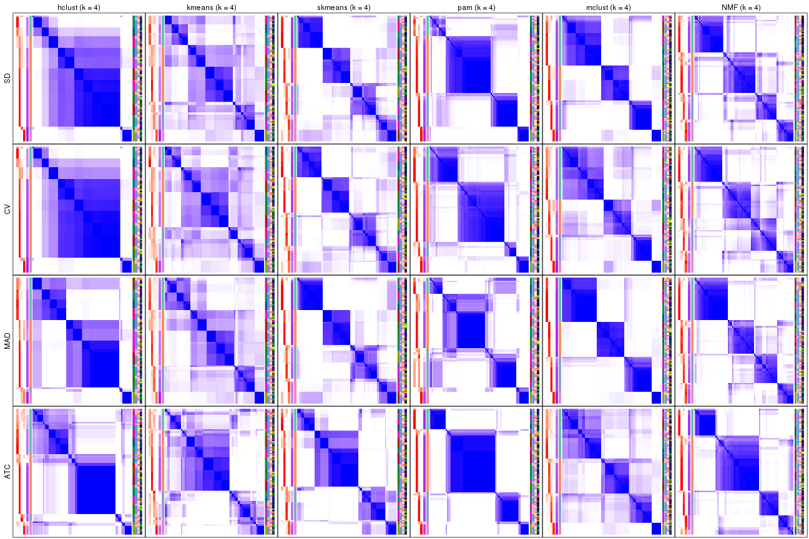</p>

</div>
<div id='tab-collect-consensus-heatmap-4'>
<pre><code class="r">collect_plots(res_list, k = 5, fun = consensus_heatmap, mc.cores = 4)
</code></pre>

<p></p>

</div>
<div id='tab-collect-consensus-heatmap-5'>
<pre><code class="r">collect_plots(res_list, k = 6, fun = consensus_heatmap, mc.cores = 4)
</code></pre>

<p></p>

</div>
</div>


### Membership heatmap

Membership heatmaps for all methods. ([What is a membership heatmap?](http://bioconductor.org/packages/devel/bioc/vignettes/cola/inst/doc/cola.html#toc_12))


<script>
$( function() {
	$( '#tabs-collect-membership-heatmap' ).tabs();
} );
</script>
<div id='tabs-collect-membership-heatmap'>
<ul>
<li><a href='#tab-collect-membership-heatmap-1'>k = 2</a></li>
<li><a href='#tab-collect-membership-heatmap-2'>k = 3</a></li>
<li><a href='#tab-collect-membership-heatmap-3'>k = 4</a></li>
<li><a href='#tab-collect-membership-heatmap-4'>k = 5</a></li>
<li><a href='#tab-collect-membership-heatmap-5'>k = 6</a></li>
</ul>
<div id='tab-collect-membership-heatmap-1'>
<pre><code class="r">collect_plots(res_list, k = 2, fun = membership_heatmap, mc.cores = 4)
</code></pre>

<p></p>

</div>
<div id='tab-collect-membership-heatmap-2'>
<pre><code class="r">collect_plots(res_list, k = 3, fun = membership_heatmap, mc.cores = 4)
</code></pre>

<p></p>

</div>
<div id='tab-collect-membership-heatmap-3'>
<pre><code class="r">collect_plots(res_list, k = 4, fun = membership_heatmap, mc.cores = 4)
</code></pre>

<p></p>

</div>
<div id='tab-collect-membership-heatmap-4'>
<pre><code class="r">collect_plots(res_list, k = 5, fun = membership_heatmap, mc.cores = 4)
</code></pre>

<p></p>

</div>
<div id='tab-collect-membership-heatmap-5'>
<pre><code class="r">collect_plots(res_list, k = 6, fun = membership_heatmap, mc.cores = 4)
</code></pre>

<p></p>

</div>
</div>


### Signature heatmap

Signature heatmaps for all methods. ([What is a signature heatmap?](http://bioconductor.org/packages/devel/bioc/vignettes/cola/inst/doc/cola.html#toc_22))


Note in following heatmaps, rows are scaled.


<script>
$( function() {
	$( '#tabs-collect-get-signatures' ).tabs();
} );
</script>
<div id='tabs-collect-get-signatures'>
<ul>
<li><a href='#tab-collect-get-signatures-1'>k = 2</a></li>
<li><a href='#tab-collect-get-signatures-2'>k = 3</a></li>
<li><a href='#tab-collect-get-signatures-3'>k = 4</a></li>
<li><a href='#tab-collect-get-signatures-4'>k = 5</a></li>
<li><a href='#tab-collect-get-signatures-5'>k = 6</a></li>
</ul>
<div id='tab-collect-get-signatures-1'>
<pre><code class="r">collect_plots(res_list, k = 2, fun = get_signatures, mc.cores = 4)
</code></pre>

<p></p>

</div>
<div id='tab-collect-get-signatures-2'>
<pre><code class="r">collect_plots(res_list, k = 3, fun = get_signatures, mc.cores = 4)
</code></pre>

<p></p>

</div>
<div id='tab-collect-get-signatures-3'>
<pre><code class="r">collect_plots(res_list, k = 4, fun = get_signatures, mc.cores = 4)
</code></pre>

<p></p>

</div>
<div id='tab-collect-get-signatures-4'>
<pre><code class="r">collect_plots(res_list, k = 5, fun = get_signatures, mc.cores = 4)
</code></pre>

<p></p>

</div>
<div id='tab-collect-get-signatures-5'>
<pre><code class="r">collect_plots(res_list, k = 6, fun = get_signatures, mc.cores = 4)
</code></pre>

<p></p>

</div>
</div>


### Statistics table

The statistics used for measuring the stability of consensus partitioning.
([How are they
defined?](http://bioconductor.org/packages/devel/bioc/vignettes/cola/inst/doc/cola.html#toc_13))


<script>
$( function() {
	$( '#tabs-get-stats-from-consensus-partition-list' ).tabs();
} );
</script>
<div id='tabs-get-stats-from-consensus-partition-list'>
<ul>
<li><a href='#tab-get-stats-from-consensus-partition-list-1'>k = 2</a></li>
<li><a href='#tab-get-stats-from-consensus-partition-list-2'>k = 3</a></li>
<li><a href='#tab-get-stats-from-consensus-partition-list-3'>k = 4</a></li>
<li><a href='#tab-get-stats-from-consensus-partition-list-4'>k = 5</a></li>
<li><a href='#tab-get-stats-from-consensus-partition-list-5'>k = 6</a></li>
</ul>
<div id='tab-get-stats-from-consensus-partition-list-1'>
<pre><code class="r">get_stats(res_list, k = 2)
</code></pre>

<pre><code>#&gt;             k 1-PAC mean_silhouette concordance area_increased  Rand Jaccard
#&gt; SD:NMF      2 0.467           0.781       0.888          0.473 0.508   0.508
#&gt; CV:NMF      2 0.345           0.554       0.813          0.468 0.540   0.540
#&gt; MAD:NMF     2 0.900           0.917       0.962          0.496 0.501   0.501
#&gt; ATC:NMF     2 0.999           0.962       0.984          0.468 0.534   0.534
#&gt; SD:skmeans  2 0.402           0.495       0.816          0.502 0.498   0.498
#&gt; CV:skmeans  2 0.325           0.490       0.780          0.499 0.495   0.495
#&gt; MAD:skmeans 2 0.706           0.885       0.940          0.500 0.501   0.501
#&gt; ATC:skmeans 2 1.000           0.978       0.991          0.496 0.504   0.504
#&gt; SD:mclust   2 0.474           0.814       0.906          0.494 0.497   0.497
#&gt; CV:mclust   2 0.331           0.563       0.759          0.472 0.495   0.495
#&gt; MAD:mclust  2 0.698           0.805       0.902          0.488 0.498   0.498
#&gt; ATC:mclust  2 0.276           0.752       0.812          0.446 0.497   0.497
#&gt; SD:kmeans   2 0.163           0.437       0.683          0.383 0.665   0.665
#&gt; CV:kmeans   2 0.154           0.421       0.736          0.382 0.615   0.615
#&gt; MAD:kmeans  2 0.188           0.617       0.756          0.423 0.615   0.615
#&gt; ATC:kmeans  2 1.000           0.993       0.993          0.460 0.540   0.540
#&gt; SD:pam      2 0.812           0.926       0.965          0.489 0.512   0.512
#&gt; CV:pam      2 0.832           0.906       0.958          0.483 0.512   0.512
#&gt; MAD:pam     2 0.904           0.946       0.975          0.488 0.512   0.512
#&gt; ATC:pam     2 0.927           0.936       0.973          0.475 0.521   0.521
#&gt; SD:hclust   2 0.374           0.856       0.881          0.272 0.774   0.774
#&gt; CV:hclust   2 0.535           0.908       0.931          0.252 0.774   0.774
#&gt; MAD:hclust  2 0.426           0.746       0.820          0.318 0.774   0.774
#&gt; ATC:hclust  2 0.667           0.775       0.918          0.336 0.665   0.665
</code></pre>

</div>
<div id='tab-get-stats-from-consensus-partition-list-2'>
<pre><code class="r">get_stats(res_list, k = 3)
</code></pre>

<pre><code>#&gt;             k 1-PAC mean_silhouette concordance area_increased  Rand Jaccard
#&gt; SD:NMF      3 0.765           0.860       0.934          0.338 0.647   0.423
#&gt; CV:NMF      3 0.801           0.862       0.939          0.401 0.660   0.447
#&gt; MAD:NMF     3 0.786           0.853       0.937          0.332 0.722   0.502
#&gt; ATC:NMF     3 0.723           0.814       0.915          0.362 0.735   0.541
#&gt; SD:skmeans  3 0.687           0.854       0.922          0.330 0.748   0.533
#&gt; CV:skmeans  3 0.712           0.833       0.920          0.343 0.726   0.501
#&gt; MAD:skmeans 3 0.744           0.788       0.905          0.340 0.694   0.460
#&gt; ATC:skmeans 3 0.963           0.957       0.979          0.298 0.808   0.635
#&gt; SD:mclust   3 0.415           0.506       0.690          0.271 0.782   0.587
#&gt; CV:mclust   3 0.324           0.567       0.731          0.330 0.763   0.578
#&gt; MAD:mclust  3 0.636           0.830       0.871          0.341 0.758   0.548
#&gt; ATC:mclust  3 0.421           0.697       0.824          0.282 0.854   0.726
#&gt; SD:kmeans   3 0.285           0.685       0.798          0.436 0.741   0.627
#&gt; CV:kmeans   3 0.277           0.656       0.785          0.440 0.787   0.670
#&gt; MAD:kmeans  3 0.373           0.537       0.738          0.395 0.648   0.469
#&gt; ATC:kmeans  3 0.595           0.628       0.829          0.308 0.810   0.663
#&gt; SD:pam      3 0.894           0.914       0.963          0.238 0.880   0.765
#&gt; CV:pam      3 0.786           0.877       0.944          0.253 0.880   0.765
#&gt; MAD:pam     3 0.780           0.890       0.937          0.267 0.880   0.765
#&gt; ATC:pam     3 0.702           0.790       0.886          0.195 0.904   0.821
#&gt; SD:hclust   3 0.441           0.783       0.889          0.638 0.773   0.708
#&gt; CV:hclust   3 0.663           0.847       0.928          0.744 0.773   0.708
#&gt; MAD:hclust  3 0.685           0.789       0.898          0.893 0.635   0.529
#&gt; ATC:hclust  3 0.378           0.559       0.769          0.470 0.788   0.697
</code></pre>

</div>
<div id='tab-get-stats-from-consensus-partition-list-3'>
<pre><code class="r">get_stats(res_list, k = 4)
</code></pre>

<pre><code>#&gt;             k 1-PAC mean_silhouette concordance area_increased  Rand Jaccard
#&gt; SD:NMF      4 0.684           0.717       0.867         0.1630 0.749   0.425
#&gt; CV:NMF      4 0.644           0.702       0.848         0.1306 0.768   0.441
#&gt; MAD:NMF     4 0.745           0.782       0.883         0.1214 0.818   0.532
#&gt; ATC:NMF     4 0.766           0.804       0.912         0.1146 0.873   0.673
#&gt; SD:skmeans  4 0.730           0.785       0.862         0.1215 0.842   0.568
#&gt; CV:skmeans  4 0.698           0.786       0.862         0.1186 0.844   0.571
#&gt; MAD:skmeans 4 0.759           0.790       0.870         0.1155 0.851   0.588
#&gt; ATC:skmeans 4 0.722           0.701       0.847         0.1159 0.909   0.757
#&gt; SD:mclust   4 0.819           0.858       0.917         0.1445 0.833   0.581
#&gt; CV:mclust   4 0.666           0.752       0.826         0.1264 0.876   0.693
#&gt; MAD:mclust  4 0.945           0.927       0.953         0.1047 0.947   0.841
#&gt; ATC:mclust  4 0.516           0.746       0.756         0.2217 0.819   0.595
#&gt; SD:kmeans   4 0.343           0.570       0.705         0.2314 0.807   0.602
#&gt; CV:kmeans   4 0.362           0.503       0.671         0.2087 0.795   0.586
#&gt; MAD:kmeans  4 0.427           0.665       0.746         0.1736 0.770   0.486
#&gt; ATC:kmeans  4 0.567           0.509       0.726         0.1519 0.856   0.666
#&gt; SD:pam      4 0.817           0.837       0.922         0.1203 0.904   0.759
#&gt; CV:pam      4 0.724           0.824       0.910         0.1106 0.914   0.786
#&gt; MAD:pam     4 0.713           0.619       0.798         0.1312 0.878   0.702
#&gt; ATC:pam     4 0.916           0.871       0.952         0.1853 0.830   0.647
#&gt; SD:hclust   4 0.578           0.755       0.864         0.1688 0.996   0.992
#&gt; CV:hclust   4 0.670           0.776       0.886         0.1281 0.996   0.992
#&gt; MAD:hclust  4 0.685           0.753       0.872         0.0419 0.993   0.984
#&gt; ATC:hclust  4 0.631           0.661       0.848         0.3137 0.690   0.483
</code></pre>

</div>
<div id='tab-get-stats-from-consensus-partition-list-4'>
<pre><code class="r">get_stats(res_list, k = 5)
</code></pre>

<pre><code>#&gt;             k 1-PAC mean_silhouette concordance area_increased  Rand Jaccard
#&gt; SD:NMF      5 0.660           0.646       0.794         0.0668 0.887   0.608
#&gt; CV:NMF      5 0.605           0.551       0.741         0.0651 0.903   0.646
#&gt; MAD:NMF     5 0.656           0.568       0.752         0.0674 0.933   0.749
#&gt; ATC:NMF     5 0.610           0.498       0.713         0.0676 0.880   0.650
#&gt; SD:skmeans  5 0.787           0.841       0.878         0.0614 0.945   0.784
#&gt; CV:skmeans  5 0.725           0.764       0.835         0.0606 0.933   0.744
#&gt; MAD:skmeans 5 0.744           0.829       0.871         0.0610 0.950   0.801
#&gt; ATC:skmeans 5 0.728           0.726       0.810         0.0787 0.889   0.647
#&gt; SD:mclust   5 0.881           0.875       0.928         0.0900 0.903   0.675
#&gt; CV:mclust   5 0.769           0.782       0.879         0.1034 0.912   0.706
#&gt; MAD:mclust  5 0.833           0.858       0.902         0.0760 0.943   0.798
#&gt; ATC:mclust  5 0.750           0.769       0.872         0.1136 0.923   0.735
#&gt; SD:kmeans   5 0.519           0.622       0.723         0.0983 0.844   0.543
#&gt; CV:kmeans   5 0.490           0.580       0.701         0.1141 0.749   0.375
#&gt; MAD:kmeans  5 0.497           0.609       0.694         0.0963 0.804   0.464
#&gt; ATC:kmeans  5 0.589           0.386       0.639         0.0903 0.869   0.655
#&gt; SD:pam      5 0.790           0.802       0.886         0.0738 0.970   0.907
#&gt; CV:pam      5 0.787           0.858       0.910         0.0630 0.962   0.886
#&gt; MAD:pam     5 0.845           0.824       0.920         0.1004 0.862   0.594
#&gt; ATC:pam     5 0.831           0.793       0.906         0.1292 0.841   0.567
#&gt; SD:hclust   5 0.810           0.828       0.904         0.1818 0.882   0.785
#&gt; CV:hclust   5 0.729           0.881       0.926         0.1924 0.882   0.785
#&gt; MAD:hclust  5 0.707           0.728       0.841         0.0602 0.958   0.895
#&gt; ATC:hclust  5 0.762           0.775       0.878         0.0830 0.914   0.768
</code></pre>

</div>
<div id='tab-get-stats-from-consensus-partition-list-5'>
<pre><code class="r">get_stats(res_list, k = 6)
</code></pre>

<pre><code>#&gt;             k 1-PAC mean_silhouette concordance area_increased  Rand Jaccard
#&gt; SD:NMF      6 0.757           0.678       0.828         0.0391 0.880   0.529
#&gt; CV:NMF      6 0.709           0.604       0.742         0.0401 0.892   0.567
#&gt; MAD:NMF     6 0.700           0.664       0.782         0.0401 0.897   0.590
#&gt; ATC:NMF     6 0.704           0.650       0.771         0.0367 0.907   0.703
#&gt; SD:skmeans  6 0.810           0.826       0.819         0.0371 0.969   0.854
#&gt; CV:skmeans  6 0.750           0.748       0.775         0.0391 0.957   0.799
#&gt; MAD:skmeans 6 0.792           0.790       0.829         0.0364 1.000   1.000
#&gt; ATC:skmeans 6 0.714           0.706       0.807         0.0490 0.964   0.834
#&gt; SD:mclust   6 0.816           0.752       0.826         0.0425 0.989   0.951
#&gt; CV:mclust   6 0.812           0.733       0.836         0.0465 0.948   0.762
#&gt; MAD:mclust  6 0.798           0.575       0.750         0.0453 0.963   0.836
#&gt; ATC:mclust  6 0.752           0.690       0.804         0.0390 0.966   0.853
#&gt; SD:kmeans   6 0.638           0.655       0.711         0.0563 0.958   0.812
#&gt; CV:kmeans   6 0.621           0.687       0.699         0.0673 0.894   0.593
#&gt; MAD:kmeans  6 0.638           0.656       0.710         0.0510 0.967   0.858
#&gt; ATC:kmeans  6 0.631           0.467       0.675         0.0574 0.801   0.436
#&gt; SD:pam      6 0.819           0.719       0.839         0.0586 0.888   0.639
#&gt; CV:pam      6 0.735           0.596       0.785         0.0750 0.919   0.747
#&gt; MAD:pam     6 0.828           0.789       0.870         0.0456 0.962   0.839
#&gt; ATC:pam     6 0.871           0.844       0.934         0.0276 0.960   0.838
#&gt; SD:hclust   6 0.768           0.875       0.909         0.0420 0.987   0.970
#&gt; CV:hclust   6 0.755           0.930       0.949         0.0423 0.987   0.970
#&gt; MAD:hclust  6 0.688           0.695       0.832         0.0843 0.879   0.671
#&gt; ATC:hclust  6 0.829           0.692       0.869         0.0335 0.975   0.916
</code></pre>

</div>
</div>

Following heatmap plots the partition for each combination of methods and the
lightness correspond to the silhouette scores for samples in each method. On
top the consensus subgroup is inferred from all methods by taking the mean
silhouette scores as weight.


<script>
$( function() {
	$( '#tabs-collect-stats-from-consensus-partition-list' ).tabs();
} );
</script>
<div id='tabs-collect-stats-from-consensus-partition-list'>
<ul>
<li><a href='#tab-collect-stats-from-consensus-partition-list-1'>k = 2</a></li>
<li><a href='#tab-collect-stats-from-consensus-partition-list-2'>k = 3</a></li>
<li><a href='#tab-collect-stats-from-consensus-partition-list-3'>k = 4</a></li>
<li><a href='#tab-collect-stats-from-consensus-partition-list-4'>k = 5</a></li>
<li><a href='#tab-collect-stats-from-consensus-partition-list-5'>k = 6</a></li>
</ul>
<div id='tab-collect-stats-from-consensus-partition-list-1'>
<pre><code class="r">collect_stats(res_list, k = 2)
</code></pre>

<p></p>

</div>
<div id='tab-collect-stats-from-consensus-partition-list-2'>
<pre><code class="r">collect_stats(res_list, k = 3)
</code></pre>

<p></p>

</div>
<div id='tab-collect-stats-from-consensus-partition-list-3'>
<pre><code class="r">collect_stats(res_list, k = 4)
</code></pre>

<p></p>

</div>
<div id='tab-collect-stats-from-consensus-partition-list-4'>
<pre><code class="r">collect_stats(res_list, k = 5)
</code></pre>

<p></p>

</div>
<div id='tab-collect-stats-from-consensus-partition-list-5'>
<pre><code class="r">collect_stats(res_list, k = 6)
</code></pre>

<p></p>

</div>
</div>

### Partition from all methods


Collect partitions from all methods:


<script>
$( function() {
	$( '#tabs-collect-classes-from-consensus-partition-list' ).tabs();
} );
</script>
<div id='tabs-collect-classes-from-consensus-partition-list'>
<ul>
<li><a href='#tab-collect-classes-from-consensus-partition-list-1'>k = 2</a></li>
<li><a href='#tab-collect-classes-from-consensus-partition-list-2'>k = 3</a></li>
<li><a href='#tab-collect-classes-from-consensus-partition-list-3'>k = 4</a></li>
<li><a href='#tab-collect-classes-from-consensus-partition-list-4'>k = 5</a></li>
<li><a href='#tab-collect-classes-from-consensus-partition-list-5'>k = 6</a></li>
</ul>
<div id='tab-collect-classes-from-consensus-partition-list-1'>
<pre><code class="r">collect_classes(res_list, k = 2)
</code></pre>

<p></p>

</div>
<div id='tab-collect-classes-from-consensus-partition-list-2'>
<pre><code class="r">collect_classes(res_list, k = 3)
</code></pre>

<p></p>

</div>
<div id='tab-collect-classes-from-consensus-partition-list-3'>
<pre><code class="r">collect_classes(res_list, k = 4)
</code></pre>

<p></p>

</div>
<div id='tab-collect-classes-from-consensus-partition-list-4'>
<pre><code class="r">collect_classes(res_list, k = 5)
</code></pre>

<p></p>

</div>
<div id='tab-collect-classes-from-consensus-partition-list-5'>
<pre><code class="r">collect_classes(res_list, k = 6)
</code></pre>

<p></p>

</div>
</div>


### Top rows overlap


Overlap of top rows from different top-row methods:


<script>
$( function() {
	$( '#tabs-top-rows-overlap-by-euler' ).tabs();
} );
</script>
<div id='tabs-top-rows-overlap-by-euler'>
<ul>
<li><a href='#tab-top-rows-overlap-by-euler-1'>top_n = 1000</a></li>
<li><a href='#tab-top-rows-overlap-by-euler-2'>top_n = 2000</a></li>
<li><a href='#tab-top-rows-overlap-by-euler-3'>top_n = 3000</a></li>
<li><a href='#tab-top-rows-overlap-by-euler-4'>top_n = 4000</a></li>
<li><a href='#tab-top-rows-overlap-by-euler-5'>top_n = 5000</a></li>
</ul>
<div id='tab-top-rows-overlap-by-euler-1'>
<pre><code class="r">top_rows_overlap(res_list, top_n = 1000, method = &quot;euler&quot;)
</code></pre>

<p></p>

</div>
<div id='tab-top-rows-overlap-by-euler-2'>
<pre><code class="r">top_rows_overlap(res_list, top_n = 2000, method = &quot;euler&quot;)
</code></pre>

<p></p>

</div>
<div id='tab-top-rows-overlap-by-euler-3'>
<pre><code class="r">top_rows_overlap(res_list, top_n = 3000, method = &quot;euler&quot;)
</code></pre>

<p></p>

</div>
<div id='tab-top-rows-overlap-by-euler-4'>
<pre><code class="r">top_rows_overlap(res_list, top_n = 4000, method = &quot;euler&quot;)
</code></pre>

<p></p>

</div>
<div id='tab-top-rows-overlap-by-euler-5'>
<pre><code class="r">top_rows_overlap(res_list, top_n = 5000, method = &quot;euler&quot;)
</code></pre>

<p></p>

</div>
</div>

Also visualize the correspondance of rankings between different top-row methods:


<script>
$( function() {
	$( '#tabs-top-rows-overlap-by-correspondance' ).tabs();
} );
</script>
<div id='tabs-top-rows-overlap-by-correspondance'>
<ul>
<li><a href='#tab-top-rows-overlap-by-correspondance-1'>top_n = 1000</a></li>
<li><a href='#tab-top-rows-overlap-by-correspondance-2'>top_n = 2000</a></li>
<li><a href='#tab-top-rows-overlap-by-correspondance-3'>top_n = 3000</a></li>
<li><a href='#tab-top-rows-overlap-by-correspondance-4'>top_n = 4000</a></li>
<li><a href='#tab-top-rows-overlap-by-correspondance-5'>top_n = 5000</a></li>
</ul>
<div id='tab-top-rows-overlap-by-correspondance-1'>
<pre><code class="r">top_rows_overlap(res_list, top_n = 1000, method = &quot;correspondance&quot;)
</code></pre>

<p></p>

</div>
<div id='tab-top-rows-overlap-by-correspondance-2'>
<pre><code class="r">top_rows_overlap(res_list, top_n = 2000, method = &quot;correspondance&quot;)
</code></pre>

<p></p>

</div>
<div id='tab-top-rows-overlap-by-correspondance-3'>
<pre><code class="r">top_rows_overlap(res_list, top_n = 3000, method = &quot;correspondance&quot;)
</code></pre>

<p></p>

</div>
<div id='tab-top-rows-overlap-by-correspondance-4'>
<pre><code class="r">top_rows_overlap(res_list, top_n = 4000, method = &quot;correspondance&quot;)
</code></pre>

<p></p>

</div>
<div id='tab-top-rows-overlap-by-correspondance-5'>
<pre><code class="r">top_rows_overlap(res_list, top_n = 5000, method = &quot;correspondance&quot;)
</code></pre>

<p></p>

</div>
</div>


Heatmaps of the top rows:


<script>
$( function() {
	$( '#tabs-top-rows-heatmap' ).tabs();
} );
</script>
<div id='tabs-top-rows-heatmap'>
<ul>
<li><a href='#tab-top-rows-heatmap-1'>top_n = 1000</a></li>
<li><a href='#tab-top-rows-heatmap-2'>top_n = 2000</a></li>
<li><a href='#tab-top-rows-heatmap-3'>top_n = 3000</a></li>
<li><a href='#tab-top-rows-heatmap-4'>top_n = 4000</a></li>
<li><a href='#tab-top-rows-heatmap-5'>top_n = 5000</a></li>
</ul>
<div id='tab-top-rows-heatmap-1'>
<pre><code class="r">top_rows_heatmap(res_list, top_n = 1000)
</code></pre>

<p></p>

</div>
<div id='tab-top-rows-heatmap-2'>
<pre><code class="r">top_rows_heatmap(res_list, top_n = 2000)
</code></pre>

<p></p>

</div>
<div id='tab-top-rows-heatmap-3'>
<pre><code class="r">top_rows_heatmap(res_list, top_n = 3000)
</code></pre>

<p></p>

</div>
<div id='tab-top-rows-heatmap-4'>
<pre><code class="r">top_rows_heatmap(res_list, top_n = 4000)
</code></pre>

<p></p>

</div>
<div id='tab-top-rows-heatmap-5'>
<pre><code class="r">top_rows_heatmap(res_list, top_n = 5000)
</code></pre>

<p></p>

</div>
</div>


### Test to known annotations


Test correlation between subgroups and known annotations. If the known
annotation is numeric, one-way ANOVA test is applied, and if the known
annotation is discrete, chi-squared contingency table test is applied.


<script>
$( function() {
	$( '#tabs-test-to-known-factors-from-consensus-partition-list' ).tabs();
} );
</script>
<div id='tabs-test-to-known-factors-from-consensus-partition-list'>
<ul>
<li><a href='#tab-test-to-known-factors-from-consensus-partition-list-1'>k = 2</a></li>
<li><a href='#tab-test-to-known-factors-from-consensus-partition-list-2'>k = 3</a></li>
<li><a href='#tab-test-to-known-factors-from-consensus-partition-list-3'>k = 4</a></li>
<li><a href='#tab-test-to-known-factors-from-consensus-partition-list-4'>k = 5</a></li>
<li><a href='#tab-test-to-known-factors-from-consensus-partition-list-5'>k = 6</a></li>
</ul>
<div id='tab-test-to-known-factors-from-consensus-partition-list-1'>
<pre><code class="r">test_to_known_factors(res_list, k = 2)
</code></pre>

<pre><code>#&gt;              n individual(p) protocol(p) time(p) other(p) k
#&gt; SD:NMF      78      2.47e-11     0.26886   0.978  0.84278 2
#&gt; CV:NMF      56      4.75e-06     0.00743   0.707  0.71411 2
#&gt; MAD:NMF     83      3.41e-11     0.35873   0.870  0.84711 2
#&gt; ATC:NMF     85      1.53e-06     0.01748   0.896  0.01213 2
#&gt; SD:skmeans  51      2.62e-08     1.00000   0.995  0.36596 2
#&gt; CV:skmeans  51      9.46e-07     0.29041   0.948  0.04874 2
#&gt; MAD:skmeans 86      8.23e-13     0.49189   0.975  0.75145 2
#&gt; ATC:skmeans 85      1.43e-06     0.01342   0.686  0.00765 2
#&gt; SD:mclust   79      1.18e-11     0.61699   0.983  0.87401 2
#&gt; CV:mclust   69      3.73e-11     0.62828   0.997  0.80215 2
#&gt; MAD:mclust  82      1.00e-12     0.92553   0.999  0.69384 2
#&gt; ATC:mclust  77      3.13e-12     0.53563   0.991  0.46354 2
#&gt; SD:kmeans   53      2.92e-08     1.00000   1.000  0.22182 2
#&gt; CV:kmeans   43            NA          NA      NA       NA 2
#&gt; MAD:kmeans  68      3.75e-11     0.98496   0.999  0.67199 2
#&gt; ATC:kmeans  86      3.56e-06     0.01542   0.845  0.01088 2
#&gt; SD:pam      85      1.06e-09     0.05229   0.898  0.90095 2
#&gt; CV:pam      84      8.03e-09     0.07825   0.801  0.96149 2
#&gt; MAD:pam     86      7.09e-10     0.05863   0.889  0.87869 2
#&gt; ATC:pam     83      4.67e-07     0.08055   0.968  0.00607 2
#&gt; SD:hclust   85      3.47e-11     0.36263   0.992  0.00449 2
#&gt; CV:hclust   85      3.47e-11     0.36263   0.992  0.00449 2
#&gt; MAD:hclust  85      3.47e-11     0.36263   0.992  0.00449 2
#&gt; ATC:hclust  73      1.10e-06     0.02978   0.908  0.00196 2
</code></pre>

</div>
<div id='tab-test-to-known-factors-from-consensus-partition-list-2'>
<pre><code class="r">test_to_known_factors(res_list, k = 3)
</code></pre>

<pre><code>#&gt;              n individual(p) protocol(p) time(p) other(p) k
#&gt; SD:NMF      82      6.82e-18    0.032129   0.978 3.62e-01 3
#&gt; CV:NMF      80      7.06e-17    0.179505   0.996 3.43e-01 3
#&gt; MAD:NMF     79      4.52e-18    0.145302   0.991 3.62e-01 3
#&gt; ATC:NMF     78      9.42e-19    0.029081   0.999 2.11e-01 3
#&gt; SD:skmeans  82      2.64e-21    0.388592   1.000 2.90e-01 3
#&gt; CV:skmeans  81      7.24e-20    0.205557   1.000 2.88e-01 3
#&gt; MAD:skmeans 74      1.38e-20    0.560569   1.000 2.05e-01 3
#&gt; ATC:skmeans 86      9.93e-14    0.000205   0.945 2.69e-01 3
#&gt; SD:mclust   50      3.46e-08    0.700928   0.990 5.25e-01 3
#&gt; CV:mclust   55      4.49e-16    0.605053   0.999 4.07e-01 3
#&gt; MAD:mclust  84      2.12e-25    0.814462   1.000 1.29e-01 3
#&gt; ATC:mclust  81      3.08e-24    0.773545   1.000 2.34e-03 3
#&gt; SD:kmeans   79      1.03e-20    0.366003   1.000 1.08e-01 3
#&gt; CV:kmeans   75      1.36e-19    0.369033   1.000 5.46e-02 3
#&gt; MAD:kmeans  57      6.39e-16    0.361230   1.000 1.41e-01 3
#&gt; ATC:kmeans  69      2.03e-12    0.025029   0.959 7.77e-02 3
#&gt; SD:pam      85      3.34e-17    0.102635   0.991 1.65e-01 3
#&gt; CV:pam      83      7.10e-16    0.061169   0.990 3.10e-01 3
#&gt; MAD:pam     85      3.34e-17    0.102635   0.991 1.65e-01 3
#&gt; ATC:pam     80      1.51e-18    0.170700   0.979 4.03e-05 3
#&gt; SD:hclust   85      6.33e-23    0.364583   1.000 2.04e-02 3
#&gt; CV:hclust   79      9.73e-22    0.490417   0.999 9.16e-03 3
#&gt; MAD:hclust  85      8.69e-23    0.423246   1.000 3.89e-02 3
#&gt; ATC:hclust  55      6.76e-12    0.002925   0.959 1.53e-03 3
</code></pre>

</div>
<div id='tab-test-to-known-factors-from-consensus-partition-list-3'>
<pre><code class="r">test_to_known_factors(res_list, k = 4)
</code></pre>

<pre><code>#&gt;              n individual(p) protocol(p) time(p) other(p) k
#&gt; SD:NMF      75      1.77e-27    0.381331   1.000 0.175134 4
#&gt; CV:NMF      74      9.33e-26    0.072373   1.000 0.129691 4
#&gt; MAD:NMF     79      7.27e-28    0.087966   1.000 0.299899 4
#&gt; ATC:NMF     78      1.21e-21    0.002520   0.994 0.179939 4
#&gt; SD:skmeans  80      4.69e-33    0.645081   1.000 0.068894 4
#&gt; CV:skmeans  81      1.21e-33    0.709775   1.000 0.085118 4
#&gt; MAD:skmeans 82      3.15e-34    0.766257   1.000 0.087027 4
#&gt; ATC:skmeans 72      5.45e-22    0.011462   1.000 0.041178 4
#&gt; SD:mclust   82      9.05e-35    0.959172   1.000 0.013517 4
#&gt; CV:mclust   83      2.36e-36    0.962514   1.000 0.049829 4
#&gt; MAD:mclust  85      1.64e-37    0.954336   1.000 0.015599 4
#&gt; ATC:mclust  80      4.85e-33    0.728585   1.000 0.030007 4
#&gt; SD:kmeans   59      2.74e-25    0.882252   1.000 0.029224 4
#&gt; CV:kmeans   46      2.15e-15    0.719952   1.000 0.140466 4
#&gt; MAD:kmeans  69      1.15e-29    0.942238   1.000 0.041522 4
#&gt; ATC:kmeans  56      1.54e-14    0.131264   0.981 0.132765 4
#&gt; SD:pam      81      1.17e-28    0.234511   1.000 0.124482 4
#&gt; CV:pam      82      2.41e-23    0.286467   0.997 0.296668 4
#&gt; MAD:pam     56      2.71e-12    0.173312   0.996 0.392364 4
#&gt; ATC:pam     78      9.14e-25    0.018227   0.999 0.005532 4
#&gt; SD:hclust   77      6.78e-23    0.069667   1.000 0.000256 4
#&gt; CV:hclust   77      6.78e-23    0.069667   1.000 0.000256 4
#&gt; MAD:hclust  77      7.95e-23    0.076635   1.000 0.000202 4
#&gt; ATC:hclust  63      1.49e-20    0.000652   0.967 0.000497 4
</code></pre>

</div>
<div id='tab-test-to-known-factors-from-consensus-partition-list-4'>
<pre><code class="r">test_to_known_factors(res_list, k = 5)
</code></pre>

<pre><code>#&gt;              n individual(p) protocol(p) time(p) other(p) k
#&gt; SD:NMF      69      7.42e-35    0.264111   1.000 0.304464 5
#&gt; CV:NMF      58      9.52e-28    0.606575   0.999 0.360312 5
#&gt; MAD:NMF     60      3.63e-23    0.137910   1.000 0.213719 5
#&gt; ATC:NMF     52      2.36e-16    0.259093   0.686 0.033399 5
#&gt; SD:skmeans  86      2.10e-47    0.911799   1.000 0.020797 5
#&gt; CV:skmeans  82      1.86e-44    0.864930   1.000 0.012907 5
#&gt; MAD:skmeans 85      1.15e-46    0.903932   1.000 0.020566 5
#&gt; ATC:skmeans 73      1.56e-32    0.003642   1.000 0.017190 5
#&gt; SD:mclust   82      1.38e-45    0.952869   1.000 0.023930 5
#&gt; CV:mclust   78      2.53e-41    0.827142   1.000 0.052475 5
#&gt; MAD:mclust  83      1.14e-47    0.955148   1.000 0.014689 5
#&gt; ATC:mclust  78      1.21e-40    0.902794   1.000 0.048179 5
#&gt; SD:kmeans   63      1.38e-27    0.796626   1.000 0.057793 5
#&gt; CV:kmeans   55      2.37e-24    0.985068   1.000 0.028570 5
#&gt; MAD:kmeans  62      3.07e-35    0.976672   1.000 0.017669 5
#&gt; ATC:kmeans  38      2.38e-11    0.002938   0.971 0.014039 5
#&gt; SD:pam      82      4.06e-41    0.325971   1.000 0.105169 5
#&gt; CV:pam      84      6.13e-40    0.309353   1.000 0.128415 5
#&gt; MAD:pam     78      8.88e-36    0.086101   1.000 0.044420 5
#&gt; ATC:pam     79      4.45e-34    0.296669   1.000 0.006147 5
#&gt; SD:hclust   79      1.04e-34    0.183760   1.000 0.001081 5
#&gt; CV:hclust   85      1.26e-36    0.133280   1.000 0.001249 5
#&gt; MAD:hclust  79      1.22e-34    0.181113   1.000 0.000192 5
#&gt; ATC:hclust  77      1.26e-26    0.000909   0.996 0.000028 5
</code></pre>

</div>
<div id='tab-test-to-known-factors-from-consensus-partition-list-5'>
<pre><code class="r">test_to_known_factors(res_list, k = 6)
</code></pre>

<pre><code>#&gt;              n individual(p) protocol(p) time(p) other(p) k
#&gt; SD:NMF      69      7.17e-48    0.920609   1.000 6.30e-02 6
#&gt; CV:NMF      61      1.68e-42    0.540386   1.000 4.07e-02 6
#&gt; MAD:NMF     72      2.92e-45    0.317302   1.000 1.07e-01 6
#&gt; ATC:NMF     68      5.46e-44    0.605093   1.000 9.63e-02 6
#&gt; SD:skmeans  86      2.76e-59    0.933464   1.000 9.69e-02 6
#&gt; CV:skmeans  82      1.43e-55    0.906327   1.000 5.80e-02 6
#&gt; MAD:skmeans 85      3.27e-49    0.977079   1.000 2.25e-02 6
#&gt; ATC:skmeans 78      1.35e-36    0.007309   1.000 2.29e-02 6
#&gt; SD:mclust   76      2.60e-42    0.909835   1.000 5.77e-02 6
#&gt; CV:mclust   72      4.28e-49    0.894250   1.000 1.93e-01 6
#&gt; MAD:mclust  64      5.53e-35    0.990143   1.000 2.08e-01 6
#&gt; ATC:mclust  73      7.75e-42    0.860840   1.000 5.14e-02 6
#&gt; SD:kmeans   63      6.86e-38    0.982985   1.000 3.71e-02 6
#&gt; CV:kmeans   79      1.80e-57    0.999434   1.000 6.95e-02 6
#&gt; MAD:kmeans  68      3.27e-49    0.856994   1.000 7.99e-02 6
#&gt; ATC:kmeans  44      6.73e-17    0.344957   0.997 4.47e-02 6
#&gt; SD:pam      76      4.13e-50    0.797359   1.000 4.23e-02 6
#&gt; CV:pam      60      1.12e-23    0.361805   1.000 2.83e-01 6
#&gt; MAD:pam     78      1.05e-48    0.186265   1.000 1.00e-01 6
#&gt; ATC:pam     81      4.36e-46    0.364464   1.000 2.09e-02 6
#&gt; SD:hclust   85      2.70e-48    0.130018   1.000 1.10e-03 6
#&gt; CV:hclust   85      2.70e-48    0.130018   1.000 1.10e-03 6
#&gt; MAD:hclust  77      1.54e-55    0.974827   1.000 3.15e-02 6
#&gt; ATC:hclust  74      1.12e-28    0.000281   0.991 5.64e-05 6
</code></pre>

</div>
</div>


 
## Results for each method


---------------------------------------------------


### SD:hclust


The object with results only for a single top-value method and a single partition method 
can be extracted as:

```r
res = res_list["SD", "hclust"]
# you can also extract it by
# res = res_list["SD:hclust"]
```

A summary of `res` and all the functions that can be applied to it:

```r
res
```

```
#> A 'ConsensusPartition' object with k = 2, 3, 4, 5, 6.
#>   On a matrix with 21168 rows and 86 columns.
#>   Top rows (1000, 2000, 3000, 4000, 5000) are extracted by 'SD' method.
#>   Subgroups are detected by 'hclust' method.
#>   Performed in total 1250 partitions by row resampling.
#>   Best k for subgroups seems to be 3.
#> 
#> Following methods can be applied to this 'ConsensusPartition' object:
#>  [1] "cola_report"             "collect_classes"         "collect_plots"          
#>  [4] "collect_stats"           "colnames"                "compare_signatures"     
#>  [7] "consensus_heatmap"       "dimension_reduction"     "functional_enrichment"  
#> [10] "get_anno_col"            "get_anno"                "get_classes"            
#> [13] "get_consensus"           "get_matrix"              "get_membership"         
#> [16] "get_param"               "get_signatures"          "get_stats"              
#> [19] "is_best_k"               "is_stable_k"             "membership_heatmap"     
#> [22] "ncol"                    "nrow"                    "plot_ecdf"              
#> [25] "rownames"                "select_partition_number" "show"                   
#> [28] "suggest_best_k"          "test_to_known_factors"
```

`collect_plots()` function collects all the plots made from `res` for all `k` (number of partitions)
into one single page to provide an easy and fast comparison between different `k`.

```r
collect_plots(res)
```


The plots are:

- The first row: a plot of the ECDF (empirical cumulative distribution
  function) curves of the consensus matrix for each `k` and the heatmap of
  predicted classes for each `k`.
- The second row: heatmaps of the consensus matrix for each `k`.
- The third row: heatmaps of the membership matrix for each `k`.
- The fouth row: heatmaps of the signatures for each `k`.

All the plots in panels can be made by individual functions and they are
plotted later in this section.

`select_partition_number()` produces several plots showing different
statistics for choosing "optimized" `k`. There are following statistics:

- ECDF curves of the consensus matrix for each `k`;
- 1-PAC. [The PAC
  score](https://en.wikipedia.org/wiki/Consensus_clustering#Over-interpretation_potential_of_consensus_clustering)
  measures the proportion of the ambiguous subgrouping.
- Mean silhouette score.
- Concordance. The mean probability of fiting the consensus class ids in all
  partitions.
- Area increased. Denote $A_k$ as the area under the ECDF curve for current
  `k`, the area increased is defined as $A_k - A_{k-1}$.
- Rand index. The percent of pairs of samples that are both in a same cluster
  or both are not in a same cluster in the partition of k and k-1.
- Jaccard index. The ratio of pairs of samples are both in a same cluster in
  the partition of k and k-1 and the pairs of samples are both in a same
  cluster in the partition k or k-1.

The detailed explanations of these statistics can be found in [the _cola_
vignette](http://bioconductor.org/packages/devel/bioc/vignettes/cola/inst/doc/cola.html#toc_13).

Generally speaking, lower PAC score, higher mean silhouette score or higher
concordance corresponds to better partition. Rand index and Jaccard index
measure how similar the current partition is compared to partition with `k-1`.
If they are too similar, we won't accept `k` is better than `k-1`.

```r
select_partition_number(res)
```


The numeric values for all these statistics can be obtained by `get_stats()`.

```r
get_stats(res)
```

```
#>   k 1-PAC mean_silhouette concordance area_increased  Rand Jaccard
#> 2 2 0.374           0.856       0.881          0.272 0.774   0.774
#> 3 3 0.441           0.783       0.889          0.638 0.773   0.708
#> 4 4 0.578           0.755       0.864          0.169 0.996   0.992
#> 5 5 0.810           0.828       0.904          0.182 0.882   0.785
#> 6 6 0.768           0.875       0.909          0.042 0.987   0.970
```

`suggest_best_k()` suggests the best $k$ based on these statistics. The rules are as follows:

- All $k$ with Jaccard index larger than 0.95 are removed because increasing
  $k$ does not provide enough extra information. If all $k$ are removed, it is
  marked as no subgroup is detected.
- For all $k$ with 1-PAC score larger than 0.9, the maximal $k$ is taken as
  the best $k$, and other $k$ are marked as optional $k$.
- If it does not fit the second rule. The $k$ with the maximal vote of the
  highest 1-PAC score, highest mean silhouette, and highest concordance is
  taken as the best $k$.

```r
suggest_best_k(res)
```

```
#> [1] 3
```


Following shows the table of the partitions (You need to click the **show/hide
code output** link to see it). The membership matrix (columns with name `p*`)
is inferred by
[`clue::cl_consensus()`](https://www.rdocumentation.org/link/cl_consensus?package=clue)
function with the `SE` method. Basically the value in the membership matrix
represents the probability to belong to a certain group. The finall class
label for an item is determined with the group with highest probability it
belongs to.

In `get_classes()` function, the entropy is calculated from the membership
matrix and the silhouette score is calculated from the consensus matrix.


<script>
$( function() {
	$( '#tabs-SD-hclust-get-classes' ).tabs();
} );
</script>
<div id='tabs-SD-hclust-get-classes'>
<ul>
<li><a href='#tab-SD-hclust-get-classes-1'>k = 2</a></li>
<li><a href='#tab-SD-hclust-get-classes-2'>k = 3</a></li>
<li><a href='#tab-SD-hclust-get-classes-3'>k = 4</a></li>
<li><a href='#tab-SD-hclust-get-classes-4'>k = 5</a></li>
<li><a href='#tab-SD-hclust-get-classes-5'>k = 6</a></li>
</ul>

<div id='tab-SD-hclust-get-classes-1'>
<p><a id='tab-SD-hclust-get-classes-1-a' style='color:#0366d6' href='#'>show/hide code output</a></p>
<pre><code class="r">cbind(get_classes(res, k = 2), get_membership(res, k = 2))
</code></pre>

<pre><code>#&gt;           class entropy silhouette    p1    p2
#&gt; GSM614415     2  0.7219      0.783 0.200 0.800
#&gt; GSM614416     2  0.7219      0.783 0.200 0.800
#&gt; GSM614417     2  0.7219      0.783 0.200 0.800
#&gt; GSM614418     2  0.7219      0.783 0.200 0.800
#&gt; GSM614419     2  0.7219      0.783 0.200 0.800
#&gt; GSM614420     2  0.7219      0.783 0.200 0.800
#&gt; GSM614421     2  0.6048      0.771 0.148 0.852
#&gt; GSM614422     2  0.6048      0.771 0.148 0.852
#&gt; GSM614423     2  0.6048      0.771 0.148 0.852
#&gt; GSM614424     2  0.6048      0.771 0.148 0.852
#&gt; GSM614425     2  0.6048      0.771 0.148 0.852
#&gt; GSM614426     2  0.6048      0.771 0.148 0.852
#&gt; GSM614427     2  0.6048      0.771 0.148 0.852
#&gt; GSM614428     2  0.6048      0.771 0.148 0.852
#&gt; GSM614429     2  0.0376      0.898 0.004 0.996
#&gt; GSM614430     2  0.0376      0.898 0.004 0.996
#&gt; GSM614431     2  0.0376      0.898 0.004 0.996
#&gt; GSM614432     2  0.0376      0.898 0.004 0.996
#&gt; GSM614433     2  0.0376      0.898 0.004 0.996
#&gt; GSM614434     2  0.0376      0.898 0.004 0.996
#&gt; GSM614435     2  0.0376      0.898 0.004 0.996
#&gt; GSM614436     2  0.0376      0.898 0.004 0.996
#&gt; GSM614437     1  0.7219      0.952 0.800 0.200
#&gt; GSM614438     1  0.7219      0.952 0.800 0.200
#&gt; GSM614439     1  0.7219      0.952 0.800 0.200
#&gt; GSM614440     1  0.7219      0.952 0.800 0.200
#&gt; GSM614441     1  0.7219      0.952 0.800 0.200
#&gt; GSM614442     1  0.7219      0.952 0.800 0.200
#&gt; GSM614443     1  0.7219      0.952 0.800 0.200
#&gt; GSM614444     1  0.7219      0.952 0.800 0.200
#&gt; GSM614391     2  0.7219      0.783 0.200 0.800
#&gt; GSM614392     2  0.7219      0.783 0.200 0.800
#&gt; GSM614393     2  0.7219      0.783 0.200 0.800
#&gt; GSM614394     2  0.7219      0.783 0.200 0.800
#&gt; GSM614395     1  0.9552      0.275 0.624 0.376
#&gt; GSM614396     2  0.7219      0.783 0.200 0.800
#&gt; GSM614397     2  0.7219      0.783 0.200 0.800
#&gt; GSM614398     2  0.7219      0.783 0.200 0.800
#&gt; GSM614399     2  0.0000      0.900 0.000 1.000
#&gt; GSM614400     2  0.0000      0.900 0.000 1.000
#&gt; GSM614401     2  0.0000      0.900 0.000 1.000
#&gt; GSM614402     2  0.0000      0.900 0.000 1.000
#&gt; GSM614403     2  0.0000      0.900 0.000 1.000
#&gt; GSM614404     2  0.0000      0.900 0.000 1.000
#&gt; GSM614405     2  0.0000      0.900 0.000 1.000
#&gt; GSM614406     2  0.0000      0.900 0.000 1.000
#&gt; GSM614407     2  0.5946      0.827 0.144 0.856
#&gt; GSM614408     2  0.5946      0.827 0.144 0.856
#&gt; GSM614409     2  0.5946      0.827 0.144 0.856
#&gt; GSM614410     2  0.5946      0.827 0.144 0.856
#&gt; GSM614411     2  0.5946      0.827 0.144 0.856
#&gt; GSM614412     2  0.5946      0.827 0.144 0.856
#&gt; GSM614413     2  0.5946      0.827 0.144 0.856
#&gt; GSM614414     2  0.5946      0.827 0.144 0.856
#&gt; GSM614445     2  0.4815      0.821 0.104 0.896
#&gt; GSM614446     2  0.4815      0.821 0.104 0.896
#&gt; GSM614447     2  0.4815      0.821 0.104 0.896
#&gt; GSM614448     2  0.4815      0.821 0.104 0.896
#&gt; GSM614449     2  0.4815      0.821 0.104 0.896
#&gt; GSM614450     2  0.4815      0.821 0.104 0.896
#&gt; GSM614451     1  0.7219      0.952 0.800 0.200
#&gt; GSM614452     1  0.7219      0.952 0.800 0.200
#&gt; GSM614453     2  0.0000      0.900 0.000 1.000
#&gt; GSM614454     2  0.0000      0.900 0.000 1.000
#&gt; GSM614455     2  0.0000      0.900 0.000 1.000
#&gt; GSM614456     2  0.0000      0.900 0.000 1.000
#&gt; GSM614457     2  0.0000      0.900 0.000 1.000
#&gt; GSM614458     2  0.0000      0.900 0.000 1.000
#&gt; GSM614459     2  0.0000      0.900 0.000 1.000
#&gt; GSM614460     2  0.0000      0.900 0.000 1.000
#&gt; GSM614461     2  0.0000      0.900 0.000 1.000
#&gt; GSM614462     2  0.0000      0.900 0.000 1.000
#&gt; GSM614463     2  0.0000      0.900 0.000 1.000
#&gt; GSM614464     2  0.0000      0.900 0.000 1.000
#&gt; GSM614465     2  0.0000      0.900 0.000 1.000
#&gt; GSM614466     2  0.0000      0.900 0.000 1.000
#&gt; GSM614467     2  0.0000      0.900 0.000 1.000
#&gt; GSM614468     2  0.0000      0.900 0.000 1.000
#&gt; GSM614469     2  0.0672      0.898 0.008 0.992
#&gt; GSM614470     2  0.0672      0.898 0.008 0.992
#&gt; GSM614471     2  0.0672      0.898 0.008 0.992
#&gt; GSM614472     2  0.0672      0.898 0.008 0.992
#&gt; GSM614473     2  0.0672      0.898 0.008 0.992
#&gt; GSM614474     2  0.0672      0.898 0.008 0.992
#&gt; GSM614475     2  0.0672      0.898 0.008 0.992
#&gt; GSM614476     2  0.0672      0.898 0.008 0.992
</code></pre>

<script>
$('#tab-SD-hclust-get-classes-1-a').parent().next().next().hide();
$('#tab-SD-hclust-get-classes-1-a').click(function(){
  $('#tab-SD-hclust-get-classes-1-a').parent().next().next().toggle();
  return(false);
});
</script>
</div>

<div id='tab-SD-hclust-get-classes-2'>
<p><a id='tab-SD-hclust-get-classes-2-a' style='color:#0366d6' href='#'>show/hide code output</a></p>
<pre><code class="r">cbind(get_classes(res, k = 3), get_membership(res, k = 3))
</code></pre>

<pre><code>#&gt;           class entropy silhouette    p1    p2    p3
#&gt; GSM614415     1  0.6215     0.5853 0.572 0.428 0.000
#&gt; GSM614416     1  0.6215     0.5853 0.572 0.428 0.000
#&gt; GSM614417     1  0.6215     0.5853 0.572 0.428 0.000
#&gt; GSM614418     1  0.6215     0.5853 0.572 0.428 0.000
#&gt; GSM614419     1  0.6215     0.5853 0.572 0.428 0.000
#&gt; GSM614420     1  0.6215     0.5853 0.572 0.428 0.000
#&gt; GSM614421     2  0.5291     0.6446 0.000 0.732 0.268
#&gt; GSM614422     2  0.5291     0.6446 0.000 0.732 0.268
#&gt; GSM614423     2  0.5291     0.6446 0.000 0.732 0.268
#&gt; GSM614424     2  0.5291     0.6446 0.000 0.732 0.268
#&gt; GSM614425     2  0.5291     0.6446 0.000 0.732 0.268
#&gt; GSM614426     2  0.5291     0.6446 0.000 0.732 0.268
#&gt; GSM614427     2  0.5291     0.6446 0.000 0.732 0.268
#&gt; GSM614428     2  0.5291     0.6446 0.000 0.732 0.268
#&gt; GSM614429     2  0.0237     0.8731 0.000 0.996 0.004
#&gt; GSM614430     2  0.0237     0.8731 0.000 0.996 0.004
#&gt; GSM614431     2  0.0237     0.8731 0.000 0.996 0.004
#&gt; GSM614432     2  0.0237     0.8731 0.000 0.996 0.004
#&gt; GSM614433     2  0.0237     0.8731 0.000 0.996 0.004
#&gt; GSM614434     2  0.0237     0.8731 0.000 0.996 0.004
#&gt; GSM614435     2  0.0237     0.8731 0.000 0.996 0.004
#&gt; GSM614436     2  0.0237     0.8731 0.000 0.996 0.004
#&gt; GSM614437     3  0.0237     0.9768 0.000 0.004 0.996
#&gt; GSM614438     3  0.0237     0.9768 0.000 0.004 0.996
#&gt; GSM614439     3  0.0237     0.9768 0.000 0.004 0.996
#&gt; GSM614440     3  0.0237     0.9768 0.000 0.004 0.996
#&gt; GSM614441     3  0.0237     0.9768 0.000 0.004 0.996
#&gt; GSM614442     3  0.0237     0.9768 0.000 0.004 0.996
#&gt; GSM614443     3  0.0237     0.9768 0.000 0.004 0.996
#&gt; GSM614444     3  0.0237     0.9768 0.000 0.004 0.996
#&gt; GSM614391     1  0.3551     0.7102 0.868 0.132 0.000
#&gt; GSM614392     1  0.3551     0.7102 0.868 0.132 0.000
#&gt; GSM614393     1  0.3551     0.7102 0.868 0.132 0.000
#&gt; GSM614394     1  0.3551     0.7102 0.868 0.132 0.000
#&gt; GSM614395     1  0.5560    -0.0144 0.700 0.000 0.300
#&gt; GSM614396     1  0.3551     0.7102 0.868 0.132 0.000
#&gt; GSM614397     1  0.3551     0.7102 0.868 0.132 0.000
#&gt; GSM614398     1  0.3551     0.7102 0.868 0.132 0.000
#&gt; GSM614399     2  0.0000     0.8740 0.000 1.000 0.000
#&gt; GSM614400     2  0.0000     0.8740 0.000 1.000 0.000
#&gt; GSM614401     2  0.0000     0.8740 0.000 1.000 0.000
#&gt; GSM614402     2  0.0000     0.8740 0.000 1.000 0.000
#&gt; GSM614403     2  0.0000     0.8740 0.000 1.000 0.000
#&gt; GSM614404     2  0.0000     0.8740 0.000 1.000 0.000
#&gt; GSM614405     2  0.0000     0.8740 0.000 1.000 0.000
#&gt; GSM614406     2  0.0000     0.8740 0.000 1.000 0.000
#&gt; GSM614407     2  0.4796     0.6235 0.220 0.780 0.000
#&gt; GSM614408     2  0.4796     0.6235 0.220 0.780 0.000
#&gt; GSM614409     2  0.4796     0.6235 0.220 0.780 0.000
#&gt; GSM614410     2  0.4796     0.6235 0.220 0.780 0.000
#&gt; GSM614411     2  0.4796     0.6235 0.220 0.780 0.000
#&gt; GSM614412     2  0.4796     0.6235 0.220 0.780 0.000
#&gt; GSM614413     2  0.4796     0.6235 0.220 0.780 0.000
#&gt; GSM614414     2  0.4796     0.6235 0.220 0.780 0.000
#&gt; GSM614445     2  0.4750     0.7077 0.000 0.784 0.216
#&gt; GSM614446     2  0.4750     0.7077 0.000 0.784 0.216
#&gt; GSM614447     2  0.4750     0.7077 0.000 0.784 0.216
#&gt; GSM614448     2  0.4750     0.7077 0.000 0.784 0.216
#&gt; GSM614449     2  0.4750     0.7077 0.000 0.784 0.216
#&gt; GSM614450     2  0.4750     0.7077 0.000 0.784 0.216
#&gt; GSM614451     3  0.4277     0.9032 0.132 0.016 0.852
#&gt; GSM614452     3  0.4277     0.9032 0.132 0.016 0.852
#&gt; GSM614453     2  0.0000     0.8740 0.000 1.000 0.000
#&gt; GSM614454     2  0.0000     0.8740 0.000 1.000 0.000
#&gt; GSM614455     2  0.0000     0.8740 0.000 1.000 0.000
#&gt; GSM614456     2  0.0000     0.8740 0.000 1.000 0.000
#&gt; GSM614457     2  0.0000     0.8740 0.000 1.000 0.000
#&gt; GSM614458     2  0.0000     0.8740 0.000 1.000 0.000
#&gt; GSM614459     2  0.0000     0.8740 0.000 1.000 0.000
#&gt; GSM614460     2  0.0000     0.8740 0.000 1.000 0.000
#&gt; GSM614461     2  0.0000     0.8740 0.000 1.000 0.000
#&gt; GSM614462     2  0.0000     0.8740 0.000 1.000 0.000
#&gt; GSM614463     2  0.0000     0.8740 0.000 1.000 0.000
#&gt; GSM614464     2  0.0000     0.8740 0.000 1.000 0.000
#&gt; GSM614465     2  0.0000     0.8740 0.000 1.000 0.000
#&gt; GSM614466     2  0.0000     0.8740 0.000 1.000 0.000
#&gt; GSM614467     2  0.0000     0.8740 0.000 1.000 0.000
#&gt; GSM614468     2  0.0000     0.8740 0.000 1.000 0.000
#&gt; GSM614469     2  0.1031     0.8615 0.024 0.976 0.000
#&gt; GSM614470     2  0.1031     0.8615 0.024 0.976 0.000
#&gt; GSM614471     2  0.1031     0.8615 0.024 0.976 0.000
#&gt; GSM614472     2  0.1031     0.8615 0.024 0.976 0.000
#&gt; GSM614473     2  0.1031     0.8615 0.024 0.976 0.000
#&gt; GSM614474     2  0.1031     0.8615 0.024 0.976 0.000
#&gt; GSM614475     2  0.1031     0.8615 0.024 0.976 0.000
#&gt; GSM614476     2  0.1031     0.8615 0.024 0.976 0.000
</code></pre>

<script>
$('#tab-SD-hclust-get-classes-2-a').parent().next().next().hide();
$('#tab-SD-hclust-get-classes-2-a').click(function(){
  $('#tab-SD-hclust-get-classes-2-a').parent().next().next().toggle();
  return(false);
});
</script>
</div>

<div id='tab-SD-hclust-get-classes-3'>
<p><a id='tab-SD-hclust-get-classes-3-a' style='color:#0366d6' href='#'>show/hide code output</a></p>
<pre><code class="r">cbind(get_classes(res, k = 4), get_membership(res, k = 4))
</code></pre>

<pre><code>#&gt;           class entropy silhouette    p1    p2    p3    p4
#&gt; GSM614415     1  0.6565     0.6249 0.628 0.224 0.148 0.000
#&gt; GSM614416     1  0.6565     0.6249 0.628 0.224 0.148 0.000
#&gt; GSM614417     1  0.6565     0.6249 0.628 0.224 0.148 0.000
#&gt; GSM614418     1  0.6565     0.6249 0.628 0.224 0.148 0.000
#&gt; GSM614419     1  0.6565     0.6249 0.628 0.224 0.148 0.000
#&gt; GSM614420     1  0.6565     0.6249 0.628 0.224 0.148 0.000
#&gt; GSM614421     2  0.5646     0.6736 0.000 0.708 0.204 0.088
#&gt; GSM614422     2  0.5646     0.6736 0.000 0.708 0.204 0.088
#&gt; GSM614423     2  0.5646     0.6736 0.000 0.708 0.204 0.088
#&gt; GSM614424     2  0.5646     0.6736 0.000 0.708 0.204 0.088
#&gt; GSM614425     2  0.5646     0.6736 0.000 0.708 0.204 0.088
#&gt; GSM614426     2  0.5646     0.6736 0.000 0.708 0.204 0.088
#&gt; GSM614427     2  0.5646     0.6736 0.000 0.708 0.204 0.088
#&gt; GSM614428     2  0.5646     0.6736 0.000 0.708 0.204 0.088
#&gt; GSM614429     2  0.0188     0.8579 0.000 0.996 0.004 0.000
#&gt; GSM614430     2  0.0188     0.8579 0.000 0.996 0.004 0.000
#&gt; GSM614431     2  0.0188     0.8579 0.000 0.996 0.004 0.000
#&gt; GSM614432     2  0.0188     0.8579 0.000 0.996 0.004 0.000
#&gt; GSM614433     2  0.0188     0.8579 0.000 0.996 0.004 0.000
#&gt; GSM614434     2  0.0188     0.8579 0.000 0.996 0.004 0.000
#&gt; GSM614435     2  0.0188     0.8579 0.000 0.996 0.004 0.000
#&gt; GSM614436     2  0.0188     0.8579 0.000 0.996 0.004 0.000
#&gt; GSM614437     4  0.0000     1.0000 0.000 0.000 0.000 1.000
#&gt; GSM614438     4  0.0000     1.0000 0.000 0.000 0.000 1.000
#&gt; GSM614439     4  0.0000     1.0000 0.000 0.000 0.000 1.000
#&gt; GSM614440     4  0.0000     1.0000 0.000 0.000 0.000 1.000
#&gt; GSM614441     4  0.0000     1.0000 0.000 0.000 0.000 1.000
#&gt; GSM614442     4  0.0000     1.0000 0.000 0.000 0.000 1.000
#&gt; GSM614443     4  0.0000     1.0000 0.000 0.000 0.000 1.000
#&gt; GSM614444     4  0.0000     1.0000 0.000 0.000 0.000 1.000
#&gt; GSM614391     1  0.0000     0.6624 1.000 0.000 0.000 0.000
#&gt; GSM614392     1  0.0000     0.6624 1.000 0.000 0.000 0.000
#&gt; GSM614393     1  0.0000     0.6624 1.000 0.000 0.000 0.000
#&gt; GSM614394     1  0.0000     0.6624 1.000 0.000 0.000 0.000
#&gt; GSM614395     1  0.4933     0.0228 0.568 0.000 0.432 0.000
#&gt; GSM614396     1  0.0000     0.6624 1.000 0.000 0.000 0.000
#&gt; GSM614397     1  0.0000     0.6624 1.000 0.000 0.000 0.000
#&gt; GSM614398     1  0.0000     0.6624 1.000 0.000 0.000 0.000
#&gt; GSM614399     2  0.0592     0.8567 0.000 0.984 0.016 0.000
#&gt; GSM614400     2  0.0592     0.8567 0.000 0.984 0.016 0.000
#&gt; GSM614401     2  0.0592     0.8567 0.000 0.984 0.016 0.000
#&gt; GSM614402     2  0.0592     0.8567 0.000 0.984 0.016 0.000
#&gt; GSM614403     2  0.0592     0.8567 0.000 0.984 0.016 0.000
#&gt; GSM614404     2  0.0592     0.8567 0.000 0.984 0.016 0.000
#&gt; GSM614405     2  0.0469     0.8574 0.000 0.988 0.012 0.000
#&gt; GSM614406     2  0.0469     0.8574 0.000 0.988 0.012 0.000
#&gt; GSM614407     2  0.7175     0.3236 0.220 0.556 0.224 0.000
#&gt; GSM614408     2  0.7175     0.3236 0.220 0.556 0.224 0.000
#&gt; GSM614409     2  0.7175     0.3236 0.220 0.556 0.224 0.000
#&gt; GSM614410     2  0.7175     0.3236 0.220 0.556 0.224 0.000
#&gt; GSM614411     2  0.7175     0.3236 0.220 0.556 0.224 0.000
#&gt; GSM614412     2  0.7175     0.3236 0.220 0.556 0.224 0.000
#&gt; GSM614413     2  0.7175     0.3236 0.220 0.556 0.224 0.000
#&gt; GSM614414     2  0.7175     0.3236 0.220 0.556 0.224 0.000
#&gt; GSM614445     2  0.4951     0.7190 0.000 0.744 0.212 0.044
#&gt; GSM614446     2  0.4951     0.7190 0.000 0.744 0.212 0.044
#&gt; GSM614447     2  0.4951     0.7190 0.000 0.744 0.212 0.044
#&gt; GSM614448     2  0.4951     0.7190 0.000 0.744 0.212 0.044
#&gt; GSM614449     2  0.4951     0.7190 0.000 0.744 0.212 0.044
#&gt; GSM614450     2  0.4951     0.7190 0.000 0.744 0.212 0.044
#&gt; GSM614451     3  0.3837     1.0000 0.000 0.000 0.776 0.224
#&gt; GSM614452     3  0.3837     1.0000 0.000 0.000 0.776 0.224
#&gt; GSM614453     2  0.0000     0.8582 0.000 1.000 0.000 0.000
#&gt; GSM614454     2  0.0000     0.8582 0.000 1.000 0.000 0.000
#&gt; GSM614455     2  0.0000     0.8582 0.000 1.000 0.000 0.000
#&gt; GSM614456     2  0.0000     0.8582 0.000 1.000 0.000 0.000
#&gt; GSM614457     2  0.0000     0.8582 0.000 1.000 0.000 0.000
#&gt; GSM614458     2  0.0000     0.8582 0.000 1.000 0.000 0.000
#&gt; GSM614459     2  0.0000     0.8582 0.000 1.000 0.000 0.000
#&gt; GSM614460     2  0.0000     0.8582 0.000 1.000 0.000 0.000
#&gt; GSM614461     2  0.0000     0.8582 0.000 1.000 0.000 0.000
#&gt; GSM614462     2  0.0000     0.8582 0.000 1.000 0.000 0.000
#&gt; GSM614463     2  0.0000     0.8582 0.000 1.000 0.000 0.000
#&gt; GSM614464     2  0.0000     0.8582 0.000 1.000 0.000 0.000
#&gt; GSM614465     2  0.0000     0.8582 0.000 1.000 0.000 0.000
#&gt; GSM614466     2  0.0000     0.8582 0.000 1.000 0.000 0.000
#&gt; GSM614467     2  0.0000     0.8582 0.000 1.000 0.000 0.000
#&gt; GSM614468     2  0.0000     0.8582 0.000 1.000 0.000 0.000
#&gt; GSM614469     2  0.1629     0.8452 0.024 0.952 0.024 0.000
#&gt; GSM614470     2  0.1629     0.8452 0.024 0.952 0.024 0.000
#&gt; GSM614471     2  0.1629     0.8452 0.024 0.952 0.024 0.000
#&gt; GSM614472     2  0.1629     0.8452 0.024 0.952 0.024 0.000
#&gt; GSM614473     2  0.1629     0.8452 0.024 0.952 0.024 0.000
#&gt; GSM614474     2  0.1629     0.8452 0.024 0.952 0.024 0.000
#&gt; GSM614475     2  0.1629     0.8452 0.024 0.952 0.024 0.000
#&gt; GSM614476     2  0.1629     0.8452 0.024 0.952 0.024 0.000
</code></pre>

<script>
$('#tab-SD-hclust-get-classes-3-a').parent().next().next().hide();
$('#tab-SD-hclust-get-classes-3-a').click(function(){
  $('#tab-SD-hclust-get-classes-3-a').parent().next().next().toggle();
  return(false);
});
</script>
</div>

<div id='tab-SD-hclust-get-classes-4'>
<p><a id='tab-SD-hclust-get-classes-4-a' style='color:#0366d6' href='#'>show/hide code output</a></p>
<pre><code class="r">cbind(get_classes(res, k = 5), get_membership(res, k = 5))
</code></pre>

<pre><code>#&gt;           class entropy silhouette    p1    p2    p3    p4    p5
#&gt; GSM614415     5  0.4443     0.4316 0.472 0.000 0.004 0.000 0.524
#&gt; GSM614416     5  0.4443     0.4316 0.472 0.000 0.004 0.000 0.524
#&gt; GSM614417     5  0.4443     0.4316 0.472 0.000 0.004 0.000 0.524
#&gt; GSM614418     5  0.4443     0.4316 0.472 0.000 0.004 0.000 0.524
#&gt; GSM614419     5  0.4443     0.4316 0.472 0.000 0.004 0.000 0.524
#&gt; GSM614420     5  0.4443     0.4316 0.472 0.000 0.004 0.000 0.524
#&gt; GSM614421     2  0.4111     0.7008 0.008 0.708 0.280 0.004 0.000
#&gt; GSM614422     2  0.4111     0.7008 0.008 0.708 0.280 0.004 0.000
#&gt; GSM614423     2  0.4111     0.7008 0.008 0.708 0.280 0.004 0.000
#&gt; GSM614424     2  0.4111     0.7008 0.008 0.708 0.280 0.004 0.000
#&gt; GSM614425     2  0.4111     0.7008 0.008 0.708 0.280 0.004 0.000
#&gt; GSM614426     2  0.4111     0.7008 0.008 0.708 0.280 0.004 0.000
#&gt; GSM614427     2  0.4111     0.7008 0.008 0.708 0.280 0.004 0.000
#&gt; GSM614428     2  0.4111     0.7008 0.008 0.708 0.280 0.004 0.000
#&gt; GSM614429     2  0.0162     0.9032 0.000 0.996 0.004 0.000 0.000
#&gt; GSM614430     2  0.0162     0.9032 0.000 0.996 0.004 0.000 0.000
#&gt; GSM614431     2  0.0162     0.9032 0.000 0.996 0.004 0.000 0.000
#&gt; GSM614432     2  0.0162     0.9032 0.000 0.996 0.004 0.000 0.000
#&gt; GSM614433     2  0.0162     0.9032 0.000 0.996 0.004 0.000 0.000
#&gt; GSM614434     2  0.0162     0.9032 0.000 0.996 0.004 0.000 0.000
#&gt; GSM614435     2  0.0162     0.9032 0.000 0.996 0.004 0.000 0.000
#&gt; GSM614436     2  0.0162     0.9032 0.000 0.996 0.004 0.000 0.000
#&gt; GSM614437     4  0.0000     1.0000 0.000 0.000 0.000 1.000 0.000
#&gt; GSM614438     4  0.0000     1.0000 0.000 0.000 0.000 1.000 0.000
#&gt; GSM614439     4  0.0000     1.0000 0.000 0.000 0.000 1.000 0.000
#&gt; GSM614440     4  0.0000     1.0000 0.000 0.000 0.000 1.000 0.000
#&gt; GSM614441     4  0.0000     1.0000 0.000 0.000 0.000 1.000 0.000
#&gt; GSM614442     4  0.0000     1.0000 0.000 0.000 0.000 1.000 0.000
#&gt; GSM614443     4  0.0000     1.0000 0.000 0.000 0.000 1.000 0.000
#&gt; GSM614444     4  0.0000     1.0000 0.000 0.000 0.000 1.000 0.000
#&gt; GSM614391     5  0.0000     0.6670 0.000 0.000 0.000 0.000 1.000
#&gt; GSM614392     5  0.0000     0.6670 0.000 0.000 0.000 0.000 1.000
#&gt; GSM614393     5  0.0000     0.6670 0.000 0.000 0.000 0.000 1.000
#&gt; GSM614394     5  0.0000     0.6670 0.000 0.000 0.000 0.000 1.000
#&gt; GSM614395     5  0.4249     0.0755 0.000 0.000 0.432 0.000 0.568
#&gt; GSM614396     5  0.0000     0.6670 0.000 0.000 0.000 0.000 1.000
#&gt; GSM614397     5  0.0000     0.6670 0.000 0.000 0.000 0.000 1.000
#&gt; GSM614398     5  0.0000     0.6670 0.000 0.000 0.000 0.000 1.000
#&gt; GSM614399     2  0.0798     0.8997 0.016 0.976 0.008 0.000 0.000
#&gt; GSM614400     2  0.0798     0.8997 0.016 0.976 0.008 0.000 0.000
#&gt; GSM614401     2  0.0798     0.8997 0.016 0.976 0.008 0.000 0.000
#&gt; GSM614402     2  0.0798     0.8997 0.016 0.976 0.008 0.000 0.000
#&gt; GSM614403     2  0.0798     0.8997 0.016 0.976 0.008 0.000 0.000
#&gt; GSM614404     2  0.0798     0.8997 0.016 0.976 0.008 0.000 0.000
#&gt; GSM614405     2  0.0693     0.9008 0.012 0.980 0.008 0.000 0.000
#&gt; GSM614406     2  0.0693     0.9008 0.012 0.980 0.008 0.000 0.000
#&gt; GSM614407     1  0.0000     1.0000 1.000 0.000 0.000 0.000 0.000
#&gt; GSM614408     1  0.0000     1.0000 1.000 0.000 0.000 0.000 0.000
#&gt; GSM614409     1  0.0000     1.0000 1.000 0.000 0.000 0.000 0.000
#&gt; GSM614410     1  0.0000     1.0000 1.000 0.000 0.000 0.000 0.000
#&gt; GSM614411     1  0.0000     1.0000 1.000 0.000 0.000 0.000 0.000
#&gt; GSM614412     1  0.0000     1.0000 1.000 0.000 0.000 0.000 0.000
#&gt; GSM614413     1  0.0000     1.0000 1.000 0.000 0.000 0.000 0.000
#&gt; GSM614414     1  0.0000     1.0000 1.000 0.000 0.000 0.000 0.000
#&gt; GSM614445     2  0.4086     0.7443 0.024 0.736 0.240 0.000 0.000
#&gt; GSM614446     2  0.4086     0.7443 0.024 0.736 0.240 0.000 0.000
#&gt; GSM614447     2  0.4086     0.7443 0.024 0.736 0.240 0.000 0.000
#&gt; GSM614448     2  0.4086     0.7443 0.024 0.736 0.240 0.000 0.000
#&gt; GSM614449     2  0.4086     0.7443 0.024 0.736 0.240 0.000 0.000
#&gt; GSM614450     2  0.4086     0.7443 0.024 0.736 0.240 0.000 0.000
#&gt; GSM614451     3  0.0404     1.0000 0.000 0.000 0.988 0.012 0.000
#&gt; GSM614452     3  0.0404     1.0000 0.000 0.000 0.988 0.012 0.000
#&gt; GSM614453     2  0.0000     0.9034 0.000 1.000 0.000 0.000 0.000
#&gt; GSM614454     2  0.0000     0.9034 0.000 1.000 0.000 0.000 0.000
#&gt; GSM614455     2  0.0000     0.9034 0.000 1.000 0.000 0.000 0.000
#&gt; GSM614456     2  0.0000     0.9034 0.000 1.000 0.000 0.000 0.000
#&gt; GSM614457     2  0.0000     0.9034 0.000 1.000 0.000 0.000 0.000
#&gt; GSM614458     2  0.0000     0.9034 0.000 1.000 0.000 0.000 0.000
#&gt; GSM614459     2  0.0000     0.9034 0.000 1.000 0.000 0.000 0.000
#&gt; GSM614460     2  0.0000     0.9034 0.000 1.000 0.000 0.000 0.000
#&gt; GSM614461     2  0.0000     0.9034 0.000 1.000 0.000 0.000 0.000
#&gt; GSM614462     2  0.0000     0.9034 0.000 1.000 0.000 0.000 0.000
#&gt; GSM614463     2  0.0000     0.9034 0.000 1.000 0.000 0.000 0.000
#&gt; GSM614464     2  0.0000     0.9034 0.000 1.000 0.000 0.000 0.000
#&gt; GSM614465     2  0.0000     0.9034 0.000 1.000 0.000 0.000 0.000
#&gt; GSM614466     2  0.0000     0.9034 0.000 1.000 0.000 0.000 0.000
#&gt; GSM614467     2  0.0000     0.9034 0.000 1.000 0.000 0.000 0.000
#&gt; GSM614468     2  0.0000     0.9034 0.000 1.000 0.000 0.000 0.000
#&gt; GSM614469     2  0.2017     0.8653 0.080 0.912 0.008 0.000 0.000
#&gt; GSM614470     2  0.2017     0.8653 0.080 0.912 0.008 0.000 0.000
#&gt; GSM614471     2  0.2017     0.8653 0.080 0.912 0.008 0.000 0.000
#&gt; GSM614472     2  0.2017     0.8653 0.080 0.912 0.008 0.000 0.000
#&gt; GSM614473     2  0.2017     0.8653 0.080 0.912 0.008 0.000 0.000
#&gt; GSM614474     2  0.2017     0.8653 0.080 0.912 0.008 0.000 0.000
#&gt; GSM614475     2  0.2017     0.8653 0.080 0.912 0.008 0.000 0.000
#&gt; GSM614476     2  0.2017     0.8653 0.080 0.912 0.008 0.000 0.000
</code></pre>

<script>
$('#tab-SD-hclust-get-classes-4-a').parent().next().next().hide();
$('#tab-SD-hclust-get-classes-4-a').click(function(){
  $('#tab-SD-hclust-get-classes-4-a').parent().next().next().toggle();
  return(false);
});
</script>
</div>

<div id='tab-SD-hclust-get-classes-5'>
<p><a id='tab-SD-hclust-get-classes-5-a' style='color:#0366d6' href='#'>show/hide code output</a></p>
<pre><code class="r">cbind(get_classes(res, k = 6), get_membership(res, k = 6))
</code></pre>

<pre><code>#&gt;           class entropy silhouette    p1    p2    p3 p4    p5    p6
#&gt; GSM614415     1  0.2350      1.000 0.888 0.000 0.000  0 0.076 0.036
#&gt; GSM614416     1  0.2350      1.000 0.888 0.000 0.000  0 0.076 0.036
#&gt; GSM614417     1  0.2350      1.000 0.888 0.000 0.000  0 0.076 0.036
#&gt; GSM614418     1  0.2350      1.000 0.888 0.000 0.000  0 0.076 0.036
#&gt; GSM614419     1  0.2350      1.000 0.888 0.000 0.000  0 0.076 0.036
#&gt; GSM614420     1  0.2350      1.000 0.888 0.000 0.000  0 0.076 0.036
#&gt; GSM614421     2  0.3758      0.678 0.000 0.668 0.324  0 0.000 0.008
#&gt; GSM614422     2  0.3758      0.678 0.000 0.668 0.324  0 0.000 0.008
#&gt; GSM614423     2  0.3758      0.678 0.000 0.668 0.324  0 0.000 0.008
#&gt; GSM614424     2  0.3758      0.678 0.000 0.668 0.324  0 0.000 0.008
#&gt; GSM614425     2  0.3758      0.678 0.000 0.668 0.324  0 0.000 0.008
#&gt; GSM614426     2  0.3758      0.678 0.000 0.668 0.324  0 0.000 0.008
#&gt; GSM614427     2  0.3758      0.678 0.000 0.668 0.324  0 0.000 0.008
#&gt; GSM614428     2  0.3758      0.678 0.000 0.668 0.324  0 0.000 0.008
#&gt; GSM614429     2  0.0146      0.876 0.000 0.996 0.004  0 0.000 0.000
#&gt; GSM614430     2  0.0146      0.876 0.000 0.996 0.004  0 0.000 0.000
#&gt; GSM614431     2  0.0146      0.876 0.000 0.996 0.004  0 0.000 0.000
#&gt; GSM614432     2  0.0146      0.876 0.000 0.996 0.004  0 0.000 0.000
#&gt; GSM614433     2  0.0146      0.876 0.000 0.996 0.004  0 0.000 0.000
#&gt; GSM614434     2  0.0146      0.876 0.000 0.996 0.004  0 0.000 0.000
#&gt; GSM614435     2  0.0146      0.876 0.000 0.996 0.004  0 0.000 0.000
#&gt; GSM614436     2  0.0146      0.876 0.000 0.996 0.004  0 0.000 0.000
#&gt; GSM614437     4  0.0000      1.000 0.000 0.000 0.000  1 0.000 0.000
#&gt; GSM614438     4  0.0000      1.000 0.000 0.000 0.000  1 0.000 0.000
#&gt; GSM614439     4  0.0000      1.000 0.000 0.000 0.000  1 0.000 0.000
#&gt; GSM614440     4  0.0000      1.000 0.000 0.000 0.000  1 0.000 0.000
#&gt; GSM614441     4  0.0000      1.000 0.000 0.000 0.000  1 0.000 0.000
#&gt; GSM614442     4  0.0000      1.000 0.000 0.000 0.000  1 0.000 0.000
#&gt; GSM614443     4  0.0000      1.000 0.000 0.000 0.000  1 0.000 0.000
#&gt; GSM614444     4  0.0000      1.000 0.000 0.000 0.000  1 0.000 0.000
#&gt; GSM614391     5  0.0000      0.938 0.000 0.000 0.000  0 1.000 0.000
#&gt; GSM614392     5  0.0000      0.938 0.000 0.000 0.000  0 1.000 0.000
#&gt; GSM614393     5  0.0000      0.938 0.000 0.000 0.000  0 1.000 0.000
#&gt; GSM614394     5  0.0000      0.938 0.000 0.000 0.000  0 1.000 0.000
#&gt; GSM614395     5  0.4199      0.335 0.016 0.000 0.416  0 0.568 0.000
#&gt; GSM614396     5  0.0000      0.938 0.000 0.000 0.000  0 1.000 0.000
#&gt; GSM614397     5  0.0000      0.938 0.000 0.000 0.000  0 1.000 0.000
#&gt; GSM614398     5  0.0000      0.938 0.000 0.000 0.000  0 1.000 0.000
#&gt; GSM614399     2  0.2039      0.864 0.076 0.904 0.020  0 0.000 0.000
#&gt; GSM614400     2  0.2039      0.864 0.076 0.904 0.020  0 0.000 0.000
#&gt; GSM614401     2  0.2039      0.864 0.076 0.904 0.020  0 0.000 0.000
#&gt; GSM614402     2  0.2039      0.864 0.076 0.904 0.020  0 0.000 0.000
#&gt; GSM614403     2  0.2039      0.864 0.076 0.904 0.020  0 0.000 0.000
#&gt; GSM614404     2  0.2039      0.864 0.076 0.904 0.020  0 0.000 0.000
#&gt; GSM614405     2  0.1983      0.865 0.072 0.908 0.020  0 0.000 0.000
#&gt; GSM614406     2  0.1983      0.865 0.072 0.908 0.020  0 0.000 0.000
#&gt; GSM614407     6  0.0000      1.000 0.000 0.000 0.000  0 0.000 1.000
#&gt; GSM614408     6  0.0000      1.000 0.000 0.000 0.000  0 0.000 1.000
#&gt; GSM614409     6  0.0000      1.000 0.000 0.000 0.000  0 0.000 1.000
#&gt; GSM614410     6  0.0000      1.000 0.000 0.000 0.000  0 0.000 1.000
#&gt; GSM614411     6  0.0000      1.000 0.000 0.000 0.000  0 0.000 1.000
#&gt; GSM614412     6  0.0000      1.000 0.000 0.000 0.000  0 0.000 1.000
#&gt; GSM614413     6  0.0000      1.000 0.000 0.000 0.000  0 0.000 1.000
#&gt; GSM614414     6  0.0000      1.000 0.000 0.000 0.000  0 0.000 1.000
#&gt; GSM614445     2  0.4436      0.710 0.044 0.676 0.272  0 0.000 0.008
#&gt; GSM614446     2  0.4436      0.710 0.044 0.676 0.272  0 0.000 0.008
#&gt; GSM614447     2  0.4436      0.710 0.044 0.676 0.272  0 0.000 0.008
#&gt; GSM614448     2  0.4436      0.710 0.044 0.676 0.272  0 0.000 0.008
#&gt; GSM614449     2  0.4436      0.710 0.044 0.676 0.272  0 0.000 0.008
#&gt; GSM614450     2  0.4436      0.710 0.044 0.676 0.272  0 0.000 0.008
#&gt; GSM614451     3  0.0937      1.000 0.040 0.000 0.960  0 0.000 0.000
#&gt; GSM614452     3  0.0937      1.000 0.040 0.000 0.960  0 0.000 0.000
#&gt; GSM614453     2  0.0000      0.876 0.000 1.000 0.000  0 0.000 0.000
#&gt; GSM614454     2  0.0000      0.876 0.000 1.000 0.000  0 0.000 0.000
#&gt; GSM614455     2  0.0000      0.876 0.000 1.000 0.000  0 0.000 0.000
#&gt; GSM614456     2  0.0000      0.876 0.000 1.000 0.000  0 0.000 0.000
#&gt; GSM614457     2  0.0000      0.876 0.000 1.000 0.000  0 0.000 0.000
#&gt; GSM614458     2  0.0000      0.876 0.000 1.000 0.000  0 0.000 0.000
#&gt; GSM614459     2  0.0000      0.876 0.000 1.000 0.000  0 0.000 0.000
#&gt; GSM614460     2  0.0000      0.876 0.000 1.000 0.000  0 0.000 0.000
#&gt; GSM614461     2  0.0000      0.876 0.000 1.000 0.000  0 0.000 0.000
#&gt; GSM614462     2  0.0000      0.876 0.000 1.000 0.000  0 0.000 0.000
#&gt; GSM614463     2  0.0000      0.876 0.000 1.000 0.000  0 0.000 0.000
#&gt; GSM614464     2  0.0000      0.876 0.000 1.000 0.000  0 0.000 0.000
#&gt; GSM614465     2  0.0000      0.876 0.000 1.000 0.000  0 0.000 0.000
#&gt; GSM614466     2  0.0000      0.876 0.000 1.000 0.000  0 0.000 0.000
#&gt; GSM614467     2  0.0000      0.876 0.000 1.000 0.000  0 0.000 0.000
#&gt; GSM614468     2  0.0000      0.876 0.000 1.000 0.000  0 0.000 0.000
#&gt; GSM614469     2  0.2939      0.839 0.120 0.848 0.016  0 0.000 0.016
#&gt; GSM614470     2  0.2939      0.839 0.120 0.848 0.016  0 0.000 0.016
#&gt; GSM614471     2  0.2939      0.839 0.120 0.848 0.016  0 0.000 0.016
#&gt; GSM614472     2  0.2939      0.839 0.120 0.848 0.016  0 0.000 0.016
#&gt; GSM614473     2  0.2939      0.839 0.120 0.848 0.016  0 0.000 0.016
#&gt; GSM614474     2  0.2939      0.839 0.120 0.848 0.016  0 0.000 0.016
#&gt; GSM614475     2  0.2939      0.839 0.120 0.848 0.016  0 0.000 0.016
#&gt; GSM614476     2  0.2939      0.839 0.120 0.848 0.016  0 0.000 0.016
</code></pre>

<script>
$('#tab-SD-hclust-get-classes-5-a').parent().next().next().hide();
$('#tab-SD-hclust-get-classes-5-a').click(function(){
  $('#tab-SD-hclust-get-classes-5-a').parent().next().next().toggle();
  return(false);
});
</script>
</div>
</div>

Heatmaps for the consensus matrix. It visualizes the probability of two
samples to be in a same group.


<script>
$( function() {
	$( '#tabs-SD-hclust-consensus-heatmap' ).tabs();
} );
</script>
<div id='tabs-SD-hclust-consensus-heatmap'>
<ul>
<li><a href='#tab-SD-hclust-consensus-heatmap-1'>k = 2</a></li>
<li><a href='#tab-SD-hclust-consensus-heatmap-2'>k = 3</a></li>
<li><a href='#tab-SD-hclust-consensus-heatmap-3'>k = 4</a></li>
<li><a href='#tab-SD-hclust-consensus-heatmap-4'>k = 5</a></li>
<li><a href='#tab-SD-hclust-consensus-heatmap-5'>k = 6</a></li>
</ul>
<div id='tab-SD-hclust-consensus-heatmap-1'>
<pre><code class="r">consensus_heatmap(res, k = 2)
</code></pre>

<p></p>

</div>
<div id='tab-SD-hclust-consensus-heatmap-2'>
<pre><code class="r">consensus_heatmap(res, k = 3)
</code></pre>

<p></p>

</div>
<div id='tab-SD-hclust-consensus-heatmap-3'>
<pre><code class="r">consensus_heatmap(res, k = 4)
</code></pre>

<p></p>

</div>
<div id='tab-SD-hclust-consensus-heatmap-4'>
<pre><code class="r">consensus_heatmap(res, k = 5)
</code></pre>

<p></p>

</div>
<div id='tab-SD-hclust-consensus-heatmap-5'>
<pre><code class="r">consensus_heatmap(res, k = 6)
</code></pre>

<p></p>

</div>
</div>

Heatmaps for the membership of samples in all partitions to see how consistent they are:


<script>
$( function() {
	$( '#tabs-SD-hclust-membership-heatmap' ).tabs();
} );
</script>
<div id='tabs-SD-hclust-membership-heatmap'>
<ul>
<li><a href='#tab-SD-hclust-membership-heatmap-1'>k = 2</a></li>
<li><a href='#tab-SD-hclust-membership-heatmap-2'>k = 3</a></li>
<li><a href='#tab-SD-hclust-membership-heatmap-3'>k = 4</a></li>
<li><a href='#tab-SD-hclust-membership-heatmap-4'>k = 5</a></li>
<li><a href='#tab-SD-hclust-membership-heatmap-5'>k = 6</a></li>
</ul>
<div id='tab-SD-hclust-membership-heatmap-1'>
<pre><code class="r">membership_heatmap(res, k = 2)
</code></pre>

<p></p>

</div>
<div id='tab-SD-hclust-membership-heatmap-2'>
<pre><code class="r">membership_heatmap(res, k = 3)
</code></pre>

<p></p>

</div>
<div id='tab-SD-hclust-membership-heatmap-3'>
<pre><code class="r">membership_heatmap(res, k = 4)
</code></pre>

<p></p>

</div>
<div id='tab-SD-hclust-membership-heatmap-4'>
<pre><code class="r">membership_heatmap(res, k = 5)
</code></pre>

<p></p>

</div>
<div id='tab-SD-hclust-membership-heatmap-5'>
<pre><code class="r">membership_heatmap(res, k = 6)
</code></pre>

<p></p>

</div>
</div>

As soon as we have had the classes for columns, we can look for signatures
which are significantly different between classes which can be candidate marks
for certain classes. Following are the heatmaps for signatures.


Signature heatmaps where rows are scaled:


<script>
$( function() {
	$( '#tabs-SD-hclust-get-signatures' ).tabs();
} );
</script>
<div id='tabs-SD-hclust-get-signatures'>
<ul>
<li><a href='#tab-SD-hclust-get-signatures-1'>k = 2</a></li>
<li><a href='#tab-SD-hclust-get-signatures-2'>k = 3</a></li>
<li><a href='#tab-SD-hclust-get-signatures-3'>k = 4</a></li>
<li><a href='#tab-SD-hclust-get-signatures-4'>k = 5</a></li>
<li><a href='#tab-SD-hclust-get-signatures-5'>k = 6</a></li>
</ul>
<div id='tab-SD-hclust-get-signatures-1'>
<pre><code class="r">get_signatures(res, k = 2)
</code></pre>

<p></p>

</div>
<div id='tab-SD-hclust-get-signatures-2'>
<pre><code class="r">get_signatures(res, k = 3)
</code></pre>

<p></p>

</div>
<div id='tab-SD-hclust-get-signatures-3'>
<pre><code class="r">get_signatures(res, k = 4)
</code></pre>

<p></p>

</div>
<div id='tab-SD-hclust-get-signatures-4'>
<pre><code class="r">get_signatures(res, k = 5)
</code></pre>

<p></p>

</div>
<div id='tab-SD-hclust-get-signatures-5'>
<pre><code class="r">get_signatures(res, k = 6)
</code></pre>

<p></p>

</div>
</div>


Signature heatmaps where rows are not scaled:


<script>
$( function() {
	$( '#tabs-SD-hclust-get-signatures-no-scale' ).tabs();
} );
</script>
<div id='tabs-SD-hclust-get-signatures-no-scale'>
<ul>
<li><a href='#tab-SD-hclust-get-signatures-no-scale-1'>k = 2</a></li>
<li><a href='#tab-SD-hclust-get-signatures-no-scale-2'>k = 3</a></li>
<li><a href='#tab-SD-hclust-get-signatures-no-scale-3'>k = 4</a></li>
<li><a href='#tab-SD-hclust-get-signatures-no-scale-4'>k = 5</a></li>
<li><a href='#tab-SD-hclust-get-signatures-no-scale-5'>k = 6</a></li>
</ul>
<div id='tab-SD-hclust-get-signatures-no-scale-1'>
<pre><code class="r">get_signatures(res, k = 2, scale_rows = FALSE)
</code></pre>

<p></p>

</div>
<div id='tab-SD-hclust-get-signatures-no-scale-2'>
<pre><code class="r">get_signatures(res, k = 3, scale_rows = FALSE)
</code></pre>

<p></p>

</div>
<div id='tab-SD-hclust-get-signatures-no-scale-3'>
<pre><code class="r">get_signatures(res, k = 4, scale_rows = FALSE)
</code></pre>

<p></p>

</div>
<div id='tab-SD-hclust-get-signatures-no-scale-4'>
<pre><code class="r">get_signatures(res, k = 5, scale_rows = FALSE)
</code></pre>

<p></p>

</div>
<div id='tab-SD-hclust-get-signatures-no-scale-5'>
<pre><code class="r">get_signatures(res, k = 6, scale_rows = FALSE)
</code></pre>

<p></p>

</div>
</div>


Compare the overlap of signatures from different k:

```r
compare_signatures(res)
```


`get_signature()` returns a data frame invisibly. TO get the list of signatures, the function
call should be assigned to a variable explicitly. In following code, if `plot` argument is set
to `FALSE`, no heatmap is plotted while only the differential analysis is performed.

```r
# code only for demonstration
tb = get_signature(res, k = ..., plot = FALSE)
```

An example of the output of `tb` is:

```
#>   which_row         fdr    mean_1    mean_2 scaled_mean_1 scaled_mean_2 km
#> 1        38 0.042760348  8.373488  9.131774    -0.5533452     0.5164555  1
#> 2        40 0.018707592  7.106213  8.469186    -0.6173731     0.5762149  1
#> 3        55 0.019134737 10.221463 11.207825    -0.6159697     0.5749050  1
#> 4        59 0.006059896  5.921854  7.869574    -0.6899429     0.6439467  1
#> 5        60 0.018055526  8.928898 10.211722    -0.6204761     0.5791110  1
#> 6        98 0.009384629 15.714769 14.887706     0.6635654    -0.6193277  2
...
```

The columns in `tb` are:

1. `which_row`: row indices corresponding to the input matrix.
2. `fdr`: FDR for the differential test. 
3. `mean_x`: The mean value in group x.
4. `scaled_mean_x`: The mean value in group x after rows are scaled.
5. `km`: Row groups if k-means clustering is applied to rows.


UMAP plot which shows how samples are separated.


<script>
$( function() {
	$( '#tabs-SD-hclust-dimension-reduction' ).tabs();
} );
</script>
<div id='tabs-SD-hclust-dimension-reduction'>
<ul>
<li><a href='#tab-SD-hclust-dimension-reduction-1'>k = 2</a></li>
<li><a href='#tab-SD-hclust-dimension-reduction-2'>k = 3</a></li>
<li><a href='#tab-SD-hclust-dimension-reduction-3'>k = 4</a></li>
<li><a href='#tab-SD-hclust-dimension-reduction-4'>k = 5</a></li>
<li><a href='#tab-SD-hclust-dimension-reduction-5'>k = 6</a></li>
</ul>
<div id='tab-SD-hclust-dimension-reduction-1'>
<pre><code class="r">dimension_reduction(res, k = 2, method = &quot;UMAP&quot;)
</code></pre>

<p></p>

</div>
<div id='tab-SD-hclust-dimension-reduction-2'>
<pre><code class="r">dimension_reduction(res, k = 3, method = &quot;UMAP&quot;)
</code></pre>

<p></p>

</div>
<div id='tab-SD-hclust-dimension-reduction-3'>
<pre><code class="r">dimension_reduction(res, k = 4, method = &quot;UMAP&quot;)
</code></pre>

<p></p>

</div>
<div id='tab-SD-hclust-dimension-reduction-4'>
<pre><code class="r">dimension_reduction(res, k = 5, method = &quot;UMAP&quot;)
</code></pre>

<p></p>

</div>
<div id='tab-SD-hclust-dimension-reduction-5'>
<pre><code class="r">dimension_reduction(res, k = 6, method = &quot;UMAP&quot;)
</code></pre>

<p></p>

</div>
</div>


Following heatmap shows how subgroups are split when increasing `k`:

```r
collect_classes(res)
```


Test correlation between subgroups and known annotations. If the known
annotation is numeric, one-way ANOVA test is applied, and if the known
annotation is discrete, chi-squared contingency table test is applied.

```r
test_to_known_factors(res)
```

```
#>            n individual(p) protocol(p) time(p) other(p) k
#> SD:hclust 85      3.47e-11      0.3626   0.992 0.004489 2
#> SD:hclust 85      6.33e-23      0.3646   1.000 0.020415 3
#> SD:hclust 77      6.78e-23      0.0697   1.000 0.000256 4
#> SD:hclust 79      1.04e-34      0.1838   1.000 0.001081 5
#> SD:hclust 85      2.70e-48      0.1300   1.000 0.001105 6
```


If matrix rows can be associated to genes, consider to use `functional_enrichment(res,
...)` to perform function enrichment for the signature genes. See [this vignette](http://bioconductor.org/packages/devel/bioc/vignettes/cola/inst/doc/functional_enrichment.html) for more detailed explanations.


 

---------------------------------------------------


### SD:kmeans


The object with results only for a single top-value method and a single partition method 
can be extracted as:

```r
res = res_list["SD", "kmeans"]
# you can also extract it by
# res = res_list["SD:kmeans"]
```

A summary of `res` and all the functions that can be applied to it:

```r
res
```

```
#> A 'ConsensusPartition' object with k = 2, 3, 4, 5, 6.
#>   On a matrix with 21168 rows and 86 columns.
#>   Top rows (1000, 2000, 3000, 4000, 5000) are extracted by 'SD' method.
#>   Subgroups are detected by 'kmeans' method.
#>   Performed in total 1250 partitions by row resampling.
#>   Best k for subgroups seems to be 3.
#> 
#> Following methods can be applied to this 'ConsensusPartition' object:
#>  [1] "cola_report"             "collect_classes"         "collect_plots"          
#>  [4] "collect_stats"           "colnames"                "compare_signatures"     
#>  [7] "consensus_heatmap"       "dimension_reduction"     "functional_enrichment"  
#> [10] "get_anno_col"            "get_anno"                "get_classes"            
#> [13] "get_consensus"           "get_matrix"              "get_membership"         
#> [16] "get_param"               "get_signatures"          "get_stats"              
#> [19] "is_best_k"               "is_stable_k"             "membership_heatmap"     
#> [22] "ncol"                    "nrow"                    "plot_ecdf"              
#> [25] "rownames"                "select_partition_number" "show"                   
#> [28] "suggest_best_k"          "test_to_known_factors"
```

`collect_plots()` function collects all the plots made from `res` for all `k` (number of partitions)
into one single page to provide an easy and fast comparison between different `k`.

```r
collect_plots(res)
```

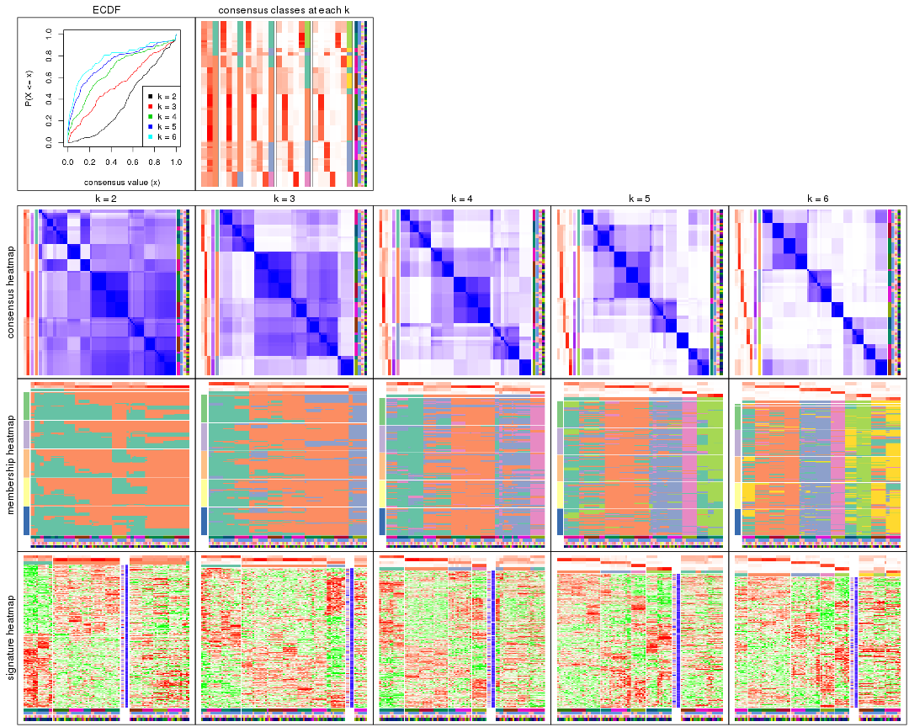

The plots are:

- The first row: a plot of the ECDF (empirical cumulative distribution
  function) curves of the consensus matrix for each `k` and the heatmap of
  predicted classes for each `k`.
- The second row: heatmaps of the consensus matrix for each `k`.
- The third row: heatmaps of the membership matrix for each `k`.
- The fouth row: heatmaps of the signatures for each `k`.

All the plots in panels can be made by individual functions and they are
plotted later in this section.

`select_partition_number()` produces several plots showing different
statistics for choosing "optimized" `k`. There are following statistics:

- ECDF curves of the consensus matrix for each `k`;
- 1-PAC. [The PAC
  score](https://en.wikipedia.org/wiki/Consensus_clustering#Over-interpretation_potential_of_consensus_clustering)
  measures the proportion of the ambiguous subgrouping.
- Mean silhouette score.
- Concordance. The mean probability of fiting the consensus class ids in all
  partitions.
- Area increased. Denote $A_k$ as the area under the ECDF curve for current
  `k`, the area increased is defined as $A_k - A_{k-1}$.
- Rand index. The percent of pairs of samples that are both in a same cluster
  or both are not in a same cluster in the partition of k and k-1.
- Jaccard index. The ratio of pairs of samples are both in a same cluster in
  the partition of k and k-1 and the pairs of samples are both in a same
  cluster in the partition k or k-1.

The detailed explanations of these statistics can be found in [the _cola_
vignette](http://bioconductor.org/packages/devel/bioc/vignettes/cola/inst/doc/cola.html#toc_13).

Generally speaking, lower PAC score, higher mean silhouette score or higher
concordance corresponds to better partition. Rand index and Jaccard index
measure how similar the current partition is compared to partition with `k-1`.
If they are too similar, we won't accept `k` is better than `k-1`.

```r
select_partition_number(res)
```


The numeric values for all these statistics can be obtained by `get_stats()`.

```r
get_stats(res)
```

```
#>   k 1-PAC mean_silhouette concordance area_increased  Rand Jaccard
#> 2 2 0.163           0.437       0.683         0.3825 0.665   0.665
#> 3 3 0.285           0.685       0.798         0.4364 0.741   0.627
#> 4 4 0.343           0.570       0.705         0.2314 0.807   0.602
#> 5 5 0.519           0.622       0.723         0.0983 0.844   0.543
#> 6 6 0.638           0.655       0.711         0.0563 0.958   0.812
```

`suggest_best_k()` suggests the best $k$ based on these statistics. The rules are as follows:

- All $k$ with Jaccard index larger than 0.95 are removed because increasing
  $k$ does not provide enough extra information. If all $k$ are removed, it is
  marked as no subgroup is detected.
- For all $k$ with 1-PAC score larger than 0.9, the maximal $k$ is taken as
  the best $k$, and other $k$ are marked as optional $k$.
- If it does not fit the second rule. The $k$ with the maximal vote of the
  highest 1-PAC score, highest mean silhouette, and highest concordance is
  taken as the best $k$.

```r
suggest_best_k(res)
```

```
#> [1] 3
```


Following shows the table of the partitions (You need to click the **show/hide
code output** link to see it). The membership matrix (columns with name `p*`)
is inferred by
[`clue::cl_consensus()`](https://www.rdocumentation.org/link/cl_consensus?package=clue)
function with the `SE` method. Basically the value in the membership matrix
represents the probability to belong to a certain group. The finall class
label for an item is determined with the group with highest probability it
belongs to.

In `get_classes()` function, the entropy is calculated from the membership
matrix and the silhouette score is calculated from the consensus matrix.


<script>
$( function() {
	$( '#tabs-SD-kmeans-get-classes' ).tabs();
} );
</script>
<div id='tabs-SD-kmeans-get-classes'>
<ul>
<li><a href='#tab-SD-kmeans-get-classes-1'>k = 2</a></li>
<li><a href='#tab-SD-kmeans-get-classes-2'>k = 3</a></li>
<li><a href='#tab-SD-kmeans-get-classes-3'>k = 4</a></li>
<li><a href='#tab-SD-kmeans-get-classes-4'>k = 5</a></li>
<li><a href='#tab-SD-kmeans-get-classes-5'>k = 6</a></li>
</ul>

<div id='tab-SD-kmeans-get-classes-1'>
<p><a id='tab-SD-kmeans-get-classes-1-a' style='color:#0366d6' href='#'>show/hide code output</a></p>
<pre><code class="r">cbind(get_classes(res, k = 2), get_membership(res, k = 2))
</code></pre>

<pre><code>#&gt;           class entropy silhouette    p1    p2
#&gt; GSM614415     1  0.9922      0.623 0.552 0.448
#&gt; GSM614416     1  0.9922      0.623 0.552 0.448
#&gt; GSM614417     1  0.9922      0.623 0.552 0.448
#&gt; GSM614418     1  0.9922      0.623 0.552 0.448
#&gt; GSM614419     1  0.9358      0.737 0.648 0.352
#&gt; GSM614420     1  0.9358      0.737 0.648 0.352
#&gt; GSM614421     2  0.9522      0.286 0.372 0.628
#&gt; GSM614422     2  0.9552      0.280 0.376 0.624
#&gt; GSM614423     2  0.6438      0.528 0.164 0.836
#&gt; GSM614424     2  0.9522      0.286 0.372 0.628
#&gt; GSM614425     2  0.9522      0.286 0.372 0.628
#&gt; GSM614426     2  0.9522      0.286 0.372 0.628
#&gt; GSM614427     2  0.9580      0.272 0.380 0.620
#&gt; GSM614428     2  0.9909      0.177 0.444 0.556
#&gt; GSM614429     2  0.0672      0.628 0.008 0.992
#&gt; GSM614430     2  0.0938      0.627 0.012 0.988
#&gt; GSM614431     2  0.0672      0.628 0.008 0.992
#&gt; GSM614432     2  0.0672      0.628 0.008 0.992
#&gt; GSM614433     2  0.0672      0.628 0.008 0.992
#&gt; GSM614434     2  0.0672      0.628 0.008 0.992
#&gt; GSM614435     2  0.3114      0.608 0.056 0.944
#&gt; GSM614436     2  0.6973      0.510 0.188 0.812
#&gt; GSM614437     2  0.9909      0.243 0.444 0.556
#&gt; GSM614438     2  0.9977      0.217 0.472 0.528
#&gt; GSM614439     2  0.9977      0.217 0.472 0.528
#&gt; GSM614440     2  0.9977      0.217 0.472 0.528
#&gt; GSM614441     2  0.9977      0.217 0.472 0.528
#&gt; GSM614442     2  0.9977      0.217 0.472 0.528
#&gt; GSM614443     2  0.9963      0.225 0.464 0.536
#&gt; GSM614444     2  0.9977      0.217 0.472 0.528
#&gt; GSM614391     1  0.9248      0.738 0.660 0.340
#&gt; GSM614392     1  0.9522      0.723 0.628 0.372
#&gt; GSM614393     1  0.9522      0.723 0.628 0.372
#&gt; GSM614394     1  0.9248      0.738 0.660 0.340
#&gt; GSM614395     1  0.5294      0.521 0.880 0.120
#&gt; GSM614396     1  0.9248      0.738 0.660 0.340
#&gt; GSM614397     1  0.7674      0.638 0.776 0.224
#&gt; GSM614398     1  0.8499      0.688 0.724 0.276
#&gt; GSM614399     2  0.5059      0.585 0.112 0.888
#&gt; GSM614400     2  0.5059      0.585 0.112 0.888
#&gt; GSM614401     2  0.5059      0.585 0.112 0.888
#&gt; GSM614402     2  0.5059      0.585 0.112 0.888
#&gt; GSM614403     2  0.5178      0.582 0.116 0.884
#&gt; GSM614404     2  0.5059      0.585 0.112 0.888
#&gt; GSM614405     2  0.5059      0.585 0.112 0.888
#&gt; GSM614406     2  0.9323      0.347 0.348 0.652
#&gt; GSM614407     2  0.9977     -0.446 0.472 0.528
#&gt; GSM614408     2  0.9977     -0.446 0.472 0.528
#&gt; GSM614409     2  0.9983     -0.456 0.476 0.524
#&gt; GSM614410     2  0.9977     -0.446 0.472 0.528
#&gt; GSM614411     2  0.9983     -0.456 0.476 0.524
#&gt; GSM614412     2  0.9983     -0.456 0.476 0.524
#&gt; GSM614413     1  0.9522      0.649 0.628 0.372
#&gt; GSM614414     1  0.9522      0.649 0.628 0.372
#&gt; GSM614445     2  0.5408      0.576 0.124 0.876
#&gt; GSM614446     2  0.5408      0.576 0.124 0.876
#&gt; GSM614447     2  0.5408      0.576 0.124 0.876
#&gt; GSM614448     2  0.9209      0.364 0.336 0.664
#&gt; GSM614449     2  0.8267      0.459 0.260 0.740
#&gt; GSM614450     2  0.5737      0.567 0.136 0.864
#&gt; GSM614451     1  0.9909     -0.121 0.556 0.444
#&gt; GSM614452     1  0.9909     -0.121 0.556 0.444
#&gt; GSM614453     2  0.3274      0.606 0.060 0.940
#&gt; GSM614454     2  0.3274      0.606 0.060 0.940
#&gt; GSM614455     2  0.3274      0.606 0.060 0.940
#&gt; GSM614456     2  0.3274      0.606 0.060 0.940
#&gt; GSM614457     2  0.3274      0.606 0.060 0.940
#&gt; GSM614458     2  0.3274      0.606 0.060 0.940
#&gt; GSM614459     2  0.3274      0.606 0.060 0.940
#&gt; GSM614460     2  0.3274      0.606 0.060 0.940
#&gt; GSM614461     2  0.0000      0.629 0.000 1.000
#&gt; GSM614462     2  0.0000      0.629 0.000 1.000
#&gt; GSM614463     2  0.0000      0.629 0.000 1.000
#&gt; GSM614464     2  0.0000      0.629 0.000 1.000
#&gt; GSM614465     2  0.0000      0.629 0.000 1.000
#&gt; GSM614466     2  0.0000      0.629 0.000 1.000
#&gt; GSM614467     2  0.0000      0.629 0.000 1.000
#&gt; GSM614468     2  0.0000      0.629 0.000 1.000
#&gt; GSM614469     2  0.8016      0.367 0.244 0.756
#&gt; GSM614470     2  0.8016      0.367 0.244 0.756
#&gt; GSM614471     2  0.8016      0.367 0.244 0.756
#&gt; GSM614472     2  0.8016      0.367 0.244 0.756
#&gt; GSM614473     2  0.8016      0.367 0.244 0.756
#&gt; GSM614474     2  0.8016      0.367 0.244 0.756
#&gt; GSM614475     2  0.6973      0.486 0.188 0.812
#&gt; GSM614476     2  0.6343      0.539 0.160 0.840
</code></pre>

<script>
$('#tab-SD-kmeans-get-classes-1-a').parent().next().next().hide();
$('#tab-SD-kmeans-get-classes-1-a').click(function(){
  $('#tab-SD-kmeans-get-classes-1-a').parent().next().next().toggle();
  return(false);
});
</script>
</div>

<div id='tab-SD-kmeans-get-classes-2'>
<p><a id='tab-SD-kmeans-get-classes-2-a' style='color:#0366d6' href='#'>show/hide code output</a></p>
<pre><code class="r">cbind(get_classes(res, k = 3), get_membership(res, k = 3))
</code></pre>

<pre><code>#&gt;           class entropy silhouette    p1    p2    p3
#&gt; GSM614415     1  0.2955      0.777 0.912 0.080 0.008
#&gt; GSM614416     1  0.2955      0.777 0.912 0.080 0.008
#&gt; GSM614417     1  0.2955      0.777 0.912 0.080 0.008
#&gt; GSM614418     1  0.2955      0.777 0.912 0.080 0.008
#&gt; GSM614419     1  0.2492      0.774 0.936 0.048 0.016
#&gt; GSM614420     1  0.2492      0.774 0.936 0.048 0.016
#&gt; GSM614421     2  0.9501      0.406 0.224 0.488 0.288
#&gt; GSM614422     2  0.9501      0.406 0.224 0.488 0.288
#&gt; GSM614423     2  0.6915      0.704 0.140 0.736 0.124
#&gt; GSM614424     2  0.9501      0.406 0.224 0.488 0.288
#&gt; GSM614425     2  0.9501      0.406 0.224 0.488 0.288
#&gt; GSM614426     2  0.9501      0.406 0.224 0.488 0.288
#&gt; GSM614427     2  0.9501      0.406 0.224 0.488 0.288
#&gt; GSM614428     2  0.9519      0.397 0.224 0.484 0.292
#&gt; GSM614429     2  0.0237      0.717 0.000 0.996 0.004
#&gt; GSM614430     2  0.0237      0.717 0.000 0.996 0.004
#&gt; GSM614431     2  0.0237      0.717 0.000 0.996 0.004
#&gt; GSM614432     2  0.0237      0.717 0.000 0.996 0.004
#&gt; GSM614433     2  0.0000      0.718 0.000 1.000 0.000
#&gt; GSM614434     2  0.0237      0.717 0.000 0.996 0.004
#&gt; GSM614435     2  0.0592      0.712 0.000 0.988 0.012
#&gt; GSM614436     2  0.2711      0.652 0.000 0.912 0.088
#&gt; GSM614437     3  0.5588      0.921 0.004 0.276 0.720
#&gt; GSM614438     3  0.5728      0.925 0.008 0.272 0.720
#&gt; GSM614439     3  0.5728      0.925 0.008 0.272 0.720
#&gt; GSM614440     3  0.5728      0.925 0.008 0.272 0.720
#&gt; GSM614441     3  0.5728      0.925 0.008 0.272 0.720
#&gt; GSM614442     3  0.5728      0.925 0.008 0.272 0.720
#&gt; GSM614443     3  0.5588      0.921 0.004 0.276 0.720
#&gt; GSM614444     3  0.5728      0.925 0.008 0.272 0.720
#&gt; GSM614391     1  0.3886      0.749 0.880 0.024 0.096
#&gt; GSM614392     1  0.3886      0.749 0.880 0.024 0.096
#&gt; GSM614393     1  0.3886      0.749 0.880 0.024 0.096
#&gt; GSM614394     1  0.3886      0.749 0.880 0.024 0.096
#&gt; GSM614395     1  0.4978      0.629 0.780 0.004 0.216
#&gt; GSM614396     1  0.3886      0.749 0.880 0.024 0.096
#&gt; GSM614397     1  0.4164      0.712 0.848 0.008 0.144
#&gt; GSM614398     1  0.3989      0.731 0.864 0.012 0.124
#&gt; GSM614399     2  0.6809      0.715 0.156 0.740 0.104
#&gt; GSM614400     2  0.6809      0.715 0.156 0.740 0.104
#&gt; GSM614401     2  0.6809      0.715 0.156 0.740 0.104
#&gt; GSM614402     2  0.6809      0.715 0.156 0.740 0.104
#&gt; GSM614403     2  0.6455      0.722 0.128 0.764 0.108
#&gt; GSM614404     2  0.6809      0.715 0.156 0.740 0.104
#&gt; GSM614405     2  0.6583      0.720 0.136 0.756 0.108
#&gt; GSM614406     2  0.8464      0.528 0.128 0.592 0.280
#&gt; GSM614407     1  0.7446      0.613 0.664 0.260 0.076
#&gt; GSM614408     1  0.7446      0.613 0.664 0.260 0.076
#&gt; GSM614409     1  0.7446      0.613 0.664 0.260 0.076
#&gt; GSM614410     1  0.7446      0.613 0.664 0.260 0.076
#&gt; GSM614411     1  0.7446      0.613 0.664 0.260 0.076
#&gt; GSM614412     1  0.7376      0.622 0.672 0.252 0.076
#&gt; GSM614413     1  0.7605      0.650 0.684 0.192 0.124
#&gt; GSM614414     1  0.7605      0.650 0.684 0.192 0.124
#&gt; GSM614445     2  0.6079      0.720 0.088 0.784 0.128
#&gt; GSM614446     2  0.6079      0.720 0.088 0.784 0.128
#&gt; GSM614447     2  0.6079      0.720 0.088 0.784 0.128
#&gt; GSM614448     2  0.8622      0.505 0.132 0.572 0.296
#&gt; GSM614449     2  0.7935      0.612 0.116 0.648 0.236
#&gt; GSM614450     2  0.6079      0.720 0.088 0.784 0.128
#&gt; GSM614451     3  0.7059      0.670 0.092 0.192 0.716
#&gt; GSM614452     3  0.7059      0.670 0.092 0.192 0.716
#&gt; GSM614453     2  0.2496      0.677 0.004 0.928 0.068
#&gt; GSM614454     2  0.2496      0.677 0.004 0.928 0.068
#&gt; GSM614455     2  0.2496      0.677 0.004 0.928 0.068
#&gt; GSM614456     2  0.2590      0.673 0.004 0.924 0.072
#&gt; GSM614457     2  0.2590      0.673 0.004 0.924 0.072
#&gt; GSM614458     2  0.2496      0.677 0.004 0.928 0.068
#&gt; GSM614459     2  0.2590      0.673 0.004 0.924 0.072
#&gt; GSM614460     2  0.2590      0.673 0.004 0.924 0.072
#&gt; GSM614461     2  0.1015      0.717 0.008 0.980 0.012
#&gt; GSM614462     2  0.1015      0.717 0.008 0.980 0.012
#&gt; GSM614463     2  0.1015      0.717 0.008 0.980 0.012
#&gt; GSM614464     2  0.1015      0.717 0.008 0.980 0.012
#&gt; GSM614465     2  0.1015      0.717 0.008 0.980 0.012
#&gt; GSM614466     2  0.1015      0.717 0.008 0.980 0.012
#&gt; GSM614467     2  0.0829      0.715 0.004 0.984 0.012
#&gt; GSM614468     2  0.1015      0.717 0.008 0.980 0.012
#&gt; GSM614469     2  0.7477      0.592 0.284 0.648 0.068
#&gt; GSM614470     2  0.7477      0.592 0.284 0.648 0.068
#&gt; GSM614471     2  0.7477      0.592 0.284 0.648 0.068
#&gt; GSM614472     2  0.7477      0.592 0.284 0.648 0.068
#&gt; GSM614473     2  0.7477      0.592 0.284 0.648 0.068
#&gt; GSM614474     2  0.7477      0.592 0.284 0.648 0.068
#&gt; GSM614475     2  0.7376      0.633 0.252 0.672 0.076
#&gt; GSM614476     2  0.7413      0.659 0.224 0.684 0.092
</code></pre>

<script>
$('#tab-SD-kmeans-get-classes-2-a').parent().next().next().hide();
$('#tab-SD-kmeans-get-classes-2-a').click(function(){
  $('#tab-SD-kmeans-get-classes-2-a').parent().next().next().toggle();
  return(false);
});
</script>
</div>

<div id='tab-SD-kmeans-get-classes-3'>
<p><a id='tab-SD-kmeans-get-classes-3-a' style='color:#0366d6' href='#'>show/hide code output</a></p>
<pre><code class="r">cbind(get_classes(res, k = 4), get_membership(res, k = 4))
</code></pre>

<pre><code>#&gt;           class entropy silhouette    p1    p2    p3    p4
#&gt; GSM614415     1  0.2694     0.6873 0.916 0.016 0.044 0.024
#&gt; GSM614416     1  0.2694     0.6873 0.916 0.016 0.044 0.024
#&gt; GSM614417     1  0.2694     0.6873 0.916 0.016 0.044 0.024
#&gt; GSM614418     1  0.2694     0.6873 0.916 0.016 0.044 0.024
#&gt; GSM614419     1  0.3159     0.6875 0.892 0.012 0.068 0.028
#&gt; GSM614420     1  0.3159     0.6875 0.892 0.012 0.068 0.028
#&gt; GSM614421     3  0.8227     0.7064 0.096 0.172 0.572 0.160
#&gt; GSM614422     3  0.8190     0.7068 0.096 0.172 0.576 0.156
#&gt; GSM614423     3  0.6396     0.5724 0.064 0.328 0.600 0.008
#&gt; GSM614424     3  0.8227     0.7064 0.096 0.172 0.572 0.160
#&gt; GSM614425     3  0.8227     0.7064 0.096 0.172 0.572 0.160
#&gt; GSM614426     3  0.8227     0.7064 0.096 0.172 0.572 0.160
#&gt; GSM614427     3  0.8227     0.7064 0.096 0.172 0.572 0.160
#&gt; GSM614428     3  0.8227     0.7064 0.096 0.172 0.572 0.160
#&gt; GSM614429     2  0.0000     0.6606 0.000 1.000 0.000 0.000
#&gt; GSM614430     2  0.0000     0.6606 0.000 1.000 0.000 0.000
#&gt; GSM614431     2  0.0000     0.6606 0.000 1.000 0.000 0.000
#&gt; GSM614432     2  0.0000     0.6606 0.000 1.000 0.000 0.000
#&gt; GSM614433     2  0.0336     0.6589 0.000 0.992 0.008 0.000
#&gt; GSM614434     2  0.0000     0.6606 0.000 1.000 0.000 0.000
#&gt; GSM614435     2  0.0188     0.6596 0.000 0.996 0.000 0.004
#&gt; GSM614436     2  0.1743     0.6168 0.000 0.940 0.004 0.056
#&gt; GSM614437     4  0.3402     0.9899 0.000 0.164 0.004 0.832
#&gt; GSM614438     4  0.3498     0.9966 0.000 0.160 0.008 0.832
#&gt; GSM614439     4  0.3498     0.9966 0.000 0.160 0.008 0.832
#&gt; GSM614440     4  0.3498     0.9966 0.000 0.160 0.008 0.832
#&gt; GSM614441     4  0.3498     0.9966 0.000 0.160 0.008 0.832
#&gt; GSM614442     4  0.3498     0.9966 0.000 0.160 0.008 0.832
#&gt; GSM614443     4  0.3402     0.9899 0.000 0.164 0.004 0.832
#&gt; GSM614444     4  0.3498     0.9966 0.000 0.160 0.008 0.832
#&gt; GSM614391     1  0.4139     0.6732 0.816 0.000 0.144 0.040
#&gt; GSM614392     1  0.4139     0.6732 0.816 0.000 0.144 0.040
#&gt; GSM614393     1  0.4139     0.6732 0.816 0.000 0.144 0.040
#&gt; GSM614394     1  0.4237     0.6691 0.808 0.000 0.152 0.040
#&gt; GSM614395     1  0.5663     0.5243 0.676 0.000 0.264 0.060
#&gt; GSM614396     1  0.4237     0.6691 0.808 0.000 0.152 0.040
#&gt; GSM614397     1  0.4831     0.6189 0.752 0.000 0.208 0.040
#&gt; GSM614398     1  0.4755     0.6271 0.760 0.000 0.200 0.040
#&gt; GSM614399     2  0.8235     0.3374 0.160 0.492 0.304 0.044
#&gt; GSM614400     2  0.8235     0.3374 0.160 0.492 0.304 0.044
#&gt; GSM614401     2  0.8235     0.3374 0.160 0.492 0.304 0.044
#&gt; GSM614402     2  0.8235     0.3374 0.160 0.492 0.304 0.044
#&gt; GSM614403     2  0.7802     0.0354 0.112 0.436 0.420 0.032
#&gt; GSM614404     2  0.8235     0.3374 0.160 0.492 0.304 0.044
#&gt; GSM614405     2  0.8185     0.2268 0.136 0.456 0.364 0.044
#&gt; GSM614406     3  0.7429     0.6287 0.020 0.240 0.580 0.160
#&gt; GSM614407     1  0.8272     0.4368 0.508 0.148 0.288 0.056
#&gt; GSM614408     1  0.8272     0.4368 0.508 0.148 0.288 0.056
#&gt; GSM614409     1  0.8231     0.4361 0.508 0.140 0.296 0.056
#&gt; GSM614410     1  0.8272     0.4368 0.508 0.148 0.288 0.056
#&gt; GSM614411     1  0.8231     0.4361 0.508 0.140 0.296 0.056
#&gt; GSM614412     1  0.8155     0.4406 0.516 0.132 0.296 0.056
#&gt; GSM614413     3  0.7679    -0.3365 0.428 0.048 0.448 0.076
#&gt; GSM614414     3  0.7679    -0.3365 0.428 0.048 0.448 0.076
#&gt; GSM614445     3  0.6782     0.4188 0.060 0.400 0.524 0.016
#&gt; GSM614446     3  0.6612     0.5137 0.056 0.360 0.568 0.016
#&gt; GSM614447     3  0.6746     0.4565 0.060 0.384 0.540 0.016
#&gt; GSM614448     3  0.7521     0.6870 0.040 0.208 0.604 0.148
#&gt; GSM614449     3  0.7170     0.6667 0.036 0.256 0.612 0.096
#&gt; GSM614450     3  0.6555     0.5395 0.056 0.344 0.584 0.016
#&gt; GSM614451     3  0.7588     0.2847 0.040 0.080 0.464 0.416
#&gt; GSM614452     3  0.7588     0.2847 0.040 0.080 0.464 0.416
#&gt; GSM614453     2  0.3082     0.6270 0.000 0.884 0.032 0.084
#&gt; GSM614454     2  0.3082     0.6270 0.000 0.884 0.032 0.084
#&gt; GSM614455     2  0.3082     0.6270 0.000 0.884 0.032 0.084
#&gt; GSM614456     2  0.3082     0.6270 0.000 0.884 0.032 0.084
#&gt; GSM614457     2  0.3082     0.6270 0.000 0.884 0.032 0.084
#&gt; GSM614458     2  0.3013     0.6294 0.000 0.888 0.032 0.080
#&gt; GSM614459     2  0.3082     0.6270 0.000 0.884 0.032 0.084
#&gt; GSM614460     2  0.3082     0.6270 0.000 0.884 0.032 0.084
#&gt; GSM614461     2  0.2408     0.6545 0.004 0.920 0.060 0.016
#&gt; GSM614462     2  0.2408     0.6545 0.004 0.920 0.060 0.016
#&gt; GSM614463     2  0.2408     0.6545 0.004 0.920 0.060 0.016
#&gt; GSM614464     2  0.2408     0.6545 0.004 0.920 0.060 0.016
#&gt; GSM614465     2  0.2408     0.6545 0.004 0.920 0.060 0.016
#&gt; GSM614466     2  0.2408     0.6545 0.004 0.920 0.060 0.016
#&gt; GSM614467     2  0.2408     0.6545 0.004 0.920 0.060 0.016
#&gt; GSM614468     2  0.2408     0.6545 0.004 0.920 0.060 0.016
#&gt; GSM614469     2  0.8367     0.3086 0.328 0.428 0.216 0.028
#&gt; GSM614470     2  0.8367     0.3086 0.328 0.428 0.216 0.028
#&gt; GSM614471     2  0.8367     0.3086 0.328 0.428 0.216 0.028
#&gt; GSM614472     2  0.8367     0.3086 0.328 0.428 0.216 0.028
#&gt; GSM614473     2  0.8367     0.3086 0.328 0.428 0.216 0.028
#&gt; GSM614474     2  0.8367     0.3086 0.328 0.428 0.216 0.028
#&gt; GSM614475     2  0.8390     0.3066 0.320 0.428 0.224 0.028
#&gt; GSM614476     2  0.8450     0.2868 0.280 0.428 0.264 0.028
</code></pre>

<script>
$('#tab-SD-kmeans-get-classes-3-a').parent().next().next().hide();
$('#tab-SD-kmeans-get-classes-3-a').click(function(){
  $('#tab-SD-kmeans-get-classes-3-a').parent().next().next().toggle();
  return(false);
});
</script>
</div>

<div id='tab-SD-kmeans-get-classes-4'>
<p><a id='tab-SD-kmeans-get-classes-4-a' style='color:#0366d6' href='#'>show/hide code output</a></p>
<pre><code class="r">cbind(get_classes(res, k = 5), get_membership(res, k = 5))
</code></pre>

<pre><code>#&gt;           class entropy silhouette    p1    p2    p3    p4    p5
#&gt; GSM614415     5  0.6100     0.6615 0.276 0.008 0.100 0.012 0.604
#&gt; GSM614416     5  0.6100     0.6615 0.276 0.008 0.100 0.012 0.604
#&gt; GSM614417     5  0.6100     0.6615 0.276 0.008 0.100 0.012 0.604
#&gt; GSM614418     5  0.6100     0.6615 0.276 0.008 0.100 0.012 0.604
#&gt; GSM614419     5  0.5868     0.6750 0.264 0.000 0.100 0.016 0.620
#&gt; GSM614420     5  0.5868     0.6750 0.264 0.000 0.100 0.016 0.620
#&gt; GSM614421     3  0.6270     0.7864 0.064 0.080 0.704 0.100 0.052
#&gt; GSM614422     3  0.6280     0.7845 0.068 0.080 0.704 0.096 0.052
#&gt; GSM614423     3  0.5408     0.7404 0.088 0.148 0.728 0.012 0.024
#&gt; GSM614424     3  0.6270     0.7864 0.064 0.080 0.704 0.100 0.052
#&gt; GSM614425     3  0.6270     0.7864 0.064 0.080 0.704 0.100 0.052
#&gt; GSM614426     3  0.6270     0.7864 0.064 0.080 0.704 0.100 0.052
#&gt; GSM614427     3  0.6270     0.7864 0.064 0.080 0.704 0.100 0.052
#&gt; GSM614428     3  0.6328     0.7845 0.068 0.080 0.700 0.100 0.052
#&gt; GSM614429     2  0.1364     0.7673 0.012 0.952 0.036 0.000 0.000
#&gt; GSM614430     2  0.1364     0.7673 0.012 0.952 0.036 0.000 0.000
#&gt; GSM614431     2  0.1364     0.7673 0.012 0.952 0.036 0.000 0.000
#&gt; GSM614432     2  0.1364     0.7673 0.012 0.952 0.036 0.000 0.000
#&gt; GSM614433     2  0.1364     0.7673 0.012 0.952 0.036 0.000 0.000
#&gt; GSM614434     2  0.1364     0.7673 0.012 0.952 0.036 0.000 0.000
#&gt; GSM614435     2  0.1412     0.7673 0.008 0.952 0.036 0.004 0.000
#&gt; GSM614436     2  0.1756     0.7625 0.008 0.940 0.036 0.016 0.000
#&gt; GSM614437     4  0.1197     1.0000 0.000 0.048 0.000 0.952 0.000
#&gt; GSM614438     4  0.1197     1.0000 0.000 0.048 0.000 0.952 0.000
#&gt; GSM614439     4  0.1197     1.0000 0.000 0.048 0.000 0.952 0.000
#&gt; GSM614440     4  0.1197     1.0000 0.000 0.048 0.000 0.952 0.000
#&gt; GSM614441     4  0.1197     1.0000 0.000 0.048 0.000 0.952 0.000
#&gt; GSM614442     4  0.1197     1.0000 0.000 0.048 0.000 0.952 0.000
#&gt; GSM614443     4  0.1197     1.0000 0.000 0.048 0.000 0.952 0.000
#&gt; GSM614444     4  0.1197     1.0000 0.000 0.048 0.000 0.952 0.000
#&gt; GSM614391     5  0.0451     0.7781 0.004 0.000 0.008 0.000 0.988
#&gt; GSM614392     5  0.0451     0.7781 0.004 0.000 0.008 0.000 0.988
#&gt; GSM614393     5  0.0451     0.7781 0.004 0.000 0.008 0.000 0.988
#&gt; GSM614394     5  0.0451     0.7781 0.004 0.000 0.008 0.000 0.988
#&gt; GSM614395     5  0.2802     0.7060 0.016 0.000 0.100 0.008 0.876
#&gt; GSM614396     5  0.0451     0.7781 0.004 0.000 0.008 0.000 0.988
#&gt; GSM614397     5  0.2110     0.7397 0.016 0.000 0.072 0.000 0.912
#&gt; GSM614398     5  0.2046     0.7427 0.016 0.000 0.068 0.000 0.916
#&gt; GSM614399     1  0.7905     0.1599 0.360 0.360 0.220 0.016 0.044
#&gt; GSM614400     2  0.7905    -0.2336 0.360 0.360 0.220 0.016 0.044
#&gt; GSM614401     2  0.7905    -0.2336 0.360 0.360 0.220 0.016 0.044
#&gt; GSM614402     2  0.7905    -0.2336 0.360 0.360 0.220 0.016 0.044
#&gt; GSM614403     3  0.7736    -0.0658 0.296 0.264 0.396 0.016 0.028
#&gt; GSM614404     1  0.7905     0.1599 0.360 0.360 0.220 0.016 0.044
#&gt; GSM614405     1  0.7857     0.1891 0.356 0.316 0.280 0.016 0.032
#&gt; GSM614406     3  0.7140     0.5690 0.200 0.124 0.580 0.088 0.008
#&gt; GSM614407     1  0.6184     0.2777 0.652 0.060 0.056 0.012 0.220
#&gt; GSM614408     1  0.6184     0.2777 0.652 0.060 0.056 0.012 0.220
#&gt; GSM614409     1  0.6184     0.2777 0.652 0.060 0.056 0.012 0.220
#&gt; GSM614410     1  0.6184     0.2777 0.652 0.060 0.056 0.012 0.220
#&gt; GSM614411     1  0.6184     0.2777 0.652 0.060 0.056 0.012 0.220
#&gt; GSM614412     1  0.6184     0.2777 0.652 0.060 0.056 0.012 0.220
#&gt; GSM614413     1  0.6671     0.1250 0.588 0.020 0.176 0.012 0.204
#&gt; GSM614414     1  0.6671     0.1250 0.588 0.020 0.176 0.012 0.204
#&gt; GSM614445     3  0.4444     0.7059 0.052 0.172 0.764 0.012 0.000
#&gt; GSM614446     3  0.4230     0.7208 0.044 0.164 0.780 0.012 0.000
#&gt; GSM614447     3  0.4407     0.7102 0.052 0.168 0.768 0.012 0.000
#&gt; GSM614448     3  0.4490     0.7710 0.020 0.088 0.808 0.060 0.024
#&gt; GSM614449     3  0.3941     0.7546 0.024 0.132 0.816 0.024 0.004
#&gt; GSM614450     3  0.3962     0.7333 0.036 0.152 0.800 0.012 0.000
#&gt; GSM614451     3  0.5475     0.5131 0.012 0.020 0.636 0.304 0.028
#&gt; GSM614452     3  0.5475     0.5131 0.012 0.020 0.636 0.304 0.028
#&gt; GSM614453     2  0.3448     0.7281 0.052 0.860 0.032 0.056 0.000
#&gt; GSM614454     2  0.3448     0.7281 0.052 0.860 0.032 0.056 0.000
#&gt; GSM614455     2  0.3448     0.7281 0.052 0.860 0.032 0.056 0.000
#&gt; GSM614456     2  0.3448     0.7281 0.052 0.860 0.032 0.056 0.000
#&gt; GSM614457     2  0.3448     0.7281 0.052 0.860 0.032 0.056 0.000
#&gt; GSM614458     2  0.3448     0.7281 0.052 0.860 0.032 0.056 0.000
#&gt; GSM614459     2  0.3448     0.7281 0.052 0.860 0.032 0.056 0.000
#&gt; GSM614460     2  0.3448     0.7281 0.052 0.860 0.032 0.056 0.000
#&gt; GSM614461     2  0.4231     0.7171 0.100 0.796 0.096 0.004 0.004
#&gt; GSM614462     2  0.4231     0.7171 0.100 0.796 0.096 0.004 0.004
#&gt; GSM614463     2  0.4231     0.7171 0.100 0.796 0.096 0.004 0.004
#&gt; GSM614464     2  0.4231     0.7171 0.100 0.796 0.096 0.004 0.004
#&gt; GSM614465     2  0.4231     0.7171 0.100 0.796 0.096 0.004 0.004
#&gt; GSM614466     2  0.4231     0.7171 0.100 0.796 0.096 0.004 0.004
#&gt; GSM614467     2  0.4231     0.7171 0.100 0.796 0.096 0.004 0.004
#&gt; GSM614468     2  0.4231     0.7171 0.100 0.796 0.096 0.004 0.004
#&gt; GSM614469     1  0.8222     0.4804 0.380 0.352 0.124 0.016 0.128
#&gt; GSM614470     1  0.8222     0.4804 0.380 0.352 0.124 0.016 0.128
#&gt; GSM614471     1  0.8222     0.4804 0.380 0.352 0.124 0.016 0.128
#&gt; GSM614472     1  0.8222     0.4804 0.380 0.352 0.124 0.016 0.128
#&gt; GSM614473     1  0.8222     0.4804 0.380 0.352 0.124 0.016 0.128
#&gt; GSM614474     1  0.8222     0.4804 0.380 0.352 0.124 0.016 0.128
#&gt; GSM614475     1  0.8221     0.4744 0.380 0.352 0.132 0.016 0.120
#&gt; GSM614476     1  0.8259     0.4636 0.376 0.348 0.148 0.016 0.112
</code></pre>

<script>
$('#tab-SD-kmeans-get-classes-4-a').parent().next().next().hide();
$('#tab-SD-kmeans-get-classes-4-a').click(function(){
  $('#tab-SD-kmeans-get-classes-4-a').parent().next().next().toggle();
  return(false);
});
</script>
</div>

<div id='tab-SD-kmeans-get-classes-5'>
<p><a id='tab-SD-kmeans-get-classes-5-a' style='color:#0366d6' href='#'>show/hide code output</a></p>
<pre><code class="r">cbind(get_classes(res, k = 6), get_membership(res, k = 6))
</code></pre>

<pre><code>#&gt;           class entropy silhouette    p1    p2    p3    p4    p5    p6
#&gt; GSM614415     5   0.709    0.48480 0.248 0.004 0.008 0.040 0.360 0.340
#&gt; GSM614416     5   0.709    0.48480 0.248 0.004 0.008 0.040 0.360 0.340
#&gt; GSM614417     5   0.709    0.48480 0.248 0.004 0.008 0.040 0.360 0.340
#&gt; GSM614418     5   0.709    0.48480 0.248 0.004 0.008 0.040 0.360 0.340
#&gt; GSM614419     5   0.717    0.49930 0.248 0.000 0.020 0.040 0.372 0.320
#&gt; GSM614420     5   0.717    0.49930 0.248 0.000 0.020 0.040 0.372 0.320
#&gt; GSM614421     3   0.252    0.82446 0.000 0.012 0.900 0.028 0.044 0.016
#&gt; GSM614422     3   0.252    0.82446 0.000 0.012 0.900 0.028 0.044 0.016
#&gt; GSM614423     3   0.342    0.79205 0.016 0.052 0.856 0.004 0.044 0.028
#&gt; GSM614424     3   0.252    0.82446 0.000 0.012 0.900 0.028 0.044 0.016
#&gt; GSM614425     3   0.252    0.82446 0.000 0.012 0.900 0.028 0.044 0.016
#&gt; GSM614426     3   0.252    0.82446 0.000 0.012 0.900 0.028 0.044 0.016
#&gt; GSM614427     3   0.252    0.82446 0.000 0.012 0.900 0.028 0.044 0.016
#&gt; GSM614428     3   0.259    0.82225 0.000 0.012 0.896 0.028 0.048 0.016
#&gt; GSM614429     2   0.130    0.77991 0.000 0.952 0.032 0.004 0.000 0.012
#&gt; GSM614430     2   0.130    0.77991 0.000 0.952 0.032 0.004 0.000 0.012
#&gt; GSM614431     2   0.130    0.77991 0.000 0.952 0.032 0.004 0.000 0.012
#&gt; GSM614432     2   0.130    0.77991 0.000 0.952 0.032 0.004 0.000 0.012
#&gt; GSM614433     2   0.130    0.77991 0.000 0.952 0.032 0.004 0.000 0.012
#&gt; GSM614434     2   0.130    0.77991 0.000 0.952 0.032 0.004 0.000 0.012
#&gt; GSM614435     2   0.130    0.77991 0.000 0.952 0.032 0.004 0.000 0.012
#&gt; GSM614436     2   0.166    0.77436 0.000 0.936 0.040 0.012 0.000 0.012
#&gt; GSM614437     4   0.279    0.98919 0.008 0.056 0.056 0.876 0.000 0.004
#&gt; GSM614438     4   0.245    0.99641 0.000 0.060 0.056 0.884 0.000 0.000
#&gt; GSM614439     4   0.245    0.99641 0.000 0.060 0.056 0.884 0.000 0.000
#&gt; GSM614440     4   0.245    0.99641 0.000 0.060 0.056 0.884 0.000 0.000
#&gt; GSM614441     4   0.245    0.99641 0.000 0.060 0.056 0.884 0.000 0.000
#&gt; GSM614442     4   0.245    0.99641 0.000 0.060 0.056 0.884 0.000 0.000
#&gt; GSM614443     4   0.279    0.98919 0.008 0.056 0.056 0.876 0.000 0.004
#&gt; GSM614444     4   0.245    0.99641 0.000 0.060 0.056 0.884 0.000 0.000
#&gt; GSM614391     5   0.146    0.69219 0.000 0.000 0.008 0.000 0.936 0.056
#&gt; GSM614392     5   0.146    0.69219 0.000 0.000 0.008 0.000 0.936 0.056
#&gt; GSM614393     5   0.146    0.69219 0.000 0.000 0.008 0.000 0.936 0.056
#&gt; GSM614394     5   0.146    0.69219 0.000 0.000 0.008 0.000 0.936 0.056
#&gt; GSM614395     5   0.354    0.64653 0.060 0.000 0.052 0.020 0.844 0.024
#&gt; GSM614396     5   0.146    0.69219 0.000 0.000 0.008 0.000 0.936 0.056
#&gt; GSM614397     5   0.285    0.66647 0.040 0.000 0.032 0.012 0.884 0.032
#&gt; GSM614398     5   0.275    0.66852 0.040 0.000 0.032 0.008 0.888 0.032
#&gt; GSM614399     1   0.727    0.93636 0.448 0.236 0.092 0.000 0.012 0.212
#&gt; GSM614400     1   0.727    0.93636 0.448 0.236 0.092 0.000 0.012 0.212
#&gt; GSM614401     1   0.727    0.93636 0.448 0.236 0.092 0.000 0.012 0.212
#&gt; GSM614402     1   0.727    0.93636 0.448 0.236 0.092 0.000 0.012 0.212
#&gt; GSM614403     1   0.736    0.73532 0.456 0.164 0.200 0.000 0.008 0.172
#&gt; GSM614404     1   0.727    0.93636 0.448 0.236 0.092 0.000 0.012 0.212
#&gt; GSM614405     1   0.734    0.89106 0.448 0.212 0.128 0.000 0.008 0.204
#&gt; GSM614406     3   0.683    0.09626 0.340 0.088 0.488 0.016 0.024 0.044
#&gt; GSM614407     6   0.323    0.47775 0.000 0.056 0.036 0.000 0.056 0.852
#&gt; GSM614408     6   0.323    0.47775 0.000 0.056 0.036 0.000 0.056 0.852
#&gt; GSM614409     6   0.323    0.47775 0.000 0.056 0.036 0.000 0.056 0.852
#&gt; GSM614410     6   0.323    0.47775 0.000 0.056 0.036 0.000 0.056 0.852
#&gt; GSM614411     6   0.323    0.47775 0.000 0.056 0.036 0.000 0.056 0.852
#&gt; GSM614412     6   0.323    0.47775 0.000 0.056 0.036 0.000 0.056 0.852
#&gt; GSM614413     6   0.508    0.27753 0.008 0.008 0.188 0.024 0.068 0.704
#&gt; GSM614414     6   0.508    0.27753 0.008 0.008 0.188 0.024 0.068 0.704
#&gt; GSM614445     3   0.509    0.72491 0.148 0.072 0.728 0.016 0.012 0.024
#&gt; GSM614446     3   0.478    0.75079 0.140 0.060 0.752 0.016 0.012 0.020
#&gt; GSM614447     3   0.504    0.73004 0.148 0.068 0.732 0.016 0.012 0.024
#&gt; GSM614448     3   0.341    0.79458 0.116 0.008 0.836 0.016 0.012 0.012
#&gt; GSM614449     3   0.389    0.78449 0.128 0.024 0.808 0.016 0.012 0.012
#&gt; GSM614450     3   0.438    0.76867 0.132 0.044 0.780 0.016 0.012 0.016
#&gt; GSM614451     3   0.454    0.73530 0.100 0.004 0.764 0.104 0.016 0.012
#&gt; GSM614452     3   0.454    0.73530 0.100 0.004 0.764 0.104 0.016 0.012
#&gt; GSM614453     2   0.444    0.73241 0.084 0.784 0.004 0.084 0.028 0.016
#&gt; GSM614454     2   0.444    0.73241 0.084 0.784 0.004 0.084 0.028 0.016
#&gt; GSM614455     2   0.444    0.73241 0.084 0.784 0.004 0.084 0.028 0.016
#&gt; GSM614456     2   0.444    0.73241 0.084 0.784 0.004 0.084 0.028 0.016
#&gt; GSM614457     2   0.444    0.73241 0.084 0.784 0.004 0.084 0.028 0.016
#&gt; GSM614458     2   0.444    0.73241 0.084 0.784 0.004 0.084 0.028 0.016
#&gt; GSM614459     2   0.444    0.73241 0.084 0.784 0.004 0.084 0.028 0.016
#&gt; GSM614460     2   0.444    0.73241 0.084 0.784 0.004 0.084 0.028 0.016
#&gt; GSM614461     2   0.435    0.68372 0.200 0.736 0.024 0.004 0.000 0.036
#&gt; GSM614462     2   0.435    0.68372 0.200 0.736 0.024 0.004 0.000 0.036
#&gt; GSM614463     2   0.435    0.68372 0.200 0.736 0.024 0.004 0.000 0.036
#&gt; GSM614464     2   0.435    0.68372 0.200 0.736 0.024 0.004 0.000 0.036
#&gt; GSM614465     2   0.435    0.68372 0.200 0.736 0.024 0.004 0.000 0.036
#&gt; GSM614466     2   0.435    0.68372 0.200 0.736 0.024 0.004 0.000 0.036
#&gt; GSM614467     2   0.435    0.68372 0.200 0.736 0.024 0.004 0.000 0.036
#&gt; GSM614468     2   0.435    0.68372 0.200 0.736 0.024 0.004 0.000 0.036
#&gt; GSM614469     6   0.810    0.00453 0.220 0.280 0.068 0.016 0.048 0.368
#&gt; GSM614470     6   0.810    0.00453 0.220 0.280 0.068 0.016 0.048 0.368
#&gt; GSM614471     6   0.810    0.00453 0.220 0.280 0.068 0.016 0.048 0.368
#&gt; GSM614472     6   0.810    0.00453 0.220 0.280 0.068 0.016 0.048 0.368
#&gt; GSM614473     6   0.810    0.00453 0.220 0.280 0.068 0.016 0.048 0.368
#&gt; GSM614474     6   0.810    0.00453 0.220 0.280 0.068 0.016 0.048 0.368
#&gt; GSM614475     6   0.810    0.00453 0.220 0.280 0.068 0.016 0.048 0.368
#&gt; GSM614476     6   0.824   -0.04818 0.220 0.276 0.084 0.016 0.048 0.356
</code></pre>

<script>
$('#tab-SD-kmeans-get-classes-5-a').parent().next().next().hide();
$('#tab-SD-kmeans-get-classes-5-a').click(function(){
  $('#tab-SD-kmeans-get-classes-5-a').parent().next().next().toggle();
  return(false);
});
</script>
</div>
</div>

Heatmaps for the consensus matrix. It visualizes the probability of two
samples to be in a same group.


<script>
$( function() {
	$( '#tabs-SD-kmeans-consensus-heatmap' ).tabs();
} );
</script>
<div id='tabs-SD-kmeans-consensus-heatmap'>
<ul>
<li><a href='#tab-SD-kmeans-consensus-heatmap-1'>k = 2</a></li>
<li><a href='#tab-SD-kmeans-consensus-heatmap-2'>k = 3</a></li>
<li><a href='#tab-SD-kmeans-consensus-heatmap-3'>k = 4</a></li>
<li><a href='#tab-SD-kmeans-consensus-heatmap-4'>k = 5</a></li>
<li><a href='#tab-SD-kmeans-consensus-heatmap-5'>k = 6</a></li>
</ul>
<div id='tab-SD-kmeans-consensus-heatmap-1'>
<pre><code class="r">consensus_heatmap(res, k = 2)
</code></pre>

<p></p>

</div>
<div id='tab-SD-kmeans-consensus-heatmap-2'>
<pre><code class="r">consensus_heatmap(res, k = 3)
</code></pre>

<p></p>

</div>
<div id='tab-SD-kmeans-consensus-heatmap-3'>
<pre><code class="r">consensus_heatmap(res, k = 4)
</code></pre>

<p></p>

</div>
<div id='tab-SD-kmeans-consensus-heatmap-4'>
<pre><code class="r">consensus_heatmap(res, k = 5)
</code></pre>

<p></p>

</div>
<div id='tab-SD-kmeans-consensus-heatmap-5'>
<pre><code class="r">consensus_heatmap(res, k = 6)
</code></pre>

<p></p>

</div>
</div>

Heatmaps for the membership of samples in all partitions to see how consistent they are:


<script>
$( function() {
	$( '#tabs-SD-kmeans-membership-heatmap' ).tabs();
} );
</script>
<div id='tabs-SD-kmeans-membership-heatmap'>
<ul>
<li><a href='#tab-SD-kmeans-membership-heatmap-1'>k = 2</a></li>
<li><a href='#tab-SD-kmeans-membership-heatmap-2'>k = 3</a></li>
<li><a href='#tab-SD-kmeans-membership-heatmap-3'>k = 4</a></li>
<li><a href='#tab-SD-kmeans-membership-heatmap-4'>k = 5</a></li>
<li><a href='#tab-SD-kmeans-membership-heatmap-5'>k = 6</a></li>
</ul>
<div id='tab-SD-kmeans-membership-heatmap-1'>
<pre><code class="r">membership_heatmap(res, k = 2)
</code></pre>

<p></p>

</div>
<div id='tab-SD-kmeans-membership-heatmap-2'>
<pre><code class="r">membership_heatmap(res, k = 3)
</code></pre>

<p></p>

</div>
<div id='tab-SD-kmeans-membership-heatmap-3'>
<pre><code class="r">membership_heatmap(res, k = 4)
</code></pre>

<p></p>

</div>
<div id='tab-SD-kmeans-membership-heatmap-4'>
<pre><code class="r">membership_heatmap(res, k = 5)
</code></pre>

<p></p>

</div>
<div id='tab-SD-kmeans-membership-heatmap-5'>
<pre><code class="r">membership_heatmap(res, k = 6)
</code></pre>

<p></p>

</div>
</div>

As soon as we have had the classes for columns, we can look for signatures
which are significantly different between classes which can be candidate marks
for certain classes. Following are the heatmaps for signatures.


Signature heatmaps where rows are scaled:


<script>
$( function() {
	$( '#tabs-SD-kmeans-get-signatures' ).tabs();
} );
</script>
<div id='tabs-SD-kmeans-get-signatures'>
<ul>
<li><a href='#tab-SD-kmeans-get-signatures-1'>k = 2</a></li>
<li><a href='#tab-SD-kmeans-get-signatures-2'>k = 3</a></li>
<li><a href='#tab-SD-kmeans-get-signatures-3'>k = 4</a></li>
<li><a href='#tab-SD-kmeans-get-signatures-4'>k = 5</a></li>
<li><a href='#tab-SD-kmeans-get-signatures-5'>k = 6</a></li>
</ul>
<div id='tab-SD-kmeans-get-signatures-1'>
<pre><code class="r">get_signatures(res, k = 2)
</code></pre>

<p></p>

</div>
<div id='tab-SD-kmeans-get-signatures-2'>
<pre><code class="r">get_signatures(res, k = 3)
</code></pre>

<p></p>

</div>
<div id='tab-SD-kmeans-get-signatures-3'>
<pre><code class="r">get_signatures(res, k = 4)
</code></pre>

<p></p>

</div>
<div id='tab-SD-kmeans-get-signatures-4'>
<pre><code class="r">get_signatures(res, k = 5)
</code></pre>

<p></p>

</div>
<div id='tab-SD-kmeans-get-signatures-5'>
<pre><code class="r">get_signatures(res, k = 6)
</code></pre>

<p></p>

</div>
</div>


Signature heatmaps where rows are not scaled:


<script>
$( function() {
	$( '#tabs-SD-kmeans-get-signatures-no-scale' ).tabs();
} );
</script>
<div id='tabs-SD-kmeans-get-signatures-no-scale'>
<ul>
<li><a href='#tab-SD-kmeans-get-signatures-no-scale-1'>k = 2</a></li>
<li><a href='#tab-SD-kmeans-get-signatures-no-scale-2'>k = 3</a></li>
<li><a href='#tab-SD-kmeans-get-signatures-no-scale-3'>k = 4</a></li>
<li><a href='#tab-SD-kmeans-get-signatures-no-scale-4'>k = 5</a></li>
<li><a href='#tab-SD-kmeans-get-signatures-no-scale-5'>k = 6</a></li>
</ul>
<div id='tab-SD-kmeans-get-signatures-no-scale-1'>
<pre><code class="r">get_signatures(res, k = 2, scale_rows = FALSE)
</code></pre>

<p></p>

</div>
<div id='tab-SD-kmeans-get-signatures-no-scale-2'>
<pre><code class="r">get_signatures(res, k = 3, scale_rows = FALSE)
</code></pre>

<p></p>

</div>
<div id='tab-SD-kmeans-get-signatures-no-scale-3'>
<pre><code class="r">get_signatures(res, k = 4, scale_rows = FALSE)
</code></pre>

<p></p>

</div>
<div id='tab-SD-kmeans-get-signatures-no-scale-4'>
<pre><code class="r">get_signatures(res, k = 5, scale_rows = FALSE)
</code></pre>

<p></p>

</div>
<div id='tab-SD-kmeans-get-signatures-no-scale-5'>
<pre><code class="r">get_signatures(res, k = 6, scale_rows = FALSE)
</code></pre>

<p></p>

</div>
</div>


Compare the overlap of signatures from different k:

```r
compare_signatures(res)
```


`get_signature()` returns a data frame invisibly. TO get the list of signatures, the function
call should be assigned to a variable explicitly. In following code, if `plot` argument is set
to `FALSE`, no heatmap is plotted while only the differential analysis is performed.

```r
# code only for demonstration
tb = get_signature(res, k = ..., plot = FALSE)
```

An example of the output of `tb` is:

```
#>   which_row         fdr    mean_1    mean_2 scaled_mean_1 scaled_mean_2 km
#> 1        38 0.042760348  8.373488  9.131774    -0.5533452     0.5164555  1
#> 2        40 0.018707592  7.106213  8.469186    -0.6173731     0.5762149  1
#> 3        55 0.019134737 10.221463 11.207825    -0.6159697     0.5749050  1
#> 4        59 0.006059896  5.921854  7.869574    -0.6899429     0.6439467  1
#> 5        60 0.018055526  8.928898 10.211722    -0.6204761     0.5791110  1
#> 6        98 0.009384629 15.714769 14.887706     0.6635654    -0.6193277  2
...
```

The columns in `tb` are:

1. `which_row`: row indices corresponding to the input matrix.
2. `fdr`: FDR for the differential test. 
3. `mean_x`: The mean value in group x.
4. `scaled_mean_x`: The mean value in group x after rows are scaled.
5. `km`: Row groups if k-means clustering is applied to rows.


UMAP plot which shows how samples are separated.


<script>
$( function() {
	$( '#tabs-SD-kmeans-dimension-reduction' ).tabs();
} );
</script>
<div id='tabs-SD-kmeans-dimension-reduction'>
<ul>
<li><a href='#tab-SD-kmeans-dimension-reduction-1'>k = 2</a></li>
<li><a href='#tab-SD-kmeans-dimension-reduction-2'>k = 3</a></li>
<li><a href='#tab-SD-kmeans-dimension-reduction-3'>k = 4</a></li>
<li><a href='#tab-SD-kmeans-dimension-reduction-4'>k = 5</a></li>
<li><a href='#tab-SD-kmeans-dimension-reduction-5'>k = 6</a></li>
</ul>
<div id='tab-SD-kmeans-dimension-reduction-1'>
<pre><code class="r">dimension_reduction(res, k = 2, method = &quot;UMAP&quot;)
</code></pre>

<p></p>

</div>
<div id='tab-SD-kmeans-dimension-reduction-2'>
<pre><code class="r">dimension_reduction(res, k = 3, method = &quot;UMAP&quot;)
</code></pre>

<p></p>

</div>
<div id='tab-SD-kmeans-dimension-reduction-3'>
<pre><code class="r">dimension_reduction(res, k = 4, method = &quot;UMAP&quot;)
</code></pre>

<p></p>

</div>
<div id='tab-SD-kmeans-dimension-reduction-4'>
<pre><code class="r">dimension_reduction(res, k = 5, method = &quot;UMAP&quot;)
</code></pre>

<p></p>

</div>
<div id='tab-SD-kmeans-dimension-reduction-5'>
<pre><code class="r">dimension_reduction(res, k = 6, method = &quot;UMAP&quot;)
</code></pre>

<p></p>

</div>
</div>


Following heatmap shows how subgroups are split when increasing `k`:

```r
collect_classes(res)
```


Test correlation between subgroups and known annotations. If the known
annotation is numeric, one-way ANOVA test is applied, and if the known
annotation is discrete, chi-squared contingency table test is applied.

```r
test_to_known_factors(res)
```

```
#>            n individual(p) protocol(p) time(p) other(p) k
#> SD:kmeans 53      2.92e-08       1.000       1   0.2218 2
#> SD:kmeans 79      1.03e-20       0.366       1   0.1083 3
#> SD:kmeans 59      2.74e-25       0.882       1   0.0292 4
#> SD:kmeans 63      1.38e-27       0.797       1   0.0578 5
#> SD:kmeans 63      6.86e-38       0.983       1   0.0371 6
```


If matrix rows can be associated to genes, consider to use `functional_enrichment(res,
...)` to perform function enrichment for the signature genes. See [this vignette](http://bioconductor.org/packages/devel/bioc/vignettes/cola/inst/doc/functional_enrichment.html) for more detailed explanations.


 

---------------------------------------------------


### SD:skmeans


The object with results only for a single top-value method and a single partition method 
can be extracted as:

```r
res = res_list["SD", "skmeans"]
# you can also extract it by
# res = res_list["SD:skmeans"]
```

A summary of `res` and all the functions that can be applied to it:

```r
res
```

```
#> A 'ConsensusPartition' object with k = 2, 3, 4, 5, 6.
#>   On a matrix with 21168 rows and 86 columns.
#>   Top rows (1000, 2000, 3000, 4000, 5000) are extracted by 'SD' method.
#>   Subgroups are detected by 'skmeans' method.
#>   Performed in total 1250 partitions by row resampling.
#>   Best k for subgroups seems to be 3.
#> 
#> Following methods can be applied to this 'ConsensusPartition' object:
#>  [1] "cola_report"             "collect_classes"         "collect_plots"          
#>  [4] "collect_stats"           "colnames"                "compare_signatures"     
#>  [7] "consensus_heatmap"       "dimension_reduction"     "functional_enrichment"  
#> [10] "get_anno_col"            "get_anno"                "get_classes"            
#> [13] "get_consensus"           "get_matrix"              "get_membership"         
#> [16] "get_param"               "get_signatures"          "get_stats"              
#> [19] "is_best_k"               "is_stable_k"             "membership_heatmap"     
#> [22] "ncol"                    "nrow"                    "plot_ecdf"              
#> [25] "rownames"                "select_partition_number" "show"                   
#> [28] "suggest_best_k"          "test_to_known_factors"
```

`collect_plots()` function collects all the plots made from `res` for all `k` (number of partitions)
into one single page to provide an easy and fast comparison between different `k`.

```r
collect_plots(res)
```


The plots are:

- The first row: a plot of the ECDF (empirical cumulative distribution
  function) curves of the consensus matrix for each `k` and the heatmap of
  predicted classes for each `k`.
- The second row: heatmaps of the consensus matrix for each `k`.
- The third row: heatmaps of the membership matrix for each `k`.
- The fouth row: heatmaps of the signatures for each `k`.

All the plots in panels can be made by individual functions and they are
plotted later in this section.

`select_partition_number()` produces several plots showing different
statistics for choosing "optimized" `k`. There are following statistics:

- ECDF curves of the consensus matrix for each `k`;
- 1-PAC. [The PAC
  score](https://en.wikipedia.org/wiki/Consensus_clustering#Over-interpretation_potential_of_consensus_clustering)
  measures the proportion of the ambiguous subgrouping.
- Mean silhouette score.
- Concordance. The mean probability of fiting the consensus class ids in all
  partitions.
- Area increased. Denote $A_k$ as the area under the ECDF curve for current
  `k`, the area increased is defined as $A_k - A_{k-1}$.
- Rand index. The percent of pairs of samples that are both in a same cluster
  or both are not in a same cluster in the partition of k and k-1.
- Jaccard index. The ratio of pairs of samples are both in a same cluster in
  the partition of k and k-1 and the pairs of samples are both in a same
  cluster in the partition k or k-1.

The detailed explanations of these statistics can be found in [the _cola_
vignette](http://bioconductor.org/packages/devel/bioc/vignettes/cola/inst/doc/cola.html#toc_13).

Generally speaking, lower PAC score, higher mean silhouette score or higher
concordance corresponds to better partition. Rand index and Jaccard index
measure how similar the current partition is compared to partition with `k-1`.
If they are too similar, we won't accept `k` is better than `k-1`.

```r
select_partition_number(res)
```


The numeric values for all these statistics can be obtained by `get_stats()`.

```r
get_stats(res)
```

```
#>   k 1-PAC mean_silhouette concordance area_increased  Rand Jaccard
#> 2 2 0.402           0.495       0.816         0.5017 0.498   0.498
#> 3 3 0.687           0.854       0.922         0.3298 0.748   0.533
#> 4 4 0.730           0.785       0.862         0.1215 0.842   0.568
#> 5 5 0.787           0.841       0.878         0.0614 0.945   0.784
#> 6 6 0.810           0.826       0.819         0.0371 0.969   0.854
```

`suggest_best_k()` suggests the best $k$ based on these statistics. The rules are as follows:

- All $k$ with Jaccard index larger than 0.95 are removed because increasing
  $k$ does not provide enough extra information. If all $k$ are removed, it is
  marked as no subgroup is detected.
- For all $k$ with 1-PAC score larger than 0.9, the maximal $k$ is taken as
  the best $k$, and other $k$ are marked as optional $k$.
- If it does not fit the second rule. The $k$ with the maximal vote of the
  highest 1-PAC score, highest mean silhouette, and highest concordance is
  taken as the best $k$.

```r
suggest_best_k(res)
```

```
#> [1] 3
```


Following shows the table of the partitions (You need to click the **show/hide
code output** link to see it). The membership matrix (columns with name `p*`)
is inferred by
[`clue::cl_consensus()`](https://www.rdocumentation.org/link/cl_consensus?package=clue)
function with the `SE` method. Basically the value in the membership matrix
represents the probability to belong to a certain group. The finall class
label for an item is determined with the group with highest probability it
belongs to.

In `get_classes()` function, the entropy is calculated from the membership
matrix and the silhouette score is calculated from the consensus matrix.


<script>
$( function() {
	$( '#tabs-SD-skmeans-get-classes' ).tabs();
} );
</script>
<div id='tabs-SD-skmeans-get-classes'>
<ul>
<li><a href='#tab-SD-skmeans-get-classes-1'>k = 2</a></li>
<li><a href='#tab-SD-skmeans-get-classes-2'>k = 3</a></li>
<li><a href='#tab-SD-skmeans-get-classes-3'>k = 4</a></li>
<li><a href='#tab-SD-skmeans-get-classes-4'>k = 5</a></li>
<li><a href='#tab-SD-skmeans-get-classes-5'>k = 6</a></li>
</ul>

<div id='tab-SD-skmeans-get-classes-1'>
<p><a id='tab-SD-skmeans-get-classes-1-a' style='color:#0366d6' href='#'>show/hide code output</a></p>
<pre><code class="r">cbind(get_classes(res, k = 2), get_membership(res, k = 2))
</code></pre>

<pre><code>#&gt;           class entropy silhouette    p1    p2
#&gt; GSM614415     1   0.118    0.71188 0.984 0.016
#&gt; GSM614416     1   0.118    0.71188 0.984 0.016
#&gt; GSM614417     1   0.118    0.71188 0.984 0.016
#&gt; GSM614418     1   0.118    0.71188 0.984 0.016
#&gt; GSM614419     1   0.000    0.71396 1.000 0.000
#&gt; GSM614420     1   0.000    0.71396 1.000 0.000
#&gt; GSM614421     1   0.978    0.16637 0.588 0.412
#&gt; GSM614422     1   0.795    0.45993 0.760 0.240
#&gt; GSM614423     2   0.909    0.38721 0.324 0.676
#&gt; GSM614424     1   0.978    0.16637 0.588 0.412
#&gt; GSM614425     1   0.975    0.17402 0.592 0.408
#&gt; GSM614426     1   0.975    0.17402 0.592 0.408
#&gt; GSM614427     1   0.980    0.15772 0.584 0.416
#&gt; GSM614428     1   0.980    0.15772 0.584 0.416
#&gt; GSM614429     2   0.000    0.72906 0.000 1.000
#&gt; GSM614430     2   0.000    0.72906 0.000 1.000
#&gt; GSM614431     2   0.000    0.72906 0.000 1.000
#&gt; GSM614432     2   0.000    0.72906 0.000 1.000
#&gt; GSM614433     2   0.000    0.72906 0.000 1.000
#&gt; GSM614434     2   0.000    0.72906 0.000 1.000
#&gt; GSM614435     2   0.000    0.72906 0.000 1.000
#&gt; GSM614436     2   0.163    0.71486 0.024 0.976
#&gt; GSM614437     2   0.706    0.57069 0.192 0.808
#&gt; GSM614438     2   0.992    0.18435 0.448 0.552
#&gt; GSM614439     2   0.992    0.18435 0.448 0.552
#&gt; GSM614440     2   0.992    0.18435 0.448 0.552
#&gt; GSM614441     2   0.992    0.18435 0.448 0.552
#&gt; GSM614442     2   0.992    0.18435 0.448 0.552
#&gt; GSM614443     2   0.929    0.36037 0.344 0.656
#&gt; GSM614444     2   0.992    0.18435 0.448 0.552
#&gt; GSM614391     1   0.000    0.71396 1.000 0.000
#&gt; GSM614392     1   0.000    0.71396 1.000 0.000
#&gt; GSM614393     1   0.000    0.71396 1.000 0.000
#&gt; GSM614394     1   0.000    0.71396 1.000 0.000
#&gt; GSM614395     1   0.000    0.71396 1.000 0.000
#&gt; GSM614396     1   0.000    0.71396 1.000 0.000
#&gt; GSM614397     1   0.000    0.71396 1.000 0.000
#&gt; GSM614398     1   0.000    0.71396 1.000 0.000
#&gt; GSM614399     2   0.978    0.15238 0.412 0.588
#&gt; GSM614400     2   0.980    0.14397 0.416 0.584
#&gt; GSM614401     2   0.980    0.14397 0.416 0.584
#&gt; GSM614402     2   0.980    0.14397 0.416 0.584
#&gt; GSM614403     2   0.971    0.17621 0.400 0.600
#&gt; GSM614404     2   0.980    0.14397 0.416 0.584
#&gt; GSM614405     2   0.985    0.13184 0.428 0.572
#&gt; GSM614406     2   0.992    0.18435 0.448 0.552
#&gt; GSM614407     1   0.416    0.67630 0.916 0.084
#&gt; GSM614408     1   0.416    0.67630 0.916 0.084
#&gt; GSM614409     1   0.311    0.69427 0.944 0.056
#&gt; GSM614410     1   0.416    0.67630 0.916 0.084
#&gt; GSM614411     1   0.343    0.68973 0.936 0.064
#&gt; GSM614412     1   0.000    0.71396 1.000 0.000
#&gt; GSM614413     1   0.000    0.71396 1.000 0.000
#&gt; GSM614414     1   0.000    0.71396 1.000 0.000
#&gt; GSM614445     2   0.443    0.66513 0.092 0.908
#&gt; GSM614446     2   0.443    0.66513 0.092 0.908
#&gt; GSM614447     2   0.443    0.66513 0.092 0.908
#&gt; GSM614448     1   0.995   -0.00694 0.540 0.460
#&gt; GSM614449     1   0.999   -0.05718 0.520 0.480
#&gt; GSM614450     2   0.932    0.39498 0.348 0.652
#&gt; GSM614451     2   0.996    0.14853 0.464 0.536
#&gt; GSM614452     2   0.996    0.14853 0.464 0.536
#&gt; GSM614453     2   0.000    0.72906 0.000 1.000
#&gt; GSM614454     2   0.000    0.72906 0.000 1.000
#&gt; GSM614455     2   0.000    0.72906 0.000 1.000
#&gt; GSM614456     2   0.000    0.72906 0.000 1.000
#&gt; GSM614457     2   0.000    0.72906 0.000 1.000
#&gt; GSM614458     2   0.000    0.72906 0.000 1.000
#&gt; GSM614459     2   0.000    0.72906 0.000 1.000
#&gt; GSM614460     2   0.000    0.72906 0.000 1.000
#&gt; GSM614461     2   0.000    0.72906 0.000 1.000
#&gt; GSM614462     2   0.000    0.72906 0.000 1.000
#&gt; GSM614463     2   0.000    0.72906 0.000 1.000
#&gt; GSM614464     2   0.000    0.72906 0.000 1.000
#&gt; GSM614465     2   0.000    0.72906 0.000 1.000
#&gt; GSM614466     2   0.000    0.72906 0.000 1.000
#&gt; GSM614467     2   0.000    0.72906 0.000 1.000
#&gt; GSM614468     2   0.000    0.72906 0.000 1.000
#&gt; GSM614469     1   0.993    0.16940 0.548 0.452
#&gt; GSM614470     1   0.993    0.16940 0.548 0.452
#&gt; GSM614471     1   0.993    0.16940 0.548 0.452
#&gt; GSM614472     1   0.993    0.16940 0.548 0.452
#&gt; GSM614473     1   0.993    0.16940 0.548 0.452
#&gt; GSM614474     1   0.993    0.16940 0.548 0.452
#&gt; GSM614475     1   0.993    0.16940 0.548 0.452
#&gt; GSM614476     1   0.416    0.66861 0.916 0.084
</code></pre>

<script>
$('#tab-SD-skmeans-get-classes-1-a').parent().next().next().hide();
$('#tab-SD-skmeans-get-classes-1-a').click(function(){
  $('#tab-SD-skmeans-get-classes-1-a').parent().next().next().toggle();
  return(false);
});
</script>
</div>

<div id='tab-SD-skmeans-get-classes-2'>
<p><a id='tab-SD-skmeans-get-classes-2-a' style='color:#0366d6' href='#'>show/hide code output</a></p>
<pre><code class="r">cbind(get_classes(res, k = 3), get_membership(res, k = 3))
</code></pre>

<pre><code>#&gt;           class entropy silhouette    p1    p2    p3
#&gt; GSM614415     1  0.0000      0.927 1.000 0.000 0.000
#&gt; GSM614416     1  0.0000      0.927 1.000 0.000 0.000
#&gt; GSM614417     1  0.0000      0.927 1.000 0.000 0.000
#&gt; GSM614418     1  0.0000      0.927 1.000 0.000 0.000
#&gt; GSM614419     1  0.0000      0.927 1.000 0.000 0.000
#&gt; GSM614420     1  0.0000      0.927 1.000 0.000 0.000
#&gt; GSM614421     3  0.0237      0.882 0.004 0.000 0.996
#&gt; GSM614422     3  0.0237      0.882 0.004 0.000 0.996
#&gt; GSM614423     3  0.2116      0.860 0.012 0.040 0.948
#&gt; GSM614424     3  0.0237      0.882 0.004 0.000 0.996
#&gt; GSM614425     3  0.0237      0.882 0.004 0.000 0.996
#&gt; GSM614426     3  0.0237      0.882 0.004 0.000 0.996
#&gt; GSM614427     3  0.0237      0.882 0.004 0.000 0.996
#&gt; GSM614428     3  0.0237      0.882 0.004 0.000 0.996
#&gt; GSM614429     2  0.0237      0.922 0.000 0.996 0.004
#&gt; GSM614430     2  0.0237      0.922 0.000 0.996 0.004
#&gt; GSM614431     2  0.0237      0.922 0.000 0.996 0.004
#&gt; GSM614432     2  0.0237      0.922 0.000 0.996 0.004
#&gt; GSM614433     2  0.0237      0.922 0.000 0.996 0.004
#&gt; GSM614434     2  0.0237      0.922 0.000 0.996 0.004
#&gt; GSM614435     2  0.0237      0.922 0.000 0.996 0.004
#&gt; GSM614436     3  0.6244      0.382 0.000 0.440 0.560
#&gt; GSM614437     3  0.3941      0.835 0.000 0.156 0.844
#&gt; GSM614438     3  0.3879      0.838 0.000 0.152 0.848
#&gt; GSM614439     3  0.3879      0.838 0.000 0.152 0.848
#&gt; GSM614440     3  0.3879      0.838 0.000 0.152 0.848
#&gt; GSM614441     3  0.3879      0.838 0.000 0.152 0.848
#&gt; GSM614442     3  0.3879      0.838 0.000 0.152 0.848
#&gt; GSM614443     3  0.3879      0.838 0.000 0.152 0.848
#&gt; GSM614444     3  0.3879      0.838 0.000 0.152 0.848
#&gt; GSM614391     1  0.0000      0.927 1.000 0.000 0.000
#&gt; GSM614392     1  0.0000      0.927 1.000 0.000 0.000
#&gt; GSM614393     1  0.0000      0.927 1.000 0.000 0.000
#&gt; GSM614394     1  0.0000      0.927 1.000 0.000 0.000
#&gt; GSM614395     3  0.5810      0.473 0.336 0.000 0.664
#&gt; GSM614396     1  0.0000      0.927 1.000 0.000 0.000
#&gt; GSM614397     1  0.4452      0.737 0.808 0.000 0.192
#&gt; GSM614398     1  0.1643      0.900 0.956 0.000 0.044
#&gt; GSM614399     2  0.5393      0.810 0.044 0.808 0.148
#&gt; GSM614400     2  0.5598      0.805 0.052 0.800 0.148
#&gt; GSM614401     2  0.5598      0.805 0.052 0.800 0.148
#&gt; GSM614402     2  0.5497      0.808 0.048 0.804 0.148
#&gt; GSM614403     2  0.7175      0.480 0.032 0.592 0.376
#&gt; GSM614404     2  0.5598      0.805 0.052 0.800 0.148
#&gt; GSM614405     3  0.7250      0.132 0.032 0.396 0.572
#&gt; GSM614406     3  0.0000      0.882 0.000 0.000 1.000
#&gt; GSM614407     1  0.0000      0.927 1.000 0.000 0.000
#&gt; GSM614408     1  0.0000      0.927 1.000 0.000 0.000
#&gt; GSM614409     1  0.0000      0.927 1.000 0.000 0.000
#&gt; GSM614410     1  0.0000      0.927 1.000 0.000 0.000
#&gt; GSM614411     1  0.0000      0.927 1.000 0.000 0.000
#&gt; GSM614412     1  0.0000      0.927 1.000 0.000 0.000
#&gt; GSM614413     1  0.2165      0.884 0.936 0.000 0.064
#&gt; GSM614414     1  0.1860      0.894 0.948 0.000 0.052
#&gt; GSM614445     2  0.4931      0.759 0.000 0.768 0.232
#&gt; GSM614446     2  0.5560      0.664 0.000 0.700 0.300
#&gt; GSM614447     2  0.5098      0.740 0.000 0.752 0.248
#&gt; GSM614448     3  0.0237      0.881 0.000 0.004 0.996
#&gt; GSM614449     3  0.0237      0.881 0.000 0.004 0.996
#&gt; GSM614450     3  0.1643      0.862 0.000 0.044 0.956
#&gt; GSM614451     3  0.0000      0.882 0.000 0.000 1.000
#&gt; GSM614452     3  0.0000      0.882 0.000 0.000 1.000
#&gt; GSM614453     2  0.0237      0.922 0.000 0.996 0.004
#&gt; GSM614454     2  0.0237      0.922 0.000 0.996 0.004
#&gt; GSM614455     2  0.0237      0.922 0.000 0.996 0.004
#&gt; GSM614456     2  0.0237      0.922 0.000 0.996 0.004
#&gt; GSM614457     2  0.0237      0.922 0.000 0.996 0.004
#&gt; GSM614458     2  0.0237      0.922 0.000 0.996 0.004
#&gt; GSM614459     2  0.0237      0.922 0.000 0.996 0.004
#&gt; GSM614460     2  0.0237      0.922 0.000 0.996 0.004
#&gt; GSM614461     2  0.0592      0.920 0.000 0.988 0.012
#&gt; GSM614462     2  0.0592      0.920 0.000 0.988 0.012
#&gt; GSM614463     2  0.0592      0.920 0.000 0.988 0.012
#&gt; GSM614464     2  0.0592      0.920 0.000 0.988 0.012
#&gt; GSM614465     2  0.0592      0.920 0.000 0.988 0.012
#&gt; GSM614466     2  0.0592      0.920 0.000 0.988 0.012
#&gt; GSM614467     2  0.0592      0.920 0.000 0.988 0.012
#&gt; GSM614468     2  0.0592      0.920 0.000 0.988 0.012
#&gt; GSM614469     1  0.4291      0.816 0.820 0.180 0.000
#&gt; GSM614470     1  0.4291      0.816 0.820 0.180 0.000
#&gt; GSM614471     1  0.4291      0.816 0.820 0.180 0.000
#&gt; GSM614472     1  0.4291      0.816 0.820 0.180 0.000
#&gt; GSM614473     1  0.4291      0.816 0.820 0.180 0.000
#&gt; GSM614474     1  0.4291      0.816 0.820 0.180 0.000
#&gt; GSM614475     1  0.4291      0.816 0.820 0.180 0.000
#&gt; GSM614476     1  0.5167      0.755 0.792 0.016 0.192
</code></pre>

<script>
$('#tab-SD-skmeans-get-classes-2-a').parent().next().next().hide();
$('#tab-SD-skmeans-get-classes-2-a').click(function(){
  $('#tab-SD-skmeans-get-classes-2-a').parent().next().next().toggle();
  return(false);
});
</script>
</div>

<div id='tab-SD-skmeans-get-classes-3'>
<p><a id='tab-SD-skmeans-get-classes-3-a' style='color:#0366d6' href='#'>show/hide code output</a></p>
<pre><code class="r">cbind(get_classes(res, k = 4), get_membership(res, k = 4))
</code></pre>

<pre><code>#&gt;           class entropy silhouette    p1    p2    p3    p4
#&gt; GSM614415     1  0.0000     0.9411 1.000 0.000 0.000 0.000
#&gt; GSM614416     1  0.0000     0.9411 1.000 0.000 0.000 0.000
#&gt; GSM614417     1  0.0000     0.9411 1.000 0.000 0.000 0.000
#&gt; GSM614418     1  0.0000     0.9411 1.000 0.000 0.000 0.000
#&gt; GSM614419     1  0.0000     0.9411 1.000 0.000 0.000 0.000
#&gt; GSM614420     1  0.0000     0.9411 1.000 0.000 0.000 0.000
#&gt; GSM614421     3  0.2408     0.7901 0.000 0.000 0.896 0.104
#&gt; GSM614422     3  0.2408     0.7901 0.000 0.000 0.896 0.104
#&gt; GSM614423     3  0.5163     0.1525 0.000 0.004 0.516 0.480
#&gt; GSM614424     3  0.2408     0.7901 0.000 0.000 0.896 0.104
#&gt; GSM614425     3  0.2408     0.7901 0.000 0.000 0.896 0.104
#&gt; GSM614426     3  0.2408     0.7901 0.000 0.000 0.896 0.104
#&gt; GSM614427     3  0.2149     0.7930 0.000 0.000 0.912 0.088
#&gt; GSM614428     3  0.1940     0.7940 0.000 0.000 0.924 0.076
#&gt; GSM614429     2  0.1022     0.8923 0.000 0.968 0.000 0.032
#&gt; GSM614430     2  0.1022     0.8923 0.000 0.968 0.000 0.032
#&gt; GSM614431     2  0.1389     0.8915 0.000 0.952 0.000 0.048
#&gt; GSM614432     2  0.1389     0.8915 0.000 0.952 0.000 0.048
#&gt; GSM614433     2  0.1557     0.8891 0.000 0.944 0.000 0.056
#&gt; GSM614434     2  0.1389     0.8915 0.000 0.952 0.000 0.048
#&gt; GSM614435     2  0.0817     0.8913 0.000 0.976 0.000 0.024
#&gt; GSM614436     2  0.3156     0.8112 0.000 0.884 0.068 0.048
#&gt; GSM614437     3  0.4881     0.7304 0.000 0.196 0.756 0.048
#&gt; GSM614438     3  0.4544     0.7550 0.000 0.164 0.788 0.048
#&gt; GSM614439     3  0.4544     0.7550 0.000 0.164 0.788 0.048
#&gt; GSM614440     3  0.4544     0.7550 0.000 0.164 0.788 0.048
#&gt; GSM614441     3  0.4544     0.7550 0.000 0.164 0.788 0.048
#&gt; GSM614442     3  0.4544     0.7550 0.000 0.164 0.788 0.048
#&gt; GSM614443     3  0.4677     0.7464 0.000 0.176 0.776 0.048
#&gt; GSM614444     3  0.4544     0.7550 0.000 0.164 0.788 0.048
#&gt; GSM614391     1  0.0188     0.9408 0.996 0.000 0.000 0.004
#&gt; GSM614392     1  0.0188     0.9408 0.996 0.000 0.000 0.004
#&gt; GSM614393     1  0.0188     0.9408 0.996 0.000 0.000 0.004
#&gt; GSM614394     1  0.0188     0.9408 0.996 0.000 0.000 0.004
#&gt; GSM614395     1  0.5295     0.0326 0.504 0.000 0.488 0.008
#&gt; GSM614396     1  0.0188     0.9408 0.996 0.000 0.000 0.004
#&gt; GSM614397     1  0.2611     0.8524 0.896 0.000 0.096 0.008
#&gt; GSM614398     1  0.1305     0.9185 0.960 0.000 0.036 0.004
#&gt; GSM614399     4  0.2521     0.7334 0.024 0.064 0.000 0.912
#&gt; GSM614400     4  0.2521     0.7334 0.024 0.064 0.000 0.912
#&gt; GSM614401     4  0.2521     0.7334 0.024 0.064 0.000 0.912
#&gt; GSM614402     4  0.2521     0.7334 0.024 0.064 0.000 0.912
#&gt; GSM614403     4  0.2730     0.6579 0.000 0.016 0.088 0.896
#&gt; GSM614404     4  0.2521     0.7334 0.024 0.064 0.000 0.912
#&gt; GSM614405     4  0.1913     0.6848 0.000 0.020 0.040 0.940
#&gt; GSM614406     3  0.4137     0.7435 0.000 0.012 0.780 0.208
#&gt; GSM614407     1  0.1211     0.9232 0.960 0.000 0.000 0.040
#&gt; GSM614408     1  0.1211     0.9232 0.960 0.000 0.000 0.040
#&gt; GSM614409     1  0.1118     0.9261 0.964 0.000 0.000 0.036
#&gt; GSM614410     1  0.1211     0.9232 0.960 0.000 0.000 0.040
#&gt; GSM614411     1  0.1118     0.9261 0.964 0.000 0.000 0.036
#&gt; GSM614412     1  0.1118     0.9261 0.964 0.000 0.000 0.036
#&gt; GSM614413     1  0.1970     0.9007 0.932 0.000 0.060 0.008
#&gt; GSM614414     1  0.1722     0.9105 0.944 0.000 0.048 0.008
#&gt; GSM614445     4  0.7148     0.3739 0.000 0.220 0.220 0.560
#&gt; GSM614446     4  0.7048     0.3048 0.000 0.160 0.284 0.556
#&gt; GSM614447     4  0.7067     0.3629 0.000 0.188 0.244 0.568
#&gt; GSM614448     3  0.3764     0.7109 0.000 0.000 0.784 0.216
#&gt; GSM614449     3  0.3873     0.6995 0.000 0.000 0.772 0.228
#&gt; GSM614450     3  0.5132     0.3008 0.000 0.004 0.548 0.448
#&gt; GSM614451     3  0.1022     0.7938 0.000 0.000 0.968 0.032
#&gt; GSM614452     3  0.0921     0.7944 0.000 0.000 0.972 0.028
#&gt; GSM614453     2  0.0817     0.8843 0.000 0.976 0.024 0.000
#&gt; GSM614454     2  0.0817     0.8843 0.000 0.976 0.024 0.000
#&gt; GSM614455     2  0.0817     0.8843 0.000 0.976 0.024 0.000
#&gt; GSM614456     2  0.0817     0.8843 0.000 0.976 0.024 0.000
#&gt; GSM614457     2  0.0817     0.8843 0.000 0.976 0.024 0.000
#&gt; GSM614458     2  0.0817     0.8843 0.000 0.976 0.024 0.000
#&gt; GSM614459     2  0.0817     0.8843 0.000 0.976 0.024 0.000
#&gt; GSM614460     2  0.0817     0.8843 0.000 0.976 0.024 0.000
#&gt; GSM614461     2  0.3870     0.8151 0.000 0.788 0.004 0.208
#&gt; GSM614462     2  0.3870     0.8151 0.000 0.788 0.004 0.208
#&gt; GSM614463     2  0.3870     0.8151 0.000 0.788 0.004 0.208
#&gt; GSM614464     2  0.3870     0.8151 0.000 0.788 0.004 0.208
#&gt; GSM614465     2  0.3870     0.8151 0.000 0.788 0.004 0.208
#&gt; GSM614466     2  0.3870     0.8151 0.000 0.788 0.004 0.208
#&gt; GSM614467     2  0.3870     0.8151 0.000 0.788 0.004 0.208
#&gt; GSM614468     2  0.3870     0.8151 0.000 0.788 0.004 0.208
#&gt; GSM614469     4  0.5334     0.6958 0.284 0.036 0.000 0.680
#&gt; GSM614470     4  0.5334     0.6958 0.284 0.036 0.000 0.680
#&gt; GSM614471     4  0.5334     0.6958 0.284 0.036 0.000 0.680
#&gt; GSM614472     4  0.5334     0.6958 0.284 0.036 0.000 0.680
#&gt; GSM614473     4  0.5334     0.6958 0.284 0.036 0.000 0.680
#&gt; GSM614474     4  0.5334     0.6958 0.284 0.036 0.000 0.680
#&gt; GSM614475     4  0.5334     0.6958 0.284 0.036 0.000 0.680
#&gt; GSM614476     4  0.5723     0.6724 0.268 0.004 0.052 0.676
</code></pre>

<script>
$('#tab-SD-skmeans-get-classes-3-a').parent().next().next().hide();
$('#tab-SD-skmeans-get-classes-3-a').click(function(){
  $('#tab-SD-skmeans-get-classes-3-a').parent().next().next().toggle();
  return(false);
});
</script>
</div>

<div id='tab-SD-skmeans-get-classes-4'>
<p><a id='tab-SD-skmeans-get-classes-4-a' style='color:#0366d6' href='#'>show/hide code output</a></p>
<pre><code class="r">cbind(get_classes(res, k = 5), get_membership(res, k = 5))
</code></pre>

<pre><code>#&gt;           class entropy silhouette    p1    p2    p3    p4    p5
#&gt; GSM614415     5  0.0404      0.895 0.012 0.000 0.000 0.000 0.988
#&gt; GSM614416     5  0.0404      0.895 0.012 0.000 0.000 0.000 0.988
#&gt; GSM614417     5  0.0404      0.895 0.012 0.000 0.000 0.000 0.988
#&gt; GSM614418     5  0.0404      0.895 0.012 0.000 0.000 0.000 0.988
#&gt; GSM614419     5  0.0404      0.895 0.012 0.000 0.000 0.000 0.988
#&gt; GSM614420     5  0.0404      0.895 0.012 0.000 0.000 0.000 0.988
#&gt; GSM614421     3  0.2690      0.849 0.000 0.000 0.844 0.156 0.000
#&gt; GSM614422     3  0.2690      0.849 0.000 0.000 0.844 0.156 0.000
#&gt; GSM614423     3  0.3043      0.814 0.080 0.000 0.864 0.056 0.000
#&gt; GSM614424     3  0.2690      0.849 0.000 0.000 0.844 0.156 0.000
#&gt; GSM614425     3  0.2690      0.849 0.000 0.000 0.844 0.156 0.000
#&gt; GSM614426     3  0.2690      0.849 0.000 0.000 0.844 0.156 0.000
#&gt; GSM614427     3  0.2690      0.849 0.000 0.000 0.844 0.156 0.000
#&gt; GSM614428     3  0.2773      0.842 0.000 0.000 0.836 0.164 0.000
#&gt; GSM614429     2  0.0609      0.871 0.000 0.980 0.000 0.020 0.000
#&gt; GSM614430     2  0.0609      0.871 0.000 0.980 0.000 0.020 0.000
#&gt; GSM614431     2  0.0609      0.871 0.000 0.980 0.000 0.020 0.000
#&gt; GSM614432     2  0.0609      0.871 0.000 0.980 0.000 0.020 0.000
#&gt; GSM614433     2  0.0609      0.871 0.000 0.980 0.000 0.020 0.000
#&gt; GSM614434     2  0.0609      0.871 0.000 0.980 0.000 0.020 0.000
#&gt; GSM614435     2  0.0703      0.870 0.000 0.976 0.000 0.024 0.000
#&gt; GSM614436     2  0.3010      0.761 0.000 0.824 0.004 0.172 0.000
#&gt; GSM614437     4  0.1485      0.939 0.000 0.020 0.032 0.948 0.000
#&gt; GSM614438     4  0.1522      0.957 0.000 0.012 0.044 0.944 0.000
#&gt; GSM614439     4  0.1522      0.957 0.000 0.012 0.044 0.944 0.000
#&gt; GSM614440     4  0.1522      0.957 0.000 0.012 0.044 0.944 0.000
#&gt; GSM614441     4  0.1522      0.957 0.000 0.012 0.044 0.944 0.000
#&gt; GSM614442     4  0.1522      0.957 0.000 0.012 0.044 0.944 0.000
#&gt; GSM614443     4  0.1281      0.948 0.000 0.012 0.032 0.956 0.000
#&gt; GSM614444     4  0.1522      0.957 0.000 0.012 0.044 0.944 0.000
#&gt; GSM614391     5  0.0451      0.894 0.004 0.000 0.008 0.000 0.988
#&gt; GSM614392     5  0.0451      0.894 0.004 0.000 0.008 0.000 0.988
#&gt; GSM614393     5  0.0451      0.894 0.004 0.000 0.008 0.000 0.988
#&gt; GSM614394     5  0.0451      0.894 0.004 0.000 0.008 0.000 0.988
#&gt; GSM614395     5  0.4302      0.629 0.000 0.000 0.048 0.208 0.744
#&gt; GSM614396     5  0.0566      0.892 0.004 0.000 0.012 0.000 0.984
#&gt; GSM614397     5  0.1195      0.878 0.000 0.000 0.028 0.012 0.960
#&gt; GSM614398     5  0.1026      0.885 0.004 0.000 0.024 0.004 0.968
#&gt; GSM614399     1  0.3966      0.832 0.808 0.048 0.132 0.012 0.000
#&gt; GSM614400     1  0.3966      0.832 0.808 0.048 0.132 0.012 0.000
#&gt; GSM614401     1  0.3895      0.833 0.812 0.044 0.132 0.012 0.000
#&gt; GSM614402     1  0.3966      0.832 0.808 0.048 0.132 0.012 0.000
#&gt; GSM614403     1  0.4486      0.711 0.712 0.020 0.256 0.012 0.000
#&gt; GSM614404     1  0.3966      0.832 0.808 0.048 0.132 0.012 0.000
#&gt; GSM614405     1  0.4443      0.803 0.776 0.020 0.152 0.052 0.000
#&gt; GSM614406     4  0.5251      0.655 0.128 0.020 0.132 0.720 0.000
#&gt; GSM614407     5  0.4177      0.804 0.200 0.000 0.004 0.036 0.760
#&gt; GSM614408     5  0.4177      0.804 0.200 0.000 0.004 0.036 0.760
#&gt; GSM614409     5  0.4177      0.804 0.200 0.000 0.004 0.036 0.760
#&gt; GSM614410     5  0.4177      0.804 0.200 0.000 0.004 0.036 0.760
#&gt; GSM614411     5  0.4177      0.804 0.200 0.000 0.004 0.036 0.760
#&gt; GSM614412     5  0.4177      0.804 0.200 0.000 0.004 0.036 0.760
#&gt; GSM614413     5  0.4425      0.835 0.132 0.000 0.036 0.044 0.788
#&gt; GSM614414     5  0.4265      0.838 0.132 0.000 0.028 0.044 0.796
#&gt; GSM614445     3  0.2569      0.763 0.068 0.032 0.896 0.004 0.000
#&gt; GSM614446     3  0.2284      0.776 0.056 0.028 0.912 0.004 0.000
#&gt; GSM614447     3  0.2369      0.771 0.056 0.032 0.908 0.004 0.000
#&gt; GSM614448     3  0.1981      0.829 0.016 0.000 0.920 0.064 0.000
#&gt; GSM614449     3  0.1549      0.821 0.016 0.000 0.944 0.040 0.000
#&gt; GSM614450     3  0.1682      0.800 0.044 0.004 0.940 0.012 0.000
#&gt; GSM614451     3  0.4126      0.556 0.000 0.000 0.620 0.380 0.000
#&gt; GSM614452     3  0.4060      0.596 0.000 0.000 0.640 0.360 0.000
#&gt; GSM614453     2  0.3353      0.811 0.008 0.796 0.000 0.196 0.000
#&gt; GSM614454     2  0.3353      0.811 0.008 0.796 0.000 0.196 0.000
#&gt; GSM614455     2  0.3353      0.811 0.008 0.796 0.000 0.196 0.000
#&gt; GSM614456     2  0.3353      0.811 0.008 0.796 0.000 0.196 0.000
#&gt; GSM614457     2  0.3353      0.811 0.008 0.796 0.000 0.196 0.000
#&gt; GSM614458     2  0.3353      0.811 0.008 0.796 0.000 0.196 0.000
#&gt; GSM614459     2  0.3353      0.811 0.008 0.796 0.000 0.196 0.000
#&gt; GSM614460     2  0.3353      0.811 0.008 0.796 0.000 0.196 0.000
#&gt; GSM614461     2  0.2632      0.846 0.072 0.888 0.040 0.000 0.000
#&gt; GSM614462     2  0.2632      0.846 0.072 0.888 0.040 0.000 0.000
#&gt; GSM614463     2  0.2632      0.846 0.072 0.888 0.040 0.000 0.000
#&gt; GSM614464     2  0.2632      0.846 0.072 0.888 0.040 0.000 0.000
#&gt; GSM614465     2  0.2632      0.846 0.072 0.888 0.040 0.000 0.000
#&gt; GSM614466     2  0.2632      0.846 0.072 0.888 0.040 0.000 0.000
#&gt; GSM614467     2  0.2632      0.846 0.072 0.888 0.040 0.000 0.000
#&gt; GSM614468     2  0.2632      0.846 0.072 0.888 0.040 0.000 0.000
#&gt; GSM614469     1  0.1942      0.863 0.920 0.012 0.000 0.000 0.068
#&gt; GSM614470     1  0.1942      0.863 0.920 0.012 0.000 0.000 0.068
#&gt; GSM614471     1  0.1942      0.863 0.920 0.012 0.000 0.000 0.068
#&gt; GSM614472     1  0.1942      0.863 0.920 0.012 0.000 0.000 0.068
#&gt; GSM614473     1  0.1942      0.863 0.920 0.012 0.000 0.000 0.068
#&gt; GSM614474     1  0.1942      0.863 0.920 0.012 0.000 0.000 0.068
#&gt; GSM614475     1  0.1942      0.863 0.920 0.012 0.000 0.000 0.068
#&gt; GSM614476     1  0.2242      0.858 0.920 0.012 0.008 0.008 0.052
</code></pre>

<script>
$('#tab-SD-skmeans-get-classes-4-a').parent().next().next().hide();
$('#tab-SD-skmeans-get-classes-4-a').click(function(){
  $('#tab-SD-skmeans-get-classes-4-a').parent().next().next().toggle();
  return(false);
});
</script>
</div>

<div id='tab-SD-skmeans-get-classes-5'>
<p><a id='tab-SD-skmeans-get-classes-5-a' style='color:#0366d6' href='#'>show/hide code output</a></p>
<pre><code class="r">cbind(get_classes(res, k = 6), get_membership(res, k = 6))
</code></pre>

<pre><code>#&gt;           class entropy silhouette    p1    p2    p3    p4    p5    p6
#&gt; GSM614415     5  0.2488      0.851 0.004 0.000 0.008 0.000 0.864 0.124
#&gt; GSM614416     5  0.2488      0.851 0.004 0.000 0.008 0.000 0.864 0.124
#&gt; GSM614417     5  0.2488      0.851 0.004 0.000 0.008 0.000 0.864 0.124
#&gt; GSM614418     5  0.2488      0.851 0.004 0.000 0.008 0.000 0.864 0.124
#&gt; GSM614419     5  0.2355      0.859 0.004 0.000 0.008 0.000 0.876 0.112
#&gt; GSM614420     5  0.2355      0.859 0.004 0.000 0.008 0.000 0.876 0.112
#&gt; GSM614421     3  0.1524      0.863 0.000 0.000 0.932 0.060 0.008 0.000
#&gt; GSM614422     3  0.1524      0.863 0.000 0.000 0.932 0.060 0.008 0.000
#&gt; GSM614423     3  0.1570      0.857 0.016 0.000 0.944 0.028 0.008 0.004
#&gt; GSM614424     3  0.1524      0.863 0.000 0.000 0.932 0.060 0.008 0.000
#&gt; GSM614425     3  0.1524      0.863 0.000 0.000 0.932 0.060 0.008 0.000
#&gt; GSM614426     3  0.1524      0.863 0.000 0.000 0.932 0.060 0.008 0.000
#&gt; GSM614427     3  0.1584      0.861 0.000 0.000 0.928 0.064 0.008 0.000
#&gt; GSM614428     3  0.1643      0.859 0.000 0.000 0.924 0.068 0.008 0.000
#&gt; GSM614429     2  0.0363      0.838 0.000 0.988 0.000 0.000 0.000 0.012
#&gt; GSM614430     2  0.0363      0.838 0.000 0.988 0.000 0.000 0.000 0.012
#&gt; GSM614431     2  0.0363      0.838 0.000 0.988 0.000 0.000 0.000 0.012
#&gt; GSM614432     2  0.0363      0.838 0.000 0.988 0.000 0.000 0.000 0.012
#&gt; GSM614433     2  0.0363      0.838 0.000 0.988 0.000 0.000 0.000 0.012
#&gt; GSM614434     2  0.0363      0.838 0.000 0.988 0.000 0.000 0.000 0.012
#&gt; GSM614435     2  0.0363      0.838 0.000 0.988 0.000 0.000 0.000 0.012
#&gt; GSM614436     2  0.2572      0.754 0.000 0.852 0.000 0.136 0.000 0.012
#&gt; GSM614437     4  0.0458      0.953 0.000 0.016 0.000 0.984 0.000 0.000
#&gt; GSM614438     4  0.0508      0.959 0.000 0.012 0.004 0.984 0.000 0.000
#&gt; GSM614439     4  0.0508      0.959 0.000 0.012 0.004 0.984 0.000 0.000
#&gt; GSM614440     4  0.0508      0.959 0.000 0.012 0.004 0.984 0.000 0.000
#&gt; GSM614441     4  0.0508      0.959 0.000 0.012 0.004 0.984 0.000 0.000
#&gt; GSM614442     4  0.0508      0.959 0.000 0.012 0.004 0.984 0.000 0.000
#&gt; GSM614443     4  0.0363      0.957 0.000 0.012 0.000 0.988 0.000 0.000
#&gt; GSM614444     4  0.0508      0.959 0.000 0.012 0.004 0.984 0.000 0.000
#&gt; GSM614391     5  0.0000      0.888 0.000 0.000 0.000 0.000 1.000 0.000
#&gt; GSM614392     5  0.0000      0.888 0.000 0.000 0.000 0.000 1.000 0.000
#&gt; GSM614393     5  0.0000      0.888 0.000 0.000 0.000 0.000 1.000 0.000
#&gt; GSM614394     5  0.0000      0.888 0.000 0.000 0.000 0.000 1.000 0.000
#&gt; GSM614395     5  0.2775      0.691 0.000 0.000 0.040 0.104 0.856 0.000
#&gt; GSM614396     5  0.0000      0.888 0.000 0.000 0.000 0.000 1.000 0.000
#&gt; GSM614397     5  0.0260      0.881 0.000 0.000 0.008 0.000 0.992 0.000
#&gt; GSM614398     5  0.0260      0.881 0.000 0.000 0.008 0.000 0.992 0.000
#&gt; GSM614399     1  0.1152      0.726 0.952 0.000 0.044 0.000 0.000 0.004
#&gt; GSM614400     1  0.1152      0.726 0.952 0.000 0.044 0.000 0.000 0.004
#&gt; GSM614401     1  0.1152      0.726 0.952 0.000 0.044 0.000 0.000 0.004
#&gt; GSM614402     1  0.1152      0.726 0.952 0.000 0.044 0.000 0.000 0.004
#&gt; GSM614403     1  0.1471      0.709 0.932 0.000 0.064 0.000 0.000 0.004
#&gt; GSM614404     1  0.1152      0.726 0.952 0.000 0.044 0.000 0.000 0.004
#&gt; GSM614405     1  0.1296      0.723 0.948 0.000 0.044 0.004 0.000 0.004
#&gt; GSM614406     4  0.4193      0.625 0.272 0.000 0.044 0.684 0.000 0.000
#&gt; GSM614407     6  0.4079      0.978 0.008 0.000 0.004 0.000 0.380 0.608
#&gt; GSM614408     6  0.4079      0.978 0.008 0.000 0.004 0.000 0.380 0.608
#&gt; GSM614409     6  0.4079      0.978 0.008 0.000 0.004 0.000 0.380 0.608
#&gt; GSM614410     6  0.4079      0.978 0.008 0.000 0.004 0.000 0.380 0.608
#&gt; GSM614411     6  0.4079      0.978 0.008 0.000 0.004 0.000 0.380 0.608
#&gt; GSM614412     6  0.4079      0.978 0.008 0.000 0.004 0.000 0.380 0.608
#&gt; GSM614413     6  0.4672      0.926 0.008 0.000 0.032 0.000 0.392 0.568
#&gt; GSM614414     6  0.4481      0.935 0.008 0.000 0.020 0.000 0.400 0.572
#&gt; GSM614445     3  0.4131      0.764 0.180 0.004 0.744 0.000 0.000 0.072
#&gt; GSM614446     3  0.3695      0.786 0.164 0.000 0.776 0.000 0.000 0.060
#&gt; GSM614447     3  0.3819      0.777 0.172 0.000 0.764 0.000 0.000 0.064
#&gt; GSM614448     3  0.3191      0.832 0.096 0.000 0.844 0.016 0.000 0.044
#&gt; GSM614449     3  0.3239      0.831 0.100 0.000 0.840 0.016 0.000 0.044
#&gt; GSM614450     3  0.3088      0.817 0.120 0.000 0.832 0.000 0.000 0.048
#&gt; GSM614451     3  0.3953      0.594 0.000 0.000 0.656 0.328 0.000 0.016
#&gt; GSM614452     3  0.3853      0.633 0.000 0.000 0.680 0.304 0.000 0.016
#&gt; GSM614453     2  0.3475      0.791 0.008 0.816 0.004 0.132 0.000 0.040
#&gt; GSM614454     2  0.3475      0.791 0.008 0.816 0.004 0.132 0.000 0.040
#&gt; GSM614455     2  0.3475      0.791 0.008 0.816 0.004 0.132 0.000 0.040
#&gt; GSM614456     2  0.3475      0.791 0.008 0.816 0.004 0.132 0.000 0.040
#&gt; GSM614457     2  0.3475      0.791 0.008 0.816 0.004 0.132 0.000 0.040
#&gt; GSM614458     2  0.3475      0.791 0.008 0.816 0.004 0.132 0.000 0.040
#&gt; GSM614459     2  0.3475      0.791 0.008 0.816 0.004 0.132 0.000 0.040
#&gt; GSM614460     2  0.3475      0.791 0.008 0.816 0.004 0.132 0.000 0.040
#&gt; GSM614461     2  0.4286      0.783 0.088 0.760 0.020 0.000 0.000 0.132
#&gt; GSM614462     2  0.4286      0.783 0.088 0.760 0.020 0.000 0.000 0.132
#&gt; GSM614463     2  0.4286      0.783 0.088 0.760 0.020 0.000 0.000 0.132
#&gt; GSM614464     2  0.4286      0.783 0.088 0.760 0.020 0.000 0.000 0.132
#&gt; GSM614465     2  0.4286      0.783 0.088 0.760 0.020 0.000 0.000 0.132
#&gt; GSM614466     2  0.4286      0.783 0.088 0.760 0.020 0.000 0.000 0.132
#&gt; GSM614467     2  0.4286      0.783 0.088 0.760 0.020 0.000 0.000 0.132
#&gt; GSM614468     2  0.4286      0.783 0.088 0.760 0.020 0.000 0.000 0.132
#&gt; GSM614469     1  0.4727      0.729 0.580 0.000 0.000 0.012 0.032 0.376
#&gt; GSM614470     1  0.4727      0.729 0.580 0.000 0.000 0.012 0.032 0.376
#&gt; GSM614471     1  0.4727      0.729 0.580 0.000 0.000 0.012 0.032 0.376
#&gt; GSM614472     1  0.4727      0.729 0.580 0.000 0.000 0.012 0.032 0.376
#&gt; GSM614473     1  0.4727      0.729 0.580 0.000 0.000 0.012 0.032 0.376
#&gt; GSM614474     1  0.4727      0.729 0.580 0.000 0.000 0.012 0.032 0.376
#&gt; GSM614475     1  0.4727      0.729 0.580 0.000 0.000 0.012 0.032 0.376
#&gt; GSM614476     1  0.5272      0.720 0.572 0.000 0.024 0.020 0.024 0.360
</code></pre>

<script>
$('#tab-SD-skmeans-get-classes-5-a').parent().next().next().hide();
$('#tab-SD-skmeans-get-classes-5-a').click(function(){
  $('#tab-SD-skmeans-get-classes-5-a').parent().next().next().toggle();
  return(false);
});
</script>
</div>
</div>

Heatmaps for the consensus matrix. It visualizes the probability of two
samples to be in a same group.


<script>
$( function() {
	$( '#tabs-SD-skmeans-consensus-heatmap' ).tabs();
} );
</script>
<div id='tabs-SD-skmeans-consensus-heatmap'>
<ul>
<li><a href='#tab-SD-skmeans-consensus-heatmap-1'>k = 2</a></li>
<li><a href='#tab-SD-skmeans-consensus-heatmap-2'>k = 3</a></li>
<li><a href='#tab-SD-skmeans-consensus-heatmap-3'>k = 4</a></li>
<li><a href='#tab-SD-skmeans-consensus-heatmap-4'>k = 5</a></li>
<li><a href='#tab-SD-skmeans-consensus-heatmap-5'>k = 6</a></li>
</ul>
<div id='tab-SD-skmeans-consensus-heatmap-1'>
<pre><code class="r">consensus_heatmap(res, k = 2)
</code></pre>

<p>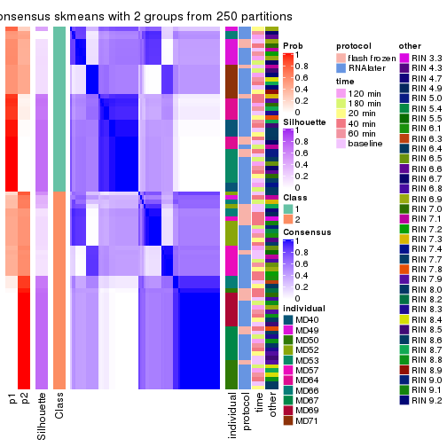</p>

</div>
<div id='tab-SD-skmeans-consensus-heatmap-2'>
<pre><code class="r">consensus_heatmap(res, k = 3)
</code></pre>

<p></p>

</div>
<div id='tab-SD-skmeans-consensus-heatmap-3'>
<pre><code class="r">consensus_heatmap(res, k = 4)
</code></pre>

<p></p>

</div>
<div id='tab-SD-skmeans-consensus-heatmap-4'>
<pre><code class="r">consensus_heatmap(res, k = 5)
</code></pre>

<p></p>

</div>
<div id='tab-SD-skmeans-consensus-heatmap-5'>
<pre><code class="r">consensus_heatmap(res, k = 6)
</code></pre>

<p></p>

</div>
</div>

Heatmaps for the membership of samples in all partitions to see how consistent they are:


<script>
$( function() {
	$( '#tabs-SD-skmeans-membership-heatmap' ).tabs();
} );
</script>
<div id='tabs-SD-skmeans-membership-heatmap'>
<ul>
<li><a href='#tab-SD-skmeans-membership-heatmap-1'>k = 2</a></li>
<li><a href='#tab-SD-skmeans-membership-heatmap-2'>k = 3</a></li>
<li><a href='#tab-SD-skmeans-membership-heatmap-3'>k = 4</a></li>
<li><a href='#tab-SD-skmeans-membership-heatmap-4'>k = 5</a></li>
<li><a href='#tab-SD-skmeans-membership-heatmap-5'>k = 6</a></li>
</ul>
<div id='tab-SD-skmeans-membership-heatmap-1'>
<pre><code class="r">membership_heatmap(res, k = 2)
</code></pre>

<p></p>

</div>
<div id='tab-SD-skmeans-membership-heatmap-2'>
<pre><code class="r">membership_heatmap(res, k = 3)
</code></pre>

<p></p>

</div>
<div id='tab-SD-skmeans-membership-heatmap-3'>
<pre><code class="r">membership_heatmap(res, k = 4)
</code></pre>

<p></p>

</div>
<div id='tab-SD-skmeans-membership-heatmap-4'>
<pre><code class="r">membership_heatmap(res, k = 5)
</code></pre>

<p></p>

</div>
<div id='tab-SD-skmeans-membership-heatmap-5'>
<pre><code class="r">membership_heatmap(res, k = 6)
</code></pre>

<p></p>

</div>
</div>

As soon as we have had the classes for columns, we can look for signatures
which are significantly different between classes which can be candidate marks
for certain classes. Following are the heatmaps for signatures.


Signature heatmaps where rows are scaled:


<script>
$( function() {
	$( '#tabs-SD-skmeans-get-signatures' ).tabs();
} );
</script>
<div id='tabs-SD-skmeans-get-signatures'>
<ul>
<li><a href='#tab-SD-skmeans-get-signatures-1'>k = 2</a></li>
<li><a href='#tab-SD-skmeans-get-signatures-2'>k = 3</a></li>
<li><a href='#tab-SD-skmeans-get-signatures-3'>k = 4</a></li>
<li><a href='#tab-SD-skmeans-get-signatures-4'>k = 5</a></li>
<li><a href='#tab-SD-skmeans-get-signatures-5'>k = 6</a></li>
</ul>
<div id='tab-SD-skmeans-get-signatures-1'>
<pre><code class="r">get_signatures(res, k = 2)
</code></pre>

<p></p>

</div>
<div id='tab-SD-skmeans-get-signatures-2'>
<pre><code class="r">get_signatures(res, k = 3)
</code></pre>

<p></p>

</div>
<div id='tab-SD-skmeans-get-signatures-3'>
<pre><code class="r">get_signatures(res, k = 4)
</code></pre>

<p></p>

</div>
<div id='tab-SD-skmeans-get-signatures-4'>
<pre><code class="r">get_signatures(res, k = 5)
</code></pre>

<p>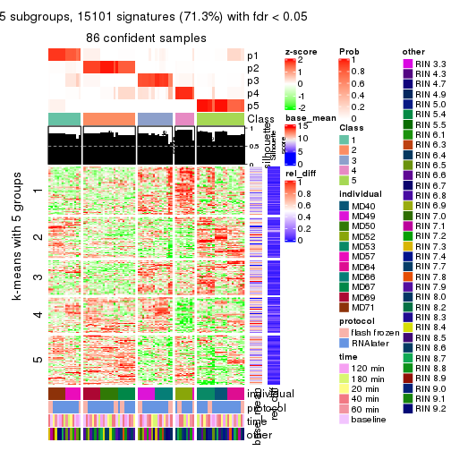</p>

</div>
<div id='tab-SD-skmeans-get-signatures-5'>
<pre><code class="r">get_signatures(res, k = 6)
</code></pre>

<p></p>

</div>
</div>


Signature heatmaps where rows are not scaled:


<script>
$( function() {
	$( '#tabs-SD-skmeans-get-signatures-no-scale' ).tabs();
} );
</script>
<div id='tabs-SD-skmeans-get-signatures-no-scale'>
<ul>
<li><a href='#tab-SD-skmeans-get-signatures-no-scale-1'>k = 2</a></li>
<li><a href='#tab-SD-skmeans-get-signatures-no-scale-2'>k = 3</a></li>
<li><a href='#tab-SD-skmeans-get-signatures-no-scale-3'>k = 4</a></li>
<li><a href='#tab-SD-skmeans-get-signatures-no-scale-4'>k = 5</a></li>
<li><a href='#tab-SD-skmeans-get-signatures-no-scale-5'>k = 6</a></li>
</ul>
<div id='tab-SD-skmeans-get-signatures-no-scale-1'>
<pre><code class="r">get_signatures(res, k = 2, scale_rows = FALSE)
</code></pre>

<p></p>

</div>
<div id='tab-SD-skmeans-get-signatures-no-scale-2'>
<pre><code class="r">get_signatures(res, k = 3, scale_rows = FALSE)
</code></pre>

<p></p>

</div>
<div id='tab-SD-skmeans-get-signatures-no-scale-3'>
<pre><code class="r">get_signatures(res, k = 4, scale_rows = FALSE)
</code></pre>

<p></p>

</div>
<div id='tab-SD-skmeans-get-signatures-no-scale-4'>
<pre><code class="r">get_signatures(res, k = 5, scale_rows = FALSE)
</code></pre>

<p></p>

</div>
<div id='tab-SD-skmeans-get-signatures-no-scale-5'>
<pre><code class="r">get_signatures(res, k = 6, scale_rows = FALSE)
</code></pre>

<p></p>

</div>
</div>


Compare the overlap of signatures from different k:

```r
compare_signatures(res)
```


`get_signature()` returns a data frame invisibly. TO get the list of signatures, the function
call should be assigned to a variable explicitly. In following code, if `plot` argument is set
to `FALSE`, no heatmap is plotted while only the differential analysis is performed.

```r
# code only for demonstration
tb = get_signature(res, k = ..., plot = FALSE)
```

An example of the output of `tb` is:

```
#>   which_row         fdr    mean_1    mean_2 scaled_mean_1 scaled_mean_2 km
#> 1        38 0.042760348  8.373488  9.131774    -0.5533452     0.5164555  1
#> 2        40 0.018707592  7.106213  8.469186    -0.6173731     0.5762149  1
#> 3        55 0.019134737 10.221463 11.207825    -0.6159697     0.5749050  1
#> 4        59 0.006059896  5.921854  7.869574    -0.6899429     0.6439467  1
#> 5        60 0.018055526  8.928898 10.211722    -0.6204761     0.5791110  1
#> 6        98 0.009384629 15.714769 14.887706     0.6635654    -0.6193277  2
...
```

The columns in `tb` are:

1. `which_row`: row indices corresponding to the input matrix.
2. `fdr`: FDR for the differential test. 
3. `mean_x`: The mean value in group x.
4. `scaled_mean_x`: The mean value in group x after rows are scaled.
5. `km`: Row groups if k-means clustering is applied to rows.


UMAP plot which shows how samples are separated.


<script>
$( function() {
	$( '#tabs-SD-skmeans-dimension-reduction' ).tabs();
} );
</script>
<div id='tabs-SD-skmeans-dimension-reduction'>
<ul>
<li><a href='#tab-SD-skmeans-dimension-reduction-1'>k = 2</a></li>
<li><a href='#tab-SD-skmeans-dimension-reduction-2'>k = 3</a></li>
<li><a href='#tab-SD-skmeans-dimension-reduction-3'>k = 4</a></li>
<li><a href='#tab-SD-skmeans-dimension-reduction-4'>k = 5</a></li>
<li><a href='#tab-SD-skmeans-dimension-reduction-5'>k = 6</a></li>
</ul>
<div id='tab-SD-skmeans-dimension-reduction-1'>
<pre><code class="r">dimension_reduction(res, k = 2, method = &quot;UMAP&quot;)
</code></pre>

<p></p>

</div>
<div id='tab-SD-skmeans-dimension-reduction-2'>
<pre><code class="r">dimension_reduction(res, k = 3, method = &quot;UMAP&quot;)
</code></pre>

<p></p>

</div>
<div id='tab-SD-skmeans-dimension-reduction-3'>
<pre><code class="r">dimension_reduction(res, k = 4, method = &quot;UMAP&quot;)
</code></pre>

<p></p>

</div>
<div id='tab-SD-skmeans-dimension-reduction-4'>
<pre><code class="r">dimension_reduction(res, k = 5, method = &quot;UMAP&quot;)
</code></pre>

<p></p>

</div>
<div id='tab-SD-skmeans-dimension-reduction-5'>
<pre><code class="r">dimension_reduction(res, k = 6, method = &quot;UMAP&quot;)
</code></pre>

<p></p>

</div>
</div>


Following heatmap shows how subgroups are split when increasing `k`:

```r
collect_classes(res)
```


Test correlation between subgroups and known annotations. If the known
annotation is numeric, one-way ANOVA test is applied, and if the known
annotation is discrete, chi-squared contingency table test is applied.

```r
test_to_known_factors(res)
```

```
#>             n individual(p) protocol(p) time(p) other(p) k
#> SD:skmeans 51      2.62e-08       1.000   0.995   0.3660 2
#> SD:skmeans 82      2.64e-21       0.389   1.000   0.2904 3
#> SD:skmeans 80      4.69e-33       0.645   1.000   0.0689 4
#> SD:skmeans 86      2.10e-47       0.912   1.000   0.0208 5
#> SD:skmeans 86      2.76e-59       0.933   1.000   0.0969 6
```


If matrix rows can be associated to genes, consider to use `functional_enrichment(res,
...)` to perform function enrichment for the signature genes. See [this vignette](http://bioconductor.org/packages/devel/bioc/vignettes/cola/inst/doc/functional_enrichment.html) for more detailed explanations.


 

---------------------------------------------------


### SD:pam


The object with results only for a single top-value method and a single partition method 
can be extracted as:

```r
res = res_list["SD", "pam"]
# you can also extract it by
# res = res_list["SD:pam"]
```

A summary of `res` and all the functions that can be applied to it:

```r
res
```

```
#> A 'ConsensusPartition' object with k = 2, 3, 4, 5, 6.
#>   On a matrix with 21168 rows and 86 columns.
#>   Top rows (1000, 2000, 3000, 4000, 5000) are extracted by 'SD' method.
#>   Subgroups are detected by 'pam' method.
#>   Performed in total 1250 partitions by row resampling.
#>   Best k for subgroups seems to be 2.
#> 
#> Following methods can be applied to this 'ConsensusPartition' object:
#>  [1] "cola_report"             "collect_classes"         "collect_plots"          
#>  [4] "collect_stats"           "colnames"                "compare_signatures"     
#>  [7] "consensus_heatmap"       "dimension_reduction"     "functional_enrichment"  
#> [10] "get_anno_col"            "get_anno"                "get_classes"            
#> [13] "get_consensus"           "get_matrix"              "get_membership"         
#> [16] "get_param"               "get_signatures"          "get_stats"              
#> [19] "is_best_k"               "is_stable_k"             "membership_heatmap"     
#> [22] "ncol"                    "nrow"                    "plot_ecdf"              
#> [25] "rownames"                "select_partition_number" "show"                   
#> [28] "suggest_best_k"          "test_to_known_factors"
```

`collect_plots()` function collects all the plots made from `res` for all `k` (number of partitions)
into one single page to provide an easy and fast comparison between different `k`.

```r
collect_plots(res)
```


The plots are:

- The first row: a plot of the ECDF (empirical cumulative distribution
  function) curves of the consensus matrix for each `k` and the heatmap of
  predicted classes for each `k`.
- The second row: heatmaps of the consensus matrix for each `k`.
- The third row: heatmaps of the membership matrix for each `k`.
- The fouth row: heatmaps of the signatures for each `k`.

All the plots in panels can be made by individual functions and they are
plotted later in this section.

`select_partition_number()` produces several plots showing different
statistics for choosing "optimized" `k`. There are following statistics:

- ECDF curves of the consensus matrix for each `k`;
- 1-PAC. [The PAC
  score](https://en.wikipedia.org/wiki/Consensus_clustering#Over-interpretation_potential_of_consensus_clustering)
  measures the proportion of the ambiguous subgrouping.
- Mean silhouette score.
- Concordance. The mean probability of fiting the consensus class ids in all
  partitions.
- Area increased. Denote $A_k$ as the area under the ECDF curve for current
  `k`, the area increased is defined as $A_k - A_{k-1}$.
- Rand index. The percent of pairs of samples that are both in a same cluster
  or both are not in a same cluster in the partition of k and k-1.
- Jaccard index. The ratio of pairs of samples are both in a same cluster in
  the partition of k and k-1 and the pairs of samples are both in a same
  cluster in the partition k or k-1.

The detailed explanations of these statistics can be found in [the _cola_
vignette](http://bioconductor.org/packages/devel/bioc/vignettes/cola/inst/doc/cola.html#toc_13).

Generally speaking, lower PAC score, higher mean silhouette score or higher
concordance corresponds to better partition. Rand index and Jaccard index
measure how similar the current partition is compared to partition with `k-1`.
If they are too similar, we won't accept `k` is better than `k-1`.

```r
select_partition_number(res)
```


The numeric values for all these statistics can be obtained by `get_stats()`.

```r
get_stats(res)
```

```
#>   k 1-PAC mean_silhouette concordance area_increased  Rand Jaccard
#> 2 2 0.812           0.926       0.965         0.4889 0.512   0.512
#> 3 3 0.894           0.914       0.963         0.2382 0.880   0.765
#> 4 4 0.817           0.837       0.922         0.1203 0.904   0.759
#> 5 5 0.790           0.802       0.886         0.0738 0.970   0.907
#> 6 6 0.819           0.719       0.839         0.0586 0.888   0.639
```

`suggest_best_k()` suggests the best $k$ based on these statistics. The rules are as follows:

- All $k$ with Jaccard index larger than 0.95 are removed because increasing
  $k$ does not provide enough extra information. If all $k$ are removed, it is
  marked as no subgroup is detected.
- For all $k$ with 1-PAC score larger than 0.9, the maximal $k$ is taken as
  the best $k$, and other $k$ are marked as optional $k$.
- If it does not fit the second rule. The $k$ with the maximal vote of the
  highest 1-PAC score, highest mean silhouette, and highest concordance is
  taken as the best $k$.

```r
suggest_best_k(res)
```

```
#> [1] 2
```


Following shows the table of the partitions (You need to click the **show/hide
code output** link to see it). The membership matrix (columns with name `p*`)
is inferred by
[`clue::cl_consensus()`](https://www.rdocumentation.org/link/cl_consensus?package=clue)
function with the `SE` method. Basically the value in the membership matrix
represents the probability to belong to a certain group. The finall class
label for an item is determined with the group with highest probability it
belongs to.

In `get_classes()` function, the entropy is calculated from the membership
matrix and the silhouette score is calculated from the consensus matrix.


<script>
$( function() {
	$( '#tabs-SD-pam-get-classes' ).tabs();
} );
</script>
<div id='tabs-SD-pam-get-classes'>
<ul>
<li><a href='#tab-SD-pam-get-classes-1'>k = 2</a></li>
<li><a href='#tab-SD-pam-get-classes-2'>k = 3</a></li>
<li><a href='#tab-SD-pam-get-classes-3'>k = 4</a></li>
<li><a href='#tab-SD-pam-get-classes-4'>k = 5</a></li>
<li><a href='#tab-SD-pam-get-classes-5'>k = 6</a></li>
</ul>

<div id='tab-SD-pam-get-classes-1'>
<p><a id='tab-SD-pam-get-classes-1-a' style='color:#0366d6' href='#'>show/hide code output</a></p>
<pre><code class="r">cbind(get_classes(res, k = 2), get_membership(res, k = 2))
</code></pre>

<pre><code>#&gt;           class entropy silhouette    p1    p2
#&gt; GSM614415     1  0.0000      0.964 1.000 0.000
#&gt; GSM614416     1  0.0000      0.964 1.000 0.000
#&gt; GSM614417     1  0.0000      0.964 1.000 0.000
#&gt; GSM614418     1  0.0000      0.964 1.000 0.000
#&gt; GSM614419     1  0.0000      0.964 1.000 0.000
#&gt; GSM614420     1  0.0000      0.964 1.000 0.000
#&gt; GSM614421     2  0.0000      0.961 0.000 1.000
#&gt; GSM614422     1  0.7815      0.704 0.768 0.232
#&gt; GSM614423     1  0.5629      0.844 0.868 0.132
#&gt; GSM614424     2  0.4939      0.877 0.108 0.892
#&gt; GSM614425     2  0.6801      0.796 0.180 0.820
#&gt; GSM614426     2  0.2043      0.941 0.032 0.968
#&gt; GSM614427     2  0.0000      0.961 0.000 1.000
#&gt; GSM614428     2  0.0000      0.961 0.000 1.000
#&gt; GSM614429     2  0.0000      0.961 0.000 1.000
#&gt; GSM614430     2  0.0000      0.961 0.000 1.000
#&gt; GSM614431     2  0.0000      0.961 0.000 1.000
#&gt; GSM614432     2  0.0000      0.961 0.000 1.000
#&gt; GSM614433     2  0.0000      0.961 0.000 1.000
#&gt; GSM614434     2  0.0000      0.961 0.000 1.000
#&gt; GSM614435     2  0.0000      0.961 0.000 1.000
#&gt; GSM614436     2  0.0000      0.961 0.000 1.000
#&gt; GSM614437     2  0.0000      0.961 0.000 1.000
#&gt; GSM614438     2  0.0000      0.961 0.000 1.000
#&gt; GSM614439     2  0.0000      0.961 0.000 1.000
#&gt; GSM614440     2  0.0000      0.961 0.000 1.000
#&gt; GSM614441     2  0.0000      0.961 0.000 1.000
#&gt; GSM614442     2  0.0000      0.961 0.000 1.000
#&gt; GSM614443     2  0.0000      0.961 0.000 1.000
#&gt; GSM614444     2  0.0000      0.961 0.000 1.000
#&gt; GSM614391     1  0.0000      0.964 1.000 0.000
#&gt; GSM614392     1  0.0000      0.964 1.000 0.000
#&gt; GSM614393     1  0.0000      0.964 1.000 0.000
#&gt; GSM614394     1  0.0000      0.964 1.000 0.000
#&gt; GSM614395     2  0.7528      0.750 0.216 0.784
#&gt; GSM614396     1  0.0000      0.964 1.000 0.000
#&gt; GSM614397     2  0.5842      0.846 0.140 0.860
#&gt; GSM614398     1  0.0672      0.960 0.992 0.008
#&gt; GSM614399     1  0.7674      0.719 0.776 0.224
#&gt; GSM614400     1  0.0376      0.964 0.996 0.004
#&gt; GSM614401     1  0.0376      0.964 0.996 0.004
#&gt; GSM614402     1  0.0672      0.962 0.992 0.008
#&gt; GSM614403     1  0.8016      0.691 0.756 0.244
#&gt; GSM614404     1  0.0376      0.964 0.996 0.004
#&gt; GSM614405     1  0.8144      0.665 0.748 0.252
#&gt; GSM614406     2  0.0000      0.961 0.000 1.000
#&gt; GSM614407     1  0.0376      0.964 0.996 0.004
#&gt; GSM614408     1  0.0000      0.964 1.000 0.000
#&gt; GSM614409     1  0.0000      0.964 1.000 0.000
#&gt; GSM614410     1  0.0000      0.964 1.000 0.000
#&gt; GSM614411     1  0.0376      0.964 0.996 0.004
#&gt; GSM614412     1  0.0376      0.963 0.996 0.004
#&gt; GSM614413     2  0.7056      0.781 0.192 0.808
#&gt; GSM614414     2  0.8443      0.657 0.272 0.728
#&gt; GSM614445     2  0.0938      0.954 0.012 0.988
#&gt; GSM614446     2  0.7219      0.770 0.200 0.800
#&gt; GSM614447     2  0.3431      0.913 0.064 0.936
#&gt; GSM614448     2  0.1843      0.944 0.028 0.972
#&gt; GSM614449     2  0.0000      0.961 0.000 1.000
#&gt; GSM614450     2  0.2423      0.936 0.040 0.960
#&gt; GSM614451     2  0.0000      0.961 0.000 1.000
#&gt; GSM614452     2  0.0000      0.961 0.000 1.000
#&gt; GSM614453     2  0.0000      0.961 0.000 1.000
#&gt; GSM614454     2  0.0000      0.961 0.000 1.000
#&gt; GSM614455     2  0.0000      0.961 0.000 1.000
#&gt; GSM614456     2  0.0000      0.961 0.000 1.000
#&gt; GSM614457     2  0.0000      0.961 0.000 1.000
#&gt; GSM614458     2  0.0000      0.961 0.000 1.000
#&gt; GSM614459     2  0.0000      0.961 0.000 1.000
#&gt; GSM614460     2  0.0000      0.961 0.000 1.000
#&gt; GSM614461     2  0.0000      0.961 0.000 1.000
#&gt; GSM614462     2  0.0000      0.961 0.000 1.000
#&gt; GSM614463     2  0.9358      0.472 0.352 0.648
#&gt; GSM614464     2  0.0000      0.961 0.000 1.000
#&gt; GSM614465     2  0.0000      0.961 0.000 1.000
#&gt; GSM614466     2  0.2603      0.933 0.044 0.956
#&gt; GSM614467     2  0.0000      0.961 0.000 1.000
#&gt; GSM614468     2  0.0000      0.961 0.000 1.000
#&gt; GSM614469     1  0.0376      0.964 0.996 0.004
#&gt; GSM614470     1  0.0376      0.964 0.996 0.004
#&gt; GSM614471     1  0.0376      0.964 0.996 0.004
#&gt; GSM614472     1  0.0376      0.964 0.996 0.004
#&gt; GSM614473     1  0.0376      0.964 0.996 0.004
#&gt; GSM614474     1  0.0376      0.964 0.996 0.004
#&gt; GSM614475     1  0.0376      0.964 0.996 0.004
#&gt; GSM614476     1  0.0376      0.964 0.996 0.004
</code></pre>

<script>
$('#tab-SD-pam-get-classes-1-a').parent().next().next().hide();
$('#tab-SD-pam-get-classes-1-a').click(function(){
  $('#tab-SD-pam-get-classes-1-a').parent().next().next().toggle();
  return(false);
});
</script>
</div>

<div id='tab-SD-pam-get-classes-2'>
<p><a id='tab-SD-pam-get-classes-2-a' style='color:#0366d6' href='#'>show/hide code output</a></p>
<pre><code class="r">cbind(get_classes(res, k = 3), get_membership(res, k = 3))
</code></pre>

<pre><code>#&gt;           class entropy silhouette    p1    p2    p3
#&gt; GSM614415     1  0.0237      0.947 0.996 0.000 0.004
#&gt; GSM614416     1  0.0237      0.947 0.996 0.000 0.004
#&gt; GSM614417     1  0.0237      0.947 0.996 0.000 0.004
#&gt; GSM614418     1  0.0237      0.947 0.996 0.000 0.004
#&gt; GSM614419     1  0.0237      0.947 0.996 0.000 0.004
#&gt; GSM614420     1  0.0237      0.947 0.996 0.000 0.004
#&gt; GSM614421     2  0.0237      0.956 0.004 0.996 0.000
#&gt; GSM614422     1  0.5529      0.583 0.704 0.296 0.000
#&gt; GSM614423     1  0.4654      0.715 0.792 0.208 0.000
#&gt; GSM614424     2  0.2448      0.899 0.076 0.924 0.000
#&gt; GSM614425     2  0.2356      0.902 0.072 0.928 0.000
#&gt; GSM614426     2  0.1031      0.944 0.024 0.976 0.000
#&gt; GSM614427     2  0.0237      0.956 0.004 0.996 0.000
#&gt; GSM614428     2  0.0237      0.956 0.004 0.996 0.000
#&gt; GSM614429     2  0.0000      0.957 0.000 1.000 0.000
#&gt; GSM614430     2  0.0000      0.957 0.000 1.000 0.000
#&gt; GSM614431     2  0.0000      0.957 0.000 1.000 0.000
#&gt; GSM614432     2  0.0000      0.957 0.000 1.000 0.000
#&gt; GSM614433     2  0.0000      0.957 0.000 1.000 0.000
#&gt; GSM614434     2  0.0000      0.957 0.000 1.000 0.000
#&gt; GSM614435     2  0.0000      0.957 0.000 1.000 0.000
#&gt; GSM614436     2  0.0000      0.957 0.000 1.000 0.000
#&gt; GSM614437     3  0.0237      0.967 0.000 0.004 0.996
#&gt; GSM614438     3  0.0237      0.967 0.000 0.004 0.996
#&gt; GSM614439     3  0.0237      0.967 0.000 0.004 0.996
#&gt; GSM614440     3  0.0237      0.967 0.000 0.004 0.996
#&gt; GSM614441     3  0.0237      0.967 0.000 0.004 0.996
#&gt; GSM614442     3  0.0237      0.967 0.000 0.004 0.996
#&gt; GSM614443     3  0.0237      0.967 0.000 0.004 0.996
#&gt; GSM614444     3  0.0237      0.967 0.000 0.004 0.996
#&gt; GSM614391     1  0.0237      0.947 0.996 0.000 0.004
#&gt; GSM614392     1  0.0237      0.947 0.996 0.000 0.004
#&gt; GSM614393     1  0.0237      0.947 0.996 0.000 0.004
#&gt; GSM614394     1  0.0237      0.947 0.996 0.000 0.004
#&gt; GSM614395     3  0.7676      0.618 0.216 0.112 0.672
#&gt; GSM614396     1  0.0237      0.947 0.996 0.000 0.004
#&gt; GSM614397     2  0.5763      0.623 0.276 0.716 0.008
#&gt; GSM614398     1  0.0661      0.942 0.988 0.008 0.004
#&gt; GSM614399     1  0.4555      0.724 0.800 0.200 0.000
#&gt; GSM614400     1  0.0000      0.947 1.000 0.000 0.000
#&gt; GSM614401     1  0.0237      0.946 0.996 0.004 0.000
#&gt; GSM614402     1  0.0592      0.939 0.988 0.012 0.000
#&gt; GSM614403     1  0.5948      0.451 0.640 0.360 0.000
#&gt; GSM614404     1  0.0592      0.938 0.988 0.012 0.000
#&gt; GSM614405     1  0.4931      0.671 0.768 0.232 0.000
#&gt; GSM614406     2  0.0424      0.955 0.008 0.992 0.000
#&gt; GSM614407     1  0.0000      0.947 1.000 0.000 0.000
#&gt; GSM614408     1  0.0000      0.947 1.000 0.000 0.000
#&gt; GSM614409     1  0.0000      0.947 1.000 0.000 0.000
#&gt; GSM614410     1  0.0000      0.947 1.000 0.000 0.000
#&gt; GSM614411     1  0.0000      0.947 1.000 0.000 0.000
#&gt; GSM614412     1  0.0237      0.945 0.996 0.004 0.000
#&gt; GSM614413     2  0.4842      0.714 0.224 0.776 0.000
#&gt; GSM614414     2  0.5465      0.616 0.288 0.712 0.000
#&gt; GSM614445     2  0.0237      0.956 0.004 0.996 0.000
#&gt; GSM614446     2  0.2261      0.907 0.068 0.932 0.000
#&gt; GSM614447     2  0.2261      0.903 0.068 0.932 0.000
#&gt; GSM614448     2  0.0592      0.952 0.012 0.988 0.000
#&gt; GSM614449     2  0.0237      0.956 0.004 0.996 0.000
#&gt; GSM614450     2  0.0592      0.952 0.012 0.988 0.000
#&gt; GSM614451     3  0.0661      0.961 0.004 0.008 0.988
#&gt; GSM614452     3  0.1267      0.949 0.004 0.024 0.972
#&gt; GSM614453     2  0.0000      0.957 0.000 1.000 0.000
#&gt; GSM614454     2  0.0000      0.957 0.000 1.000 0.000
#&gt; GSM614455     2  0.0000      0.957 0.000 1.000 0.000
#&gt; GSM614456     2  0.0000      0.957 0.000 1.000 0.000
#&gt; GSM614457     2  0.0000      0.957 0.000 1.000 0.000
#&gt; GSM614458     2  0.0000      0.957 0.000 1.000 0.000
#&gt; GSM614459     2  0.0000      0.957 0.000 1.000 0.000
#&gt; GSM614460     2  0.0000      0.957 0.000 1.000 0.000
#&gt; GSM614461     2  0.0000      0.957 0.000 1.000 0.000
#&gt; GSM614462     2  0.0000      0.957 0.000 1.000 0.000
#&gt; GSM614463     2  0.4842      0.704 0.224 0.776 0.000
#&gt; GSM614464     2  0.0000      0.957 0.000 1.000 0.000
#&gt; GSM614465     2  0.0000      0.957 0.000 1.000 0.000
#&gt; GSM614466     2  0.0592      0.951 0.012 0.988 0.000
#&gt; GSM614467     2  0.0237      0.956 0.004 0.996 0.000
#&gt; GSM614468     2  0.0237      0.956 0.004 0.996 0.000
#&gt; GSM614469     1  0.0000      0.947 1.000 0.000 0.000
#&gt; GSM614470     1  0.0000      0.947 1.000 0.000 0.000
#&gt; GSM614471     1  0.0237      0.946 0.996 0.004 0.000
#&gt; GSM614472     1  0.0000      0.947 1.000 0.000 0.000
#&gt; GSM614473     1  0.0000      0.947 1.000 0.000 0.000
#&gt; GSM614474     1  0.0000      0.947 1.000 0.000 0.000
#&gt; GSM614475     1  0.0000      0.947 1.000 0.000 0.000
#&gt; GSM614476     1  0.0000      0.947 1.000 0.000 0.000
</code></pre>

<script>
$('#tab-SD-pam-get-classes-2-a').parent().next().next().hide();
$('#tab-SD-pam-get-classes-2-a').click(function(){
  $('#tab-SD-pam-get-classes-2-a').parent().next().next().toggle();
  return(false);
});
</script>
</div>

<div id='tab-SD-pam-get-classes-3'>
<p><a id='tab-SD-pam-get-classes-3-a' style='color:#0366d6' href='#'>show/hide code output</a></p>
<pre><code class="r">cbind(get_classes(res, k = 4), get_membership(res, k = 4))
</code></pre>

<pre><code>#&gt;           class entropy silhouette    p1    p2    p3    p4
#&gt; GSM614415     1  0.4072      0.699 0.748 0.000 0.252 0.000
#&gt; GSM614416     1  0.4877      0.485 0.592 0.000 0.408 0.000
#&gt; GSM614417     1  0.4713      0.572 0.640 0.000 0.360 0.000
#&gt; GSM614418     1  0.3975      0.706 0.760 0.000 0.240 0.000
#&gt; GSM614419     1  0.3975      0.706 0.760 0.000 0.240 0.000
#&gt; GSM614420     1  0.4040      0.699 0.752 0.000 0.248 0.000
#&gt; GSM614421     2  0.1302      0.940 0.044 0.956 0.000 0.000
#&gt; GSM614422     3  0.6055      0.153 0.044 0.436 0.520 0.000
#&gt; GSM614423     3  0.4224      0.658 0.044 0.144 0.812 0.000
#&gt; GSM614424     2  0.2996      0.894 0.044 0.892 0.064 0.000
#&gt; GSM614425     2  0.2675      0.907 0.044 0.908 0.048 0.000
#&gt; GSM614426     2  0.2111      0.929 0.044 0.932 0.024 0.000
#&gt; GSM614427     2  0.1302      0.940 0.044 0.956 0.000 0.000
#&gt; GSM614428     2  0.1302      0.940 0.044 0.956 0.000 0.000
#&gt; GSM614429     2  0.0000      0.958 0.000 1.000 0.000 0.000
#&gt; GSM614430     2  0.0000      0.958 0.000 1.000 0.000 0.000
#&gt; GSM614431     2  0.0000      0.958 0.000 1.000 0.000 0.000
#&gt; GSM614432     2  0.0000      0.958 0.000 1.000 0.000 0.000
#&gt; GSM614433     2  0.0000      0.958 0.000 1.000 0.000 0.000
#&gt; GSM614434     2  0.0000      0.958 0.000 1.000 0.000 0.000
#&gt; GSM614435     2  0.0000      0.958 0.000 1.000 0.000 0.000
#&gt; GSM614436     2  0.0000      0.958 0.000 1.000 0.000 0.000
#&gt; GSM614437     4  0.0000      0.986 0.000 0.000 0.000 1.000
#&gt; GSM614438     4  0.0000      0.986 0.000 0.000 0.000 1.000
#&gt; GSM614439     4  0.0000      0.986 0.000 0.000 0.000 1.000
#&gt; GSM614440     4  0.0000      0.986 0.000 0.000 0.000 1.000
#&gt; GSM614441     4  0.0000      0.986 0.000 0.000 0.000 1.000
#&gt; GSM614442     4  0.0000      0.986 0.000 0.000 0.000 1.000
#&gt; GSM614443     4  0.0000      0.986 0.000 0.000 0.000 1.000
#&gt; GSM614444     4  0.0000      0.986 0.000 0.000 0.000 1.000
#&gt; GSM614391     1  0.3569      0.691 0.804 0.000 0.196 0.000
#&gt; GSM614392     1  0.4730      0.518 0.636 0.000 0.364 0.000
#&gt; GSM614393     1  0.4564      0.574 0.672 0.000 0.328 0.000
#&gt; GSM614394     1  0.2216      0.688 0.908 0.000 0.092 0.000
#&gt; GSM614395     1  0.5838     -0.103 0.524 0.032 0.000 0.444
#&gt; GSM614396     1  0.1716      0.676 0.936 0.000 0.064 0.000
#&gt; GSM614397     1  0.4855      0.175 0.600 0.400 0.000 0.000
#&gt; GSM614398     1  0.0921      0.648 0.972 0.000 0.028 0.000
#&gt; GSM614399     3  0.2868      0.720 0.000 0.136 0.864 0.000
#&gt; GSM614400     3  0.0000      0.889 0.000 0.000 1.000 0.000
#&gt; GSM614401     3  0.0000      0.889 0.000 0.000 1.000 0.000
#&gt; GSM614402     3  0.0336      0.882 0.000 0.008 0.992 0.000
#&gt; GSM614403     3  0.4746      0.337 0.000 0.368 0.632 0.000
#&gt; GSM614404     3  0.0000      0.889 0.000 0.000 1.000 0.000
#&gt; GSM614405     3  0.3528      0.624 0.000 0.192 0.808 0.000
#&gt; GSM614406     2  0.0592      0.952 0.016 0.984 0.000 0.000
#&gt; GSM614407     3  0.0000      0.889 0.000 0.000 1.000 0.000
#&gt; GSM614408     3  0.0000      0.889 0.000 0.000 1.000 0.000
#&gt; GSM614409     3  0.0000      0.889 0.000 0.000 1.000 0.000
#&gt; GSM614410     3  0.0000      0.889 0.000 0.000 1.000 0.000
#&gt; GSM614411     3  0.0000      0.889 0.000 0.000 1.000 0.000
#&gt; GSM614412     3  0.0469      0.878 0.000 0.012 0.988 0.000
#&gt; GSM614413     2  0.4839      0.710 0.044 0.756 0.200 0.000
#&gt; GSM614414     2  0.5168      0.636 0.040 0.712 0.248 0.000
#&gt; GSM614445     2  0.0336      0.955 0.008 0.992 0.000 0.000
#&gt; GSM614446     2  0.2111      0.923 0.024 0.932 0.044 0.000
#&gt; GSM614447     2  0.2480      0.879 0.008 0.904 0.088 0.000
#&gt; GSM614448     2  0.1635      0.936 0.044 0.948 0.008 0.000
#&gt; GSM614449     2  0.1302      0.940 0.044 0.956 0.000 0.000
#&gt; GSM614450     2  0.1109      0.947 0.028 0.968 0.004 0.000
#&gt; GSM614451     4  0.1489      0.945 0.044 0.004 0.000 0.952
#&gt; GSM614452     4  0.1888      0.932 0.044 0.016 0.000 0.940
#&gt; GSM614453     2  0.0000      0.958 0.000 1.000 0.000 0.000
#&gt; GSM614454     2  0.0000      0.958 0.000 1.000 0.000 0.000
#&gt; GSM614455     2  0.0000      0.958 0.000 1.000 0.000 0.000
#&gt; GSM614456     2  0.0000      0.958 0.000 1.000 0.000 0.000
#&gt; GSM614457     2  0.0000      0.958 0.000 1.000 0.000 0.000
#&gt; GSM614458     2  0.0000      0.958 0.000 1.000 0.000 0.000
#&gt; GSM614459     2  0.0000      0.958 0.000 1.000 0.000 0.000
#&gt; GSM614460     2  0.0000      0.958 0.000 1.000 0.000 0.000
#&gt; GSM614461     2  0.0000      0.958 0.000 1.000 0.000 0.000
#&gt; GSM614462     2  0.0000      0.958 0.000 1.000 0.000 0.000
#&gt; GSM614463     2  0.4250      0.600 0.000 0.724 0.276 0.000
#&gt; GSM614464     2  0.0000      0.958 0.000 1.000 0.000 0.000
#&gt; GSM614465     2  0.0000      0.958 0.000 1.000 0.000 0.000
#&gt; GSM614466     2  0.0336      0.954 0.000 0.992 0.008 0.000
#&gt; GSM614467     2  0.0000      0.958 0.000 1.000 0.000 0.000
#&gt; GSM614468     2  0.0000      0.958 0.000 1.000 0.000 0.000
#&gt; GSM614469     3  0.0000      0.889 0.000 0.000 1.000 0.000
#&gt; GSM614470     3  0.0000      0.889 0.000 0.000 1.000 0.000
#&gt; GSM614471     3  0.0000      0.889 0.000 0.000 1.000 0.000
#&gt; GSM614472     3  0.0000      0.889 0.000 0.000 1.000 0.000
#&gt; GSM614473     3  0.0000      0.889 0.000 0.000 1.000 0.000
#&gt; GSM614474     3  0.0000      0.889 0.000 0.000 1.000 0.000
#&gt; GSM614475     3  0.0000      0.889 0.000 0.000 1.000 0.000
#&gt; GSM614476     3  0.0000      0.889 0.000 0.000 1.000 0.000
</code></pre>

<script>
$('#tab-SD-pam-get-classes-3-a').parent().next().next().hide();
$('#tab-SD-pam-get-classes-3-a').click(function(){
  $('#tab-SD-pam-get-classes-3-a').parent().next().next().toggle();
  return(false);
});
</script>
</div>

<div id='tab-SD-pam-get-classes-4'>
<p><a id='tab-SD-pam-get-classes-4-a' style='color:#0366d6' href='#'>show/hide code output</a></p>
<pre><code class="r">cbind(get_classes(res, k = 5), get_membership(res, k = 5))
</code></pre>

<pre><code>#&gt;           class entropy silhouette    p1    p2    p3    p4    p5
#&gt; GSM614415     3  0.0609      0.874 0.020 0.000 0.980 0.000 0.000
#&gt; GSM614416     3  0.2648      0.774 0.152 0.000 0.848 0.000 0.000
#&gt; GSM614417     3  0.2280      0.819 0.120 0.000 0.880 0.000 0.000
#&gt; GSM614418     3  0.0404      0.867 0.012 0.000 0.988 0.000 0.000
#&gt; GSM614419     3  0.0290      0.860 0.008 0.000 0.992 0.000 0.000
#&gt; GSM614420     3  0.1205      0.874 0.040 0.000 0.956 0.000 0.004
#&gt; GSM614421     2  0.4138      0.656 0.000 0.616 0.000 0.000 0.384
#&gt; GSM614422     2  0.6633      0.345 0.220 0.396 0.000 0.000 0.384
#&gt; GSM614423     1  0.5415      0.341 0.552 0.064 0.000 0.000 0.384
#&gt; GSM614424     2  0.5123      0.617 0.044 0.572 0.000 0.000 0.384
#&gt; GSM614425     2  0.4138      0.656 0.000 0.616 0.000 0.000 0.384
#&gt; GSM614426     2  0.4846      0.633 0.028 0.588 0.000 0.000 0.384
#&gt; GSM614427     2  0.4138      0.656 0.000 0.616 0.000 0.000 0.384
#&gt; GSM614428     2  0.4138      0.656 0.000 0.616 0.000 0.000 0.384
#&gt; GSM614429     2  0.0000      0.853 0.000 1.000 0.000 0.000 0.000
#&gt; GSM614430     2  0.0000      0.853 0.000 1.000 0.000 0.000 0.000
#&gt; GSM614431     2  0.0000      0.853 0.000 1.000 0.000 0.000 0.000
#&gt; GSM614432     2  0.0000      0.853 0.000 1.000 0.000 0.000 0.000
#&gt; GSM614433     2  0.0000      0.853 0.000 1.000 0.000 0.000 0.000
#&gt; GSM614434     2  0.0000      0.853 0.000 1.000 0.000 0.000 0.000
#&gt; GSM614435     2  0.0000      0.853 0.000 1.000 0.000 0.000 0.000
#&gt; GSM614436     2  0.0000      0.853 0.000 1.000 0.000 0.000 0.000
#&gt; GSM614437     4  0.0000      0.891 0.000 0.000 0.000 1.000 0.000
#&gt; GSM614438     4  0.0000      0.891 0.000 0.000 0.000 1.000 0.000
#&gt; GSM614439     4  0.0000      0.891 0.000 0.000 0.000 1.000 0.000
#&gt; GSM614440     4  0.0000      0.891 0.000 0.000 0.000 1.000 0.000
#&gt; GSM614441     4  0.0000      0.891 0.000 0.000 0.000 1.000 0.000
#&gt; GSM614442     4  0.0000      0.891 0.000 0.000 0.000 1.000 0.000
#&gt; GSM614443     4  0.0000      0.891 0.000 0.000 0.000 1.000 0.000
#&gt; GSM614444     4  0.0000      0.891 0.000 0.000 0.000 1.000 0.000
#&gt; GSM614391     5  0.4836      0.762 0.032 0.000 0.356 0.000 0.612
#&gt; GSM614392     5  0.5376      0.751 0.080 0.000 0.308 0.000 0.612
#&gt; GSM614393     5  0.5342      0.754 0.076 0.000 0.312 0.000 0.612
#&gt; GSM614394     5  0.4288      0.746 0.004 0.000 0.384 0.000 0.612
#&gt; GSM614395     5  0.2773      0.714 0.000 0.000 0.164 0.000 0.836
#&gt; GSM614396     5  0.4150      0.741 0.000 0.000 0.388 0.000 0.612
#&gt; GSM614397     5  0.2773      0.714 0.000 0.000 0.164 0.000 0.836
#&gt; GSM614398     5  0.3003      0.730 0.000 0.000 0.188 0.000 0.812
#&gt; GSM614399     1  0.2230      0.798 0.884 0.116 0.000 0.000 0.000
#&gt; GSM614400     1  0.0000      0.926 1.000 0.000 0.000 0.000 0.000
#&gt; GSM614401     1  0.0000      0.926 1.000 0.000 0.000 0.000 0.000
#&gt; GSM614402     1  0.0162      0.924 0.996 0.004 0.000 0.000 0.000
#&gt; GSM614403     1  0.4949      0.474 0.656 0.288 0.000 0.000 0.056
#&gt; GSM614404     1  0.0000      0.926 1.000 0.000 0.000 0.000 0.000
#&gt; GSM614405     1  0.2690      0.736 0.844 0.156 0.000 0.000 0.000
#&gt; GSM614406     2  0.2280      0.811 0.000 0.880 0.000 0.000 0.120
#&gt; GSM614407     1  0.0324      0.924 0.992 0.000 0.004 0.000 0.004
#&gt; GSM614408     1  0.0324      0.924 0.992 0.000 0.004 0.000 0.004
#&gt; GSM614409     1  0.0324      0.924 0.992 0.000 0.004 0.000 0.004
#&gt; GSM614410     1  0.0324      0.924 0.992 0.000 0.004 0.000 0.004
#&gt; GSM614411     1  0.0324      0.924 0.992 0.000 0.004 0.000 0.004
#&gt; GSM614412     1  0.1202      0.895 0.960 0.032 0.004 0.000 0.004
#&gt; GSM614413     2  0.5292      0.624 0.048 0.580 0.004 0.000 0.368
#&gt; GSM614414     2  0.5937      0.604 0.120 0.576 0.004 0.000 0.300
#&gt; GSM614445     2  0.1502      0.837 0.004 0.940 0.000 0.000 0.056
#&gt; GSM614446     2  0.3596      0.771 0.016 0.784 0.000 0.000 0.200
#&gt; GSM614447     2  0.3644      0.771 0.096 0.824 0.000 0.000 0.080
#&gt; GSM614448     2  0.4138      0.656 0.000 0.616 0.000 0.000 0.384
#&gt; GSM614449     2  0.4088      0.668 0.000 0.632 0.000 0.000 0.368
#&gt; GSM614450     2  0.3530      0.769 0.012 0.784 0.000 0.000 0.204
#&gt; GSM614451     4  0.4138      0.517 0.000 0.000 0.000 0.616 0.384
#&gt; GSM614452     4  0.4505      0.503 0.000 0.012 0.000 0.604 0.384
#&gt; GSM614453     2  0.0000      0.853 0.000 1.000 0.000 0.000 0.000
#&gt; GSM614454     2  0.0000      0.853 0.000 1.000 0.000 0.000 0.000
#&gt; GSM614455     2  0.0000      0.853 0.000 1.000 0.000 0.000 0.000
#&gt; GSM614456     2  0.0000      0.853 0.000 1.000 0.000 0.000 0.000
#&gt; GSM614457     2  0.0000      0.853 0.000 1.000 0.000 0.000 0.000
#&gt; GSM614458     2  0.0000      0.853 0.000 1.000 0.000 0.000 0.000
#&gt; GSM614459     2  0.0000      0.853 0.000 1.000 0.000 0.000 0.000
#&gt; GSM614460     2  0.0000      0.853 0.000 1.000 0.000 0.000 0.000
#&gt; GSM614461     2  0.0000      0.853 0.000 1.000 0.000 0.000 0.000
#&gt; GSM614462     2  0.0000      0.853 0.000 1.000 0.000 0.000 0.000
#&gt; GSM614463     2  0.3837      0.498 0.308 0.692 0.000 0.000 0.000
#&gt; GSM614464     2  0.0000      0.853 0.000 1.000 0.000 0.000 0.000
#&gt; GSM614465     2  0.0000      0.853 0.000 1.000 0.000 0.000 0.000
#&gt; GSM614466     2  0.0510      0.846 0.016 0.984 0.000 0.000 0.000
#&gt; GSM614467     2  0.0609      0.848 0.000 0.980 0.000 0.000 0.020
#&gt; GSM614468     2  0.0000      0.853 0.000 1.000 0.000 0.000 0.000
#&gt; GSM614469     1  0.0000      0.926 1.000 0.000 0.000 0.000 0.000
#&gt; GSM614470     1  0.0000      0.926 1.000 0.000 0.000 0.000 0.000
#&gt; GSM614471     1  0.0000      0.926 1.000 0.000 0.000 0.000 0.000
#&gt; GSM614472     1  0.0000      0.926 1.000 0.000 0.000 0.000 0.000
#&gt; GSM614473     1  0.0000      0.926 1.000 0.000 0.000 0.000 0.000
#&gt; GSM614474     1  0.0000      0.926 1.000 0.000 0.000 0.000 0.000
#&gt; GSM614475     1  0.0000      0.926 1.000 0.000 0.000 0.000 0.000
#&gt; GSM614476     1  0.0000      0.926 1.000 0.000 0.000 0.000 0.000
</code></pre>

<script>
$('#tab-SD-pam-get-classes-4-a').parent().next().next().hide();
$('#tab-SD-pam-get-classes-4-a').click(function(){
  $('#tab-SD-pam-get-classes-4-a').parent().next().next().toggle();
  return(false);
});
</script>
</div>

<div id='tab-SD-pam-get-classes-5'>
<p><a id='tab-SD-pam-get-classes-5-a' style='color:#0366d6' href='#'>show/hide code output</a></p>
<pre><code class="r">cbind(get_classes(res, k = 6), get_membership(res, k = 6))
</code></pre>

<pre><code>#&gt;           class entropy silhouette    p1    p2    p3    p4    p5    p6
#&gt; GSM614415     6  0.1007     0.9828 0.000 0.000 0.000 0.000 0.044 0.956
#&gt; GSM614416     6  0.1176     0.9740 0.024 0.000 0.000 0.000 0.020 0.956
#&gt; GSM614417     6  0.1176     0.9781 0.020 0.000 0.000 0.000 0.024 0.956
#&gt; GSM614418     6  0.1007     0.9828 0.000 0.000 0.000 0.000 0.044 0.956
#&gt; GSM614419     6  0.1007     0.9828 0.000 0.000 0.000 0.000 0.044 0.956
#&gt; GSM614420     6  0.1151     0.9827 0.012 0.000 0.000 0.000 0.032 0.956
#&gt; GSM614421     3  0.0000     0.6528 0.000 0.000 1.000 0.000 0.000 0.000
#&gt; GSM614422     3  0.1765     0.6017 0.096 0.000 0.904 0.000 0.000 0.000
#&gt; GSM614423     3  0.3747     0.1221 0.396 0.000 0.604 0.000 0.000 0.000
#&gt; GSM614424     3  0.0458     0.6514 0.016 0.000 0.984 0.000 0.000 0.000
#&gt; GSM614425     3  0.0000     0.6528 0.000 0.000 1.000 0.000 0.000 0.000
#&gt; GSM614426     3  0.0363     0.6524 0.012 0.000 0.988 0.000 0.000 0.000
#&gt; GSM614427     3  0.0000     0.6528 0.000 0.000 1.000 0.000 0.000 0.000
#&gt; GSM614428     3  0.0000     0.6528 0.000 0.000 1.000 0.000 0.000 0.000
#&gt; GSM614429     2  0.4039     0.8395 0.000 0.568 0.424 0.000 0.000 0.008
#&gt; GSM614430     2  0.4039     0.8397 0.000 0.568 0.424 0.000 0.000 0.008
#&gt; GSM614431     2  0.3804     0.8394 0.000 0.576 0.424 0.000 0.000 0.000
#&gt; GSM614432     2  0.4212     0.8354 0.000 0.560 0.424 0.000 0.000 0.016
#&gt; GSM614433     2  0.4039     0.8397 0.000 0.568 0.424 0.000 0.000 0.008
#&gt; GSM614434     2  0.4039     0.8397 0.000 0.568 0.424 0.000 0.000 0.008
#&gt; GSM614435     2  0.4212     0.8354 0.000 0.560 0.424 0.000 0.000 0.016
#&gt; GSM614436     2  0.4039     0.8395 0.000 0.568 0.424 0.000 0.000 0.008
#&gt; GSM614437     4  0.0000     1.0000 0.000 0.000 0.000 1.000 0.000 0.000
#&gt; GSM614438     4  0.0000     1.0000 0.000 0.000 0.000 1.000 0.000 0.000
#&gt; GSM614439     4  0.0000     1.0000 0.000 0.000 0.000 1.000 0.000 0.000
#&gt; GSM614440     4  0.0000     1.0000 0.000 0.000 0.000 1.000 0.000 0.000
#&gt; GSM614441     4  0.0000     1.0000 0.000 0.000 0.000 1.000 0.000 0.000
#&gt; GSM614442     4  0.0000     1.0000 0.000 0.000 0.000 1.000 0.000 0.000
#&gt; GSM614443     4  0.0000     1.0000 0.000 0.000 0.000 1.000 0.000 0.000
#&gt; GSM614444     4  0.0000     1.0000 0.000 0.000 0.000 1.000 0.000 0.000
#&gt; GSM614391     5  0.0146     0.9942 0.000 0.000 0.000 0.000 0.996 0.004
#&gt; GSM614392     5  0.0146     0.9942 0.000 0.000 0.000 0.000 0.996 0.004
#&gt; GSM614393     5  0.0146     0.9942 0.000 0.000 0.000 0.000 0.996 0.004
#&gt; GSM614394     5  0.0146     0.9942 0.000 0.000 0.000 0.000 0.996 0.004
#&gt; GSM614395     5  0.0363     0.9859 0.000 0.000 0.012 0.000 0.988 0.000
#&gt; GSM614396     5  0.0146     0.9942 0.000 0.000 0.000 0.000 0.996 0.004
#&gt; GSM614397     5  0.0363     0.9859 0.000 0.000 0.012 0.000 0.988 0.000
#&gt; GSM614398     5  0.0146     0.9924 0.000 0.000 0.004 0.000 0.996 0.000
#&gt; GSM614399     1  0.2308     0.7432 0.892 0.040 0.068 0.000 0.000 0.000
#&gt; GSM614400     1  0.0000     0.8210 1.000 0.000 0.000 0.000 0.000 0.000
#&gt; GSM614401     1  0.0000     0.8210 1.000 0.000 0.000 0.000 0.000 0.000
#&gt; GSM614402     1  0.0146     0.8188 0.996 0.000 0.004 0.000 0.000 0.000
#&gt; GSM614403     1  0.4968     0.3499 0.632 0.120 0.248 0.000 0.000 0.000
#&gt; GSM614404     1  0.0000     0.8210 1.000 0.000 0.000 0.000 0.000 0.000
#&gt; GSM614405     1  0.2383     0.7307 0.880 0.024 0.096 0.000 0.000 0.000
#&gt; GSM614406     3  0.4025    -0.5628 0.000 0.416 0.576 0.000 0.000 0.008
#&gt; GSM614407     1  0.4344     0.6043 0.556 0.424 0.000 0.000 0.004 0.016
#&gt; GSM614408     1  0.4344     0.6043 0.556 0.424 0.000 0.000 0.004 0.016
#&gt; GSM614409     1  0.4344     0.6043 0.556 0.424 0.000 0.000 0.004 0.016
#&gt; GSM614410     1  0.4344     0.6043 0.556 0.424 0.000 0.000 0.004 0.016
#&gt; GSM614411     1  0.4344     0.6043 0.556 0.424 0.000 0.000 0.004 0.016
#&gt; GSM614412     1  0.4370     0.5867 0.536 0.444 0.000 0.000 0.004 0.016
#&gt; GSM614413     2  0.4930    -0.3984 0.024 0.484 0.472 0.000 0.004 0.016
#&gt; GSM614414     2  0.5666    -0.3762 0.084 0.464 0.432 0.000 0.004 0.016
#&gt; GSM614445     2  0.4181     0.7626 0.012 0.512 0.476 0.000 0.000 0.000
#&gt; GSM614446     3  0.3940    -0.3628 0.012 0.348 0.640 0.000 0.000 0.000
#&gt; GSM614447     2  0.5191     0.5504 0.088 0.456 0.456 0.000 0.000 0.000
#&gt; GSM614448     3  0.0458     0.6373 0.000 0.016 0.984 0.000 0.000 0.000
#&gt; GSM614449     3  0.0937     0.6051 0.000 0.040 0.960 0.000 0.000 0.000
#&gt; GSM614450     3  0.3766    -0.2048 0.012 0.304 0.684 0.000 0.000 0.000
#&gt; GSM614451     3  0.3804    -0.0890 0.000 0.000 0.576 0.424 0.000 0.000
#&gt; GSM614452     3  0.3789    -0.0638 0.000 0.000 0.584 0.416 0.000 0.000
#&gt; GSM614453     2  0.4039     0.8397 0.000 0.568 0.424 0.000 0.000 0.008
#&gt; GSM614454     2  0.4039     0.8397 0.000 0.568 0.424 0.000 0.000 0.008
#&gt; GSM614455     2  0.4039     0.8397 0.000 0.568 0.424 0.000 0.000 0.008
#&gt; GSM614456     2  0.4039     0.8397 0.000 0.568 0.424 0.000 0.000 0.008
#&gt; GSM614457     2  0.4039     0.8397 0.000 0.568 0.424 0.000 0.000 0.008
#&gt; GSM614458     2  0.4039     0.8397 0.000 0.568 0.424 0.000 0.000 0.008
#&gt; GSM614459     2  0.4039     0.8397 0.000 0.568 0.424 0.000 0.000 0.008
#&gt; GSM614460     2  0.4039     0.8397 0.000 0.568 0.424 0.000 0.000 0.008
#&gt; GSM614461     2  0.4289     0.8338 0.000 0.556 0.424 0.000 0.000 0.020
#&gt; GSM614462     2  0.4289     0.8338 0.000 0.556 0.424 0.000 0.000 0.020
#&gt; GSM614463     2  0.6345     0.3368 0.280 0.456 0.244 0.000 0.000 0.020
#&gt; GSM614464     2  0.4289     0.8338 0.000 0.556 0.424 0.000 0.000 0.020
#&gt; GSM614465     2  0.4289     0.8338 0.000 0.556 0.424 0.000 0.000 0.020
#&gt; GSM614466     2  0.4693     0.8182 0.016 0.540 0.424 0.000 0.000 0.020
#&gt; GSM614467     2  0.4294     0.8311 0.000 0.552 0.428 0.000 0.000 0.020
#&gt; GSM614468     2  0.4289     0.8338 0.000 0.556 0.424 0.000 0.000 0.020
#&gt; GSM614469     1  0.0000     0.8210 1.000 0.000 0.000 0.000 0.000 0.000
#&gt; GSM614470     1  0.0000     0.8210 1.000 0.000 0.000 0.000 0.000 0.000
#&gt; GSM614471     1  0.0000     0.8210 1.000 0.000 0.000 0.000 0.000 0.000
#&gt; GSM614472     1  0.0000     0.8210 1.000 0.000 0.000 0.000 0.000 0.000
#&gt; GSM614473     1  0.0000     0.8210 1.000 0.000 0.000 0.000 0.000 0.000
#&gt; GSM614474     1  0.0000     0.8210 1.000 0.000 0.000 0.000 0.000 0.000
#&gt; GSM614475     1  0.0000     0.8210 1.000 0.000 0.000 0.000 0.000 0.000
#&gt; GSM614476     1  0.0000     0.8210 1.000 0.000 0.000 0.000 0.000 0.000
</code></pre>

<script>
$('#tab-SD-pam-get-classes-5-a').parent().next().next().hide();
$('#tab-SD-pam-get-classes-5-a').click(function(){
  $('#tab-SD-pam-get-classes-5-a').parent().next().next().toggle();
  return(false);
});
</script>
</div>
</div>

Heatmaps for the consensus matrix. It visualizes the probability of two
samples to be in a same group.


<script>
$( function() {
	$( '#tabs-SD-pam-consensus-heatmap' ).tabs();
} );
</script>
<div id='tabs-SD-pam-consensus-heatmap'>
<ul>
<li><a href='#tab-SD-pam-consensus-heatmap-1'>k = 2</a></li>
<li><a href='#tab-SD-pam-consensus-heatmap-2'>k = 3</a></li>
<li><a href='#tab-SD-pam-consensus-heatmap-3'>k = 4</a></li>
<li><a href='#tab-SD-pam-consensus-heatmap-4'>k = 5</a></li>
<li><a href='#tab-SD-pam-consensus-heatmap-5'>k = 6</a></li>
</ul>
<div id='tab-SD-pam-consensus-heatmap-1'>
<pre><code class="r">consensus_heatmap(res, k = 2)
</code></pre>

<p></p>

</div>
<div id='tab-SD-pam-consensus-heatmap-2'>
<pre><code class="r">consensus_heatmap(res, k = 3)
</code></pre>

<p></p>

</div>
<div id='tab-SD-pam-consensus-heatmap-3'>
<pre><code class="r">consensus_heatmap(res, k = 4)
</code></pre>

<p></p>

</div>
<div id='tab-SD-pam-consensus-heatmap-4'>
<pre><code class="r">consensus_heatmap(res, k = 5)
</code></pre>

<p>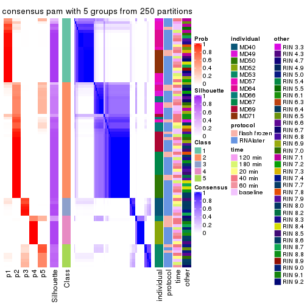</p>

</div>
<div id='tab-SD-pam-consensus-heatmap-5'>
<pre><code class="r">consensus_heatmap(res, k = 6)
</code></pre>

<p></p>

</div>
</div>

Heatmaps for the membership of samples in all partitions to see how consistent they are:


<script>
$( function() {
	$( '#tabs-SD-pam-membership-heatmap' ).tabs();
} );
</script>
<div id='tabs-SD-pam-membership-heatmap'>
<ul>
<li><a href='#tab-SD-pam-membership-heatmap-1'>k = 2</a></li>
<li><a href='#tab-SD-pam-membership-heatmap-2'>k = 3</a></li>
<li><a href='#tab-SD-pam-membership-heatmap-3'>k = 4</a></li>
<li><a href='#tab-SD-pam-membership-heatmap-4'>k = 5</a></li>
<li><a href='#tab-SD-pam-membership-heatmap-5'>k = 6</a></li>
</ul>
<div id='tab-SD-pam-membership-heatmap-1'>
<pre><code class="r">membership_heatmap(res, k = 2)
</code></pre>

<p></p>

</div>
<div id='tab-SD-pam-membership-heatmap-2'>
<pre><code class="r">membership_heatmap(res, k = 3)
</code></pre>

<p></p>

</div>
<div id='tab-SD-pam-membership-heatmap-3'>
<pre><code class="r">membership_heatmap(res, k = 4)
</code></pre>

<p></p>

</div>
<div id='tab-SD-pam-membership-heatmap-4'>
<pre><code class="r">membership_heatmap(res, k = 5)
</code></pre>

<p></p>

</div>
<div id='tab-SD-pam-membership-heatmap-5'>
<pre><code class="r">membership_heatmap(res, k = 6)
</code></pre>

<p></p>

</div>
</div>

As soon as we have had the classes for columns, we can look for signatures
which are significantly different between classes which can be candidate marks
for certain classes. Following are the heatmaps for signatures.


Signature heatmaps where rows are scaled:


<script>
$( function() {
	$( '#tabs-SD-pam-get-signatures' ).tabs();
} );
</script>
<div id='tabs-SD-pam-get-signatures'>
<ul>
<li><a href='#tab-SD-pam-get-signatures-1'>k = 2</a></li>
<li><a href='#tab-SD-pam-get-signatures-2'>k = 3</a></li>
<li><a href='#tab-SD-pam-get-signatures-3'>k = 4</a></li>
<li><a href='#tab-SD-pam-get-signatures-4'>k = 5</a></li>
<li><a href='#tab-SD-pam-get-signatures-5'>k = 6</a></li>
</ul>
<div id='tab-SD-pam-get-signatures-1'>
<pre><code class="r">get_signatures(res, k = 2)
</code></pre>

<p></p>

</div>
<div id='tab-SD-pam-get-signatures-2'>
<pre><code class="r">get_signatures(res, k = 3)
</code></pre>

<p></p>

</div>
<div id='tab-SD-pam-get-signatures-3'>
<pre><code class="r">get_signatures(res, k = 4)
</code></pre>

<p></p>

</div>
<div id='tab-SD-pam-get-signatures-4'>
<pre><code class="r">get_signatures(res, k = 5)
</code></pre>

<p></p>

</div>
<div id='tab-SD-pam-get-signatures-5'>
<pre><code class="r">get_signatures(res, k = 6)
</code></pre>

<p></p>

</div>
</div>


Signature heatmaps where rows are not scaled:


<script>
$( function() {
	$( '#tabs-SD-pam-get-signatures-no-scale' ).tabs();
} );
</script>
<div id='tabs-SD-pam-get-signatures-no-scale'>
<ul>
<li><a href='#tab-SD-pam-get-signatures-no-scale-1'>k = 2</a></li>
<li><a href='#tab-SD-pam-get-signatures-no-scale-2'>k = 3</a></li>
<li><a href='#tab-SD-pam-get-signatures-no-scale-3'>k = 4</a></li>
<li><a href='#tab-SD-pam-get-signatures-no-scale-4'>k = 5</a></li>
<li><a href='#tab-SD-pam-get-signatures-no-scale-5'>k = 6</a></li>
</ul>
<div id='tab-SD-pam-get-signatures-no-scale-1'>
<pre><code class="r">get_signatures(res, k = 2, scale_rows = FALSE)
</code></pre>

<p></p>

</div>
<div id='tab-SD-pam-get-signatures-no-scale-2'>
<pre><code class="r">get_signatures(res, k = 3, scale_rows = FALSE)
</code></pre>

<p></p>

</div>
<div id='tab-SD-pam-get-signatures-no-scale-3'>
<pre><code class="r">get_signatures(res, k = 4, scale_rows = FALSE)
</code></pre>

<p>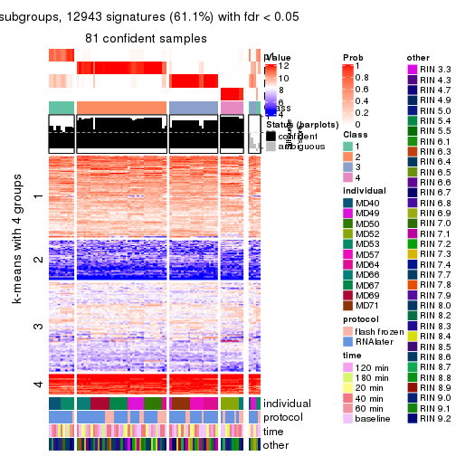</p>

</div>
<div id='tab-SD-pam-get-signatures-no-scale-4'>
<pre><code class="r">get_signatures(res, k = 5, scale_rows = FALSE)
</code></pre>

<p></p>

</div>
<div id='tab-SD-pam-get-signatures-no-scale-5'>
<pre><code class="r">get_signatures(res, k = 6, scale_rows = FALSE)
</code></pre>

<p></p>

</div>
</div>


Compare the overlap of signatures from different k:

```r
compare_signatures(res)
```


`get_signature()` returns a data frame invisibly. TO get the list of signatures, the function
call should be assigned to a variable explicitly. In following code, if `plot` argument is set
to `FALSE`, no heatmap is plotted while only the differential analysis is performed.

```r
# code only for demonstration
tb = get_signature(res, k = ..., plot = FALSE)
```

An example of the output of `tb` is:

```
#>   which_row         fdr    mean_1    mean_2 scaled_mean_1 scaled_mean_2 km
#> 1        38 0.042760348  8.373488  9.131774    -0.5533452     0.5164555  1
#> 2        40 0.018707592  7.106213  8.469186    -0.6173731     0.5762149  1
#> 3        55 0.019134737 10.221463 11.207825    -0.6159697     0.5749050  1
#> 4        59 0.006059896  5.921854  7.869574    -0.6899429     0.6439467  1
#> 5        60 0.018055526  8.928898 10.211722    -0.6204761     0.5791110  1
#> 6        98 0.009384629 15.714769 14.887706     0.6635654    -0.6193277  2
...
```

The columns in `tb` are:

1. `which_row`: row indices corresponding to the input matrix.
2. `fdr`: FDR for the differential test. 
3. `mean_x`: The mean value in group x.
4. `scaled_mean_x`: The mean value in group x after rows are scaled.
5. `km`: Row groups if k-means clustering is applied to rows.


UMAP plot which shows how samples are separated.


<script>
$( function() {
	$( '#tabs-SD-pam-dimension-reduction' ).tabs();
} );
</script>
<div id='tabs-SD-pam-dimension-reduction'>
<ul>
<li><a href='#tab-SD-pam-dimension-reduction-1'>k = 2</a></li>
<li><a href='#tab-SD-pam-dimension-reduction-2'>k = 3</a></li>
<li><a href='#tab-SD-pam-dimension-reduction-3'>k = 4</a></li>
<li><a href='#tab-SD-pam-dimension-reduction-4'>k = 5</a></li>
<li><a href='#tab-SD-pam-dimension-reduction-5'>k = 6</a></li>
</ul>
<div id='tab-SD-pam-dimension-reduction-1'>
<pre><code class="r">dimension_reduction(res, k = 2, method = &quot;UMAP&quot;)
</code></pre>

<p></p>

</div>
<div id='tab-SD-pam-dimension-reduction-2'>
<pre><code class="r">dimension_reduction(res, k = 3, method = &quot;UMAP&quot;)
</code></pre>

<p></p>

</div>
<div id='tab-SD-pam-dimension-reduction-3'>
<pre><code class="r">dimension_reduction(res, k = 4, method = &quot;UMAP&quot;)
</code></pre>

<p></p>

</div>
<div id='tab-SD-pam-dimension-reduction-4'>
<pre><code class="r">dimension_reduction(res, k = 5, method = &quot;UMAP&quot;)
</code></pre>

<p></p>

</div>
<div id='tab-SD-pam-dimension-reduction-5'>
<pre><code class="r">dimension_reduction(res, k = 6, method = &quot;UMAP&quot;)
</code></pre>

<p></p>

</div>
</div>


Following heatmap shows how subgroups are split when increasing `k`:

```r
collect_classes(res)
```


Test correlation between subgroups and known annotations. If the known
annotation is numeric, one-way ANOVA test is applied, and if the known
annotation is discrete, chi-squared contingency table test is applied.

```r
test_to_known_factors(res)
```

```
#>         n individual(p) protocol(p) time(p) other(p) k
#> SD:pam 85      1.06e-09      0.0523   0.898   0.9010 2
#> SD:pam 85      3.34e-17      0.1026   0.991   0.1653 3
#> SD:pam 81      1.17e-28      0.2345   1.000   0.1245 4
#> SD:pam 82      4.06e-41      0.3260   1.000   0.1052 5
#> SD:pam 76      4.13e-50      0.7974   1.000   0.0423 6
```


If matrix rows can be associated to genes, consider to use `functional_enrichment(res,
...)` to perform function enrichment for the signature genes. See [this vignette](http://bioconductor.org/packages/devel/bioc/vignettes/cola/inst/doc/functional_enrichment.html) for more detailed explanations.


 

---------------------------------------------------


### SD:mclust


The object with results only for a single top-value method and a single partition method 
can be extracted as:

```r
res = res_list["SD", "mclust"]
# you can also extract it by
# res = res_list["SD:mclust"]
```

A summary of `res` and all the functions that can be applied to it:

```r
res
```

```
#> A 'ConsensusPartition' object with k = 2, 3, 4, 5, 6.
#>   On a matrix with 21168 rows and 86 columns.
#>   Top rows (1000, 2000, 3000, 4000, 5000) are extracted by 'SD' method.
#>   Subgroups are detected by 'mclust' method.
#>   Performed in total 1250 partitions by row resampling.
#>   Best k for subgroups seems to be 5.
#> 
#> Following methods can be applied to this 'ConsensusPartition' object:
#>  [1] "cola_report"             "collect_classes"         "collect_plots"          
#>  [4] "collect_stats"           "colnames"                "compare_signatures"     
#>  [7] "consensus_heatmap"       "dimension_reduction"     "functional_enrichment"  
#> [10] "get_anno_col"            "get_anno"                "get_classes"            
#> [13] "get_consensus"           "get_matrix"              "get_membership"         
#> [16] "get_param"               "get_signatures"          "get_stats"              
#> [19] "is_best_k"               "is_stable_k"             "membership_heatmap"     
#> [22] "ncol"                    "nrow"                    "plot_ecdf"              
#> [25] "rownames"                "select_partition_number" "show"                   
#> [28] "suggest_best_k"          "test_to_known_factors"
```

`collect_plots()` function collects all the plots made from `res` for all `k` (number of partitions)
into one single page to provide an easy and fast comparison between different `k`.

```r
collect_plots(res)
```


The plots are:

- The first row: a plot of the ECDF (empirical cumulative distribution
  function) curves of the consensus matrix for each `k` and the heatmap of
  predicted classes for each `k`.
- The second row: heatmaps of the consensus matrix for each `k`.
- The third row: heatmaps of the membership matrix for each `k`.
- The fouth row: heatmaps of the signatures for each `k`.

All the plots in panels can be made by individual functions and they are
plotted later in this section.

`select_partition_number()` produces several plots showing different
statistics for choosing "optimized" `k`. There are following statistics:

- ECDF curves of the consensus matrix for each `k`;
- 1-PAC. [The PAC
  score](https://en.wikipedia.org/wiki/Consensus_clustering#Over-interpretation_potential_of_consensus_clustering)
  measures the proportion of the ambiguous subgrouping.
- Mean silhouette score.
- Concordance. The mean probability of fiting the consensus class ids in all
  partitions.
- Area increased. Denote $A_k$ as the area under the ECDF curve for current
  `k`, the area increased is defined as $A_k - A_{k-1}$.
- Rand index. The percent of pairs of samples that are both in a same cluster
  or both are not in a same cluster in the partition of k and k-1.
- Jaccard index. The ratio of pairs of samples are both in a same cluster in
  the partition of k and k-1 and the pairs of samples are both in a same
  cluster in the partition k or k-1.

The detailed explanations of these statistics can be found in [the _cola_
vignette](http://bioconductor.org/packages/devel/bioc/vignettes/cola/inst/doc/cola.html#toc_13).

Generally speaking, lower PAC score, higher mean silhouette score or higher
concordance corresponds to better partition. Rand index and Jaccard index
measure how similar the current partition is compared to partition with `k-1`.
If they are too similar, we won't accept `k` is better than `k-1`.

```r
select_partition_number(res)
```


The numeric values for all these statistics can be obtained by `get_stats()`.

```r
get_stats(res)
```

```
#>   k 1-PAC mean_silhouette concordance area_increased  Rand Jaccard
#> 2 2 0.474           0.814       0.906         0.4941 0.497   0.497
#> 3 3 0.415           0.506       0.690         0.2709 0.782   0.587
#> 4 4 0.819           0.858       0.917         0.1445 0.833   0.581
#> 5 5 0.881           0.875       0.928         0.0900 0.903   0.675
#> 6 6 0.816           0.752       0.826         0.0425 0.989   0.951
```

`suggest_best_k()` suggests the best $k$ based on these statistics. The rules are as follows:

- All $k$ with Jaccard index larger than 0.95 are removed because increasing
  $k$ does not provide enough extra information. If all $k$ are removed, it is
  marked as no subgroup is detected.
- For all $k$ with 1-PAC score larger than 0.9, the maximal $k$ is taken as
  the best $k$, and other $k$ are marked as optional $k$.
- If it does not fit the second rule. The $k$ with the maximal vote of the
  highest 1-PAC score, highest mean silhouette, and highest concordance is
  taken as the best $k$.

```r
suggest_best_k(res)
```

```
#> [1] 5
```


Following shows the table of the partitions (You need to click the **show/hide
code output** link to see it). The membership matrix (columns with name `p*`)
is inferred by
[`clue::cl_consensus()`](https://www.rdocumentation.org/link/cl_consensus?package=clue)
function with the `SE` method. Basically the value in the membership matrix
represents the probability to belong to a certain group. The finall class
label for an item is determined with the group with highest probability it
belongs to.

In `get_classes()` function, the entropy is calculated from the membership
matrix and the silhouette score is calculated from the consensus matrix.


<script>
$( function() {
	$( '#tabs-SD-mclust-get-classes' ).tabs();
} );
</script>
<div id='tabs-SD-mclust-get-classes'>
<ul>
<li><a href='#tab-SD-mclust-get-classes-1'>k = 2</a></li>
<li><a href='#tab-SD-mclust-get-classes-2'>k = 3</a></li>
<li><a href='#tab-SD-mclust-get-classes-3'>k = 4</a></li>
<li><a href='#tab-SD-mclust-get-classes-4'>k = 5</a></li>
<li><a href='#tab-SD-mclust-get-classes-5'>k = 6</a></li>
</ul>

<div id='tab-SD-mclust-get-classes-1'>
<p><a id='tab-SD-mclust-get-classes-1-a' style='color:#0366d6' href='#'>show/hide code output</a></p>
<pre><code class="r">cbind(get_classes(res, k = 2), get_membership(res, k = 2))
</code></pre>

<pre><code>#&gt;           class entropy silhouette    p1    p2
#&gt; GSM614415     1  0.0376     0.8872 0.996 0.004
#&gt; GSM614416     1  0.0376     0.8872 0.996 0.004
#&gt; GSM614417     1  0.0376     0.8872 0.996 0.004
#&gt; GSM614418     1  0.0376     0.8872 0.996 0.004
#&gt; GSM614419     1  0.0376     0.8872 0.996 0.004
#&gt; GSM614420     1  0.0376     0.8872 0.996 0.004
#&gt; GSM614421     2  0.1843     0.8891 0.028 0.972
#&gt; GSM614422     2  0.2778     0.8811 0.048 0.952
#&gt; GSM614423     2  0.2603     0.8831 0.044 0.956
#&gt; GSM614424     2  0.2043     0.8881 0.032 0.968
#&gt; GSM614425     2  0.2423     0.8849 0.040 0.960
#&gt; GSM614426     2  0.2236     0.8866 0.036 0.964
#&gt; GSM614427     2  0.2603     0.8831 0.044 0.956
#&gt; GSM614428     2  0.2043     0.8881 0.032 0.968
#&gt; GSM614429     2  0.1184     0.8910 0.016 0.984
#&gt; GSM614430     2  0.2778     0.8772 0.048 0.952
#&gt; GSM614431     2  0.3274     0.8695 0.060 0.940
#&gt; GSM614432     2  0.4298     0.8458 0.088 0.912
#&gt; GSM614433     2  0.7883     0.6437 0.236 0.764
#&gt; GSM614434     2  0.1184     0.8910 0.016 0.984
#&gt; GSM614435     2  0.1184     0.8910 0.016 0.984
#&gt; GSM614436     2  0.0938     0.8915 0.012 0.988
#&gt; GSM614437     2  0.6048     0.8067 0.148 0.852
#&gt; GSM614438     2  0.6048     0.8067 0.148 0.852
#&gt; GSM614439     2  0.6048     0.8067 0.148 0.852
#&gt; GSM614440     2  0.6048     0.8067 0.148 0.852
#&gt; GSM614441     2  0.6048     0.8067 0.148 0.852
#&gt; GSM614442     2  0.6048     0.8067 0.148 0.852
#&gt; GSM614443     2  0.6048     0.8067 0.148 0.852
#&gt; GSM614444     2  0.6048     0.8067 0.148 0.852
#&gt; GSM614391     1  0.0000     0.8851 1.000 0.000
#&gt; GSM614392     1  0.0000     0.8851 1.000 0.000
#&gt; GSM614393     1  0.0000     0.8851 1.000 0.000
#&gt; GSM614394     1  0.0000     0.8851 1.000 0.000
#&gt; GSM614395     1  0.0000     0.8851 1.000 0.000
#&gt; GSM614396     1  0.0000     0.8851 1.000 0.000
#&gt; GSM614397     1  0.0000     0.8851 1.000 0.000
#&gt; GSM614398     1  0.0000     0.8851 1.000 0.000
#&gt; GSM614399     1  0.6712     0.8338 0.824 0.176
#&gt; GSM614400     1  0.6048     0.8509 0.852 0.148
#&gt; GSM614401     1  0.6712     0.8338 0.824 0.176
#&gt; GSM614402     1  0.8608     0.6969 0.716 0.284
#&gt; GSM614403     2  0.7139     0.7262 0.196 0.804
#&gt; GSM614404     1  0.6623     0.8369 0.828 0.172
#&gt; GSM614405     1  0.6531     0.8395 0.832 0.168
#&gt; GSM614406     2  0.0000     0.8906 0.000 1.000
#&gt; GSM614407     1  0.1184     0.8897 0.984 0.016
#&gt; GSM614408     1  0.1184     0.8897 0.984 0.016
#&gt; GSM614409     1  0.1184     0.8897 0.984 0.016
#&gt; GSM614410     1  0.1184     0.8897 0.984 0.016
#&gt; GSM614411     1  0.1184     0.8897 0.984 0.016
#&gt; GSM614412     1  0.1184     0.8897 0.984 0.016
#&gt; GSM614413     1  0.1633     0.8887 0.976 0.024
#&gt; GSM614414     1  0.1184     0.8897 0.984 0.016
#&gt; GSM614445     2  0.0376     0.8916 0.004 0.996
#&gt; GSM614446     2  0.0376     0.8916 0.004 0.996
#&gt; GSM614447     2  0.0376     0.8916 0.004 0.996
#&gt; GSM614448     2  0.0376     0.8916 0.004 0.996
#&gt; GSM614449     2  0.0376     0.8916 0.004 0.996
#&gt; GSM614450     2  0.0672     0.8919 0.008 0.992
#&gt; GSM614451     2  0.5059     0.8226 0.112 0.888
#&gt; GSM614452     2  0.5519     0.8057 0.128 0.872
#&gt; GSM614453     2  0.0376     0.8914 0.004 0.996
#&gt; GSM614454     2  0.0376     0.8914 0.004 0.996
#&gt; GSM614455     2  0.0376     0.8914 0.004 0.996
#&gt; GSM614456     2  0.0376     0.8914 0.004 0.996
#&gt; GSM614457     2  0.0376     0.8914 0.004 0.996
#&gt; GSM614458     2  0.0000     0.8906 0.000 1.000
#&gt; GSM614459     2  0.0376     0.8914 0.004 0.996
#&gt; GSM614460     2  0.0376     0.8914 0.004 0.996
#&gt; GSM614461     2  0.9954     0.0179 0.460 0.540
#&gt; GSM614462     1  0.9815     0.3949 0.580 0.420
#&gt; GSM614463     1  0.9922     0.3101 0.552 0.448
#&gt; GSM614464     1  0.7602     0.7849 0.780 0.220
#&gt; GSM614465     2  0.9248     0.4343 0.340 0.660
#&gt; GSM614466     2  0.9635     0.2943 0.388 0.612
#&gt; GSM614467     1  0.9922     0.3069 0.552 0.448
#&gt; GSM614468     2  0.9850     0.1512 0.428 0.572
#&gt; GSM614469     1  0.5842     0.8571 0.860 0.140
#&gt; GSM614470     1  0.5842     0.8571 0.860 0.140
#&gt; GSM614471     1  0.5842     0.8571 0.860 0.140
#&gt; GSM614472     1  0.5842     0.8571 0.860 0.140
#&gt; GSM614473     1  0.5842     0.8571 0.860 0.140
#&gt; GSM614474     1  0.5842     0.8571 0.860 0.140
#&gt; GSM614475     1  0.5842     0.8571 0.860 0.140
#&gt; GSM614476     1  0.5842     0.8571 0.860 0.140
</code></pre>

<script>
$('#tab-SD-mclust-get-classes-1-a').parent().next().next().hide();
$('#tab-SD-mclust-get-classes-1-a').click(function(){
  $('#tab-SD-mclust-get-classes-1-a').parent().next().next().toggle();
  return(false);
});
</script>
</div>

<div id='tab-SD-mclust-get-classes-2'>
<p><a id='tab-SD-mclust-get-classes-2-a' style='color:#0366d6' href='#'>show/hide code output</a></p>
<pre><code class="r">cbind(get_classes(res, k = 3), get_membership(res, k = 3))
</code></pre>

<pre><code>#&gt;           class entropy silhouette    p1    p2    p3
#&gt; GSM614415     1  0.1878    0.83812 0.952 0.004 0.044
#&gt; GSM614416     1  0.1878    0.83812 0.952 0.004 0.044
#&gt; GSM614417     1  0.1878    0.83812 0.952 0.004 0.044
#&gt; GSM614418     1  0.1878    0.83812 0.952 0.004 0.044
#&gt; GSM614419     1  0.4228    0.79326 0.844 0.008 0.148
#&gt; GSM614420     1  0.4228    0.79326 0.844 0.008 0.148
#&gt; GSM614421     2  0.2806    0.61890 0.040 0.928 0.032
#&gt; GSM614422     2  0.1643    0.62679 0.044 0.956 0.000
#&gt; GSM614423     2  0.2926    0.61585 0.040 0.924 0.036
#&gt; GSM614424     2  0.1950    0.62729 0.040 0.952 0.008
#&gt; GSM614425     2  0.2269    0.62535 0.040 0.944 0.016
#&gt; GSM614426     2  0.2806    0.61890 0.040 0.928 0.032
#&gt; GSM614427     2  0.2806    0.61890 0.040 0.928 0.032
#&gt; GSM614428     2  0.2918    0.61647 0.044 0.924 0.032
#&gt; GSM614429     2  0.7634   -0.00340 0.044 0.524 0.432
#&gt; GSM614430     2  0.7715   -0.00223 0.048 0.524 0.428
#&gt; GSM614431     2  0.7962   -0.02327 0.060 0.512 0.428
#&gt; GSM614432     2  0.7814   -0.02011 0.052 0.512 0.436
#&gt; GSM614433     2  0.8779   -0.10754 0.112 0.472 0.416
#&gt; GSM614434     2  0.7627    0.00367 0.044 0.528 0.428
#&gt; GSM614435     2  0.7883   -0.02712 0.056 0.516 0.428
#&gt; GSM614436     2  0.7968    0.00157 0.068 0.560 0.372
#&gt; GSM614437     3  0.5180    0.40483 0.032 0.156 0.812
#&gt; GSM614438     3  0.5521    0.39946 0.032 0.180 0.788
#&gt; GSM614439     3  0.5521    0.39946 0.032 0.180 0.788
#&gt; GSM614440     3  0.5521    0.39946 0.032 0.180 0.788
#&gt; GSM614441     3  0.5521    0.39946 0.032 0.180 0.788
#&gt; GSM614442     3  0.5521    0.39946 0.032 0.180 0.788
#&gt; GSM614443     3  0.5180    0.40483 0.032 0.156 0.812
#&gt; GSM614444     3  0.5521    0.39946 0.032 0.180 0.788
#&gt; GSM614391     1  0.2356    0.83240 0.928 0.000 0.072
#&gt; GSM614392     1  0.2066    0.83573 0.940 0.000 0.060
#&gt; GSM614393     1  0.2301    0.83489 0.936 0.004 0.060
#&gt; GSM614394     1  0.4351    0.78170 0.828 0.004 0.168
#&gt; GSM614395     1  0.6758    0.54839 0.620 0.020 0.360
#&gt; GSM614396     1  0.4589    0.77686 0.820 0.008 0.172
#&gt; GSM614397     1  0.5578    0.71011 0.748 0.012 0.240
#&gt; GSM614398     1  0.4645    0.77325 0.816 0.008 0.176
#&gt; GSM614399     1  0.7310    0.50651 0.628 0.324 0.048
#&gt; GSM614400     1  0.7097    0.56938 0.668 0.280 0.052
#&gt; GSM614401     1  0.7727    0.45857 0.600 0.336 0.064
#&gt; GSM614402     2  0.7864    0.23513 0.332 0.596 0.072
#&gt; GSM614403     2  0.4256    0.58664 0.096 0.868 0.036
#&gt; GSM614404     1  0.7514    0.48599 0.616 0.328 0.056
#&gt; GSM614405     1  0.7159    0.29896 0.528 0.448 0.024
#&gt; GSM614406     2  0.4845    0.57235 0.104 0.844 0.052
#&gt; GSM614407     1  0.1182    0.83837 0.976 0.012 0.012
#&gt; GSM614408     1  0.0829    0.83930 0.984 0.012 0.004
#&gt; GSM614409     1  0.0829    0.83984 0.984 0.012 0.004
#&gt; GSM614410     1  0.1182    0.83837 0.976 0.012 0.012
#&gt; GSM614411     1  0.0829    0.83984 0.984 0.012 0.004
#&gt; GSM614412     1  0.0829    0.84039 0.984 0.012 0.004
#&gt; GSM614413     1  0.3670    0.82120 0.888 0.020 0.092
#&gt; GSM614414     1  0.3832    0.81756 0.880 0.020 0.100
#&gt; GSM614445     2  0.1529    0.62822 0.040 0.960 0.000
#&gt; GSM614446     2  0.1529    0.62822 0.040 0.960 0.000
#&gt; GSM614447     2  0.1529    0.62822 0.040 0.960 0.000
#&gt; GSM614448     2  0.1529    0.62822 0.040 0.960 0.000
#&gt; GSM614449     2  0.1529    0.62822 0.040 0.960 0.000
#&gt; GSM614450     2  0.1529    0.62822 0.040 0.960 0.000
#&gt; GSM614451     2  0.3583    0.60008 0.044 0.900 0.056
#&gt; GSM614452     2  0.3583    0.60008 0.044 0.900 0.056
#&gt; GSM614453     3  0.9191    0.25041 0.148 0.420 0.432
#&gt; GSM614454     3  0.9264    0.26706 0.156 0.412 0.432
#&gt; GSM614455     3  0.9264    0.26706 0.156 0.412 0.432
#&gt; GSM614456     3  0.9264    0.26706 0.156 0.412 0.432
#&gt; GSM614457     3  0.9264    0.26706 0.156 0.412 0.432
#&gt; GSM614458     2  0.8124   -0.10397 0.068 0.496 0.436
#&gt; GSM614459     3  0.9264    0.26706 0.156 0.412 0.432
#&gt; GSM614460     3  0.9264    0.26706 0.156 0.412 0.432
#&gt; GSM614461     3  0.9515    0.16895 0.188 0.388 0.424
#&gt; GSM614462     3  0.9823    0.22879 0.260 0.320 0.420
#&gt; GSM614463     3  0.9860    0.22910 0.280 0.304 0.416
#&gt; GSM614464     3  0.9830    0.23045 0.264 0.316 0.420
#&gt; GSM614465     3  0.9264    0.11878 0.156 0.412 0.432
#&gt; GSM614466     3  0.9464    0.13831 0.180 0.408 0.412
#&gt; GSM614467     2  0.9024   -0.13004 0.132 0.448 0.420
#&gt; GSM614468     2  0.9229   -0.16843 0.152 0.428 0.420
#&gt; GSM614469     1  0.3148    0.82278 0.916 0.048 0.036
#&gt; GSM614470     1  0.3148    0.82278 0.916 0.048 0.036
#&gt; GSM614471     1  0.3148    0.82278 0.916 0.048 0.036
#&gt; GSM614472     1  0.3148    0.82278 0.916 0.048 0.036
#&gt; GSM614473     1  0.3148    0.82278 0.916 0.048 0.036
#&gt; GSM614474     1  0.3148    0.82278 0.916 0.048 0.036
#&gt; GSM614475     1  0.3148    0.82278 0.916 0.048 0.036
#&gt; GSM614476     1  0.4539    0.77749 0.836 0.148 0.016
</code></pre>

<script>
$('#tab-SD-mclust-get-classes-2-a').parent().next().next().hide();
$('#tab-SD-mclust-get-classes-2-a').click(function(){
  $('#tab-SD-mclust-get-classes-2-a').parent().next().next().toggle();
  return(false);
});
</script>
</div>

<div id='tab-SD-mclust-get-classes-3'>
<p><a id='tab-SD-mclust-get-classes-3-a' style='color:#0366d6' href='#'>show/hide code output</a></p>
<pre><code class="r">cbind(get_classes(res, k = 4), get_membership(res, k = 4))
</code></pre>

<pre><code>#&gt;           class entropy silhouette    p1    p2    p3    p4
#&gt; GSM614415     1  0.1022      0.879 0.968 0.000 0.000 0.032
#&gt; GSM614416     1  0.0921      0.879 0.972 0.000 0.000 0.028
#&gt; GSM614417     1  0.1022      0.879 0.968 0.000 0.000 0.032
#&gt; GSM614418     1  0.1022      0.879 0.968 0.000 0.000 0.032
#&gt; GSM614419     1  0.1118      0.878 0.964 0.000 0.000 0.036
#&gt; GSM614420     1  0.1118      0.878 0.964 0.000 0.000 0.036
#&gt; GSM614421     3  0.0000      0.930 0.000 0.000 1.000 0.000
#&gt; GSM614422     3  0.0000      0.930 0.000 0.000 1.000 0.000
#&gt; GSM614423     3  0.0000      0.930 0.000 0.000 1.000 0.000
#&gt; GSM614424     3  0.0000      0.930 0.000 0.000 1.000 0.000
#&gt; GSM614425     3  0.0000      0.930 0.000 0.000 1.000 0.000
#&gt; GSM614426     3  0.0000      0.930 0.000 0.000 1.000 0.000
#&gt; GSM614427     3  0.0000      0.930 0.000 0.000 1.000 0.000
#&gt; GSM614428     3  0.0000      0.930 0.000 0.000 1.000 0.000
#&gt; GSM614429     2  0.1004      0.905 0.000 0.972 0.004 0.024
#&gt; GSM614430     2  0.0469      0.906 0.000 0.988 0.000 0.012
#&gt; GSM614431     2  0.0336      0.906 0.000 0.992 0.000 0.008
#&gt; GSM614432     2  0.0524      0.906 0.000 0.988 0.004 0.008
#&gt; GSM614433     2  0.0779      0.893 0.016 0.980 0.004 0.000
#&gt; GSM614434     2  0.0469      0.906 0.000 0.988 0.000 0.012
#&gt; GSM614435     2  0.2589      0.877 0.000 0.884 0.000 0.116
#&gt; GSM614436     2  0.3157      0.866 0.000 0.852 0.004 0.144
#&gt; GSM614437     4  0.1211      0.991 0.000 0.040 0.000 0.960
#&gt; GSM614438     4  0.1209      0.998 0.000 0.032 0.004 0.964
#&gt; GSM614439     4  0.1209      0.998 0.000 0.032 0.004 0.964
#&gt; GSM614440     4  0.1209      0.998 0.000 0.032 0.004 0.964
#&gt; GSM614441     4  0.1209      0.998 0.000 0.032 0.004 0.964
#&gt; GSM614442     4  0.1209      0.998 0.000 0.032 0.004 0.964
#&gt; GSM614443     4  0.1118      0.994 0.000 0.036 0.000 0.964
#&gt; GSM614444     4  0.1209      0.998 0.000 0.032 0.004 0.964
#&gt; GSM614391     1  0.1022      0.879 0.968 0.000 0.000 0.032
#&gt; GSM614392     1  0.1022      0.879 0.968 0.000 0.000 0.032
#&gt; GSM614393     1  0.1118      0.878 0.964 0.000 0.000 0.036
#&gt; GSM614394     1  0.1118      0.878 0.964 0.000 0.000 0.036
#&gt; GSM614395     1  0.1211      0.876 0.960 0.000 0.000 0.040
#&gt; GSM614396     1  0.1118      0.878 0.964 0.000 0.000 0.036
#&gt; GSM614397     1  0.1211      0.876 0.960 0.000 0.000 0.040
#&gt; GSM614398     1  0.1118      0.878 0.964 0.000 0.000 0.036
#&gt; GSM614399     1  0.6725      0.569 0.620 0.136 0.240 0.004
#&gt; GSM614400     1  0.7241      0.355 0.520 0.140 0.336 0.004
#&gt; GSM614401     3  0.6216      0.601 0.188 0.128 0.680 0.004
#&gt; GSM614402     3  0.4961      0.732 0.096 0.116 0.784 0.004
#&gt; GSM614403     3  0.0967      0.915 0.016 0.004 0.976 0.004
#&gt; GSM614404     3  0.7136      0.263 0.328 0.132 0.536 0.004
#&gt; GSM614405     1  0.6369      0.162 0.500 0.052 0.444 0.004
#&gt; GSM614406     1  0.5308      0.215 0.540 0.004 0.452 0.004
#&gt; GSM614407     1  0.1474      0.879 0.948 0.052 0.000 0.000
#&gt; GSM614408     1  0.1661      0.880 0.944 0.052 0.000 0.004
#&gt; GSM614409     1  0.1474      0.879 0.948 0.052 0.000 0.000
#&gt; GSM614410     1  0.1474      0.879 0.948 0.052 0.000 0.000
#&gt; GSM614411     1  0.1474      0.879 0.948 0.052 0.000 0.000
#&gt; GSM614412     1  0.1302      0.880 0.956 0.044 0.000 0.000
#&gt; GSM614413     1  0.0921      0.881 0.972 0.028 0.000 0.000
#&gt; GSM614414     1  0.0921      0.881 0.972 0.028 0.000 0.000
#&gt; GSM614445     3  0.0000      0.930 0.000 0.000 1.000 0.000
#&gt; GSM614446     3  0.0000      0.930 0.000 0.000 1.000 0.000
#&gt; GSM614447     3  0.0000      0.930 0.000 0.000 1.000 0.000
#&gt; GSM614448     3  0.0000      0.930 0.000 0.000 1.000 0.000
#&gt; GSM614449     3  0.0000      0.930 0.000 0.000 1.000 0.000
#&gt; GSM614450     3  0.0000      0.930 0.000 0.000 1.000 0.000
#&gt; GSM614451     3  0.1488      0.902 0.032 0.000 0.956 0.012
#&gt; GSM614452     3  0.1488      0.902 0.032 0.000 0.956 0.012
#&gt; GSM614453     2  0.3356      0.848 0.000 0.824 0.000 0.176
#&gt; GSM614454     2  0.3356      0.848 0.000 0.824 0.000 0.176
#&gt; GSM614455     2  0.3400      0.845 0.000 0.820 0.000 0.180
#&gt; GSM614456     2  0.3400      0.845 0.000 0.820 0.000 0.180
#&gt; GSM614457     2  0.3400      0.845 0.000 0.820 0.000 0.180
#&gt; GSM614458     2  0.2921      0.865 0.000 0.860 0.000 0.140
#&gt; GSM614459     2  0.3400      0.845 0.000 0.820 0.000 0.180
#&gt; GSM614460     2  0.3400      0.845 0.000 0.820 0.000 0.180
#&gt; GSM614461     2  0.0188      0.904 0.000 0.996 0.004 0.000
#&gt; GSM614462     2  0.0376      0.902 0.004 0.992 0.004 0.000
#&gt; GSM614463     2  0.0524      0.900 0.008 0.988 0.004 0.000
#&gt; GSM614464     2  0.0524      0.900 0.008 0.988 0.004 0.000
#&gt; GSM614465     2  0.0188      0.904 0.000 0.996 0.004 0.000
#&gt; GSM614466     2  0.0524      0.900 0.008 0.988 0.004 0.000
#&gt; GSM614467     2  0.0992      0.900 0.012 0.976 0.004 0.008
#&gt; GSM614468     2  0.0376      0.902 0.004 0.992 0.004 0.000
#&gt; GSM614469     1  0.3157      0.842 0.852 0.144 0.004 0.000
#&gt; GSM614470     1  0.3157      0.842 0.852 0.144 0.004 0.000
#&gt; GSM614471     1  0.3157      0.842 0.852 0.144 0.004 0.000
#&gt; GSM614472     1  0.3157      0.842 0.852 0.144 0.004 0.000
#&gt; GSM614473     1  0.3157      0.842 0.852 0.144 0.004 0.000
#&gt; GSM614474     1  0.3157      0.842 0.852 0.144 0.004 0.000
#&gt; GSM614475     1  0.3157      0.842 0.852 0.144 0.004 0.000
#&gt; GSM614476     1  0.4356      0.818 0.812 0.124 0.064 0.000
</code></pre>

<script>
$('#tab-SD-mclust-get-classes-3-a').parent().next().next().hide();
$('#tab-SD-mclust-get-classes-3-a').click(function(){
  $('#tab-SD-mclust-get-classes-3-a').parent().next().next().toggle();
  return(false);
});
</script>
</div>

<div id='tab-SD-mclust-get-classes-4'>
<p><a id='tab-SD-mclust-get-classes-4-a' style='color:#0366d6' href='#'>show/hide code output</a></p>
<pre><code class="r">cbind(get_classes(res, k = 5), get_membership(res, k = 5))
</code></pre>

<pre><code>#&gt;           class entropy silhouette    p1    p2    p3    p4    p5
#&gt; GSM614415     5  0.2179      0.888 0.112 0.000 0.000 0.000 0.888
#&gt; GSM614416     5  0.2648      0.849 0.152 0.000 0.000 0.000 0.848
#&gt; GSM614417     5  0.2852      0.830 0.172 0.000 0.000 0.000 0.828
#&gt; GSM614418     5  0.2929      0.818 0.180 0.000 0.000 0.000 0.820
#&gt; GSM614419     5  0.0609      0.934 0.020 0.000 0.000 0.000 0.980
#&gt; GSM614420     5  0.0609      0.934 0.020 0.000 0.000 0.000 0.980
#&gt; GSM614421     3  0.0000      0.918 0.000 0.000 1.000 0.000 0.000
#&gt; GSM614422     3  0.0000      0.918 0.000 0.000 1.000 0.000 0.000
#&gt; GSM614423     3  0.0000      0.918 0.000 0.000 1.000 0.000 0.000
#&gt; GSM614424     3  0.0000      0.918 0.000 0.000 1.000 0.000 0.000
#&gt; GSM614425     3  0.0000      0.918 0.000 0.000 1.000 0.000 0.000
#&gt; GSM614426     3  0.0000      0.918 0.000 0.000 1.000 0.000 0.000
#&gt; GSM614427     3  0.0000      0.918 0.000 0.000 1.000 0.000 0.000
#&gt; GSM614428     3  0.0000      0.918 0.000 0.000 1.000 0.000 0.000
#&gt; GSM614429     2  0.0162      0.959 0.000 0.996 0.000 0.000 0.004
#&gt; GSM614430     2  0.0000      0.959 0.000 1.000 0.000 0.000 0.000
#&gt; GSM614431     2  0.0000      0.959 0.000 1.000 0.000 0.000 0.000
#&gt; GSM614432     2  0.0000      0.959 0.000 1.000 0.000 0.000 0.000
#&gt; GSM614433     2  0.1121      0.951 0.044 0.956 0.000 0.000 0.000
#&gt; GSM614434     2  0.0000      0.959 0.000 1.000 0.000 0.000 0.000
#&gt; GSM614435     2  0.0613      0.958 0.004 0.984 0.000 0.008 0.004
#&gt; GSM614436     2  0.0613      0.958 0.004 0.984 0.000 0.008 0.004
#&gt; GSM614437     4  0.0000      1.000 0.000 0.000 0.000 1.000 0.000
#&gt; GSM614438     4  0.0000      1.000 0.000 0.000 0.000 1.000 0.000
#&gt; GSM614439     4  0.0000      1.000 0.000 0.000 0.000 1.000 0.000
#&gt; GSM614440     4  0.0000      1.000 0.000 0.000 0.000 1.000 0.000
#&gt; GSM614441     4  0.0000      1.000 0.000 0.000 0.000 1.000 0.000
#&gt; GSM614442     4  0.0000      1.000 0.000 0.000 0.000 1.000 0.000
#&gt; GSM614443     4  0.0000      1.000 0.000 0.000 0.000 1.000 0.000
#&gt; GSM614444     4  0.0000      1.000 0.000 0.000 0.000 1.000 0.000
#&gt; GSM614391     5  0.1341      0.923 0.056 0.000 0.000 0.000 0.944
#&gt; GSM614392     5  0.1544      0.919 0.068 0.000 0.000 0.000 0.932
#&gt; GSM614393     5  0.0404      0.934 0.012 0.000 0.000 0.000 0.988
#&gt; GSM614394     5  0.0290      0.932 0.008 0.000 0.000 0.000 0.992
#&gt; GSM614395     5  0.0510      0.934 0.016 0.000 0.000 0.000 0.984
#&gt; GSM614396     5  0.0290      0.932 0.008 0.000 0.000 0.000 0.992
#&gt; GSM614397     5  0.0510      0.934 0.016 0.000 0.000 0.000 0.984
#&gt; GSM614398     5  0.0510      0.934 0.016 0.000 0.000 0.000 0.984
#&gt; GSM614399     1  0.3437      0.690 0.808 0.012 0.176 0.004 0.000
#&gt; GSM614400     1  0.4127      0.446 0.680 0.008 0.312 0.000 0.000
#&gt; GSM614401     3  0.3132      0.769 0.172 0.008 0.820 0.000 0.000
#&gt; GSM614402     3  0.1788      0.875 0.056 0.008 0.932 0.004 0.000
#&gt; GSM614403     3  0.0451      0.912 0.008 0.000 0.988 0.004 0.000
#&gt; GSM614404     3  0.4670      0.257 0.440 0.008 0.548 0.004 0.000
#&gt; GSM614405     3  0.5172      0.322 0.380 0.008 0.580 0.000 0.032
#&gt; GSM614406     3  0.5128      0.316 0.380 0.000 0.580 0.004 0.036
#&gt; GSM614407     1  0.2648      0.818 0.848 0.000 0.000 0.000 0.152
#&gt; GSM614408     1  0.2732      0.816 0.840 0.000 0.000 0.000 0.160
#&gt; GSM614409     1  0.3074      0.797 0.804 0.000 0.000 0.000 0.196
#&gt; GSM614410     1  0.3143      0.792 0.796 0.000 0.000 0.000 0.204
#&gt; GSM614411     1  0.2852      0.810 0.828 0.000 0.000 0.000 0.172
#&gt; GSM614412     1  0.3612      0.731 0.732 0.000 0.000 0.000 0.268
#&gt; GSM614413     1  0.4182      0.555 0.600 0.000 0.000 0.000 0.400
#&gt; GSM614414     1  0.4182      0.555 0.600 0.000 0.000 0.000 0.400
#&gt; GSM614445     3  0.0000      0.918 0.000 0.000 1.000 0.000 0.000
#&gt; GSM614446     3  0.0000      0.918 0.000 0.000 1.000 0.000 0.000
#&gt; GSM614447     3  0.0000      0.918 0.000 0.000 1.000 0.000 0.000
#&gt; GSM614448     3  0.0000      0.918 0.000 0.000 1.000 0.000 0.000
#&gt; GSM614449     3  0.0000      0.918 0.000 0.000 1.000 0.000 0.000
#&gt; GSM614450     3  0.0000      0.918 0.000 0.000 1.000 0.000 0.000
#&gt; GSM614451     3  0.0451      0.912 0.004 0.000 0.988 0.000 0.008
#&gt; GSM614452     3  0.0451      0.912 0.004 0.000 0.988 0.000 0.008
#&gt; GSM614453     2  0.1483      0.952 0.028 0.952 0.000 0.012 0.008
#&gt; GSM614454     2  0.1483      0.952 0.028 0.952 0.000 0.012 0.008
#&gt; GSM614455     2  0.1483      0.952 0.028 0.952 0.000 0.012 0.008
#&gt; GSM614456     2  0.1483      0.952 0.028 0.952 0.000 0.012 0.008
#&gt; GSM614457     2  0.1483      0.952 0.028 0.952 0.000 0.012 0.008
#&gt; GSM614458     2  0.0613      0.959 0.004 0.984 0.000 0.004 0.008
#&gt; GSM614459     2  0.1588      0.950 0.028 0.948 0.000 0.016 0.008
#&gt; GSM614460     2  0.1483      0.952 0.028 0.952 0.000 0.012 0.008
#&gt; GSM614461     2  0.1544      0.937 0.068 0.932 0.000 0.000 0.000
#&gt; GSM614462     2  0.1792      0.924 0.084 0.916 0.000 0.000 0.000
#&gt; GSM614463     2  0.1908      0.916 0.092 0.908 0.000 0.000 0.000
#&gt; GSM614464     2  0.1544      0.937 0.068 0.932 0.000 0.000 0.000
#&gt; GSM614465     2  0.1197      0.948 0.048 0.952 0.000 0.000 0.000
#&gt; GSM614466     2  0.1270      0.947 0.052 0.948 0.000 0.000 0.000
#&gt; GSM614467     2  0.1197      0.948 0.048 0.952 0.000 0.000 0.000
#&gt; GSM614468     2  0.1197      0.948 0.048 0.952 0.000 0.000 0.000
#&gt; GSM614469     1  0.0794      0.836 0.972 0.000 0.000 0.000 0.028
#&gt; GSM614470     1  0.0794      0.836 0.972 0.000 0.000 0.000 0.028
#&gt; GSM614471     1  0.0794      0.836 0.972 0.000 0.000 0.000 0.028
#&gt; GSM614472     1  0.0794      0.836 0.972 0.000 0.000 0.000 0.028
#&gt; GSM614473     1  0.0794      0.836 0.972 0.000 0.000 0.000 0.028
#&gt; GSM614474     1  0.0794      0.836 0.972 0.000 0.000 0.000 0.028
#&gt; GSM614475     1  0.0794      0.836 0.972 0.000 0.000 0.000 0.028
#&gt; GSM614476     1  0.4197      0.781 0.776 0.000 0.076 0.000 0.148
</code></pre>

<script>
$('#tab-SD-mclust-get-classes-4-a').parent().next().next().hide();
$('#tab-SD-mclust-get-classes-4-a').click(function(){
  $('#tab-SD-mclust-get-classes-4-a').parent().next().next().toggle();
  return(false);
});
</script>
</div>

<div id='tab-SD-mclust-get-classes-5'>
<p><a id='tab-SD-mclust-get-classes-5-a' style='color:#0366d6' href='#'>show/hide code output</a></p>
<pre><code class="r">cbind(get_classes(res, k = 6), get_membership(res, k = 6))
</code></pre>

<pre><code>#&gt;           class entropy silhouette    p1    p2    p3    p4    p5 p6
#&gt; GSM614415     5  0.3327      0.858 0.088 0.000 0.000 0.000 0.820 NA
#&gt; GSM614416     5  0.3472      0.845 0.100 0.000 0.000 0.000 0.808 NA
#&gt; GSM614417     5  0.3277      0.861 0.084 0.000 0.000 0.000 0.824 NA
#&gt; GSM614418     5  0.3277      0.861 0.084 0.000 0.000 0.000 0.824 NA
#&gt; GSM614419     5  0.0622      0.887 0.012 0.000 0.000 0.000 0.980 NA
#&gt; GSM614420     5  0.0725      0.887 0.012 0.000 0.000 0.000 0.976 NA
#&gt; GSM614421     3  0.0000      0.888 0.000 0.000 1.000 0.000 0.000 NA
#&gt; GSM614422     3  0.0000      0.888 0.000 0.000 1.000 0.000 0.000 NA
#&gt; GSM614423     3  0.0000      0.888 0.000 0.000 1.000 0.000 0.000 NA
#&gt; GSM614424     3  0.0000      0.888 0.000 0.000 1.000 0.000 0.000 NA
#&gt; GSM614425     3  0.0000      0.888 0.000 0.000 1.000 0.000 0.000 NA
#&gt; GSM614426     3  0.0000      0.888 0.000 0.000 1.000 0.000 0.000 NA
#&gt; GSM614427     3  0.0363      0.883 0.000 0.000 0.988 0.000 0.000 NA
#&gt; GSM614428     3  0.0146      0.887 0.000 0.000 0.996 0.000 0.000 NA
#&gt; GSM614429     2  0.1007      0.814 0.000 0.956 0.000 0.000 0.000 NA
#&gt; GSM614430     2  0.0260      0.813 0.000 0.992 0.000 0.000 0.000 NA
#&gt; GSM614431     2  0.0603      0.815 0.004 0.980 0.000 0.000 0.000 NA
#&gt; GSM614432     2  0.0458      0.813 0.000 0.984 0.000 0.000 0.000 NA
#&gt; GSM614433     2  0.1327      0.808 0.000 0.936 0.000 0.000 0.000 NA
#&gt; GSM614434     2  0.0146      0.814 0.000 0.996 0.000 0.000 0.000 NA
#&gt; GSM614435     2  0.2734      0.797 0.008 0.840 0.004 0.000 0.000 NA
#&gt; GSM614436     2  0.3301      0.785 0.008 0.772 0.004 0.000 0.000 NA
#&gt; GSM614437     4  0.0000      1.000 0.000 0.000 0.000 1.000 0.000 NA
#&gt; GSM614438     4  0.0000      1.000 0.000 0.000 0.000 1.000 0.000 NA
#&gt; GSM614439     4  0.0000      1.000 0.000 0.000 0.000 1.000 0.000 NA
#&gt; GSM614440     4  0.0000      1.000 0.000 0.000 0.000 1.000 0.000 NA
#&gt; GSM614441     4  0.0000      1.000 0.000 0.000 0.000 1.000 0.000 NA
#&gt; GSM614442     4  0.0000      1.000 0.000 0.000 0.000 1.000 0.000 NA
#&gt; GSM614443     4  0.0000      1.000 0.000 0.000 0.000 1.000 0.000 NA
#&gt; GSM614444     4  0.0000      1.000 0.000 0.000 0.000 1.000 0.000 NA
#&gt; GSM614391     5  0.3172      0.865 0.076 0.000 0.000 0.000 0.832 NA
#&gt; GSM614392     5  0.3123      0.866 0.076 0.000 0.000 0.000 0.836 NA
#&gt; GSM614393     5  0.1895      0.885 0.016 0.000 0.000 0.000 0.912 NA
#&gt; GSM614394     5  0.0260      0.885 0.000 0.000 0.000 0.000 0.992 NA
#&gt; GSM614395     5  0.1387      0.856 0.000 0.000 0.000 0.000 0.932 NA
#&gt; GSM614396     5  0.0260      0.885 0.000 0.000 0.000 0.000 0.992 NA
#&gt; GSM614397     5  0.0790      0.879 0.000 0.000 0.000 0.000 0.968 NA
#&gt; GSM614398     5  0.0458      0.884 0.000 0.000 0.000 0.000 0.984 NA
#&gt; GSM614399     1  0.5868      0.473 0.592 0.040 0.140 0.000 0.000 NA
#&gt; GSM614400     1  0.6304      0.309 0.468 0.024 0.200 0.000 0.000 NA
#&gt; GSM614401     3  0.6326      0.222 0.236 0.016 0.432 0.000 0.000 NA
#&gt; GSM614402     3  0.5528      0.497 0.116 0.016 0.580 0.000 0.000 NA
#&gt; GSM614403     3  0.2357      0.805 0.012 0.000 0.872 0.000 0.000 NA
#&gt; GSM614404     1  0.6467      0.168 0.400 0.020 0.256 0.000 0.000 NA
#&gt; GSM614405     3  0.6324      0.193 0.320 0.000 0.480 0.000 0.036 NA
#&gt; GSM614406     3  0.7229     -0.136 0.348 0.000 0.368 0.008 0.080 NA
#&gt; GSM614407     1  0.4954      0.565 0.640 0.000 0.000 0.000 0.232 NA
#&gt; GSM614408     1  0.4989      0.551 0.628 0.000 0.000 0.000 0.252 NA
#&gt; GSM614409     1  0.5420      0.515 0.572 0.000 0.000 0.000 0.256 NA
#&gt; GSM614410     1  0.4947      0.560 0.636 0.000 0.000 0.000 0.244 NA
#&gt; GSM614411     1  0.5258      0.532 0.596 0.000 0.000 0.000 0.252 NA
#&gt; GSM614412     1  0.5514      0.495 0.552 0.000 0.000 0.000 0.272 NA
#&gt; GSM614413     1  0.5534      0.366 0.444 0.000 0.000 0.000 0.424 NA
#&gt; GSM614414     1  0.5534      0.366 0.444 0.000 0.000 0.000 0.424 NA
#&gt; GSM614445     3  0.0000      0.888 0.000 0.000 1.000 0.000 0.000 NA
#&gt; GSM614446     3  0.0000      0.888 0.000 0.000 1.000 0.000 0.000 NA
#&gt; GSM614447     3  0.0000      0.888 0.000 0.000 1.000 0.000 0.000 NA
#&gt; GSM614448     3  0.0000      0.888 0.000 0.000 1.000 0.000 0.000 NA
#&gt; GSM614449     3  0.0000      0.888 0.000 0.000 1.000 0.000 0.000 NA
#&gt; GSM614450     3  0.0000      0.888 0.000 0.000 1.000 0.000 0.000 NA
#&gt; GSM614451     3  0.0405      0.884 0.000 0.000 0.988 0.000 0.004 NA
#&gt; GSM614452     3  0.0405      0.884 0.000 0.000 0.988 0.000 0.004 NA
#&gt; GSM614453     2  0.3789      0.729 0.008 0.660 0.000 0.000 0.000 NA
#&gt; GSM614454     2  0.3741      0.734 0.008 0.672 0.000 0.000 0.000 NA
#&gt; GSM614455     2  0.3819      0.724 0.008 0.652 0.000 0.000 0.000 NA
#&gt; GSM614456     2  0.3847      0.719 0.008 0.644 0.000 0.000 0.000 NA
#&gt; GSM614457     2  0.3847      0.719 0.008 0.644 0.000 0.000 0.000 NA
#&gt; GSM614458     2  0.2402      0.799 0.000 0.856 0.004 0.000 0.000 NA
#&gt; GSM614459     2  0.3861      0.720 0.008 0.640 0.000 0.000 0.000 NA
#&gt; GSM614460     2  0.3847      0.719 0.008 0.644 0.000 0.000 0.000 NA
#&gt; GSM614461     2  0.3259      0.741 0.012 0.772 0.000 0.000 0.000 NA
#&gt; GSM614462     2  0.3841      0.700 0.028 0.716 0.000 0.000 0.000 NA
#&gt; GSM614463     2  0.3933      0.702 0.036 0.716 0.000 0.000 0.000 NA
#&gt; GSM614464     2  0.2848      0.766 0.008 0.816 0.000 0.000 0.000 NA
#&gt; GSM614465     2  0.2743      0.772 0.008 0.828 0.000 0.000 0.000 NA
#&gt; GSM614466     2  0.2871      0.759 0.004 0.804 0.000 0.000 0.000 NA
#&gt; GSM614467     2  0.2340      0.788 0.000 0.852 0.000 0.000 0.000 NA
#&gt; GSM614468     2  0.2048      0.791 0.000 0.880 0.000 0.000 0.000 NA
#&gt; GSM614469     1  0.0405      0.692 0.988 0.000 0.008 0.000 0.000 NA
#&gt; GSM614470     1  0.0260      0.692 0.992 0.000 0.008 0.000 0.000 NA
#&gt; GSM614471     1  0.0405      0.692 0.988 0.000 0.008 0.000 0.000 NA
#&gt; GSM614472     1  0.0260      0.692 0.992 0.000 0.008 0.000 0.000 NA
#&gt; GSM614473     1  0.0622      0.691 0.980 0.000 0.008 0.000 0.000 NA
#&gt; GSM614474     1  0.0405      0.693 0.988 0.000 0.008 0.000 0.000 NA
#&gt; GSM614475     1  0.1265      0.689 0.948 0.000 0.008 0.000 0.000 NA
#&gt; GSM614476     1  0.6404      0.576 0.572 0.000 0.140 0.000 0.116 NA
</code></pre>

<script>
$('#tab-SD-mclust-get-classes-5-a').parent().next().next().hide();
$('#tab-SD-mclust-get-classes-5-a').click(function(){
  $('#tab-SD-mclust-get-classes-5-a').parent().next().next().toggle();
  return(false);
});
</script>
</div>
</div>

Heatmaps for the consensus matrix. It visualizes the probability of two
samples to be in a same group.


<script>
$( function() {
	$( '#tabs-SD-mclust-consensus-heatmap' ).tabs();
} );
</script>
<div id='tabs-SD-mclust-consensus-heatmap'>
<ul>
<li><a href='#tab-SD-mclust-consensus-heatmap-1'>k = 2</a></li>
<li><a href='#tab-SD-mclust-consensus-heatmap-2'>k = 3</a></li>
<li><a href='#tab-SD-mclust-consensus-heatmap-3'>k = 4</a></li>
<li><a href='#tab-SD-mclust-consensus-heatmap-4'>k = 5</a></li>
<li><a href='#tab-SD-mclust-consensus-heatmap-5'>k = 6</a></li>
</ul>
<div id='tab-SD-mclust-consensus-heatmap-1'>
<pre><code class="r">consensus_heatmap(res, k = 2)
</code></pre>

<p></p>

</div>
<div id='tab-SD-mclust-consensus-heatmap-2'>
<pre><code class="r">consensus_heatmap(res, k = 3)
</code></pre>

<p></p>

</div>
<div id='tab-SD-mclust-consensus-heatmap-3'>
<pre><code class="r">consensus_heatmap(res, k = 4)
</code></pre>

<p></p>

</div>
<div id='tab-SD-mclust-consensus-heatmap-4'>
<pre><code class="r">consensus_heatmap(res, k = 5)
</code></pre>

<p></p>

</div>
<div id='tab-SD-mclust-consensus-heatmap-5'>
<pre><code class="r">consensus_heatmap(res, k = 6)
</code></pre>

<p></p>

</div>
</div>

Heatmaps for the membership of samples in all partitions to see how consistent they are:


<script>
$( function() {
	$( '#tabs-SD-mclust-membership-heatmap' ).tabs();
} );
</script>
<div id='tabs-SD-mclust-membership-heatmap'>
<ul>
<li><a href='#tab-SD-mclust-membership-heatmap-1'>k = 2</a></li>
<li><a href='#tab-SD-mclust-membership-heatmap-2'>k = 3</a></li>
<li><a href='#tab-SD-mclust-membership-heatmap-3'>k = 4</a></li>
<li><a href='#tab-SD-mclust-membership-heatmap-4'>k = 5</a></li>
<li><a href='#tab-SD-mclust-membership-heatmap-5'>k = 6</a></li>
</ul>
<div id='tab-SD-mclust-membership-heatmap-1'>
<pre><code class="r">membership_heatmap(res, k = 2)
</code></pre>

<p></p>

</div>
<div id='tab-SD-mclust-membership-heatmap-2'>
<pre><code class="r">membership_heatmap(res, k = 3)
</code></pre>

<p></p>

</div>
<div id='tab-SD-mclust-membership-heatmap-3'>
<pre><code class="r">membership_heatmap(res, k = 4)
</code></pre>

<p></p>

</div>
<div id='tab-SD-mclust-membership-heatmap-4'>
<pre><code class="r">membership_heatmap(res, k = 5)
</code></pre>

<p></p>

</div>
<div id='tab-SD-mclust-membership-heatmap-5'>
<pre><code class="r">membership_heatmap(res, k = 6)
</code></pre>

<p>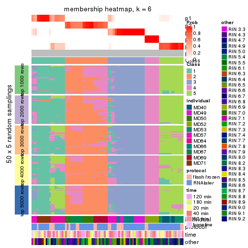</p>

</div>
</div>

As soon as we have had the classes for columns, we can look for signatures
which are significantly different between classes which can be candidate marks
for certain classes. Following are the heatmaps for signatures.


Signature heatmaps where rows are scaled:


<script>
$( function() {
	$( '#tabs-SD-mclust-get-signatures' ).tabs();
} );
</script>
<div id='tabs-SD-mclust-get-signatures'>
<ul>
<li><a href='#tab-SD-mclust-get-signatures-1'>k = 2</a></li>
<li><a href='#tab-SD-mclust-get-signatures-2'>k = 3</a></li>
<li><a href='#tab-SD-mclust-get-signatures-3'>k = 4</a></li>
<li><a href='#tab-SD-mclust-get-signatures-4'>k = 5</a></li>
<li><a href='#tab-SD-mclust-get-signatures-5'>k = 6</a></li>
</ul>
<div id='tab-SD-mclust-get-signatures-1'>
<pre><code class="r">get_signatures(res, k = 2)
</code></pre>

<p></p>

</div>
<div id='tab-SD-mclust-get-signatures-2'>
<pre><code class="r">get_signatures(res, k = 3)
</code></pre>

<p></p>

</div>
<div id='tab-SD-mclust-get-signatures-3'>
<pre><code class="r">get_signatures(res, k = 4)
</code></pre>

<p></p>

</div>
<div id='tab-SD-mclust-get-signatures-4'>
<pre><code class="r">get_signatures(res, k = 5)
</code></pre>

<p>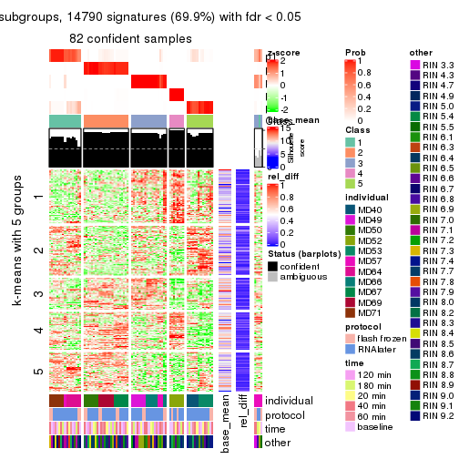</p>

</div>
<div id='tab-SD-mclust-get-signatures-5'>
<pre><code class="r">get_signatures(res, k = 6)
</code></pre>

<p></p>

</div>
</div>


Signature heatmaps where rows are not scaled:


<script>
$( function() {
	$( '#tabs-SD-mclust-get-signatures-no-scale' ).tabs();
} );
</script>
<div id='tabs-SD-mclust-get-signatures-no-scale'>
<ul>
<li><a href='#tab-SD-mclust-get-signatures-no-scale-1'>k = 2</a></li>
<li><a href='#tab-SD-mclust-get-signatures-no-scale-2'>k = 3</a></li>
<li><a href='#tab-SD-mclust-get-signatures-no-scale-3'>k = 4</a></li>
<li><a href='#tab-SD-mclust-get-signatures-no-scale-4'>k = 5</a></li>
<li><a href='#tab-SD-mclust-get-signatures-no-scale-5'>k = 6</a></li>
</ul>
<div id='tab-SD-mclust-get-signatures-no-scale-1'>
<pre><code class="r">get_signatures(res, k = 2, scale_rows = FALSE)
</code></pre>

<p></p>

</div>
<div id='tab-SD-mclust-get-signatures-no-scale-2'>
<pre><code class="r">get_signatures(res, k = 3, scale_rows = FALSE)
</code></pre>

<p></p>

</div>
<div id='tab-SD-mclust-get-signatures-no-scale-3'>
<pre><code class="r">get_signatures(res, k = 4, scale_rows = FALSE)
</code></pre>

<p></p>

</div>
<div id='tab-SD-mclust-get-signatures-no-scale-4'>
<pre><code class="r">get_signatures(res, k = 5, scale_rows = FALSE)
</code></pre>

<p></p>

</div>
<div id='tab-SD-mclust-get-signatures-no-scale-5'>
<pre><code class="r">get_signatures(res, k = 6, scale_rows = FALSE)
</code></pre>

<p></p>

</div>
</div>


Compare the overlap of signatures from different k:

```r
compare_signatures(res)
```


`get_signature()` returns a data frame invisibly. TO get the list of signatures, the function
call should be assigned to a variable explicitly. In following code, if `plot` argument is set
to `FALSE`, no heatmap is plotted while only the differential analysis is performed.

```r
# code only for demonstration
tb = get_signature(res, k = ..., plot = FALSE)
```

An example of the output of `tb` is:

```
#>   which_row         fdr    mean_1    mean_2 scaled_mean_1 scaled_mean_2 km
#> 1        38 0.042760348  8.373488  9.131774    -0.5533452     0.5164555  1
#> 2        40 0.018707592  7.106213  8.469186    -0.6173731     0.5762149  1
#> 3        55 0.019134737 10.221463 11.207825    -0.6159697     0.5749050  1
#> 4        59 0.006059896  5.921854  7.869574    -0.6899429     0.6439467  1
#> 5        60 0.018055526  8.928898 10.211722    -0.6204761     0.5791110  1
#> 6        98 0.009384629 15.714769 14.887706     0.6635654    -0.6193277  2
...
```

The columns in `tb` are:

1. `which_row`: row indices corresponding to the input matrix.
2. `fdr`: FDR for the differential test. 
3. `mean_x`: The mean value in group x.
4. `scaled_mean_x`: The mean value in group x after rows are scaled.
5. `km`: Row groups if k-means clustering is applied to rows.


UMAP plot which shows how samples are separated.


<script>
$( function() {
	$( '#tabs-SD-mclust-dimension-reduction' ).tabs();
} );
</script>
<div id='tabs-SD-mclust-dimension-reduction'>
<ul>
<li><a href='#tab-SD-mclust-dimension-reduction-1'>k = 2</a></li>
<li><a href='#tab-SD-mclust-dimension-reduction-2'>k = 3</a></li>
<li><a href='#tab-SD-mclust-dimension-reduction-3'>k = 4</a></li>
<li><a href='#tab-SD-mclust-dimension-reduction-4'>k = 5</a></li>
<li><a href='#tab-SD-mclust-dimension-reduction-5'>k = 6</a></li>
</ul>
<div id='tab-SD-mclust-dimension-reduction-1'>
<pre><code class="r">dimension_reduction(res, k = 2, method = &quot;UMAP&quot;)
</code></pre>

<p></p>

</div>
<div id='tab-SD-mclust-dimension-reduction-2'>
<pre><code class="r">dimension_reduction(res, k = 3, method = &quot;UMAP&quot;)
</code></pre>

<p></p>

</div>
<div id='tab-SD-mclust-dimension-reduction-3'>
<pre><code class="r">dimension_reduction(res, k = 4, method = &quot;UMAP&quot;)
</code></pre>

<p></p>

</div>
<div id='tab-SD-mclust-dimension-reduction-4'>
<pre><code class="r">dimension_reduction(res, k = 5, method = &quot;UMAP&quot;)
</code></pre>

<p></p>

</div>
<div id='tab-SD-mclust-dimension-reduction-5'>
<pre><code class="r">dimension_reduction(res, k = 6, method = &quot;UMAP&quot;)
</code></pre>

<p></p>

</div>
</div>


Following heatmap shows how subgroups are split when increasing `k`:

```r
collect_classes(res)
```


Test correlation between subgroups and known annotations. If the known
annotation is numeric, one-way ANOVA test is applied, and if the known
annotation is discrete, chi-squared contingency table test is applied.

```r
test_to_known_factors(res)
```

```
#>            n individual(p) protocol(p) time(p) other(p) k
#> SD:mclust 79      1.18e-11       0.617   0.983   0.8740 2
#> SD:mclust 50      3.46e-08       0.701   0.990   0.5247 3
#> SD:mclust 82      9.05e-35       0.959   1.000   0.0135 4
#> SD:mclust 82      1.38e-45       0.953   1.000   0.0239 5
#> SD:mclust 76      2.60e-42       0.910   1.000   0.0577 6
```


If matrix rows can be associated to genes, consider to use `functional_enrichment(res,
...)` to perform function enrichment for the signature genes. See [this vignette](http://bioconductor.org/packages/devel/bioc/vignettes/cola/inst/doc/functional_enrichment.html) for more detailed explanations.


 

---------------------------------------------------


### SD:NMF


The object with results only for a single top-value method and a single partition method 
can be extracted as:

```r
res = res_list["SD", "NMF"]
# you can also extract it by
# res = res_list["SD:NMF"]
```

A summary of `res` and all the functions that can be applied to it:

```r
res
```

```
#> A 'ConsensusPartition' object with k = 2, 3, 4, 5, 6.
#>   On a matrix with 21168 rows and 86 columns.
#>   Top rows (1000, 2000, 3000, 4000, 5000) are extracted by 'SD' method.
#>   Subgroups are detected by 'NMF' method.
#>   Performed in total 1250 partitions by row resampling.
#>   Best k for subgroups seems to be 3.
#> 
#> Following methods can be applied to this 'ConsensusPartition' object:
#>  [1] "cola_report"             "collect_classes"         "collect_plots"          
#>  [4] "collect_stats"           "colnames"                "compare_signatures"     
#>  [7] "consensus_heatmap"       "dimension_reduction"     "functional_enrichment"  
#> [10] "get_anno_col"            "get_anno"                "get_classes"            
#> [13] "get_consensus"           "get_matrix"              "get_membership"         
#> [16] "get_param"               "get_signatures"          "get_stats"              
#> [19] "is_best_k"               "is_stable_k"             "membership_heatmap"     
#> [22] "ncol"                    "nrow"                    "plot_ecdf"              
#> [25] "rownames"                "select_partition_number" "show"                   
#> [28] "suggest_best_k"          "test_to_known_factors"
```

`collect_plots()` function collects all the plots made from `res` for all `k` (number of partitions)
into one single page to provide an easy and fast comparison between different `k`.

```r
collect_plots(res)
```


The plots are:

- The first row: a plot of the ECDF (empirical cumulative distribution
  function) curves of the consensus matrix for each `k` and the heatmap of
  predicted classes for each `k`.
- The second row: heatmaps of the consensus matrix for each `k`.
- The third row: heatmaps of the membership matrix for each `k`.
- The fouth row: heatmaps of the signatures for each `k`.

All the plots in panels can be made by individual functions and they are
plotted later in this section.

`select_partition_number()` produces several plots showing different
statistics for choosing "optimized" `k`. There are following statistics:

- ECDF curves of the consensus matrix for each `k`;
- 1-PAC. [The PAC
  score](https://en.wikipedia.org/wiki/Consensus_clustering#Over-interpretation_potential_of_consensus_clustering)
  measures the proportion of the ambiguous subgrouping.
- Mean silhouette score.
- Concordance. The mean probability of fiting the consensus class ids in all
  partitions.
- Area increased. Denote $A_k$ as the area under the ECDF curve for current
  `k`, the area increased is defined as $A_k - A_{k-1}$.
- Rand index. The percent of pairs of samples that are both in a same cluster
  or both are not in a same cluster in the partition of k and k-1.
- Jaccard index. The ratio of pairs of samples are both in a same cluster in
  the partition of k and k-1 and the pairs of samples are both in a same
  cluster in the partition k or k-1.

The detailed explanations of these statistics can be found in [the _cola_
vignette](http://bioconductor.org/packages/devel/bioc/vignettes/cola/inst/doc/cola.html#toc_13).

Generally speaking, lower PAC score, higher mean silhouette score or higher
concordance corresponds to better partition. Rand index and Jaccard index
measure how similar the current partition is compared to partition with `k-1`.
If they are too similar, we won't accept `k` is better than `k-1`.

```r
select_partition_number(res)
```


The numeric values for all these statistics can be obtained by `get_stats()`.

```r
get_stats(res)
```

```
#>   k 1-PAC mean_silhouette concordance area_increased  Rand Jaccard
#> 2 2 0.467           0.781       0.888         0.4730 0.508   0.508
#> 3 3 0.765           0.860       0.934         0.3381 0.647   0.423
#> 4 4 0.684           0.717       0.867         0.1630 0.749   0.425
#> 5 5 0.660           0.646       0.794         0.0668 0.887   0.608
#> 6 6 0.757           0.678       0.828         0.0391 0.880   0.529
```

`suggest_best_k()` suggests the best $k$ based on these statistics. The rules are as follows:

- All $k$ with Jaccard index larger than 0.95 are removed because increasing
  $k$ does not provide enough extra information. If all $k$ are removed, it is
  marked as no subgroup is detected.
- For all $k$ with 1-PAC score larger than 0.9, the maximal $k$ is taken as
  the best $k$, and other $k$ are marked as optional $k$.
- If it does not fit the second rule. The $k$ with the maximal vote of the
  highest 1-PAC score, highest mean silhouette, and highest concordance is
  taken as the best $k$.

```r
suggest_best_k(res)
```

```
#> [1] 3
```


Following shows the table of the partitions (You need to click the **show/hide
code output** link to see it). The membership matrix (columns with name `p*`)
is inferred by
[`clue::cl_consensus()`](https://www.rdocumentation.org/link/cl_consensus?package=clue)
function with the `SE` method. Basically the value in the membership matrix
represents the probability to belong to a certain group. The finall class
label for an item is determined with the group with highest probability it
belongs to.

In `get_classes()` function, the entropy is calculated from the membership
matrix and the silhouette score is calculated from the consensus matrix.


<script>
$( function() {
	$( '#tabs-SD-NMF-get-classes' ).tabs();
} );
</script>
<div id='tabs-SD-NMF-get-classes'>
<ul>
<li><a href='#tab-SD-NMF-get-classes-1'>k = 2</a></li>
<li><a href='#tab-SD-NMF-get-classes-2'>k = 3</a></li>
<li><a href='#tab-SD-NMF-get-classes-3'>k = 4</a></li>
<li><a href='#tab-SD-NMF-get-classes-4'>k = 5</a></li>
<li><a href='#tab-SD-NMF-get-classes-5'>k = 6</a></li>
</ul>

<div id='tab-SD-NMF-get-classes-1'>
<p><a id='tab-SD-NMF-get-classes-1-a' style='color:#0366d6' href='#'>show/hide code output</a></p>
<pre><code class="r">cbind(get_classes(res, k = 2), get_membership(res, k = 2))
</code></pre>

<pre><code>#&gt;           class entropy silhouette    p1    p2
#&gt; GSM614415     1  0.0000      0.902 1.000 0.000
#&gt; GSM614416     1  0.0000      0.902 1.000 0.000
#&gt; GSM614417     1  0.0000      0.902 1.000 0.000
#&gt; GSM614418     1  0.0000      0.902 1.000 0.000
#&gt; GSM614419     1  0.0000      0.902 1.000 0.000
#&gt; GSM614420     1  0.0000      0.902 1.000 0.000
#&gt; GSM614421     2  0.4022      0.835 0.080 0.920
#&gt; GSM614422     1  0.1184      0.895 0.984 0.016
#&gt; GSM614423     1  0.9393      0.294 0.644 0.356
#&gt; GSM614424     2  0.4022      0.837 0.080 0.920
#&gt; GSM614425     2  0.9522      0.459 0.372 0.628
#&gt; GSM614426     2  0.9732      0.364 0.404 0.596
#&gt; GSM614427     2  0.0376      0.837 0.004 0.996
#&gt; GSM614428     2  0.0376      0.837 0.004 0.996
#&gt; GSM614429     2  0.5629      0.834 0.132 0.868
#&gt; GSM614430     2  0.6623      0.824 0.172 0.828
#&gt; GSM614431     2  0.7528      0.806 0.216 0.784
#&gt; GSM614432     2  0.7528      0.806 0.216 0.784
#&gt; GSM614433     2  0.7602      0.804 0.220 0.780
#&gt; GSM614434     2  0.7299      0.813 0.204 0.796
#&gt; GSM614435     2  0.1414      0.841 0.020 0.980
#&gt; GSM614436     2  0.0000      0.837 0.000 1.000
#&gt; GSM614437     2  0.0000      0.837 0.000 1.000
#&gt; GSM614438     2  0.0376      0.837 0.004 0.996
#&gt; GSM614439     2  0.0376      0.837 0.004 0.996
#&gt; GSM614440     2  0.0376      0.837 0.004 0.996
#&gt; GSM614441     2  0.0376      0.837 0.004 0.996
#&gt; GSM614442     2  0.0376      0.837 0.004 0.996
#&gt; GSM614443     2  0.0000      0.837 0.000 1.000
#&gt; GSM614444     2  0.0376      0.837 0.004 0.996
#&gt; GSM614391     1  0.0000      0.902 1.000 0.000
#&gt; GSM614392     1  0.0000      0.902 1.000 0.000
#&gt; GSM614393     1  0.0000      0.902 1.000 0.000
#&gt; GSM614394     1  0.0000      0.902 1.000 0.000
#&gt; GSM614395     1  0.7528      0.668 0.784 0.216
#&gt; GSM614396     1  0.0000      0.902 1.000 0.000
#&gt; GSM614397     1  0.5408      0.779 0.876 0.124
#&gt; GSM614398     1  0.0672      0.897 0.992 0.008
#&gt; GSM614399     2  0.8861      0.716 0.304 0.696
#&gt; GSM614400     1  0.9661      0.173 0.608 0.392
#&gt; GSM614401     1  0.5294      0.785 0.880 0.120
#&gt; GSM614402     1  0.9993     -0.212 0.516 0.484
#&gt; GSM614403     2  0.9323      0.645 0.348 0.652
#&gt; GSM614404     1  0.9996     -0.227 0.512 0.488
#&gt; GSM614405     2  0.8608      0.742 0.284 0.716
#&gt; GSM614406     2  0.0376      0.837 0.004 0.996
#&gt; GSM614407     1  0.0376      0.901 0.996 0.004
#&gt; GSM614408     1  0.0376      0.901 0.996 0.004
#&gt; GSM614409     1  0.0000      0.902 1.000 0.000
#&gt; GSM614410     1  0.0376      0.901 0.996 0.004
#&gt; GSM614411     1  0.0000      0.902 1.000 0.000
#&gt; GSM614412     1  0.0000      0.902 1.000 0.000
#&gt; GSM614413     1  0.0672      0.897 0.992 0.008
#&gt; GSM614414     1  0.0376      0.900 0.996 0.004
#&gt; GSM614445     2  0.9833      0.484 0.424 0.576
#&gt; GSM614446     2  0.9000      0.702 0.316 0.684
#&gt; GSM614447     2  0.9087      0.686 0.324 0.676
#&gt; GSM614448     2  0.1633      0.834 0.024 0.976
#&gt; GSM614449     2  0.2043      0.839 0.032 0.968
#&gt; GSM614450     2  0.9129      0.682 0.328 0.672
#&gt; GSM614451     2  0.0376      0.837 0.004 0.996
#&gt; GSM614452     2  0.0376      0.837 0.004 0.996
#&gt; GSM614453     2  0.7299      0.813 0.204 0.796
#&gt; GSM614454     2  0.6887      0.821 0.184 0.816
#&gt; GSM614455     2  0.6801      0.822 0.180 0.820
#&gt; GSM614456     2  0.0672      0.840 0.008 0.992
#&gt; GSM614457     2  0.0376      0.839 0.004 0.996
#&gt; GSM614458     2  0.3879      0.842 0.076 0.924
#&gt; GSM614459     2  0.0000      0.837 0.000 1.000
#&gt; GSM614460     2  0.2236      0.843 0.036 0.964
#&gt; GSM614461     2  0.7528      0.806 0.216 0.784
#&gt; GSM614462     2  0.7815      0.795 0.232 0.768
#&gt; GSM614463     2  0.8016      0.784 0.244 0.756
#&gt; GSM614464     2  0.7453      0.809 0.212 0.788
#&gt; GSM614465     2  0.7950      0.788 0.240 0.760
#&gt; GSM614466     2  0.7815      0.795 0.232 0.768
#&gt; GSM614467     2  0.3733      0.843 0.072 0.928
#&gt; GSM614468     2  0.7528      0.806 0.216 0.784
#&gt; GSM614469     1  0.0376      0.901 0.996 0.004
#&gt; GSM614470     1  0.0376      0.901 0.996 0.004
#&gt; GSM614471     1  0.0376      0.901 0.996 0.004
#&gt; GSM614472     1  0.0376      0.901 0.996 0.004
#&gt; GSM614473     1  0.0376      0.901 0.996 0.004
#&gt; GSM614474     1  0.0376      0.901 0.996 0.004
#&gt; GSM614475     1  0.5519      0.774 0.872 0.128
#&gt; GSM614476     1  0.8661      0.478 0.712 0.288
</code></pre>

<script>
$('#tab-SD-NMF-get-classes-1-a').parent().next().next().hide();
$('#tab-SD-NMF-get-classes-1-a').click(function(){
  $('#tab-SD-NMF-get-classes-1-a').parent().next().next().toggle();
  return(false);
});
</script>
</div>

<div id='tab-SD-NMF-get-classes-2'>
<p><a id='tab-SD-NMF-get-classes-2-a' style='color:#0366d6' href='#'>show/hide code output</a></p>
<pre><code class="r">cbind(get_classes(res, k = 3), get_membership(res, k = 3))
</code></pre>

<pre><code>#&gt;           class entropy silhouette    p1    p2    p3
#&gt; GSM614415     1  0.0000   0.941075 1.000 0.000 0.000
#&gt; GSM614416     1  0.0000   0.941075 1.000 0.000 0.000
#&gt; GSM614417     1  0.0000   0.941075 1.000 0.000 0.000
#&gt; GSM614418     1  0.0000   0.941075 1.000 0.000 0.000
#&gt; GSM614419     1  0.0237   0.940652 0.996 0.000 0.004
#&gt; GSM614420     1  0.0237   0.940652 0.996 0.000 0.004
#&gt; GSM614421     3  0.7106   0.707511 0.076 0.224 0.700
#&gt; GSM614422     1  0.3682   0.805584 0.876 0.116 0.008
#&gt; GSM614423     2  0.1860   0.911708 0.052 0.948 0.000
#&gt; GSM614424     3  0.6765   0.729817 0.068 0.208 0.724
#&gt; GSM614425     3  0.9601   0.144282 0.392 0.200 0.408
#&gt; GSM614426     1  0.9585   0.000206 0.456 0.212 0.332
#&gt; GSM614427     3  0.4514   0.804008 0.012 0.156 0.832
#&gt; GSM614428     3  0.1015   0.874994 0.012 0.008 0.980
#&gt; GSM614429     2  0.1031   0.926300 0.000 0.976 0.024
#&gt; GSM614430     2  0.0747   0.930067 0.000 0.984 0.016
#&gt; GSM614431     2  0.0000   0.935564 0.000 1.000 0.000
#&gt; GSM614432     2  0.0000   0.935564 0.000 1.000 0.000
#&gt; GSM614433     2  0.0000   0.935564 0.000 1.000 0.000
#&gt; GSM614434     2  0.0237   0.934799 0.000 0.996 0.004
#&gt; GSM614435     2  0.2261   0.896515 0.000 0.932 0.068
#&gt; GSM614436     3  0.3879   0.814569 0.000 0.152 0.848
#&gt; GSM614437     3  0.0424   0.881041 0.000 0.008 0.992
#&gt; GSM614438     3  0.0237   0.882337 0.000 0.004 0.996
#&gt; GSM614439     3  0.0237   0.882337 0.000 0.004 0.996
#&gt; GSM614440     3  0.0237   0.882337 0.000 0.004 0.996
#&gt; GSM614441     3  0.0237   0.882337 0.000 0.004 0.996
#&gt; GSM614442     3  0.0237   0.882337 0.000 0.004 0.996
#&gt; GSM614443     3  0.0237   0.882337 0.000 0.004 0.996
#&gt; GSM614444     3  0.0237   0.882337 0.000 0.004 0.996
#&gt; GSM614391     1  0.0237   0.940652 0.996 0.000 0.004
#&gt; GSM614392     1  0.0000   0.941075 1.000 0.000 0.000
#&gt; GSM614393     1  0.0000   0.941075 1.000 0.000 0.000
#&gt; GSM614394     1  0.0237   0.940652 0.996 0.000 0.004
#&gt; GSM614395     1  0.2878   0.850002 0.904 0.000 0.096
#&gt; GSM614396     1  0.0237   0.940652 0.996 0.000 0.004
#&gt; GSM614397     1  0.0592   0.935170 0.988 0.000 0.012
#&gt; GSM614398     1  0.0237   0.940652 0.996 0.000 0.004
#&gt; GSM614399     2  0.0237   0.935048 0.004 0.996 0.000
#&gt; GSM614400     2  0.0237   0.935048 0.004 0.996 0.000
#&gt; GSM614401     2  0.0424   0.934106 0.008 0.992 0.000
#&gt; GSM614402     2  0.0237   0.935048 0.004 0.996 0.000
#&gt; GSM614403     2  0.0892   0.929667 0.020 0.980 0.000
#&gt; GSM614404     2  0.0237   0.935048 0.004 0.996 0.000
#&gt; GSM614405     2  0.2689   0.907597 0.036 0.932 0.032
#&gt; GSM614406     3  0.0000   0.880785 0.000 0.000 1.000
#&gt; GSM614407     1  0.1031   0.922883 0.976 0.024 0.000
#&gt; GSM614408     1  0.0592   0.933090 0.988 0.012 0.000
#&gt; GSM614409     1  0.0000   0.941075 1.000 0.000 0.000
#&gt; GSM614410     1  0.0592   0.933090 0.988 0.012 0.000
#&gt; GSM614411     1  0.0000   0.941075 1.000 0.000 0.000
#&gt; GSM614412     1  0.0000   0.941075 1.000 0.000 0.000
#&gt; GSM614413     1  0.0237   0.940652 0.996 0.000 0.004
#&gt; GSM614414     1  0.0237   0.940652 0.996 0.000 0.004
#&gt; GSM614445     2  0.0237   0.935048 0.004 0.996 0.000
#&gt; GSM614446     2  0.0000   0.935564 0.000 1.000 0.000
#&gt; GSM614447     2  0.0237   0.935048 0.004 0.996 0.000
#&gt; GSM614448     3  0.5138   0.809667 0.052 0.120 0.828
#&gt; GSM614449     3  0.5706   0.585087 0.000 0.320 0.680
#&gt; GSM614450     2  0.5947   0.724415 0.052 0.776 0.172
#&gt; GSM614451     3  0.0000   0.880785 0.000 0.000 1.000
#&gt; GSM614452     3  0.0000   0.880785 0.000 0.000 1.000
#&gt; GSM614453     2  0.0000   0.935564 0.000 1.000 0.000
#&gt; GSM614454     2  0.0237   0.934799 0.000 0.996 0.004
#&gt; GSM614455     2  0.0237   0.934799 0.000 0.996 0.004
#&gt; GSM614456     2  0.4291   0.779654 0.000 0.820 0.180
#&gt; GSM614457     2  0.4974   0.699599 0.000 0.764 0.236
#&gt; GSM614458     2  0.1031   0.926248 0.000 0.976 0.024
#&gt; GSM614459     2  0.6286   0.157704 0.000 0.536 0.464
#&gt; GSM614460     2  0.3619   0.831808 0.000 0.864 0.136
#&gt; GSM614461     2  0.0000   0.935564 0.000 1.000 0.000
#&gt; GSM614462     2  0.0000   0.935564 0.000 1.000 0.000
#&gt; GSM614463     2  0.0000   0.935564 0.000 1.000 0.000
#&gt; GSM614464     2  0.0237   0.934799 0.000 0.996 0.004
#&gt; GSM614465     2  0.0000   0.935564 0.000 1.000 0.000
#&gt; GSM614466     2  0.0000   0.935564 0.000 1.000 0.000
#&gt; GSM614467     2  0.2356   0.893217 0.000 0.928 0.072
#&gt; GSM614468     2  0.0000   0.935564 0.000 1.000 0.000
#&gt; GSM614469     2  0.3038   0.864630 0.104 0.896 0.000
#&gt; GSM614470     2  0.3551   0.836006 0.132 0.868 0.000
#&gt; GSM614471     2  0.1163   0.925404 0.028 0.972 0.000
#&gt; GSM614472     2  0.1964   0.906771 0.056 0.944 0.000
#&gt; GSM614473     2  0.5327   0.647369 0.272 0.728 0.000
#&gt; GSM614474     2  0.3941   0.808897 0.156 0.844 0.000
#&gt; GSM614475     2  0.1289   0.923537 0.032 0.968 0.000
#&gt; GSM614476     1  0.6126   0.428500 0.644 0.352 0.004
</code></pre>

<script>
$('#tab-SD-NMF-get-classes-2-a').parent().next().next().hide();
$('#tab-SD-NMF-get-classes-2-a').click(function(){
  $('#tab-SD-NMF-get-classes-2-a').parent().next().next().toggle();
  return(false);
});
</script>
</div>

<div id='tab-SD-NMF-get-classes-3'>
<p><a id='tab-SD-NMF-get-classes-3-a' style='color:#0366d6' href='#'>show/hide code output</a></p>
<pre><code class="r">cbind(get_classes(res, k = 4), get_membership(res, k = 4))
</code></pre>

<pre><code>#&gt;           class entropy silhouette    p1    p2    p3    p4
#&gt; GSM614415     1  0.0336     0.9065 0.992 0.000 0.008 0.000
#&gt; GSM614416     1  0.0188     0.9061 0.996 0.000 0.004 0.000
#&gt; GSM614417     1  0.0188     0.9061 0.996 0.000 0.004 0.000
#&gt; GSM614418     1  0.0188     0.9061 0.996 0.000 0.004 0.000
#&gt; GSM614419     1  0.0336     0.9065 0.992 0.000 0.008 0.000
#&gt; GSM614420     1  0.0336     0.9065 0.992 0.000 0.008 0.000
#&gt; GSM614421     3  0.2216     0.8213 0.000 0.092 0.908 0.000
#&gt; GSM614422     3  0.2216     0.8210 0.000 0.092 0.908 0.000
#&gt; GSM614423     3  0.4679     0.5638 0.000 0.352 0.648 0.000
#&gt; GSM614424     3  0.2345     0.8198 0.000 0.100 0.900 0.000
#&gt; GSM614425     3  0.2216     0.8213 0.000 0.092 0.908 0.000
#&gt; GSM614426     3  0.2281     0.8208 0.000 0.096 0.904 0.000
#&gt; GSM614427     3  0.1824     0.8100 0.000 0.060 0.936 0.004
#&gt; GSM614428     3  0.0707     0.7656 0.000 0.000 0.980 0.020
#&gt; GSM614429     2  0.1305     0.8032 0.000 0.960 0.004 0.036
#&gt; GSM614430     2  0.1109     0.8089 0.000 0.968 0.004 0.028
#&gt; GSM614431     2  0.0188     0.8190 0.000 0.996 0.004 0.000
#&gt; GSM614432     2  0.0188     0.8190 0.000 0.996 0.004 0.000
#&gt; GSM614433     2  0.0707     0.8209 0.000 0.980 0.020 0.000
#&gt; GSM614434     2  0.1004     0.8106 0.000 0.972 0.004 0.024
#&gt; GSM614435     2  0.4252     0.5541 0.000 0.744 0.004 0.252
#&gt; GSM614436     4  0.3793     0.8030 0.000 0.112 0.044 0.844
#&gt; GSM614437     4  0.0672     0.8288 0.000 0.008 0.008 0.984
#&gt; GSM614438     4  0.2408     0.8204 0.000 0.000 0.104 0.896
#&gt; GSM614439     4  0.2469     0.8180 0.000 0.000 0.108 0.892
#&gt; GSM614440     4  0.2408     0.8204 0.000 0.000 0.104 0.896
#&gt; GSM614441     4  0.2469     0.8181 0.000 0.000 0.108 0.892
#&gt; GSM614442     4  0.2081     0.8246 0.000 0.000 0.084 0.916
#&gt; GSM614443     4  0.0524     0.8289 0.000 0.004 0.008 0.988
#&gt; GSM614444     4  0.2408     0.8204 0.000 0.000 0.104 0.896
#&gt; GSM614391     1  0.0336     0.9065 0.992 0.000 0.008 0.000
#&gt; GSM614392     1  0.0336     0.9065 0.992 0.000 0.008 0.000
#&gt; GSM614393     1  0.0336     0.9065 0.992 0.000 0.008 0.000
#&gt; GSM614394     1  0.0336     0.9065 0.992 0.000 0.008 0.000
#&gt; GSM614395     3  0.5594    -0.0358 0.460 0.000 0.520 0.020
#&gt; GSM614396     1  0.0336     0.9065 0.992 0.000 0.008 0.000
#&gt; GSM614397     1  0.2469     0.8341 0.892 0.000 0.108 0.000
#&gt; GSM614398     1  0.0921     0.8976 0.972 0.000 0.028 0.000
#&gt; GSM614399     2  0.0921     0.8177 0.000 0.972 0.028 0.000
#&gt; GSM614400     2  0.0592     0.8209 0.000 0.984 0.016 0.000
#&gt; GSM614401     2  0.0817     0.8192 0.000 0.976 0.024 0.000
#&gt; GSM614402     2  0.1637     0.7985 0.000 0.940 0.060 0.000
#&gt; GSM614403     2  0.4972    -0.0872 0.000 0.544 0.456 0.000
#&gt; GSM614404     2  0.0707     0.8203 0.000 0.980 0.020 0.000
#&gt; GSM614405     2  0.4730     0.2707 0.000 0.636 0.364 0.000
#&gt; GSM614406     3  0.3873     0.5482 0.000 0.000 0.772 0.228
#&gt; GSM614407     1  0.0817     0.9020 0.976 0.000 0.024 0.000
#&gt; GSM614408     1  0.0817     0.9020 0.976 0.000 0.024 0.000
#&gt; GSM614409     1  0.1022     0.8997 0.968 0.000 0.032 0.000
#&gt; GSM614410     1  0.0817     0.9020 0.976 0.000 0.024 0.000
#&gt; GSM614411     1  0.0921     0.9010 0.972 0.000 0.028 0.000
#&gt; GSM614412     1  0.1022     0.8997 0.968 0.000 0.032 0.000
#&gt; GSM614413     1  0.4624     0.5143 0.660 0.000 0.340 0.000
#&gt; GSM614414     1  0.2760     0.8280 0.872 0.000 0.128 0.000
#&gt; GSM614445     3  0.4941     0.3719 0.000 0.436 0.564 0.000
#&gt; GSM614446     3  0.4250     0.6752 0.000 0.276 0.724 0.000
#&gt; GSM614447     3  0.4776     0.5144 0.000 0.376 0.624 0.000
#&gt; GSM614448     3  0.1635     0.8025 0.008 0.044 0.948 0.000
#&gt; GSM614449     3  0.2530     0.8148 0.000 0.112 0.888 0.000
#&gt; GSM614450     3  0.3486     0.7649 0.000 0.188 0.812 0.000
#&gt; GSM614451     3  0.2011     0.7248 0.000 0.000 0.920 0.080
#&gt; GSM614452     3  0.1637     0.7406 0.000 0.000 0.940 0.060
#&gt; GSM614453     2  0.4661     0.3555 0.000 0.652 0.000 0.348
#&gt; GSM614454     4  0.4989     0.1570 0.000 0.472 0.000 0.528
#&gt; GSM614455     4  0.4994     0.1315 0.000 0.480 0.000 0.520
#&gt; GSM614456     4  0.2973     0.7857 0.000 0.144 0.000 0.856
#&gt; GSM614457     4  0.2345     0.8129 0.000 0.100 0.000 0.900
#&gt; GSM614458     2  0.5112     0.0911 0.000 0.560 0.004 0.436
#&gt; GSM614459     4  0.1716     0.8231 0.000 0.064 0.000 0.936
#&gt; GSM614460     4  0.2868     0.7934 0.000 0.136 0.000 0.864
#&gt; GSM614461     2  0.0469     0.8205 0.000 0.988 0.012 0.000
#&gt; GSM614462     2  0.0817     0.8199 0.000 0.976 0.024 0.000
#&gt; GSM614463     2  0.0592     0.8208 0.000 0.984 0.016 0.000
#&gt; GSM614464     2  0.1022     0.8168 0.000 0.968 0.032 0.000
#&gt; GSM614465     2  0.1716     0.7968 0.000 0.936 0.064 0.000
#&gt; GSM614466     2  0.0707     0.8205 0.000 0.980 0.020 0.000
#&gt; GSM614467     2  0.4040     0.5494 0.000 0.752 0.248 0.000
#&gt; GSM614468     2  0.1867     0.7902 0.000 0.928 0.072 0.000
#&gt; GSM614469     1  0.4836     0.5180 0.672 0.320 0.008 0.000
#&gt; GSM614470     1  0.4647     0.5807 0.704 0.288 0.008 0.000
#&gt; GSM614471     2  0.4511     0.5639 0.268 0.724 0.008 0.000
#&gt; GSM614472     2  0.5112     0.3214 0.384 0.608 0.008 0.000
#&gt; GSM614473     1  0.3725     0.7438 0.812 0.180 0.008 0.000
#&gt; GSM614474     1  0.5310     0.2808 0.576 0.412 0.012 0.000
#&gt; GSM614475     2  0.3105     0.7194 0.140 0.856 0.004 0.000
#&gt; GSM614476     2  0.7186     0.0616 0.420 0.444 0.136 0.000
</code></pre>

<script>
$('#tab-SD-NMF-get-classes-3-a').parent().next().next().hide();
$('#tab-SD-NMF-get-classes-3-a').click(function(){
  $('#tab-SD-NMF-get-classes-3-a').parent().next().next().toggle();
  return(false);
});
</script>
</div>

<div id='tab-SD-NMF-get-classes-4'>
<p><a id='tab-SD-NMF-get-classes-4-a' style='color:#0366d6' href='#'>show/hide code output</a></p>
<pre><code class="r">cbind(get_classes(res, k = 5), get_membership(res, k = 5))
</code></pre>

<pre><code>#&gt;           class entropy silhouette    p1    p2    p3    p4    p5
#&gt; GSM614415     5  0.3074    0.76816 0.196 0.000 0.000 0.000 0.804
#&gt; GSM614416     5  0.3074    0.76816 0.196 0.000 0.000 0.000 0.804
#&gt; GSM614417     5  0.3074    0.76816 0.196 0.000 0.000 0.000 0.804
#&gt; GSM614418     5  0.3109    0.76306 0.200 0.000 0.000 0.000 0.800
#&gt; GSM614419     5  0.2966    0.77466 0.184 0.000 0.000 0.000 0.816
#&gt; GSM614420     5  0.2966    0.77466 0.184 0.000 0.000 0.000 0.816
#&gt; GSM614421     3  0.1549    0.83171 0.016 0.040 0.944 0.000 0.000
#&gt; GSM614422     3  0.1444    0.83240 0.012 0.040 0.948 0.000 0.000
#&gt; GSM614423     3  0.3961    0.73558 0.028 0.212 0.760 0.000 0.000
#&gt; GSM614424     3  0.1121    0.83400 0.000 0.044 0.956 0.000 0.000
#&gt; GSM614425     3  0.1408    0.83322 0.008 0.044 0.948 0.000 0.000
#&gt; GSM614426     3  0.1282    0.83389 0.000 0.044 0.952 0.000 0.004
#&gt; GSM614427     3  0.1026    0.82697 0.004 0.024 0.968 0.004 0.000
#&gt; GSM614428     3  0.0566    0.80874 0.004 0.000 0.984 0.012 0.000
#&gt; GSM614429     2  0.1012    0.76202 0.012 0.968 0.000 0.020 0.000
#&gt; GSM614430     2  0.0771    0.76575 0.020 0.976 0.000 0.004 0.000
#&gt; GSM614431     2  0.0290    0.76895 0.008 0.992 0.000 0.000 0.000
#&gt; GSM614432     2  0.0798    0.76971 0.016 0.976 0.008 0.000 0.000
#&gt; GSM614433     2  0.0963    0.77204 0.000 0.964 0.036 0.000 0.000
#&gt; GSM614434     2  0.0798    0.76532 0.016 0.976 0.000 0.008 0.000
#&gt; GSM614435     2  0.4104    0.54956 0.032 0.748 0.000 0.220 0.000
#&gt; GSM614436     4  0.5061    0.60017 0.020 0.312 0.024 0.644 0.000
#&gt; GSM614437     4  0.0404    0.83729 0.000 0.012 0.000 0.988 0.000
#&gt; GSM614438     4  0.1341    0.84093 0.000 0.000 0.056 0.944 0.000
#&gt; GSM614439     4  0.1544    0.83489 0.000 0.000 0.068 0.932 0.000
#&gt; GSM614440     4  0.1478    0.83771 0.000 0.000 0.064 0.936 0.000
#&gt; GSM614441     4  0.1478    0.83782 0.000 0.000 0.064 0.936 0.000
#&gt; GSM614442     4  0.1121    0.84173 0.000 0.000 0.044 0.956 0.000
#&gt; GSM614443     4  0.0451    0.83875 0.000 0.008 0.004 0.988 0.000
#&gt; GSM614444     4  0.1341    0.84093 0.000 0.000 0.056 0.944 0.000
#&gt; GSM614391     5  0.0000    0.81231 0.000 0.000 0.000 0.000 1.000
#&gt; GSM614392     5  0.0000    0.81231 0.000 0.000 0.000 0.000 1.000
#&gt; GSM614393     5  0.0000    0.81231 0.000 0.000 0.000 0.000 1.000
#&gt; GSM614394     5  0.0162    0.81131 0.000 0.000 0.004 0.000 0.996
#&gt; GSM614395     5  0.4088    0.44163 0.004 0.000 0.276 0.008 0.712
#&gt; GSM614396     5  0.0162    0.81131 0.000 0.000 0.004 0.000 0.996
#&gt; GSM614397     5  0.1831    0.73490 0.004 0.000 0.076 0.000 0.920
#&gt; GSM614398     5  0.0671    0.79920 0.004 0.000 0.016 0.000 0.980
#&gt; GSM614399     2  0.4058    0.63429 0.236 0.740 0.024 0.000 0.000
#&gt; GSM614400     2  0.4647    0.50531 0.352 0.628 0.016 0.000 0.004
#&gt; GSM614401     2  0.5057    0.38822 0.412 0.556 0.028 0.000 0.004
#&gt; GSM614402     2  0.4924    0.58294 0.272 0.668 0.060 0.000 0.000
#&gt; GSM614403     3  0.6646    0.24745 0.196 0.356 0.444 0.000 0.004
#&gt; GSM614404     2  0.4642    0.53438 0.328 0.648 0.020 0.000 0.004
#&gt; GSM614405     2  0.7109   -0.00176 0.248 0.404 0.332 0.000 0.016
#&gt; GSM614406     3  0.5449    0.53037 0.072 0.004 0.656 0.260 0.008
#&gt; GSM614407     1  0.3561    0.50964 0.740 0.000 0.000 0.000 0.260
#&gt; GSM614408     1  0.3586    0.50081 0.736 0.000 0.000 0.000 0.264
#&gt; GSM614409     1  0.4039    0.51120 0.720 0.004 0.008 0.000 0.268
#&gt; GSM614410     1  0.3612    0.50942 0.732 0.000 0.000 0.000 0.268
#&gt; GSM614411     1  0.3814    0.50798 0.720 0.004 0.000 0.000 0.276
#&gt; GSM614412     1  0.4063    0.50327 0.708 0.000 0.012 0.000 0.280
#&gt; GSM614413     1  0.5032    0.47971 0.692 0.004 0.076 0.000 0.228
#&gt; GSM614414     1  0.4503    0.49457 0.696 0.000 0.036 0.000 0.268
#&gt; GSM614445     3  0.5886    0.55535 0.144 0.272 0.584 0.000 0.000
#&gt; GSM614446     3  0.5027    0.70597 0.112 0.188 0.700 0.000 0.000
#&gt; GSM614447     3  0.5680    0.62219 0.148 0.228 0.624 0.000 0.000
#&gt; GSM614448     3  0.1121    0.82679 0.008 0.016 0.968 0.004 0.004
#&gt; GSM614449     3  0.2527    0.82607 0.020 0.072 0.900 0.004 0.004
#&gt; GSM614450     3  0.4153    0.78619 0.076 0.116 0.800 0.004 0.004
#&gt; GSM614451     3  0.1557    0.78765 0.000 0.000 0.940 0.052 0.008
#&gt; GSM614452     3  0.1408    0.79223 0.000 0.000 0.948 0.044 0.008
#&gt; GSM614453     2  0.3521    0.55948 0.004 0.764 0.000 0.232 0.000
#&gt; GSM614454     2  0.4151    0.35205 0.004 0.652 0.000 0.344 0.000
#&gt; GSM614455     2  0.3932    0.40253 0.000 0.672 0.000 0.328 0.000
#&gt; GSM614456     4  0.3837    0.62984 0.000 0.308 0.000 0.692 0.000
#&gt; GSM614457     4  0.3274    0.74163 0.000 0.220 0.000 0.780 0.000
#&gt; GSM614458     2  0.3707    0.47489 0.000 0.716 0.000 0.284 0.000
#&gt; GSM614459     4  0.2773    0.78418 0.000 0.164 0.000 0.836 0.000
#&gt; GSM614460     4  0.3949    0.65129 0.004 0.300 0.000 0.696 0.000
#&gt; GSM614461     2  0.0693    0.77278 0.008 0.980 0.012 0.000 0.000
#&gt; GSM614462     2  0.1568    0.77082 0.020 0.944 0.036 0.000 0.000
#&gt; GSM614463     2  0.1018    0.77277 0.016 0.968 0.016 0.000 0.000
#&gt; GSM614464     2  0.1981    0.76559 0.028 0.924 0.048 0.000 0.000
#&gt; GSM614465     2  0.2344    0.75788 0.032 0.904 0.064 0.000 0.000
#&gt; GSM614466     2  0.1568    0.77082 0.020 0.944 0.036 0.000 0.000
#&gt; GSM614467     2  0.3210    0.62544 0.000 0.788 0.212 0.000 0.000
#&gt; GSM614468     2  0.1768    0.76119 0.004 0.924 0.072 0.000 0.000
#&gt; GSM614469     1  0.6308    0.25873 0.484 0.164 0.000 0.000 0.352
#&gt; GSM614470     1  0.6186    0.25630 0.512 0.152 0.000 0.000 0.336
#&gt; GSM614471     1  0.6381    0.06309 0.448 0.384 0.000 0.000 0.168
#&gt; GSM614472     1  0.6438    0.30959 0.500 0.280 0.000 0.000 0.220
#&gt; GSM614473     1  0.5687    0.07771 0.484 0.080 0.000 0.000 0.436
#&gt; GSM614474     1  0.6268    0.26108 0.484 0.156 0.000 0.000 0.360
#&gt; GSM614475     2  0.5555    0.45312 0.220 0.640 0.000 0.000 0.140
#&gt; GSM614476     1  0.8081    0.27825 0.412 0.200 0.128 0.000 0.260
</code></pre>

<script>
$('#tab-SD-NMF-get-classes-4-a').parent().next().next().hide();
$('#tab-SD-NMF-get-classes-4-a').click(function(){
  $('#tab-SD-NMF-get-classes-4-a').parent().next().next().toggle();
  return(false);
});
</script>
</div>

<div id='tab-SD-NMF-get-classes-5'>
<p><a id='tab-SD-NMF-get-classes-5-a' style='color:#0366d6' href='#'>show/hide code output</a></p>
<pre><code class="r">cbind(get_classes(res, k = 6), get_membership(res, k = 6))
</code></pre>

<pre><code>#&gt;           class entropy silhouette    p1    p2    p3    p4    p5    p6
#&gt; GSM614415     5  0.4535     0.3342 0.484 0.000 0.000 0.000 0.484 0.032
#&gt; GSM614416     1  0.4535    -0.4278 0.484 0.000 0.000 0.000 0.484 0.032
#&gt; GSM614417     1  0.4535    -0.4278 0.484 0.000 0.000 0.000 0.484 0.032
#&gt; GSM614418     5  0.4535     0.3342 0.484 0.000 0.000 0.000 0.484 0.032
#&gt; GSM614419     5  0.4601     0.3552 0.472 0.000 0.004 0.000 0.496 0.028
#&gt; GSM614420     5  0.4601     0.3552 0.472 0.000 0.004 0.000 0.496 0.028
#&gt; GSM614421     3  0.1151     0.8187 0.000 0.012 0.956 0.000 0.000 0.032
#&gt; GSM614422     3  0.1723     0.8132 0.004 0.012 0.932 0.000 0.004 0.048
#&gt; GSM614423     3  0.3516     0.7588 0.056 0.076 0.832 0.000 0.000 0.036
#&gt; GSM614424     3  0.0909     0.8194 0.000 0.012 0.968 0.000 0.000 0.020
#&gt; GSM614425     3  0.1151     0.8187 0.000 0.012 0.956 0.000 0.000 0.032
#&gt; GSM614426     3  0.0964     0.8200 0.004 0.012 0.968 0.000 0.000 0.016
#&gt; GSM614427     3  0.1067     0.8189 0.000 0.004 0.964 0.004 0.004 0.024
#&gt; GSM614428     3  0.2119     0.8007 0.000 0.000 0.912 0.044 0.008 0.036
#&gt; GSM614429     2  0.1080     0.8188 0.004 0.960 0.032 0.000 0.000 0.004
#&gt; GSM614430     2  0.1155     0.8193 0.004 0.956 0.036 0.000 0.000 0.004
#&gt; GSM614431     2  0.1226     0.8195 0.004 0.952 0.040 0.000 0.000 0.004
#&gt; GSM614432     2  0.1493     0.8182 0.004 0.936 0.056 0.000 0.000 0.004
#&gt; GSM614433     2  0.1753     0.8126 0.004 0.912 0.084 0.000 0.000 0.000
#&gt; GSM614434     2  0.1226     0.8195 0.004 0.952 0.040 0.000 0.000 0.004
#&gt; GSM614435     2  0.2123     0.7979 0.000 0.908 0.008 0.064 0.000 0.020
#&gt; GSM614436     2  0.5020     0.4733 0.004 0.608 0.024 0.328 0.000 0.036
#&gt; GSM614437     4  0.1493     0.9212 0.004 0.056 0.000 0.936 0.000 0.004
#&gt; GSM614438     4  0.0458     0.9687 0.000 0.000 0.016 0.984 0.000 0.000
#&gt; GSM614439     4  0.0547     0.9662 0.000 0.000 0.020 0.980 0.000 0.000
#&gt; GSM614440     4  0.0547     0.9662 0.000 0.000 0.020 0.980 0.000 0.000
#&gt; GSM614441     4  0.0458     0.9687 0.000 0.000 0.016 0.984 0.000 0.000
#&gt; GSM614442     4  0.0551     0.9627 0.000 0.004 0.008 0.984 0.000 0.004
#&gt; GSM614443     4  0.1555     0.9175 0.004 0.060 0.000 0.932 0.000 0.004
#&gt; GSM614444     4  0.0458     0.9687 0.000 0.000 0.016 0.984 0.000 0.000
#&gt; GSM614391     5  0.0458     0.7721 0.000 0.000 0.000 0.000 0.984 0.016
#&gt; GSM614392     5  0.0458     0.7721 0.000 0.000 0.000 0.000 0.984 0.016
#&gt; GSM614393     5  0.0458     0.7721 0.000 0.000 0.000 0.000 0.984 0.016
#&gt; GSM614394     5  0.0458     0.7721 0.000 0.000 0.000 0.000 0.984 0.016
#&gt; GSM614395     5  0.1793     0.7324 0.000 0.000 0.048 0.012 0.928 0.012
#&gt; GSM614396     5  0.0458     0.7721 0.000 0.000 0.000 0.000 0.984 0.016
#&gt; GSM614397     5  0.0725     0.7662 0.000 0.000 0.012 0.000 0.976 0.012
#&gt; GSM614398     5  0.0717     0.7684 0.000 0.000 0.008 0.000 0.976 0.016
#&gt; GSM614399     1  0.4951     0.3707 0.568 0.364 0.064 0.000 0.000 0.004
#&gt; GSM614400     1  0.3900     0.6066 0.760 0.188 0.044 0.000 0.000 0.008
#&gt; GSM614401     1  0.3453     0.6209 0.808 0.144 0.040 0.000 0.000 0.008
#&gt; GSM614402     1  0.4980     0.4988 0.624 0.280 0.092 0.000 0.000 0.004
#&gt; GSM614403     1  0.5493     0.1146 0.520 0.120 0.356 0.000 0.000 0.004
#&gt; GSM614404     1  0.4364     0.5601 0.688 0.256 0.052 0.000 0.000 0.004
#&gt; GSM614405     1  0.5768     0.2819 0.544 0.172 0.276 0.000 0.004 0.004
#&gt; GSM614406     3  0.6426     0.2540 0.268 0.000 0.392 0.324 0.016 0.000
#&gt; GSM614407     6  0.1644     0.9506 0.052 0.004 0.000 0.000 0.012 0.932
#&gt; GSM614408     6  0.1863     0.9415 0.060 0.004 0.000 0.000 0.016 0.920
#&gt; GSM614409     6  0.0820     0.9646 0.012 0.000 0.000 0.000 0.016 0.972
#&gt; GSM614410     6  0.1391     0.9585 0.040 0.000 0.000 0.000 0.016 0.944
#&gt; GSM614411     6  0.1003     0.9646 0.020 0.000 0.000 0.000 0.016 0.964
#&gt; GSM614412     6  0.0748     0.9609 0.004 0.000 0.004 0.000 0.016 0.976
#&gt; GSM614413     6  0.1341     0.9403 0.000 0.000 0.028 0.000 0.024 0.948
#&gt; GSM614414     6  0.1168     0.9489 0.000 0.000 0.016 0.000 0.028 0.956
#&gt; GSM614445     3  0.5534     0.2985 0.360 0.124 0.512 0.000 0.000 0.004
#&gt; GSM614446     3  0.4353     0.6171 0.244 0.056 0.696 0.000 0.000 0.004
#&gt; GSM614447     3  0.4989     0.4652 0.328 0.076 0.592 0.000 0.000 0.004
#&gt; GSM614448     3  0.2100     0.8090 0.024 0.000 0.916 0.048 0.004 0.008
#&gt; GSM614449     3  0.1649     0.8126 0.040 0.000 0.936 0.016 0.000 0.008
#&gt; GSM614450     3  0.3273     0.7243 0.180 0.008 0.800 0.008 0.000 0.004
#&gt; GSM614451     3  0.2520     0.7739 0.000 0.000 0.872 0.108 0.008 0.012
#&gt; GSM614452     3  0.2473     0.7767 0.000 0.000 0.876 0.104 0.008 0.012
#&gt; GSM614453     2  0.1606     0.7989 0.004 0.932 0.000 0.056 0.000 0.008
#&gt; GSM614454     2  0.1843     0.7914 0.004 0.912 0.000 0.080 0.000 0.004
#&gt; GSM614455     2  0.1845     0.7939 0.004 0.916 0.000 0.072 0.000 0.008
#&gt; GSM614456     2  0.3452     0.6203 0.004 0.736 0.000 0.256 0.000 0.004
#&gt; GSM614457     2  0.3930     0.4436 0.004 0.628 0.000 0.364 0.000 0.004
#&gt; GSM614458     2  0.2009     0.7881 0.004 0.904 0.000 0.084 0.000 0.008
#&gt; GSM614459     2  0.4124     0.1511 0.004 0.516 0.000 0.476 0.000 0.004
#&gt; GSM614460     2  0.3646     0.5671 0.004 0.700 0.000 0.292 0.000 0.004
#&gt; GSM614461     2  0.1838     0.8135 0.016 0.916 0.068 0.000 0.000 0.000
#&gt; GSM614462     2  0.2106     0.8060 0.032 0.904 0.064 0.000 0.000 0.000
#&gt; GSM614463     2  0.1984     0.8093 0.032 0.912 0.056 0.000 0.000 0.000
#&gt; GSM614464     2  0.2526     0.7949 0.024 0.876 0.096 0.000 0.004 0.000
#&gt; GSM614465     2  0.2476     0.7970 0.024 0.880 0.092 0.000 0.004 0.000
#&gt; GSM614466     2  0.2176     0.8048 0.024 0.896 0.080 0.000 0.000 0.000
#&gt; GSM614467     2  0.3230     0.6985 0.012 0.776 0.212 0.000 0.000 0.000
#&gt; GSM614468     2  0.2408     0.7989 0.012 0.876 0.108 0.000 0.000 0.004
#&gt; GSM614469     1  0.3915     0.5244 0.792 0.012 0.008 0.000 0.052 0.136
#&gt; GSM614470     1  0.2557     0.5848 0.892 0.012 0.004 0.000 0.036 0.056
#&gt; GSM614471     1  0.2952     0.6073 0.872 0.064 0.008 0.000 0.016 0.040
#&gt; GSM614472     1  0.2364     0.5923 0.904 0.016 0.008 0.000 0.016 0.056
#&gt; GSM614473     1  0.3091     0.5615 0.856 0.012 0.004 0.000 0.044 0.084
#&gt; GSM614474     1  0.4378     0.5079 0.752 0.016 0.008 0.000 0.060 0.164
#&gt; GSM614475     2  0.5676    -0.0626 0.412 0.500 0.040 0.000 0.016 0.032
#&gt; GSM614476     1  0.4256     0.5838 0.780 0.024 0.140 0.004 0.012 0.040
</code></pre>

<script>
$('#tab-SD-NMF-get-classes-5-a').parent().next().next().hide();
$('#tab-SD-NMF-get-classes-5-a').click(function(){
  $('#tab-SD-NMF-get-classes-5-a').parent().next().next().toggle();
  return(false);
});
</script>
</div>
</div>

Heatmaps for the consensus matrix. It visualizes the probability of two
samples to be in a same group.


<script>
$( function() {
	$( '#tabs-SD-NMF-consensus-heatmap' ).tabs();
} );
</script>
<div id='tabs-SD-NMF-consensus-heatmap'>
<ul>
<li><a href='#tab-SD-NMF-consensus-heatmap-1'>k = 2</a></li>
<li><a href='#tab-SD-NMF-consensus-heatmap-2'>k = 3</a></li>
<li><a href='#tab-SD-NMF-consensus-heatmap-3'>k = 4</a></li>
<li><a href='#tab-SD-NMF-consensus-heatmap-4'>k = 5</a></li>
<li><a href='#tab-SD-NMF-consensus-heatmap-5'>k = 6</a></li>
</ul>
<div id='tab-SD-NMF-consensus-heatmap-1'>
<pre><code class="r">consensus_heatmap(res, k = 2)
</code></pre>

<p></p>

</div>
<div id='tab-SD-NMF-consensus-heatmap-2'>
<pre><code class="r">consensus_heatmap(res, k = 3)
</code></pre>

<p></p>

</div>
<div id='tab-SD-NMF-consensus-heatmap-3'>
<pre><code class="r">consensus_heatmap(res, k = 4)
</code></pre>

<p></p>

</div>
<div id='tab-SD-NMF-consensus-heatmap-4'>
<pre><code class="r">consensus_heatmap(res, k = 5)
</code></pre>

<p></p>

</div>
<div id='tab-SD-NMF-consensus-heatmap-5'>
<pre><code class="r">consensus_heatmap(res, k = 6)
</code></pre>

<p></p>

</div>
</div>

Heatmaps for the membership of samples in all partitions to see how consistent they are:


<script>
$( function() {
	$( '#tabs-SD-NMF-membership-heatmap' ).tabs();
} );
</script>
<div id='tabs-SD-NMF-membership-heatmap'>
<ul>
<li><a href='#tab-SD-NMF-membership-heatmap-1'>k = 2</a></li>
<li><a href='#tab-SD-NMF-membership-heatmap-2'>k = 3</a></li>
<li><a href='#tab-SD-NMF-membership-heatmap-3'>k = 4</a></li>
<li><a href='#tab-SD-NMF-membership-heatmap-4'>k = 5</a></li>
<li><a href='#tab-SD-NMF-membership-heatmap-5'>k = 6</a></li>
</ul>
<div id='tab-SD-NMF-membership-heatmap-1'>
<pre><code class="r">membership_heatmap(res, k = 2)
</code></pre>

<p></p>

</div>
<div id='tab-SD-NMF-membership-heatmap-2'>
<pre><code class="r">membership_heatmap(res, k = 3)
</code></pre>

<p></p>

</div>
<div id='tab-SD-NMF-membership-heatmap-3'>
<pre><code class="r">membership_heatmap(res, k = 4)
</code></pre>

<p></p>

</div>
<div id='tab-SD-NMF-membership-heatmap-4'>
<pre><code class="r">membership_heatmap(res, k = 5)
</code></pre>

<p></p>

</div>
<div id='tab-SD-NMF-membership-heatmap-5'>
<pre><code class="r">membership_heatmap(res, k = 6)
</code></pre>

<p></p>

</div>
</div>

As soon as we have had the classes for columns, we can look for signatures
which are significantly different between classes which can be candidate marks
for certain classes. Following are the heatmaps for signatures.


Signature heatmaps where rows are scaled:


<script>
$( function() {
	$( '#tabs-SD-NMF-get-signatures' ).tabs();
} );
</script>
<div id='tabs-SD-NMF-get-signatures'>
<ul>
<li><a href='#tab-SD-NMF-get-signatures-1'>k = 2</a></li>
<li><a href='#tab-SD-NMF-get-signatures-2'>k = 3</a></li>
<li><a href='#tab-SD-NMF-get-signatures-3'>k = 4</a></li>
<li><a href='#tab-SD-NMF-get-signatures-4'>k = 5</a></li>
<li><a href='#tab-SD-NMF-get-signatures-5'>k = 6</a></li>
</ul>
<div id='tab-SD-NMF-get-signatures-1'>
<pre><code class="r">get_signatures(res, k = 2)
</code></pre>

<p></p>

</div>
<div id='tab-SD-NMF-get-signatures-2'>
<pre><code class="r">get_signatures(res, k = 3)
</code></pre>

<p></p>

</div>
<div id='tab-SD-NMF-get-signatures-3'>
<pre><code class="r">get_signatures(res, k = 4)
</code></pre>

<p></p>

</div>
<div id='tab-SD-NMF-get-signatures-4'>
<pre><code class="r">get_signatures(res, k = 5)
</code></pre>

<p></p>

</div>
<div id='tab-SD-NMF-get-signatures-5'>
<pre><code class="r">get_signatures(res, k = 6)
</code></pre>

<p></p>

</div>
</div>


Signature heatmaps where rows are not scaled:


<script>
$( function() {
	$( '#tabs-SD-NMF-get-signatures-no-scale' ).tabs();
} );
</script>
<div id='tabs-SD-NMF-get-signatures-no-scale'>
<ul>
<li><a href='#tab-SD-NMF-get-signatures-no-scale-1'>k = 2</a></li>
<li><a href='#tab-SD-NMF-get-signatures-no-scale-2'>k = 3</a></li>
<li><a href='#tab-SD-NMF-get-signatures-no-scale-3'>k = 4</a></li>
<li><a href='#tab-SD-NMF-get-signatures-no-scale-4'>k = 5</a></li>
<li><a href='#tab-SD-NMF-get-signatures-no-scale-5'>k = 6</a></li>
</ul>
<div id='tab-SD-NMF-get-signatures-no-scale-1'>
<pre><code class="r">get_signatures(res, k = 2, scale_rows = FALSE)
</code></pre>

<p></p>

</div>
<div id='tab-SD-NMF-get-signatures-no-scale-2'>
<pre><code class="r">get_signatures(res, k = 3, scale_rows = FALSE)
</code></pre>

<p></p>

</div>
<div id='tab-SD-NMF-get-signatures-no-scale-3'>
<pre><code class="r">get_signatures(res, k = 4, scale_rows = FALSE)
</code></pre>

<p></p>

</div>
<div id='tab-SD-NMF-get-signatures-no-scale-4'>
<pre><code class="r">get_signatures(res, k = 5, scale_rows = FALSE)
</code></pre>

<p></p>

</div>
<div id='tab-SD-NMF-get-signatures-no-scale-5'>
<pre><code class="r">get_signatures(res, k = 6, scale_rows = FALSE)
</code></pre>

<p></p>

</div>
</div>


Compare the overlap of signatures from different k:

```r
compare_signatures(res)
```


`get_signature()` returns a data frame invisibly. TO get the list of signatures, the function
call should be assigned to a variable explicitly. In following code, if `plot` argument is set
to `FALSE`, no heatmap is plotted while only the differential analysis is performed.

```r
# code only for demonstration
tb = get_signature(res, k = ..., plot = FALSE)
```

An example of the output of `tb` is:

```
#>   which_row         fdr    mean_1    mean_2 scaled_mean_1 scaled_mean_2 km
#> 1        38 0.042760348  8.373488  9.131774    -0.5533452     0.5164555  1
#> 2        40 0.018707592  7.106213  8.469186    -0.6173731     0.5762149  1
#> 3        55 0.019134737 10.221463 11.207825    -0.6159697     0.5749050  1
#> 4        59 0.006059896  5.921854  7.869574    -0.6899429     0.6439467  1
#> 5        60 0.018055526  8.928898 10.211722    -0.6204761     0.5791110  1
#> 6        98 0.009384629 15.714769 14.887706     0.6635654    -0.6193277  2
...
```

The columns in `tb` are:

1. `which_row`: row indices corresponding to the input matrix.
2. `fdr`: FDR for the differential test. 
3. `mean_x`: The mean value in group x.
4. `scaled_mean_x`: The mean value in group x after rows are scaled.
5. `km`: Row groups if k-means clustering is applied to rows.


UMAP plot which shows how samples are separated.


<script>
$( function() {
	$( '#tabs-SD-NMF-dimension-reduction' ).tabs();
} );
</script>
<div id='tabs-SD-NMF-dimension-reduction'>
<ul>
<li><a href='#tab-SD-NMF-dimension-reduction-1'>k = 2</a></li>
<li><a href='#tab-SD-NMF-dimension-reduction-2'>k = 3</a></li>
<li><a href='#tab-SD-NMF-dimension-reduction-3'>k = 4</a></li>
<li><a href='#tab-SD-NMF-dimension-reduction-4'>k = 5</a></li>
<li><a href='#tab-SD-NMF-dimension-reduction-5'>k = 6</a></li>
</ul>
<div id='tab-SD-NMF-dimension-reduction-1'>
<pre><code class="r">dimension_reduction(res, k = 2, method = &quot;UMAP&quot;)
</code></pre>

<p></p>

</div>
<div id='tab-SD-NMF-dimension-reduction-2'>
<pre><code class="r">dimension_reduction(res, k = 3, method = &quot;UMAP&quot;)
</code></pre>

<p></p>

</div>
<div id='tab-SD-NMF-dimension-reduction-3'>
<pre><code class="r">dimension_reduction(res, k = 4, method = &quot;UMAP&quot;)
</code></pre>

<p></p>

</div>
<div id='tab-SD-NMF-dimension-reduction-4'>
<pre><code class="r">dimension_reduction(res, k = 5, method = &quot;UMAP&quot;)
</code></pre>

<p></p>

</div>
<div id='tab-SD-NMF-dimension-reduction-5'>
<pre><code class="r">dimension_reduction(res, k = 6, method = &quot;UMAP&quot;)
</code></pre>

<p></p>

</div>
</div>


Following heatmap shows how subgroups are split when increasing `k`:

```r
collect_classes(res)
```


Test correlation between subgroups and known annotations. If the known
annotation is numeric, one-way ANOVA test is applied, and if the known
annotation is discrete, chi-squared contingency table test is applied.

```r
test_to_known_factors(res)
```

```
#>         n individual(p) protocol(p) time(p) other(p) k
#> SD:NMF 78      2.47e-11      0.2689   0.978    0.843 2
#> SD:NMF 82      6.82e-18      0.0321   0.978    0.362 3
#> SD:NMF 75      1.77e-27      0.3813   1.000    0.175 4
#> SD:NMF 69      7.42e-35      0.2641   1.000    0.304 5
#> SD:NMF 69      7.17e-48      0.9206   1.000    0.063 6
```


If matrix rows can be associated to genes, consider to use `functional_enrichment(res,
...)` to perform function enrichment for the signature genes. See [this vignette](http://bioconductor.org/packages/devel/bioc/vignettes/cola/inst/doc/functional_enrichment.html) for more detailed explanations.


 

---------------------------------------------------


### CV:hclust


The object with results only for a single top-value method and a single partition method 
can be extracted as:

```r
res = res_list["CV", "hclust"]
# you can also extract it by
# res = res_list["CV:hclust"]
```

A summary of `res` and all the functions that can be applied to it:

```r
res
```

```
#> A 'ConsensusPartition' object with k = 2, 3, 4, 5, 6.
#>   On a matrix with 21168 rows and 86 columns.
#>   Top rows (1000, 2000, 3000, 4000, 5000) are extracted by 'CV' method.
#>   Subgroups are detected by 'hclust' method.
#>   Performed in total 1250 partitions by row resampling.
#>   Best k for subgroups seems to be 3.
#> 
#> Following methods can be applied to this 'ConsensusPartition' object:
#>  [1] "cola_report"             "collect_classes"         "collect_plots"          
#>  [4] "collect_stats"           "colnames"                "compare_signatures"     
#>  [7] "consensus_heatmap"       "dimension_reduction"     "functional_enrichment"  
#> [10] "get_anno_col"            "get_anno"                "get_classes"            
#> [13] "get_consensus"           "get_matrix"              "get_membership"         
#> [16] "get_param"               "get_signatures"          "get_stats"              
#> [19] "is_best_k"               "is_stable_k"             "membership_heatmap"     
#> [22] "ncol"                    "nrow"                    "plot_ecdf"              
#> [25] "rownames"                "select_partition_number" "show"                   
#> [28] "suggest_best_k"          "test_to_known_factors"
```

`collect_plots()` function collects all the plots made from `res` for all `k` (number of partitions)
into one single page to provide an easy and fast comparison between different `k`.

```r
collect_plots(res)
```


The plots are:

- The first row: a plot of the ECDF (empirical cumulative distribution
  function) curves of the consensus matrix for each `k` and the heatmap of
  predicted classes for each `k`.
- The second row: heatmaps of the consensus matrix for each `k`.
- The third row: heatmaps of the membership matrix for each `k`.
- The fouth row: heatmaps of the signatures for each `k`.

All the plots in panels can be made by individual functions and they are
plotted later in this section.

`select_partition_number()` produces several plots showing different
statistics for choosing "optimized" `k`. There are following statistics:

- ECDF curves of the consensus matrix for each `k`;
- 1-PAC. [The PAC
  score](https://en.wikipedia.org/wiki/Consensus_clustering#Over-interpretation_potential_of_consensus_clustering)
  measures the proportion of the ambiguous subgrouping.
- Mean silhouette score.
- Concordance. The mean probability of fiting the consensus class ids in all
  partitions.
- Area increased. Denote $A_k$ as the area under the ECDF curve for current
  `k`, the area increased is defined as $A_k - A_{k-1}$.
- Rand index. The percent of pairs of samples that are both in a same cluster
  or both are not in a same cluster in the partition of k and k-1.
- Jaccard index. The ratio of pairs of samples are both in a same cluster in
  the partition of k and k-1 and the pairs of samples are both in a same
  cluster in the partition k or k-1.

The detailed explanations of these statistics can be found in [the _cola_
vignette](http://bioconductor.org/packages/devel/bioc/vignettes/cola/inst/doc/cola.html#toc_13).

Generally speaking, lower PAC score, higher mean silhouette score or higher
concordance corresponds to better partition. Rand index and Jaccard index
measure how similar the current partition is compared to partition with `k-1`.
If they are too similar, we won't accept `k` is better than `k-1`.

```r
select_partition_number(res)
```

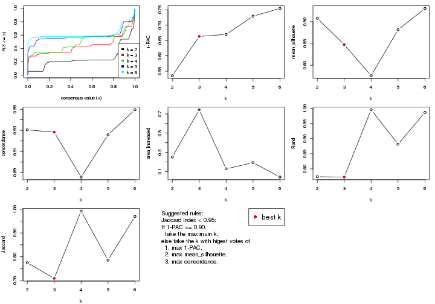

The numeric values for all these statistics can be obtained by `get_stats()`.

```r
get_stats(res)
```

```
#>   k 1-PAC mean_silhouette concordance area_increased  Rand Jaccard
#> 2 2 0.535           0.908       0.931         0.2521 0.774   0.774
#> 3 3 0.663           0.847       0.928         0.7440 0.773   0.708
#> 4 4 0.670           0.776       0.886         0.1281 0.996   0.992
#> 5 5 0.729           0.881       0.926         0.1924 0.882   0.785
#> 6 6 0.755           0.930       0.949         0.0423 0.987   0.970
```

`suggest_best_k()` suggests the best $k$ based on these statistics. The rules are as follows:

- All $k$ with Jaccard index larger than 0.95 are removed because increasing
  $k$ does not provide enough extra information. If all $k$ are removed, it is
  marked as no subgroup is detected.
- For all $k$ with 1-PAC score larger than 0.9, the maximal $k$ is taken as
  the best $k$, and other $k$ are marked as optional $k$.
- If it does not fit the second rule. The $k$ with the maximal vote of the
  highest 1-PAC score, highest mean silhouette, and highest concordance is
  taken as the best $k$.

```r
suggest_best_k(res)
```

```
#> [1] 3
```


Following shows the table of the partitions (You need to click the **show/hide
code output** link to see it). The membership matrix (columns with name `p*`)
is inferred by
[`clue::cl_consensus()`](https://www.rdocumentation.org/link/cl_consensus?package=clue)
function with the `SE` method. Basically the value in the membership matrix
represents the probability to belong to a certain group. The finall class
label for an item is determined with the group with highest probability it
belongs to.

In `get_classes()` function, the entropy is calculated from the membership
matrix and the silhouette score is calculated from the consensus matrix.


<script>
$( function() {
	$( '#tabs-CV-hclust-get-classes' ).tabs();
} );
</script>
<div id='tabs-CV-hclust-get-classes'>
<ul>
<li><a href='#tab-CV-hclust-get-classes-1'>k = 2</a></li>
<li><a href='#tab-CV-hclust-get-classes-2'>k = 3</a></li>
<li><a href='#tab-CV-hclust-get-classes-3'>k = 4</a></li>
<li><a href='#tab-CV-hclust-get-classes-4'>k = 5</a></li>
<li><a href='#tab-CV-hclust-get-classes-5'>k = 6</a></li>
</ul>

<div id='tab-CV-hclust-get-classes-1'>
<p><a id='tab-CV-hclust-get-classes-1-a' style='color:#0366d6' href='#'>show/hide code output</a></p>
<pre><code class="r">cbind(get_classes(res, k = 2), get_membership(res, k = 2))
</code></pre>

<pre><code>#&gt;           class entropy silhouette    p1    p2
#&gt; GSM614415     2  0.6048      0.858 0.148 0.852
#&gt; GSM614416     2  0.6048      0.858 0.148 0.852
#&gt; GSM614417     2  0.6048      0.858 0.148 0.852
#&gt; GSM614418     2  0.6048      0.858 0.148 0.852
#&gt; GSM614419     2  0.6048      0.858 0.148 0.852
#&gt; GSM614420     2  0.6048      0.858 0.148 0.852
#&gt; GSM614421     2  0.2043      0.922 0.032 0.968
#&gt; GSM614422     2  0.2043      0.922 0.032 0.968
#&gt; GSM614423     2  0.2043      0.922 0.032 0.968
#&gt; GSM614424     2  0.2043      0.922 0.032 0.968
#&gt; GSM614425     2  0.2043      0.922 0.032 0.968
#&gt; GSM614426     2  0.2043      0.922 0.032 0.968
#&gt; GSM614427     2  0.2043      0.922 0.032 0.968
#&gt; GSM614428     2  0.2043      0.922 0.032 0.968
#&gt; GSM614429     2  0.0672      0.936 0.008 0.992
#&gt; GSM614430     2  0.0672      0.936 0.008 0.992
#&gt; GSM614431     2  0.0672      0.936 0.008 0.992
#&gt; GSM614432     2  0.0672      0.936 0.008 0.992
#&gt; GSM614433     2  0.0672      0.936 0.008 0.992
#&gt; GSM614434     2  0.0672      0.936 0.008 0.992
#&gt; GSM614435     2  0.0672      0.936 0.008 0.992
#&gt; GSM614436     2  0.0672      0.936 0.008 0.992
#&gt; GSM614437     1  0.6048      0.952 0.852 0.148
#&gt; GSM614438     1  0.6048      0.952 0.852 0.148
#&gt; GSM614439     1  0.6048      0.952 0.852 0.148
#&gt; GSM614440     1  0.6048      0.952 0.852 0.148
#&gt; GSM614441     1  0.6048      0.952 0.852 0.148
#&gt; GSM614442     1  0.6048      0.952 0.852 0.148
#&gt; GSM614443     1  0.6048      0.952 0.852 0.148
#&gt; GSM614444     1  0.6048      0.952 0.852 0.148
#&gt; GSM614391     2  0.6048      0.858 0.148 0.852
#&gt; GSM614392     2  0.6048      0.858 0.148 0.852
#&gt; GSM614393     2  0.6048      0.858 0.148 0.852
#&gt; GSM614394     2  0.6048      0.858 0.148 0.852
#&gt; GSM614395     1  0.9795      0.177 0.584 0.416
#&gt; GSM614396     2  0.6048      0.858 0.148 0.852
#&gt; GSM614397     2  0.6148      0.855 0.152 0.848
#&gt; GSM614398     2  0.6048      0.858 0.148 0.852
#&gt; GSM614399     2  0.0000      0.936 0.000 1.000
#&gt; GSM614400     2  0.0000      0.936 0.000 1.000
#&gt; GSM614401     2  0.0000      0.936 0.000 1.000
#&gt; GSM614402     2  0.0000      0.936 0.000 1.000
#&gt; GSM614403     2  0.0000      0.936 0.000 1.000
#&gt; GSM614404     2  0.0000      0.936 0.000 1.000
#&gt; GSM614405     2  0.0000      0.936 0.000 1.000
#&gt; GSM614406     2  0.0000      0.936 0.000 1.000
#&gt; GSM614407     2  0.5842      0.864 0.140 0.860
#&gt; GSM614408     2  0.5842      0.864 0.140 0.860
#&gt; GSM614409     2  0.5842      0.864 0.140 0.860
#&gt; GSM614410     2  0.5842      0.864 0.140 0.860
#&gt; GSM614411     2  0.5842      0.864 0.140 0.860
#&gt; GSM614412     2  0.5842      0.864 0.140 0.860
#&gt; GSM614413     2  0.5842      0.864 0.140 0.860
#&gt; GSM614414     2  0.5842      0.864 0.140 0.860
#&gt; GSM614445     2  0.2603      0.913 0.044 0.956
#&gt; GSM614446     2  0.2603      0.913 0.044 0.956
#&gt; GSM614447     2  0.2603      0.913 0.044 0.956
#&gt; GSM614448     2  0.2603      0.913 0.044 0.956
#&gt; GSM614449     2  0.2603      0.913 0.044 0.956
#&gt; GSM614450     2  0.2603      0.913 0.044 0.956
#&gt; GSM614451     1  0.6048      0.952 0.852 0.148
#&gt; GSM614452     1  0.6048      0.952 0.852 0.148
#&gt; GSM614453     2  0.0938      0.935 0.012 0.988
#&gt; GSM614454     2  0.0938      0.935 0.012 0.988
#&gt; GSM614455     2  0.0938      0.935 0.012 0.988
#&gt; GSM614456     2  0.0938      0.935 0.012 0.988
#&gt; GSM614457     2  0.0938      0.935 0.012 0.988
#&gt; GSM614458     2  0.0938      0.935 0.012 0.988
#&gt; GSM614459     2  0.0938      0.935 0.012 0.988
#&gt; GSM614460     2  0.0938      0.935 0.012 0.988
#&gt; GSM614461     2  0.0672      0.936 0.008 0.992
#&gt; GSM614462     2  0.0672      0.936 0.008 0.992
#&gt; GSM614463     2  0.0672      0.936 0.008 0.992
#&gt; GSM614464     2  0.0672      0.936 0.008 0.992
#&gt; GSM614465     2  0.0672      0.936 0.008 0.992
#&gt; GSM614466     2  0.0672      0.936 0.008 0.992
#&gt; GSM614467     2  0.0672      0.936 0.008 0.992
#&gt; GSM614468     2  0.0672      0.936 0.008 0.992
#&gt; GSM614469     2  0.0672      0.937 0.008 0.992
#&gt; GSM614470     2  0.0672      0.937 0.008 0.992
#&gt; GSM614471     2  0.0672      0.937 0.008 0.992
#&gt; GSM614472     2  0.0672      0.937 0.008 0.992
#&gt; GSM614473     2  0.0672      0.937 0.008 0.992
#&gt; GSM614474     2  0.0672      0.937 0.008 0.992
#&gt; GSM614475     2  0.0672      0.937 0.008 0.992
#&gt; GSM614476     2  0.0672      0.937 0.008 0.992
</code></pre>

<script>
$('#tab-CV-hclust-get-classes-1-a').parent().next().next().hide();
$('#tab-CV-hclust-get-classes-1-a').click(function(){
  $('#tab-CV-hclust-get-classes-1-a').parent().next().next().toggle();
  return(false);
});
</script>
</div>

<div id='tab-CV-hclust-get-classes-2'>
<p><a id='tab-CV-hclust-get-classes-2-a' style='color:#0366d6' href='#'>show/hide code output</a></p>
<pre><code class="r">cbind(get_classes(res, k = 3), get_membership(res, k = 3))
</code></pre>

<pre><code>#&gt;           class entropy silhouette    p1    p2    p3
#&gt; GSM614415     1  0.6180     0.4959 0.584 0.416 0.000
#&gt; GSM614416     1  0.6180     0.4959 0.584 0.416 0.000
#&gt; GSM614417     1  0.6180     0.4959 0.584 0.416 0.000
#&gt; GSM614418     1  0.6180     0.4959 0.584 0.416 0.000
#&gt; GSM614419     1  0.6180     0.4959 0.584 0.416 0.000
#&gt; GSM614420     1  0.6180     0.4959 0.584 0.416 0.000
#&gt; GSM614421     2  0.2682     0.9003 0.004 0.920 0.076
#&gt; GSM614422     2  0.2682     0.9003 0.004 0.920 0.076
#&gt; GSM614423     2  0.2682     0.9003 0.004 0.920 0.076
#&gt; GSM614424     2  0.2682     0.9003 0.004 0.920 0.076
#&gt; GSM614425     2  0.2682     0.9003 0.004 0.920 0.076
#&gt; GSM614426     2  0.2682     0.9003 0.004 0.920 0.076
#&gt; GSM614427     2  0.2682     0.9003 0.004 0.920 0.076
#&gt; GSM614428     2  0.2682     0.9003 0.004 0.920 0.076
#&gt; GSM614429     2  0.0237     0.9371 0.004 0.996 0.000
#&gt; GSM614430     2  0.0237     0.9371 0.004 0.996 0.000
#&gt; GSM614431     2  0.0237     0.9371 0.004 0.996 0.000
#&gt; GSM614432     2  0.0237     0.9371 0.004 0.996 0.000
#&gt; GSM614433     2  0.0237     0.9371 0.004 0.996 0.000
#&gt; GSM614434     2  0.0237     0.9371 0.004 0.996 0.000
#&gt; GSM614435     2  0.0237     0.9371 0.004 0.996 0.000
#&gt; GSM614436     2  0.0237     0.9371 0.004 0.996 0.000
#&gt; GSM614437     3  0.0237     0.9985 0.000 0.004 0.996
#&gt; GSM614438     3  0.0237     0.9985 0.000 0.004 0.996
#&gt; GSM614439     3  0.0237     0.9985 0.000 0.004 0.996
#&gt; GSM614440     3  0.0237     0.9985 0.000 0.004 0.996
#&gt; GSM614441     3  0.0237     0.9985 0.000 0.004 0.996
#&gt; GSM614442     3  0.0237     0.9985 0.000 0.004 0.996
#&gt; GSM614443     3  0.0237     0.9985 0.000 0.004 0.996
#&gt; GSM614444     3  0.0237     0.9985 0.000 0.004 0.996
#&gt; GSM614391     1  0.0237     0.5944 0.996 0.004 0.000
#&gt; GSM614392     1  0.0237     0.5944 0.996 0.004 0.000
#&gt; GSM614393     1  0.0237     0.5944 0.996 0.004 0.000
#&gt; GSM614394     1  0.0237     0.5944 0.996 0.004 0.000
#&gt; GSM614395     1  0.6451    -0.0762 0.560 0.004 0.436
#&gt; GSM614396     1  0.0237     0.5944 0.996 0.004 0.000
#&gt; GSM614397     1  0.0475     0.5906 0.992 0.004 0.004
#&gt; GSM614398     1  0.0237     0.5944 0.996 0.004 0.000
#&gt; GSM614399     2  0.0237     0.9366 0.004 0.996 0.000
#&gt; GSM614400     2  0.0237     0.9366 0.004 0.996 0.000
#&gt; GSM614401     2  0.0237     0.9366 0.004 0.996 0.000
#&gt; GSM614402     2  0.0237     0.9366 0.004 0.996 0.000
#&gt; GSM614403     2  0.0237     0.9366 0.004 0.996 0.000
#&gt; GSM614404     2  0.0237     0.9366 0.004 0.996 0.000
#&gt; GSM614405     2  0.0237     0.9366 0.004 0.996 0.000
#&gt; GSM614406     2  0.0237     0.9366 0.004 0.996 0.000
#&gt; GSM614407     2  0.4682     0.7405 0.192 0.804 0.004
#&gt; GSM614408     2  0.4682     0.7405 0.192 0.804 0.004
#&gt; GSM614409     2  0.4682     0.7405 0.192 0.804 0.004
#&gt; GSM614410     2  0.4682     0.7405 0.192 0.804 0.004
#&gt; GSM614411     2  0.4682     0.7405 0.192 0.804 0.004
#&gt; GSM614412     2  0.4682     0.7405 0.192 0.804 0.004
#&gt; GSM614413     2  0.4682     0.7405 0.192 0.804 0.004
#&gt; GSM614414     2  0.4682     0.7405 0.192 0.804 0.004
#&gt; GSM614445     2  0.3193     0.8817 0.004 0.896 0.100
#&gt; GSM614446     2  0.3193     0.8817 0.004 0.896 0.100
#&gt; GSM614447     2  0.3193     0.8817 0.004 0.896 0.100
#&gt; GSM614448     2  0.3193     0.8817 0.004 0.896 0.100
#&gt; GSM614449     2  0.3193     0.8817 0.004 0.896 0.100
#&gt; GSM614450     2  0.3193     0.8817 0.004 0.896 0.100
#&gt; GSM614451     3  0.0424     0.9940 0.000 0.008 0.992
#&gt; GSM614452     3  0.0424     0.9940 0.000 0.008 0.992
#&gt; GSM614453     2  0.0475     0.9364 0.004 0.992 0.004
#&gt; GSM614454     2  0.0475     0.9364 0.004 0.992 0.004
#&gt; GSM614455     2  0.0475     0.9364 0.004 0.992 0.004
#&gt; GSM614456     2  0.0475     0.9364 0.004 0.992 0.004
#&gt; GSM614457     2  0.0475     0.9364 0.004 0.992 0.004
#&gt; GSM614458     2  0.0475     0.9364 0.004 0.992 0.004
#&gt; GSM614459     2  0.0475     0.9364 0.004 0.992 0.004
#&gt; GSM614460     2  0.0475     0.9364 0.004 0.992 0.004
#&gt; GSM614461     2  0.0237     0.9371 0.004 0.996 0.000
#&gt; GSM614462     2  0.0237     0.9371 0.004 0.996 0.000
#&gt; GSM614463     2  0.0237     0.9371 0.004 0.996 0.000
#&gt; GSM614464     2  0.0237     0.9371 0.004 0.996 0.000
#&gt; GSM614465     2  0.0237     0.9371 0.004 0.996 0.000
#&gt; GSM614466     2  0.0237     0.9371 0.004 0.996 0.000
#&gt; GSM614467     2  0.0237     0.9371 0.004 0.996 0.000
#&gt; GSM614468     2  0.0237     0.9371 0.004 0.996 0.000
#&gt; GSM614469     2  0.0892     0.9316 0.020 0.980 0.000
#&gt; GSM614470     2  0.0892     0.9316 0.020 0.980 0.000
#&gt; GSM614471     2  0.0892     0.9316 0.020 0.980 0.000
#&gt; GSM614472     2  0.0892     0.9316 0.020 0.980 0.000
#&gt; GSM614473     2  0.0892     0.9316 0.020 0.980 0.000
#&gt; GSM614474     2  0.0892     0.9316 0.020 0.980 0.000
#&gt; GSM614475     2  0.0892     0.9316 0.020 0.980 0.000
#&gt; GSM614476     2  0.0892     0.9316 0.020 0.980 0.000
</code></pre>

<script>
$('#tab-CV-hclust-get-classes-2-a').parent().next().next().hide();
$('#tab-CV-hclust-get-classes-2-a').click(function(){
  $('#tab-CV-hclust-get-classes-2-a').parent().next().next().toggle();
  return(false);
});
</script>
</div>

<div id='tab-CV-hclust-get-classes-3'>
<p><a id='tab-CV-hclust-get-classes-3-a' style='color:#0366d6' href='#'>show/hide code output</a></p>
<pre><code class="r">cbind(get_classes(res, k = 4), get_membership(res, k = 4))
</code></pre>

<pre><code>#&gt;           class entropy silhouette    p1    p2    p3    p4
#&gt; GSM614415     1  0.6536     0.5606 0.580 0.324 0.096 0.000
#&gt; GSM614416     1  0.6536     0.5606 0.580 0.324 0.096 0.000
#&gt; GSM614417     1  0.6536     0.5606 0.580 0.324 0.096 0.000
#&gt; GSM614418     1  0.6536     0.5606 0.580 0.324 0.096 0.000
#&gt; GSM614419     1  0.6536     0.5606 0.580 0.324 0.096 0.000
#&gt; GSM614420     1  0.6536     0.5606 0.580 0.324 0.096 0.000
#&gt; GSM614421     2  0.2586     0.8587 0.000 0.912 0.040 0.048
#&gt; GSM614422     2  0.2586     0.8587 0.000 0.912 0.040 0.048
#&gt; GSM614423     2  0.2586     0.8587 0.000 0.912 0.040 0.048
#&gt; GSM614424     2  0.2586     0.8587 0.000 0.912 0.040 0.048
#&gt; GSM614425     2  0.2586     0.8587 0.000 0.912 0.040 0.048
#&gt; GSM614426     2  0.2586     0.8587 0.000 0.912 0.040 0.048
#&gt; GSM614427     2  0.2586     0.8587 0.000 0.912 0.040 0.048
#&gt; GSM614428     2  0.2586     0.8587 0.000 0.912 0.040 0.048
#&gt; GSM614429     2  0.0188     0.8921 0.000 0.996 0.004 0.000
#&gt; GSM614430     2  0.0188     0.8921 0.000 0.996 0.004 0.000
#&gt; GSM614431     2  0.0188     0.8921 0.000 0.996 0.004 0.000
#&gt; GSM614432     2  0.0188     0.8921 0.000 0.996 0.004 0.000
#&gt; GSM614433     2  0.0188     0.8921 0.000 0.996 0.004 0.000
#&gt; GSM614434     2  0.0188     0.8921 0.000 0.996 0.004 0.000
#&gt; GSM614435     2  0.0188     0.8921 0.000 0.996 0.004 0.000
#&gt; GSM614436     2  0.0188     0.8921 0.000 0.996 0.004 0.000
#&gt; GSM614437     4  0.0000     1.0000 0.000 0.000 0.000 1.000
#&gt; GSM614438     4  0.0000     1.0000 0.000 0.000 0.000 1.000
#&gt; GSM614439     4  0.0000     1.0000 0.000 0.000 0.000 1.000
#&gt; GSM614440     4  0.0000     1.0000 0.000 0.000 0.000 1.000
#&gt; GSM614441     4  0.0000     1.0000 0.000 0.000 0.000 1.000
#&gt; GSM614442     4  0.0000     1.0000 0.000 0.000 0.000 1.000
#&gt; GSM614443     4  0.0000     1.0000 0.000 0.000 0.000 1.000
#&gt; GSM614444     4  0.0000     1.0000 0.000 0.000 0.000 1.000
#&gt; GSM614391     1  0.0000     0.5727 1.000 0.000 0.000 0.000
#&gt; GSM614392     1  0.0000     0.5727 1.000 0.000 0.000 0.000
#&gt; GSM614393     1  0.0000     0.5727 1.000 0.000 0.000 0.000
#&gt; GSM614394     1  0.0000     0.5727 1.000 0.000 0.000 0.000
#&gt; GSM614395     1  0.4941     0.0455 0.564 0.000 0.436 0.000
#&gt; GSM614396     1  0.0000     0.5727 1.000 0.000 0.000 0.000
#&gt; GSM614397     1  0.0188     0.5688 0.996 0.000 0.004 0.000
#&gt; GSM614398     1  0.0000     0.5727 1.000 0.000 0.000 0.000
#&gt; GSM614399     2  0.0188     0.8916 0.000 0.996 0.004 0.000
#&gt; GSM614400     2  0.0188     0.8916 0.000 0.996 0.004 0.000
#&gt; GSM614401     2  0.0188     0.8916 0.000 0.996 0.004 0.000
#&gt; GSM614402     2  0.0188     0.8916 0.000 0.996 0.004 0.000
#&gt; GSM614403     2  0.0188     0.8916 0.000 0.996 0.004 0.000
#&gt; GSM614404     2  0.0188     0.8916 0.000 0.996 0.004 0.000
#&gt; GSM614405     2  0.0188     0.8916 0.000 0.996 0.004 0.000
#&gt; GSM614406     2  0.0188     0.8916 0.000 0.996 0.004 0.000
#&gt; GSM614407     2  0.6204     0.2330 0.052 0.500 0.448 0.000
#&gt; GSM614408     2  0.6204     0.2330 0.052 0.500 0.448 0.000
#&gt; GSM614409     2  0.6204     0.2330 0.052 0.500 0.448 0.000
#&gt; GSM614410     2  0.6204     0.2330 0.052 0.500 0.448 0.000
#&gt; GSM614411     2  0.6204     0.2330 0.052 0.500 0.448 0.000
#&gt; GSM614412     2  0.6204     0.2330 0.052 0.500 0.448 0.000
#&gt; GSM614413     2  0.6204     0.2330 0.052 0.500 0.448 0.000
#&gt; GSM614414     2  0.6204     0.2330 0.052 0.500 0.448 0.000
#&gt; GSM614445     2  0.3004     0.8442 0.000 0.892 0.048 0.060
#&gt; GSM614446     2  0.3004     0.8442 0.000 0.892 0.048 0.060
#&gt; GSM614447     2  0.3004     0.8442 0.000 0.892 0.048 0.060
#&gt; GSM614448     2  0.3004     0.8442 0.000 0.892 0.048 0.060
#&gt; GSM614449     2  0.3004     0.8442 0.000 0.892 0.048 0.060
#&gt; GSM614450     2  0.3004     0.8442 0.000 0.892 0.048 0.060
#&gt; GSM614451     3  0.5132     1.0000 0.000 0.004 0.548 0.448
#&gt; GSM614452     3  0.5132     1.0000 0.000 0.004 0.548 0.448
#&gt; GSM614453     2  0.0376     0.8913 0.000 0.992 0.004 0.004
#&gt; GSM614454     2  0.0376     0.8913 0.000 0.992 0.004 0.004
#&gt; GSM614455     2  0.0376     0.8913 0.000 0.992 0.004 0.004
#&gt; GSM614456     2  0.0376     0.8913 0.000 0.992 0.004 0.004
#&gt; GSM614457     2  0.0376     0.8913 0.000 0.992 0.004 0.004
#&gt; GSM614458     2  0.0376     0.8913 0.000 0.992 0.004 0.004
#&gt; GSM614459     2  0.0376     0.8913 0.000 0.992 0.004 0.004
#&gt; GSM614460     2  0.0376     0.8913 0.000 0.992 0.004 0.004
#&gt; GSM614461     2  0.0188     0.8921 0.000 0.996 0.004 0.000
#&gt; GSM614462     2  0.0188     0.8921 0.000 0.996 0.004 0.000
#&gt; GSM614463     2  0.0188     0.8921 0.000 0.996 0.004 0.000
#&gt; GSM614464     2  0.0188     0.8921 0.000 0.996 0.004 0.000
#&gt; GSM614465     2  0.0188     0.8921 0.000 0.996 0.004 0.000
#&gt; GSM614466     2  0.0188     0.8921 0.000 0.996 0.004 0.000
#&gt; GSM614467     2  0.0188     0.8921 0.000 0.996 0.004 0.000
#&gt; GSM614468     2  0.0188     0.8921 0.000 0.996 0.004 0.000
#&gt; GSM614469     2  0.1624     0.8728 0.020 0.952 0.028 0.000
#&gt; GSM614470     2  0.1624     0.8728 0.020 0.952 0.028 0.000
#&gt; GSM614471     2  0.1624     0.8728 0.020 0.952 0.028 0.000
#&gt; GSM614472     2  0.1624     0.8728 0.020 0.952 0.028 0.000
#&gt; GSM614473     2  0.1624     0.8728 0.020 0.952 0.028 0.000
#&gt; GSM614474     2  0.1624     0.8728 0.020 0.952 0.028 0.000
#&gt; GSM614475     2  0.1624     0.8728 0.020 0.952 0.028 0.000
#&gt; GSM614476     2  0.1624     0.8728 0.020 0.952 0.028 0.000
</code></pre>

<script>
$('#tab-CV-hclust-get-classes-3-a').parent().next().next().hide();
$('#tab-CV-hclust-get-classes-3-a').click(function(){
  $('#tab-CV-hclust-get-classes-3-a').parent().next().next().toggle();
  return(false);
});
</script>
</div>

<div id='tab-CV-hclust-get-classes-4'>
<p><a id='tab-CV-hclust-get-classes-4-a' style='color:#0366d6' href='#'>show/hide code output</a></p>
<pre><code class="r">cbind(get_classes(res, k = 5), get_membership(res, k = 5))
</code></pre>

<pre><code>#&gt;           class entropy silhouette    p1    p2    p3    p4    p5
#&gt; GSM614415     5  0.6545     0.5331 0.360 0.068 0.056 0.000 0.516
#&gt; GSM614416     5  0.6545     0.5331 0.360 0.068 0.056 0.000 0.516
#&gt; GSM614417     5  0.6545     0.5331 0.360 0.068 0.056 0.000 0.516
#&gt; GSM614418     5  0.6545     0.5331 0.360 0.068 0.056 0.000 0.516
#&gt; GSM614419     5  0.6545     0.5331 0.360 0.068 0.056 0.000 0.516
#&gt; GSM614420     5  0.6545     0.5331 0.360 0.068 0.056 0.000 0.516
#&gt; GSM614421     2  0.2293     0.9073 0.016 0.900 0.084 0.000 0.000
#&gt; GSM614422     2  0.2293     0.9073 0.016 0.900 0.084 0.000 0.000
#&gt; GSM614423     2  0.2293     0.9073 0.016 0.900 0.084 0.000 0.000
#&gt; GSM614424     2  0.2293     0.9073 0.016 0.900 0.084 0.000 0.000
#&gt; GSM614425     2  0.2293     0.9073 0.016 0.900 0.084 0.000 0.000
#&gt; GSM614426     2  0.2293     0.9073 0.016 0.900 0.084 0.000 0.000
#&gt; GSM614427     2  0.2293     0.9073 0.016 0.900 0.084 0.000 0.000
#&gt; GSM614428     2  0.2293     0.9073 0.016 0.900 0.084 0.000 0.000
#&gt; GSM614429     2  0.0290     0.9459 0.000 0.992 0.008 0.000 0.000
#&gt; GSM614430     2  0.0290     0.9459 0.000 0.992 0.008 0.000 0.000
#&gt; GSM614431     2  0.0290     0.9459 0.000 0.992 0.008 0.000 0.000
#&gt; GSM614432     2  0.0290     0.9459 0.000 0.992 0.008 0.000 0.000
#&gt; GSM614433     2  0.0290     0.9459 0.000 0.992 0.008 0.000 0.000
#&gt; GSM614434     2  0.0290     0.9459 0.000 0.992 0.008 0.000 0.000
#&gt; GSM614435     2  0.0290     0.9459 0.000 0.992 0.008 0.000 0.000
#&gt; GSM614436     2  0.0290     0.9459 0.000 0.992 0.008 0.000 0.000
#&gt; GSM614437     4  0.0000     1.0000 0.000 0.000 0.000 1.000 0.000
#&gt; GSM614438     4  0.0000     1.0000 0.000 0.000 0.000 1.000 0.000
#&gt; GSM614439     4  0.0000     1.0000 0.000 0.000 0.000 1.000 0.000
#&gt; GSM614440     4  0.0000     1.0000 0.000 0.000 0.000 1.000 0.000
#&gt; GSM614441     4  0.0000     1.0000 0.000 0.000 0.000 1.000 0.000
#&gt; GSM614442     4  0.0000     1.0000 0.000 0.000 0.000 1.000 0.000
#&gt; GSM614443     4  0.0000     1.0000 0.000 0.000 0.000 1.000 0.000
#&gt; GSM614444     4  0.0000     1.0000 0.000 0.000 0.000 1.000 0.000
#&gt; GSM614391     5  0.0000     0.6653 0.000 0.000 0.000 0.000 1.000
#&gt; GSM614392     5  0.0000     0.6653 0.000 0.000 0.000 0.000 1.000
#&gt; GSM614393     5  0.0000     0.6653 0.000 0.000 0.000 0.000 1.000
#&gt; GSM614394     5  0.0000     0.6653 0.000 0.000 0.000 0.000 1.000
#&gt; GSM614395     5  0.4256     0.0914 0.000 0.000 0.436 0.000 0.564
#&gt; GSM614396     5  0.0000     0.6653 0.000 0.000 0.000 0.000 1.000
#&gt; GSM614397     5  0.0162     0.6623 0.000 0.000 0.004 0.000 0.996
#&gt; GSM614398     5  0.0000     0.6653 0.000 0.000 0.000 0.000 1.000
#&gt; GSM614399     2  0.0404     0.9441 0.000 0.988 0.012 0.000 0.000
#&gt; GSM614400     2  0.0404     0.9441 0.000 0.988 0.012 0.000 0.000
#&gt; GSM614401     2  0.0404     0.9441 0.000 0.988 0.012 0.000 0.000
#&gt; GSM614402     2  0.0404     0.9441 0.000 0.988 0.012 0.000 0.000
#&gt; GSM614403     2  0.0404     0.9441 0.000 0.988 0.012 0.000 0.000
#&gt; GSM614404     2  0.0404     0.9441 0.000 0.988 0.012 0.000 0.000
#&gt; GSM614405     2  0.0404     0.9441 0.000 0.988 0.012 0.000 0.000
#&gt; GSM614406     2  0.0404     0.9441 0.000 0.988 0.012 0.000 0.000
#&gt; GSM614407     1  0.0162     1.0000 0.996 0.004 0.000 0.000 0.000
#&gt; GSM614408     1  0.0162     1.0000 0.996 0.004 0.000 0.000 0.000
#&gt; GSM614409     1  0.0162     1.0000 0.996 0.004 0.000 0.000 0.000
#&gt; GSM614410     1  0.0162     1.0000 0.996 0.004 0.000 0.000 0.000
#&gt; GSM614411     1  0.0162     1.0000 0.996 0.004 0.000 0.000 0.000
#&gt; GSM614412     1  0.0162     1.0000 0.996 0.004 0.000 0.000 0.000
#&gt; GSM614413     1  0.0162     1.0000 0.996 0.004 0.000 0.000 0.000
#&gt; GSM614414     1  0.0162     1.0000 0.996 0.004 0.000 0.000 0.000
#&gt; GSM614445     2  0.2513     0.8912 0.008 0.876 0.116 0.000 0.000
#&gt; GSM614446     2  0.2513     0.8912 0.008 0.876 0.116 0.000 0.000
#&gt; GSM614447     2  0.2513     0.8912 0.008 0.876 0.116 0.000 0.000
#&gt; GSM614448     2  0.2513     0.8912 0.008 0.876 0.116 0.000 0.000
#&gt; GSM614449     2  0.2513     0.8912 0.008 0.876 0.116 0.000 0.000
#&gt; GSM614450     2  0.2513     0.8912 0.008 0.876 0.116 0.000 0.000
#&gt; GSM614451     3  0.1671     1.0000 0.000 0.000 0.924 0.076 0.000
#&gt; GSM614452     3  0.1671     1.0000 0.000 0.000 0.924 0.076 0.000
#&gt; GSM614453     2  0.0566     0.9450 0.000 0.984 0.012 0.004 0.000
#&gt; GSM614454     2  0.0566     0.9450 0.000 0.984 0.012 0.004 0.000
#&gt; GSM614455     2  0.0566     0.9450 0.000 0.984 0.012 0.004 0.000
#&gt; GSM614456     2  0.0566     0.9450 0.000 0.984 0.012 0.004 0.000
#&gt; GSM614457     2  0.0566     0.9450 0.000 0.984 0.012 0.004 0.000
#&gt; GSM614458     2  0.0566     0.9450 0.000 0.984 0.012 0.004 0.000
#&gt; GSM614459     2  0.0566     0.9450 0.000 0.984 0.012 0.004 0.000
#&gt; GSM614460     2  0.0566     0.9450 0.000 0.984 0.012 0.004 0.000
#&gt; GSM614461     2  0.0404     0.9456 0.000 0.988 0.012 0.000 0.000
#&gt; GSM614462     2  0.0404     0.9456 0.000 0.988 0.012 0.000 0.000
#&gt; GSM614463     2  0.0404     0.9456 0.000 0.988 0.012 0.000 0.000
#&gt; GSM614464     2  0.0404     0.9456 0.000 0.988 0.012 0.000 0.000
#&gt; GSM614465     2  0.0404     0.9456 0.000 0.988 0.012 0.000 0.000
#&gt; GSM614466     2  0.0404     0.9456 0.000 0.988 0.012 0.000 0.000
#&gt; GSM614467     2  0.0404     0.9456 0.000 0.988 0.012 0.000 0.000
#&gt; GSM614468     2  0.0404     0.9456 0.000 0.988 0.012 0.000 0.000
#&gt; GSM614469     2  0.2747     0.8746 0.088 0.884 0.012 0.000 0.016
#&gt; GSM614470     2  0.2747     0.8746 0.088 0.884 0.012 0.000 0.016
#&gt; GSM614471     2  0.2747     0.8746 0.088 0.884 0.012 0.000 0.016
#&gt; GSM614472     2  0.2747     0.8746 0.088 0.884 0.012 0.000 0.016
#&gt; GSM614473     2  0.2747     0.8746 0.088 0.884 0.012 0.000 0.016
#&gt; GSM614474     2  0.2747     0.8746 0.088 0.884 0.012 0.000 0.016
#&gt; GSM614475     2  0.2747     0.8746 0.088 0.884 0.012 0.000 0.016
#&gt; GSM614476     2  0.2747     0.8746 0.088 0.884 0.012 0.000 0.016
</code></pre>

<script>
$('#tab-CV-hclust-get-classes-4-a').parent().next().next().hide();
$('#tab-CV-hclust-get-classes-4-a').click(function(){
  $('#tab-CV-hclust-get-classes-4-a').parent().next().next().toggle();
  return(false);
});
</script>
</div>

<div id='tab-CV-hclust-get-classes-5'>
<p><a id='tab-CV-hclust-get-classes-5-a' style='color:#0366d6' href='#'>show/hide code output</a></p>
<pre><code class="r">cbind(get_classes(res, k = 6), get_membership(res, k = 6))
</code></pre>

<pre><code>#&gt;           class entropy silhouette    p1    p2    p3    p4    p5    p6
#&gt; GSM614415     1  0.0790      1.000 0.968 0.000 0.000 0.000 0.032 0.000
#&gt; GSM614416     1  0.0790      1.000 0.968 0.000 0.000 0.000 0.032 0.000
#&gt; GSM614417     1  0.0790      1.000 0.968 0.000 0.000 0.000 0.032 0.000
#&gt; GSM614418     1  0.0790      1.000 0.968 0.000 0.000 0.000 0.032 0.000
#&gt; GSM614419     1  0.0790      1.000 0.968 0.000 0.000 0.000 0.032 0.000
#&gt; GSM614420     1  0.0790      1.000 0.968 0.000 0.000 0.000 0.032 0.000
#&gt; GSM614421     2  0.2527      0.894 0.032 0.880 0.084 0.000 0.000 0.004
#&gt; GSM614422     2  0.2527      0.894 0.032 0.880 0.084 0.000 0.000 0.004
#&gt; GSM614423     2  0.2527      0.894 0.032 0.880 0.084 0.000 0.000 0.004
#&gt; GSM614424     2  0.2527      0.894 0.032 0.880 0.084 0.000 0.000 0.004
#&gt; GSM614425     2  0.2527      0.894 0.032 0.880 0.084 0.000 0.000 0.004
#&gt; GSM614426     2  0.2527      0.894 0.032 0.880 0.084 0.000 0.000 0.004
#&gt; GSM614427     2  0.2527      0.894 0.032 0.880 0.084 0.000 0.000 0.004
#&gt; GSM614428     2  0.2527      0.894 0.032 0.880 0.084 0.000 0.000 0.004
#&gt; GSM614429     2  0.0291      0.936 0.004 0.992 0.004 0.000 0.000 0.000
#&gt; GSM614430     2  0.0291      0.936 0.004 0.992 0.004 0.000 0.000 0.000
#&gt; GSM614431     2  0.0291      0.936 0.004 0.992 0.004 0.000 0.000 0.000
#&gt; GSM614432     2  0.0291      0.936 0.004 0.992 0.004 0.000 0.000 0.000
#&gt; GSM614433     2  0.0291      0.936 0.004 0.992 0.004 0.000 0.000 0.000
#&gt; GSM614434     2  0.0291      0.936 0.004 0.992 0.004 0.000 0.000 0.000
#&gt; GSM614435     2  0.0291      0.936 0.004 0.992 0.004 0.000 0.000 0.000
#&gt; GSM614436     2  0.0291      0.936 0.004 0.992 0.004 0.000 0.000 0.000
#&gt; GSM614437     4  0.0000      1.000 0.000 0.000 0.000 1.000 0.000 0.000
#&gt; GSM614438     4  0.0000      1.000 0.000 0.000 0.000 1.000 0.000 0.000
#&gt; GSM614439     4  0.0000      1.000 0.000 0.000 0.000 1.000 0.000 0.000
#&gt; GSM614440     4  0.0000      1.000 0.000 0.000 0.000 1.000 0.000 0.000
#&gt; GSM614441     4  0.0000      1.000 0.000 0.000 0.000 1.000 0.000 0.000
#&gt; GSM614442     4  0.0000      1.000 0.000 0.000 0.000 1.000 0.000 0.000
#&gt; GSM614443     4  0.0000      1.000 0.000 0.000 0.000 1.000 0.000 0.000
#&gt; GSM614444     4  0.0000      1.000 0.000 0.000 0.000 1.000 0.000 0.000
#&gt; GSM614391     5  0.0000      0.934 0.000 0.000 0.000 0.000 1.000 0.000
#&gt; GSM614392     5  0.0000      0.934 0.000 0.000 0.000 0.000 1.000 0.000
#&gt; GSM614393     5  0.0000      0.934 0.000 0.000 0.000 0.000 1.000 0.000
#&gt; GSM614394     5  0.0000      0.934 0.000 0.000 0.000 0.000 1.000 0.000
#&gt; GSM614395     5  0.3823      0.244 0.000 0.000 0.436 0.000 0.564 0.000
#&gt; GSM614396     5  0.0000      0.934 0.000 0.000 0.000 0.000 1.000 0.000
#&gt; GSM614397     5  0.0146      0.931 0.000 0.000 0.004 0.000 0.996 0.000
#&gt; GSM614398     5  0.0000      0.934 0.000 0.000 0.000 0.000 1.000 0.000
#&gt; GSM614399     2  0.0972      0.931 0.028 0.964 0.008 0.000 0.000 0.000
#&gt; GSM614400     2  0.0972      0.931 0.028 0.964 0.008 0.000 0.000 0.000
#&gt; GSM614401     2  0.0972      0.931 0.028 0.964 0.008 0.000 0.000 0.000
#&gt; GSM614402     2  0.0972      0.931 0.028 0.964 0.008 0.000 0.000 0.000
#&gt; GSM614403     2  0.0972      0.931 0.028 0.964 0.008 0.000 0.000 0.000
#&gt; GSM614404     2  0.0972      0.931 0.028 0.964 0.008 0.000 0.000 0.000
#&gt; GSM614405     2  0.0972      0.931 0.028 0.964 0.008 0.000 0.000 0.000
#&gt; GSM614406     2  0.0972      0.931 0.028 0.964 0.008 0.000 0.000 0.000
#&gt; GSM614407     6  0.0000      1.000 0.000 0.000 0.000 0.000 0.000 1.000
#&gt; GSM614408     6  0.0000      1.000 0.000 0.000 0.000 0.000 0.000 1.000
#&gt; GSM614409     6  0.0000      1.000 0.000 0.000 0.000 0.000 0.000 1.000
#&gt; GSM614410     6  0.0000      1.000 0.000 0.000 0.000 0.000 0.000 1.000
#&gt; GSM614411     6  0.0000      1.000 0.000 0.000 0.000 0.000 0.000 1.000
#&gt; GSM614412     6  0.0000      1.000 0.000 0.000 0.000 0.000 0.000 1.000
#&gt; GSM614413     6  0.0000      1.000 0.000 0.000 0.000 0.000 0.000 1.000
#&gt; GSM614414     6  0.0000      1.000 0.000 0.000 0.000 0.000 0.000 1.000
#&gt; GSM614445     2  0.2867      0.873 0.040 0.848 0.112 0.000 0.000 0.000
#&gt; GSM614446     2  0.2867      0.873 0.040 0.848 0.112 0.000 0.000 0.000
#&gt; GSM614447     2  0.2867      0.873 0.040 0.848 0.112 0.000 0.000 0.000
#&gt; GSM614448     2  0.2867      0.873 0.040 0.848 0.112 0.000 0.000 0.000
#&gt; GSM614449     2  0.2867      0.873 0.040 0.848 0.112 0.000 0.000 0.000
#&gt; GSM614450     2  0.2867      0.873 0.040 0.848 0.112 0.000 0.000 0.000
#&gt; GSM614451     3  0.0458      1.000 0.000 0.000 0.984 0.016 0.000 0.000
#&gt; GSM614452     3  0.0458      1.000 0.000 0.000 0.984 0.016 0.000 0.000
#&gt; GSM614453     2  0.0665      0.935 0.008 0.980 0.008 0.004 0.000 0.000
#&gt; GSM614454     2  0.0665      0.935 0.008 0.980 0.008 0.004 0.000 0.000
#&gt; GSM614455     2  0.0665      0.935 0.008 0.980 0.008 0.004 0.000 0.000
#&gt; GSM614456     2  0.0665      0.935 0.008 0.980 0.008 0.004 0.000 0.000
#&gt; GSM614457     2  0.0665      0.935 0.008 0.980 0.008 0.004 0.000 0.000
#&gt; GSM614458     2  0.0665      0.935 0.008 0.980 0.008 0.004 0.000 0.000
#&gt; GSM614459     2  0.0665      0.935 0.008 0.980 0.008 0.004 0.000 0.000
#&gt; GSM614460     2  0.0665      0.935 0.008 0.980 0.008 0.004 0.000 0.000
#&gt; GSM614461     2  0.0520      0.935 0.008 0.984 0.008 0.000 0.000 0.000
#&gt; GSM614462     2  0.0520      0.935 0.008 0.984 0.008 0.000 0.000 0.000
#&gt; GSM614463     2  0.0520      0.935 0.008 0.984 0.008 0.000 0.000 0.000
#&gt; GSM614464     2  0.0520      0.935 0.008 0.984 0.008 0.000 0.000 0.000
#&gt; GSM614465     2  0.0520      0.935 0.008 0.984 0.008 0.000 0.000 0.000
#&gt; GSM614466     2  0.0520      0.935 0.008 0.984 0.008 0.000 0.000 0.000
#&gt; GSM614467     2  0.0520      0.935 0.008 0.984 0.008 0.000 0.000 0.000
#&gt; GSM614468     2  0.0520      0.935 0.008 0.984 0.008 0.000 0.000 0.000
#&gt; GSM614469     2  0.2234      0.869 0.124 0.872 0.004 0.000 0.000 0.000
#&gt; GSM614470     2  0.2234      0.869 0.124 0.872 0.004 0.000 0.000 0.000
#&gt; GSM614471     2  0.2234      0.869 0.124 0.872 0.004 0.000 0.000 0.000
#&gt; GSM614472     2  0.2234      0.869 0.124 0.872 0.004 0.000 0.000 0.000
#&gt; GSM614473     2  0.2234      0.869 0.124 0.872 0.004 0.000 0.000 0.000
#&gt; GSM614474     2  0.2234      0.869 0.124 0.872 0.004 0.000 0.000 0.000
#&gt; GSM614475     2  0.2234      0.869 0.124 0.872 0.004 0.000 0.000 0.000
#&gt; GSM614476     2  0.2234      0.869 0.124 0.872 0.004 0.000 0.000 0.000
</code></pre>

<script>
$('#tab-CV-hclust-get-classes-5-a').parent().next().next().hide();
$('#tab-CV-hclust-get-classes-5-a').click(function(){
  $('#tab-CV-hclust-get-classes-5-a').parent().next().next().toggle();
  return(false);
});
</script>
</div>
</div>

Heatmaps for the consensus matrix. It visualizes the probability of two
samples to be in a same group.


<script>
$( function() {
	$( '#tabs-CV-hclust-consensus-heatmap' ).tabs();
} );
</script>
<div id='tabs-CV-hclust-consensus-heatmap'>
<ul>
<li><a href='#tab-CV-hclust-consensus-heatmap-1'>k = 2</a></li>
<li><a href='#tab-CV-hclust-consensus-heatmap-2'>k = 3</a></li>
<li><a href='#tab-CV-hclust-consensus-heatmap-3'>k = 4</a></li>
<li><a href='#tab-CV-hclust-consensus-heatmap-4'>k = 5</a></li>
<li><a href='#tab-CV-hclust-consensus-heatmap-5'>k = 6</a></li>
</ul>
<div id='tab-CV-hclust-consensus-heatmap-1'>
<pre><code class="r">consensus_heatmap(res, k = 2)
</code></pre>

<p></p>

</div>
<div id='tab-CV-hclust-consensus-heatmap-2'>
<pre><code class="r">consensus_heatmap(res, k = 3)
</code></pre>

<p></p>

</div>
<div id='tab-CV-hclust-consensus-heatmap-3'>
<pre><code class="r">consensus_heatmap(res, k = 4)
</code></pre>

<p></p>

</div>
<div id='tab-CV-hclust-consensus-heatmap-4'>
<pre><code class="r">consensus_heatmap(res, k = 5)
</code></pre>

<p></p>

</div>
<div id='tab-CV-hclust-consensus-heatmap-5'>
<pre><code class="r">consensus_heatmap(res, k = 6)
</code></pre>

<p></p>

</div>
</div>

Heatmaps for the membership of samples in all partitions to see how consistent they are:


<script>
$( function() {
	$( '#tabs-CV-hclust-membership-heatmap' ).tabs();
} );
</script>
<div id='tabs-CV-hclust-membership-heatmap'>
<ul>
<li><a href='#tab-CV-hclust-membership-heatmap-1'>k = 2</a></li>
<li><a href='#tab-CV-hclust-membership-heatmap-2'>k = 3</a></li>
<li><a href='#tab-CV-hclust-membership-heatmap-3'>k = 4</a></li>
<li><a href='#tab-CV-hclust-membership-heatmap-4'>k = 5</a></li>
<li><a href='#tab-CV-hclust-membership-heatmap-5'>k = 6</a></li>
</ul>
<div id='tab-CV-hclust-membership-heatmap-1'>
<pre><code class="r">membership_heatmap(res, k = 2)
</code></pre>

<p></p>

</div>
<div id='tab-CV-hclust-membership-heatmap-2'>
<pre><code class="r">membership_heatmap(res, k = 3)
</code></pre>

<p></p>

</div>
<div id='tab-CV-hclust-membership-heatmap-3'>
<pre><code class="r">membership_heatmap(res, k = 4)
</code></pre>

<p></p>

</div>
<div id='tab-CV-hclust-membership-heatmap-4'>
<pre><code class="r">membership_heatmap(res, k = 5)
</code></pre>

<p></p>

</div>
<div id='tab-CV-hclust-membership-heatmap-5'>
<pre><code class="r">membership_heatmap(res, k = 6)
</code></pre>

<p></p>

</div>
</div>

As soon as we have had the classes for columns, we can look for signatures
which are significantly different between classes which can be candidate marks
for certain classes. Following are the heatmaps for signatures.


Signature heatmaps where rows are scaled:


<script>
$( function() {
	$( '#tabs-CV-hclust-get-signatures' ).tabs();
} );
</script>
<div id='tabs-CV-hclust-get-signatures'>
<ul>
<li><a href='#tab-CV-hclust-get-signatures-1'>k = 2</a></li>
<li><a href='#tab-CV-hclust-get-signatures-2'>k = 3</a></li>
<li><a href='#tab-CV-hclust-get-signatures-3'>k = 4</a></li>
<li><a href='#tab-CV-hclust-get-signatures-4'>k = 5</a></li>
<li><a href='#tab-CV-hclust-get-signatures-5'>k = 6</a></li>
</ul>
<div id='tab-CV-hclust-get-signatures-1'>
<pre><code class="r">get_signatures(res, k = 2)
</code></pre>

<p></p>

</div>
<div id='tab-CV-hclust-get-signatures-2'>
<pre><code class="r">get_signatures(res, k = 3)
</code></pre>

<p>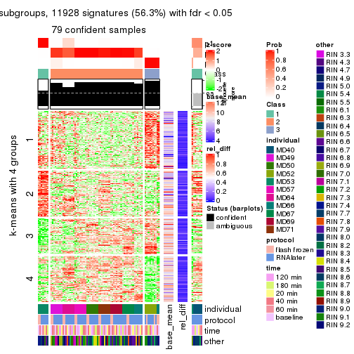</p>

</div>
<div id='tab-CV-hclust-get-signatures-3'>
<pre><code class="r">get_signatures(res, k = 4)
</code></pre>

<p></p>

</div>
<div id='tab-CV-hclust-get-signatures-4'>
<pre><code class="r">get_signatures(res, k = 5)
</code></pre>

<p></p>

</div>
<div id='tab-CV-hclust-get-signatures-5'>
<pre><code class="r">get_signatures(res, k = 6)
</code></pre>

<p></p>

</div>
</div>


Signature heatmaps where rows are not scaled:


<script>
$( function() {
	$( '#tabs-CV-hclust-get-signatures-no-scale' ).tabs();
} );
</script>
<div id='tabs-CV-hclust-get-signatures-no-scale'>
<ul>
<li><a href='#tab-CV-hclust-get-signatures-no-scale-1'>k = 2</a></li>
<li><a href='#tab-CV-hclust-get-signatures-no-scale-2'>k = 3</a></li>
<li><a href='#tab-CV-hclust-get-signatures-no-scale-3'>k = 4</a></li>
<li><a href='#tab-CV-hclust-get-signatures-no-scale-4'>k = 5</a></li>
<li><a href='#tab-CV-hclust-get-signatures-no-scale-5'>k = 6</a></li>
</ul>
<div id='tab-CV-hclust-get-signatures-no-scale-1'>
<pre><code class="r">get_signatures(res, k = 2, scale_rows = FALSE)
</code></pre>

<p></p>

</div>
<div id='tab-CV-hclust-get-signatures-no-scale-2'>
<pre><code class="r">get_signatures(res, k = 3, scale_rows = FALSE)
</code></pre>

<p></p>

</div>
<div id='tab-CV-hclust-get-signatures-no-scale-3'>
<pre><code class="r">get_signatures(res, k = 4, scale_rows = FALSE)
</code></pre>

<p></p>

</div>
<div id='tab-CV-hclust-get-signatures-no-scale-4'>
<pre><code class="r">get_signatures(res, k = 5, scale_rows = FALSE)
</code></pre>

<p>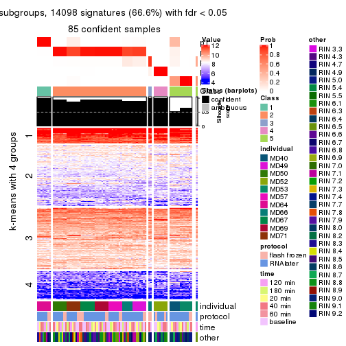</p>

</div>
<div id='tab-CV-hclust-get-signatures-no-scale-5'>
<pre><code class="r">get_signatures(res, k = 6, scale_rows = FALSE)
</code></pre>

<p></p>

</div>
</div>


Compare the overlap of signatures from different k:

```r
compare_signatures(res)
```


`get_signature()` returns a data frame invisibly. TO get the list of signatures, the function
call should be assigned to a variable explicitly. In following code, if `plot` argument is set
to `FALSE`, no heatmap is plotted while only the differential analysis is performed.

```r
# code only for demonstration
tb = get_signature(res, k = ..., plot = FALSE)
```

An example of the output of `tb` is:

```
#>   which_row         fdr    mean_1    mean_2 scaled_mean_1 scaled_mean_2 km
#> 1        38 0.042760348  8.373488  9.131774    -0.5533452     0.5164555  1
#> 2        40 0.018707592  7.106213  8.469186    -0.6173731     0.5762149  1
#> 3        55 0.019134737 10.221463 11.207825    -0.6159697     0.5749050  1
#> 4        59 0.006059896  5.921854  7.869574    -0.6899429     0.6439467  1
#> 5        60 0.018055526  8.928898 10.211722    -0.6204761     0.5791110  1
#> 6        98 0.009384629 15.714769 14.887706     0.6635654    -0.6193277  2
...
```

The columns in `tb` are:

1. `which_row`: row indices corresponding to the input matrix.
2. `fdr`: FDR for the differential test. 
3. `mean_x`: The mean value in group x.
4. `scaled_mean_x`: The mean value in group x after rows are scaled.
5. `km`: Row groups if k-means clustering is applied to rows.


UMAP plot which shows how samples are separated.


<script>
$( function() {
	$( '#tabs-CV-hclust-dimension-reduction' ).tabs();
} );
</script>
<div id='tabs-CV-hclust-dimension-reduction'>
<ul>
<li><a href='#tab-CV-hclust-dimension-reduction-1'>k = 2</a></li>
<li><a href='#tab-CV-hclust-dimension-reduction-2'>k = 3</a></li>
<li><a href='#tab-CV-hclust-dimension-reduction-3'>k = 4</a></li>
<li><a href='#tab-CV-hclust-dimension-reduction-4'>k = 5</a></li>
<li><a href='#tab-CV-hclust-dimension-reduction-5'>k = 6</a></li>
</ul>
<div id='tab-CV-hclust-dimension-reduction-1'>
<pre><code class="r">dimension_reduction(res, k = 2, method = &quot;UMAP&quot;)
</code></pre>

<p></p>

</div>
<div id='tab-CV-hclust-dimension-reduction-2'>
<pre><code class="r">dimension_reduction(res, k = 3, method = &quot;UMAP&quot;)
</code></pre>

<p></p>

</div>
<div id='tab-CV-hclust-dimension-reduction-3'>
<pre><code class="r">dimension_reduction(res, k = 4, method = &quot;UMAP&quot;)
</code></pre>

<p></p>

</div>
<div id='tab-CV-hclust-dimension-reduction-4'>
<pre><code class="r">dimension_reduction(res, k = 5, method = &quot;UMAP&quot;)
</code></pre>

<p></p>

</div>
<div id='tab-CV-hclust-dimension-reduction-5'>
<pre><code class="r">dimension_reduction(res, k = 6, method = &quot;UMAP&quot;)
</code></pre>

<p></p>

</div>
</div>


Following heatmap shows how subgroups are split when increasing `k`:

```r
collect_classes(res)
```


Test correlation between subgroups and known annotations. If the known
annotation is numeric, one-way ANOVA test is applied, and if the known
annotation is discrete, chi-squared contingency table test is applied.

```r
test_to_known_factors(res)
```

```
#>            n individual(p) protocol(p) time(p) other(p) k
#> CV:hclust 85      3.47e-11      0.3626   0.992 0.004489 2
#> CV:hclust 79      9.73e-22      0.4904   0.999 0.009160 3
#> CV:hclust 77      6.78e-23      0.0697   1.000 0.000256 4
#> CV:hclust 85      1.26e-36      0.1333   1.000 0.001249 5
#> CV:hclust 85      2.70e-48      0.1300   1.000 0.001105 6
```


If matrix rows can be associated to genes, consider to use `functional_enrichment(res,
...)` to perform function enrichment for the signature genes. See [this vignette](http://bioconductor.org/packages/devel/bioc/vignettes/cola/inst/doc/functional_enrichment.html) for more detailed explanations.


 

---------------------------------------------------


### CV:kmeans


The object with results only for a single top-value method and a single partition method 
can be extracted as:

```r
res = res_list["CV", "kmeans"]
# you can also extract it by
# res = res_list["CV:kmeans"]
```

A summary of `res` and all the functions that can be applied to it:

```r
res
```

```
#> A 'ConsensusPartition' object with k = 2, 3, 4, 5, 6.
#>   On a matrix with 21168 rows and 86 columns.
#>   Top rows (1000, 2000, 3000, 4000, 5000) are extracted by 'CV' method.
#>   Subgroups are detected by 'kmeans' method.
#>   Performed in total 1250 partitions by row resampling.
#>   Best k for subgroups seems to be 3.
#> 
#> Following methods can be applied to this 'ConsensusPartition' object:
#>  [1] "cola_report"             "collect_classes"         "collect_plots"          
#>  [4] "collect_stats"           "colnames"                "compare_signatures"     
#>  [7] "consensus_heatmap"       "dimension_reduction"     "functional_enrichment"  
#> [10] "get_anno_col"            "get_anno"                "get_classes"            
#> [13] "get_consensus"           "get_matrix"              "get_membership"         
#> [16] "get_param"               "get_signatures"          "get_stats"              
#> [19] "is_best_k"               "is_stable_k"             "membership_heatmap"     
#> [22] "ncol"                    "nrow"                    "plot_ecdf"              
#> [25] "rownames"                "select_partition_number" "show"                   
#> [28] "suggest_best_k"          "test_to_known_factors"
```

`collect_plots()` function collects all the plots made from `res` for all `k` (number of partitions)
into one single page to provide an easy and fast comparison between different `k`.

```r
collect_plots(res)
```


The plots are:

- The first row: a plot of the ECDF (empirical cumulative distribution
  function) curves of the consensus matrix for each `k` and the heatmap of
  predicted classes for each `k`.
- The second row: heatmaps of the consensus matrix for each `k`.
- The third row: heatmaps of the membership matrix for each `k`.
- The fouth row: heatmaps of the signatures for each `k`.

All the plots in panels can be made by individual functions and they are
plotted later in this section.

`select_partition_number()` produces several plots showing different
statistics for choosing "optimized" `k`. There are following statistics:

- ECDF curves of the consensus matrix for each `k`;
- 1-PAC. [The PAC
  score](https://en.wikipedia.org/wiki/Consensus_clustering#Over-interpretation_potential_of_consensus_clustering)
  measures the proportion of the ambiguous subgrouping.
- Mean silhouette score.
- Concordance. The mean probability of fiting the consensus class ids in all
  partitions.
- Area increased. Denote $A_k$ as the area under the ECDF curve for current
  `k`, the area increased is defined as $A_k - A_{k-1}$.
- Rand index. The percent of pairs of samples that are both in a same cluster
  or both are not in a same cluster in the partition of k and k-1.
- Jaccard index. The ratio of pairs of samples are both in a same cluster in
  the partition of k and k-1 and the pairs of samples are both in a same
  cluster in the partition k or k-1.

The detailed explanations of these statistics can be found in [the _cola_
vignette](http://bioconductor.org/packages/devel/bioc/vignettes/cola/inst/doc/cola.html#toc_13).

Generally speaking, lower PAC score, higher mean silhouette score or higher
concordance corresponds to better partition. Rand index and Jaccard index
measure how similar the current partition is compared to partition with `k-1`.
If they are too similar, we won't accept `k` is better than `k-1`.

```r
select_partition_number(res)
```


The numeric values for all these statistics can be obtained by `get_stats()`.

```r
get_stats(res)
```

```
#>   k 1-PAC mean_silhouette concordance area_increased  Rand Jaccard
#> 2 2 0.154           0.421       0.736         0.3824 0.615   0.615
#> 3 3 0.277           0.656       0.785         0.4402 0.787   0.670
#> 4 4 0.362           0.503       0.671         0.2087 0.795   0.586
#> 5 5 0.490           0.580       0.701         0.1141 0.749   0.375
#> 6 6 0.621           0.687       0.699         0.0673 0.894   0.593
```

`suggest_best_k()` suggests the best $k$ based on these statistics. The rules are as follows:

- All $k$ with Jaccard index larger than 0.95 are removed because increasing
  $k$ does not provide enough extra information. If all $k$ are removed, it is
  marked as no subgroup is detected.
- For all $k$ with 1-PAC score larger than 0.9, the maximal $k$ is taken as
  the best $k$, and other $k$ are marked as optional $k$.
- If it does not fit the second rule. The $k$ with the maximal vote of the
  highest 1-PAC score, highest mean silhouette, and highest concordance is
  taken as the best $k$.

```r
suggest_best_k(res)
```

```
#> [1] 3
```


Following shows the table of the partitions (You need to click the **show/hide
code output** link to see it). The membership matrix (columns with name `p*`)
is inferred by
[`clue::cl_consensus()`](https://www.rdocumentation.org/link/cl_consensus?package=clue)
function with the `SE` method. Basically the value in the membership matrix
represents the probability to belong to a certain group. The finall class
label for an item is determined with the group with highest probability it
belongs to.

In `get_classes()` function, the entropy is calculated from the membership
matrix and the silhouette score is calculated from the consensus matrix.


<script>
$( function() {
	$( '#tabs-CV-kmeans-get-classes' ).tabs();
} );
</script>
<div id='tabs-CV-kmeans-get-classes'>
<ul>
<li><a href='#tab-CV-kmeans-get-classes-1'>k = 2</a></li>
<li><a href='#tab-CV-kmeans-get-classes-2'>k = 3</a></li>
<li><a href='#tab-CV-kmeans-get-classes-3'>k = 4</a></li>
<li><a href='#tab-CV-kmeans-get-classes-4'>k = 5</a></li>
<li><a href='#tab-CV-kmeans-get-classes-5'>k = 6</a></li>
</ul>

<div id='tab-CV-kmeans-get-classes-1'>
<p><a id='tab-CV-kmeans-get-classes-1-a' style='color:#0366d6' href='#'>show/hide code output</a></p>
<pre><code class="r">cbind(get_classes(res, k = 2), get_membership(res, k = 2))
</code></pre>

<pre><code>#&gt;           class entropy silhouette    p1    p2
#&gt; GSM614415     2   0.996    -0.1098 0.464 0.536
#&gt; GSM614416     2   0.996    -0.1098 0.464 0.536
#&gt; GSM614417     2   0.996    -0.1098 0.464 0.536
#&gt; GSM614418     2   0.996    -0.1098 0.464 0.536
#&gt; GSM614419     1   0.987     0.3054 0.568 0.432
#&gt; GSM614420     1   0.987     0.3054 0.568 0.432
#&gt; GSM614421     2   0.871     0.2114 0.292 0.708
#&gt; GSM614422     2   0.876     0.2111 0.296 0.704
#&gt; GSM614423     2   0.260     0.6329 0.044 0.956
#&gt; GSM614424     2   0.871     0.2114 0.292 0.708
#&gt; GSM614425     2   0.871     0.2114 0.292 0.708
#&gt; GSM614426     2   0.871     0.2114 0.292 0.708
#&gt; GSM614427     2   0.876     0.2004 0.296 0.704
#&gt; GSM614428     2   0.939     0.0112 0.356 0.644
#&gt; GSM614429     2   0.469     0.6316 0.100 0.900
#&gt; GSM614430     2   0.469     0.6316 0.100 0.900
#&gt; GSM614431     2   0.416     0.6433 0.084 0.916
#&gt; GSM614432     2   0.416     0.6433 0.084 0.916
#&gt; GSM614433     2   0.416     0.6433 0.084 0.916
#&gt; GSM614434     2   0.416     0.6433 0.084 0.916
#&gt; GSM614435     2   0.518     0.6171 0.116 0.884
#&gt; GSM614436     2   0.886     0.2898 0.304 0.696
#&gt; GSM614437     1   0.993     0.2922 0.548 0.452
#&gt; GSM614438     1   0.992     0.3300 0.552 0.448
#&gt; GSM614439     1   0.992     0.3300 0.552 0.448
#&gt; GSM614440     1   0.992     0.3300 0.552 0.448
#&gt; GSM614441     1   0.992     0.3300 0.552 0.448
#&gt; GSM614442     1   0.992     0.3300 0.552 0.448
#&gt; GSM614443     1   0.990     0.3129 0.560 0.440
#&gt; GSM614444     1   0.992     0.3300 0.552 0.448
#&gt; GSM614391     1   0.980     0.3223 0.584 0.416
#&gt; GSM614392     1   1.000     0.1560 0.504 0.496
#&gt; GSM614393     1   1.000     0.1560 0.504 0.496
#&gt; GSM614394     1   0.980     0.3223 0.584 0.416
#&gt; GSM614395     1   0.680     0.4062 0.820 0.180
#&gt; GSM614396     1   0.980     0.3223 0.584 0.416
#&gt; GSM614397     1   0.827     0.4096 0.740 0.260
#&gt; GSM614398     1   0.886     0.3968 0.696 0.304
#&gt; GSM614399     2   0.260     0.6421 0.044 0.956
#&gt; GSM614400     2   0.260     0.6421 0.044 0.956
#&gt; GSM614401     2   0.260     0.6421 0.044 0.956
#&gt; GSM614402     2   0.260     0.6421 0.044 0.956
#&gt; GSM614403     2   0.118     0.6470 0.016 0.984
#&gt; GSM614404     2   0.260     0.6421 0.044 0.956
#&gt; GSM614405     2   0.295     0.6410 0.052 0.948
#&gt; GSM614406     2   0.921     0.0460 0.336 0.664
#&gt; GSM614407     2   0.936     0.1800 0.352 0.648
#&gt; GSM614408     2   0.936     0.1800 0.352 0.648
#&gt; GSM614409     2   0.936     0.1800 0.352 0.648
#&gt; GSM614410     2   0.936     0.1800 0.352 0.648
#&gt; GSM614411     2   0.936     0.1800 0.352 0.648
#&gt; GSM614412     2   0.939     0.1706 0.356 0.644
#&gt; GSM614413     1   0.983     0.3009 0.576 0.424
#&gt; GSM614414     1   0.985     0.2963 0.572 0.428
#&gt; GSM614445     2   0.204     0.6392 0.032 0.968
#&gt; GSM614446     2   0.204     0.6392 0.032 0.968
#&gt; GSM614447     2   0.204     0.6392 0.032 0.968
#&gt; GSM614448     2   0.895     0.1545 0.312 0.688
#&gt; GSM614449     2   0.855     0.2300 0.280 0.720
#&gt; GSM614450     2   0.260     0.6328 0.044 0.956
#&gt; GSM614451     1   0.997     0.3146 0.532 0.468
#&gt; GSM614452     1   0.997     0.3146 0.532 0.468
#&gt; GSM614453     2   0.563     0.6040 0.132 0.868
#&gt; GSM614454     2   0.563     0.6040 0.132 0.868
#&gt; GSM614455     2   0.563     0.6040 0.132 0.868
#&gt; GSM614456     2   0.563     0.6040 0.132 0.868
#&gt; GSM614457     2   0.563     0.6040 0.132 0.868
#&gt; GSM614458     2   0.563     0.6040 0.132 0.868
#&gt; GSM614459     2   0.563     0.6040 0.132 0.868
#&gt; GSM614460     2   0.563     0.6040 0.132 0.868
#&gt; GSM614461     2   0.402     0.6468 0.080 0.920
#&gt; GSM614462     2   0.402     0.6468 0.080 0.920
#&gt; GSM614463     2   0.402     0.6468 0.080 0.920
#&gt; GSM614464     2   0.402     0.6468 0.080 0.920
#&gt; GSM614465     2   0.402     0.6468 0.080 0.920
#&gt; GSM614466     2   0.402     0.6468 0.080 0.920
#&gt; GSM614467     2   0.402     0.6468 0.080 0.920
#&gt; GSM614468     2   0.402     0.6468 0.080 0.920
#&gt; GSM614469     2   0.595     0.5464 0.144 0.856
#&gt; GSM614470     2   0.595     0.5464 0.144 0.856
#&gt; GSM614471     2   0.595     0.5464 0.144 0.856
#&gt; GSM614472     2   0.595     0.5464 0.144 0.856
#&gt; GSM614473     2   0.595     0.5464 0.144 0.856
#&gt; GSM614474     2   0.595     0.5464 0.144 0.856
#&gt; GSM614475     2   0.456     0.5985 0.096 0.904
#&gt; GSM614476     2   0.373     0.6238 0.072 0.928
</code></pre>

<script>
$('#tab-CV-kmeans-get-classes-1-a').parent().next().next().hide();
$('#tab-CV-kmeans-get-classes-1-a').click(function(){
  $('#tab-CV-kmeans-get-classes-1-a').parent().next().next().toggle();
  return(false);
});
</script>
</div>

<div id='tab-CV-kmeans-get-classes-2'>
<p><a id='tab-CV-kmeans-get-classes-2-a' style='color:#0366d6' href='#'>show/hide code output</a></p>
<pre><code class="r">cbind(get_classes(res, k = 3), get_membership(res, k = 3))
</code></pre>

<pre><code>#&gt;           class entropy silhouette    p1    p2    p3
#&gt; GSM614415     1   0.525      0.737 0.792 0.188 0.020
#&gt; GSM614416     1   0.525      0.737 0.792 0.188 0.020
#&gt; GSM614417     1   0.525      0.737 0.792 0.188 0.020
#&gt; GSM614418     1   0.525      0.737 0.792 0.188 0.020
#&gt; GSM614419     1   0.486      0.729 0.840 0.116 0.044
#&gt; GSM614420     1   0.486      0.729 0.840 0.116 0.044
#&gt; GSM614421     2   0.945      0.287 0.212 0.492 0.296
#&gt; GSM614422     2   0.945      0.287 0.212 0.492 0.296
#&gt; GSM614423     2   0.579      0.680 0.136 0.796 0.068
#&gt; GSM614424     2   0.945      0.287 0.212 0.492 0.296
#&gt; GSM614425     2   0.945      0.287 0.212 0.492 0.296
#&gt; GSM614426     2   0.945      0.287 0.212 0.492 0.296
#&gt; GSM614427     2   0.945      0.287 0.212 0.492 0.296
#&gt; GSM614428     2   0.950      0.240 0.208 0.476 0.316
#&gt; GSM614429     2   0.207      0.727 0.000 0.940 0.060
#&gt; GSM614430     2   0.207      0.727 0.000 0.940 0.060
#&gt; GSM614431     2   0.207      0.727 0.000 0.940 0.060
#&gt; GSM614432     2   0.207      0.727 0.000 0.940 0.060
#&gt; GSM614433     2   0.196      0.728 0.000 0.944 0.056
#&gt; GSM614434     2   0.207      0.727 0.000 0.940 0.060
#&gt; GSM614435     2   0.207      0.727 0.000 0.940 0.060
#&gt; GSM614436     2   0.435      0.621 0.000 0.816 0.184
#&gt; GSM614437     3   0.412      0.946 0.000 0.168 0.832
#&gt; GSM614438     3   0.412      0.946 0.000 0.168 0.832
#&gt; GSM614439     3   0.412      0.946 0.000 0.168 0.832
#&gt; GSM614440     3   0.412      0.946 0.000 0.168 0.832
#&gt; GSM614441     3   0.412      0.946 0.000 0.168 0.832
#&gt; GSM614442     3   0.412      0.946 0.000 0.168 0.832
#&gt; GSM614443     3   0.412      0.946 0.000 0.168 0.832
#&gt; GSM614444     3   0.412      0.946 0.000 0.168 0.832
#&gt; GSM614391     1   0.426      0.685 0.868 0.036 0.096
#&gt; GSM614392     1   0.442      0.691 0.864 0.048 0.088
#&gt; GSM614393     1   0.442      0.691 0.864 0.048 0.088
#&gt; GSM614394     1   0.426      0.685 0.868 0.036 0.096
#&gt; GSM614395     1   0.618      0.376 0.660 0.008 0.332
#&gt; GSM614396     1   0.426      0.685 0.868 0.036 0.096
#&gt; GSM614397     1   0.445      0.632 0.836 0.012 0.152
#&gt; GSM614398     1   0.441      0.647 0.844 0.016 0.140
#&gt; GSM614399     2   0.560      0.684 0.136 0.804 0.060
#&gt; GSM614400     2   0.563      0.679 0.144 0.800 0.056
#&gt; GSM614401     2   0.563      0.679 0.144 0.800 0.056
#&gt; GSM614402     2   0.557      0.682 0.140 0.804 0.056
#&gt; GSM614403     2   0.552      0.695 0.120 0.812 0.068
#&gt; GSM614404     2   0.563      0.679 0.144 0.800 0.056
#&gt; GSM614405     2   0.613      0.679 0.136 0.780 0.084
#&gt; GSM614406     2   0.859      0.372 0.120 0.560 0.320
#&gt; GSM614407     1   0.739      0.561 0.600 0.356 0.044
#&gt; GSM614408     1   0.739      0.561 0.600 0.356 0.044
#&gt; GSM614409     1   0.739      0.561 0.600 0.356 0.044
#&gt; GSM614410     1   0.739      0.561 0.600 0.356 0.044
#&gt; GSM614411     1   0.739      0.561 0.600 0.356 0.044
#&gt; GSM614412     1   0.739      0.561 0.600 0.356 0.044
#&gt; GSM614413     1   0.828      0.616 0.628 0.224 0.148
#&gt; GSM614414     1   0.828      0.616 0.628 0.224 0.148
#&gt; GSM614445     2   0.514      0.701 0.104 0.832 0.064
#&gt; GSM614446     2   0.541      0.696 0.104 0.820 0.076
#&gt; GSM614447     2   0.541      0.696 0.104 0.820 0.076
#&gt; GSM614448     2   0.877      0.365 0.140 0.556 0.304
#&gt; GSM614449     2   0.868      0.396 0.140 0.572 0.288
#&gt; GSM614450     2   0.566      0.691 0.104 0.808 0.088
#&gt; GSM614451     3   0.649      0.760 0.076 0.172 0.752
#&gt; GSM614452     3   0.649      0.760 0.076 0.172 0.752
#&gt; GSM614453     2   0.384      0.684 0.012 0.872 0.116
#&gt; GSM614454     2   0.384      0.684 0.012 0.872 0.116
#&gt; GSM614455     2   0.384      0.684 0.012 0.872 0.116
#&gt; GSM614456     2   0.384      0.684 0.012 0.872 0.116
#&gt; GSM614457     2   0.384      0.684 0.012 0.872 0.116
#&gt; GSM614458     2   0.384      0.684 0.012 0.872 0.116
#&gt; GSM614459     2   0.384      0.684 0.012 0.872 0.116
#&gt; GSM614460     2   0.384      0.684 0.012 0.872 0.116
#&gt; GSM614461     2   0.210      0.732 0.004 0.944 0.052
#&gt; GSM614462     2   0.210      0.732 0.004 0.944 0.052
#&gt; GSM614463     2   0.210      0.732 0.004 0.944 0.052
#&gt; GSM614464     2   0.210      0.732 0.004 0.944 0.052
#&gt; GSM614465     2   0.210      0.732 0.004 0.944 0.052
#&gt; GSM614466     2   0.210      0.732 0.004 0.944 0.052
#&gt; GSM614467     2   0.210      0.732 0.004 0.944 0.052
#&gt; GSM614468     2   0.210      0.732 0.004 0.944 0.052
#&gt; GSM614469     2   0.569      0.604 0.224 0.756 0.020
#&gt; GSM614470     2   0.569      0.604 0.224 0.756 0.020
#&gt; GSM614471     2   0.569      0.604 0.224 0.756 0.020
#&gt; GSM614472     2   0.569      0.604 0.224 0.756 0.020
#&gt; GSM614473     2   0.569      0.604 0.224 0.756 0.020
#&gt; GSM614474     2   0.569      0.604 0.224 0.756 0.020
#&gt; GSM614475     2   0.563      0.622 0.208 0.768 0.024
#&gt; GSM614476     2   0.619      0.647 0.176 0.764 0.060
</code></pre>

<script>
$('#tab-CV-kmeans-get-classes-2-a').parent().next().next().hide();
$('#tab-CV-kmeans-get-classes-2-a').click(function(){
  $('#tab-CV-kmeans-get-classes-2-a').parent().next().next().toggle();
  return(false);
});
</script>
</div>

<div id='tab-CV-kmeans-get-classes-3'>
<p><a id='tab-CV-kmeans-get-classes-3-a' style='color:#0366d6' href='#'>show/hide code output</a></p>
<pre><code class="r">cbind(get_classes(res, k = 4), get_membership(res, k = 4))
</code></pre>

<pre><code>#&gt;           class entropy silhouette    p1    p2    p3    p4
#&gt; GSM614415     1  0.6605     0.6090 0.628 0.080 0.276 0.016
#&gt; GSM614416     1  0.6605     0.6090 0.628 0.080 0.276 0.016
#&gt; GSM614417     1  0.6605     0.6090 0.628 0.080 0.276 0.016
#&gt; GSM614418     1  0.6605     0.6090 0.628 0.080 0.276 0.016
#&gt; GSM614419     1  0.5499     0.6548 0.680 0.012 0.284 0.024
#&gt; GSM614420     1  0.5499     0.6548 0.680 0.012 0.284 0.024
#&gt; GSM614421     3  0.9594     0.4544 0.148 0.236 0.384 0.232
#&gt; GSM614422     3  0.9593     0.4568 0.148 0.240 0.384 0.228
#&gt; GSM614423     3  0.8020     0.2734 0.128 0.408 0.428 0.036
#&gt; GSM614424     3  0.9594     0.4544 0.148 0.236 0.384 0.232
#&gt; GSM614425     3  0.9594     0.4544 0.148 0.236 0.384 0.232
#&gt; GSM614426     3  0.9594     0.4544 0.148 0.236 0.384 0.232
#&gt; GSM614427     3  0.9594     0.4544 0.148 0.236 0.384 0.232
#&gt; GSM614428     3  0.9594     0.4480 0.148 0.232 0.384 0.236
#&gt; GSM614429     2  0.0707     0.6720 0.000 0.980 0.000 0.020
#&gt; GSM614430     2  0.0707     0.6720 0.000 0.980 0.000 0.020
#&gt; GSM614431     2  0.0707     0.6720 0.000 0.980 0.000 0.020
#&gt; GSM614432     2  0.0707     0.6720 0.000 0.980 0.000 0.020
#&gt; GSM614433     2  0.0707     0.6720 0.000 0.980 0.000 0.020
#&gt; GSM614434     2  0.0707     0.6720 0.000 0.980 0.000 0.020
#&gt; GSM614435     2  0.0817     0.6704 0.000 0.976 0.000 0.024
#&gt; GSM614436     2  0.3215     0.5916 0.000 0.876 0.032 0.092
#&gt; GSM614437     4  0.2011     0.8884 0.000 0.080 0.000 0.920
#&gt; GSM614438     4  0.2125     0.8946 0.000 0.076 0.004 0.920
#&gt; GSM614439     4  0.2125     0.8946 0.000 0.076 0.004 0.920
#&gt; GSM614440     4  0.2125     0.8946 0.000 0.076 0.004 0.920
#&gt; GSM614441     4  0.2125     0.8946 0.000 0.076 0.004 0.920
#&gt; GSM614442     4  0.2125     0.8946 0.000 0.076 0.004 0.920
#&gt; GSM614443     4  0.2011     0.8884 0.000 0.080 0.000 0.920
#&gt; GSM614444     4  0.2125     0.8946 0.000 0.076 0.004 0.920
#&gt; GSM614391     1  0.0524     0.7499 0.988 0.000 0.004 0.008
#&gt; GSM614392     1  0.0524     0.7498 0.988 0.000 0.008 0.004
#&gt; GSM614393     1  0.0524     0.7498 0.988 0.000 0.008 0.004
#&gt; GSM614394     1  0.0672     0.7489 0.984 0.000 0.008 0.008
#&gt; GSM614395     1  0.4784     0.5491 0.788 0.000 0.112 0.100
#&gt; GSM614396     1  0.0672     0.7489 0.984 0.000 0.008 0.008
#&gt; GSM614397     1  0.2813     0.6700 0.896 0.000 0.080 0.024
#&gt; GSM614398     1  0.2402     0.6867 0.912 0.000 0.076 0.012
#&gt; GSM614399     2  0.6874     0.4560 0.084 0.560 0.344 0.012
#&gt; GSM614400     2  0.6914     0.4564 0.088 0.560 0.340 0.012
#&gt; GSM614401     2  0.6914     0.4564 0.088 0.560 0.340 0.012
#&gt; GSM614402     2  0.6874     0.4560 0.084 0.560 0.344 0.012
#&gt; GSM614403     2  0.6976     0.3794 0.068 0.524 0.388 0.020
#&gt; GSM614404     2  0.6914     0.4564 0.088 0.560 0.340 0.012
#&gt; GSM614405     2  0.7164     0.3929 0.076 0.520 0.380 0.024
#&gt; GSM614406     3  0.8984     0.3770 0.076 0.284 0.428 0.212
#&gt; GSM614407     3  0.8338    -0.0792 0.356 0.188 0.424 0.032
#&gt; GSM614408     3  0.8338    -0.0792 0.356 0.188 0.424 0.032
#&gt; GSM614409     3  0.8314    -0.0794 0.356 0.184 0.428 0.032
#&gt; GSM614410     3  0.8338    -0.0792 0.356 0.188 0.424 0.032
#&gt; GSM614411     3  0.8314    -0.0794 0.356 0.184 0.428 0.032
#&gt; GSM614412     3  0.8252    -0.0982 0.368 0.172 0.428 0.032
#&gt; GSM614413     3  0.7613    -0.1215 0.352 0.048 0.520 0.080
#&gt; GSM614414     3  0.7601    -0.1200 0.348 0.048 0.524 0.080
#&gt; GSM614445     2  0.6964     0.0165 0.052 0.496 0.424 0.028
#&gt; GSM614446     3  0.7134     0.1090 0.052 0.440 0.472 0.036
#&gt; GSM614447     2  0.7126    -0.0248 0.052 0.484 0.428 0.036
#&gt; GSM614448     3  0.9162     0.4295 0.104 0.240 0.440 0.216
#&gt; GSM614449     3  0.9040     0.4323 0.092 0.252 0.448 0.208
#&gt; GSM614450     3  0.7355     0.2242 0.060 0.396 0.500 0.044
#&gt; GSM614451     4  0.6870     0.4522 0.044 0.048 0.308 0.600
#&gt; GSM614452     4  0.6870     0.4522 0.044 0.048 0.308 0.600
#&gt; GSM614453     2  0.3229     0.6319 0.000 0.880 0.048 0.072
#&gt; GSM614454     2  0.3229     0.6319 0.000 0.880 0.048 0.072
#&gt; GSM614455     2  0.3229     0.6319 0.000 0.880 0.048 0.072
#&gt; GSM614456     2  0.3229     0.6319 0.000 0.880 0.048 0.072
#&gt; GSM614457     2  0.3229     0.6319 0.000 0.880 0.048 0.072
#&gt; GSM614458     2  0.3229     0.6319 0.000 0.880 0.048 0.072
#&gt; GSM614459     2  0.3229     0.6319 0.000 0.880 0.048 0.072
#&gt; GSM614460     2  0.3229     0.6319 0.000 0.880 0.048 0.072
#&gt; GSM614461     2  0.2011     0.6678 0.000 0.920 0.080 0.000
#&gt; GSM614462     2  0.2011     0.6678 0.000 0.920 0.080 0.000
#&gt; GSM614463     2  0.2011     0.6678 0.000 0.920 0.080 0.000
#&gt; GSM614464     2  0.2011     0.6678 0.000 0.920 0.080 0.000
#&gt; GSM614465     2  0.2011     0.6678 0.000 0.920 0.080 0.000
#&gt; GSM614466     2  0.2011     0.6678 0.000 0.920 0.080 0.000
#&gt; GSM614467     2  0.2011     0.6678 0.000 0.920 0.080 0.000
#&gt; GSM614468     2  0.2011     0.6678 0.000 0.920 0.080 0.000
#&gt; GSM614469     2  0.7538     0.3520 0.228 0.520 0.248 0.004
#&gt; GSM614470     2  0.7538     0.3520 0.228 0.520 0.248 0.004
#&gt; GSM614471     2  0.7538     0.3520 0.228 0.520 0.248 0.004
#&gt; GSM614472     2  0.7538     0.3520 0.228 0.520 0.248 0.004
#&gt; GSM614473     2  0.7538     0.3520 0.228 0.520 0.248 0.004
#&gt; GSM614474     2  0.7538     0.3520 0.228 0.520 0.248 0.004
#&gt; GSM614475     2  0.7419     0.3760 0.200 0.536 0.260 0.004
#&gt; GSM614476     2  0.7780     0.3158 0.196 0.500 0.292 0.012
</code></pre>

<script>
$('#tab-CV-kmeans-get-classes-3-a').parent().next().next().hide();
$('#tab-CV-kmeans-get-classes-3-a').click(function(){
  $('#tab-CV-kmeans-get-classes-3-a').parent().next().next().toggle();
  return(false);
});
</script>
</div>

<div id='tab-CV-kmeans-get-classes-4'>
<p><a id='tab-CV-kmeans-get-classes-4-a' style='color:#0366d6' href='#'>show/hide code output</a></p>
<pre><code class="r">cbind(get_classes(res, k = 5), get_membership(res, k = 5))
</code></pre>

<pre><code>#&gt;           class entropy silhouette    p1    p2    p3    p4    p5
#&gt; GSM614415     1   0.701    -0.0997 0.480 0.028 0.084 0.028 0.380
#&gt; GSM614416     1   0.701    -0.0997 0.480 0.028 0.084 0.028 0.380
#&gt; GSM614417     1   0.701    -0.0997 0.480 0.028 0.084 0.028 0.380
#&gt; GSM614418     1   0.701    -0.0997 0.480 0.028 0.084 0.028 0.380
#&gt; GSM614419     1   0.675    -0.1991 0.464 0.004 0.108 0.028 0.396
#&gt; GSM614420     1   0.675    -0.1991 0.464 0.004 0.108 0.028 0.396
#&gt; GSM614421     3   0.724     0.7277 0.076 0.068 0.624 0.144 0.088
#&gt; GSM614422     3   0.726     0.7279 0.080 0.068 0.624 0.140 0.088
#&gt; GSM614423     3   0.656     0.6913 0.108 0.136 0.664 0.024 0.068
#&gt; GSM614424     3   0.724     0.7277 0.076 0.068 0.624 0.144 0.088
#&gt; GSM614425     3   0.724     0.7277 0.076 0.068 0.624 0.144 0.088
#&gt; GSM614426     3   0.724     0.7277 0.076 0.068 0.624 0.144 0.088
#&gt; GSM614427     3   0.724     0.7277 0.076 0.068 0.624 0.144 0.088
#&gt; GSM614428     3   0.729     0.7246 0.076 0.068 0.620 0.144 0.092
#&gt; GSM614429     2   0.292     0.7895 0.028 0.892 0.028 0.048 0.004
#&gt; GSM614430     2   0.292     0.7895 0.028 0.892 0.028 0.048 0.004
#&gt; GSM614431     2   0.292     0.7895 0.028 0.892 0.028 0.048 0.004
#&gt; GSM614432     2   0.292     0.7895 0.028 0.892 0.028 0.048 0.004
#&gt; GSM614433     2   0.292     0.7895 0.028 0.892 0.028 0.048 0.004
#&gt; GSM614434     2   0.292     0.7895 0.028 0.892 0.028 0.048 0.004
#&gt; GSM614435     2   0.292     0.7895 0.028 0.892 0.028 0.048 0.004
#&gt; GSM614436     2   0.336     0.7785 0.028 0.868 0.036 0.064 0.004
#&gt; GSM614437     4   0.141     1.0000 0.000 0.044 0.008 0.948 0.000
#&gt; GSM614438     4   0.141     1.0000 0.000 0.044 0.008 0.948 0.000
#&gt; GSM614439     4   0.141     1.0000 0.000 0.044 0.008 0.948 0.000
#&gt; GSM614440     4   0.141     1.0000 0.000 0.044 0.008 0.948 0.000
#&gt; GSM614441     4   0.141     1.0000 0.000 0.044 0.008 0.948 0.000
#&gt; GSM614442     4   0.141     1.0000 0.000 0.044 0.008 0.948 0.000
#&gt; GSM614443     4   0.141     1.0000 0.000 0.044 0.008 0.948 0.000
#&gt; GSM614444     4   0.141     1.0000 0.000 0.044 0.008 0.948 0.000
#&gt; GSM614391     5   0.293     0.9279 0.164 0.000 0.004 0.000 0.832
#&gt; GSM614392     5   0.297     0.9242 0.168 0.000 0.004 0.000 0.828
#&gt; GSM614393     5   0.297     0.9242 0.168 0.000 0.004 0.000 0.828
#&gt; GSM614394     5   0.289     0.9297 0.160 0.000 0.004 0.000 0.836
#&gt; GSM614395     5   0.400     0.8114 0.060 0.000 0.072 0.040 0.828
#&gt; GSM614396     5   0.289     0.9297 0.160 0.000 0.004 0.000 0.836
#&gt; GSM614397     5   0.332     0.8837 0.100 0.000 0.040 0.008 0.852
#&gt; GSM614398     5   0.290     0.9033 0.108 0.000 0.028 0.000 0.864
#&gt; GSM614399     1   0.825     0.2246 0.320 0.320 0.280 0.016 0.064
#&gt; GSM614400     2   0.825    -0.2842 0.320 0.320 0.280 0.016 0.064
#&gt; GSM614401     1   0.825     0.2246 0.320 0.320 0.280 0.016 0.064
#&gt; GSM614402     1   0.825     0.2246 0.320 0.320 0.280 0.016 0.064
#&gt; GSM614403     3   0.814    -0.1629 0.244 0.284 0.392 0.016 0.064
#&gt; GSM614404     1   0.825     0.2246 0.320 0.320 0.280 0.016 0.064
#&gt; GSM614405     3   0.832    -0.2706 0.292 0.288 0.336 0.020 0.064
#&gt; GSM614406     3   0.777     0.5645 0.088 0.144 0.580 0.108 0.080
#&gt; GSM614407     1   0.258     0.4042 0.904 0.052 0.008 0.004 0.032
#&gt; GSM614408     1   0.258     0.4042 0.904 0.052 0.008 0.004 0.032
#&gt; GSM614409     1   0.267     0.4004 0.900 0.052 0.008 0.004 0.036
#&gt; GSM614410     1   0.258     0.4042 0.904 0.052 0.008 0.004 0.032
#&gt; GSM614411     1   0.267     0.4004 0.900 0.052 0.008 0.004 0.036
#&gt; GSM614412     1   0.259     0.3966 0.904 0.048 0.008 0.004 0.036
#&gt; GSM614413     1   0.550     0.1587 0.704 0.012 0.184 0.016 0.084
#&gt; GSM614414     1   0.550     0.1587 0.704 0.012 0.184 0.016 0.084
#&gt; GSM614445     3   0.509     0.6393 0.068 0.196 0.716 0.020 0.000
#&gt; GSM614446     3   0.466     0.6759 0.056 0.168 0.756 0.020 0.000
#&gt; GSM614447     3   0.509     0.6393 0.068 0.196 0.716 0.020 0.000
#&gt; GSM614448     3   0.566     0.7154 0.032 0.076 0.736 0.116 0.040
#&gt; GSM614449     3   0.524     0.7163 0.032 0.092 0.756 0.104 0.016
#&gt; GSM614450     3   0.464     0.6882 0.056 0.148 0.768 0.028 0.000
#&gt; GSM614451     3   0.603     0.3517 0.008 0.020 0.540 0.380 0.052
#&gt; GSM614452     3   0.603     0.3517 0.008 0.020 0.540 0.380 0.052
#&gt; GSM614453     2   0.461     0.7478 0.012 0.800 0.040 0.092 0.056
#&gt; GSM614454     2   0.461     0.7478 0.012 0.800 0.040 0.092 0.056
#&gt; GSM614455     2   0.461     0.7478 0.012 0.800 0.040 0.092 0.056
#&gt; GSM614456     2   0.461     0.7478 0.012 0.800 0.040 0.092 0.056
#&gt; GSM614457     2   0.461     0.7478 0.012 0.800 0.040 0.092 0.056
#&gt; GSM614458     2   0.461     0.7478 0.012 0.800 0.040 0.092 0.056
#&gt; GSM614459     2   0.461     0.7478 0.012 0.800 0.040 0.092 0.056
#&gt; GSM614460     2   0.461     0.7478 0.012 0.800 0.040 0.092 0.056
#&gt; GSM614461     2   0.471     0.7160 0.056 0.776 0.136 0.008 0.024
#&gt; GSM614462     2   0.471     0.7160 0.056 0.776 0.136 0.008 0.024
#&gt; GSM614463     2   0.471     0.7160 0.056 0.776 0.136 0.008 0.024
#&gt; GSM614464     2   0.471     0.7160 0.056 0.776 0.136 0.008 0.024
#&gt; GSM614465     2   0.471     0.7160 0.056 0.776 0.136 0.008 0.024
#&gt; GSM614466     2   0.471     0.7160 0.056 0.776 0.136 0.008 0.024
#&gt; GSM614467     2   0.464     0.7169 0.052 0.780 0.136 0.008 0.024
#&gt; GSM614468     2   0.464     0.7169 0.052 0.780 0.136 0.008 0.024
#&gt; GSM614469     1   0.736     0.4256 0.480 0.344 0.100 0.016 0.060
#&gt; GSM614470     1   0.736     0.4256 0.480 0.344 0.100 0.016 0.060
#&gt; GSM614471     1   0.736     0.4256 0.480 0.344 0.100 0.016 0.060
#&gt; GSM614472     1   0.736     0.4256 0.480 0.344 0.100 0.016 0.060
#&gt; GSM614473     1   0.736     0.4256 0.480 0.344 0.100 0.016 0.060
#&gt; GSM614474     1   0.736     0.4256 0.480 0.344 0.100 0.016 0.060
#&gt; GSM614475     1   0.735     0.4050 0.472 0.348 0.116 0.016 0.048
#&gt; GSM614476     1   0.781     0.3931 0.448 0.320 0.156 0.024 0.052
</code></pre>

<script>
$('#tab-CV-kmeans-get-classes-4-a').parent().next().next().hide();
$('#tab-CV-kmeans-get-classes-4-a').click(function(){
  $('#tab-CV-kmeans-get-classes-4-a').parent().next().next().toggle();
  return(false);
});
</script>
</div>

<div id='tab-CV-kmeans-get-classes-5'>
<p><a id='tab-CV-kmeans-get-classes-5-a' style='color:#0366d6' href='#'>show/hide code output</a></p>
<pre><code class="r">cbind(get_classes(res, k = 6), get_membership(res, k = 6))
</code></pre>

<pre><code>#&gt;           class entropy silhouette    p1    p2    p3    p4    p5    p6
#&gt; GSM614415     5   0.775      0.382 0.228 0.012 0.060 0.028 0.368 0.304
#&gt; GSM614416     5   0.775      0.382 0.228 0.012 0.060 0.028 0.368 0.304
#&gt; GSM614417     5   0.775      0.382 0.228 0.012 0.060 0.028 0.368 0.304
#&gt; GSM614418     5   0.775      0.382 0.228 0.012 0.060 0.028 0.368 0.304
#&gt; GSM614419     5   0.766      0.400 0.212 0.008 0.064 0.028 0.388 0.300
#&gt; GSM614420     5   0.766      0.400 0.212 0.008 0.064 0.028 0.388 0.300
#&gt; GSM614421     3   0.438      0.806 0.012 0.028 0.804 0.056 0.064 0.036
#&gt; GSM614422     3   0.438      0.806 0.012 0.028 0.804 0.056 0.064 0.036
#&gt; GSM614423     3   0.489      0.758 0.052 0.060 0.772 0.008 0.056 0.052
#&gt; GSM614424     3   0.438      0.806 0.012 0.028 0.804 0.056 0.064 0.036
#&gt; GSM614425     3   0.438      0.806 0.012 0.028 0.804 0.056 0.064 0.036
#&gt; GSM614426     3   0.438      0.806 0.012 0.028 0.804 0.056 0.064 0.036
#&gt; GSM614427     3   0.438      0.806 0.012 0.028 0.804 0.056 0.064 0.036
#&gt; GSM614428     3   0.445      0.804 0.012 0.028 0.800 0.056 0.064 0.040
#&gt; GSM614429     2   0.325      0.746 0.036 0.856 0.052 0.000 0.004 0.052
#&gt; GSM614430     2   0.325      0.746 0.036 0.856 0.052 0.000 0.004 0.052
#&gt; GSM614431     2   0.325      0.746 0.036 0.856 0.052 0.000 0.004 0.052
#&gt; GSM614432     2   0.325      0.746 0.036 0.856 0.052 0.000 0.004 0.052
#&gt; GSM614433     2   0.325      0.746 0.036 0.856 0.052 0.000 0.004 0.052
#&gt; GSM614434     2   0.325      0.746 0.036 0.856 0.052 0.000 0.004 0.052
#&gt; GSM614435     2   0.325      0.746 0.036 0.856 0.052 0.000 0.004 0.052
#&gt; GSM614436     2   0.331      0.745 0.036 0.852 0.056 0.000 0.004 0.052
#&gt; GSM614437     4   0.170      0.998 0.000 0.024 0.048 0.928 0.000 0.000
#&gt; GSM614438     4   0.170      0.998 0.000 0.024 0.048 0.928 0.000 0.000
#&gt; GSM614439     4   0.184      0.998 0.000 0.024 0.048 0.924 0.000 0.004
#&gt; GSM614440     4   0.184      0.998 0.000 0.024 0.048 0.924 0.000 0.004
#&gt; GSM614441     4   0.184      0.998 0.000 0.024 0.048 0.924 0.000 0.004
#&gt; GSM614442     4   0.170      0.998 0.000 0.024 0.048 0.928 0.000 0.000
#&gt; GSM614443     4   0.170      0.998 0.000 0.024 0.048 0.928 0.000 0.000
#&gt; GSM614444     4   0.184      0.998 0.000 0.024 0.048 0.924 0.000 0.004
#&gt; GSM614391     5   0.135      0.653 0.024 0.000 0.016 0.000 0.952 0.008
#&gt; GSM614392     5   0.135      0.653 0.024 0.000 0.016 0.000 0.952 0.008
#&gt; GSM614393     5   0.135      0.653 0.024 0.000 0.016 0.000 0.952 0.008
#&gt; GSM614394     5   0.117      0.652 0.016 0.000 0.016 0.000 0.960 0.008
#&gt; GSM614395     5   0.361      0.591 0.024 0.000 0.064 0.024 0.840 0.048
#&gt; GSM614396     5   0.132      0.652 0.016 0.000 0.016 0.004 0.956 0.008
#&gt; GSM614397     5   0.271      0.621 0.020 0.000 0.040 0.016 0.892 0.032
#&gt; GSM614398     5   0.256      0.625 0.020 0.000 0.036 0.016 0.900 0.028
#&gt; GSM614399     1   0.377      0.639 0.792 0.152 0.040 0.000 0.012 0.004
#&gt; GSM614400     1   0.377      0.639 0.792 0.152 0.040 0.000 0.012 0.004
#&gt; GSM614401     1   0.377      0.639 0.792 0.152 0.040 0.000 0.012 0.004
#&gt; GSM614402     1   0.377      0.639 0.792 0.152 0.040 0.000 0.012 0.004
#&gt; GSM614403     1   0.445      0.585 0.756 0.120 0.100 0.000 0.020 0.004
#&gt; GSM614404     1   0.377      0.639 0.792 0.152 0.040 0.000 0.012 0.004
#&gt; GSM614405     1   0.408      0.618 0.784 0.128 0.064 0.000 0.020 0.004
#&gt; GSM614406     1   0.658     -0.149 0.492 0.048 0.368 0.028 0.044 0.020
#&gt; GSM614407     6   0.528      0.880 0.192 0.032 0.020 0.000 0.068 0.688
#&gt; GSM614408     6   0.528      0.880 0.192 0.032 0.020 0.000 0.068 0.688
#&gt; GSM614409     6   0.528      0.880 0.192 0.032 0.020 0.000 0.068 0.688
#&gt; GSM614410     6   0.528      0.880 0.192 0.032 0.020 0.000 0.068 0.688
#&gt; GSM614411     6   0.528      0.880 0.192 0.032 0.020 0.000 0.068 0.688
#&gt; GSM614412     6   0.528      0.880 0.192 0.032 0.020 0.000 0.068 0.688
#&gt; GSM614413     6   0.589      0.639 0.060 0.008 0.176 0.008 0.096 0.652
#&gt; GSM614414     6   0.589      0.639 0.060 0.008 0.176 0.008 0.096 0.652
#&gt; GSM614445     3   0.493      0.710 0.168 0.080 0.720 0.012 0.008 0.012
#&gt; GSM614446     3   0.469      0.733 0.152 0.072 0.744 0.012 0.008 0.012
#&gt; GSM614447     3   0.488      0.715 0.168 0.076 0.724 0.012 0.008 0.012
#&gt; GSM614448     3   0.399      0.773 0.116 0.036 0.808 0.016 0.012 0.012
#&gt; GSM614449     3   0.389      0.772 0.116 0.036 0.812 0.016 0.008 0.012
#&gt; GSM614450     3   0.440      0.749 0.144 0.056 0.768 0.012 0.008 0.012
#&gt; GSM614451     3   0.588      0.513 0.048 0.008 0.616 0.264 0.024 0.040
#&gt; GSM614452     3   0.588      0.513 0.048 0.008 0.616 0.264 0.024 0.040
#&gt; GSM614453     2   0.264      0.713 0.008 0.892 0.004 0.032 0.008 0.056
#&gt; GSM614454     2   0.264      0.713 0.008 0.892 0.004 0.032 0.008 0.056
#&gt; GSM614455     2   0.264      0.713 0.008 0.892 0.004 0.032 0.008 0.056
#&gt; GSM614456     2   0.264      0.713 0.008 0.892 0.004 0.032 0.008 0.056
#&gt; GSM614457     2   0.264      0.713 0.008 0.892 0.004 0.032 0.008 0.056
#&gt; GSM614458     2   0.264      0.713 0.008 0.892 0.004 0.032 0.008 0.056
#&gt; GSM614459     2   0.264      0.713 0.008 0.892 0.004 0.032 0.008 0.056
#&gt; GSM614460     2   0.264      0.713 0.008 0.892 0.004 0.032 0.008 0.056
#&gt; GSM614461     2   0.584      0.578 0.276 0.588 0.076 0.004 0.000 0.056
#&gt; GSM614462     2   0.584      0.578 0.276 0.588 0.076 0.004 0.000 0.056
#&gt; GSM614463     2   0.584      0.578 0.276 0.588 0.076 0.004 0.000 0.056
#&gt; GSM614464     2   0.584      0.578 0.276 0.588 0.076 0.004 0.000 0.056
#&gt; GSM614465     2   0.584      0.578 0.276 0.588 0.076 0.004 0.000 0.056
#&gt; GSM614466     2   0.584      0.578 0.276 0.588 0.076 0.004 0.000 0.056
#&gt; GSM614467     2   0.584      0.578 0.276 0.588 0.076 0.004 0.000 0.056
#&gt; GSM614468     2   0.584      0.578 0.276 0.588 0.076 0.004 0.000 0.056
#&gt; GSM614469     1   0.771      0.591 0.460 0.204 0.080 0.004 0.052 0.200
#&gt; GSM614470     1   0.771      0.591 0.460 0.204 0.080 0.004 0.052 0.200
#&gt; GSM614471     1   0.771      0.591 0.460 0.204 0.080 0.004 0.052 0.200
#&gt; GSM614472     1   0.771      0.591 0.460 0.204 0.080 0.004 0.052 0.200
#&gt; GSM614473     1   0.771      0.591 0.460 0.204 0.080 0.004 0.052 0.200
#&gt; GSM614474     1   0.771      0.591 0.460 0.204 0.080 0.004 0.052 0.200
#&gt; GSM614475     1   0.769      0.593 0.464 0.204 0.080 0.004 0.052 0.196
#&gt; GSM614476     1   0.786      0.579 0.456 0.200 0.124 0.008 0.040 0.172
</code></pre>

<script>
$('#tab-CV-kmeans-get-classes-5-a').parent().next().next().hide();
$('#tab-CV-kmeans-get-classes-5-a').click(function(){
  $('#tab-CV-kmeans-get-classes-5-a').parent().next().next().toggle();
  return(false);
});
</script>
</div>
</div>

Heatmaps for the consensus matrix. It visualizes the probability of two
samples to be in a same group.


<script>
$( function() {
	$( '#tabs-CV-kmeans-consensus-heatmap' ).tabs();
} );
</script>
<div id='tabs-CV-kmeans-consensus-heatmap'>
<ul>
<li><a href='#tab-CV-kmeans-consensus-heatmap-1'>k = 2</a></li>
<li><a href='#tab-CV-kmeans-consensus-heatmap-2'>k = 3</a></li>
<li><a href='#tab-CV-kmeans-consensus-heatmap-3'>k = 4</a></li>
<li><a href='#tab-CV-kmeans-consensus-heatmap-4'>k = 5</a></li>
<li><a href='#tab-CV-kmeans-consensus-heatmap-5'>k = 6</a></li>
</ul>
<div id='tab-CV-kmeans-consensus-heatmap-1'>
<pre><code class="r">consensus_heatmap(res, k = 2)
</code></pre>

<p></p>

</div>
<div id='tab-CV-kmeans-consensus-heatmap-2'>
<pre><code class="r">consensus_heatmap(res, k = 3)
</code></pre>

<p></p>

</div>
<div id='tab-CV-kmeans-consensus-heatmap-3'>
<pre><code class="r">consensus_heatmap(res, k = 4)
</code></pre>

<p></p>

</div>
<div id='tab-CV-kmeans-consensus-heatmap-4'>
<pre><code class="r">consensus_heatmap(res, k = 5)
</code></pre>

<p></p>

</div>
<div id='tab-CV-kmeans-consensus-heatmap-5'>
<pre><code class="r">consensus_heatmap(res, k = 6)
</code></pre>

<p></p>

</div>
</div>

Heatmaps for the membership of samples in all partitions to see how consistent they are:


<script>
$( function() {
	$( '#tabs-CV-kmeans-membership-heatmap' ).tabs();
} );
</script>
<div id='tabs-CV-kmeans-membership-heatmap'>
<ul>
<li><a href='#tab-CV-kmeans-membership-heatmap-1'>k = 2</a></li>
<li><a href='#tab-CV-kmeans-membership-heatmap-2'>k = 3</a></li>
<li><a href='#tab-CV-kmeans-membership-heatmap-3'>k = 4</a></li>
<li><a href='#tab-CV-kmeans-membership-heatmap-4'>k = 5</a></li>
<li><a href='#tab-CV-kmeans-membership-heatmap-5'>k = 6</a></li>
</ul>
<div id='tab-CV-kmeans-membership-heatmap-1'>
<pre><code class="r">membership_heatmap(res, k = 2)
</code></pre>

<p></p>

</div>
<div id='tab-CV-kmeans-membership-heatmap-2'>
<pre><code class="r">membership_heatmap(res, k = 3)
</code></pre>

<p></p>

</div>
<div id='tab-CV-kmeans-membership-heatmap-3'>
<pre><code class="r">membership_heatmap(res, k = 4)
</code></pre>

<p></p>

</div>
<div id='tab-CV-kmeans-membership-heatmap-4'>
<pre><code class="r">membership_heatmap(res, k = 5)
</code></pre>

<p></p>

</div>
<div id='tab-CV-kmeans-membership-heatmap-5'>
<pre><code class="r">membership_heatmap(res, k = 6)
</code></pre>

<p></p>

</div>
</div>

As soon as we have had the classes for columns, we can look for signatures
which are significantly different between classes which can be candidate marks
for certain classes. Following are the heatmaps for signatures.


Signature heatmaps where rows are scaled:


<script>
$( function() {
	$( '#tabs-CV-kmeans-get-signatures' ).tabs();
} );
</script>
<div id='tabs-CV-kmeans-get-signatures'>
<ul>
<li><a href='#tab-CV-kmeans-get-signatures-1'>k = 2</a></li>
<li><a href='#tab-CV-kmeans-get-signatures-2'>k = 3</a></li>
<li><a href='#tab-CV-kmeans-get-signatures-3'>k = 4</a></li>
<li><a href='#tab-CV-kmeans-get-signatures-4'>k = 5</a></li>
<li><a href='#tab-CV-kmeans-get-signatures-5'>k = 6</a></li>
</ul>
<div id='tab-CV-kmeans-get-signatures-1'>
<pre><code class="r">get_signatures(res, k = 2)
</code></pre>

<p></p>

</div>
<div id='tab-CV-kmeans-get-signatures-2'>
<pre><code class="r">get_signatures(res, k = 3)
</code></pre>

<p></p>

</div>
<div id='tab-CV-kmeans-get-signatures-3'>
<pre><code class="r">get_signatures(res, k = 4)
</code></pre>

<p></p>

</div>
<div id='tab-CV-kmeans-get-signatures-4'>
<pre><code class="r">get_signatures(res, k = 5)
</code></pre>

<p></p>

</div>
<div id='tab-CV-kmeans-get-signatures-5'>
<pre><code class="r">get_signatures(res, k = 6)
</code></pre>

<p></p>

</div>
</div>


Signature heatmaps where rows are not scaled:


<script>
$( function() {
	$( '#tabs-CV-kmeans-get-signatures-no-scale' ).tabs();
} );
</script>
<div id='tabs-CV-kmeans-get-signatures-no-scale'>
<ul>
<li><a href='#tab-CV-kmeans-get-signatures-no-scale-1'>k = 2</a></li>
<li><a href='#tab-CV-kmeans-get-signatures-no-scale-2'>k = 3</a></li>
<li><a href='#tab-CV-kmeans-get-signatures-no-scale-3'>k = 4</a></li>
<li><a href='#tab-CV-kmeans-get-signatures-no-scale-4'>k = 5</a></li>
<li><a href='#tab-CV-kmeans-get-signatures-no-scale-5'>k = 6</a></li>
</ul>
<div id='tab-CV-kmeans-get-signatures-no-scale-1'>
<pre><code class="r">get_signatures(res, k = 2, scale_rows = FALSE)
</code></pre>

<p></p>

</div>
<div id='tab-CV-kmeans-get-signatures-no-scale-2'>
<pre><code class="r">get_signatures(res, k = 3, scale_rows = FALSE)
</code></pre>

<p></p>

</div>
<div id='tab-CV-kmeans-get-signatures-no-scale-3'>
<pre><code class="r">get_signatures(res, k = 4, scale_rows = FALSE)
</code></pre>

<p></p>

</div>
<div id='tab-CV-kmeans-get-signatures-no-scale-4'>
<pre><code class="r">get_signatures(res, k = 5, scale_rows = FALSE)
</code></pre>

<p></p>

</div>
<div id='tab-CV-kmeans-get-signatures-no-scale-5'>
<pre><code class="r">get_signatures(res, k = 6, scale_rows = FALSE)
</code></pre>

<p></p>

</div>
</div>


Compare the overlap of signatures from different k:

```r
compare_signatures(res)
```


`get_signature()` returns a data frame invisibly. TO get the list of signatures, the function
call should be assigned to a variable explicitly. In following code, if `plot` argument is set
to `FALSE`, no heatmap is plotted while only the differential analysis is performed.

```r
# code only for demonstration
tb = get_signature(res, k = ..., plot = FALSE)
```

An example of the output of `tb` is:

```
#>   which_row         fdr    mean_1    mean_2 scaled_mean_1 scaled_mean_2 km
#> 1        38 0.042760348  8.373488  9.131774    -0.5533452     0.5164555  1
#> 2        40 0.018707592  7.106213  8.469186    -0.6173731     0.5762149  1
#> 3        55 0.019134737 10.221463 11.207825    -0.6159697     0.5749050  1
#> 4        59 0.006059896  5.921854  7.869574    -0.6899429     0.6439467  1
#> 5        60 0.018055526  8.928898 10.211722    -0.6204761     0.5791110  1
#> 6        98 0.009384629 15.714769 14.887706     0.6635654    -0.6193277  2
...
```

The columns in `tb` are:

1. `which_row`: row indices corresponding to the input matrix.
2. `fdr`: FDR for the differential test. 
3. `mean_x`: The mean value in group x.
4. `scaled_mean_x`: The mean value in group x after rows are scaled.
5. `km`: Row groups if k-means clustering is applied to rows.


UMAP plot which shows how samples are separated.


<script>
$( function() {
	$( '#tabs-CV-kmeans-dimension-reduction' ).tabs();
} );
</script>
<div id='tabs-CV-kmeans-dimension-reduction'>
<ul>
<li><a href='#tab-CV-kmeans-dimension-reduction-1'>k = 2</a></li>
<li><a href='#tab-CV-kmeans-dimension-reduction-2'>k = 3</a></li>
<li><a href='#tab-CV-kmeans-dimension-reduction-3'>k = 4</a></li>
<li><a href='#tab-CV-kmeans-dimension-reduction-4'>k = 5</a></li>
<li><a href='#tab-CV-kmeans-dimension-reduction-5'>k = 6</a></li>
</ul>
<div id='tab-CV-kmeans-dimension-reduction-1'>
<pre><code class="r">dimension_reduction(res, k = 2, method = &quot;UMAP&quot;)
</code></pre>

<p></p>

</div>
<div id='tab-CV-kmeans-dimension-reduction-2'>
<pre><code class="r">dimension_reduction(res, k = 3, method = &quot;UMAP&quot;)
</code></pre>

<p></p>

</div>
<div id='tab-CV-kmeans-dimension-reduction-3'>
<pre><code class="r">dimension_reduction(res, k = 4, method = &quot;UMAP&quot;)
</code></pre>

<p></p>

</div>
<div id='tab-CV-kmeans-dimension-reduction-4'>
<pre><code class="r">dimension_reduction(res, k = 5, method = &quot;UMAP&quot;)
</code></pre>

<p></p>

</div>
<div id='tab-CV-kmeans-dimension-reduction-5'>
<pre><code class="r">dimension_reduction(res, k = 6, method = &quot;UMAP&quot;)
</code></pre>

<p></p>

</div>
</div>


Following heatmap shows how subgroups are split when increasing `k`:

```r
collect_classes(res)
```


Test correlation between subgroups and known annotations. If the known
annotation is numeric, one-way ANOVA test is applied, and if the known
annotation is discrete, chi-squared contingency table test is applied.

```r
test_to_known_factors(res)
```

```
#>            n individual(p) protocol(p) time(p) other(p) k
#> CV:kmeans 43            NA          NA      NA       NA 2
#> CV:kmeans 75      1.36e-19       0.369       1   0.0546 3
#> CV:kmeans 46      2.15e-15       0.720       1   0.1405 4
#> CV:kmeans 55      2.37e-24       0.985       1   0.0286 5
#> CV:kmeans 79      1.80e-57       0.999       1   0.0695 6
```


If matrix rows can be associated to genes, consider to use `functional_enrichment(res,
...)` to perform function enrichment for the signature genes. See [this vignette](http://bioconductor.org/packages/devel/bioc/vignettes/cola/inst/doc/functional_enrichment.html) for more detailed explanations.


 

---------------------------------------------------


### CV:skmeans


The object with results only for a single top-value method and a single partition method 
can be extracted as:

```r
res = res_list["CV", "skmeans"]
# you can also extract it by
# res = res_list["CV:skmeans"]
```

A summary of `res` and all the functions that can be applied to it:

```r
res
```

```
#> A 'ConsensusPartition' object with k = 2, 3, 4, 5, 6.
#>   On a matrix with 21168 rows and 86 columns.
#>   Top rows (1000, 2000, 3000, 4000, 5000) are extracted by 'CV' method.
#>   Subgroups are detected by 'skmeans' method.
#>   Performed in total 1250 partitions by row resampling.
#>   Best k for subgroups seems to be 3.
#> 
#> Following methods can be applied to this 'ConsensusPartition' object:
#>  [1] "cola_report"             "collect_classes"         "collect_plots"          
#>  [4] "collect_stats"           "colnames"                "compare_signatures"     
#>  [7] "consensus_heatmap"       "dimension_reduction"     "functional_enrichment"  
#> [10] "get_anno_col"            "get_anno"                "get_classes"            
#> [13] "get_consensus"           "get_matrix"              "get_membership"         
#> [16] "get_param"               "get_signatures"          "get_stats"              
#> [19] "is_best_k"               "is_stable_k"             "membership_heatmap"     
#> [22] "ncol"                    "nrow"                    "plot_ecdf"              
#> [25] "rownames"                "select_partition_number" "show"                   
#> [28] "suggest_best_k"          "test_to_known_factors"
```

`collect_plots()` function collects all the plots made from `res` for all `k` (number of partitions)
into one single page to provide an easy and fast comparison between different `k`.

```r
collect_plots(res)
```


The plots are:

- The first row: a plot of the ECDF (empirical cumulative distribution
  function) curves of the consensus matrix for each `k` and the heatmap of
  predicted classes for each `k`.
- The second row: heatmaps of the consensus matrix for each `k`.
- The third row: heatmaps of the membership matrix for each `k`.
- The fouth row: heatmaps of the signatures for each `k`.

All the plots in panels can be made by individual functions and they are
plotted later in this section.

`select_partition_number()` produces several plots showing different
statistics for choosing "optimized" `k`. There are following statistics:

- ECDF curves of the consensus matrix for each `k`;
- 1-PAC. [The PAC
  score](https://en.wikipedia.org/wiki/Consensus_clustering#Over-interpretation_potential_of_consensus_clustering)
  measures the proportion of the ambiguous subgrouping.
- Mean silhouette score.
- Concordance. The mean probability of fiting the consensus class ids in all
  partitions.
- Area increased. Denote $A_k$ as the area under the ECDF curve for current
  `k`, the area increased is defined as $A_k - A_{k-1}$.
- Rand index. The percent of pairs of samples that are both in a same cluster
  or both are not in a same cluster in the partition of k and k-1.
- Jaccard index. The ratio of pairs of samples are both in a same cluster in
  the partition of k and k-1 and the pairs of samples are both in a same
  cluster in the partition k or k-1.

The detailed explanations of these statistics can be found in [the _cola_
vignette](http://bioconductor.org/packages/devel/bioc/vignettes/cola/inst/doc/cola.html#toc_13).

Generally speaking, lower PAC score, higher mean silhouette score or higher
concordance corresponds to better partition. Rand index and Jaccard index
measure how similar the current partition is compared to partition with `k-1`.
If they are too similar, we won't accept `k` is better than `k-1`.

```r
select_partition_number(res)
```


The numeric values for all these statistics can be obtained by `get_stats()`.

```r
get_stats(res)
```

```
#>   k 1-PAC mean_silhouette concordance area_increased  Rand Jaccard
#> 2 2 0.325           0.490       0.780         0.4988 0.495   0.495
#> 3 3 0.712           0.833       0.920         0.3428 0.726   0.501
#> 4 4 0.698           0.786       0.862         0.1186 0.844   0.571
#> 5 5 0.725           0.764       0.835         0.0606 0.933   0.744
#> 6 6 0.750           0.748       0.775         0.0391 0.957   0.799
```

`suggest_best_k()` suggests the best $k$ based on these statistics. The rules are as follows:

- All $k$ with Jaccard index larger than 0.95 are removed because increasing
  $k$ does not provide enough extra information. If all $k$ are removed, it is
  marked as no subgroup is detected.
- For all $k$ with 1-PAC score larger than 0.9, the maximal $k$ is taken as
  the best $k$, and other $k$ are marked as optional $k$.
- If it does not fit the second rule. The $k$ with the maximal vote of the
  highest 1-PAC score, highest mean silhouette, and highest concordance is
  taken as the best $k$.

```r
suggest_best_k(res)
```

```
#> [1] 3
```


Following shows the table of the partitions (You need to click the **show/hide
code output** link to see it). The membership matrix (columns with name `p*`)
is inferred by
[`clue::cl_consensus()`](https://www.rdocumentation.org/link/cl_consensus?package=clue)
function with the `SE` method. Basically the value in the membership matrix
represents the probability to belong to a certain group. The finall class
label for an item is determined with the group with highest probability it
belongs to.

In `get_classes()` function, the entropy is calculated from the membership
matrix and the silhouette score is calculated from the consensus matrix.


<script>
$( function() {
	$( '#tabs-CV-skmeans-get-classes' ).tabs();
} );
</script>
<div id='tabs-CV-skmeans-get-classes'>
<ul>
<li><a href='#tab-CV-skmeans-get-classes-1'>k = 2</a></li>
<li><a href='#tab-CV-skmeans-get-classes-2'>k = 3</a></li>
<li><a href='#tab-CV-skmeans-get-classes-3'>k = 4</a></li>
<li><a href='#tab-CV-skmeans-get-classes-4'>k = 5</a></li>
<li><a href='#tab-CV-skmeans-get-classes-5'>k = 6</a></li>
</ul>

<div id='tab-CV-skmeans-get-classes-1'>
<p><a id='tab-CV-skmeans-get-classes-1-a' style='color:#0366d6' href='#'>show/hide code output</a></p>
<pre><code class="r">cbind(get_classes(res, k = 2), get_membership(res, k = 2))
</code></pre>

<pre><code>#&gt;           class entropy silhouette    p1    p2
#&gt; GSM614415     1  0.9732    -0.0441 0.596 0.404
#&gt; GSM614416     1  0.9732    -0.0441 0.596 0.404
#&gt; GSM614417     1  0.9732    -0.0441 0.596 0.404
#&gt; GSM614418     1  0.9732    -0.0441 0.596 0.404
#&gt; GSM614419     1  0.0000     0.5695 1.000 0.000
#&gt; GSM614420     1  0.0000     0.5695 1.000 0.000
#&gt; GSM614421     1  0.9087     0.5435 0.676 0.324
#&gt; GSM614422     1  0.6148     0.5660 0.848 0.152
#&gt; GSM614423     2  0.9754    -0.0304 0.408 0.592
#&gt; GSM614424     1  0.9087     0.5435 0.676 0.324
#&gt; GSM614425     1  0.9087     0.5435 0.676 0.324
#&gt; GSM614426     1  0.9087     0.5435 0.676 0.324
#&gt; GSM614427     1  0.9129     0.5417 0.672 0.328
#&gt; GSM614428     1  0.9087     0.5435 0.676 0.324
#&gt; GSM614429     2  0.0000     0.7573 0.000 1.000
#&gt; GSM614430     2  0.0000     0.7573 0.000 1.000
#&gt; GSM614431     2  0.0000     0.7573 0.000 1.000
#&gt; GSM614432     2  0.0000     0.7573 0.000 1.000
#&gt; GSM614433     2  0.0000     0.7573 0.000 1.000
#&gt; GSM614434     2  0.0000     0.7573 0.000 1.000
#&gt; GSM614435     2  0.0000     0.7573 0.000 1.000
#&gt; GSM614436     2  0.9881    -0.2874 0.436 0.564
#&gt; GSM614437     1  0.9933     0.4631 0.548 0.452
#&gt; GSM614438     1  0.9881     0.4832 0.564 0.436
#&gt; GSM614439     1  0.9881     0.4832 0.564 0.436
#&gt; GSM614440     1  0.9881     0.4832 0.564 0.436
#&gt; GSM614441     1  0.9881     0.4832 0.564 0.436
#&gt; GSM614442     1  0.9881     0.4832 0.564 0.436
#&gt; GSM614443     1  0.9896     0.4787 0.560 0.440
#&gt; GSM614444     1  0.9881     0.4832 0.564 0.436
#&gt; GSM614391     1  0.0000     0.5695 1.000 0.000
#&gt; GSM614392     1  0.0376     0.5677 0.996 0.004
#&gt; GSM614393     1  0.0672     0.5657 0.992 0.008
#&gt; GSM614394     1  0.0000     0.5695 1.000 0.000
#&gt; GSM614395     1  0.0000     0.5695 1.000 0.000
#&gt; GSM614396     1  0.0000     0.5695 1.000 0.000
#&gt; GSM614397     1  0.0000     0.5695 1.000 0.000
#&gt; GSM614398     1  0.0000     0.5695 1.000 0.000
#&gt; GSM614399     2  0.8861     0.5187 0.304 0.696
#&gt; GSM614400     2  0.9129     0.4966 0.328 0.672
#&gt; GSM614401     2  0.9129     0.4966 0.328 0.672
#&gt; GSM614402     2  0.9044     0.5043 0.320 0.680
#&gt; GSM614403     2  0.9608     0.3899 0.384 0.616
#&gt; GSM614404     2  0.9129     0.4966 0.328 0.672
#&gt; GSM614405     1  0.8443     0.3705 0.728 0.272
#&gt; GSM614406     1  0.9833     0.4904 0.576 0.424
#&gt; GSM614407     1  1.0000    -0.2617 0.504 0.496
#&gt; GSM614408     1  1.0000    -0.2617 0.504 0.496
#&gt; GSM614409     1  0.9922    -0.1531 0.552 0.448
#&gt; GSM614410     1  1.0000    -0.2617 0.504 0.496
#&gt; GSM614411     1  0.9963    -0.1908 0.536 0.464
#&gt; GSM614412     1  0.8016     0.2989 0.756 0.244
#&gt; GSM614413     1  0.0000     0.5695 1.000 0.000
#&gt; GSM614414     1  0.0000     0.5695 1.000 0.000
#&gt; GSM614445     2  0.2423     0.7315 0.040 0.960
#&gt; GSM614446     2  0.3584     0.7097 0.068 0.932
#&gt; GSM614447     2  0.2423     0.7315 0.040 0.960
#&gt; GSM614448     1  0.9710     0.5066 0.600 0.400
#&gt; GSM614449     1  0.9710     0.5066 0.600 0.400
#&gt; GSM614450     1  0.9944     0.4439 0.544 0.456
#&gt; GSM614451     1  0.9795     0.4975 0.584 0.416
#&gt; GSM614452     1  0.9775     0.5000 0.588 0.412
#&gt; GSM614453     2  0.0000     0.7573 0.000 1.000
#&gt; GSM614454     2  0.0000     0.7573 0.000 1.000
#&gt; GSM614455     2  0.0000     0.7573 0.000 1.000
#&gt; GSM614456     2  0.0000     0.7573 0.000 1.000
#&gt; GSM614457     2  0.0000     0.7573 0.000 1.000
#&gt; GSM614458     2  0.0000     0.7573 0.000 1.000
#&gt; GSM614459     2  0.0000     0.7573 0.000 1.000
#&gt; GSM614460     2  0.0000     0.7573 0.000 1.000
#&gt; GSM614461     2  0.0000     0.7573 0.000 1.000
#&gt; GSM614462     2  0.0000     0.7573 0.000 1.000
#&gt; GSM614463     2  0.0000     0.7573 0.000 1.000
#&gt; GSM614464     2  0.0000     0.7573 0.000 1.000
#&gt; GSM614465     2  0.0000     0.7573 0.000 1.000
#&gt; GSM614466     2  0.0000     0.7573 0.000 1.000
#&gt; GSM614467     2  0.0000     0.7573 0.000 1.000
#&gt; GSM614468     2  0.0000     0.7573 0.000 1.000
#&gt; GSM614469     2  0.9866     0.3761 0.432 0.568
#&gt; GSM614470     2  0.9866     0.3761 0.432 0.568
#&gt; GSM614471     2  0.9850     0.3808 0.428 0.572
#&gt; GSM614472     2  0.9866     0.3761 0.432 0.568
#&gt; GSM614473     2  0.9866     0.3761 0.432 0.568
#&gt; GSM614474     2  0.9866     0.3761 0.432 0.568
#&gt; GSM614475     2  0.9850     0.3808 0.428 0.572
#&gt; GSM614476     1  0.2603     0.5537 0.956 0.044
</code></pre>

<script>
$('#tab-CV-skmeans-get-classes-1-a').parent().next().next().hide();
$('#tab-CV-skmeans-get-classes-1-a').click(function(){
  $('#tab-CV-skmeans-get-classes-1-a').parent().next().next().toggle();
  return(false);
});
</script>
</div>

<div id='tab-CV-skmeans-get-classes-2'>
<p><a id='tab-CV-skmeans-get-classes-2-a' style='color:#0366d6' href='#'>show/hide code output</a></p>
<pre><code class="r">cbind(get_classes(res, k = 3), get_membership(res, k = 3))
</code></pre>

<pre><code>#&gt;           class entropy silhouette    p1    p2    p3
#&gt; GSM614415     1  0.0000      0.911 1.000 0.000 0.000
#&gt; GSM614416     1  0.0000      0.911 1.000 0.000 0.000
#&gt; GSM614417     1  0.0000      0.911 1.000 0.000 0.000
#&gt; GSM614418     1  0.0000      0.911 1.000 0.000 0.000
#&gt; GSM614419     1  0.0000      0.911 1.000 0.000 0.000
#&gt; GSM614420     1  0.0000      0.911 1.000 0.000 0.000
#&gt; GSM614421     3  0.0000      0.907 0.000 0.000 1.000
#&gt; GSM614422     3  0.0000      0.907 0.000 0.000 1.000
#&gt; GSM614423     3  0.5667      0.745 0.060 0.140 0.800
#&gt; GSM614424     3  0.0000      0.907 0.000 0.000 1.000
#&gt; GSM614425     3  0.0000      0.907 0.000 0.000 1.000
#&gt; GSM614426     3  0.0000      0.907 0.000 0.000 1.000
#&gt; GSM614427     3  0.0000      0.907 0.000 0.000 1.000
#&gt; GSM614428     3  0.0000      0.907 0.000 0.000 1.000
#&gt; GSM614429     2  0.0000      0.915 0.000 1.000 0.000
#&gt; GSM614430     2  0.0000      0.915 0.000 1.000 0.000
#&gt; GSM614431     2  0.0000      0.915 0.000 1.000 0.000
#&gt; GSM614432     2  0.0000      0.915 0.000 1.000 0.000
#&gt; GSM614433     2  0.0000      0.915 0.000 1.000 0.000
#&gt; GSM614434     2  0.0000      0.915 0.000 1.000 0.000
#&gt; GSM614435     2  0.0000      0.915 0.000 1.000 0.000
#&gt; GSM614436     3  0.6225      0.297 0.000 0.432 0.568
#&gt; GSM614437     3  0.2165      0.890 0.000 0.064 0.936
#&gt; GSM614438     3  0.1860      0.898 0.000 0.052 0.948
#&gt; GSM614439     3  0.1860      0.898 0.000 0.052 0.948
#&gt; GSM614440     3  0.1860      0.898 0.000 0.052 0.948
#&gt; GSM614441     3  0.1860      0.898 0.000 0.052 0.948
#&gt; GSM614442     3  0.1860      0.898 0.000 0.052 0.948
#&gt; GSM614443     3  0.1860      0.898 0.000 0.052 0.948
#&gt; GSM614444     3  0.1860      0.898 0.000 0.052 0.948
#&gt; GSM614391     1  0.0000      0.911 1.000 0.000 0.000
#&gt; GSM614392     1  0.0000      0.911 1.000 0.000 0.000
#&gt; GSM614393     1  0.0000      0.911 1.000 0.000 0.000
#&gt; GSM614394     1  0.0000      0.911 1.000 0.000 0.000
#&gt; GSM614395     3  0.5138      0.629 0.252 0.000 0.748
#&gt; GSM614396     1  0.0000      0.911 1.000 0.000 0.000
#&gt; GSM614397     3  0.6305      0.051 0.484 0.000 0.516
#&gt; GSM614398     1  0.4555      0.713 0.800 0.000 0.200
#&gt; GSM614399     2  0.6318      0.745 0.172 0.760 0.068
#&gt; GSM614400     2  0.6192      0.746 0.176 0.764 0.060
#&gt; GSM614401     2  0.6192      0.746 0.176 0.764 0.060
#&gt; GSM614402     2  0.6138      0.750 0.172 0.768 0.060
#&gt; GSM614403     2  0.9162      0.296 0.152 0.480 0.368
#&gt; GSM614404     2  0.6192      0.746 0.176 0.764 0.060
#&gt; GSM614405     3  0.8303      0.505 0.172 0.196 0.632
#&gt; GSM614406     3  0.0000      0.907 0.000 0.000 1.000
#&gt; GSM614407     1  0.0000      0.911 1.000 0.000 0.000
#&gt; GSM614408     1  0.0000      0.911 1.000 0.000 0.000
#&gt; GSM614409     1  0.0000      0.911 1.000 0.000 0.000
#&gt; GSM614410     1  0.0000      0.911 1.000 0.000 0.000
#&gt; GSM614411     1  0.0000      0.911 1.000 0.000 0.000
#&gt; GSM614412     1  0.0000      0.911 1.000 0.000 0.000
#&gt; GSM614413     1  0.5621      0.531 0.692 0.000 0.308
#&gt; GSM614414     1  0.5138      0.635 0.748 0.000 0.252
#&gt; GSM614445     2  0.4796      0.731 0.000 0.780 0.220
#&gt; GSM614446     2  0.6111      0.405 0.000 0.604 0.396
#&gt; GSM614447     2  0.5363      0.650 0.000 0.724 0.276
#&gt; GSM614448     3  0.0000      0.907 0.000 0.000 1.000
#&gt; GSM614449     3  0.0000      0.907 0.000 0.000 1.000
#&gt; GSM614450     3  0.0747      0.901 0.000 0.016 0.984
#&gt; GSM614451     3  0.0000      0.907 0.000 0.000 1.000
#&gt; GSM614452     3  0.0000      0.907 0.000 0.000 1.000
#&gt; GSM614453     2  0.0000      0.915 0.000 1.000 0.000
#&gt; GSM614454     2  0.0000      0.915 0.000 1.000 0.000
#&gt; GSM614455     2  0.0000      0.915 0.000 1.000 0.000
#&gt; GSM614456     2  0.0000      0.915 0.000 1.000 0.000
#&gt; GSM614457     2  0.0000      0.915 0.000 1.000 0.000
#&gt; GSM614458     2  0.0000      0.915 0.000 1.000 0.000
#&gt; GSM614459     2  0.0000      0.915 0.000 1.000 0.000
#&gt; GSM614460     2  0.0000      0.915 0.000 1.000 0.000
#&gt; GSM614461     2  0.0237      0.915 0.000 0.996 0.004
#&gt; GSM614462     2  0.0237      0.915 0.000 0.996 0.004
#&gt; GSM614463     2  0.0237      0.915 0.000 0.996 0.004
#&gt; GSM614464     2  0.0237      0.915 0.000 0.996 0.004
#&gt; GSM614465     2  0.0237      0.915 0.000 0.996 0.004
#&gt; GSM614466     2  0.0237      0.915 0.000 0.996 0.004
#&gt; GSM614467     2  0.0424      0.913 0.000 0.992 0.008
#&gt; GSM614468     2  0.0237      0.915 0.000 0.996 0.004
#&gt; GSM614469     1  0.3619      0.838 0.864 0.136 0.000
#&gt; GSM614470     1  0.3619      0.838 0.864 0.136 0.000
#&gt; GSM614471     1  0.3686      0.834 0.860 0.140 0.000
#&gt; GSM614472     1  0.3619      0.838 0.864 0.136 0.000
#&gt; GSM614473     1  0.3619      0.838 0.864 0.136 0.000
#&gt; GSM614474     1  0.3619      0.838 0.864 0.136 0.000
#&gt; GSM614475     1  0.3686      0.834 0.860 0.140 0.000
#&gt; GSM614476     1  0.6451      0.390 0.608 0.008 0.384
</code></pre>

<script>
$('#tab-CV-skmeans-get-classes-2-a').parent().next().next().hide();
$('#tab-CV-skmeans-get-classes-2-a').click(function(){
  $('#tab-CV-skmeans-get-classes-2-a').parent().next().next().toggle();
  return(false);
});
</script>
</div>

<div id='tab-CV-skmeans-get-classes-3'>
<p><a id='tab-CV-skmeans-get-classes-3-a' style='color:#0366d6' href='#'>show/hide code output</a></p>
<pre><code class="r">cbind(get_classes(res, k = 4), get_membership(res, k = 4))
</code></pre>

<pre><code>#&gt;           class entropy silhouette    p1    p2    p3    p4
#&gt; GSM614415     1  0.0921      0.924 0.972 0.000 0.000 0.028
#&gt; GSM614416     1  0.0921      0.924 0.972 0.000 0.000 0.028
#&gt; GSM614417     1  0.0921      0.924 0.972 0.000 0.000 0.028
#&gt; GSM614418     1  0.0921      0.924 0.972 0.000 0.000 0.028
#&gt; GSM614419     1  0.0336      0.925 0.992 0.000 0.000 0.008
#&gt; GSM614420     1  0.0469      0.925 0.988 0.000 0.000 0.012
#&gt; GSM614421     3  0.2489      0.822 0.020 0.000 0.912 0.068
#&gt; GSM614422     3  0.2563      0.821 0.020 0.000 0.908 0.072
#&gt; GSM614423     3  0.6429      0.241 0.024 0.028 0.528 0.420
#&gt; GSM614424     3  0.2563      0.821 0.020 0.000 0.908 0.072
#&gt; GSM614425     3  0.2563      0.821 0.020 0.000 0.908 0.072
#&gt; GSM614426     3  0.2563      0.821 0.020 0.000 0.908 0.072
#&gt; GSM614427     3  0.2413      0.823 0.020 0.000 0.916 0.064
#&gt; GSM614428     3  0.2256      0.824 0.020 0.000 0.924 0.056
#&gt; GSM614429     2  0.0817      0.898 0.000 0.976 0.000 0.024
#&gt; GSM614430     2  0.0921      0.897 0.000 0.972 0.000 0.028
#&gt; GSM614431     2  0.1022      0.896 0.000 0.968 0.000 0.032
#&gt; GSM614432     2  0.0921      0.897 0.000 0.972 0.000 0.028
#&gt; GSM614433     2  0.0921      0.897 0.000 0.972 0.000 0.028
#&gt; GSM614434     2  0.0921      0.897 0.000 0.972 0.000 0.028
#&gt; GSM614435     2  0.0469      0.897 0.000 0.988 0.000 0.012
#&gt; GSM614436     2  0.4464      0.644 0.000 0.768 0.208 0.024
#&gt; GSM614437     3  0.4415      0.778 0.000 0.140 0.804 0.056
#&gt; GSM614438     3  0.3858      0.806 0.000 0.100 0.844 0.056
#&gt; GSM614439     3  0.3858      0.806 0.000 0.100 0.844 0.056
#&gt; GSM614440     3  0.3858      0.806 0.000 0.100 0.844 0.056
#&gt; GSM614441     3  0.3858      0.806 0.000 0.100 0.844 0.056
#&gt; GSM614442     3  0.3858      0.806 0.000 0.100 0.844 0.056
#&gt; GSM614443     3  0.4259      0.787 0.000 0.128 0.816 0.056
#&gt; GSM614444     3  0.3858      0.806 0.000 0.100 0.844 0.056
#&gt; GSM614391     1  0.0000      0.924 1.000 0.000 0.000 0.000
#&gt; GSM614392     1  0.0000      0.924 1.000 0.000 0.000 0.000
#&gt; GSM614393     1  0.0000      0.924 1.000 0.000 0.000 0.000
#&gt; GSM614394     1  0.0188      0.922 0.996 0.000 0.004 0.000
#&gt; GSM614395     3  0.4830      0.344 0.392 0.000 0.608 0.000
#&gt; GSM614396     1  0.0188      0.922 0.996 0.000 0.000 0.004
#&gt; GSM614397     1  0.3402      0.773 0.832 0.000 0.164 0.004
#&gt; GSM614398     1  0.2737      0.837 0.888 0.000 0.104 0.008
#&gt; GSM614399     4  0.2965      0.733 0.036 0.072 0.000 0.892
#&gt; GSM614400     4  0.2965      0.733 0.036 0.072 0.000 0.892
#&gt; GSM614401     4  0.2892      0.734 0.036 0.068 0.000 0.896
#&gt; GSM614402     4  0.2965      0.733 0.036 0.072 0.000 0.892
#&gt; GSM614403     4  0.3072      0.665 0.008 0.024 0.076 0.892
#&gt; GSM614404     4  0.2965      0.733 0.036 0.072 0.000 0.892
#&gt; GSM614405     4  0.3474      0.671 0.024 0.012 0.092 0.872
#&gt; GSM614406     3  0.3852      0.758 0.000 0.008 0.800 0.192
#&gt; GSM614407     1  0.2216      0.896 0.908 0.000 0.000 0.092
#&gt; GSM614408     1  0.2281      0.893 0.904 0.000 0.000 0.096
#&gt; GSM614409     1  0.2149      0.898 0.912 0.000 0.000 0.088
#&gt; GSM614410     1  0.2281      0.893 0.904 0.000 0.000 0.096
#&gt; GSM614411     1  0.2149      0.898 0.912 0.000 0.000 0.088
#&gt; GSM614412     1  0.1867      0.907 0.928 0.000 0.000 0.072
#&gt; GSM614413     1  0.4088      0.793 0.820 0.000 0.140 0.040
#&gt; GSM614414     1  0.3876      0.811 0.836 0.000 0.124 0.040
#&gt; GSM614445     4  0.7486      0.311 0.000 0.272 0.228 0.500
#&gt; GSM614446     4  0.7483      0.129 0.000 0.184 0.360 0.456
#&gt; GSM614447     4  0.7433      0.301 0.000 0.216 0.276 0.508
#&gt; GSM614448     3  0.3172      0.771 0.000 0.000 0.840 0.160
#&gt; GSM614449     3  0.3311      0.761 0.000 0.000 0.828 0.172
#&gt; GSM614450     3  0.4406      0.603 0.000 0.000 0.700 0.300
#&gt; GSM614451     3  0.0000      0.827 0.000 0.000 1.000 0.000
#&gt; GSM614452     3  0.0000      0.827 0.000 0.000 1.000 0.000
#&gt; GSM614453     2  0.0188      0.895 0.000 0.996 0.000 0.004
#&gt; GSM614454     2  0.0000      0.894 0.000 1.000 0.000 0.000
#&gt; GSM614455     2  0.0188      0.895 0.000 0.996 0.000 0.004
#&gt; GSM614456     2  0.0000      0.894 0.000 1.000 0.000 0.000
#&gt; GSM614457     2  0.0000      0.894 0.000 1.000 0.000 0.000
#&gt; GSM614458     2  0.0000      0.894 0.000 1.000 0.000 0.000
#&gt; GSM614459     2  0.0188      0.891 0.000 0.996 0.000 0.004
#&gt; GSM614460     2  0.0000      0.894 0.000 1.000 0.000 0.000
#&gt; GSM614461     2  0.3726      0.809 0.000 0.788 0.000 0.212
#&gt; GSM614462     2  0.3726      0.809 0.000 0.788 0.000 0.212
#&gt; GSM614463     2  0.3726      0.809 0.000 0.788 0.000 0.212
#&gt; GSM614464     2  0.3726      0.809 0.000 0.788 0.000 0.212
#&gt; GSM614465     2  0.3726      0.809 0.000 0.788 0.000 0.212
#&gt; GSM614466     2  0.3764      0.804 0.000 0.784 0.000 0.216
#&gt; GSM614467     2  0.3688      0.814 0.000 0.792 0.000 0.208
#&gt; GSM614468     2  0.3726      0.809 0.000 0.788 0.000 0.212
#&gt; GSM614469     4  0.5282      0.669 0.276 0.036 0.000 0.688
#&gt; GSM614470     4  0.5282      0.669 0.276 0.036 0.000 0.688
#&gt; GSM614471     4  0.5282      0.669 0.276 0.036 0.000 0.688
#&gt; GSM614472     4  0.5282      0.669 0.276 0.036 0.000 0.688
#&gt; GSM614473     4  0.5282      0.669 0.276 0.036 0.000 0.688
#&gt; GSM614474     4  0.5282      0.669 0.276 0.036 0.000 0.688
#&gt; GSM614475     4  0.5282      0.669 0.276 0.036 0.000 0.688
#&gt; GSM614476     4  0.6759      0.617 0.128 0.016 0.208 0.648
</code></pre>

<script>
$('#tab-CV-skmeans-get-classes-3-a').parent().next().next().hide();
$('#tab-CV-skmeans-get-classes-3-a').click(function(){
  $('#tab-CV-skmeans-get-classes-3-a').parent().next().next().toggle();
  return(false);
});
</script>
</div>

<div id='tab-CV-skmeans-get-classes-4'>
<p><a id='tab-CV-skmeans-get-classes-4-a' style='color:#0366d6' href='#'>show/hide code output</a></p>
<pre><code class="r">cbind(get_classes(res, k = 5), get_membership(res, k = 5))
</code></pre>

<pre><code>#&gt;           class entropy silhouette    p1    p2    p3    p4    p5
#&gt; GSM614415     5  0.1408      0.835 0.044 0.000 0.000 0.008 0.948
#&gt; GSM614416     5  0.1408      0.835 0.044 0.000 0.000 0.008 0.948
#&gt; GSM614417     5  0.1408      0.835 0.044 0.000 0.000 0.008 0.948
#&gt; GSM614418     5  0.1408      0.835 0.044 0.000 0.000 0.008 0.948
#&gt; GSM614419     5  0.0865      0.839 0.024 0.000 0.000 0.004 0.972
#&gt; GSM614420     5  0.0865      0.839 0.024 0.000 0.000 0.004 0.972
#&gt; GSM614421     3  0.0290      0.754 0.000 0.000 0.992 0.008 0.000
#&gt; GSM614422     3  0.0510      0.754 0.000 0.000 0.984 0.016 0.000
#&gt; GSM614423     3  0.3170      0.715 0.036 0.012 0.872 0.076 0.004
#&gt; GSM614424     3  0.0162      0.756 0.000 0.000 0.996 0.004 0.000
#&gt; GSM614425     3  0.0290      0.754 0.000 0.000 0.992 0.008 0.000
#&gt; GSM614426     3  0.0162      0.756 0.000 0.000 0.996 0.004 0.000
#&gt; GSM614427     3  0.0290      0.755 0.000 0.000 0.992 0.008 0.000
#&gt; GSM614428     3  0.0703      0.744 0.000 0.000 0.976 0.024 0.000
#&gt; GSM614429     2  0.0324      0.863 0.000 0.992 0.004 0.004 0.000
#&gt; GSM614430     2  0.0324      0.863 0.000 0.992 0.004 0.004 0.000
#&gt; GSM614431     2  0.0162      0.863 0.000 0.996 0.004 0.000 0.000
#&gt; GSM614432     2  0.0324      0.863 0.000 0.992 0.004 0.004 0.000
#&gt; GSM614433     2  0.0162      0.863 0.000 0.996 0.004 0.000 0.000
#&gt; GSM614434     2  0.0162      0.863 0.000 0.996 0.004 0.000 0.000
#&gt; GSM614435     2  0.0486      0.862 0.004 0.988 0.004 0.004 0.000
#&gt; GSM614436     2  0.4806      0.486 0.000 0.688 0.060 0.252 0.000
#&gt; GSM614437     4  0.4431      0.911 0.000 0.052 0.216 0.732 0.000
#&gt; GSM614438     4  0.4378      0.941 0.000 0.036 0.248 0.716 0.000
#&gt; GSM614439     4  0.4378      0.941 0.000 0.036 0.248 0.716 0.000
#&gt; GSM614440     4  0.4378      0.941 0.000 0.036 0.248 0.716 0.000
#&gt; GSM614441     4  0.4378      0.941 0.000 0.036 0.248 0.716 0.000
#&gt; GSM614442     4  0.4378      0.941 0.000 0.036 0.248 0.716 0.000
#&gt; GSM614443     4  0.4424      0.921 0.000 0.048 0.224 0.728 0.000
#&gt; GSM614444     4  0.4378      0.941 0.000 0.036 0.248 0.716 0.000
#&gt; GSM614391     5  0.0798      0.837 0.000 0.000 0.008 0.016 0.976
#&gt; GSM614392     5  0.0671      0.837 0.000 0.000 0.004 0.016 0.980
#&gt; GSM614393     5  0.0671      0.837 0.000 0.000 0.004 0.016 0.980
#&gt; GSM614394     5  0.1211      0.833 0.000 0.000 0.024 0.016 0.960
#&gt; GSM614395     5  0.6212      0.115 0.000 0.000 0.160 0.324 0.516
#&gt; GSM614396     5  0.1300      0.831 0.000 0.000 0.028 0.016 0.956
#&gt; GSM614397     5  0.2974      0.785 0.000 0.000 0.052 0.080 0.868
#&gt; GSM614398     5  0.2012      0.816 0.000 0.000 0.060 0.020 0.920
#&gt; GSM614399     1  0.1282      0.786 0.952 0.044 0.004 0.000 0.000
#&gt; GSM614400     1  0.1205      0.787 0.956 0.040 0.004 0.000 0.000
#&gt; GSM614401     1  0.1205      0.787 0.956 0.040 0.004 0.000 0.000
#&gt; GSM614402     1  0.1282      0.786 0.952 0.044 0.004 0.000 0.000
#&gt; GSM614403     1  0.3397      0.678 0.852 0.020 0.108 0.012 0.008
#&gt; GSM614404     1  0.1282      0.786 0.952 0.044 0.004 0.000 0.000
#&gt; GSM614405     1  0.2672      0.751 0.900 0.012 0.012 0.064 0.012
#&gt; GSM614406     4  0.6276      0.560 0.232 0.004 0.204 0.560 0.000
#&gt; GSM614407     5  0.5202      0.725 0.152 0.000 0.004 0.144 0.700
#&gt; GSM614408     5  0.5048      0.725 0.152 0.000 0.000 0.144 0.704
#&gt; GSM614409     5  0.4959      0.742 0.128 0.000 0.004 0.144 0.724
#&gt; GSM614410     5  0.5202      0.725 0.152 0.000 0.004 0.144 0.700
#&gt; GSM614411     5  0.5043      0.736 0.136 0.000 0.004 0.144 0.716
#&gt; GSM614412     5  0.4991      0.753 0.120 0.000 0.008 0.144 0.728
#&gt; GSM614413     5  0.6135      0.722 0.044 0.000 0.136 0.168 0.652
#&gt; GSM614414     5  0.5620      0.762 0.052 0.000 0.088 0.156 0.704
#&gt; GSM614445     3  0.6237      0.595 0.248 0.088 0.616 0.048 0.000
#&gt; GSM614446     3  0.5620      0.636 0.240 0.040 0.664 0.056 0.000
#&gt; GSM614447     3  0.6034      0.609 0.256 0.056 0.628 0.060 0.000
#&gt; GSM614448     3  0.3657      0.714 0.116 0.000 0.820 0.064 0.000
#&gt; GSM614449     3  0.3521      0.719 0.140 0.000 0.820 0.040 0.000
#&gt; GSM614450     3  0.4204      0.692 0.196 0.000 0.756 0.048 0.000
#&gt; GSM614451     3  0.4434     -0.320 0.004 0.000 0.536 0.460 0.000
#&gt; GSM614452     3  0.4415     -0.267 0.004 0.000 0.552 0.444 0.000
#&gt; GSM614453     2  0.2583      0.833 0.004 0.864 0.000 0.132 0.000
#&gt; GSM614454     2  0.2583      0.833 0.004 0.864 0.000 0.132 0.000
#&gt; GSM614455     2  0.2583      0.833 0.004 0.864 0.000 0.132 0.000
#&gt; GSM614456     2  0.2583      0.833 0.004 0.864 0.000 0.132 0.000
#&gt; GSM614457     2  0.2629      0.830 0.004 0.860 0.000 0.136 0.000
#&gt; GSM614458     2  0.2536      0.835 0.004 0.868 0.000 0.128 0.000
#&gt; GSM614459     2  0.2629      0.830 0.004 0.860 0.000 0.136 0.000
#&gt; GSM614460     2  0.2629      0.830 0.004 0.860 0.000 0.136 0.000
#&gt; GSM614461     2  0.3804      0.813 0.132 0.812 0.004 0.052 0.000
#&gt; GSM614462     2  0.3849      0.810 0.136 0.808 0.004 0.052 0.000
#&gt; GSM614463     2  0.3849      0.810 0.136 0.808 0.004 0.052 0.000
#&gt; GSM614464     2  0.3849      0.810 0.136 0.808 0.004 0.052 0.000
#&gt; GSM614465     2  0.3849      0.810 0.136 0.808 0.004 0.052 0.000
#&gt; GSM614466     2  0.3849      0.810 0.136 0.808 0.004 0.052 0.000
#&gt; GSM614467     2  0.3834      0.816 0.124 0.816 0.008 0.052 0.000
#&gt; GSM614468     2  0.3804      0.813 0.132 0.812 0.004 0.052 0.000
#&gt; GSM614469     1  0.5394      0.810 0.728 0.008 0.024 0.120 0.120
#&gt; GSM614470     1  0.5394      0.810 0.728 0.008 0.024 0.120 0.120
#&gt; GSM614471     1  0.5394      0.810 0.728 0.008 0.024 0.120 0.120
#&gt; GSM614472     1  0.5394      0.810 0.728 0.008 0.024 0.120 0.120
#&gt; GSM614473     1  0.5394      0.810 0.728 0.008 0.024 0.120 0.120
#&gt; GSM614474     1  0.5394      0.810 0.728 0.008 0.024 0.120 0.120
#&gt; GSM614475     1  0.5349      0.810 0.732 0.008 0.024 0.120 0.116
#&gt; GSM614476     1  0.6124      0.761 0.672 0.004 0.112 0.156 0.056
</code></pre>

<script>
$('#tab-CV-skmeans-get-classes-4-a').parent().next().next().hide();
$('#tab-CV-skmeans-get-classes-4-a').click(function(){
  $('#tab-CV-skmeans-get-classes-4-a').parent().next().next().toggle();
  return(false);
});
</script>
</div>

<div id='tab-CV-skmeans-get-classes-5'>
<p><a id='tab-CV-skmeans-get-classes-5-a' style='color:#0366d6' href='#'>show/hide code output</a></p>
<pre><code class="r">cbind(get_classes(res, k = 6), get_membership(res, k = 6))
</code></pre>

<pre><code>#&gt;           class entropy silhouette    p1    p2    p3    p4    p5    p6
#&gt; GSM614415     5  0.2734      0.752 0.008 0.000 0.004 0.000 0.840 0.148
#&gt; GSM614416     5  0.2695      0.757 0.008 0.000 0.004 0.000 0.844 0.144
#&gt; GSM614417     5  0.2734      0.752 0.008 0.000 0.004 0.000 0.840 0.148
#&gt; GSM614418     5  0.2734      0.752 0.008 0.000 0.004 0.000 0.840 0.148
#&gt; GSM614419     5  0.2488      0.774 0.004 0.000 0.008 0.000 0.864 0.124
#&gt; GSM614420     5  0.2531      0.772 0.004 0.000 0.008 0.000 0.860 0.128
#&gt; GSM614421     3  0.2118      0.845 0.000 0.000 0.888 0.104 0.008 0.000
#&gt; GSM614422     3  0.2118      0.845 0.000 0.000 0.888 0.104 0.008 0.000
#&gt; GSM614423     3  0.2261      0.823 0.020 0.004 0.916 0.036 0.008 0.016
#&gt; GSM614424     3  0.2118      0.845 0.000 0.000 0.888 0.104 0.008 0.000
#&gt; GSM614425     3  0.2118      0.845 0.000 0.000 0.888 0.104 0.008 0.000
#&gt; GSM614426     3  0.2118      0.845 0.000 0.000 0.888 0.104 0.008 0.000
#&gt; GSM614427     3  0.2165      0.843 0.000 0.000 0.884 0.108 0.008 0.000
#&gt; GSM614428     3  0.2302      0.833 0.000 0.000 0.872 0.120 0.008 0.000
#&gt; GSM614429     2  0.0603      0.793 0.000 0.980 0.000 0.004 0.000 0.016
#&gt; GSM614430     2  0.0692      0.793 0.000 0.976 0.000 0.004 0.000 0.020
#&gt; GSM614431     2  0.0837      0.793 0.004 0.972 0.000 0.004 0.000 0.020
#&gt; GSM614432     2  0.0717      0.793 0.000 0.976 0.000 0.008 0.000 0.016
#&gt; GSM614433     2  0.0717      0.793 0.000 0.976 0.000 0.008 0.000 0.016
#&gt; GSM614434     2  0.0717      0.793 0.000 0.976 0.000 0.008 0.000 0.016
#&gt; GSM614435     2  0.0603      0.793 0.000 0.980 0.000 0.004 0.000 0.016
#&gt; GSM614436     2  0.4143      0.486 0.000 0.692 0.016 0.276 0.000 0.016
#&gt; GSM614437     4  0.0837      0.859 0.000 0.020 0.004 0.972 0.000 0.004
#&gt; GSM614438     4  0.0725      0.869 0.000 0.012 0.012 0.976 0.000 0.000
#&gt; GSM614439     4  0.0725      0.869 0.000 0.012 0.012 0.976 0.000 0.000
#&gt; GSM614440     4  0.0725      0.869 0.000 0.012 0.012 0.976 0.000 0.000
#&gt; GSM614441     4  0.0725      0.869 0.000 0.012 0.012 0.976 0.000 0.000
#&gt; GSM614442     4  0.0725      0.869 0.000 0.012 0.012 0.976 0.000 0.000
#&gt; GSM614443     4  0.0748      0.862 0.000 0.016 0.004 0.976 0.000 0.004
#&gt; GSM614444     4  0.0725      0.869 0.000 0.012 0.012 0.976 0.000 0.000
#&gt; GSM614391     5  0.0603      0.811 0.000 0.000 0.016 0.000 0.980 0.004
#&gt; GSM614392     5  0.0603      0.811 0.000 0.000 0.016 0.000 0.980 0.004
#&gt; GSM614393     5  0.0508      0.811 0.000 0.000 0.012 0.000 0.984 0.004
#&gt; GSM614394     5  0.0547      0.808 0.000 0.000 0.020 0.000 0.980 0.000
#&gt; GSM614395     5  0.4414      0.403 0.000 0.000 0.064 0.260 0.676 0.000
#&gt; GSM614396     5  0.0692      0.806 0.000 0.000 0.020 0.000 0.976 0.004
#&gt; GSM614397     5  0.2333      0.723 0.000 0.000 0.040 0.060 0.896 0.004
#&gt; GSM614398     5  0.0858      0.800 0.000 0.000 0.028 0.000 0.968 0.004
#&gt; GSM614399     1  0.0767      0.673 0.976 0.000 0.012 0.008 0.000 0.004
#&gt; GSM614400     1  0.0508      0.673 0.984 0.000 0.012 0.004 0.000 0.000
#&gt; GSM614401     1  0.0363      0.672 0.988 0.000 0.012 0.000 0.000 0.000
#&gt; GSM614402     1  0.0508      0.673 0.984 0.000 0.012 0.004 0.000 0.000
#&gt; GSM614403     1  0.3064      0.570 0.860 0.004 0.092 0.016 0.004 0.024
#&gt; GSM614404     1  0.0508      0.673 0.984 0.000 0.012 0.004 0.000 0.000
#&gt; GSM614405     1  0.3069      0.620 0.868 0.000 0.044 0.056 0.008 0.024
#&gt; GSM614406     4  0.4515      0.554 0.304 0.000 0.056 0.640 0.000 0.000
#&gt; GSM614407     6  0.4626      0.918 0.032 0.000 0.008 0.000 0.372 0.588
#&gt; GSM614408     6  0.4626      0.918 0.032 0.000 0.008 0.000 0.372 0.588
#&gt; GSM614409     6  0.4598      0.918 0.028 0.000 0.008 0.000 0.388 0.576
#&gt; GSM614410     6  0.4626      0.918 0.032 0.000 0.008 0.000 0.372 0.588
#&gt; GSM614411     6  0.4646      0.920 0.032 0.000 0.008 0.000 0.380 0.580
#&gt; GSM614412     6  0.4630      0.906 0.028 0.000 0.008 0.000 0.404 0.560
#&gt; GSM614413     6  0.5644      0.730 0.004 0.000 0.068 0.024 0.432 0.472
#&gt; GSM614414     6  0.4939      0.824 0.004 0.000 0.044 0.004 0.428 0.520
#&gt; GSM614445     3  0.4865      0.672 0.256 0.004 0.656 0.004 0.000 0.080
#&gt; GSM614446     3  0.4011      0.739 0.204 0.000 0.736 0.000 0.000 0.060
#&gt; GSM614447     3  0.4568      0.697 0.236 0.004 0.684 0.000 0.000 0.076
#&gt; GSM614448     3  0.4228      0.802 0.076 0.000 0.776 0.112 0.000 0.036
#&gt; GSM614449     3  0.4199      0.800 0.108 0.000 0.780 0.072 0.000 0.040
#&gt; GSM614450     3  0.3943      0.775 0.156 0.000 0.776 0.016 0.000 0.052
#&gt; GSM614451     4  0.3892      0.397 0.000 0.000 0.352 0.640 0.004 0.004
#&gt; GSM614452     4  0.4049      0.230 0.000 0.000 0.412 0.580 0.004 0.004
#&gt; GSM614453     2  0.3192      0.768 0.012 0.848 0.004 0.092 0.000 0.044
#&gt; GSM614454     2  0.3241      0.766 0.012 0.844 0.004 0.096 0.000 0.044
#&gt; GSM614455     2  0.3241      0.766 0.012 0.844 0.004 0.096 0.000 0.044
#&gt; GSM614456     2  0.3142      0.766 0.008 0.848 0.004 0.096 0.000 0.044
#&gt; GSM614457     2  0.3142      0.766 0.008 0.848 0.004 0.096 0.000 0.044
#&gt; GSM614458     2  0.3142      0.766 0.008 0.848 0.004 0.096 0.000 0.044
#&gt; GSM614459     2  0.3142      0.766 0.008 0.848 0.004 0.096 0.000 0.044
#&gt; GSM614460     2  0.3142      0.766 0.008 0.848 0.004 0.096 0.000 0.044
#&gt; GSM614461     2  0.5771      0.671 0.184 0.636 0.052 0.004 0.000 0.124
#&gt; GSM614462     2  0.5798      0.668 0.188 0.632 0.052 0.004 0.000 0.124
#&gt; GSM614463     2  0.5798      0.668 0.188 0.632 0.052 0.004 0.000 0.124
#&gt; GSM614464     2  0.5798      0.668 0.188 0.632 0.052 0.004 0.000 0.124
#&gt; GSM614465     2  0.5798      0.668 0.188 0.632 0.052 0.004 0.000 0.124
#&gt; GSM614466     2  0.5798      0.668 0.188 0.632 0.052 0.004 0.000 0.124
#&gt; GSM614467     2  0.5771      0.672 0.184 0.636 0.052 0.004 0.000 0.124
#&gt; GSM614468     2  0.5771      0.671 0.184 0.636 0.052 0.004 0.000 0.124
#&gt; GSM614469     1  0.5880      0.666 0.492 0.008 0.020 0.012 0.060 0.408
#&gt; GSM614470     1  0.5880      0.666 0.492 0.008 0.020 0.012 0.060 0.408
#&gt; GSM614471     1  0.5880      0.666 0.492 0.008 0.020 0.012 0.060 0.408
#&gt; GSM614472     1  0.5880      0.666 0.492 0.008 0.020 0.012 0.060 0.408
#&gt; GSM614473     1  0.5880      0.666 0.492 0.008 0.020 0.012 0.060 0.408
#&gt; GSM614474     1  0.5880      0.666 0.492 0.008 0.020 0.012 0.060 0.408
#&gt; GSM614475     1  0.5874      0.662 0.492 0.012 0.020 0.012 0.052 0.412
#&gt; GSM614476     1  0.6644      0.647 0.480 0.012 0.060 0.036 0.040 0.372
</code></pre>

<script>
$('#tab-CV-skmeans-get-classes-5-a').parent().next().next().hide();
$('#tab-CV-skmeans-get-classes-5-a').click(function(){
  $('#tab-CV-skmeans-get-classes-5-a').parent().next().next().toggle();
  return(false);
});
</script>
</div>
</div>

Heatmaps for the consensus matrix. It visualizes the probability of two
samples to be in a same group.


<script>
$( function() {
	$( '#tabs-CV-skmeans-consensus-heatmap' ).tabs();
} );
</script>
<div id='tabs-CV-skmeans-consensus-heatmap'>
<ul>
<li><a href='#tab-CV-skmeans-consensus-heatmap-1'>k = 2</a></li>
<li><a href='#tab-CV-skmeans-consensus-heatmap-2'>k = 3</a></li>
<li><a href='#tab-CV-skmeans-consensus-heatmap-3'>k = 4</a></li>
<li><a href='#tab-CV-skmeans-consensus-heatmap-4'>k = 5</a></li>
<li><a href='#tab-CV-skmeans-consensus-heatmap-5'>k = 6</a></li>
</ul>
<div id='tab-CV-skmeans-consensus-heatmap-1'>
<pre><code class="r">consensus_heatmap(res, k = 2)
</code></pre>

<p></p>

</div>
<div id='tab-CV-skmeans-consensus-heatmap-2'>
<pre><code class="r">consensus_heatmap(res, k = 3)
</code></pre>

<p></p>

</div>
<div id='tab-CV-skmeans-consensus-heatmap-3'>
<pre><code class="r">consensus_heatmap(res, k = 4)
</code></pre>

<p></p>

</div>
<div id='tab-CV-skmeans-consensus-heatmap-4'>
<pre><code class="r">consensus_heatmap(res, k = 5)
</code></pre>

<p></p>

</div>
<div id='tab-CV-skmeans-consensus-heatmap-5'>
<pre><code class="r">consensus_heatmap(res, k = 6)
</code></pre>

<p></p>

</div>
</div>

Heatmaps for the membership of samples in all partitions to see how consistent they are:


<script>
$( function() {
	$( '#tabs-CV-skmeans-membership-heatmap' ).tabs();
} );
</script>
<div id='tabs-CV-skmeans-membership-heatmap'>
<ul>
<li><a href='#tab-CV-skmeans-membership-heatmap-1'>k = 2</a></li>
<li><a href='#tab-CV-skmeans-membership-heatmap-2'>k = 3</a></li>
<li><a href='#tab-CV-skmeans-membership-heatmap-3'>k = 4</a></li>
<li><a href='#tab-CV-skmeans-membership-heatmap-4'>k = 5</a></li>
<li><a href='#tab-CV-skmeans-membership-heatmap-5'>k = 6</a></li>
</ul>
<div id='tab-CV-skmeans-membership-heatmap-1'>
<pre><code class="r">membership_heatmap(res, k = 2)
</code></pre>

<p></p>

</div>
<div id='tab-CV-skmeans-membership-heatmap-2'>
<pre><code class="r">membership_heatmap(res, k = 3)
</code></pre>

<p></p>

</div>
<div id='tab-CV-skmeans-membership-heatmap-3'>
<pre><code class="r">membership_heatmap(res, k = 4)
</code></pre>

<p></p>

</div>
<div id='tab-CV-skmeans-membership-heatmap-4'>
<pre><code class="r">membership_heatmap(res, k = 5)
</code></pre>

<p></p>

</div>
<div id='tab-CV-skmeans-membership-heatmap-5'>
<pre><code class="r">membership_heatmap(res, k = 6)
</code></pre>

<p></p>

</div>
</div>

As soon as we have had the classes for columns, we can look for signatures
which are significantly different between classes which can be candidate marks
for certain classes. Following are the heatmaps for signatures.


Signature heatmaps where rows are scaled:


<script>
$( function() {
	$( '#tabs-CV-skmeans-get-signatures' ).tabs();
} );
</script>
<div id='tabs-CV-skmeans-get-signatures'>
<ul>
<li><a href='#tab-CV-skmeans-get-signatures-1'>k = 2</a></li>
<li><a href='#tab-CV-skmeans-get-signatures-2'>k = 3</a></li>
<li><a href='#tab-CV-skmeans-get-signatures-3'>k = 4</a></li>
<li><a href='#tab-CV-skmeans-get-signatures-4'>k = 5</a></li>
<li><a href='#tab-CV-skmeans-get-signatures-5'>k = 6</a></li>
</ul>
<div id='tab-CV-skmeans-get-signatures-1'>
<pre><code class="r">get_signatures(res, k = 2)
</code></pre>

<p></p>

</div>
<div id='tab-CV-skmeans-get-signatures-2'>
<pre><code class="r">get_signatures(res, k = 3)
</code></pre>

<p></p>

</div>
<div id='tab-CV-skmeans-get-signatures-3'>
<pre><code class="r">get_signatures(res, k = 4)
</code></pre>

<p></p>

</div>
<div id='tab-CV-skmeans-get-signatures-4'>
<pre><code class="r">get_signatures(res, k = 5)
</code></pre>

<p>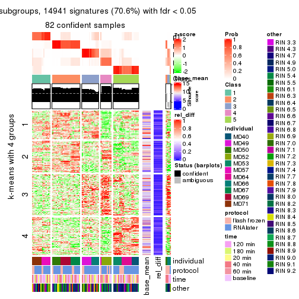</p>

</div>
<div id='tab-CV-skmeans-get-signatures-5'>
<pre><code class="r">get_signatures(res, k = 6)
</code></pre>

<p></p>

</div>
</div>


Signature heatmaps where rows are not scaled:


<script>
$( function() {
	$( '#tabs-CV-skmeans-get-signatures-no-scale' ).tabs();
} );
</script>
<div id='tabs-CV-skmeans-get-signatures-no-scale'>
<ul>
<li><a href='#tab-CV-skmeans-get-signatures-no-scale-1'>k = 2</a></li>
<li><a href='#tab-CV-skmeans-get-signatures-no-scale-2'>k = 3</a></li>
<li><a href='#tab-CV-skmeans-get-signatures-no-scale-3'>k = 4</a></li>
<li><a href='#tab-CV-skmeans-get-signatures-no-scale-4'>k = 5</a></li>
<li><a href='#tab-CV-skmeans-get-signatures-no-scale-5'>k = 6</a></li>
</ul>
<div id='tab-CV-skmeans-get-signatures-no-scale-1'>
<pre><code class="r">get_signatures(res, k = 2, scale_rows = FALSE)
</code></pre>

<p></p>

</div>
<div id='tab-CV-skmeans-get-signatures-no-scale-2'>
<pre><code class="r">get_signatures(res, k = 3, scale_rows = FALSE)
</code></pre>

<p></p>

</div>
<div id='tab-CV-skmeans-get-signatures-no-scale-3'>
<pre><code class="r">get_signatures(res, k = 4, scale_rows = FALSE)
</code></pre>

<p></p>

</div>
<div id='tab-CV-skmeans-get-signatures-no-scale-4'>
<pre><code class="r">get_signatures(res, k = 5, scale_rows = FALSE)
</code></pre>

<p></p>

</div>
<div id='tab-CV-skmeans-get-signatures-no-scale-5'>
<pre><code class="r">get_signatures(res, k = 6, scale_rows = FALSE)
</code></pre>

<p></p>

</div>
</div>


Compare the overlap of signatures from different k:

```r
compare_signatures(res)
```


`get_signature()` returns a data frame invisibly. TO get the list of signatures, the function
call should be assigned to a variable explicitly. In following code, if `plot` argument is set
to `FALSE`, no heatmap is plotted while only the differential analysis is performed.

```r
# code only for demonstration
tb = get_signature(res, k = ..., plot = FALSE)
```

An example of the output of `tb` is:

```
#>   which_row         fdr    mean_1    mean_2 scaled_mean_1 scaled_mean_2 km
#> 1        38 0.042760348  8.373488  9.131774    -0.5533452     0.5164555  1
#> 2        40 0.018707592  7.106213  8.469186    -0.6173731     0.5762149  1
#> 3        55 0.019134737 10.221463 11.207825    -0.6159697     0.5749050  1
#> 4        59 0.006059896  5.921854  7.869574    -0.6899429     0.6439467  1
#> 5        60 0.018055526  8.928898 10.211722    -0.6204761     0.5791110  1
#> 6        98 0.009384629 15.714769 14.887706     0.6635654    -0.6193277  2
...
```

The columns in `tb` are:

1. `which_row`: row indices corresponding to the input matrix.
2. `fdr`: FDR for the differential test. 
3. `mean_x`: The mean value in group x.
4. `scaled_mean_x`: The mean value in group x after rows are scaled.
5. `km`: Row groups if k-means clustering is applied to rows.


UMAP plot which shows how samples are separated.


<script>
$( function() {
	$( '#tabs-CV-skmeans-dimension-reduction' ).tabs();
} );
</script>
<div id='tabs-CV-skmeans-dimension-reduction'>
<ul>
<li><a href='#tab-CV-skmeans-dimension-reduction-1'>k = 2</a></li>
<li><a href='#tab-CV-skmeans-dimension-reduction-2'>k = 3</a></li>
<li><a href='#tab-CV-skmeans-dimension-reduction-3'>k = 4</a></li>
<li><a href='#tab-CV-skmeans-dimension-reduction-4'>k = 5</a></li>
<li><a href='#tab-CV-skmeans-dimension-reduction-5'>k = 6</a></li>
</ul>
<div id='tab-CV-skmeans-dimension-reduction-1'>
<pre><code class="r">dimension_reduction(res, k = 2, method = &quot;UMAP&quot;)
</code></pre>

<p></p>

</div>
<div id='tab-CV-skmeans-dimension-reduction-2'>
<pre><code class="r">dimension_reduction(res, k = 3, method = &quot;UMAP&quot;)
</code></pre>

<p></p>

</div>
<div id='tab-CV-skmeans-dimension-reduction-3'>
<pre><code class="r">dimension_reduction(res, k = 4, method = &quot;UMAP&quot;)
</code></pre>

<p></p>

</div>
<div id='tab-CV-skmeans-dimension-reduction-4'>
<pre><code class="r">dimension_reduction(res, k = 5, method = &quot;UMAP&quot;)
</code></pre>

<p></p>

</div>
<div id='tab-CV-skmeans-dimension-reduction-5'>
<pre><code class="r">dimension_reduction(res, k = 6, method = &quot;UMAP&quot;)
</code></pre>

<p></p>

</div>
</div>


Following heatmap shows how subgroups are split when increasing `k`:

```r
collect_classes(res)
```


Test correlation between subgroups and known annotations. If the known
annotation is numeric, one-way ANOVA test is applied, and if the known
annotation is discrete, chi-squared contingency table test is applied.

```r
test_to_known_factors(res)
```

```
#>             n individual(p) protocol(p) time(p) other(p) k
#> CV:skmeans 51      9.46e-07       0.290   0.948   0.0487 2
#> CV:skmeans 81      7.24e-20       0.206   1.000   0.2878 3
#> CV:skmeans 81      1.21e-33       0.710   1.000   0.0851 4
#> CV:skmeans 82      1.86e-44       0.865   1.000   0.0129 5
#> CV:skmeans 82      1.43e-55       0.906   1.000   0.0580 6
```


If matrix rows can be associated to genes, consider to use `functional_enrichment(res,
...)` to perform function enrichment for the signature genes. See [this vignette](http://bioconductor.org/packages/devel/bioc/vignettes/cola/inst/doc/functional_enrichment.html) for more detailed explanations.


 

---------------------------------------------------


### CV:pam


The object with results only for a single top-value method and a single partition method 
can be extracted as:

```r
res = res_list["CV", "pam"]
# you can also extract it by
# res = res_list["CV:pam"]
```

A summary of `res` and all the functions that can be applied to it:

```r
res
```

```
#> A 'ConsensusPartition' object with k = 2, 3, 4, 5, 6.
#>   On a matrix with 21168 rows and 86 columns.
#>   Top rows (1000, 2000, 3000, 4000, 5000) are extracted by 'CV' method.
#>   Subgroups are detected by 'pam' method.
#>   Performed in total 1250 partitions by row resampling.
#>   Best k for subgroups seems to be 2.
#> 
#> Following methods can be applied to this 'ConsensusPartition' object:
#>  [1] "cola_report"             "collect_classes"         "collect_plots"          
#>  [4] "collect_stats"           "colnames"                "compare_signatures"     
#>  [7] "consensus_heatmap"       "dimension_reduction"     "functional_enrichment"  
#> [10] "get_anno_col"            "get_anno"                "get_classes"            
#> [13] "get_consensus"           "get_matrix"              "get_membership"         
#> [16] "get_param"               "get_signatures"          "get_stats"              
#> [19] "is_best_k"               "is_stable_k"             "membership_heatmap"     
#> [22] "ncol"                    "nrow"                    "plot_ecdf"              
#> [25] "rownames"                "select_partition_number" "show"                   
#> [28] "suggest_best_k"          "test_to_known_factors"
```

`collect_plots()` function collects all the plots made from `res` for all `k` (number of partitions)
into one single page to provide an easy and fast comparison between different `k`.

```r
collect_plots(res)
```


The plots are:

- The first row: a plot of the ECDF (empirical cumulative distribution
  function) curves of the consensus matrix for each `k` and the heatmap of
  predicted classes for each `k`.
- The second row: heatmaps of the consensus matrix for each `k`.
- The third row: heatmaps of the membership matrix for each `k`.
- The fouth row: heatmaps of the signatures for each `k`.

All the plots in panels can be made by individual functions and they are
plotted later in this section.

`select_partition_number()` produces several plots showing different
statistics for choosing "optimized" `k`. There are following statistics:

- ECDF curves of the consensus matrix for each `k`;
- 1-PAC. [The PAC
  score](https://en.wikipedia.org/wiki/Consensus_clustering#Over-interpretation_potential_of_consensus_clustering)
  measures the proportion of the ambiguous subgrouping.
- Mean silhouette score.
- Concordance. The mean probability of fiting the consensus class ids in all
  partitions.
- Area increased. Denote $A_k$ as the area under the ECDF curve for current
  `k`, the area increased is defined as $A_k - A_{k-1}$.
- Rand index. The percent of pairs of samples that are both in a same cluster
  or both are not in a same cluster in the partition of k and k-1.
- Jaccard index. The ratio of pairs of samples are both in a same cluster in
  the partition of k and k-1 and the pairs of samples are both in a same
  cluster in the partition k or k-1.

The detailed explanations of these statistics can be found in [the _cola_
vignette](http://bioconductor.org/packages/devel/bioc/vignettes/cola/inst/doc/cola.html#toc_13).

Generally speaking, lower PAC score, higher mean silhouette score or higher
concordance corresponds to better partition. Rand index and Jaccard index
measure how similar the current partition is compared to partition with `k-1`.
If they are too similar, we won't accept `k` is better than `k-1`.

```r
select_partition_number(res)
```


The numeric values for all these statistics can be obtained by `get_stats()`.

```r
get_stats(res)
```

```
#>   k 1-PAC mean_silhouette concordance area_increased  Rand Jaccard
#> 2 2 0.832           0.906       0.958          0.483 0.512   0.512
#> 3 3 0.786           0.877       0.944          0.253 0.880   0.765
#> 4 4 0.724           0.824       0.910          0.111 0.914   0.786
#> 5 5 0.787           0.858       0.910          0.063 0.962   0.886
#> 6 6 0.735           0.596       0.785          0.075 0.919   0.747
```

`suggest_best_k()` suggests the best $k$ based on these statistics. The rules are as follows:

- All $k$ with Jaccard index larger than 0.95 are removed because increasing
  $k$ does not provide enough extra information. If all $k$ are removed, it is
  marked as no subgroup is detected.
- For all $k$ with 1-PAC score larger than 0.9, the maximal $k$ is taken as
  the best $k$, and other $k$ are marked as optional $k$.
- If it does not fit the second rule. The $k$ with the maximal vote of the
  highest 1-PAC score, highest mean silhouette, and highest concordance is
  taken as the best $k$.

```r
suggest_best_k(res)
```

```
#> [1] 2
```


Following shows the table of the partitions (You need to click the **show/hide
code output** link to see it). The membership matrix (columns with name `p*`)
is inferred by
[`clue::cl_consensus()`](https://www.rdocumentation.org/link/cl_consensus?package=clue)
function with the `SE` method. Basically the value in the membership matrix
represents the probability to belong to a certain group. The finall class
label for an item is determined with the group with highest probability it
belongs to.

In `get_classes()` function, the entropy is calculated from the membership
matrix and the silhouette score is calculated from the consensus matrix.


<script>
$( function() {
	$( '#tabs-CV-pam-get-classes' ).tabs();
} );
</script>
<div id='tabs-CV-pam-get-classes'>
<ul>
<li><a href='#tab-CV-pam-get-classes-1'>k = 2</a></li>
<li><a href='#tab-CV-pam-get-classes-2'>k = 3</a></li>
<li><a href='#tab-CV-pam-get-classes-3'>k = 4</a></li>
<li><a href='#tab-CV-pam-get-classes-4'>k = 5</a></li>
<li><a href='#tab-CV-pam-get-classes-5'>k = 6</a></li>
</ul>

<div id='tab-CV-pam-get-classes-1'>
<p><a id='tab-CV-pam-get-classes-1-a' style='color:#0366d6' href='#'>show/hide code output</a></p>
<pre><code class="r">cbind(get_classes(res, k = 2), get_membership(res, k = 2))
</code></pre>

<pre><code>#&gt;           class entropy silhouette    p1    p2
#&gt; GSM614415     1  0.0000      0.932 1.000 0.000
#&gt; GSM614416     1  0.0000      0.932 1.000 0.000
#&gt; GSM614417     1  0.0000      0.932 1.000 0.000
#&gt; GSM614418     1  0.0000      0.932 1.000 0.000
#&gt; GSM614419     1  0.0376      0.930 0.996 0.004
#&gt; GSM614420     1  0.3274      0.894 0.940 0.060
#&gt; GSM614421     2  0.0938      0.968 0.012 0.988
#&gt; GSM614422     1  0.9954      0.174 0.540 0.460
#&gt; GSM614423     1  0.8144      0.679 0.748 0.252
#&gt; GSM614424     2  0.3114      0.930 0.056 0.944
#&gt; GSM614425     2  0.7674      0.712 0.224 0.776
#&gt; GSM614426     2  0.0938      0.967 0.012 0.988
#&gt; GSM614427     2  0.0672      0.970 0.008 0.992
#&gt; GSM614428     2  0.0376      0.971 0.004 0.996
#&gt; GSM614429     2  0.0376      0.971 0.004 0.996
#&gt; GSM614430     2  0.0376      0.971 0.004 0.996
#&gt; GSM614431     2  0.0376      0.971 0.004 0.996
#&gt; GSM614432     2  0.0376      0.971 0.004 0.996
#&gt; GSM614433     2  0.0376      0.971 0.004 0.996
#&gt; GSM614434     2  0.0376      0.971 0.004 0.996
#&gt; GSM614435     2  0.0376      0.971 0.004 0.996
#&gt; GSM614436     2  0.0376      0.971 0.004 0.996
#&gt; GSM614437     2  0.0000      0.970 0.000 1.000
#&gt; GSM614438     2  0.0000      0.970 0.000 1.000
#&gt; GSM614439     2  0.0000      0.970 0.000 1.000
#&gt; GSM614440     2  0.0000      0.970 0.000 1.000
#&gt; GSM614441     2  0.0000      0.970 0.000 1.000
#&gt; GSM614442     2  0.0000      0.970 0.000 1.000
#&gt; GSM614443     2  0.0000      0.970 0.000 1.000
#&gt; GSM614444     2  0.0000      0.970 0.000 1.000
#&gt; GSM614391     1  0.0000      0.932 1.000 0.000
#&gt; GSM614392     1  0.0000      0.932 1.000 0.000
#&gt; GSM614393     1  0.0000      0.932 1.000 0.000
#&gt; GSM614394     1  0.0000      0.932 1.000 0.000
#&gt; GSM614395     2  0.1184      0.966 0.016 0.984
#&gt; GSM614396     1  0.0000      0.932 1.000 0.000
#&gt; GSM614397     2  0.1843      0.957 0.028 0.972
#&gt; GSM614398     1  0.9209      0.512 0.664 0.336
#&gt; GSM614399     1  0.9983      0.151 0.524 0.476
#&gt; GSM614400     1  0.1184      0.923 0.984 0.016
#&gt; GSM614401     1  0.0000      0.932 1.000 0.000
#&gt; GSM614402     1  0.3431      0.889 0.936 0.064
#&gt; GSM614403     2  0.8081      0.658 0.248 0.752
#&gt; GSM614404     1  0.0000      0.932 1.000 0.000
#&gt; GSM614405     1  0.8443      0.643 0.728 0.272
#&gt; GSM614406     2  0.0000      0.970 0.000 1.000
#&gt; GSM614407     1  0.0000      0.932 1.000 0.000
#&gt; GSM614408     1  0.0000      0.932 1.000 0.000
#&gt; GSM614409     1  0.0000      0.932 1.000 0.000
#&gt; GSM614410     1  0.0000      0.932 1.000 0.000
#&gt; GSM614411     1  0.0000      0.932 1.000 0.000
#&gt; GSM614412     1  0.5059      0.852 0.888 0.112
#&gt; GSM614413     2  0.7139      0.757 0.196 0.804
#&gt; GSM614414     2  0.2236      0.950 0.036 0.964
#&gt; GSM614445     2  0.0376      0.971 0.004 0.996
#&gt; GSM614446     2  0.8499      0.612 0.276 0.724
#&gt; GSM614447     2  0.1184      0.965 0.016 0.984
#&gt; GSM614448     2  0.0938      0.968 0.012 0.988
#&gt; GSM614449     2  0.0376      0.971 0.004 0.996
#&gt; GSM614450     2  0.2236      0.949 0.036 0.964
#&gt; GSM614451     2  0.0376      0.971 0.004 0.996
#&gt; GSM614452     2  0.0376      0.971 0.004 0.996
#&gt; GSM614453     2  0.0000      0.970 0.000 1.000
#&gt; GSM614454     2  0.0000      0.970 0.000 1.000
#&gt; GSM614455     2  0.0000      0.970 0.000 1.000
#&gt; GSM614456     2  0.0000      0.970 0.000 1.000
#&gt; GSM614457     2  0.0000      0.970 0.000 1.000
#&gt; GSM614458     2  0.0376      0.971 0.004 0.996
#&gt; GSM614459     2  0.0000      0.970 0.000 1.000
#&gt; GSM614460     2  0.0000      0.970 0.000 1.000
#&gt; GSM614461     2  0.0376      0.971 0.004 0.996
#&gt; GSM614462     2  0.0376      0.971 0.004 0.996
#&gt; GSM614463     1  0.6343      0.801 0.840 0.160
#&gt; GSM614464     2  0.0376      0.971 0.004 0.996
#&gt; GSM614465     2  0.1843      0.957 0.028 0.972
#&gt; GSM614466     2  0.5178      0.866 0.116 0.884
#&gt; GSM614467     2  0.0376      0.971 0.004 0.996
#&gt; GSM614468     2  0.0376      0.971 0.004 0.996
#&gt; GSM614469     1  0.0000      0.932 1.000 0.000
#&gt; GSM614470     1  0.0000      0.932 1.000 0.000
#&gt; GSM614471     1  0.0000      0.932 1.000 0.000
#&gt; GSM614472     1  0.0000      0.932 1.000 0.000
#&gt; GSM614473     1  0.0000      0.932 1.000 0.000
#&gt; GSM614474     1  0.0000      0.932 1.000 0.000
#&gt; GSM614475     1  0.0000      0.932 1.000 0.000
#&gt; GSM614476     1  0.0000      0.932 1.000 0.000
</code></pre>

<script>
$('#tab-CV-pam-get-classes-1-a').parent().next().next().hide();
$('#tab-CV-pam-get-classes-1-a').click(function(){
  $('#tab-CV-pam-get-classes-1-a').parent().next().next().toggle();
  return(false);
});
</script>
</div>

<div id='tab-CV-pam-get-classes-2'>
<p><a id='tab-CV-pam-get-classes-2-a' style='color:#0366d6' href='#'>show/hide code output</a></p>
<pre><code class="r">cbind(get_classes(res, k = 3), get_membership(res, k = 3))
</code></pre>

<pre><code>#&gt;           class entropy silhouette    p1    p2    p3
#&gt; GSM614415     1  0.0237      0.904 0.996 0.000 0.004
#&gt; GSM614416     1  0.0237      0.904 0.996 0.000 0.004
#&gt; GSM614417     1  0.0237      0.904 0.996 0.000 0.004
#&gt; GSM614418     1  0.0237      0.904 0.996 0.000 0.004
#&gt; GSM614419     1  0.0475      0.903 0.992 0.004 0.004
#&gt; GSM614420     1  0.2384      0.864 0.936 0.056 0.008
#&gt; GSM614421     2  0.0661      0.950 0.008 0.988 0.004
#&gt; GSM614422     1  0.6509      0.117 0.524 0.472 0.004
#&gt; GSM614423     1  0.5517      0.640 0.728 0.268 0.004
#&gt; GSM614424     2  0.1989      0.923 0.048 0.948 0.004
#&gt; GSM614425     2  0.4409      0.788 0.172 0.824 0.004
#&gt; GSM614426     2  0.0983      0.947 0.016 0.980 0.004
#&gt; GSM614427     2  0.1129      0.945 0.020 0.976 0.004
#&gt; GSM614428     2  0.0848      0.949 0.008 0.984 0.008
#&gt; GSM614429     2  0.0000      0.951 0.000 1.000 0.000
#&gt; GSM614430     2  0.0000      0.951 0.000 1.000 0.000
#&gt; GSM614431     2  0.0000      0.951 0.000 1.000 0.000
#&gt; GSM614432     2  0.0000      0.951 0.000 1.000 0.000
#&gt; GSM614433     2  0.0000      0.951 0.000 1.000 0.000
#&gt; GSM614434     2  0.0000      0.951 0.000 1.000 0.000
#&gt; GSM614435     2  0.0000      0.951 0.000 1.000 0.000
#&gt; GSM614436     2  0.0000      0.951 0.000 1.000 0.000
#&gt; GSM614437     3  0.0424      0.946 0.000 0.008 0.992
#&gt; GSM614438     3  0.0424      0.946 0.000 0.008 0.992
#&gt; GSM614439     3  0.0424      0.946 0.000 0.008 0.992
#&gt; GSM614440     3  0.0237      0.943 0.000 0.004 0.996
#&gt; GSM614441     3  0.0424      0.946 0.000 0.008 0.992
#&gt; GSM614442     3  0.0424      0.946 0.000 0.008 0.992
#&gt; GSM614443     3  0.0424      0.946 0.000 0.008 0.992
#&gt; GSM614444     3  0.0424      0.946 0.000 0.008 0.992
#&gt; GSM614391     1  0.0237      0.904 0.996 0.000 0.004
#&gt; GSM614392     1  0.0237      0.904 0.996 0.000 0.004
#&gt; GSM614393     1  0.0237      0.904 0.996 0.000 0.004
#&gt; GSM614394     1  0.0237      0.904 0.996 0.000 0.004
#&gt; GSM614395     3  0.5551      0.751 0.016 0.224 0.760
#&gt; GSM614396     1  0.0237      0.904 0.996 0.000 0.004
#&gt; GSM614397     2  0.2297      0.929 0.036 0.944 0.020
#&gt; GSM614398     1  0.6252      0.488 0.648 0.344 0.008
#&gt; GSM614399     1  0.6291      0.205 0.532 0.468 0.000
#&gt; GSM614400     1  0.1031      0.894 0.976 0.024 0.000
#&gt; GSM614401     1  0.0424      0.904 0.992 0.008 0.000
#&gt; GSM614402     1  0.3267      0.818 0.884 0.116 0.000
#&gt; GSM614403     2  0.5327      0.604 0.272 0.728 0.000
#&gt; GSM614404     1  0.0424      0.904 0.992 0.008 0.000
#&gt; GSM614405     1  0.6301      0.619 0.712 0.260 0.028
#&gt; GSM614406     2  0.3619      0.851 0.000 0.864 0.136
#&gt; GSM614407     1  0.0237      0.905 0.996 0.004 0.000
#&gt; GSM614408     1  0.0000      0.904 1.000 0.000 0.000
#&gt; GSM614409     1  0.0237      0.905 0.996 0.004 0.000
#&gt; GSM614410     1  0.0237      0.905 0.996 0.004 0.000
#&gt; GSM614411     1  0.0424      0.904 0.992 0.008 0.000
#&gt; GSM614412     1  0.4062      0.772 0.836 0.164 0.000
#&gt; GSM614413     2  0.4575      0.772 0.184 0.812 0.004
#&gt; GSM614414     2  0.1647      0.935 0.036 0.960 0.004
#&gt; GSM614445     2  0.0000      0.951 0.000 1.000 0.000
#&gt; GSM614446     2  0.4978      0.722 0.216 0.780 0.004
#&gt; GSM614447     2  0.0424      0.950 0.008 0.992 0.000
#&gt; GSM614448     2  0.0848      0.949 0.008 0.984 0.008
#&gt; GSM614449     2  0.0237      0.950 0.000 0.996 0.004
#&gt; GSM614450     2  0.1129      0.945 0.020 0.976 0.004
#&gt; GSM614451     3  0.3619      0.867 0.000 0.136 0.864
#&gt; GSM614452     3  0.3752      0.860 0.000 0.144 0.856
#&gt; GSM614453     2  0.0237      0.950 0.000 0.996 0.004
#&gt; GSM614454     2  0.0592      0.948 0.000 0.988 0.012
#&gt; GSM614455     2  0.2796      0.891 0.000 0.908 0.092
#&gt; GSM614456     2  0.1163      0.940 0.000 0.972 0.028
#&gt; GSM614457     2  0.0892      0.944 0.000 0.980 0.020
#&gt; GSM614458     2  0.0000      0.951 0.000 1.000 0.000
#&gt; GSM614459     2  0.3482      0.855 0.000 0.872 0.128
#&gt; GSM614460     2  0.0237      0.950 0.000 0.996 0.004
#&gt; GSM614461     2  0.0000      0.951 0.000 1.000 0.000
#&gt; GSM614462     2  0.0237      0.951 0.004 0.996 0.000
#&gt; GSM614463     1  0.5431      0.625 0.716 0.284 0.000
#&gt; GSM614464     2  0.0000      0.951 0.000 1.000 0.000
#&gt; GSM614465     2  0.1031      0.944 0.024 0.976 0.000
#&gt; GSM614466     2  0.2261      0.908 0.068 0.932 0.000
#&gt; GSM614467     2  0.0000      0.951 0.000 1.000 0.000
#&gt; GSM614468     2  0.0000      0.951 0.000 1.000 0.000
#&gt; GSM614469     1  0.0237      0.905 0.996 0.004 0.000
#&gt; GSM614470     1  0.0237      0.905 0.996 0.004 0.000
#&gt; GSM614471     1  0.0237      0.905 0.996 0.004 0.000
#&gt; GSM614472     1  0.0237      0.905 0.996 0.004 0.000
#&gt; GSM614473     1  0.0237      0.905 0.996 0.004 0.000
#&gt; GSM614474     1  0.0237      0.905 0.996 0.004 0.000
#&gt; GSM614475     1  0.0237      0.905 0.996 0.004 0.000
#&gt; GSM614476     1  0.0237      0.905 0.996 0.004 0.000
</code></pre>

<script>
$('#tab-CV-pam-get-classes-2-a').parent().next().next().hide();
$('#tab-CV-pam-get-classes-2-a').click(function(){
  $('#tab-CV-pam-get-classes-2-a').parent().next().next().toggle();
  return(false);
});
</script>
</div>

<div id='tab-CV-pam-get-classes-3'>
<p><a id='tab-CV-pam-get-classes-3-a' style='color:#0366d6' href='#'>show/hide code output</a></p>
<pre><code class="r">cbind(get_classes(res, k = 4), get_membership(res, k = 4))
</code></pre>

<pre><code>#&gt;           class entropy silhouette    p1    p2    p3    p4
#&gt; GSM614415     3  0.2469      0.823 0.108 0.000 0.892 0.000
#&gt; GSM614416     3  0.2469      0.823 0.108 0.000 0.892 0.000
#&gt; GSM614417     3  0.2469      0.823 0.108 0.000 0.892 0.000
#&gt; GSM614418     3  0.2408      0.821 0.104 0.000 0.896 0.000
#&gt; GSM614419     3  0.2469      0.823 0.108 0.000 0.892 0.000
#&gt; GSM614420     3  0.2216      0.809 0.092 0.000 0.908 0.000
#&gt; GSM614421     2  0.1890      0.914 0.008 0.936 0.056 0.000
#&gt; GSM614422     2  0.6252      0.200 0.432 0.512 0.056 0.000
#&gt; GSM614423     1  0.5035      0.597 0.748 0.196 0.056 0.000
#&gt; GSM614424     2  0.2840      0.899 0.044 0.900 0.056 0.000
#&gt; GSM614425     2  0.4465      0.807 0.144 0.800 0.056 0.000
#&gt; GSM614426     2  0.2363      0.910 0.024 0.920 0.056 0.000
#&gt; GSM614427     2  0.2565      0.905 0.032 0.912 0.056 0.000
#&gt; GSM614428     2  0.2076      0.912 0.008 0.932 0.056 0.004
#&gt; GSM614429     2  0.0000      0.929 0.000 1.000 0.000 0.000
#&gt; GSM614430     2  0.0000      0.929 0.000 1.000 0.000 0.000
#&gt; GSM614431     2  0.0188      0.929 0.004 0.996 0.000 0.000
#&gt; GSM614432     2  0.0000      0.929 0.000 1.000 0.000 0.000
#&gt; GSM614433     2  0.0188      0.929 0.004 0.996 0.000 0.000
#&gt; GSM614434     2  0.0336      0.929 0.008 0.992 0.000 0.000
#&gt; GSM614435     2  0.0000      0.929 0.000 1.000 0.000 0.000
#&gt; GSM614436     2  0.0000      0.929 0.000 1.000 0.000 0.000
#&gt; GSM614437     4  0.0000      0.927 0.000 0.000 0.000 1.000
#&gt; GSM614438     4  0.0000      0.927 0.000 0.000 0.000 1.000
#&gt; GSM614439     4  0.0000      0.927 0.000 0.000 0.000 1.000
#&gt; GSM614440     4  0.0000      0.927 0.000 0.000 0.000 1.000
#&gt; GSM614441     4  0.0000      0.927 0.000 0.000 0.000 1.000
#&gt; GSM614442     4  0.0000      0.927 0.000 0.000 0.000 1.000
#&gt; GSM614443     4  0.0000      0.927 0.000 0.000 0.000 1.000
#&gt; GSM614444     4  0.0000      0.927 0.000 0.000 0.000 1.000
#&gt; GSM614391     3  0.4907      0.450 0.420 0.000 0.580 0.000
#&gt; GSM614392     1  0.4008      0.564 0.756 0.000 0.244 0.000
#&gt; GSM614393     1  0.4454      0.421 0.692 0.000 0.308 0.000
#&gt; GSM614394     3  0.4776      0.565 0.376 0.000 0.624 0.000
#&gt; GSM614395     4  0.5747      0.701 0.008 0.140 0.120 0.732
#&gt; GSM614396     3  0.4697      0.588 0.356 0.000 0.644 0.000
#&gt; GSM614397     2  0.4746      0.689 0.004 0.712 0.276 0.008
#&gt; GSM614398     3  0.5751      0.618 0.164 0.124 0.712 0.000
#&gt; GSM614399     1  0.4830      0.370 0.608 0.392 0.000 0.000
#&gt; GSM614400     1  0.0921      0.845 0.972 0.028 0.000 0.000
#&gt; GSM614401     1  0.0469      0.853 0.988 0.012 0.000 0.000
#&gt; GSM614402     1  0.2081      0.795 0.916 0.084 0.000 0.000
#&gt; GSM614403     2  0.5300      0.515 0.308 0.664 0.028 0.000
#&gt; GSM614404     1  0.0707      0.848 0.980 0.020 0.000 0.000
#&gt; GSM614405     1  0.5005      0.501 0.712 0.264 0.004 0.020
#&gt; GSM614406     2  0.3024      0.842 0.000 0.852 0.000 0.148
#&gt; GSM614407     1  0.0000      0.856 1.000 0.000 0.000 0.000
#&gt; GSM614408     1  0.0188      0.853 0.996 0.000 0.004 0.000
#&gt; GSM614409     1  0.0336      0.854 0.992 0.008 0.000 0.000
#&gt; GSM614410     1  0.0000      0.856 1.000 0.000 0.000 0.000
#&gt; GSM614411     1  0.0336      0.855 0.992 0.008 0.000 0.000
#&gt; GSM614412     1  0.3494      0.682 0.824 0.172 0.004 0.000
#&gt; GSM614413     2  0.4234      0.824 0.132 0.816 0.052 0.000
#&gt; GSM614414     2  0.2174      0.913 0.020 0.928 0.052 0.000
#&gt; GSM614445     2  0.0188      0.929 0.000 0.996 0.004 0.000
#&gt; GSM614446     2  0.4332      0.780 0.176 0.792 0.032 0.000
#&gt; GSM614447     2  0.1297      0.926 0.016 0.964 0.020 0.000
#&gt; GSM614448     2  0.1890      0.914 0.008 0.936 0.056 0.000
#&gt; GSM614449     2  0.1743      0.914 0.004 0.940 0.056 0.000
#&gt; GSM614450     2  0.1510      0.923 0.016 0.956 0.028 0.000
#&gt; GSM614451     4  0.3979      0.810 0.004 0.096 0.056 0.844
#&gt; GSM614452     4  0.4102      0.801 0.004 0.104 0.056 0.836
#&gt; GSM614453     2  0.0000      0.929 0.000 1.000 0.000 0.000
#&gt; GSM614454     2  0.0592      0.927 0.000 0.984 0.000 0.016
#&gt; GSM614455     2  0.2216      0.883 0.000 0.908 0.000 0.092
#&gt; GSM614456     2  0.0707      0.925 0.000 0.980 0.000 0.020
#&gt; GSM614457     2  0.0817      0.924 0.000 0.976 0.000 0.024
#&gt; GSM614458     2  0.0000      0.929 0.000 1.000 0.000 0.000
#&gt; GSM614459     2  0.2921      0.848 0.000 0.860 0.000 0.140
#&gt; GSM614460     2  0.0188      0.929 0.000 0.996 0.000 0.004
#&gt; GSM614461     2  0.0000      0.929 0.000 1.000 0.000 0.000
#&gt; GSM614462     2  0.0188      0.929 0.004 0.996 0.000 0.000
#&gt; GSM614463     1  0.4250      0.533 0.724 0.276 0.000 0.000
#&gt; GSM614464     2  0.0000      0.929 0.000 1.000 0.000 0.000
#&gt; GSM614465     2  0.0817      0.923 0.024 0.976 0.000 0.000
#&gt; GSM614466     2  0.1867      0.894 0.072 0.928 0.000 0.000
#&gt; GSM614467     2  0.0000      0.929 0.000 1.000 0.000 0.000
#&gt; GSM614468     2  0.0000      0.929 0.000 1.000 0.000 0.000
#&gt; GSM614469     1  0.0000      0.856 1.000 0.000 0.000 0.000
#&gt; GSM614470     1  0.0000      0.856 1.000 0.000 0.000 0.000
#&gt; GSM614471     1  0.0188      0.854 0.996 0.004 0.000 0.000
#&gt; GSM614472     1  0.0000      0.856 1.000 0.000 0.000 0.000
#&gt; GSM614473     1  0.0000      0.856 1.000 0.000 0.000 0.000
#&gt; GSM614474     1  0.0000      0.856 1.000 0.000 0.000 0.000
#&gt; GSM614475     1  0.0000      0.856 1.000 0.000 0.000 0.000
#&gt; GSM614476     1  0.0000      0.856 1.000 0.000 0.000 0.000
</code></pre>

<script>
$('#tab-CV-pam-get-classes-3-a').parent().next().next().hide();
$('#tab-CV-pam-get-classes-3-a').click(function(){
  $('#tab-CV-pam-get-classes-3-a').parent().next().next().toggle();
  return(false);
});
</script>
</div>

<div id='tab-CV-pam-get-classes-4'>
<p><a id='tab-CV-pam-get-classes-4-a' style='color:#0366d6' href='#'>show/hide code output</a></p>
<pre><code class="r">cbind(get_classes(res, k = 5), get_membership(res, k = 5))
</code></pre>

<pre><code>#&gt;           class entropy silhouette    p1    p2    p3    p4    p5
#&gt; GSM614415     3  0.0162      1.000 0.004 0.000 0.996 0.000 0.000
#&gt; GSM614416     3  0.0162      1.000 0.004 0.000 0.996 0.000 0.000
#&gt; GSM614417     3  0.0162      1.000 0.004 0.000 0.996 0.000 0.000
#&gt; GSM614418     3  0.0162      1.000 0.004 0.000 0.996 0.000 0.000
#&gt; GSM614419     3  0.0162      1.000 0.004 0.000 0.996 0.000 0.000
#&gt; GSM614420     3  0.0162      1.000 0.004 0.000 0.996 0.000 0.000
#&gt; GSM614421     2  0.3243      0.841 0.004 0.812 0.004 0.000 0.180
#&gt; GSM614422     2  0.6421      0.433 0.300 0.516 0.004 0.000 0.180
#&gt; GSM614423     1  0.5246      0.597 0.692 0.124 0.004 0.000 0.180
#&gt; GSM614424     2  0.3670      0.835 0.020 0.796 0.004 0.000 0.180
#&gt; GSM614425     2  0.4767      0.790 0.084 0.732 0.004 0.000 0.180
#&gt; GSM614426     2  0.3844      0.832 0.028 0.788 0.004 0.000 0.180
#&gt; GSM614427     2  0.3742      0.834 0.020 0.788 0.004 0.000 0.188
#&gt; GSM614428     2  0.3644      0.836 0.008 0.800 0.004 0.008 0.180
#&gt; GSM614429     2  0.0000      0.904 0.000 1.000 0.000 0.000 0.000
#&gt; GSM614430     2  0.0000      0.904 0.000 1.000 0.000 0.000 0.000
#&gt; GSM614431     2  0.0162      0.904 0.004 0.996 0.000 0.000 0.000
#&gt; GSM614432     2  0.0000      0.904 0.000 1.000 0.000 0.000 0.000
#&gt; GSM614433     2  0.0162      0.904 0.004 0.996 0.000 0.000 0.000
#&gt; GSM614434     2  0.0404      0.905 0.012 0.988 0.000 0.000 0.000
#&gt; GSM614435     2  0.0000      0.904 0.000 1.000 0.000 0.000 0.000
#&gt; GSM614436     2  0.0162      0.904 0.000 0.996 0.000 0.000 0.004
#&gt; GSM614437     4  0.0000      0.942 0.000 0.000 0.000 1.000 0.000
#&gt; GSM614438     4  0.0000      0.942 0.000 0.000 0.000 1.000 0.000
#&gt; GSM614439     4  0.0000      0.942 0.000 0.000 0.000 1.000 0.000
#&gt; GSM614440     4  0.0000      0.942 0.000 0.000 0.000 1.000 0.000
#&gt; GSM614441     4  0.0000      0.942 0.000 0.000 0.000 1.000 0.000
#&gt; GSM614442     4  0.0000      0.942 0.000 0.000 0.000 1.000 0.000
#&gt; GSM614443     4  0.0000      0.942 0.000 0.000 0.000 1.000 0.000
#&gt; GSM614444     4  0.0000      0.942 0.000 0.000 0.000 1.000 0.000
#&gt; GSM614391     5  0.4078      0.854 0.068 0.000 0.148 0.000 0.784
#&gt; GSM614392     5  0.4149      0.860 0.088 0.000 0.128 0.000 0.784
#&gt; GSM614393     5  0.4096      0.853 0.072 0.000 0.144 0.000 0.784
#&gt; GSM614394     5  0.4117      0.860 0.096 0.000 0.116 0.000 0.788
#&gt; GSM614395     5  0.1764      0.781 0.000 0.008 0.000 0.064 0.928
#&gt; GSM614396     5  0.3758      0.864 0.096 0.000 0.088 0.000 0.816
#&gt; GSM614397     5  0.2077      0.810 0.000 0.040 0.040 0.000 0.920
#&gt; GSM614398     5  0.1597      0.818 0.012 0.000 0.048 0.000 0.940
#&gt; GSM614399     1  0.4138      0.476 0.616 0.384 0.000 0.000 0.000
#&gt; GSM614400     1  0.1282      0.866 0.952 0.044 0.000 0.000 0.004
#&gt; GSM614401     1  0.0703      0.876 0.976 0.024 0.000 0.000 0.000
#&gt; GSM614402     1  0.2233      0.816 0.892 0.104 0.000 0.000 0.004
#&gt; GSM614403     2  0.5082      0.584 0.260 0.664 0.000 0.000 0.076
#&gt; GSM614404     1  0.1484      0.860 0.944 0.048 0.000 0.000 0.008
#&gt; GSM614405     1  0.4532      0.599 0.716 0.248 0.000 0.016 0.020
#&gt; GSM614406     2  0.2930      0.828 0.000 0.832 0.000 0.164 0.004
#&gt; GSM614407     1  0.0609      0.878 0.980 0.000 0.000 0.000 0.020
#&gt; GSM614408     1  0.0771      0.877 0.976 0.000 0.004 0.000 0.020
#&gt; GSM614409     1  0.0865      0.877 0.972 0.004 0.000 0.000 0.024
#&gt; GSM614410     1  0.0609      0.878 0.980 0.000 0.000 0.000 0.020
#&gt; GSM614411     1  0.0771      0.878 0.976 0.004 0.000 0.000 0.020
#&gt; GSM614412     1  0.4095      0.669 0.752 0.220 0.004 0.000 0.024
#&gt; GSM614413     2  0.4643      0.795 0.068 0.736 0.004 0.000 0.192
#&gt; GSM614414     2  0.3087      0.861 0.008 0.836 0.004 0.000 0.152
#&gt; GSM614445     2  0.0963      0.904 0.000 0.964 0.000 0.000 0.036
#&gt; GSM614446     2  0.4365      0.811 0.116 0.768 0.000 0.000 0.116
#&gt; GSM614447     2  0.2270      0.894 0.016 0.908 0.004 0.000 0.072
#&gt; GSM614448     2  0.3317      0.841 0.004 0.804 0.004 0.000 0.188
#&gt; GSM614449     2  0.3167      0.846 0.004 0.820 0.004 0.000 0.172
#&gt; GSM614450     2  0.2037      0.895 0.012 0.920 0.004 0.000 0.064
#&gt; GSM614451     4  0.3952      0.751 0.004 0.044 0.004 0.804 0.144
#&gt; GSM614452     4  0.4134      0.736 0.004 0.052 0.004 0.792 0.148
#&gt; GSM614453     2  0.0000      0.904 0.000 1.000 0.000 0.000 0.000
#&gt; GSM614454     2  0.1043      0.899 0.000 0.960 0.000 0.040 0.000
#&gt; GSM614455     2  0.2305      0.871 0.000 0.896 0.000 0.092 0.012
#&gt; GSM614456     2  0.0703      0.903 0.000 0.976 0.000 0.024 0.000
#&gt; GSM614457     2  0.0963      0.899 0.000 0.964 0.000 0.036 0.000
#&gt; GSM614458     2  0.0000      0.904 0.000 1.000 0.000 0.000 0.000
#&gt; GSM614459     2  0.2648      0.839 0.000 0.848 0.000 0.152 0.000
#&gt; GSM614460     2  0.0510      0.904 0.000 0.984 0.000 0.016 0.000
#&gt; GSM614461     2  0.0510      0.902 0.000 0.984 0.000 0.000 0.016
#&gt; GSM614462     2  0.0671      0.903 0.004 0.980 0.000 0.000 0.016
#&gt; GSM614463     1  0.4227      0.592 0.692 0.292 0.000 0.000 0.016
#&gt; GSM614464     2  0.0510      0.902 0.000 0.984 0.000 0.000 0.016
#&gt; GSM614465     2  0.1117      0.899 0.020 0.964 0.000 0.000 0.016
#&gt; GSM614466     2  0.1701      0.887 0.048 0.936 0.000 0.000 0.016
#&gt; GSM614467     2  0.0510      0.902 0.000 0.984 0.000 0.000 0.016
#&gt; GSM614468     2  0.0703      0.904 0.000 0.976 0.000 0.000 0.024
#&gt; GSM614469     1  0.0000      0.881 1.000 0.000 0.000 0.000 0.000
#&gt; GSM614470     1  0.0000      0.881 1.000 0.000 0.000 0.000 0.000
#&gt; GSM614471     1  0.0162      0.880 0.996 0.004 0.000 0.000 0.000
#&gt; GSM614472     1  0.0000      0.881 1.000 0.000 0.000 0.000 0.000
#&gt; GSM614473     1  0.0000      0.881 1.000 0.000 0.000 0.000 0.000
#&gt; GSM614474     1  0.0000      0.881 1.000 0.000 0.000 0.000 0.000
#&gt; GSM614475     1  0.0000      0.881 1.000 0.000 0.000 0.000 0.000
#&gt; GSM614476     1  0.0162      0.880 0.996 0.000 0.004 0.000 0.000
</code></pre>

<script>
$('#tab-CV-pam-get-classes-4-a').parent().next().next().hide();
$('#tab-CV-pam-get-classes-4-a').click(function(){
  $('#tab-CV-pam-get-classes-4-a').parent().next().next().toggle();
  return(false);
});
</script>
</div>

<div id='tab-CV-pam-get-classes-5'>
<p><a id='tab-CV-pam-get-classes-5-a' style='color:#0366d6' href='#'>show/hide code output</a></p>
<pre><code class="r">cbind(get_classes(res, k = 6), get_membership(res, k = 6))
</code></pre>

<pre><code>#&gt;           class entropy silhouette    p1    p2    p3    p4    p5    p6
#&gt; GSM614415     3  0.0000     1.0000 0.000 0.000 1.000 0.000 0.000 0.000
#&gt; GSM614416     3  0.0000     1.0000 0.000 0.000 1.000 0.000 0.000 0.000
#&gt; GSM614417     3  0.0000     1.0000 0.000 0.000 1.000 0.000 0.000 0.000
#&gt; GSM614418     3  0.0000     1.0000 0.000 0.000 1.000 0.000 0.000 0.000
#&gt; GSM614419     3  0.0000     1.0000 0.000 0.000 1.000 0.000 0.000 0.000
#&gt; GSM614420     3  0.0000     1.0000 0.000 0.000 1.000 0.000 0.000 0.000
#&gt; GSM614421     2  0.4343     0.5505 0.380 0.592 0.000 0.000 0.028 0.000
#&gt; GSM614422     1  0.5585    -0.4096 0.460 0.444 0.000 0.000 0.028 0.068
#&gt; GSM614423     1  0.4361     0.0867 0.760 0.088 0.000 0.000 0.028 0.124
#&gt; GSM614424     2  0.4697     0.5362 0.392 0.568 0.000 0.000 0.028 0.012
#&gt; GSM614425     2  0.4788     0.5178 0.396 0.560 0.000 0.000 0.028 0.016
#&gt; GSM614426     2  0.4371     0.5385 0.392 0.580 0.000 0.000 0.028 0.000
#&gt; GSM614427     2  0.4445     0.5449 0.396 0.572 0.000 0.000 0.032 0.000
#&gt; GSM614428     2  0.4343     0.5505 0.380 0.592 0.000 0.000 0.028 0.000
#&gt; GSM614429     2  0.0000     0.8029 0.000 1.000 0.000 0.000 0.000 0.000
#&gt; GSM614430     2  0.0146     0.8027 0.000 0.996 0.000 0.000 0.004 0.000
#&gt; GSM614431     2  0.0291     0.8032 0.004 0.992 0.000 0.000 0.004 0.000
#&gt; GSM614432     2  0.0000     0.8029 0.000 1.000 0.000 0.000 0.000 0.000
#&gt; GSM614433     2  0.0291     0.8032 0.004 0.992 0.000 0.000 0.004 0.000
#&gt; GSM614434     2  0.0551     0.8031 0.004 0.984 0.000 0.000 0.004 0.008
#&gt; GSM614435     2  0.0000     0.8029 0.000 1.000 0.000 0.000 0.000 0.000
#&gt; GSM614436     2  0.0260     0.8041 0.008 0.992 0.000 0.000 0.000 0.000
#&gt; GSM614437     4  0.0000     0.9291 0.000 0.000 0.000 1.000 0.000 0.000
#&gt; GSM614438     4  0.0000     0.9291 0.000 0.000 0.000 1.000 0.000 0.000
#&gt; GSM614439     4  0.0000     0.9291 0.000 0.000 0.000 1.000 0.000 0.000
#&gt; GSM614440     4  0.0000     0.9291 0.000 0.000 0.000 1.000 0.000 0.000
#&gt; GSM614441     4  0.0000     0.9291 0.000 0.000 0.000 1.000 0.000 0.000
#&gt; GSM614442     4  0.0000     0.9291 0.000 0.000 0.000 1.000 0.000 0.000
#&gt; GSM614443     4  0.0000     0.9291 0.000 0.000 0.000 1.000 0.000 0.000
#&gt; GSM614444     4  0.0000     0.9291 0.000 0.000 0.000 1.000 0.000 0.000
#&gt; GSM614391     5  0.1226     0.9692 0.004 0.000 0.040 0.000 0.952 0.004
#&gt; GSM614392     5  0.1196     0.9693 0.008 0.000 0.040 0.000 0.952 0.000
#&gt; GSM614393     5  0.1332     0.9651 0.012 0.000 0.028 0.000 0.952 0.008
#&gt; GSM614394     5  0.1226     0.9694 0.004 0.000 0.040 0.000 0.952 0.004
#&gt; GSM614395     5  0.1257     0.9352 0.020 0.000 0.000 0.028 0.952 0.000
#&gt; GSM614396     5  0.1003     0.9711 0.004 0.000 0.028 0.000 0.964 0.004
#&gt; GSM614397     5  0.0603     0.9562 0.000 0.016 0.004 0.000 0.980 0.000
#&gt; GSM614398     5  0.0717     0.9635 0.008 0.000 0.016 0.000 0.976 0.000
#&gt; GSM614399     2  0.6044    -0.4651 0.368 0.380 0.000 0.000 0.000 0.252
#&gt; GSM614400     1  0.4760    -0.0412 0.520 0.040 0.000 0.000 0.004 0.436
#&gt; GSM614401     1  0.4520    -0.0779 0.520 0.032 0.000 0.000 0.000 0.448
#&gt; GSM614402     1  0.5300     0.0348 0.496 0.104 0.000 0.000 0.000 0.400
#&gt; GSM614403     2  0.5322     0.4523 0.232 0.624 0.000 0.000 0.012 0.132
#&gt; GSM614404     1  0.4866    -0.0335 0.516 0.048 0.000 0.000 0.004 0.432
#&gt; GSM614405     6  0.6454    -0.1992 0.340 0.252 0.000 0.012 0.004 0.392
#&gt; GSM614406     2  0.3522     0.7053 0.044 0.784 0.000 0.172 0.000 0.000
#&gt; GSM614407     6  0.0000     0.3930 0.000 0.000 0.000 0.000 0.000 1.000
#&gt; GSM614408     6  0.0000     0.3930 0.000 0.000 0.000 0.000 0.000 1.000
#&gt; GSM614409     6  0.0458     0.3872 0.016 0.000 0.000 0.000 0.000 0.984
#&gt; GSM614410     6  0.0000     0.3930 0.000 0.000 0.000 0.000 0.000 1.000
#&gt; GSM614411     6  0.0405     0.3887 0.004 0.008 0.000 0.000 0.000 0.988
#&gt; GSM614412     6  0.2342     0.3099 0.020 0.088 0.004 0.000 0.000 0.888
#&gt; GSM614413     6  0.5694     0.0538 0.312 0.184 0.000 0.000 0.000 0.504
#&gt; GSM614414     6  0.5788     0.0483 0.276 0.224 0.000 0.000 0.000 0.500
#&gt; GSM614445     2  0.1918     0.7973 0.088 0.904 0.000 0.000 0.008 0.000
#&gt; GSM614446     2  0.4825     0.6341 0.320 0.620 0.000 0.000 0.016 0.044
#&gt; GSM614447     2  0.3171     0.7576 0.204 0.784 0.000 0.000 0.012 0.000
#&gt; GSM614448     2  0.4409     0.5620 0.380 0.588 0.000 0.000 0.032 0.000
#&gt; GSM614449     2  0.4109     0.6122 0.328 0.648 0.000 0.000 0.024 0.000
#&gt; GSM614450     2  0.2373     0.7808 0.104 0.880 0.000 0.000 0.008 0.008
#&gt; GSM614451     4  0.3754     0.7089 0.212 0.016 0.000 0.756 0.016 0.000
#&gt; GSM614452     4  0.4047     0.6712 0.244 0.016 0.000 0.720 0.020 0.000
#&gt; GSM614453     2  0.0858     0.8002 0.028 0.968 0.000 0.000 0.004 0.000
#&gt; GSM614454     2  0.1268     0.7998 0.008 0.952 0.000 0.036 0.004 0.000
#&gt; GSM614455     2  0.2790     0.7798 0.032 0.868 0.000 0.088 0.012 0.000
#&gt; GSM614456     2  0.1053     0.8035 0.012 0.964 0.000 0.020 0.004 0.000
#&gt; GSM614457     2  0.1080     0.8001 0.004 0.960 0.000 0.032 0.004 0.000
#&gt; GSM614458     2  0.0291     0.8025 0.004 0.992 0.000 0.000 0.004 0.000
#&gt; GSM614459     2  0.2624     0.7457 0.004 0.844 0.000 0.148 0.004 0.000
#&gt; GSM614460     2  0.0748     0.8031 0.004 0.976 0.000 0.016 0.004 0.000
#&gt; GSM614461     2  0.2311     0.7686 0.104 0.880 0.000 0.000 0.016 0.000
#&gt; GSM614462     2  0.2565     0.7674 0.104 0.872 0.000 0.000 0.016 0.008
#&gt; GSM614463     1  0.6109     0.1306 0.480 0.320 0.000 0.000 0.016 0.184
#&gt; GSM614464     2  0.2311     0.7686 0.104 0.880 0.000 0.000 0.016 0.000
#&gt; GSM614465     2  0.2748     0.7596 0.120 0.856 0.000 0.000 0.016 0.008
#&gt; GSM614466     2  0.3233     0.7429 0.132 0.828 0.000 0.000 0.016 0.024
#&gt; GSM614467     2  0.2311     0.7686 0.104 0.880 0.000 0.000 0.016 0.000
#&gt; GSM614468     2  0.2450     0.7698 0.116 0.868 0.000 0.000 0.016 0.000
#&gt; GSM614469     6  0.3868     0.0887 0.492 0.000 0.000 0.000 0.000 0.508
#&gt; GSM614470     6  0.3868     0.0887 0.492 0.000 0.000 0.000 0.000 0.508
#&gt; GSM614471     6  0.3997     0.0795 0.488 0.004 0.000 0.000 0.000 0.508
#&gt; GSM614472     6  0.3868     0.0887 0.492 0.000 0.000 0.000 0.000 0.508
#&gt; GSM614473     6  0.3868     0.0887 0.492 0.000 0.000 0.000 0.000 0.508
#&gt; GSM614474     6  0.3868     0.0887 0.492 0.000 0.000 0.000 0.000 0.508
#&gt; GSM614475     6  0.3868     0.0887 0.492 0.000 0.000 0.000 0.000 0.508
#&gt; GSM614476     6  0.3868     0.0805 0.496 0.000 0.000 0.000 0.000 0.504
</code></pre>

<script>
$('#tab-CV-pam-get-classes-5-a').parent().next().next().hide();
$('#tab-CV-pam-get-classes-5-a').click(function(){
  $('#tab-CV-pam-get-classes-5-a').parent().next().next().toggle();
  return(false);
});
</script>
</div>
</div>

Heatmaps for the consensus matrix. It visualizes the probability of two
samples to be in a same group.


<script>
$( function() {
	$( '#tabs-CV-pam-consensus-heatmap' ).tabs();
} );
</script>
<div id='tabs-CV-pam-consensus-heatmap'>
<ul>
<li><a href='#tab-CV-pam-consensus-heatmap-1'>k = 2</a></li>
<li><a href='#tab-CV-pam-consensus-heatmap-2'>k = 3</a></li>
<li><a href='#tab-CV-pam-consensus-heatmap-3'>k = 4</a></li>
<li><a href='#tab-CV-pam-consensus-heatmap-4'>k = 5</a></li>
<li><a href='#tab-CV-pam-consensus-heatmap-5'>k = 6</a></li>
</ul>
<div id='tab-CV-pam-consensus-heatmap-1'>
<pre><code class="r">consensus_heatmap(res, k = 2)
</code></pre>

<p></p>

</div>
<div id='tab-CV-pam-consensus-heatmap-2'>
<pre><code class="r">consensus_heatmap(res, k = 3)
</code></pre>

<p></p>

</div>
<div id='tab-CV-pam-consensus-heatmap-3'>
<pre><code class="r">consensus_heatmap(res, k = 4)
</code></pre>

<p></p>

</div>
<div id='tab-CV-pam-consensus-heatmap-4'>
<pre><code class="r">consensus_heatmap(res, k = 5)
</code></pre>

<p></p>

</div>
<div id='tab-CV-pam-consensus-heatmap-5'>
<pre><code class="r">consensus_heatmap(res, k = 6)
</code></pre>

<p></p>

</div>
</div>

Heatmaps for the membership of samples in all partitions to see how consistent they are:


<script>
$( function() {
	$( '#tabs-CV-pam-membership-heatmap' ).tabs();
} );
</script>
<div id='tabs-CV-pam-membership-heatmap'>
<ul>
<li><a href='#tab-CV-pam-membership-heatmap-1'>k = 2</a></li>
<li><a href='#tab-CV-pam-membership-heatmap-2'>k = 3</a></li>
<li><a href='#tab-CV-pam-membership-heatmap-3'>k = 4</a></li>
<li><a href='#tab-CV-pam-membership-heatmap-4'>k = 5</a></li>
<li><a href='#tab-CV-pam-membership-heatmap-5'>k = 6</a></li>
</ul>
<div id='tab-CV-pam-membership-heatmap-1'>
<pre><code class="r">membership_heatmap(res, k = 2)
</code></pre>

<p></p>

</div>
<div id='tab-CV-pam-membership-heatmap-2'>
<pre><code class="r">membership_heatmap(res, k = 3)
</code></pre>

<p></p>

</div>
<div id='tab-CV-pam-membership-heatmap-3'>
<pre><code class="r">membership_heatmap(res, k = 4)
</code></pre>

<p></p>

</div>
<div id='tab-CV-pam-membership-heatmap-4'>
<pre><code class="r">membership_heatmap(res, k = 5)
</code></pre>

<p></p>

</div>
<div id='tab-CV-pam-membership-heatmap-5'>
<pre><code class="r">membership_heatmap(res, k = 6)
</code></pre>

<p>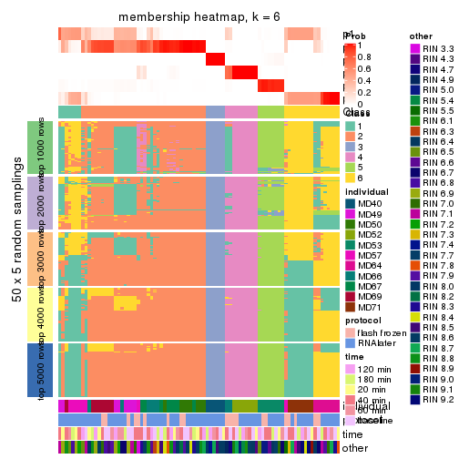</p>

</div>
</div>

As soon as we have had the classes for columns, we can look for signatures
which are significantly different between classes which can be candidate marks
for certain classes. Following are the heatmaps for signatures.


Signature heatmaps where rows are scaled:


<script>
$( function() {
	$( '#tabs-CV-pam-get-signatures' ).tabs();
} );
</script>
<div id='tabs-CV-pam-get-signatures'>
<ul>
<li><a href='#tab-CV-pam-get-signatures-1'>k = 2</a></li>
<li><a href='#tab-CV-pam-get-signatures-2'>k = 3</a></li>
<li><a href='#tab-CV-pam-get-signatures-3'>k = 4</a></li>
<li><a href='#tab-CV-pam-get-signatures-4'>k = 5</a></li>
<li><a href='#tab-CV-pam-get-signatures-5'>k = 6</a></li>
</ul>
<div id='tab-CV-pam-get-signatures-1'>
<pre><code class="r">get_signatures(res, k = 2)
</code></pre>

<p></p>

</div>
<div id='tab-CV-pam-get-signatures-2'>
<pre><code class="r">get_signatures(res, k = 3)
</code></pre>

<p></p>

</div>
<div id='tab-CV-pam-get-signatures-3'>
<pre><code class="r">get_signatures(res, k = 4)
</code></pre>

<p></p>

</div>
<div id='tab-CV-pam-get-signatures-4'>
<pre><code class="r">get_signatures(res, k = 5)
</code></pre>

<p></p>

</div>
<div id='tab-CV-pam-get-signatures-5'>
<pre><code class="r">get_signatures(res, k = 6)
</code></pre>

<p></p>

</div>
</div>


Signature heatmaps where rows are not scaled:


<script>
$( function() {
	$( '#tabs-CV-pam-get-signatures-no-scale' ).tabs();
} );
</script>
<div id='tabs-CV-pam-get-signatures-no-scale'>
<ul>
<li><a href='#tab-CV-pam-get-signatures-no-scale-1'>k = 2</a></li>
<li><a href='#tab-CV-pam-get-signatures-no-scale-2'>k = 3</a></li>
<li><a href='#tab-CV-pam-get-signatures-no-scale-3'>k = 4</a></li>
<li><a href='#tab-CV-pam-get-signatures-no-scale-4'>k = 5</a></li>
<li><a href='#tab-CV-pam-get-signatures-no-scale-5'>k = 6</a></li>
</ul>
<div id='tab-CV-pam-get-signatures-no-scale-1'>
<pre><code class="r">get_signatures(res, k = 2, scale_rows = FALSE)
</code></pre>

<p></p>

</div>
<div id='tab-CV-pam-get-signatures-no-scale-2'>
<pre><code class="r">get_signatures(res, k = 3, scale_rows = FALSE)
</code></pre>

<p></p>

</div>
<div id='tab-CV-pam-get-signatures-no-scale-3'>
<pre><code class="r">get_signatures(res, k = 4, scale_rows = FALSE)
</code></pre>

<p></p>

</div>
<div id='tab-CV-pam-get-signatures-no-scale-4'>
<pre><code class="r">get_signatures(res, k = 5, scale_rows = FALSE)
</code></pre>

<p></p>

</div>
<div id='tab-CV-pam-get-signatures-no-scale-5'>
<pre><code class="r">get_signatures(res, k = 6, scale_rows = FALSE)
</code></pre>

<p></p>

</div>
</div>


Compare the overlap of signatures from different k:

```r
compare_signatures(res)
```


`get_signature()` returns a data frame invisibly. TO get the list of signatures, the function
call should be assigned to a variable explicitly. In following code, if `plot` argument is set
to `FALSE`, no heatmap is plotted while only the differential analysis is performed.

```r
# code only for demonstration
tb = get_signature(res, k = ..., plot = FALSE)
```

An example of the output of `tb` is:

```
#>   which_row         fdr    mean_1    mean_2 scaled_mean_1 scaled_mean_2 km
#> 1        38 0.042760348  8.373488  9.131774    -0.5533452     0.5164555  1
#> 2        40 0.018707592  7.106213  8.469186    -0.6173731     0.5762149  1
#> 3        55 0.019134737 10.221463 11.207825    -0.6159697     0.5749050  1
#> 4        59 0.006059896  5.921854  7.869574    -0.6899429     0.6439467  1
#> 5        60 0.018055526  8.928898 10.211722    -0.6204761     0.5791110  1
#> 6        98 0.009384629 15.714769 14.887706     0.6635654    -0.6193277  2
...
```

The columns in `tb` are:

1. `which_row`: row indices corresponding to the input matrix.
2. `fdr`: FDR for the differential test. 
3. `mean_x`: The mean value in group x.
4. `scaled_mean_x`: The mean value in group x after rows are scaled.
5. `km`: Row groups if k-means clustering is applied to rows.


UMAP plot which shows how samples are separated.


<script>
$( function() {
	$( '#tabs-CV-pam-dimension-reduction' ).tabs();
} );
</script>
<div id='tabs-CV-pam-dimension-reduction'>
<ul>
<li><a href='#tab-CV-pam-dimension-reduction-1'>k = 2</a></li>
<li><a href='#tab-CV-pam-dimension-reduction-2'>k = 3</a></li>
<li><a href='#tab-CV-pam-dimension-reduction-3'>k = 4</a></li>
<li><a href='#tab-CV-pam-dimension-reduction-4'>k = 5</a></li>
<li><a href='#tab-CV-pam-dimension-reduction-5'>k = 6</a></li>
</ul>
<div id='tab-CV-pam-dimension-reduction-1'>
<pre><code class="r">dimension_reduction(res, k = 2, method = &quot;UMAP&quot;)
</code></pre>

<p></p>

</div>
<div id='tab-CV-pam-dimension-reduction-2'>
<pre><code class="r">dimension_reduction(res, k = 3, method = &quot;UMAP&quot;)
</code></pre>

<p></p>

</div>
<div id='tab-CV-pam-dimension-reduction-3'>
<pre><code class="r">dimension_reduction(res, k = 4, method = &quot;UMAP&quot;)
</code></pre>

<p></p>

</div>
<div id='tab-CV-pam-dimension-reduction-4'>
<pre><code class="r">dimension_reduction(res, k = 5, method = &quot;UMAP&quot;)
</code></pre>

<p></p>

</div>
<div id='tab-CV-pam-dimension-reduction-5'>
<pre><code class="r">dimension_reduction(res, k = 6, method = &quot;UMAP&quot;)
</code></pre>

<p></p>

</div>
</div>


Following heatmap shows how subgroups are split when increasing `k`:

```r
collect_classes(res)
```


Test correlation between subgroups and known annotations. If the known
annotation is numeric, one-way ANOVA test is applied, and if the known
annotation is discrete, chi-squared contingency table test is applied.

```r
test_to_known_factors(res)
```

```
#>         n individual(p) protocol(p) time(p) other(p) k
#> CV:pam 84      8.03e-09      0.0783   0.801    0.961 2
#> CV:pam 83      7.10e-16      0.0612   0.990    0.310 3
#> CV:pam 82      2.41e-23      0.2865   0.997    0.297 4
#> CV:pam 84      6.13e-40      0.3094   1.000    0.128 5
#> CV:pam 60      1.12e-23      0.3618   1.000    0.283 6
```


If matrix rows can be associated to genes, consider to use `functional_enrichment(res,
...)` to perform function enrichment for the signature genes. See [this vignette](http://bioconductor.org/packages/devel/bioc/vignettes/cola/inst/doc/functional_enrichment.html) for more detailed explanations.


 

---------------------------------------------------


### CV:mclust


The object with results only for a single top-value method and a single partition method 
can be extracted as:

```r
res = res_list["CV", "mclust"]
# you can also extract it by
# res = res_list["CV:mclust"]
```

A summary of `res` and all the functions that can be applied to it:

```r
res
```

```
#> A 'ConsensusPartition' object with k = 2, 3, 4, 5, 6.
#>   On a matrix with 21168 rows and 86 columns.
#>   Top rows (1000, 2000, 3000, 4000, 5000) are extracted by 'CV' method.
#>   Subgroups are detected by 'mclust' method.
#>   Performed in total 1250 partitions by row resampling.
#>   Best k for subgroups seems to be 5.
#> 
#> Following methods can be applied to this 'ConsensusPartition' object:
#>  [1] "cola_report"             "collect_classes"         "collect_plots"          
#>  [4] "collect_stats"           "colnames"                "compare_signatures"     
#>  [7] "consensus_heatmap"       "dimension_reduction"     "functional_enrichment"  
#> [10] "get_anno_col"            "get_anno"                "get_classes"            
#> [13] "get_consensus"           "get_matrix"              "get_membership"         
#> [16] "get_param"               "get_signatures"          "get_stats"              
#> [19] "is_best_k"               "is_stable_k"             "membership_heatmap"     
#> [22] "ncol"                    "nrow"                    "plot_ecdf"              
#> [25] "rownames"                "select_partition_number" "show"                   
#> [28] "suggest_best_k"          "test_to_known_factors"
```

`collect_plots()` function collects all the plots made from `res` for all `k` (number of partitions)
into one single page to provide an easy and fast comparison between different `k`.

```r
collect_plots(res)
```


The plots are:

- The first row: a plot of the ECDF (empirical cumulative distribution
  function) curves of the consensus matrix for each `k` and the heatmap of
  predicted classes for each `k`.
- The second row: heatmaps of the consensus matrix for each `k`.
- The third row: heatmaps of the membership matrix for each `k`.
- The fouth row: heatmaps of the signatures for each `k`.

All the plots in panels can be made by individual functions and they are
plotted later in this section.

`select_partition_number()` produces several plots showing different
statistics for choosing "optimized" `k`. There are following statistics:

- ECDF curves of the consensus matrix for each `k`;
- 1-PAC. [The PAC
  score](https://en.wikipedia.org/wiki/Consensus_clustering#Over-interpretation_potential_of_consensus_clustering)
  measures the proportion of the ambiguous subgrouping.
- Mean silhouette score.
- Concordance. The mean probability of fiting the consensus class ids in all
  partitions.
- Area increased. Denote $A_k$ as the area under the ECDF curve for current
  `k`, the area increased is defined as $A_k - A_{k-1}$.
- Rand index. The percent of pairs of samples that are both in a same cluster
  or both are not in a same cluster in the partition of k and k-1.
- Jaccard index. The ratio of pairs of samples are both in a same cluster in
  the partition of k and k-1 and the pairs of samples are both in a same
  cluster in the partition k or k-1.

The detailed explanations of these statistics can be found in [the _cola_
vignette](http://bioconductor.org/packages/devel/bioc/vignettes/cola/inst/doc/cola.html#toc_13).

Generally speaking, lower PAC score, higher mean silhouette score or higher
concordance corresponds to better partition. Rand index and Jaccard index
measure how similar the current partition is compared to partition with `k-1`.
If they are too similar, we won't accept `k` is better than `k-1`.

```r
select_partition_number(res)
```


The numeric values for all these statistics can be obtained by `get_stats()`.

```r
get_stats(res)
```

```
#>   k 1-PAC mean_silhouette concordance area_increased  Rand Jaccard
#> 2 2 0.331           0.563       0.759         0.4720 0.495   0.495
#> 3 3 0.324           0.567       0.731         0.3298 0.763   0.578
#> 4 4 0.666           0.752       0.826         0.1264 0.876   0.693
#> 5 5 0.769           0.782       0.879         0.1034 0.912   0.706
#> 6 6 0.812           0.733       0.836         0.0465 0.948   0.762
```

`suggest_best_k()` suggests the best $k$ based on these statistics. The rules are as follows:

- All $k$ with Jaccard index larger than 0.95 are removed because increasing
  $k$ does not provide enough extra information. If all $k$ are removed, it is
  marked as no subgroup is detected.
- For all $k$ with 1-PAC score larger than 0.9, the maximal $k$ is taken as
  the best $k$, and other $k$ are marked as optional $k$.
- If it does not fit the second rule. The $k$ with the maximal vote of the
  highest 1-PAC score, highest mean silhouette, and highest concordance is
  taken as the best $k$.

```r
suggest_best_k(res)
```

```
#> [1] 5
```


Following shows the table of the partitions (You need to click the **show/hide
code output** link to see it). The membership matrix (columns with name `p*`)
is inferred by
[`clue::cl_consensus()`](https://www.rdocumentation.org/link/cl_consensus?package=clue)
function with the `SE` method. Basically the value in the membership matrix
represents the probability to belong to a certain group. The finall class
label for an item is determined with the group with highest probability it
belongs to.

In `get_classes()` function, the entropy is calculated from the membership
matrix and the silhouette score is calculated from the consensus matrix.


<script>
$( function() {
	$( '#tabs-CV-mclust-get-classes' ).tabs();
} );
</script>
<div id='tabs-CV-mclust-get-classes'>
<ul>
<li><a href='#tab-CV-mclust-get-classes-1'>k = 2</a></li>
<li><a href='#tab-CV-mclust-get-classes-2'>k = 3</a></li>
<li><a href='#tab-CV-mclust-get-classes-3'>k = 4</a></li>
<li><a href='#tab-CV-mclust-get-classes-4'>k = 5</a></li>
<li><a href='#tab-CV-mclust-get-classes-5'>k = 6</a></li>
</ul>

<div id='tab-CV-mclust-get-classes-1'>
<p><a id='tab-CV-mclust-get-classes-1-a' style='color:#0366d6' href='#'>show/hide code output</a></p>
<pre><code class="r">cbind(get_classes(res, k = 2), get_membership(res, k = 2))
</code></pre>

<pre><code>#&gt;           class entropy silhouette    p1    p2
#&gt; GSM614415     1  0.9833     0.5756 0.576 0.424
#&gt; GSM614416     1  0.9833     0.5756 0.576 0.424
#&gt; GSM614417     1  0.9833     0.5756 0.576 0.424
#&gt; GSM614418     1  0.9833     0.5756 0.576 0.424
#&gt; GSM614419     1  0.9833     0.5756 0.576 0.424
#&gt; GSM614420     1  0.9833     0.5756 0.576 0.424
#&gt; GSM614421     2  0.9922     0.7951 0.448 0.552
#&gt; GSM614422     2  0.9944     0.7878 0.456 0.544
#&gt; GSM614423     2  0.9944     0.7849 0.456 0.544
#&gt; GSM614424     2  0.9922     0.7951 0.448 0.552
#&gt; GSM614425     2  0.9944     0.7878 0.456 0.544
#&gt; GSM614426     2  0.9922     0.7951 0.448 0.552
#&gt; GSM614427     2  0.9909     0.7948 0.444 0.556
#&gt; GSM614428     2  0.9922     0.7951 0.448 0.552
#&gt; GSM614429     2  0.9866     0.7929 0.432 0.568
#&gt; GSM614430     2  0.9866     0.7929 0.432 0.568
#&gt; GSM614431     2  0.9881     0.7909 0.436 0.564
#&gt; GSM614432     2  0.9881     0.7909 0.436 0.564
#&gt; GSM614433     2  0.9922     0.7799 0.448 0.552
#&gt; GSM614434     2  0.9866     0.7929 0.432 0.568
#&gt; GSM614435     2  0.9866     0.7929 0.432 0.568
#&gt; GSM614436     2  0.9866     0.7929 0.432 0.568
#&gt; GSM614437     2  0.0376     0.4443 0.004 0.996
#&gt; GSM614438     2  0.0376     0.4443 0.004 0.996
#&gt; GSM614439     2  0.0376     0.4443 0.004 0.996
#&gt; GSM614440     2  0.0376     0.4443 0.004 0.996
#&gt; GSM614441     2  0.0376     0.4443 0.004 0.996
#&gt; GSM614442     2  0.0376     0.4443 0.004 0.996
#&gt; GSM614443     2  0.0376     0.4443 0.004 0.996
#&gt; GSM614444     2  0.0376     0.4443 0.004 0.996
#&gt; GSM614391     1  0.9833     0.5756 0.576 0.424
#&gt; GSM614392     1  0.9833     0.5756 0.576 0.424
#&gt; GSM614393     1  0.9833     0.5756 0.576 0.424
#&gt; GSM614394     1  0.9833     0.5756 0.576 0.424
#&gt; GSM614395     1  0.9833     0.5756 0.576 0.424
#&gt; GSM614396     1  0.9833     0.5756 0.576 0.424
#&gt; GSM614397     1  0.9833     0.5756 0.576 0.424
#&gt; GSM614398     1  0.9833     0.5756 0.576 0.424
#&gt; GSM614399     1  0.2043     0.5698 0.968 0.032
#&gt; GSM614400     1  0.0376     0.5989 0.996 0.004
#&gt; GSM614401     1  0.0376     0.5989 0.996 0.004
#&gt; GSM614402     1  0.1414     0.5823 0.980 0.020
#&gt; GSM614403     1  0.5294     0.4248 0.880 0.120
#&gt; GSM614404     1  0.0376     0.5989 0.996 0.004
#&gt; GSM614405     1  0.0672     0.5948 0.992 0.008
#&gt; GSM614406     2  0.9881     0.7959 0.436 0.564
#&gt; GSM614407     1  0.6148     0.6350 0.848 0.152
#&gt; GSM614408     1  0.6247     0.6351 0.844 0.156
#&gt; GSM614409     1  0.6148     0.6350 0.848 0.152
#&gt; GSM614410     1  0.6247     0.6351 0.844 0.156
#&gt; GSM614411     1  0.6247     0.6351 0.844 0.156
#&gt; GSM614412     1  0.6247     0.6351 0.844 0.156
#&gt; GSM614413     1  0.4022     0.6224 0.920 0.080
#&gt; GSM614414     1  0.6247     0.6351 0.844 0.156
#&gt; GSM614445     2  0.9922     0.7951 0.448 0.552
#&gt; GSM614446     2  0.9922     0.7951 0.448 0.552
#&gt; GSM614447     2  0.9909     0.7966 0.444 0.556
#&gt; GSM614448     2  0.9909     0.7966 0.444 0.556
#&gt; GSM614449     2  0.9909     0.7966 0.444 0.556
#&gt; GSM614450     2  0.9922     0.7951 0.448 0.552
#&gt; GSM614451     2  0.9909     0.7962 0.444 0.556
#&gt; GSM614452     2  0.9909     0.7962 0.444 0.556
#&gt; GSM614453     2  0.8661     0.7370 0.288 0.712
#&gt; GSM614454     2  0.8661     0.7370 0.288 0.712
#&gt; GSM614455     2  0.8661     0.7370 0.288 0.712
#&gt; GSM614456     2  0.8661     0.7370 0.288 0.712
#&gt; GSM614457     2  0.8661     0.7370 0.288 0.712
#&gt; GSM614458     2  0.9248     0.7645 0.340 0.660
#&gt; GSM614459     2  0.8661     0.7370 0.288 0.712
#&gt; GSM614460     2  0.8661     0.7370 0.288 0.712
#&gt; GSM614461     1  0.9896    -0.5796 0.560 0.440
#&gt; GSM614462     1  0.8207     0.0152 0.744 0.256
#&gt; GSM614463     1  0.8955    -0.2069 0.688 0.312
#&gt; GSM614464     1  0.6973     0.2566 0.812 0.188
#&gt; GSM614465     1  0.9850    -0.5513 0.572 0.428
#&gt; GSM614466     1  0.9963    -0.6331 0.536 0.464
#&gt; GSM614467     1  0.9686    -0.4705 0.604 0.396
#&gt; GSM614468     1  0.9866    -0.5606 0.568 0.432
#&gt; GSM614469     1  0.0376     0.5989 0.996 0.004
#&gt; GSM614470     1  0.0376     0.5989 0.996 0.004
#&gt; GSM614471     1  0.0376     0.5989 0.996 0.004
#&gt; GSM614472     1  0.0376     0.5989 0.996 0.004
#&gt; GSM614473     1  0.0376     0.5989 0.996 0.004
#&gt; GSM614474     1  0.0376     0.5989 0.996 0.004
#&gt; GSM614475     1  0.0376     0.5989 0.996 0.004
#&gt; GSM614476     1  0.0376     0.5989 0.996 0.004
</code></pre>

<script>
$('#tab-CV-mclust-get-classes-1-a').parent().next().next().hide();
$('#tab-CV-mclust-get-classes-1-a').click(function(){
  $('#tab-CV-mclust-get-classes-1-a').parent().next().next().toggle();
  return(false);
});
</script>
</div>

<div id='tab-CV-mclust-get-classes-2'>
<p><a id='tab-CV-mclust-get-classes-2-a' style='color:#0366d6' href='#'>show/hide code output</a></p>
<pre><code class="r">cbind(get_classes(res, k = 3), get_membership(res, k = 3))
</code></pre>

<pre><code>#&gt;           class entropy silhouette    p1    p2    p3
#&gt; GSM614415     1  0.2301     0.7267 0.936 0.004 0.060
#&gt; GSM614416     1  0.2590     0.7258 0.924 0.004 0.072
#&gt; GSM614417     1  0.2200     0.7286 0.940 0.004 0.056
#&gt; GSM614418     1  0.2400     0.7256 0.932 0.004 0.064
#&gt; GSM614419     1  0.1964     0.7256 0.944 0.000 0.056
#&gt; GSM614420     1  0.1964     0.7256 0.944 0.000 0.056
#&gt; GSM614421     2  0.9062     0.3338 0.136 0.452 0.412
#&gt; GSM614422     2  0.9088     0.3533 0.140 0.464 0.396
#&gt; GSM614423     2  0.9024     0.3246 0.132 0.448 0.420
#&gt; GSM614424     2  0.9049     0.3521 0.136 0.464 0.400
#&gt; GSM614425     2  0.9054     0.3465 0.136 0.460 0.404
#&gt; GSM614426     2  0.9018     0.3371 0.132 0.456 0.412
#&gt; GSM614427     2  0.8968     0.3447 0.128 0.464 0.408
#&gt; GSM614428     3  0.9018    -0.3314 0.132 0.412 0.456
#&gt; GSM614429     2  0.0661     0.5867 0.004 0.988 0.008
#&gt; GSM614430     2  0.0661     0.5866 0.008 0.988 0.004
#&gt; GSM614431     2  0.0747     0.5867 0.016 0.984 0.000
#&gt; GSM614432     2  0.0237     0.5865 0.004 0.996 0.000
#&gt; GSM614433     2  0.1950     0.5798 0.040 0.952 0.008
#&gt; GSM614434     2  0.0475     0.5867 0.004 0.992 0.004
#&gt; GSM614435     2  0.0475     0.5867 0.004 0.992 0.004
#&gt; GSM614436     2  0.1905     0.5862 0.016 0.956 0.028
#&gt; GSM614437     3  0.7276     0.7109 0.104 0.192 0.704
#&gt; GSM614438     3  0.6974     0.7311 0.104 0.168 0.728
#&gt; GSM614439     3  0.6974     0.7311 0.104 0.168 0.728
#&gt; GSM614440     3  0.6974     0.7311 0.104 0.168 0.728
#&gt; GSM614441     3  0.6974     0.7311 0.104 0.168 0.728
#&gt; GSM614442     3  0.6974     0.7311 0.104 0.168 0.728
#&gt; GSM614443     3  0.7228     0.7151 0.104 0.188 0.708
#&gt; GSM614444     3  0.6974     0.7311 0.104 0.168 0.728
#&gt; GSM614391     1  0.2537     0.7141 0.920 0.000 0.080
#&gt; GSM614392     1  0.2448     0.7166 0.924 0.000 0.076
#&gt; GSM614393     1  0.2959     0.6970 0.900 0.000 0.100
#&gt; GSM614394     1  0.3038     0.6954 0.896 0.000 0.104
#&gt; GSM614395     1  0.5706     0.4051 0.680 0.000 0.320
#&gt; GSM614396     1  0.4121     0.6355 0.832 0.000 0.168
#&gt; GSM614397     1  0.5678     0.4095 0.684 0.000 0.316
#&gt; GSM614398     1  0.4062     0.6420 0.836 0.000 0.164
#&gt; GSM614399     1  0.8007     0.7117 0.640 0.244 0.116
#&gt; GSM614400     1  0.7717     0.7333 0.668 0.220 0.112
#&gt; GSM614401     1  0.7782     0.7334 0.668 0.208 0.124
#&gt; GSM614402     1  0.8137     0.7122 0.640 0.220 0.140
#&gt; GSM614403     1  0.9501     0.3768 0.472 0.324 0.204
#&gt; GSM614404     1  0.7762     0.7336 0.668 0.212 0.120
#&gt; GSM614405     1  0.7710     0.7299 0.680 0.176 0.144
#&gt; GSM614406     2  0.8494     0.3730 0.108 0.556 0.336
#&gt; GSM614407     1  0.4779     0.7746 0.840 0.124 0.036
#&gt; GSM614408     1  0.4749     0.7733 0.844 0.116 0.040
#&gt; GSM614409     1  0.4137     0.7720 0.872 0.096 0.032
#&gt; GSM614410     1  0.4677     0.7751 0.840 0.132 0.028
#&gt; GSM614411     1  0.4449     0.7708 0.860 0.100 0.040
#&gt; GSM614412     1  0.4256     0.7709 0.868 0.096 0.036
#&gt; GSM614413     1  0.4807     0.7637 0.848 0.092 0.060
#&gt; GSM614414     1  0.4725     0.7643 0.852 0.088 0.060
#&gt; GSM614445     2  0.8869     0.3802 0.124 0.496 0.380
#&gt; GSM614446     2  0.8848     0.3871 0.124 0.504 0.372
#&gt; GSM614447     2  0.8683     0.4124 0.120 0.540 0.340
#&gt; GSM614448     2  0.9014     0.3455 0.132 0.460 0.408
#&gt; GSM614449     2  0.8991     0.3639 0.132 0.476 0.392
#&gt; GSM614450     2  0.8991     0.3639 0.132 0.476 0.392
#&gt; GSM614451     3  0.8843    -0.0399 0.160 0.276 0.564
#&gt; GSM614452     3  0.8843    -0.0399 0.160 0.276 0.564
#&gt; GSM614453     2  0.5179     0.4928 0.088 0.832 0.080
#&gt; GSM614454     2  0.5179     0.4928 0.088 0.832 0.080
#&gt; GSM614455     2  0.5179     0.4928 0.088 0.832 0.080
#&gt; GSM614456     2  0.5179     0.4928 0.088 0.832 0.080
#&gt; GSM614457     2  0.5179     0.4928 0.088 0.832 0.080
#&gt; GSM614458     2  0.4745     0.5097 0.068 0.852 0.080
#&gt; GSM614459     2  0.5179     0.4928 0.088 0.832 0.080
#&gt; GSM614460     2  0.5179     0.4928 0.088 0.832 0.080
#&gt; GSM614461     2  0.3445     0.5550 0.088 0.896 0.016
#&gt; GSM614462     2  0.6016     0.3567 0.256 0.724 0.020
#&gt; GSM614463     2  0.6161     0.3156 0.272 0.708 0.020
#&gt; GSM614464     2  0.6016     0.3619 0.256 0.724 0.020
#&gt; GSM614465     2  0.5366     0.4481 0.208 0.776 0.016
#&gt; GSM614466     2  0.4418     0.5227 0.132 0.848 0.020
#&gt; GSM614467     2  0.3722     0.5664 0.088 0.888 0.024
#&gt; GSM614468     2  0.4609     0.5244 0.128 0.844 0.028
#&gt; GSM614469     1  0.7568     0.7402 0.680 0.212 0.108
#&gt; GSM614470     1  0.7568     0.7402 0.680 0.212 0.108
#&gt; GSM614471     1  0.7568     0.7402 0.680 0.212 0.108
#&gt; GSM614472     1  0.7568     0.7402 0.680 0.212 0.108
#&gt; GSM614473     1  0.7568     0.7402 0.680 0.212 0.108
#&gt; GSM614474     1  0.7568     0.7402 0.680 0.212 0.108
#&gt; GSM614475     1  0.7610     0.7374 0.676 0.216 0.108
#&gt; GSM614476     1  0.7633     0.7376 0.680 0.200 0.120
</code></pre>

<script>
$('#tab-CV-mclust-get-classes-2-a').parent().next().next().hide();
$('#tab-CV-mclust-get-classes-2-a').click(function(){
  $('#tab-CV-mclust-get-classes-2-a').parent().next().next().toggle();
  return(false);
});
</script>
</div>

<div id='tab-CV-mclust-get-classes-3'>
<p><a id='tab-CV-mclust-get-classes-3-a' style='color:#0366d6' href='#'>show/hide code output</a></p>
<pre><code class="r">cbind(get_classes(res, k = 4), get_membership(res, k = 4))
</code></pre>

<pre><code>#&gt;           class entropy silhouette    p1    p2    p3    p4
#&gt; GSM614415     1  0.0592      0.761 0.984 0.000 0.000 0.016
#&gt; GSM614416     1  0.0779      0.762 0.980 0.004 0.000 0.016
#&gt; GSM614417     1  0.0592      0.761 0.984 0.000 0.000 0.016
#&gt; GSM614418     1  0.0592      0.761 0.984 0.000 0.000 0.016
#&gt; GSM614419     1  0.1406      0.756 0.960 0.000 0.024 0.016
#&gt; GSM614420     1  0.1297      0.757 0.964 0.000 0.020 0.016
#&gt; GSM614421     3  0.1576      0.906 0.000 0.048 0.948 0.004
#&gt; GSM614422     3  0.1743      0.899 0.004 0.056 0.940 0.000
#&gt; GSM614423     3  0.1576      0.906 0.000 0.048 0.948 0.004
#&gt; GSM614424     3  0.1576      0.906 0.000 0.048 0.948 0.004
#&gt; GSM614425     3  0.1389      0.906 0.000 0.048 0.952 0.000
#&gt; GSM614426     3  0.1576      0.906 0.000 0.048 0.948 0.004
#&gt; GSM614427     3  0.1722      0.904 0.000 0.048 0.944 0.008
#&gt; GSM614428     3  0.1635      0.903 0.000 0.044 0.948 0.008
#&gt; GSM614429     2  0.2473      0.754 0.000 0.908 0.012 0.080
#&gt; GSM614430     2  0.2376      0.758 0.000 0.916 0.016 0.068
#&gt; GSM614431     2  0.1297      0.761 0.000 0.964 0.016 0.020
#&gt; GSM614432     2  0.1610      0.762 0.000 0.952 0.016 0.032
#&gt; GSM614433     2  0.0967      0.757 0.004 0.976 0.016 0.004
#&gt; GSM614434     2  0.1706      0.762 0.000 0.948 0.016 0.036
#&gt; GSM614435     2  0.3495      0.727 0.000 0.844 0.016 0.140
#&gt; GSM614436     2  0.4597      0.718 0.004 0.800 0.056 0.140
#&gt; GSM614437     4  0.0592      1.000 0.000 0.016 0.000 0.984
#&gt; GSM614438     4  0.0592      1.000 0.000 0.016 0.000 0.984
#&gt; GSM614439     4  0.0592      1.000 0.000 0.016 0.000 0.984
#&gt; GSM614440     4  0.0592      1.000 0.000 0.016 0.000 0.984
#&gt; GSM614441     4  0.0592      1.000 0.000 0.016 0.000 0.984
#&gt; GSM614442     4  0.0592      1.000 0.000 0.016 0.000 0.984
#&gt; GSM614443     4  0.0592      1.000 0.000 0.016 0.000 0.984
#&gt; GSM614444     4  0.0592      1.000 0.000 0.016 0.000 0.984
#&gt; GSM614391     1  0.1593      0.757 0.956 0.004 0.024 0.016
#&gt; GSM614392     1  0.1593      0.757 0.956 0.004 0.024 0.016
#&gt; GSM614393     1  0.2246      0.746 0.928 0.004 0.052 0.016
#&gt; GSM614394     1  0.2060      0.743 0.932 0.000 0.052 0.016
#&gt; GSM614395     1  0.2142      0.741 0.928 0.000 0.056 0.016
#&gt; GSM614396     1  0.2142      0.741 0.928 0.000 0.056 0.016
#&gt; GSM614397     1  0.2142      0.741 0.928 0.000 0.056 0.016
#&gt; GSM614398     1  0.2142      0.741 0.928 0.000 0.056 0.016
#&gt; GSM614399     1  0.6197      0.692 0.596 0.344 0.056 0.004
#&gt; GSM614400     1  0.5990      0.704 0.608 0.336 0.056 0.000
#&gt; GSM614401     1  0.6552      0.681 0.576 0.328 0.096 0.000
#&gt; GSM614402     1  0.7845      0.416 0.404 0.304 0.292 0.000
#&gt; GSM614403     3  0.7002      0.260 0.268 0.164 0.568 0.000
#&gt; GSM614404     1  0.6170      0.700 0.600 0.332 0.068 0.000
#&gt; GSM614405     1  0.6848      0.689 0.592 0.248 0.160 0.000
#&gt; GSM614406     3  0.8333     -0.131 0.360 0.200 0.412 0.028
#&gt; GSM614407     1  0.4553      0.780 0.780 0.180 0.040 0.000
#&gt; GSM614408     1  0.4423      0.781 0.792 0.168 0.040 0.000
#&gt; GSM614409     1  0.4595      0.781 0.780 0.176 0.044 0.000
#&gt; GSM614410     1  0.4466      0.780 0.784 0.180 0.036 0.000
#&gt; GSM614411     1  0.4589      0.781 0.784 0.168 0.048 0.000
#&gt; GSM614412     1  0.4669      0.782 0.780 0.168 0.052 0.000
#&gt; GSM614413     1  0.5304      0.758 0.748 0.104 0.148 0.000
#&gt; GSM614414     1  0.5266      0.762 0.752 0.108 0.140 0.000
#&gt; GSM614445     3  0.1474      0.905 0.000 0.052 0.948 0.000
#&gt; GSM614446     3  0.1474      0.905 0.000 0.052 0.948 0.000
#&gt; GSM614447     3  0.1824      0.898 0.004 0.060 0.936 0.000
#&gt; GSM614448     3  0.1389      0.906 0.000 0.048 0.952 0.000
#&gt; GSM614449     3  0.1389      0.906 0.000 0.048 0.952 0.000
#&gt; GSM614450     3  0.1389      0.906 0.000 0.048 0.952 0.000
#&gt; GSM614451     3  0.2363      0.818 0.056 0.000 0.920 0.024
#&gt; GSM614452     3  0.2363      0.818 0.056 0.000 0.920 0.024
#&gt; GSM614453     2  0.4761      0.515 0.000 0.628 0.000 0.372
#&gt; GSM614454     2  0.4761      0.515 0.000 0.628 0.000 0.372
#&gt; GSM614455     2  0.4761      0.515 0.000 0.628 0.000 0.372
#&gt; GSM614456     2  0.4746      0.519 0.000 0.632 0.000 0.368
#&gt; GSM614457     2  0.4761      0.515 0.000 0.628 0.000 0.372
#&gt; GSM614458     2  0.4585      0.566 0.000 0.668 0.000 0.332
#&gt; GSM614459     2  0.4761      0.515 0.000 0.628 0.000 0.372
#&gt; GSM614460     2  0.4761      0.515 0.000 0.628 0.000 0.372
#&gt; GSM614461     2  0.2695      0.743 0.056 0.912 0.024 0.008
#&gt; GSM614462     2  0.3653      0.689 0.112 0.856 0.024 0.008
#&gt; GSM614463     2  0.4033      0.631 0.148 0.824 0.020 0.008
#&gt; GSM614464     2  0.3030      0.726 0.076 0.892 0.028 0.004
#&gt; GSM614465     2  0.3374      0.729 0.080 0.880 0.028 0.012
#&gt; GSM614466     2  0.2142      0.741 0.056 0.928 0.016 0.000
#&gt; GSM614467     2  0.3225      0.742 0.060 0.892 0.032 0.016
#&gt; GSM614468     2  0.2814      0.743 0.052 0.908 0.032 0.008
#&gt; GSM614469     1  0.5420      0.713 0.624 0.352 0.024 0.000
#&gt; GSM614470     1  0.5420      0.713 0.624 0.352 0.024 0.000
#&gt; GSM614471     1  0.5436      0.710 0.620 0.356 0.024 0.000
#&gt; GSM614472     1  0.5420      0.713 0.624 0.352 0.024 0.000
#&gt; GSM614473     1  0.5436      0.710 0.620 0.356 0.024 0.000
#&gt; GSM614474     1  0.5436      0.710 0.620 0.356 0.024 0.000
#&gt; GSM614475     1  0.5436      0.710 0.620 0.356 0.024 0.000
#&gt; GSM614476     1  0.6338      0.707 0.600 0.316 0.084 0.000
</code></pre>

<script>
$('#tab-CV-mclust-get-classes-3-a').parent().next().next().hide();
$('#tab-CV-mclust-get-classes-3-a').click(function(){
  $('#tab-CV-mclust-get-classes-3-a').parent().next().next().toggle();
  return(false);
});
</script>
</div>

<div id='tab-CV-mclust-get-classes-4'>
<p><a id='tab-CV-mclust-get-classes-4-a' style='color:#0366d6' href='#'>show/hide code output</a></p>
<pre><code class="r">cbind(get_classes(res, k = 5), get_membership(res, k = 5))
</code></pre>

<pre><code>#&gt;           class entropy silhouette    p1    p2    p3    p4    p5
#&gt; GSM614415     5  0.2424     0.8002 0.132 0.000 0.000 0.000 0.868
#&gt; GSM614416     5  0.2561     0.7890 0.144 0.000 0.000 0.000 0.856
#&gt; GSM614417     5  0.2732     0.7729 0.160 0.000 0.000 0.000 0.840
#&gt; GSM614418     5  0.2732     0.7729 0.160 0.000 0.000 0.000 0.840
#&gt; GSM614419     5  0.0404     0.8613 0.012 0.000 0.000 0.000 0.988
#&gt; GSM614420     5  0.0404     0.8613 0.012 0.000 0.000 0.000 0.988
#&gt; GSM614421     3  0.0510     0.9498 0.000 0.016 0.984 0.000 0.000
#&gt; GSM614422     3  0.0566     0.9461 0.004 0.012 0.984 0.000 0.000
#&gt; GSM614423     3  0.0609     0.9478 0.000 0.020 0.980 0.000 0.000
#&gt; GSM614424     3  0.0510     0.9498 0.000 0.016 0.984 0.000 0.000
#&gt; GSM614425     3  0.0510     0.9498 0.000 0.016 0.984 0.000 0.000
#&gt; GSM614426     3  0.0510     0.9498 0.000 0.016 0.984 0.000 0.000
#&gt; GSM614427     3  0.0898     0.9428 0.008 0.020 0.972 0.000 0.000
#&gt; GSM614428     3  0.0404     0.9476 0.000 0.012 0.988 0.000 0.000
#&gt; GSM614429     2  0.1697     0.8709 0.060 0.932 0.008 0.000 0.000
#&gt; GSM614430     2  0.1697     0.8709 0.060 0.932 0.008 0.000 0.000
#&gt; GSM614431     2  0.1830     0.8710 0.068 0.924 0.008 0.000 0.000
#&gt; GSM614432     2  0.1764     0.8709 0.064 0.928 0.008 0.000 0.000
#&gt; GSM614433     2  0.2017     0.8687 0.080 0.912 0.008 0.000 0.000
#&gt; GSM614434     2  0.1697     0.8709 0.060 0.932 0.008 0.000 0.000
#&gt; GSM614435     2  0.1857     0.8703 0.060 0.928 0.008 0.004 0.000
#&gt; GSM614436     2  0.2172     0.8685 0.060 0.916 0.020 0.004 0.000
#&gt; GSM614437     4  0.0162     0.9968 0.000 0.004 0.000 0.996 0.000
#&gt; GSM614438     4  0.0000     0.9989 0.000 0.000 0.000 1.000 0.000
#&gt; GSM614439     4  0.0000     0.9989 0.000 0.000 0.000 1.000 0.000
#&gt; GSM614440     4  0.0000     0.9989 0.000 0.000 0.000 1.000 0.000
#&gt; GSM614441     4  0.0000     0.9989 0.000 0.000 0.000 1.000 0.000
#&gt; GSM614442     4  0.0000     0.9989 0.000 0.000 0.000 1.000 0.000
#&gt; GSM614443     4  0.0162     0.9968 0.000 0.004 0.000 0.996 0.000
#&gt; GSM614444     4  0.0000     0.9989 0.000 0.000 0.000 1.000 0.000
#&gt; GSM614391     5  0.0880     0.8614 0.032 0.000 0.000 0.000 0.968
#&gt; GSM614392     5  0.0880     0.8614 0.032 0.000 0.000 0.000 0.968
#&gt; GSM614393     5  0.0880     0.8613 0.032 0.000 0.000 0.000 0.968
#&gt; GSM614394     5  0.0566     0.8611 0.012 0.000 0.004 0.000 0.984
#&gt; GSM614395     5  0.1173     0.8521 0.012 0.000 0.020 0.004 0.964
#&gt; GSM614396     5  0.0451     0.8593 0.008 0.000 0.004 0.000 0.988
#&gt; GSM614397     5  0.0912     0.8555 0.012 0.000 0.016 0.000 0.972
#&gt; GSM614398     5  0.0451     0.8593 0.008 0.000 0.004 0.000 0.988
#&gt; GSM614399     1  0.3170     0.7195 0.828 0.008 0.160 0.000 0.004
#&gt; GSM614400     1  0.2462     0.7314 0.880 0.008 0.112 0.000 0.000
#&gt; GSM614401     1  0.3209     0.7043 0.812 0.008 0.180 0.000 0.000
#&gt; GSM614402     1  0.4889     0.1421 0.504 0.016 0.476 0.000 0.004
#&gt; GSM614403     3  0.4592     0.6163 0.224 0.012 0.728 0.000 0.036
#&gt; GSM614404     1  0.2707     0.7271 0.860 0.008 0.132 0.000 0.000
#&gt; GSM614405     1  0.5406     0.4423 0.592 0.008 0.348 0.000 0.052
#&gt; GSM614406     3  0.6047     0.5025 0.260 0.028 0.636 0.016 0.060
#&gt; GSM614407     1  0.4442     0.5189 0.688 0.000 0.028 0.000 0.284
#&gt; GSM614408     1  0.4565     0.4795 0.664 0.000 0.028 0.000 0.308
#&gt; GSM614409     1  0.4763     0.4392 0.632 0.000 0.032 0.000 0.336
#&gt; GSM614410     1  0.4318     0.5168 0.688 0.000 0.020 0.000 0.292
#&gt; GSM614411     1  0.4679     0.4677 0.652 0.000 0.032 0.000 0.316
#&gt; GSM614412     1  0.5059     0.2538 0.548 0.000 0.036 0.000 0.416
#&gt; GSM614413     5  0.5594    -0.0915 0.444 0.004 0.060 0.000 0.492
#&gt; GSM614414     5  0.5486    -0.0805 0.444 0.004 0.052 0.000 0.500
#&gt; GSM614445     3  0.0510     0.9498 0.000 0.016 0.984 0.000 0.000
#&gt; GSM614446     3  0.0510     0.9498 0.000 0.016 0.984 0.000 0.000
#&gt; GSM614447     3  0.0794     0.9412 0.000 0.028 0.972 0.000 0.000
#&gt; GSM614448     3  0.0510     0.9498 0.000 0.016 0.984 0.000 0.000
#&gt; GSM614449     3  0.0510     0.9498 0.000 0.016 0.984 0.000 0.000
#&gt; GSM614450     3  0.0510     0.9498 0.000 0.016 0.984 0.000 0.000
#&gt; GSM614451     3  0.1605     0.9046 0.004 0.000 0.944 0.012 0.040
#&gt; GSM614452     3  0.1605     0.9046 0.004 0.000 0.944 0.012 0.040
#&gt; GSM614453     2  0.2060     0.8279 0.016 0.924 0.000 0.052 0.008
#&gt; GSM614454     2  0.1988     0.8295 0.016 0.928 0.000 0.048 0.008
#&gt; GSM614455     2  0.2060     0.8279 0.016 0.924 0.000 0.052 0.008
#&gt; GSM614456     2  0.2060     0.8279 0.016 0.924 0.000 0.052 0.008
#&gt; GSM614457     2  0.2060     0.8279 0.016 0.924 0.000 0.052 0.008
#&gt; GSM614458     2  0.1498     0.8432 0.024 0.952 0.000 0.016 0.008
#&gt; GSM614459     2  0.2692     0.7992 0.016 0.884 0.000 0.092 0.008
#&gt; GSM614460     2  0.2060     0.8279 0.016 0.924 0.000 0.052 0.008
#&gt; GSM614461     2  0.3783     0.7556 0.252 0.740 0.008 0.000 0.000
#&gt; GSM614462     2  0.4252     0.6394 0.340 0.652 0.008 0.000 0.000
#&gt; GSM614463     2  0.4283     0.6258 0.348 0.644 0.008 0.000 0.000
#&gt; GSM614464     2  0.4183     0.6624 0.324 0.668 0.008 0.000 0.000
#&gt; GSM614465     2  0.3783     0.7547 0.252 0.740 0.008 0.000 0.000
#&gt; GSM614466     2  0.3318     0.8117 0.192 0.800 0.008 0.000 0.000
#&gt; GSM614467     2  0.2953     0.8399 0.144 0.844 0.012 0.000 0.000
#&gt; GSM614468     2  0.3039     0.8363 0.152 0.836 0.012 0.000 0.000
#&gt; GSM614469     1  0.0740     0.7493 0.980 0.004 0.008 0.000 0.008
#&gt; GSM614470     1  0.0740     0.7493 0.980 0.004 0.008 0.000 0.008
#&gt; GSM614471     1  0.0740     0.7493 0.980 0.004 0.008 0.000 0.008
#&gt; GSM614472     1  0.0740     0.7493 0.980 0.004 0.008 0.000 0.008
#&gt; GSM614473     1  0.0740     0.7493 0.980 0.004 0.008 0.000 0.008
#&gt; GSM614474     1  0.0740     0.7493 0.980 0.004 0.008 0.000 0.008
#&gt; GSM614475     1  0.1243     0.7488 0.960 0.004 0.028 0.000 0.008
#&gt; GSM614476     1  0.5180     0.5982 0.664 0.004 0.260 0.000 0.072
</code></pre>

<script>
$('#tab-CV-mclust-get-classes-4-a').parent().next().next().hide();
$('#tab-CV-mclust-get-classes-4-a').click(function(){
  $('#tab-CV-mclust-get-classes-4-a').parent().next().next().toggle();
  return(false);
});
</script>
</div>

<div id='tab-CV-mclust-get-classes-5'>
<p><a id='tab-CV-mclust-get-classes-5-a' style='color:#0366d6' href='#'>show/hide code output</a></p>
<pre><code class="r">cbind(get_classes(res, k = 6), get_membership(res, k = 6))
</code></pre>

<pre><code>#&gt;           class entropy silhouette    p1    p2    p3    p4    p5    p6
#&gt; GSM614415     5  0.1398   0.820727 0.052 0.000 0.000 0.000 0.940 0.008
#&gt; GSM614416     5  0.1745   0.814259 0.056 0.000 0.000 0.000 0.924 0.020
#&gt; GSM614417     5  0.1643   0.809163 0.068 0.000 0.000 0.000 0.924 0.008
#&gt; GSM614418     5  0.1584   0.812583 0.064 0.000 0.000 0.000 0.928 0.008
#&gt; GSM614419     5  0.1908   0.844072 0.004 0.000 0.000 0.000 0.900 0.096
#&gt; GSM614420     5  0.1908   0.844072 0.004 0.000 0.000 0.000 0.900 0.096
#&gt; GSM614421     3  0.0000   0.891011 0.000 0.000 1.000 0.000 0.000 0.000
#&gt; GSM614422     3  0.0146   0.890603 0.000 0.000 0.996 0.000 0.000 0.004
#&gt; GSM614423     3  0.0000   0.891011 0.000 0.000 1.000 0.000 0.000 0.000
#&gt; GSM614424     3  0.0000   0.891011 0.000 0.000 1.000 0.000 0.000 0.000
#&gt; GSM614425     3  0.0146   0.890603 0.000 0.000 0.996 0.000 0.000 0.004
#&gt; GSM614426     3  0.0146   0.890603 0.000 0.000 0.996 0.000 0.000 0.004
#&gt; GSM614427     3  0.0000   0.891011 0.000 0.000 1.000 0.000 0.000 0.000
#&gt; GSM614428     3  0.0146   0.890603 0.000 0.000 0.996 0.000 0.000 0.004
#&gt; GSM614429     2  0.2219   0.769801 0.000 0.864 0.000 0.000 0.000 0.136
#&gt; GSM614430     2  0.1267   0.805988 0.000 0.940 0.000 0.000 0.000 0.060
#&gt; GSM614431     2  0.1327   0.798972 0.000 0.936 0.000 0.000 0.000 0.064
#&gt; GSM614432     2  0.1267   0.801099 0.000 0.940 0.000 0.000 0.000 0.060
#&gt; GSM614433     2  0.1657   0.812038 0.016 0.928 0.000 0.000 0.000 0.056
#&gt; GSM614434     2  0.1444   0.793168 0.000 0.928 0.000 0.000 0.000 0.072
#&gt; GSM614435     2  0.2340   0.765169 0.000 0.852 0.000 0.000 0.000 0.148
#&gt; GSM614436     2  0.3014   0.737034 0.000 0.804 0.012 0.000 0.000 0.184
#&gt; GSM614437     4  0.0146   0.996476 0.000 0.000 0.000 0.996 0.000 0.004
#&gt; GSM614438     4  0.0000   0.998829 0.000 0.000 0.000 1.000 0.000 0.000
#&gt; GSM614439     4  0.0000   0.998829 0.000 0.000 0.000 1.000 0.000 0.000
#&gt; GSM614440     4  0.0000   0.998829 0.000 0.000 0.000 1.000 0.000 0.000
#&gt; GSM614441     4  0.0000   0.998829 0.000 0.000 0.000 1.000 0.000 0.000
#&gt; GSM614442     4  0.0000   0.998829 0.000 0.000 0.000 1.000 0.000 0.000
#&gt; GSM614443     4  0.0146   0.996476 0.000 0.000 0.000 0.996 0.000 0.004
#&gt; GSM614444     4  0.0000   0.998829 0.000 0.000 0.000 1.000 0.000 0.000
#&gt; GSM614391     5  0.0692   0.838057 0.004 0.000 0.000 0.000 0.976 0.020
#&gt; GSM614392     5  0.0806   0.837114 0.008 0.000 0.000 0.000 0.972 0.020
#&gt; GSM614393     5  0.0622   0.841951 0.008 0.000 0.000 0.000 0.980 0.012
#&gt; GSM614394     5  0.1610   0.842907 0.000 0.000 0.000 0.000 0.916 0.084
#&gt; GSM614395     5  0.2378   0.818910 0.000 0.000 0.000 0.000 0.848 0.152
#&gt; GSM614396     5  0.1765   0.839304 0.000 0.000 0.000 0.000 0.904 0.096
#&gt; GSM614397     5  0.2378   0.818910 0.000 0.000 0.000 0.000 0.848 0.152
#&gt; GSM614398     5  0.1765   0.839304 0.000 0.000 0.000 0.000 0.904 0.096
#&gt; GSM614399     1  0.4906   0.484439 0.672 0.056 0.248 0.000 0.008 0.016
#&gt; GSM614400     1  0.3352   0.593249 0.800 0.016 0.172 0.000 0.000 0.012
#&gt; GSM614401     1  0.4319   0.530602 0.728 0.024 0.216 0.000 0.004 0.028
#&gt; GSM614402     3  0.5859   0.080256 0.420 0.032 0.476 0.000 0.012 0.060
#&gt; GSM614403     3  0.4799   0.663603 0.148 0.024 0.736 0.000 0.016 0.076
#&gt; GSM614404     1  0.3658   0.573648 0.776 0.020 0.188 0.000 0.000 0.016
#&gt; GSM614405     3  0.6825  -0.012276 0.376 0.036 0.420 0.004 0.016 0.148
#&gt; GSM614406     3  0.6571   0.471559 0.192 0.052 0.588 0.012 0.016 0.140
#&gt; GSM614407     1  0.4486   0.364307 0.584 0.000 0.004 0.000 0.384 0.028
#&gt; GSM614408     1  0.4467   0.331791 0.564 0.000 0.004 0.000 0.408 0.024
#&gt; GSM614409     1  0.4763   0.252668 0.516 0.000 0.004 0.000 0.440 0.040
#&gt; GSM614410     1  0.4542   0.322538 0.556 0.000 0.004 0.000 0.412 0.028
#&gt; GSM614411     1  0.4636   0.280259 0.532 0.000 0.004 0.000 0.432 0.032
#&gt; GSM614412     1  0.5031   0.172781 0.476 0.000 0.004 0.000 0.460 0.060
#&gt; GSM614413     5  0.6199   0.000758 0.372 0.000 0.008 0.000 0.392 0.228
#&gt; GSM614414     5  0.6185   0.009700 0.368 0.000 0.008 0.000 0.400 0.224
#&gt; GSM614445     3  0.0146   0.889765 0.000 0.000 0.996 0.000 0.000 0.004
#&gt; GSM614446     3  0.0291   0.887784 0.000 0.004 0.992 0.000 0.000 0.004
#&gt; GSM614447     3  0.0820   0.875512 0.000 0.016 0.972 0.000 0.000 0.012
#&gt; GSM614448     3  0.0000   0.891011 0.000 0.000 1.000 0.000 0.000 0.000
#&gt; GSM614449     3  0.0000   0.891011 0.000 0.000 1.000 0.000 0.000 0.000
#&gt; GSM614450     3  0.0000   0.891011 0.000 0.000 1.000 0.000 0.000 0.000
#&gt; GSM614451     3  0.2215   0.841605 0.000 0.000 0.900 0.012 0.012 0.076
#&gt; GSM614452     3  0.2114   0.843530 0.000 0.000 0.904 0.008 0.012 0.076
#&gt; GSM614453     6  0.3578   0.941499 0.000 0.340 0.000 0.000 0.000 0.660
#&gt; GSM614454     6  0.3774   0.925391 0.000 0.408 0.000 0.000 0.000 0.592
#&gt; GSM614455     6  0.3659   0.968509 0.000 0.364 0.000 0.000 0.000 0.636
#&gt; GSM614456     6  0.3706   0.962860 0.000 0.380 0.000 0.000 0.000 0.620
#&gt; GSM614457     6  0.3659   0.971955 0.000 0.364 0.000 0.000 0.000 0.636
#&gt; GSM614458     2  0.3741   0.117382 0.008 0.672 0.000 0.000 0.000 0.320
#&gt; GSM614459     6  0.3659   0.971955 0.000 0.364 0.000 0.000 0.000 0.636
#&gt; GSM614460     6  0.3684   0.968672 0.000 0.372 0.000 0.000 0.000 0.628
#&gt; GSM614461     2  0.2145   0.785525 0.072 0.900 0.000 0.000 0.000 0.028
#&gt; GSM614462     2  0.2956   0.722330 0.120 0.840 0.000 0.000 0.000 0.040
#&gt; GSM614463     2  0.3094   0.702053 0.140 0.824 0.000 0.000 0.000 0.036
#&gt; GSM614464     2  0.2560   0.759918 0.092 0.872 0.000 0.000 0.000 0.036
#&gt; GSM614465     2  0.1789   0.801693 0.044 0.924 0.000 0.000 0.000 0.032
#&gt; GSM614466     2  0.1333   0.812682 0.048 0.944 0.000 0.000 0.000 0.008
#&gt; GSM614467     2  0.2306   0.796804 0.016 0.888 0.000 0.000 0.004 0.092
#&gt; GSM614468     2  0.1616   0.813683 0.020 0.932 0.000 0.000 0.000 0.048
#&gt; GSM614469     1  0.0000   0.692711 1.000 0.000 0.000 0.000 0.000 0.000
#&gt; GSM614470     1  0.0291   0.692122 0.992 0.000 0.000 0.000 0.004 0.004
#&gt; GSM614471     1  0.0000   0.692711 1.000 0.000 0.000 0.000 0.000 0.000
#&gt; GSM614472     1  0.0146   0.692093 0.996 0.004 0.000 0.000 0.000 0.000
#&gt; GSM614473     1  0.0000   0.692711 1.000 0.000 0.000 0.000 0.000 0.000
#&gt; GSM614474     1  0.0146   0.692449 0.996 0.000 0.000 0.000 0.000 0.004
#&gt; GSM614475     1  0.1881   0.685534 0.928 0.008 0.040 0.000 0.004 0.020
#&gt; GSM614476     1  0.7162   0.043162 0.388 0.036 0.380 0.000 0.048 0.148
</code></pre>

<script>
$('#tab-CV-mclust-get-classes-5-a').parent().next().next().hide();
$('#tab-CV-mclust-get-classes-5-a').click(function(){
  $('#tab-CV-mclust-get-classes-5-a').parent().next().next().toggle();
  return(false);
});
</script>
</div>
</div>

Heatmaps for the consensus matrix. It visualizes the probability of two
samples to be in a same group.


<script>
$( function() {
	$( '#tabs-CV-mclust-consensus-heatmap' ).tabs();
} );
</script>
<div id='tabs-CV-mclust-consensus-heatmap'>
<ul>
<li><a href='#tab-CV-mclust-consensus-heatmap-1'>k = 2</a></li>
<li><a href='#tab-CV-mclust-consensus-heatmap-2'>k = 3</a></li>
<li><a href='#tab-CV-mclust-consensus-heatmap-3'>k = 4</a></li>
<li><a href='#tab-CV-mclust-consensus-heatmap-4'>k = 5</a></li>
<li><a href='#tab-CV-mclust-consensus-heatmap-5'>k = 6</a></li>
</ul>
<div id='tab-CV-mclust-consensus-heatmap-1'>
<pre><code class="r">consensus_heatmap(res, k = 2)
</code></pre>

<p></p>

</div>
<div id='tab-CV-mclust-consensus-heatmap-2'>
<pre><code class="r">consensus_heatmap(res, k = 3)
</code></pre>

<p></p>

</div>
<div id='tab-CV-mclust-consensus-heatmap-3'>
<pre><code class="r">consensus_heatmap(res, k = 4)
</code></pre>

<p></p>

</div>
<div id='tab-CV-mclust-consensus-heatmap-4'>
<pre><code class="r">consensus_heatmap(res, k = 5)
</code></pre>

<p></p>

</div>
<div id='tab-CV-mclust-consensus-heatmap-5'>
<pre><code class="r">consensus_heatmap(res, k = 6)
</code></pre>

<p></p>

</div>
</div>

Heatmaps for the membership of samples in all partitions to see how consistent they are:


<script>
$( function() {
	$( '#tabs-CV-mclust-membership-heatmap' ).tabs();
} );
</script>
<div id='tabs-CV-mclust-membership-heatmap'>
<ul>
<li><a href='#tab-CV-mclust-membership-heatmap-1'>k = 2</a></li>
<li><a href='#tab-CV-mclust-membership-heatmap-2'>k = 3</a></li>
<li><a href='#tab-CV-mclust-membership-heatmap-3'>k = 4</a></li>
<li><a href='#tab-CV-mclust-membership-heatmap-4'>k = 5</a></li>
<li><a href='#tab-CV-mclust-membership-heatmap-5'>k = 6</a></li>
</ul>
<div id='tab-CV-mclust-membership-heatmap-1'>
<pre><code class="r">membership_heatmap(res, k = 2)
</code></pre>

<p></p>

</div>
<div id='tab-CV-mclust-membership-heatmap-2'>
<pre><code class="r">membership_heatmap(res, k = 3)
</code></pre>

<p></p>

</div>
<div id='tab-CV-mclust-membership-heatmap-3'>
<pre><code class="r">membership_heatmap(res, k = 4)
</code></pre>

<p></p>

</div>
<div id='tab-CV-mclust-membership-heatmap-4'>
<pre><code class="r">membership_heatmap(res, k = 5)
</code></pre>

<p></p>

</div>
<div id='tab-CV-mclust-membership-heatmap-5'>
<pre><code class="r">membership_heatmap(res, k = 6)
</code></pre>

<p></p>

</div>
</div>

As soon as we have had the classes for columns, we can look for signatures
which are significantly different between classes which can be candidate marks
for certain classes. Following are the heatmaps for signatures.


Signature heatmaps where rows are scaled:


<script>
$( function() {
	$( '#tabs-CV-mclust-get-signatures' ).tabs();
} );
</script>
<div id='tabs-CV-mclust-get-signatures'>
<ul>
<li><a href='#tab-CV-mclust-get-signatures-1'>k = 2</a></li>
<li><a href='#tab-CV-mclust-get-signatures-2'>k = 3</a></li>
<li><a href='#tab-CV-mclust-get-signatures-3'>k = 4</a></li>
<li><a href='#tab-CV-mclust-get-signatures-4'>k = 5</a></li>
<li><a href='#tab-CV-mclust-get-signatures-5'>k = 6</a></li>
</ul>
<div id='tab-CV-mclust-get-signatures-1'>
<pre><code class="r">get_signatures(res, k = 2)
</code></pre>

<p></p>

</div>
<div id='tab-CV-mclust-get-signatures-2'>
<pre><code class="r">get_signatures(res, k = 3)
</code></pre>

<p></p>

</div>
<div id='tab-CV-mclust-get-signatures-3'>
<pre><code class="r">get_signatures(res, k = 4)
</code></pre>

<p></p>

</div>
<div id='tab-CV-mclust-get-signatures-4'>
<pre><code class="r">get_signatures(res, k = 5)
</code></pre>

<p></p>

</div>
<div id='tab-CV-mclust-get-signatures-5'>
<pre><code class="r">get_signatures(res, k = 6)
</code></pre>

<p></p>

</div>
</div>


Signature heatmaps where rows are not scaled:


<script>
$( function() {
	$( '#tabs-CV-mclust-get-signatures-no-scale' ).tabs();
} );
</script>
<div id='tabs-CV-mclust-get-signatures-no-scale'>
<ul>
<li><a href='#tab-CV-mclust-get-signatures-no-scale-1'>k = 2</a></li>
<li><a href='#tab-CV-mclust-get-signatures-no-scale-2'>k = 3</a></li>
<li><a href='#tab-CV-mclust-get-signatures-no-scale-3'>k = 4</a></li>
<li><a href='#tab-CV-mclust-get-signatures-no-scale-4'>k = 5</a></li>
<li><a href='#tab-CV-mclust-get-signatures-no-scale-5'>k = 6</a></li>
</ul>
<div id='tab-CV-mclust-get-signatures-no-scale-1'>
<pre><code class="r">get_signatures(res, k = 2, scale_rows = FALSE)
</code></pre>

<p>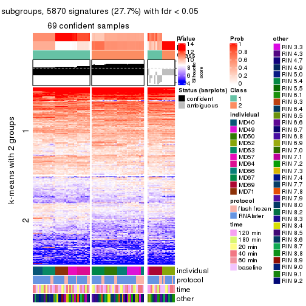</p>

</div>
<div id='tab-CV-mclust-get-signatures-no-scale-2'>
<pre><code class="r">get_signatures(res, k = 3, scale_rows = FALSE)
</code></pre>

<p></p>

</div>
<div id='tab-CV-mclust-get-signatures-no-scale-3'>
<pre><code class="r">get_signatures(res, k = 4, scale_rows = FALSE)
</code></pre>

<p></p>

</div>
<div id='tab-CV-mclust-get-signatures-no-scale-4'>
<pre><code class="r">get_signatures(res, k = 5, scale_rows = FALSE)
</code></pre>

<p></p>

</div>
<div id='tab-CV-mclust-get-signatures-no-scale-5'>
<pre><code class="r">get_signatures(res, k = 6, scale_rows = FALSE)
</code></pre>

<p></p>

</div>
</div>


Compare the overlap of signatures from different k:

```r
compare_signatures(res)
```


`get_signature()` returns a data frame invisibly. TO get the list of signatures, the function
call should be assigned to a variable explicitly. In following code, if `plot` argument is set
to `FALSE`, no heatmap is plotted while only the differential analysis is performed.

```r
# code only for demonstration
tb = get_signature(res, k = ..., plot = FALSE)
```

An example of the output of `tb` is:

```
#>   which_row         fdr    mean_1    mean_2 scaled_mean_1 scaled_mean_2 km
#> 1        38 0.042760348  8.373488  9.131774    -0.5533452     0.5164555  1
#> 2        40 0.018707592  7.106213  8.469186    -0.6173731     0.5762149  1
#> 3        55 0.019134737 10.221463 11.207825    -0.6159697     0.5749050  1
#> 4        59 0.006059896  5.921854  7.869574    -0.6899429     0.6439467  1
#> 5        60 0.018055526  8.928898 10.211722    -0.6204761     0.5791110  1
#> 6        98 0.009384629 15.714769 14.887706     0.6635654    -0.6193277  2
...
```

The columns in `tb` are:

1. `which_row`: row indices corresponding to the input matrix.
2. `fdr`: FDR for the differential test. 
3. `mean_x`: The mean value in group x.
4. `scaled_mean_x`: The mean value in group x after rows are scaled.
5. `km`: Row groups if k-means clustering is applied to rows.


UMAP plot which shows how samples are separated.


<script>
$( function() {
	$( '#tabs-CV-mclust-dimension-reduction' ).tabs();
} );
</script>
<div id='tabs-CV-mclust-dimension-reduction'>
<ul>
<li><a href='#tab-CV-mclust-dimension-reduction-1'>k = 2</a></li>
<li><a href='#tab-CV-mclust-dimension-reduction-2'>k = 3</a></li>
<li><a href='#tab-CV-mclust-dimension-reduction-3'>k = 4</a></li>
<li><a href='#tab-CV-mclust-dimension-reduction-4'>k = 5</a></li>
<li><a href='#tab-CV-mclust-dimension-reduction-5'>k = 6</a></li>
</ul>
<div id='tab-CV-mclust-dimension-reduction-1'>
<pre><code class="r">dimension_reduction(res, k = 2, method = &quot;UMAP&quot;)
</code></pre>

<p></p>

</div>
<div id='tab-CV-mclust-dimension-reduction-2'>
<pre><code class="r">dimension_reduction(res, k = 3, method = &quot;UMAP&quot;)
</code></pre>

<p></p>

</div>
<div id='tab-CV-mclust-dimension-reduction-3'>
<pre><code class="r">dimension_reduction(res, k = 4, method = &quot;UMAP&quot;)
</code></pre>

<p></p>

</div>
<div id='tab-CV-mclust-dimension-reduction-4'>
<pre><code class="r">dimension_reduction(res, k = 5, method = &quot;UMAP&quot;)
</code></pre>

<p></p>

</div>
<div id='tab-CV-mclust-dimension-reduction-5'>
<pre><code class="r">dimension_reduction(res, k = 6, method = &quot;UMAP&quot;)
</code></pre>

<p></p>

</div>
</div>


Following heatmap shows how subgroups are split when increasing `k`:

```r
collect_classes(res)
```


Test correlation between subgroups and known annotations. If the known
annotation is numeric, one-way ANOVA test is applied, and if the known
annotation is discrete, chi-squared contingency table test is applied.

```r
test_to_known_factors(res)
```

```
#>            n individual(p) protocol(p) time(p) other(p) k
#> CV:mclust 69      3.73e-11       0.628   0.997   0.8021 2
#> CV:mclust 55      4.49e-16       0.605   0.999   0.4067 3
#> CV:mclust 83      2.36e-36       0.963   1.000   0.0498 4
#> CV:mclust 78      2.53e-41       0.827   1.000   0.0525 5
#> CV:mclust 72      4.28e-49       0.894   1.000   0.1928 6
```


If matrix rows can be associated to genes, consider to use `functional_enrichment(res,
...)` to perform function enrichment for the signature genes. See [this vignette](http://bioconductor.org/packages/devel/bioc/vignettes/cola/inst/doc/functional_enrichment.html) for more detailed explanations.


 

---------------------------------------------------


### CV:NMF


The object with results only for a single top-value method and a single partition method 
can be extracted as:

```r
res = res_list["CV", "NMF"]
# you can also extract it by
# res = res_list["CV:NMF"]
```

A summary of `res` and all the functions that can be applied to it:

```r
res
```

```
#> A 'ConsensusPartition' object with k = 2, 3, 4, 5, 6.
#>   On a matrix with 21168 rows and 86 columns.
#>   Top rows (1000, 2000, 3000, 4000, 5000) are extracted by 'CV' method.
#>   Subgroups are detected by 'NMF' method.
#>   Performed in total 1250 partitions by row resampling.
#>   Best k for subgroups seems to be 3.
#> 
#> Following methods can be applied to this 'ConsensusPartition' object:
#>  [1] "cola_report"             "collect_classes"         "collect_plots"          
#>  [4] "collect_stats"           "colnames"                "compare_signatures"     
#>  [7] "consensus_heatmap"       "dimension_reduction"     "functional_enrichment"  
#> [10] "get_anno_col"            "get_anno"                "get_classes"            
#> [13] "get_consensus"           "get_matrix"              "get_membership"         
#> [16] "get_param"               "get_signatures"          "get_stats"              
#> [19] "is_best_k"               "is_stable_k"             "membership_heatmap"     
#> [22] "ncol"                    "nrow"                    "plot_ecdf"              
#> [25] "rownames"                "select_partition_number" "show"                   
#> [28] "suggest_best_k"          "test_to_known_factors"
```

`collect_plots()` function collects all the plots made from `res` for all `k` (number of partitions)
into one single page to provide an easy and fast comparison between different `k`.

```r
collect_plots(res)
```


The plots are:

- The first row: a plot of the ECDF (empirical cumulative distribution
  function) curves of the consensus matrix for each `k` and the heatmap of
  predicted classes for each `k`.
- The second row: heatmaps of the consensus matrix for each `k`.
- The third row: heatmaps of the membership matrix for each `k`.
- The fouth row: heatmaps of the signatures for each `k`.

All the plots in panels can be made by individual functions and they are
plotted later in this section.

`select_partition_number()` produces several plots showing different
statistics for choosing "optimized" `k`. There are following statistics:

- ECDF curves of the consensus matrix for each `k`;
- 1-PAC. [The PAC
  score](https://en.wikipedia.org/wiki/Consensus_clustering#Over-interpretation_potential_of_consensus_clustering)
  measures the proportion of the ambiguous subgrouping.
- Mean silhouette score.
- Concordance. The mean probability of fiting the consensus class ids in all
  partitions.
- Area increased. Denote $A_k$ as the area under the ECDF curve for current
  `k`, the area increased is defined as $A_k - A_{k-1}$.
- Rand index. The percent of pairs of samples that are both in a same cluster
  or both are not in a same cluster in the partition of k and k-1.
- Jaccard index. The ratio of pairs of samples are both in a same cluster in
  the partition of k and k-1 and the pairs of samples are both in a same
  cluster in the partition k or k-1.

The detailed explanations of these statistics can be found in [the _cola_
vignette](http://bioconductor.org/packages/devel/bioc/vignettes/cola/inst/doc/cola.html#toc_13).

Generally speaking, lower PAC score, higher mean silhouette score or higher
concordance corresponds to better partition. Rand index and Jaccard index
measure how similar the current partition is compared to partition with `k-1`.
If they are too similar, we won't accept `k` is better than `k-1`.

```r
select_partition_number(res)
```


The numeric values for all these statistics can be obtained by `get_stats()`.

```r
get_stats(res)
```

```
#>   k 1-PAC mean_silhouette concordance area_increased  Rand Jaccard
#> 2 2 0.345           0.554       0.813         0.4680 0.540   0.540
#> 3 3 0.801           0.862       0.939         0.4010 0.660   0.447
#> 4 4 0.644           0.702       0.848         0.1306 0.768   0.441
#> 5 5 0.605           0.551       0.741         0.0651 0.903   0.646
#> 6 6 0.709           0.604       0.742         0.0401 0.892   0.567
```

`suggest_best_k()` suggests the best $k$ based on these statistics. The rules are as follows:

- All $k$ with Jaccard index larger than 0.95 are removed because increasing
  $k$ does not provide enough extra information. If all $k$ are removed, it is
  marked as no subgroup is detected.
- For all $k$ with 1-PAC score larger than 0.9, the maximal $k$ is taken as
  the best $k$, and other $k$ are marked as optional $k$.
- If it does not fit the second rule. The $k$ with the maximal vote of the
  highest 1-PAC score, highest mean silhouette, and highest concordance is
  taken as the best $k$.

```r
suggest_best_k(res)
```

```
#> [1] 3
```


Following shows the table of the partitions (You need to click the **show/hide
code output** link to see it). The membership matrix (columns with name `p*`)
is inferred by
[`clue::cl_consensus()`](https://www.rdocumentation.org/link/cl_consensus?package=clue)
function with the `SE` method. Basically the value in the membership matrix
represents the probability to belong to a certain group. The finall class
label for an item is determined with the group with highest probability it
belongs to.

In `get_classes()` function, the entropy is calculated from the membership
matrix and the silhouette score is calculated from the consensus matrix.


<script>
$( function() {
	$( '#tabs-CV-NMF-get-classes' ).tabs();
} );
</script>
<div id='tabs-CV-NMF-get-classes'>
<ul>
<li><a href='#tab-CV-NMF-get-classes-1'>k = 2</a></li>
<li><a href='#tab-CV-NMF-get-classes-2'>k = 3</a></li>
<li><a href='#tab-CV-NMF-get-classes-3'>k = 4</a></li>
<li><a href='#tab-CV-NMF-get-classes-4'>k = 5</a></li>
<li><a href='#tab-CV-NMF-get-classes-5'>k = 6</a></li>
</ul>

<div id='tab-CV-NMF-get-classes-1'>
<p><a id='tab-CV-NMF-get-classes-1-a' style='color:#0366d6' href='#'>show/hide code output</a></p>
<pre><code class="r">cbind(get_classes(res, k = 2), get_membership(res, k = 2))
</code></pre>

<pre><code>#&gt;           class entropy silhouette    p1    p2
#&gt; GSM614415     1  0.0000     0.6868 1.000 0.000
#&gt; GSM614416     1  0.0000     0.6868 1.000 0.000
#&gt; GSM614417     1  0.0000     0.6868 1.000 0.000
#&gt; GSM614418     1  0.0000     0.6868 1.000 0.000
#&gt; GSM614419     1  0.5629     0.5635 0.868 0.132
#&gt; GSM614420     1  0.1414     0.6748 0.980 0.020
#&gt; GSM614421     2  0.1414     0.7909 0.020 0.980
#&gt; GSM614422     1  0.9996    -0.1138 0.512 0.488
#&gt; GSM614423     1  0.6801     0.6407 0.820 0.180
#&gt; GSM614424     2  0.0000     0.8028 0.000 1.000
#&gt; GSM614425     2  0.6343     0.6411 0.160 0.840
#&gt; GSM614426     2  0.3733     0.7447 0.072 0.928
#&gt; GSM614427     2  0.0000     0.8028 0.000 1.000
#&gt; GSM614428     2  0.0000     0.8028 0.000 1.000
#&gt; GSM614429     1  0.9977     0.3589 0.528 0.472
#&gt; GSM614430     1  0.9944     0.3977 0.544 0.456
#&gt; GSM614431     1  0.9896     0.4283 0.560 0.440
#&gt; GSM614432     1  0.9909     0.4222 0.556 0.444
#&gt; GSM614433     1  0.9909     0.4222 0.556 0.444
#&gt; GSM614434     1  0.9922     0.4155 0.552 0.448
#&gt; GSM614435     2  0.9732     0.0198 0.404 0.596
#&gt; GSM614436     2  0.0000     0.8028 0.000 1.000
#&gt; GSM614437     2  0.0000     0.8028 0.000 1.000
#&gt; GSM614438     2  0.0000     0.8028 0.000 1.000
#&gt; GSM614439     2  0.0000     0.8028 0.000 1.000
#&gt; GSM614440     2  0.0000     0.8028 0.000 1.000
#&gt; GSM614441     2  0.0000     0.8028 0.000 1.000
#&gt; GSM614442     2  0.0000     0.8028 0.000 1.000
#&gt; GSM614443     2  0.0000     0.8028 0.000 1.000
#&gt; GSM614444     2  0.0000     0.8028 0.000 1.000
#&gt; GSM614391     1  0.0000     0.6868 1.000 0.000
#&gt; GSM614392     1  0.0000     0.6868 1.000 0.000
#&gt; GSM614393     1  0.0000     0.6868 1.000 0.000
#&gt; GSM614394     1  0.0672     0.6824 0.992 0.008
#&gt; GSM614395     2  0.9881     0.2161 0.436 0.564
#&gt; GSM614396     1  0.1184     0.6775 0.984 0.016
#&gt; GSM614397     2  0.9909     0.2026 0.444 0.556
#&gt; GSM614398     1  0.9988    -0.1015 0.520 0.480
#&gt; GSM614399     1  0.9552     0.4979 0.624 0.376
#&gt; GSM614400     1  0.6148     0.6520 0.848 0.152
#&gt; GSM614401     1  0.2948     0.6801 0.948 0.052
#&gt; GSM614402     1  0.8207     0.5978 0.744 0.256
#&gt; GSM614403     1  0.9710     0.4732 0.600 0.400
#&gt; GSM614404     1  0.6438     0.6479 0.836 0.164
#&gt; GSM614405     1  0.8955     0.5564 0.688 0.312
#&gt; GSM614406     2  0.0000     0.8028 0.000 1.000
#&gt; GSM614407     1  0.0000     0.6868 1.000 0.000
#&gt; GSM614408     1  0.0000     0.6868 1.000 0.000
#&gt; GSM614409     1  0.0000     0.6868 1.000 0.000
#&gt; GSM614410     1  0.0000     0.6868 1.000 0.000
#&gt; GSM614411     1  0.0000     0.6868 1.000 0.000
#&gt; GSM614412     1  0.0000     0.6868 1.000 0.000
#&gt; GSM614413     1  0.9988    -0.1035 0.520 0.480
#&gt; GSM614414     1  0.9710     0.0778 0.600 0.400
#&gt; GSM614445     1  0.8608     0.5767 0.716 0.284
#&gt; GSM614446     1  0.8555     0.5736 0.720 0.280
#&gt; GSM614447     1  0.9775     0.4601 0.588 0.412
#&gt; GSM614448     2  0.2603     0.7716 0.044 0.956
#&gt; GSM614449     2  0.0376     0.8004 0.004 0.996
#&gt; GSM614450     2  0.6623     0.6642 0.172 0.828
#&gt; GSM614451     2  0.0000     0.8028 0.000 1.000
#&gt; GSM614452     2  0.0000     0.8028 0.000 1.000
#&gt; GSM614453     1  0.9922     0.4155 0.552 0.448
#&gt; GSM614454     1  0.9922     0.4155 0.552 0.448
#&gt; GSM614455     1  0.9922     0.4155 0.552 0.448
#&gt; GSM614456     2  0.9661     0.0666 0.392 0.608
#&gt; GSM614457     2  0.9552     0.1226 0.376 0.624
#&gt; GSM614458     2  0.9922    -0.1471 0.448 0.552
#&gt; GSM614459     2  0.5519     0.6761 0.128 0.872
#&gt; GSM614460     2  0.9954    -0.1880 0.460 0.540
#&gt; GSM614461     1  0.9922     0.4155 0.552 0.448
#&gt; GSM614462     1  0.9909     0.4222 0.556 0.444
#&gt; GSM614463     1  0.9881     0.4335 0.564 0.436
#&gt; GSM614464     1  0.9922     0.4155 0.552 0.448
#&gt; GSM614465     1  0.9896     0.4283 0.560 0.440
#&gt; GSM614466     1  0.9896     0.4283 0.560 0.440
#&gt; GSM614467     2  0.7745     0.5124 0.228 0.772
#&gt; GSM614468     1  0.9922     0.4155 0.552 0.448
#&gt; GSM614469     1  0.0000     0.6868 1.000 0.000
#&gt; GSM614470     1  0.0000     0.6868 1.000 0.000
#&gt; GSM614471     1  0.0000     0.6868 1.000 0.000
#&gt; GSM614472     1  0.0000     0.6868 1.000 0.000
#&gt; GSM614473     1  0.0000     0.6868 1.000 0.000
#&gt; GSM614474     1  0.0000     0.6868 1.000 0.000
#&gt; GSM614475     1  0.2603     0.6815 0.956 0.044
#&gt; GSM614476     1  0.7528     0.6242 0.784 0.216
</code></pre>

<script>
$('#tab-CV-NMF-get-classes-1-a').parent().next().next().hide();
$('#tab-CV-NMF-get-classes-1-a').click(function(){
  $('#tab-CV-NMF-get-classes-1-a').parent().next().next().toggle();
  return(false);
});
</script>
</div>

<div id='tab-CV-NMF-get-classes-2'>
<p><a id='tab-CV-NMF-get-classes-2-a' style='color:#0366d6' href='#'>show/hide code output</a></p>
<pre><code class="r">cbind(get_classes(res, k = 3), get_membership(res, k = 3))
</code></pre>

<pre><code>#&gt;           class entropy silhouette    p1    p2    p3
#&gt; GSM614415     1  0.0000     0.9181 1.000 0.000 0.000
#&gt; GSM614416     1  0.0000     0.9181 1.000 0.000 0.000
#&gt; GSM614417     1  0.0000     0.9181 1.000 0.000 0.000
#&gt; GSM614418     1  0.0000     0.9181 1.000 0.000 0.000
#&gt; GSM614419     1  0.0237     0.9166 0.996 0.000 0.004
#&gt; GSM614420     1  0.0237     0.9166 0.996 0.000 0.004
#&gt; GSM614421     3  0.1031     0.9529 0.024 0.000 0.976
#&gt; GSM614422     1  0.3816     0.7891 0.852 0.000 0.148
#&gt; GSM614423     2  0.4121     0.7921 0.168 0.832 0.000
#&gt; GSM614424     3  0.0592     0.9612 0.012 0.000 0.988
#&gt; GSM614425     3  0.3816     0.8248 0.148 0.000 0.852
#&gt; GSM614426     3  0.2625     0.8995 0.084 0.000 0.916
#&gt; GSM614427     3  0.0000     0.9684 0.000 0.000 1.000
#&gt; GSM614428     3  0.0000     0.9684 0.000 0.000 1.000
#&gt; GSM614429     2  0.0747     0.9189 0.000 0.984 0.016
#&gt; GSM614430     2  0.0424     0.9212 0.000 0.992 0.008
#&gt; GSM614431     2  0.0000     0.9230 0.000 1.000 0.000
#&gt; GSM614432     2  0.0000     0.9230 0.000 1.000 0.000
#&gt; GSM614433     2  0.0000     0.9230 0.000 1.000 0.000
#&gt; GSM614434     2  0.0000     0.9230 0.000 1.000 0.000
#&gt; GSM614435     2  0.2711     0.8745 0.000 0.912 0.088
#&gt; GSM614436     3  0.3192     0.8642 0.000 0.112 0.888
#&gt; GSM614437     3  0.1411     0.9413 0.000 0.036 0.964
#&gt; GSM614438     3  0.0000     0.9684 0.000 0.000 1.000
#&gt; GSM614439     3  0.0000     0.9684 0.000 0.000 1.000
#&gt; GSM614440     3  0.0000     0.9684 0.000 0.000 1.000
#&gt; GSM614441     3  0.0000     0.9684 0.000 0.000 1.000
#&gt; GSM614442     3  0.0000     0.9684 0.000 0.000 1.000
#&gt; GSM614443     3  0.0592     0.9607 0.000 0.012 0.988
#&gt; GSM614444     3  0.0000     0.9684 0.000 0.000 1.000
#&gt; GSM614391     1  0.0000     0.9181 1.000 0.000 0.000
#&gt; GSM614392     1  0.0000     0.9181 1.000 0.000 0.000
#&gt; GSM614393     1  0.0000     0.9181 1.000 0.000 0.000
#&gt; GSM614394     1  0.0000     0.9181 1.000 0.000 0.000
#&gt; GSM614395     1  0.6302     0.0403 0.520 0.000 0.480
#&gt; GSM614396     1  0.0000     0.9181 1.000 0.000 0.000
#&gt; GSM614397     1  0.2448     0.8619 0.924 0.000 0.076
#&gt; GSM614398     1  0.0592     0.9122 0.988 0.000 0.012
#&gt; GSM614399     2  0.0000     0.9230 0.000 1.000 0.000
#&gt; GSM614400     2  0.0237     0.9219 0.004 0.996 0.000
#&gt; GSM614401     2  0.0747     0.9172 0.016 0.984 0.000
#&gt; GSM614402     2  0.0000     0.9230 0.000 1.000 0.000
#&gt; GSM614403     2  0.3091     0.8846 0.016 0.912 0.072
#&gt; GSM614404     2  0.0000     0.9230 0.000 1.000 0.000
#&gt; GSM614405     2  0.9118     0.4303 0.232 0.548 0.220
#&gt; GSM614406     3  0.0000     0.9684 0.000 0.000 1.000
#&gt; GSM614407     1  0.0237     0.9157 0.996 0.004 0.000
#&gt; GSM614408     1  0.0000     0.9181 1.000 0.000 0.000
#&gt; GSM614409     1  0.0000     0.9181 1.000 0.000 0.000
#&gt; GSM614410     1  0.0000     0.9181 1.000 0.000 0.000
#&gt; GSM614411     1  0.0000     0.9181 1.000 0.000 0.000
#&gt; GSM614412     1  0.0000     0.9181 1.000 0.000 0.000
#&gt; GSM614413     1  0.1529     0.8926 0.960 0.000 0.040
#&gt; GSM614414     1  0.0747     0.9097 0.984 0.000 0.016
#&gt; GSM614445     2  0.0592     0.9194 0.012 0.988 0.000
#&gt; GSM614446     2  0.3918     0.8375 0.120 0.868 0.012
#&gt; GSM614447     2  0.1267     0.9151 0.004 0.972 0.024
#&gt; GSM614448     3  0.0000     0.9684 0.000 0.000 1.000
#&gt; GSM614449     3  0.0000     0.9684 0.000 0.000 1.000
#&gt; GSM614450     3  0.5085     0.8332 0.072 0.092 0.836
#&gt; GSM614451     3  0.0000     0.9684 0.000 0.000 1.000
#&gt; GSM614452     3  0.0000     0.9684 0.000 0.000 1.000
#&gt; GSM614453     2  0.0000     0.9230 0.000 1.000 0.000
#&gt; GSM614454     2  0.0000     0.9230 0.000 1.000 0.000
#&gt; GSM614455     2  0.0000     0.9230 0.000 1.000 0.000
#&gt; GSM614456     2  0.2165     0.8935 0.000 0.936 0.064
#&gt; GSM614457     2  0.2066     0.8963 0.000 0.940 0.060
#&gt; GSM614458     2  0.1163     0.9142 0.000 0.972 0.028
#&gt; GSM614459     2  0.4654     0.7453 0.000 0.792 0.208
#&gt; GSM614460     2  0.1643     0.9061 0.000 0.956 0.044
#&gt; GSM614461     2  0.0000     0.9230 0.000 1.000 0.000
#&gt; GSM614462     2  0.0000     0.9230 0.000 1.000 0.000
#&gt; GSM614463     2  0.0000     0.9230 0.000 1.000 0.000
#&gt; GSM614464     2  0.0000     0.9230 0.000 1.000 0.000
#&gt; GSM614465     2  0.0000     0.9230 0.000 1.000 0.000
#&gt; GSM614466     2  0.0000     0.9230 0.000 1.000 0.000
#&gt; GSM614467     2  0.4504     0.7579 0.000 0.804 0.196
#&gt; GSM614468     2  0.0000     0.9230 0.000 1.000 0.000
#&gt; GSM614469     2  0.6140     0.3482 0.404 0.596 0.000
#&gt; GSM614470     2  0.6295     0.1301 0.472 0.528 0.000
#&gt; GSM614471     2  0.2625     0.8735 0.084 0.916 0.000
#&gt; GSM614472     2  0.3412     0.8386 0.124 0.876 0.000
#&gt; GSM614473     1  0.6204     0.2036 0.576 0.424 0.000
#&gt; GSM614474     1  0.6225     0.1795 0.568 0.432 0.000
#&gt; GSM614475     2  0.3941     0.8035 0.156 0.844 0.000
#&gt; GSM614476     1  0.5662     0.7616 0.808 0.100 0.092
</code></pre>

<script>
$('#tab-CV-NMF-get-classes-2-a').parent().next().next().hide();
$('#tab-CV-NMF-get-classes-2-a').click(function(){
  $('#tab-CV-NMF-get-classes-2-a').parent().next().next().toggle();
  return(false);
});
</script>
</div>

<div id='tab-CV-NMF-get-classes-3'>
<p><a id='tab-CV-NMF-get-classes-3-a' style='color:#0366d6' href='#'>show/hide code output</a></p>
<pre><code class="r">cbind(get_classes(res, k = 4), get_membership(res, k = 4))
</code></pre>

<pre><code>#&gt;           class entropy silhouette    p1    p2    p3    p4
#&gt; GSM614415     1  0.0000     0.9166 1.000 0.000 0.000 0.000
#&gt; GSM614416     1  0.0000     0.9166 1.000 0.000 0.000 0.000
#&gt; GSM614417     1  0.0000     0.9166 1.000 0.000 0.000 0.000
#&gt; GSM614418     1  0.0000     0.9166 1.000 0.000 0.000 0.000
#&gt; GSM614419     1  0.0188     0.9172 0.996 0.000 0.004 0.000
#&gt; GSM614420     1  0.0188     0.9172 0.996 0.000 0.004 0.000
#&gt; GSM614421     3  0.2125     0.7660 0.000 0.076 0.920 0.004
#&gt; GSM614422     3  0.2149     0.7659 0.000 0.088 0.912 0.000
#&gt; GSM614423     3  0.4250     0.6419 0.000 0.276 0.724 0.000
#&gt; GSM614424     3  0.2401     0.7658 0.000 0.092 0.904 0.004
#&gt; GSM614425     3  0.1824     0.7626 0.000 0.060 0.936 0.004
#&gt; GSM614426     3  0.1890     0.7609 0.000 0.056 0.936 0.008
#&gt; GSM614427     3  0.1151     0.7449 0.000 0.024 0.968 0.008
#&gt; GSM614428     3  0.1211     0.7076 0.000 0.000 0.960 0.040
#&gt; GSM614429     2  0.2281     0.7412 0.000 0.904 0.000 0.096
#&gt; GSM614430     2  0.1637     0.7735 0.000 0.940 0.000 0.060
#&gt; GSM614431     2  0.0592     0.8021 0.000 0.984 0.000 0.016
#&gt; GSM614432     2  0.0657     0.8064 0.000 0.984 0.004 0.012
#&gt; GSM614433     2  0.2053     0.8108 0.000 0.924 0.072 0.004
#&gt; GSM614434     2  0.1576     0.7859 0.000 0.948 0.004 0.048
#&gt; GSM614435     2  0.3810     0.6330 0.000 0.804 0.008 0.188
#&gt; GSM614436     4  0.5267     0.6403 0.000 0.076 0.184 0.740
#&gt; GSM614437     4  0.0592     0.7539 0.000 0.016 0.000 0.984
#&gt; GSM614438     4  0.2973     0.7351 0.000 0.000 0.144 0.856
#&gt; GSM614439     4  0.3311     0.7161 0.000 0.000 0.172 0.828
#&gt; GSM614440     4  0.3266     0.7197 0.000 0.000 0.168 0.832
#&gt; GSM614441     4  0.3123     0.7288 0.000 0.000 0.156 0.844
#&gt; GSM614442     4  0.2530     0.7445 0.000 0.000 0.112 0.888
#&gt; GSM614443     4  0.0336     0.7538 0.000 0.000 0.008 0.992
#&gt; GSM614444     4  0.3024     0.7334 0.000 0.000 0.148 0.852
#&gt; GSM614391     1  0.0188     0.9172 0.996 0.000 0.004 0.000
#&gt; GSM614392     1  0.0000     0.9166 1.000 0.000 0.000 0.000
#&gt; GSM614393     1  0.0188     0.9172 0.996 0.000 0.004 0.000
#&gt; GSM614394     1  0.0469     0.9159 0.988 0.000 0.012 0.000
#&gt; GSM614395     3  0.7113     0.2789 0.276 0.000 0.552 0.172
#&gt; GSM614396     1  0.0469     0.9159 0.988 0.000 0.012 0.000
#&gt; GSM614397     1  0.4903     0.6487 0.724 0.000 0.248 0.028
#&gt; GSM614398     1  0.1716     0.8864 0.936 0.000 0.064 0.000
#&gt; GSM614399     2  0.2635     0.8095 0.000 0.904 0.076 0.020
#&gt; GSM614400     2  0.2234     0.8134 0.008 0.924 0.064 0.004
#&gt; GSM614401     2  0.2530     0.7942 0.004 0.896 0.100 0.000
#&gt; GSM614402     2  0.3172     0.7350 0.000 0.840 0.160 0.000
#&gt; GSM614403     3  0.4972     0.2831 0.000 0.456 0.544 0.000
#&gt; GSM614404     2  0.2053     0.8107 0.004 0.924 0.072 0.000
#&gt; GSM614405     3  0.5741     0.2934 0.020 0.440 0.536 0.004
#&gt; GSM614406     3  0.4477     0.3895 0.000 0.000 0.688 0.312
#&gt; GSM614407     1  0.1004     0.9117 0.972 0.004 0.024 0.000
#&gt; GSM614408     1  0.0707     0.9141 0.980 0.000 0.020 0.000
#&gt; GSM614409     1  0.1305     0.9069 0.960 0.004 0.036 0.000
#&gt; GSM614410     1  0.0336     0.9165 0.992 0.000 0.008 0.000
#&gt; GSM614411     1  0.1854     0.8974 0.940 0.012 0.048 0.000
#&gt; GSM614412     1  0.2053     0.8868 0.924 0.004 0.072 0.000
#&gt; GSM614413     3  0.3721     0.6166 0.176 0.004 0.816 0.004
#&gt; GSM614414     1  0.4776     0.4561 0.624 0.000 0.376 0.000
#&gt; GSM614445     3  0.4804     0.4689 0.000 0.384 0.616 0.000
#&gt; GSM614446     3  0.4164     0.6536 0.000 0.264 0.736 0.000
#&gt; GSM614447     3  0.4730     0.5073 0.000 0.364 0.636 0.000
#&gt; GSM614448     3  0.0524     0.7365 0.000 0.008 0.988 0.004
#&gt; GSM614449     3  0.2125     0.7659 0.000 0.076 0.920 0.004
#&gt; GSM614450     3  0.3266     0.7293 0.000 0.168 0.832 0.000
#&gt; GSM614451     3  0.3726     0.5471 0.000 0.000 0.788 0.212
#&gt; GSM614452     3  0.3528     0.5707 0.000 0.000 0.808 0.192
#&gt; GSM614453     2  0.4697     0.2779 0.000 0.644 0.000 0.356
#&gt; GSM614454     2  0.4998    -0.1848 0.000 0.512 0.000 0.488
#&gt; GSM614455     4  0.4977     0.2670 0.000 0.460 0.000 0.540
#&gt; GSM614456     4  0.4222     0.6346 0.000 0.272 0.000 0.728
#&gt; GSM614457     4  0.3837     0.6794 0.000 0.224 0.000 0.776
#&gt; GSM614458     4  0.4967     0.2923 0.000 0.452 0.000 0.548
#&gt; GSM614459     4  0.3569     0.6984 0.000 0.196 0.000 0.804
#&gt; GSM614460     4  0.4250     0.6305 0.000 0.276 0.000 0.724
#&gt; GSM614461     2  0.0895     0.8150 0.000 0.976 0.020 0.004
#&gt; GSM614462     2  0.1792     0.8121 0.000 0.932 0.068 0.000
#&gt; GSM614463     2  0.1118     0.8168 0.000 0.964 0.036 0.000
#&gt; GSM614464     2  0.2125     0.8107 0.000 0.920 0.076 0.004
#&gt; GSM614465     2  0.2589     0.7785 0.000 0.884 0.116 0.000
#&gt; GSM614466     2  0.1824     0.8148 0.000 0.936 0.060 0.004
#&gt; GSM614467     2  0.5132    -0.0244 0.000 0.548 0.448 0.004
#&gt; GSM614468     2  0.3791     0.6762 0.000 0.796 0.200 0.004
#&gt; GSM614469     1  0.3972     0.7346 0.788 0.204 0.008 0.000
#&gt; GSM614470     1  0.4248     0.7104 0.768 0.220 0.012 0.000
#&gt; GSM614471     2  0.4606     0.5822 0.264 0.724 0.012 0.000
#&gt; GSM614472     2  0.5306     0.4196 0.348 0.632 0.020 0.000
#&gt; GSM614473     1  0.2546     0.8565 0.900 0.092 0.008 0.000
#&gt; GSM614474     1  0.4399     0.7165 0.768 0.212 0.020 0.000
#&gt; GSM614475     2  0.4036     0.7553 0.088 0.836 0.076 0.000
#&gt; GSM614476     3  0.4903     0.6581 0.028 0.248 0.724 0.000
</code></pre>

<script>
$('#tab-CV-NMF-get-classes-3-a').parent().next().next().hide();
$('#tab-CV-NMF-get-classes-3-a').click(function(){
  $('#tab-CV-NMF-get-classes-3-a').parent().next().next().toggle();
  return(false);
});
</script>
</div>

<div id='tab-CV-NMF-get-classes-4'>
<p><a id='tab-CV-NMF-get-classes-4-a' style='color:#0366d6' href='#'>show/hide code output</a></p>
<pre><code class="r">cbind(get_classes(res, k = 5), get_membership(res, k = 5))
</code></pre>

<pre><code>#&gt;           class entropy silhouette    p1    p2    p3    p4    p5
#&gt; GSM614415     5  0.2471     0.6383 0.136 0.000 0.000 0.000 0.864
#&gt; GSM614416     5  0.2516     0.6361 0.140 0.000 0.000 0.000 0.860
#&gt; GSM614417     5  0.2516     0.6361 0.140 0.000 0.000 0.000 0.860
#&gt; GSM614418     5  0.2516     0.6361 0.140 0.000 0.000 0.000 0.860
#&gt; GSM614419     5  0.2424     0.6400 0.132 0.000 0.000 0.000 0.868
#&gt; GSM614420     5  0.2424     0.6400 0.132 0.000 0.000 0.000 0.868
#&gt; GSM614421     3  0.1444     0.7787 0.040 0.012 0.948 0.000 0.000
#&gt; GSM614422     3  0.2208     0.7677 0.072 0.020 0.908 0.000 0.000
#&gt; GSM614423     3  0.3798     0.7322 0.064 0.128 0.808 0.000 0.000
#&gt; GSM614424     3  0.1310     0.7807 0.020 0.024 0.956 0.000 0.000
#&gt; GSM614425     3  0.1043     0.7768 0.040 0.000 0.960 0.000 0.000
#&gt; GSM614426     3  0.1082     0.7806 0.028 0.008 0.964 0.000 0.000
#&gt; GSM614427     3  0.1116     0.7784 0.028 0.004 0.964 0.004 0.000
#&gt; GSM614428     3  0.2450     0.7471 0.052 0.000 0.900 0.048 0.000
#&gt; GSM614429     2  0.1538     0.6761 0.008 0.948 0.008 0.036 0.000
#&gt; GSM614430     2  0.1356     0.6762 0.012 0.956 0.004 0.028 0.000
#&gt; GSM614431     2  0.1281     0.7113 0.012 0.956 0.032 0.000 0.000
#&gt; GSM614432     2  0.1717     0.7144 0.008 0.936 0.052 0.004 0.000
#&gt; GSM614433     2  0.2358     0.7238 0.008 0.888 0.104 0.000 0.000
#&gt; GSM614434     2  0.1314     0.6933 0.012 0.960 0.016 0.012 0.000
#&gt; GSM614435     2  0.2733     0.5897 0.012 0.872 0.004 0.112 0.000
#&gt; GSM614436     4  0.7022     0.4500 0.024 0.288 0.212 0.476 0.000
#&gt; GSM614437     4  0.1608     0.7657 0.000 0.072 0.000 0.928 0.000
#&gt; GSM614438     4  0.1410     0.7666 0.000 0.000 0.060 0.940 0.000
#&gt; GSM614439     4  0.1544     0.7624 0.000 0.000 0.068 0.932 0.000
#&gt; GSM614440     4  0.1544     0.7624 0.000 0.000 0.068 0.932 0.000
#&gt; GSM614441     4  0.1544     0.7624 0.000 0.000 0.068 0.932 0.000
#&gt; GSM614442     4  0.0955     0.7708 0.000 0.004 0.028 0.968 0.000
#&gt; GSM614443     4  0.1544     0.7663 0.000 0.068 0.000 0.932 0.000
#&gt; GSM614444     4  0.1341     0.7683 0.000 0.000 0.056 0.944 0.000
#&gt; GSM614391     5  0.2329     0.6420 0.124 0.000 0.000 0.000 0.876
#&gt; GSM614392     5  0.2230     0.6441 0.116 0.000 0.000 0.000 0.884
#&gt; GSM614393     5  0.2230     0.6441 0.116 0.000 0.000 0.000 0.884
#&gt; GSM614394     5  0.2629     0.6360 0.136 0.000 0.004 0.000 0.860
#&gt; GSM614395     5  0.7043     0.2366 0.068 0.000 0.308 0.112 0.512
#&gt; GSM614396     5  0.2674     0.6334 0.140 0.000 0.004 0.000 0.856
#&gt; GSM614397     5  0.4968     0.5313 0.140 0.000 0.104 0.016 0.740
#&gt; GSM614398     5  0.3595     0.6036 0.140 0.000 0.044 0.000 0.816
#&gt; GSM614399     2  0.6202     0.5146 0.308 0.584 0.080 0.012 0.016
#&gt; GSM614400     2  0.6903     0.3312 0.368 0.488 0.060 0.004 0.080
#&gt; GSM614401     1  0.7027    -0.2615 0.420 0.420 0.068 0.000 0.092
#&gt; GSM614402     2  0.6690     0.4910 0.288 0.540 0.140 0.000 0.032
#&gt; GSM614403     3  0.6791     0.2925 0.236 0.260 0.492 0.000 0.012
#&gt; GSM614404     2  0.6661     0.4046 0.352 0.512 0.084 0.000 0.052
#&gt; GSM614405     3  0.7331     0.2467 0.328 0.212 0.428 0.004 0.028
#&gt; GSM614406     3  0.5892     0.3194 0.072 0.000 0.524 0.392 0.012
#&gt; GSM614407     1  0.3480     0.4921 0.752 0.000 0.000 0.000 0.248
#&gt; GSM614408     1  0.3636     0.4720 0.728 0.000 0.000 0.000 0.272
#&gt; GSM614409     1  0.3511     0.5166 0.800 0.004 0.012 0.000 0.184
#&gt; GSM614410     1  0.3336     0.4943 0.772 0.000 0.000 0.000 0.228
#&gt; GSM614411     1  0.3652     0.5094 0.784 0.004 0.012 0.000 0.200
#&gt; GSM614412     1  0.3951     0.4932 0.776 0.004 0.028 0.000 0.192
#&gt; GSM614413     1  0.5366     0.3891 0.684 0.008 0.228 0.008 0.072
#&gt; GSM614414     1  0.5054     0.4511 0.732 0.004 0.144 0.008 0.112
#&gt; GSM614445     3  0.5631     0.5459 0.164 0.200 0.636 0.000 0.000
#&gt; GSM614446     3  0.4458     0.6926 0.120 0.120 0.760 0.000 0.000
#&gt; GSM614447     3  0.5163     0.6289 0.156 0.152 0.692 0.000 0.000
#&gt; GSM614448     3  0.2130     0.7539 0.012 0.000 0.908 0.080 0.000
#&gt; GSM614449     3  0.2234     0.7771 0.032 0.012 0.920 0.036 0.000
#&gt; GSM614450     3  0.3126     0.7622 0.076 0.048 0.868 0.008 0.000
#&gt; GSM614451     3  0.3496     0.6434 0.012 0.000 0.788 0.200 0.000
#&gt; GSM614452     3  0.3280     0.6654 0.012 0.000 0.812 0.176 0.000
#&gt; GSM614453     2  0.3048     0.5212 0.004 0.820 0.000 0.176 0.000
#&gt; GSM614454     2  0.3689     0.3821 0.004 0.740 0.000 0.256 0.000
#&gt; GSM614455     2  0.4182     0.1424 0.004 0.644 0.000 0.352 0.000
#&gt; GSM614456     4  0.4430     0.3948 0.004 0.456 0.000 0.540 0.000
#&gt; GSM614457     4  0.4182     0.5805 0.004 0.352 0.000 0.644 0.000
#&gt; GSM614458     2  0.4182     0.1249 0.004 0.644 0.000 0.352 0.000
#&gt; GSM614459     4  0.3949     0.6353 0.004 0.300 0.000 0.696 0.000
#&gt; GSM614460     4  0.4359     0.4923 0.004 0.412 0.000 0.584 0.000
#&gt; GSM614461     2  0.2609     0.7256 0.048 0.896 0.052 0.004 0.000
#&gt; GSM614462     2  0.3857     0.7110 0.084 0.808 0.108 0.000 0.000
#&gt; GSM614463     2  0.3420     0.7190 0.084 0.840 0.076 0.000 0.000
#&gt; GSM614464     2  0.4300     0.6972 0.096 0.772 0.132 0.000 0.000
#&gt; GSM614465     2  0.4599     0.6744 0.100 0.744 0.156 0.000 0.000
#&gt; GSM614466     2  0.3912     0.7108 0.088 0.804 0.108 0.000 0.000
#&gt; GSM614467     2  0.4979     0.0306 0.028 0.492 0.480 0.000 0.000
#&gt; GSM614468     2  0.3876     0.6754 0.032 0.776 0.192 0.000 0.000
#&gt; GSM614469     5  0.5742    -0.0163 0.404 0.088 0.000 0.000 0.508
#&gt; GSM614470     1  0.5840     0.0926 0.488 0.096 0.000 0.000 0.416
#&gt; GSM614471     1  0.6638     0.2436 0.440 0.320 0.000 0.000 0.240
#&gt; GSM614472     1  0.6610     0.2584 0.460 0.260 0.000 0.000 0.280
#&gt; GSM614473     5  0.5371     0.0505 0.420 0.056 0.000 0.000 0.524
#&gt; GSM614474     5  0.5293    -0.0716 0.460 0.048 0.000 0.000 0.492
#&gt; GSM614475     2  0.6555     0.4515 0.272 0.580 0.068 0.000 0.080
#&gt; GSM614476     3  0.6333     0.6023 0.220 0.068 0.644 0.016 0.052
</code></pre>

<script>
$('#tab-CV-NMF-get-classes-4-a').parent().next().next().hide();
$('#tab-CV-NMF-get-classes-4-a').click(function(){
  $('#tab-CV-NMF-get-classes-4-a').parent().next().next().toggle();
  return(false);
});
</script>
</div>

<div id='tab-CV-NMF-get-classes-5'>
<p><a id='tab-CV-NMF-get-classes-5-a' style='color:#0366d6' href='#'>show/hide code output</a></p>
<pre><code class="r">cbind(get_classes(res, k = 6), get_membership(res, k = 6))
</code></pre>

<pre><code>#&gt;           class entropy silhouette    p1    p2    p3    p4    p5    p6
#&gt; GSM614415     5  0.2790    0.53284 0.020 0.000 0.000 0.000 0.840 0.140
#&gt; GSM614416     5  0.2790    0.53284 0.020 0.000 0.000 0.000 0.840 0.140
#&gt; GSM614417     5  0.2790    0.53284 0.020 0.000 0.000 0.000 0.840 0.140
#&gt; GSM614418     5  0.2790    0.53284 0.020 0.000 0.000 0.000 0.840 0.140
#&gt; GSM614419     5  0.2664    0.53326 0.016 0.000 0.000 0.000 0.848 0.136
#&gt; GSM614420     5  0.2664    0.53326 0.016 0.000 0.000 0.000 0.848 0.136
#&gt; GSM614421     3  0.1448    0.80433 0.012 0.024 0.948 0.000 0.000 0.016
#&gt; GSM614422     3  0.2084    0.79153 0.024 0.016 0.916 0.000 0.000 0.044
#&gt; GSM614423     3  0.4422    0.67513 0.096 0.076 0.768 0.000 0.000 0.060
#&gt; GSM614424     3  0.1313    0.80254 0.016 0.028 0.952 0.000 0.000 0.004
#&gt; GSM614425     3  0.1078    0.80627 0.008 0.016 0.964 0.000 0.000 0.012
#&gt; GSM614426     3  0.1251    0.80361 0.012 0.024 0.956 0.000 0.000 0.008
#&gt; GSM614427     3  0.0603    0.80632 0.004 0.016 0.980 0.000 0.000 0.000
#&gt; GSM614428     3  0.0810    0.80226 0.008 0.004 0.976 0.004 0.000 0.008
#&gt; GSM614429     2  0.1088    0.73364 0.000 0.960 0.016 0.024 0.000 0.000
#&gt; GSM614430     2  0.1109    0.73365 0.004 0.964 0.016 0.012 0.000 0.004
#&gt; GSM614431     2  0.1003    0.72949 0.020 0.964 0.016 0.000 0.000 0.000
#&gt; GSM614432     2  0.1492    0.72570 0.024 0.940 0.036 0.000 0.000 0.000
#&gt; GSM614433     2  0.2263    0.71124 0.048 0.896 0.056 0.000 0.000 0.000
#&gt; GSM614434     2  0.0717    0.73164 0.008 0.976 0.016 0.000 0.000 0.000
#&gt; GSM614435     2  0.2036    0.72352 0.000 0.912 0.016 0.064 0.000 0.008
#&gt; GSM614436     2  0.6001    0.38313 0.004 0.552 0.200 0.228 0.000 0.016
#&gt; GSM614437     4  0.1141    0.79482 0.000 0.052 0.000 0.948 0.000 0.000
#&gt; GSM614438     4  0.1141    0.83534 0.000 0.000 0.052 0.948 0.000 0.000
#&gt; GSM614439     4  0.1141    0.83534 0.000 0.000 0.052 0.948 0.000 0.000
#&gt; GSM614440     4  0.1141    0.83534 0.000 0.000 0.052 0.948 0.000 0.000
#&gt; GSM614441     4  0.1141    0.83534 0.000 0.000 0.052 0.948 0.000 0.000
#&gt; GSM614442     4  0.0972    0.82755 0.000 0.008 0.028 0.964 0.000 0.000
#&gt; GSM614443     4  0.0937    0.80232 0.000 0.040 0.000 0.960 0.000 0.000
#&gt; GSM614444     4  0.1141    0.83534 0.000 0.000 0.052 0.948 0.000 0.000
#&gt; GSM614391     5  0.5240    0.49612 0.256 0.000 0.004 0.012 0.632 0.096
#&gt; GSM614392     5  0.5105    0.49713 0.256 0.000 0.000 0.012 0.636 0.096
#&gt; GSM614393     5  0.5105    0.49713 0.256 0.000 0.000 0.012 0.636 0.096
#&gt; GSM614394     5  0.5322    0.49475 0.260 0.000 0.008 0.012 0.628 0.092
#&gt; GSM614395     5  0.6762    0.43050 0.268 0.000 0.116 0.032 0.528 0.056
#&gt; GSM614396     5  0.5578    0.48945 0.260 0.000 0.020 0.012 0.616 0.092
#&gt; GSM614397     5  0.6032    0.47605 0.260 0.000 0.048 0.012 0.588 0.092
#&gt; GSM614398     5  0.5934    0.47778 0.264 0.000 0.040 0.012 0.592 0.092
#&gt; GSM614399     1  0.4346    0.74702 0.692 0.268 0.016 0.016 0.000 0.008
#&gt; GSM614400     1  0.4583    0.77543 0.708 0.208 0.004 0.000 0.072 0.008
#&gt; GSM614401     1  0.4913    0.77254 0.712 0.168 0.012 0.000 0.092 0.016
#&gt; GSM614402     1  0.4289    0.78907 0.720 0.220 0.048 0.000 0.012 0.000
#&gt; GSM614403     1  0.4399    0.74920 0.728 0.112 0.156 0.000 0.000 0.004
#&gt; GSM614404     1  0.4614    0.78167 0.708 0.228 0.024 0.000 0.024 0.016
#&gt; GSM614405     1  0.4859    0.75920 0.744 0.108 0.108 0.008 0.012 0.020
#&gt; GSM614406     4  0.6178   -0.00431 0.348 0.000 0.260 0.388 0.000 0.004
#&gt; GSM614407     6  0.1503    0.90568 0.016 0.000 0.008 0.000 0.032 0.944
#&gt; GSM614408     6  0.1649    0.89912 0.016 0.000 0.008 0.000 0.040 0.936
#&gt; GSM614409     6  0.1232    0.92526 0.016 0.000 0.024 0.000 0.004 0.956
#&gt; GSM614410     6  0.0976    0.92035 0.016 0.000 0.008 0.000 0.008 0.968
#&gt; GSM614411     6  0.0748    0.92315 0.004 0.000 0.016 0.000 0.004 0.976
#&gt; GSM614412     6  0.0790    0.91876 0.000 0.000 0.032 0.000 0.000 0.968
#&gt; GSM614413     6  0.2340    0.81656 0.000 0.000 0.148 0.000 0.000 0.852
#&gt; GSM614414     6  0.1863    0.86689 0.000 0.000 0.104 0.000 0.000 0.896
#&gt; GSM614445     1  0.5094    0.45954 0.568 0.080 0.348 0.000 0.004 0.000
#&gt; GSM614446     3  0.4908   -0.07377 0.464 0.040 0.488 0.000 0.004 0.004
#&gt; GSM614447     1  0.5014    0.43407 0.576 0.060 0.356 0.000 0.004 0.004
#&gt; GSM614448     3  0.2948    0.75945 0.092 0.000 0.848 0.060 0.000 0.000
#&gt; GSM614449     3  0.3042    0.74677 0.128 0.000 0.836 0.032 0.004 0.000
#&gt; GSM614450     3  0.4478    0.53762 0.284 0.016 0.672 0.024 0.004 0.000
#&gt; GSM614451     3  0.3528    0.71419 0.036 0.000 0.800 0.156 0.004 0.004
#&gt; GSM614452     3  0.3196    0.73498 0.036 0.000 0.824 0.136 0.000 0.004
#&gt; GSM614453     2  0.1663    0.71997 0.000 0.912 0.000 0.088 0.000 0.000
#&gt; GSM614454     2  0.2048    0.71031 0.000 0.880 0.000 0.120 0.000 0.000
#&gt; GSM614455     2  0.2854    0.63931 0.000 0.792 0.000 0.208 0.000 0.000
#&gt; GSM614456     2  0.3309    0.54221 0.000 0.720 0.000 0.280 0.000 0.000
#&gt; GSM614457     2  0.3955    0.33637 0.000 0.608 0.000 0.384 0.000 0.008
#&gt; GSM614458     2  0.2402    0.69602 0.000 0.856 0.000 0.140 0.000 0.004
#&gt; GSM614459     4  0.4098   -0.12858 0.000 0.496 0.000 0.496 0.000 0.008
#&gt; GSM614460     2  0.3804    0.43411 0.000 0.656 0.000 0.336 0.000 0.008
#&gt; GSM614461     2  0.2983    0.66842 0.136 0.832 0.032 0.000 0.000 0.000
#&gt; GSM614462     2  0.3555    0.61582 0.184 0.776 0.040 0.000 0.000 0.000
#&gt; GSM614463     2  0.3210    0.64254 0.168 0.804 0.028 0.000 0.000 0.000
#&gt; GSM614464     2  0.3744    0.60561 0.184 0.764 0.052 0.000 0.000 0.000
#&gt; GSM614465     2  0.4059    0.53164 0.228 0.720 0.052 0.000 0.000 0.000
#&gt; GSM614466     2  0.3649    0.60115 0.196 0.764 0.040 0.000 0.000 0.000
#&gt; GSM614467     2  0.4928    0.30251 0.076 0.572 0.352 0.000 0.000 0.000
#&gt; GSM614468     2  0.3566    0.66059 0.104 0.800 0.096 0.000 0.000 0.000
#&gt; GSM614469     5  0.6531    0.29211 0.228 0.024 0.008 0.000 0.476 0.264
#&gt; GSM614470     5  0.6676    0.16763 0.360 0.032 0.008 0.000 0.412 0.188
#&gt; GSM614471     5  0.7622    0.01420 0.320 0.144 0.008 0.000 0.336 0.192
#&gt; GSM614472     5  0.7153    0.09392 0.360 0.076 0.008 0.000 0.372 0.184
#&gt; GSM614473     5  0.6453    0.33375 0.260 0.028 0.008 0.000 0.504 0.200
#&gt; GSM614474     5  0.6488    0.12029 0.200 0.012 0.012 0.000 0.396 0.380
#&gt; GSM614475     2  0.7470   -0.22452 0.320 0.432 0.056 0.000 0.100 0.092
#&gt; GSM614476     3  0.6880    0.24754 0.260 0.032 0.536 0.004 0.088 0.080
</code></pre>

<script>
$('#tab-CV-NMF-get-classes-5-a').parent().next().next().hide();
$('#tab-CV-NMF-get-classes-5-a').click(function(){
  $('#tab-CV-NMF-get-classes-5-a').parent().next().next().toggle();
  return(false);
});
</script>
</div>
</div>

Heatmaps for the consensus matrix. It visualizes the probability of two
samples to be in a same group.


<script>
$( function() {
	$( '#tabs-CV-NMF-consensus-heatmap' ).tabs();
} );
</script>
<div id='tabs-CV-NMF-consensus-heatmap'>
<ul>
<li><a href='#tab-CV-NMF-consensus-heatmap-1'>k = 2</a></li>
<li><a href='#tab-CV-NMF-consensus-heatmap-2'>k = 3</a></li>
<li><a href='#tab-CV-NMF-consensus-heatmap-3'>k = 4</a></li>
<li><a href='#tab-CV-NMF-consensus-heatmap-4'>k = 5</a></li>
<li><a href='#tab-CV-NMF-consensus-heatmap-5'>k = 6</a></li>
</ul>
<div id='tab-CV-NMF-consensus-heatmap-1'>
<pre><code class="r">consensus_heatmap(res, k = 2)
</code></pre>

<p></p>

</div>
<div id='tab-CV-NMF-consensus-heatmap-2'>
<pre><code class="r">consensus_heatmap(res, k = 3)
</code></pre>

<p></p>

</div>
<div id='tab-CV-NMF-consensus-heatmap-3'>
<pre><code class="r">consensus_heatmap(res, k = 4)
</code></pre>

<p>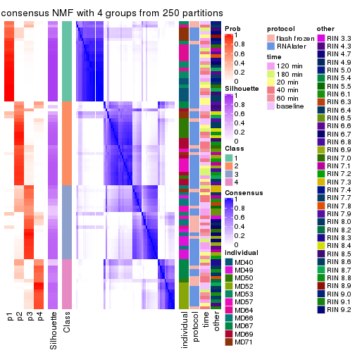</p>

</div>
<div id='tab-CV-NMF-consensus-heatmap-4'>
<pre><code class="r">consensus_heatmap(res, k = 5)
</code></pre>

<p></p>

</div>
<div id='tab-CV-NMF-consensus-heatmap-5'>
<pre><code class="r">consensus_heatmap(res, k = 6)
</code></pre>

<p></p>

</div>
</div>

Heatmaps for the membership of samples in all partitions to see how consistent they are:


<script>
$( function() {
	$( '#tabs-CV-NMF-membership-heatmap' ).tabs();
} );
</script>
<div id='tabs-CV-NMF-membership-heatmap'>
<ul>
<li><a href='#tab-CV-NMF-membership-heatmap-1'>k = 2</a></li>
<li><a href='#tab-CV-NMF-membership-heatmap-2'>k = 3</a></li>
<li><a href='#tab-CV-NMF-membership-heatmap-3'>k = 4</a></li>
<li><a href='#tab-CV-NMF-membership-heatmap-4'>k = 5</a></li>
<li><a href='#tab-CV-NMF-membership-heatmap-5'>k = 6</a></li>
</ul>
<div id='tab-CV-NMF-membership-heatmap-1'>
<pre><code class="r">membership_heatmap(res, k = 2)
</code></pre>

<p></p>

</div>
<div id='tab-CV-NMF-membership-heatmap-2'>
<pre><code class="r">membership_heatmap(res, k = 3)
</code></pre>

<p></p>

</div>
<div id='tab-CV-NMF-membership-heatmap-3'>
<pre><code class="r">membership_heatmap(res, k = 4)
</code></pre>

<p></p>

</div>
<div id='tab-CV-NMF-membership-heatmap-4'>
<pre><code class="r">membership_heatmap(res, k = 5)
</code></pre>

<p></p>

</div>
<div id='tab-CV-NMF-membership-heatmap-5'>
<pre><code class="r">membership_heatmap(res, k = 6)
</code></pre>

<p></p>

</div>
</div>

As soon as we have had the classes for columns, we can look for signatures
which are significantly different between classes which can be candidate marks
for certain classes. Following are the heatmaps for signatures.


Signature heatmaps where rows are scaled:


<script>
$( function() {
	$( '#tabs-CV-NMF-get-signatures' ).tabs();
} );
</script>
<div id='tabs-CV-NMF-get-signatures'>
<ul>
<li><a href='#tab-CV-NMF-get-signatures-1'>k = 2</a></li>
<li><a href='#tab-CV-NMF-get-signatures-2'>k = 3</a></li>
<li><a href='#tab-CV-NMF-get-signatures-3'>k = 4</a></li>
<li><a href='#tab-CV-NMF-get-signatures-4'>k = 5</a></li>
<li><a href='#tab-CV-NMF-get-signatures-5'>k = 6</a></li>
</ul>
<div id='tab-CV-NMF-get-signatures-1'>
<pre><code class="r">get_signatures(res, k = 2)
</code></pre>

<p></p>

</div>
<div id='tab-CV-NMF-get-signatures-2'>
<pre><code class="r">get_signatures(res, k = 3)
</code></pre>

<p></p>

</div>
<div id='tab-CV-NMF-get-signatures-3'>
<pre><code class="r">get_signatures(res, k = 4)
</code></pre>

<p>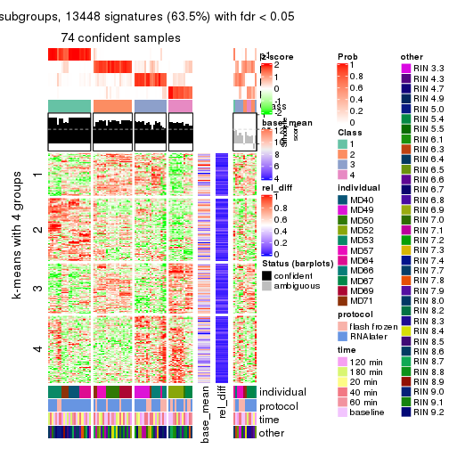</p>

</div>
<div id='tab-CV-NMF-get-signatures-4'>
<pre><code class="r">get_signatures(res, k = 5)
</code></pre>

<p></p>

</div>
<div id='tab-CV-NMF-get-signatures-5'>
<pre><code class="r">get_signatures(res, k = 6)
</code></pre>

<p></p>

</div>
</div>


Signature heatmaps where rows are not scaled:


<script>
$( function() {
	$( '#tabs-CV-NMF-get-signatures-no-scale' ).tabs();
} );
</script>
<div id='tabs-CV-NMF-get-signatures-no-scale'>
<ul>
<li><a href='#tab-CV-NMF-get-signatures-no-scale-1'>k = 2</a></li>
<li><a href='#tab-CV-NMF-get-signatures-no-scale-2'>k = 3</a></li>
<li><a href='#tab-CV-NMF-get-signatures-no-scale-3'>k = 4</a></li>
<li><a href='#tab-CV-NMF-get-signatures-no-scale-4'>k = 5</a></li>
<li><a href='#tab-CV-NMF-get-signatures-no-scale-5'>k = 6</a></li>
</ul>
<div id='tab-CV-NMF-get-signatures-no-scale-1'>
<pre><code class="r">get_signatures(res, k = 2, scale_rows = FALSE)
</code></pre>

<p></p>

</div>
<div id='tab-CV-NMF-get-signatures-no-scale-2'>
<pre><code class="r">get_signatures(res, k = 3, scale_rows = FALSE)
</code></pre>

<p></p>

</div>
<div id='tab-CV-NMF-get-signatures-no-scale-3'>
<pre><code class="r">get_signatures(res, k = 4, scale_rows = FALSE)
</code></pre>

<p></p>

</div>
<div id='tab-CV-NMF-get-signatures-no-scale-4'>
<pre><code class="r">get_signatures(res, k = 5, scale_rows = FALSE)
</code></pre>

<p></p>

</div>
<div id='tab-CV-NMF-get-signatures-no-scale-5'>
<pre><code class="r">get_signatures(res, k = 6, scale_rows = FALSE)
</code></pre>

<p></p>

</div>
</div>


Compare the overlap of signatures from different k:

```r
compare_signatures(res)
```


`get_signature()` returns a data frame invisibly. TO get the list of signatures, the function
call should be assigned to a variable explicitly. In following code, if `plot` argument is set
to `FALSE`, no heatmap is plotted while only the differential analysis is performed.

```r
# code only for demonstration
tb = get_signature(res, k = ..., plot = FALSE)
```

An example of the output of `tb` is:

```
#>   which_row         fdr    mean_1    mean_2 scaled_mean_1 scaled_mean_2 km
#> 1        38 0.042760348  8.373488  9.131774    -0.5533452     0.5164555  1
#> 2        40 0.018707592  7.106213  8.469186    -0.6173731     0.5762149  1
#> 3        55 0.019134737 10.221463 11.207825    -0.6159697     0.5749050  1
#> 4        59 0.006059896  5.921854  7.869574    -0.6899429     0.6439467  1
#> 5        60 0.018055526  8.928898 10.211722    -0.6204761     0.5791110  1
#> 6        98 0.009384629 15.714769 14.887706     0.6635654    -0.6193277  2
...
```

The columns in `tb` are:

1. `which_row`: row indices corresponding to the input matrix.
2. `fdr`: FDR for the differential test. 
3. `mean_x`: The mean value in group x.
4. `scaled_mean_x`: The mean value in group x after rows are scaled.
5. `km`: Row groups if k-means clustering is applied to rows.


UMAP plot which shows how samples are separated.


<script>
$( function() {
	$( '#tabs-CV-NMF-dimension-reduction' ).tabs();
} );
</script>
<div id='tabs-CV-NMF-dimension-reduction'>
<ul>
<li><a href='#tab-CV-NMF-dimension-reduction-1'>k = 2</a></li>
<li><a href='#tab-CV-NMF-dimension-reduction-2'>k = 3</a></li>
<li><a href='#tab-CV-NMF-dimension-reduction-3'>k = 4</a></li>
<li><a href='#tab-CV-NMF-dimension-reduction-4'>k = 5</a></li>
<li><a href='#tab-CV-NMF-dimension-reduction-5'>k = 6</a></li>
</ul>
<div id='tab-CV-NMF-dimension-reduction-1'>
<pre><code class="r">dimension_reduction(res, k = 2, method = &quot;UMAP&quot;)
</code></pre>

<p></p>

</div>
<div id='tab-CV-NMF-dimension-reduction-2'>
<pre><code class="r">dimension_reduction(res, k = 3, method = &quot;UMAP&quot;)
</code></pre>

<p></p>

</div>
<div id='tab-CV-NMF-dimension-reduction-3'>
<pre><code class="r">dimension_reduction(res, k = 4, method = &quot;UMAP&quot;)
</code></pre>

<p></p>

</div>
<div id='tab-CV-NMF-dimension-reduction-4'>
<pre><code class="r">dimension_reduction(res, k = 5, method = &quot;UMAP&quot;)
</code></pre>

<p></p>

</div>
<div id='tab-CV-NMF-dimension-reduction-5'>
<pre><code class="r">dimension_reduction(res, k = 6, method = &quot;UMAP&quot;)
</code></pre>

<p></p>

</div>
</div>


Following heatmap shows how subgroups are split when increasing `k`:

```r
collect_classes(res)
```


Test correlation between subgroups and known annotations. If the known
annotation is numeric, one-way ANOVA test is applied, and if the known
annotation is discrete, chi-squared contingency table test is applied.

```r
test_to_known_factors(res)
```

```
#>         n individual(p) protocol(p) time(p) other(p) k
#> CV:NMF 56      4.75e-06     0.00743   0.707   0.7141 2
#> CV:NMF 80      7.06e-17     0.17951   0.996   0.3429 3
#> CV:NMF 74      9.33e-26     0.07237   1.000   0.1297 4
#> CV:NMF 58      9.52e-28     0.60657   0.999   0.3603 5
#> CV:NMF 61      1.68e-42     0.54039   1.000   0.0407 6
```


If matrix rows can be associated to genes, consider to use `functional_enrichment(res,
...)` to perform function enrichment for the signature genes. See [this vignette](http://bioconductor.org/packages/devel/bioc/vignettes/cola/inst/doc/functional_enrichment.html) for more detailed explanations.


 

---------------------------------------------------


### MAD:hclust


The object with results only for a single top-value method and a single partition method 
can be extracted as:

```r
res = res_list["MAD", "hclust"]
# you can also extract it by
# res = res_list["MAD:hclust"]
```

A summary of `res` and all the functions that can be applied to it:

```r
res
```

```
#> A 'ConsensusPartition' object with k = 2, 3, 4, 5, 6.
#>   On a matrix with 21168 rows and 86 columns.
#>   Top rows (1000, 2000, 3000, 4000, 5000) are extracted by 'MAD' method.
#>   Subgroups are detected by 'hclust' method.
#>   Performed in total 1250 partitions by row resampling.
#>   Best k for subgroups seems to be 3.
#> 
#> Following methods can be applied to this 'ConsensusPartition' object:
#>  [1] "cola_report"             "collect_classes"         "collect_plots"          
#>  [4] "collect_stats"           "colnames"                "compare_signatures"     
#>  [7] "consensus_heatmap"       "dimension_reduction"     "functional_enrichment"  
#> [10] "get_anno_col"            "get_anno"                "get_classes"            
#> [13] "get_consensus"           "get_matrix"              "get_membership"         
#> [16] "get_param"               "get_signatures"          "get_stats"              
#> [19] "is_best_k"               "is_stable_k"             "membership_heatmap"     
#> [22] "ncol"                    "nrow"                    "plot_ecdf"              
#> [25] "rownames"                "select_partition_number" "show"                   
#> [28] "suggest_best_k"          "test_to_known_factors"
```

`collect_plots()` function collects all the plots made from `res` for all `k` (number of partitions)
into one single page to provide an easy and fast comparison between different `k`.

```r
collect_plots(res)
```


The plots are:

- The first row: a plot of the ECDF (empirical cumulative distribution
  function) curves of the consensus matrix for each `k` and the heatmap of
  predicted classes for each `k`.
- The second row: heatmaps of the consensus matrix for each `k`.
- The third row: heatmaps of the membership matrix for each `k`.
- The fouth row: heatmaps of the signatures for each `k`.

All the plots in panels can be made by individual functions and they are
plotted later in this section.

`select_partition_number()` produces several plots showing different
statistics for choosing "optimized" `k`. There are following statistics:

- ECDF curves of the consensus matrix for each `k`;
- 1-PAC. [The PAC
  score](https://en.wikipedia.org/wiki/Consensus_clustering#Over-interpretation_potential_of_consensus_clustering)
  measures the proportion of the ambiguous subgrouping.
- Mean silhouette score.
- Concordance. The mean probability of fiting the consensus class ids in all
  partitions.
- Area increased. Denote $A_k$ as the area under the ECDF curve for current
  `k`, the area increased is defined as $A_k - A_{k-1}$.
- Rand index. The percent of pairs of samples that are both in a same cluster
  or both are not in a same cluster in the partition of k and k-1.
- Jaccard index. The ratio of pairs of samples are both in a same cluster in
  the partition of k and k-1 and the pairs of samples are both in a same
  cluster in the partition k or k-1.

The detailed explanations of these statistics can be found in [the _cola_
vignette](http://bioconductor.org/packages/devel/bioc/vignettes/cola/inst/doc/cola.html#toc_13).

Generally speaking, lower PAC score, higher mean silhouette score or higher
concordance corresponds to better partition. Rand index and Jaccard index
measure how similar the current partition is compared to partition with `k-1`.
If they are too similar, we won't accept `k` is better than `k-1`.

```r
select_partition_number(res)
```


The numeric values for all these statistics can be obtained by `get_stats()`.

```r
get_stats(res)
```

```
#>   k 1-PAC mean_silhouette concordance area_increased  Rand Jaccard
#> 2 2 0.426           0.746       0.820         0.3184 0.774   0.774
#> 3 3 0.685           0.789       0.898         0.8929 0.635   0.529
#> 4 4 0.685           0.753       0.872         0.0419 0.993   0.984
#> 5 5 0.707           0.728       0.841         0.0602 0.958   0.895
#> 6 6 0.688           0.695       0.832         0.0843 0.879   0.671
```

`suggest_best_k()` suggests the best $k$ based on these statistics. The rules are as follows:

- All $k$ with Jaccard index larger than 0.95 are removed because increasing
  $k$ does not provide enough extra information. If all $k$ are removed, it is
  marked as no subgroup is detected.
- For all $k$ with 1-PAC score larger than 0.9, the maximal $k$ is taken as
  the best $k$, and other $k$ are marked as optional $k$.
- If it does not fit the second rule. The $k$ with the maximal vote of the
  highest 1-PAC score, highest mean silhouette, and highest concordance is
  taken as the best $k$.

```r
suggest_best_k(res)
```

```
#> [1] 3
```


Following shows the table of the partitions (You need to click the **show/hide
code output** link to see it). The membership matrix (columns with name `p*`)
is inferred by
[`clue::cl_consensus()`](https://www.rdocumentation.org/link/cl_consensus?package=clue)
function with the `SE` method. Basically the value in the membership matrix
represents the probability to belong to a certain group. The finall class
label for an item is determined with the group with highest probability it
belongs to.

In `get_classes()` function, the entropy is calculated from the membership
matrix and the silhouette score is calculated from the consensus matrix.


<script>
$( function() {
	$( '#tabs-MAD-hclust-get-classes' ).tabs();
} );
</script>
<div id='tabs-MAD-hclust-get-classes'>
<ul>
<li><a href='#tab-MAD-hclust-get-classes-1'>k = 2</a></li>
<li><a href='#tab-MAD-hclust-get-classes-2'>k = 3</a></li>
<li><a href='#tab-MAD-hclust-get-classes-3'>k = 4</a></li>
<li><a href='#tab-MAD-hclust-get-classes-4'>k = 5</a></li>
<li><a href='#tab-MAD-hclust-get-classes-5'>k = 6</a></li>
</ul>

<div id='tab-MAD-hclust-get-classes-1'>
<p><a id='tab-MAD-hclust-get-classes-1-a' style='color:#0366d6' href='#'>show/hide code output</a></p>
<pre><code class="r">cbind(get_classes(res, k = 2), get_membership(res, k = 2))
</code></pre>

<pre><code>#&gt;           class entropy silhouette    p1    p2
#&gt; GSM614415     2  0.9209      0.679 0.336 0.664
#&gt; GSM614416     2  0.9209      0.679 0.336 0.664
#&gt; GSM614417     2  0.9209      0.679 0.336 0.664
#&gt; GSM614418     2  0.9209      0.679 0.336 0.664
#&gt; GSM614419     2  0.9209      0.679 0.336 0.664
#&gt; GSM614420     2  0.9209      0.679 0.336 0.664
#&gt; GSM614421     2  0.5519      0.641 0.128 0.872
#&gt; GSM614422     2  0.5519      0.641 0.128 0.872
#&gt; GSM614423     2  0.5519      0.641 0.128 0.872
#&gt; GSM614424     2  0.5519      0.641 0.128 0.872
#&gt; GSM614425     2  0.5519      0.641 0.128 0.872
#&gt; GSM614426     2  0.5519      0.641 0.128 0.872
#&gt; GSM614427     2  0.5519      0.641 0.128 0.872
#&gt; GSM614428     2  0.5519      0.641 0.128 0.872
#&gt; GSM614429     2  0.0000      0.780 0.000 1.000
#&gt; GSM614430     2  0.0000      0.780 0.000 1.000
#&gt; GSM614431     2  0.0000      0.780 0.000 1.000
#&gt; GSM614432     2  0.0000      0.780 0.000 1.000
#&gt; GSM614433     2  0.0000      0.780 0.000 1.000
#&gt; GSM614434     2  0.0000      0.780 0.000 1.000
#&gt; GSM614435     2  0.0000      0.780 0.000 1.000
#&gt; GSM614436     2  0.0000      0.780 0.000 1.000
#&gt; GSM614437     1  0.9209      0.942 0.664 0.336
#&gt; GSM614438     1  0.9209      0.942 0.664 0.336
#&gt; GSM614439     1  0.9209      0.942 0.664 0.336
#&gt; GSM614440     1  0.9209      0.942 0.664 0.336
#&gt; GSM614441     1  0.9209      0.942 0.664 0.336
#&gt; GSM614442     1  0.9209      0.942 0.664 0.336
#&gt; GSM614443     1  0.9209      0.942 0.664 0.336
#&gt; GSM614444     1  0.9209      0.942 0.664 0.336
#&gt; GSM614391     2  0.9209      0.679 0.336 0.664
#&gt; GSM614392     2  0.9209      0.679 0.336 0.664
#&gt; GSM614393     2  0.9209      0.679 0.336 0.664
#&gt; GSM614394     2  0.9209      0.679 0.336 0.664
#&gt; GSM614395     1  0.5737      0.391 0.864 0.136
#&gt; GSM614396     2  0.9209      0.679 0.336 0.664
#&gt; GSM614397     2  0.9209      0.679 0.336 0.664
#&gt; GSM614398     2  0.9209      0.679 0.336 0.664
#&gt; GSM614399     2  0.0672      0.780 0.008 0.992
#&gt; GSM614400     2  0.0672      0.780 0.008 0.992
#&gt; GSM614401     2  0.0672      0.780 0.008 0.992
#&gt; GSM614402     2  0.0672      0.780 0.008 0.992
#&gt; GSM614403     2  0.0672      0.780 0.008 0.992
#&gt; GSM614404     2  0.0672      0.780 0.008 0.992
#&gt; GSM614405     2  0.0672      0.780 0.008 0.992
#&gt; GSM614406     2  0.0376      0.780 0.004 0.996
#&gt; GSM614407     2  0.9209      0.679 0.336 0.664
#&gt; GSM614408     2  0.9209      0.679 0.336 0.664
#&gt; GSM614409     2  0.9209      0.679 0.336 0.664
#&gt; GSM614410     2  0.9209      0.679 0.336 0.664
#&gt; GSM614411     2  0.9209      0.679 0.336 0.664
#&gt; GSM614412     2  0.9209      0.679 0.336 0.664
#&gt; GSM614413     2  0.9209      0.679 0.336 0.664
#&gt; GSM614414     2  0.9209      0.679 0.336 0.664
#&gt; GSM614445     2  0.3879      0.711 0.076 0.924
#&gt; GSM614446     2  0.3879      0.711 0.076 0.924
#&gt; GSM614447     2  0.3879      0.711 0.076 0.924
#&gt; GSM614448     2  0.3879      0.711 0.076 0.924
#&gt; GSM614449     2  0.3879      0.711 0.076 0.924
#&gt; GSM614450     2  0.3879      0.711 0.076 0.924
#&gt; GSM614451     1  0.9209      0.942 0.664 0.336
#&gt; GSM614452     1  0.9209      0.942 0.664 0.336
#&gt; GSM614453     2  0.0000      0.780 0.000 1.000
#&gt; GSM614454     2  0.0000      0.780 0.000 1.000
#&gt; GSM614455     2  0.0000      0.780 0.000 1.000
#&gt; GSM614456     2  0.0000      0.780 0.000 1.000
#&gt; GSM614457     2  0.0000      0.780 0.000 1.000
#&gt; GSM614458     2  0.0000      0.780 0.000 1.000
#&gt; GSM614459     2  0.0000      0.780 0.000 1.000
#&gt; GSM614460     2  0.0000      0.780 0.000 1.000
#&gt; GSM614461     2  0.0000      0.780 0.000 1.000
#&gt; GSM614462     2  0.0000      0.780 0.000 1.000
#&gt; GSM614463     2  0.0000      0.780 0.000 1.000
#&gt; GSM614464     2  0.0000      0.780 0.000 1.000
#&gt; GSM614465     2  0.0000      0.780 0.000 1.000
#&gt; GSM614466     2  0.0000      0.780 0.000 1.000
#&gt; GSM614467     2  0.0000      0.780 0.000 1.000
#&gt; GSM614468     2  0.0000      0.780 0.000 1.000
#&gt; GSM614469     2  0.8207      0.716 0.256 0.744
#&gt; GSM614470     2  0.8207      0.716 0.256 0.744
#&gt; GSM614471     2  0.8207      0.716 0.256 0.744
#&gt; GSM614472     2  0.8207      0.716 0.256 0.744
#&gt; GSM614473     2  0.8207      0.716 0.256 0.744
#&gt; GSM614474     2  0.8207      0.716 0.256 0.744
#&gt; GSM614475     2  0.8207      0.716 0.256 0.744
#&gt; GSM614476     2  0.8207      0.716 0.256 0.744
</code></pre>

<script>
$('#tab-MAD-hclust-get-classes-1-a').parent().next().next().hide();
$('#tab-MAD-hclust-get-classes-1-a').click(function(){
  $('#tab-MAD-hclust-get-classes-1-a').parent().next().next().toggle();
  return(false);
});
</script>
</div>

<div id='tab-MAD-hclust-get-classes-2'>
<p><a id='tab-MAD-hclust-get-classes-2-a' style='color:#0366d6' href='#'>show/hide code output</a></p>
<pre><code class="r">cbind(get_classes(res, k = 3), get_membership(res, k = 3))
</code></pre>

<pre><code>#&gt;           class entropy silhouette    p1    p2    p3
#&gt; GSM614415     1  0.0424     0.8544 0.992 0.008 0.000
#&gt; GSM614416     1  0.0424     0.8544 0.992 0.008 0.000
#&gt; GSM614417     1  0.0424     0.8544 0.992 0.008 0.000
#&gt; GSM614418     1  0.0424     0.8544 0.992 0.008 0.000
#&gt; GSM614419     1  0.0424     0.8544 0.992 0.008 0.000
#&gt; GSM614420     1  0.0424     0.8544 0.992 0.008 0.000
#&gt; GSM614421     2  0.6513     0.5306 0.008 0.592 0.400
#&gt; GSM614422     2  0.6513     0.5306 0.008 0.592 0.400
#&gt; GSM614423     2  0.6513     0.5306 0.008 0.592 0.400
#&gt; GSM614424     2  0.6513     0.5306 0.008 0.592 0.400
#&gt; GSM614425     2  0.6513     0.5306 0.008 0.592 0.400
#&gt; GSM614426     2  0.6513     0.5306 0.008 0.592 0.400
#&gt; GSM614427     2  0.6513     0.5306 0.008 0.592 0.400
#&gt; GSM614428     2  0.6513     0.5306 0.008 0.592 0.400
#&gt; GSM614429     2  0.0000     0.8700 0.000 1.000 0.000
#&gt; GSM614430     2  0.0000     0.8700 0.000 1.000 0.000
#&gt; GSM614431     2  0.0000     0.8700 0.000 1.000 0.000
#&gt; GSM614432     2  0.0000     0.8700 0.000 1.000 0.000
#&gt; GSM614433     2  0.0000     0.8700 0.000 1.000 0.000
#&gt; GSM614434     2  0.0000     0.8700 0.000 1.000 0.000
#&gt; GSM614435     2  0.0000     0.8700 0.000 1.000 0.000
#&gt; GSM614436     2  0.0000     0.8700 0.000 1.000 0.000
#&gt; GSM614437     3  0.0237     0.9445 0.000 0.004 0.996
#&gt; GSM614438     3  0.0237     0.9445 0.000 0.004 0.996
#&gt; GSM614439     3  0.0237     0.9445 0.000 0.004 0.996
#&gt; GSM614440     3  0.0237     0.9445 0.000 0.004 0.996
#&gt; GSM614441     3  0.0237     0.9445 0.000 0.004 0.996
#&gt; GSM614442     3  0.0237     0.9445 0.000 0.004 0.996
#&gt; GSM614443     3  0.0237     0.9445 0.000 0.004 0.996
#&gt; GSM614444     3  0.0237     0.9445 0.000 0.004 0.996
#&gt; GSM614391     1  0.0000     0.8490 1.000 0.000 0.000
#&gt; GSM614392     1  0.0000     0.8490 1.000 0.000 0.000
#&gt; GSM614393     1  0.0000     0.8490 1.000 0.000 0.000
#&gt; GSM614394     1  0.0000     0.8490 1.000 0.000 0.000
#&gt; GSM614395     3  0.6295     0.0283 0.472 0.000 0.528
#&gt; GSM614396     1  0.0000     0.8490 1.000 0.000 0.000
#&gt; GSM614397     1  0.0000     0.8490 1.000 0.000 0.000
#&gt; GSM614398     1  0.0000     0.8490 1.000 0.000 0.000
#&gt; GSM614399     2  0.1031     0.8571 0.024 0.976 0.000
#&gt; GSM614400     2  0.1031     0.8571 0.024 0.976 0.000
#&gt; GSM614401     2  0.1031     0.8571 0.024 0.976 0.000
#&gt; GSM614402     2  0.1031     0.8571 0.024 0.976 0.000
#&gt; GSM614403     2  0.1031     0.8571 0.024 0.976 0.000
#&gt; GSM614404     2  0.1031     0.8571 0.024 0.976 0.000
#&gt; GSM614405     2  0.0424     0.8666 0.008 0.992 0.000
#&gt; GSM614406     2  0.0475     0.8679 0.004 0.992 0.004
#&gt; GSM614407     1  0.0424     0.8544 0.992 0.008 0.000
#&gt; GSM614408     1  0.0424     0.8544 0.992 0.008 0.000
#&gt; GSM614409     1  0.0424     0.8544 0.992 0.008 0.000
#&gt; GSM614410     1  0.0424     0.8544 0.992 0.008 0.000
#&gt; GSM614411     1  0.0424     0.8544 0.992 0.008 0.000
#&gt; GSM614412     1  0.0424     0.8544 0.992 0.008 0.000
#&gt; GSM614413     1  0.0424     0.8544 0.992 0.008 0.000
#&gt; GSM614414     1  0.0424     0.8544 0.992 0.008 0.000
#&gt; GSM614445     2  0.5873     0.6481 0.004 0.684 0.312
#&gt; GSM614446     2  0.5873     0.6481 0.004 0.684 0.312
#&gt; GSM614447     2  0.5873     0.6481 0.004 0.684 0.312
#&gt; GSM614448     2  0.5873     0.6481 0.004 0.684 0.312
#&gt; GSM614449     2  0.5873     0.6481 0.004 0.684 0.312
#&gt; GSM614450     2  0.5873     0.6481 0.004 0.684 0.312
#&gt; GSM614451     3  0.0424     0.9375 0.000 0.008 0.992
#&gt; GSM614452     3  0.0424     0.9375 0.000 0.008 0.992
#&gt; GSM614453     2  0.0000     0.8700 0.000 1.000 0.000
#&gt; GSM614454     2  0.0000     0.8700 0.000 1.000 0.000
#&gt; GSM614455     2  0.0000     0.8700 0.000 1.000 0.000
#&gt; GSM614456     2  0.0000     0.8700 0.000 1.000 0.000
#&gt; GSM614457     2  0.0000     0.8700 0.000 1.000 0.000
#&gt; GSM614458     2  0.0000     0.8700 0.000 1.000 0.000
#&gt; GSM614459     2  0.0000     0.8700 0.000 1.000 0.000
#&gt; GSM614460     2  0.0000     0.8700 0.000 1.000 0.000
#&gt; GSM614461     2  0.0000     0.8700 0.000 1.000 0.000
#&gt; GSM614462     2  0.0000     0.8700 0.000 1.000 0.000
#&gt; GSM614463     2  0.0000     0.8700 0.000 1.000 0.000
#&gt; GSM614464     2  0.0000     0.8700 0.000 1.000 0.000
#&gt; GSM614465     2  0.0000     0.8700 0.000 1.000 0.000
#&gt; GSM614466     2  0.0000     0.8700 0.000 1.000 0.000
#&gt; GSM614467     2  0.0000     0.8700 0.000 1.000 0.000
#&gt; GSM614468     2  0.0000     0.8700 0.000 1.000 0.000
#&gt; GSM614469     1  0.5905     0.5745 0.648 0.352 0.000
#&gt; GSM614470     1  0.5905     0.5745 0.648 0.352 0.000
#&gt; GSM614471     1  0.5905     0.5745 0.648 0.352 0.000
#&gt; GSM614472     1  0.5905     0.5745 0.648 0.352 0.000
#&gt; GSM614473     1  0.5905     0.5745 0.648 0.352 0.000
#&gt; GSM614474     1  0.5905     0.5745 0.648 0.352 0.000
#&gt; GSM614475     1  0.5905     0.5745 0.648 0.352 0.000
#&gt; GSM614476     1  0.5905     0.5745 0.648 0.352 0.000
</code></pre>

<script>
$('#tab-MAD-hclust-get-classes-2-a').parent().next().next().hide();
$('#tab-MAD-hclust-get-classes-2-a').click(function(){
  $('#tab-MAD-hclust-get-classes-2-a').parent().next().next().toggle();
  return(false);
});
</script>
</div>

<div id='tab-MAD-hclust-get-classes-3'>
<p><a id='tab-MAD-hclust-get-classes-3-a' style='color:#0366d6' href='#'>show/hide code output</a></p>
<pre><code class="r">cbind(get_classes(res, k = 4), get_membership(res, k = 4))
</code></pre>

<pre><code>#&gt;           class entropy silhouette    p1    p2    p3    p4
#&gt; GSM614415     1  0.0469      0.761 0.988 0.000 0.012 0.000
#&gt; GSM614416     1  0.0469      0.761 0.988 0.000 0.012 0.000
#&gt; GSM614417     1  0.0469      0.761 0.988 0.000 0.012 0.000
#&gt; GSM614418     1  0.0469      0.761 0.988 0.000 0.012 0.000
#&gt; GSM614419     1  0.0469      0.761 0.988 0.000 0.012 0.000
#&gt; GSM614420     1  0.0469      0.761 0.988 0.000 0.012 0.000
#&gt; GSM614421     2  0.5183      0.547 0.008 0.584 0.000 0.408
#&gt; GSM614422     2  0.5183      0.547 0.008 0.584 0.000 0.408
#&gt; GSM614423     2  0.5183      0.547 0.008 0.584 0.000 0.408
#&gt; GSM614424     2  0.5183      0.547 0.008 0.584 0.000 0.408
#&gt; GSM614425     2  0.5183      0.547 0.008 0.584 0.000 0.408
#&gt; GSM614426     2  0.5183      0.547 0.008 0.584 0.000 0.408
#&gt; GSM614427     2  0.5183      0.547 0.008 0.584 0.000 0.408
#&gt; GSM614428     2  0.5183      0.547 0.008 0.584 0.000 0.408
#&gt; GSM614429     2  0.0000      0.866 0.000 1.000 0.000 0.000
#&gt; GSM614430     2  0.0000      0.866 0.000 1.000 0.000 0.000
#&gt; GSM614431     2  0.0000      0.866 0.000 1.000 0.000 0.000
#&gt; GSM614432     2  0.0000      0.866 0.000 1.000 0.000 0.000
#&gt; GSM614433     2  0.0000      0.866 0.000 1.000 0.000 0.000
#&gt; GSM614434     2  0.0000      0.866 0.000 1.000 0.000 0.000
#&gt; GSM614435     2  0.0000      0.866 0.000 1.000 0.000 0.000
#&gt; GSM614436     2  0.0000      0.866 0.000 1.000 0.000 0.000
#&gt; GSM614437     4  0.4655      1.000 0.000 0.004 0.312 0.684
#&gt; GSM614438     4  0.4655      1.000 0.000 0.004 0.312 0.684
#&gt; GSM614439     4  0.4655      1.000 0.000 0.004 0.312 0.684
#&gt; GSM614440     4  0.4655      1.000 0.000 0.004 0.312 0.684
#&gt; GSM614441     4  0.4655      1.000 0.000 0.004 0.312 0.684
#&gt; GSM614442     4  0.4655      1.000 0.000 0.004 0.312 0.684
#&gt; GSM614443     4  0.4655      1.000 0.000 0.004 0.312 0.684
#&gt; GSM614444     4  0.4655      1.000 0.000 0.004 0.312 0.684
#&gt; GSM614391     1  0.2647      0.705 0.880 0.000 0.120 0.000
#&gt; GSM614392     1  0.2647      0.705 0.880 0.000 0.120 0.000
#&gt; GSM614393     1  0.2647      0.705 0.880 0.000 0.120 0.000
#&gt; GSM614394     1  0.2647      0.705 0.880 0.000 0.120 0.000
#&gt; GSM614395     3  0.5386      0.162 0.368 0.000 0.612 0.020
#&gt; GSM614396     1  0.2647      0.705 0.880 0.000 0.120 0.000
#&gt; GSM614397     1  0.2647      0.705 0.880 0.000 0.120 0.000
#&gt; GSM614398     1  0.2647      0.705 0.880 0.000 0.120 0.000
#&gt; GSM614399     2  0.0921      0.851 0.028 0.972 0.000 0.000
#&gt; GSM614400     2  0.0921      0.851 0.028 0.972 0.000 0.000
#&gt; GSM614401     2  0.0921      0.851 0.028 0.972 0.000 0.000
#&gt; GSM614402     2  0.0921      0.851 0.028 0.972 0.000 0.000
#&gt; GSM614403     2  0.0921      0.851 0.028 0.972 0.000 0.000
#&gt; GSM614404     2  0.0921      0.851 0.028 0.972 0.000 0.000
#&gt; GSM614405     2  0.0336      0.863 0.008 0.992 0.000 0.000
#&gt; GSM614406     2  0.0376      0.864 0.004 0.992 0.000 0.004
#&gt; GSM614407     1  0.1389      0.758 0.952 0.000 0.048 0.000
#&gt; GSM614408     1  0.1389      0.758 0.952 0.000 0.048 0.000
#&gt; GSM614409     1  0.1389      0.758 0.952 0.000 0.048 0.000
#&gt; GSM614410     1  0.1389      0.758 0.952 0.000 0.048 0.000
#&gt; GSM614411     1  0.1389      0.758 0.952 0.000 0.048 0.000
#&gt; GSM614412     1  0.1474      0.758 0.948 0.000 0.052 0.000
#&gt; GSM614413     1  0.1474      0.758 0.948 0.000 0.052 0.000
#&gt; GSM614414     1  0.1474      0.758 0.948 0.000 0.052 0.000
#&gt; GSM614445     2  0.4836      0.651 0.008 0.672 0.000 0.320
#&gt; GSM614446     2  0.4836      0.651 0.008 0.672 0.000 0.320
#&gt; GSM614447     2  0.4836      0.651 0.008 0.672 0.000 0.320
#&gt; GSM614448     2  0.4836      0.651 0.008 0.672 0.000 0.320
#&gt; GSM614449     2  0.4836      0.651 0.008 0.672 0.000 0.320
#&gt; GSM614450     2  0.4836      0.651 0.008 0.672 0.000 0.320
#&gt; GSM614451     3  0.4999      0.563 0.000 0.000 0.508 0.492
#&gt; GSM614452     3  0.4999      0.563 0.000 0.000 0.508 0.492
#&gt; GSM614453     2  0.0000      0.866 0.000 1.000 0.000 0.000
#&gt; GSM614454     2  0.0000      0.866 0.000 1.000 0.000 0.000
#&gt; GSM614455     2  0.0000      0.866 0.000 1.000 0.000 0.000
#&gt; GSM614456     2  0.0000      0.866 0.000 1.000 0.000 0.000
#&gt; GSM614457     2  0.0000      0.866 0.000 1.000 0.000 0.000
#&gt; GSM614458     2  0.0000      0.866 0.000 1.000 0.000 0.000
#&gt; GSM614459     2  0.0000      0.866 0.000 1.000 0.000 0.000
#&gt; GSM614460     2  0.0000      0.866 0.000 1.000 0.000 0.000
#&gt; GSM614461     2  0.0000      0.866 0.000 1.000 0.000 0.000
#&gt; GSM614462     2  0.0000      0.866 0.000 1.000 0.000 0.000
#&gt; GSM614463     2  0.0000      0.866 0.000 1.000 0.000 0.000
#&gt; GSM614464     2  0.0000      0.866 0.000 1.000 0.000 0.000
#&gt; GSM614465     2  0.0000      0.866 0.000 1.000 0.000 0.000
#&gt; GSM614466     2  0.0000      0.866 0.000 1.000 0.000 0.000
#&gt; GSM614467     2  0.0000      0.866 0.000 1.000 0.000 0.000
#&gt; GSM614468     2  0.0000      0.866 0.000 1.000 0.000 0.000
#&gt; GSM614469     1  0.5075      0.496 0.644 0.344 0.012 0.000
#&gt; GSM614470     1  0.5075      0.496 0.644 0.344 0.012 0.000
#&gt; GSM614471     1  0.5075      0.496 0.644 0.344 0.012 0.000
#&gt; GSM614472     1  0.5075      0.496 0.644 0.344 0.012 0.000
#&gt; GSM614473     1  0.5075      0.496 0.644 0.344 0.012 0.000
#&gt; GSM614474     1  0.5075      0.496 0.644 0.344 0.012 0.000
#&gt; GSM614475     1  0.5075      0.496 0.644 0.344 0.012 0.000
#&gt; GSM614476     1  0.5075      0.496 0.644 0.344 0.012 0.000
</code></pre>

<script>
$('#tab-MAD-hclust-get-classes-3-a').parent().next().next().hide();
$('#tab-MAD-hclust-get-classes-3-a').click(function(){
  $('#tab-MAD-hclust-get-classes-3-a').parent().next().next().toggle();
  return(false);
});
</script>
</div>

<div id='tab-MAD-hclust-get-classes-4'>
<p><a id='tab-MAD-hclust-get-classes-4-a' style='color:#0366d6' href='#'>show/hide code output</a></p>
<pre><code class="r">cbind(get_classes(res, k = 5), get_membership(res, k = 5))
</code></pre>

<pre><code>#&gt;           class entropy silhouette    p1    p2    p3    p4    p5
#&gt; GSM614415     1  0.5524      0.359 0.516 0.000 0.068 0.000 0.416
#&gt; GSM614416     1  0.5524      0.359 0.516 0.000 0.068 0.000 0.416
#&gt; GSM614417     1  0.5524      0.359 0.516 0.000 0.068 0.000 0.416
#&gt; GSM614418     1  0.5524      0.359 0.516 0.000 0.068 0.000 0.416
#&gt; GSM614419     1  0.5524      0.359 0.516 0.000 0.068 0.000 0.416
#&gt; GSM614420     1  0.5524      0.359 0.516 0.000 0.068 0.000 0.416
#&gt; GSM614421     2  0.5641      0.549 0.004 0.584 0.340 0.068 0.004
#&gt; GSM614422     2  0.5641      0.549 0.004 0.584 0.340 0.068 0.004
#&gt; GSM614423     2  0.5641      0.549 0.004 0.584 0.340 0.068 0.004
#&gt; GSM614424     2  0.5641      0.549 0.004 0.584 0.340 0.068 0.004
#&gt; GSM614425     2  0.5641      0.549 0.004 0.584 0.340 0.068 0.004
#&gt; GSM614426     2  0.5641      0.549 0.004 0.584 0.340 0.068 0.004
#&gt; GSM614427     2  0.5641      0.549 0.004 0.584 0.340 0.068 0.004
#&gt; GSM614428     2  0.5641      0.549 0.004 0.584 0.340 0.068 0.004
#&gt; GSM614429     2  0.0000      0.861 0.000 1.000 0.000 0.000 0.000
#&gt; GSM614430     2  0.0000      0.861 0.000 1.000 0.000 0.000 0.000
#&gt; GSM614431     2  0.0000      0.861 0.000 1.000 0.000 0.000 0.000
#&gt; GSM614432     2  0.0000      0.861 0.000 1.000 0.000 0.000 0.000
#&gt; GSM614433     2  0.0000      0.861 0.000 1.000 0.000 0.000 0.000
#&gt; GSM614434     2  0.0000      0.861 0.000 1.000 0.000 0.000 0.000
#&gt; GSM614435     2  0.0000      0.861 0.000 1.000 0.000 0.000 0.000
#&gt; GSM614436     2  0.0000      0.861 0.000 1.000 0.000 0.000 0.000
#&gt; GSM614437     4  0.0000      1.000 0.000 0.000 0.000 1.000 0.000
#&gt; GSM614438     4  0.0000      1.000 0.000 0.000 0.000 1.000 0.000
#&gt; GSM614439     4  0.0000      1.000 0.000 0.000 0.000 1.000 0.000
#&gt; GSM614440     4  0.0000      1.000 0.000 0.000 0.000 1.000 0.000
#&gt; GSM614441     4  0.0000      1.000 0.000 0.000 0.000 1.000 0.000
#&gt; GSM614442     4  0.0000      1.000 0.000 0.000 0.000 1.000 0.000
#&gt; GSM614443     4  0.0000      1.000 0.000 0.000 0.000 1.000 0.000
#&gt; GSM614444     4  0.0000      1.000 0.000 0.000 0.000 1.000 0.000
#&gt; GSM614391     5  0.0000      1.000 0.000 0.000 0.000 0.000 1.000
#&gt; GSM614392     5  0.0000      1.000 0.000 0.000 0.000 0.000 1.000
#&gt; GSM614393     5  0.0000      1.000 0.000 0.000 0.000 0.000 1.000
#&gt; GSM614394     5  0.0000      1.000 0.000 0.000 0.000 0.000 1.000
#&gt; GSM614395     3  0.4297     -0.118 0.000 0.000 0.528 0.000 0.472
#&gt; GSM614396     5  0.0000      1.000 0.000 0.000 0.000 0.000 1.000
#&gt; GSM614397     5  0.0000      1.000 0.000 0.000 0.000 0.000 1.000
#&gt; GSM614398     5  0.0000      1.000 0.000 0.000 0.000 0.000 1.000
#&gt; GSM614399     2  0.1300      0.842 0.028 0.956 0.016 0.000 0.000
#&gt; GSM614400     2  0.1300      0.842 0.028 0.956 0.016 0.000 0.000
#&gt; GSM614401     2  0.1300      0.842 0.028 0.956 0.016 0.000 0.000
#&gt; GSM614402     2  0.1300      0.842 0.028 0.956 0.016 0.000 0.000
#&gt; GSM614403     2  0.1300      0.842 0.028 0.956 0.016 0.000 0.000
#&gt; GSM614404     2  0.1300      0.842 0.028 0.956 0.016 0.000 0.000
#&gt; GSM614405     2  0.0798      0.854 0.008 0.976 0.016 0.000 0.000
#&gt; GSM614406     2  0.0771      0.854 0.004 0.976 0.020 0.000 0.000
#&gt; GSM614407     1  0.1121      0.519 0.956 0.000 0.000 0.000 0.044
#&gt; GSM614408     1  0.1121      0.519 0.956 0.000 0.000 0.000 0.044
#&gt; GSM614409     1  0.1121      0.519 0.956 0.000 0.000 0.000 0.044
#&gt; GSM614410     1  0.1121      0.519 0.956 0.000 0.000 0.000 0.044
#&gt; GSM614411     1  0.1121      0.519 0.956 0.000 0.000 0.000 0.044
#&gt; GSM614412     1  0.1270      0.513 0.948 0.000 0.000 0.000 0.052
#&gt; GSM614413     1  0.1341      0.510 0.944 0.000 0.000 0.000 0.056
#&gt; GSM614414     1  0.1341      0.510 0.944 0.000 0.000 0.000 0.056
#&gt; GSM614445     2  0.4235      0.641 0.008 0.656 0.336 0.000 0.000
#&gt; GSM614446     2  0.4235      0.641 0.008 0.656 0.336 0.000 0.000
#&gt; GSM614447     2  0.4235      0.641 0.008 0.656 0.336 0.000 0.000
#&gt; GSM614448     2  0.4235      0.641 0.008 0.656 0.336 0.000 0.000
#&gt; GSM614449     2  0.4235      0.641 0.008 0.656 0.336 0.000 0.000
#&gt; GSM614450     2  0.4235      0.641 0.008 0.656 0.336 0.000 0.000
#&gt; GSM614451     3  0.1792      0.675 0.000 0.000 0.916 0.084 0.000
#&gt; GSM614452     3  0.1792      0.675 0.000 0.000 0.916 0.084 0.000
#&gt; GSM614453     2  0.0000      0.861 0.000 1.000 0.000 0.000 0.000
#&gt; GSM614454     2  0.0000      0.861 0.000 1.000 0.000 0.000 0.000
#&gt; GSM614455     2  0.0000      0.861 0.000 1.000 0.000 0.000 0.000
#&gt; GSM614456     2  0.0000      0.861 0.000 1.000 0.000 0.000 0.000
#&gt; GSM614457     2  0.0000      0.861 0.000 1.000 0.000 0.000 0.000
#&gt; GSM614458     2  0.0000      0.861 0.000 1.000 0.000 0.000 0.000
#&gt; GSM614459     2  0.0000      0.861 0.000 1.000 0.000 0.000 0.000
#&gt; GSM614460     2  0.0000      0.861 0.000 1.000 0.000 0.000 0.000
#&gt; GSM614461     2  0.0000      0.861 0.000 1.000 0.000 0.000 0.000
#&gt; GSM614462     2  0.0000      0.861 0.000 1.000 0.000 0.000 0.000
#&gt; GSM614463     2  0.0000      0.861 0.000 1.000 0.000 0.000 0.000
#&gt; GSM614464     2  0.0000      0.861 0.000 1.000 0.000 0.000 0.000
#&gt; GSM614465     2  0.0000      0.861 0.000 1.000 0.000 0.000 0.000
#&gt; GSM614466     2  0.0000      0.861 0.000 1.000 0.000 0.000 0.000
#&gt; GSM614467     2  0.0000      0.861 0.000 1.000 0.000 0.000 0.000
#&gt; GSM614468     2  0.0000      0.861 0.000 1.000 0.000 0.000 0.000
#&gt; GSM614469     1  0.6712      0.553 0.516 0.344 0.064 0.000 0.076
#&gt; GSM614470     1  0.6712      0.553 0.516 0.344 0.064 0.000 0.076
#&gt; GSM614471     1  0.6712      0.553 0.516 0.344 0.064 0.000 0.076
#&gt; GSM614472     1  0.6712      0.553 0.516 0.344 0.064 0.000 0.076
#&gt; GSM614473     1  0.6712      0.553 0.516 0.344 0.064 0.000 0.076
#&gt; GSM614474     1  0.6712      0.553 0.516 0.344 0.064 0.000 0.076
#&gt; GSM614475     1  0.6712      0.553 0.516 0.344 0.064 0.000 0.076
#&gt; GSM614476     1  0.6712      0.553 0.516 0.344 0.064 0.000 0.076
</code></pre>

<script>
$('#tab-MAD-hclust-get-classes-4-a').parent().next().next().hide();
$('#tab-MAD-hclust-get-classes-4-a').click(function(){
  $('#tab-MAD-hclust-get-classes-4-a').parent().next().next().toggle();
  return(false);
});
</script>
</div>

<div id='tab-MAD-hclust-get-classes-5'>
<p><a id='tab-MAD-hclust-get-classes-5-a' style='color:#0366d6' href='#'>show/hide code output</a></p>
<pre><code class="r">cbind(get_classes(res, k = 6), get_membership(res, k = 6))
</code></pre>

<pre><code>#&gt;           class entropy silhouette    p1    p2    p3   p4    p5    p6
#&gt; GSM614415     1  0.2854     0.6078 0.792 0.000 0.000 0.00 0.208 0.000
#&gt; GSM614416     1  0.2854     0.6078 0.792 0.000 0.000 0.00 0.208 0.000
#&gt; GSM614417     1  0.2854     0.6078 0.792 0.000 0.000 0.00 0.208 0.000
#&gt; GSM614418     1  0.2854     0.6078 0.792 0.000 0.000 0.00 0.208 0.000
#&gt; GSM614419     1  0.2854     0.6078 0.792 0.000 0.000 0.00 0.208 0.000
#&gt; GSM614420     1  0.2854     0.6078 0.792 0.000 0.000 0.00 0.208 0.000
#&gt; GSM614421     3  0.4596     0.7270 0.000 0.476 0.496 0.02 0.004 0.004
#&gt; GSM614422     3  0.4596     0.7270 0.000 0.476 0.496 0.02 0.004 0.004
#&gt; GSM614423     3  0.4596     0.7270 0.000 0.476 0.496 0.02 0.004 0.004
#&gt; GSM614424     3  0.4596     0.7270 0.000 0.476 0.496 0.02 0.004 0.004
#&gt; GSM614425     3  0.4596     0.7270 0.000 0.476 0.496 0.02 0.004 0.004
#&gt; GSM614426     3  0.4596     0.7270 0.000 0.476 0.496 0.02 0.004 0.004
#&gt; GSM614427     3  0.4596     0.7270 0.000 0.476 0.496 0.02 0.004 0.004
#&gt; GSM614428     3  0.4596     0.7270 0.000 0.476 0.496 0.02 0.004 0.004
#&gt; GSM614429     2  0.0547     0.7717 0.000 0.980 0.020 0.00 0.000 0.000
#&gt; GSM614430     2  0.0547     0.7717 0.000 0.980 0.020 0.00 0.000 0.000
#&gt; GSM614431     2  0.0547     0.7717 0.000 0.980 0.020 0.00 0.000 0.000
#&gt; GSM614432     2  0.0547     0.7717 0.000 0.980 0.020 0.00 0.000 0.000
#&gt; GSM614433     2  0.0547     0.7717 0.000 0.980 0.020 0.00 0.000 0.000
#&gt; GSM614434     2  0.0547     0.7717 0.000 0.980 0.020 0.00 0.000 0.000
#&gt; GSM614435     2  0.0632     0.7685 0.000 0.976 0.024 0.00 0.000 0.000
#&gt; GSM614436     2  0.0632     0.7685 0.000 0.976 0.024 0.00 0.000 0.000
#&gt; GSM614437     4  0.0000     1.0000 0.000 0.000 0.000 1.00 0.000 0.000
#&gt; GSM614438     4  0.0000     1.0000 0.000 0.000 0.000 1.00 0.000 0.000
#&gt; GSM614439     4  0.0000     1.0000 0.000 0.000 0.000 1.00 0.000 0.000
#&gt; GSM614440     4  0.0000     1.0000 0.000 0.000 0.000 1.00 0.000 0.000
#&gt; GSM614441     4  0.0000     1.0000 0.000 0.000 0.000 1.00 0.000 0.000
#&gt; GSM614442     4  0.0000     1.0000 0.000 0.000 0.000 1.00 0.000 0.000
#&gt; GSM614443     4  0.0000     1.0000 0.000 0.000 0.000 1.00 0.000 0.000
#&gt; GSM614444     4  0.0000     1.0000 0.000 0.000 0.000 1.00 0.000 0.000
#&gt; GSM614391     5  0.0000     0.9372 0.000 0.000 0.000 0.00 1.000 0.000
#&gt; GSM614392     5  0.0000     0.9372 0.000 0.000 0.000 0.00 1.000 0.000
#&gt; GSM614393     5  0.0000     0.9372 0.000 0.000 0.000 0.00 1.000 0.000
#&gt; GSM614394     5  0.0000     0.9372 0.000 0.000 0.000 0.00 1.000 0.000
#&gt; GSM614395     5  0.5529     0.4823 0.092 0.000 0.424 0.00 0.472 0.012
#&gt; GSM614396     5  0.0000     0.9372 0.000 0.000 0.000 0.00 1.000 0.000
#&gt; GSM614397     5  0.0000     0.9372 0.000 0.000 0.000 0.00 1.000 0.000
#&gt; GSM614398     5  0.0000     0.9372 0.000 0.000 0.000 0.00 1.000 0.000
#&gt; GSM614399     2  0.3771     0.7002 0.132 0.800 0.036 0.00 0.000 0.032
#&gt; GSM614400     2  0.3771     0.7002 0.132 0.800 0.036 0.00 0.000 0.032
#&gt; GSM614401     2  0.3771     0.7002 0.132 0.800 0.036 0.00 0.000 0.032
#&gt; GSM614402     2  0.3771     0.7002 0.132 0.800 0.036 0.00 0.000 0.032
#&gt; GSM614403     2  0.3771     0.7002 0.132 0.800 0.036 0.00 0.000 0.032
#&gt; GSM614404     2  0.3771     0.7002 0.132 0.800 0.036 0.00 0.000 0.032
#&gt; GSM614405     2  0.3509     0.7027 0.068 0.832 0.068 0.00 0.000 0.032
#&gt; GSM614406     2  0.3508     0.7009 0.064 0.832 0.072 0.00 0.000 0.032
#&gt; GSM614407     6  0.1007     0.9939 0.044 0.000 0.000 0.00 0.000 0.956
#&gt; GSM614408     6  0.1007     0.9939 0.044 0.000 0.000 0.00 0.000 0.956
#&gt; GSM614409     6  0.1007     0.9939 0.044 0.000 0.000 0.00 0.000 0.956
#&gt; GSM614410     6  0.1007     0.9939 0.044 0.000 0.000 0.00 0.000 0.956
#&gt; GSM614411     6  0.1007     0.9939 0.044 0.000 0.000 0.00 0.000 0.956
#&gt; GSM614412     6  0.1124     0.9904 0.036 0.000 0.000 0.00 0.008 0.956
#&gt; GSM614413     6  0.1049     0.9881 0.032 0.000 0.000 0.00 0.008 0.960
#&gt; GSM614414     6  0.1049     0.9881 0.032 0.000 0.000 0.00 0.008 0.960
#&gt; GSM614445     2  0.4533    -0.5027 0.008 0.540 0.432 0.00 0.000 0.020
#&gt; GSM614446     2  0.4533    -0.5027 0.008 0.540 0.432 0.00 0.000 0.020
#&gt; GSM614447     2  0.4533    -0.5027 0.008 0.540 0.432 0.00 0.000 0.020
#&gt; GSM614448     2  0.4533    -0.5027 0.008 0.540 0.432 0.00 0.000 0.020
#&gt; GSM614449     2  0.4533    -0.5027 0.008 0.540 0.432 0.00 0.000 0.020
#&gt; GSM614450     2  0.4533    -0.5027 0.008 0.540 0.432 0.00 0.000 0.020
#&gt; GSM614451     3  0.2704     0.0152 0.100 0.000 0.868 0.02 0.000 0.012
#&gt; GSM614452     3  0.2704     0.0152 0.100 0.000 0.868 0.02 0.000 0.012
#&gt; GSM614453     2  0.1501     0.7660 0.076 0.924 0.000 0.00 0.000 0.000
#&gt; GSM614454     2  0.1501     0.7660 0.076 0.924 0.000 0.00 0.000 0.000
#&gt; GSM614455     2  0.1501     0.7660 0.076 0.924 0.000 0.00 0.000 0.000
#&gt; GSM614456     2  0.1501     0.7660 0.076 0.924 0.000 0.00 0.000 0.000
#&gt; GSM614457     2  0.1501     0.7660 0.076 0.924 0.000 0.00 0.000 0.000
#&gt; GSM614458     2  0.1501     0.7660 0.076 0.924 0.000 0.00 0.000 0.000
#&gt; GSM614459     2  0.1501     0.7660 0.076 0.924 0.000 0.00 0.000 0.000
#&gt; GSM614460     2  0.1501     0.7660 0.076 0.924 0.000 0.00 0.000 0.000
#&gt; GSM614461     2  0.0000     0.7802 0.000 1.000 0.000 0.00 0.000 0.000
#&gt; GSM614462     2  0.0000     0.7802 0.000 1.000 0.000 0.00 0.000 0.000
#&gt; GSM614463     2  0.0000     0.7802 0.000 1.000 0.000 0.00 0.000 0.000
#&gt; GSM614464     2  0.0000     0.7802 0.000 1.000 0.000 0.00 0.000 0.000
#&gt; GSM614465     2  0.0000     0.7802 0.000 1.000 0.000 0.00 0.000 0.000
#&gt; GSM614466     2  0.0000     0.7802 0.000 1.000 0.000 0.00 0.000 0.000
#&gt; GSM614467     2  0.0000     0.7802 0.000 1.000 0.000 0.00 0.000 0.000
#&gt; GSM614468     2  0.0000     0.7802 0.000 1.000 0.000 0.00 0.000 0.000
#&gt; GSM614469     1  0.3221     0.7689 0.736 0.264 0.000 0.00 0.000 0.000
#&gt; GSM614470     1  0.3221     0.7689 0.736 0.264 0.000 0.00 0.000 0.000
#&gt; GSM614471     1  0.3221     0.7689 0.736 0.264 0.000 0.00 0.000 0.000
#&gt; GSM614472     1  0.3221     0.7689 0.736 0.264 0.000 0.00 0.000 0.000
#&gt; GSM614473     1  0.3221     0.7689 0.736 0.264 0.000 0.00 0.000 0.000
#&gt; GSM614474     1  0.3221     0.7689 0.736 0.264 0.000 0.00 0.000 0.000
#&gt; GSM614475     1  0.3221     0.7689 0.736 0.264 0.000 0.00 0.000 0.000
#&gt; GSM614476     1  0.3221     0.7689 0.736 0.264 0.000 0.00 0.000 0.000
</code></pre>

<script>
$('#tab-MAD-hclust-get-classes-5-a').parent().next().next().hide();
$('#tab-MAD-hclust-get-classes-5-a').click(function(){
  $('#tab-MAD-hclust-get-classes-5-a').parent().next().next().toggle();
  return(false);
});
</script>
</div>
</div>

Heatmaps for the consensus matrix. It visualizes the probability of two
samples to be in a same group.


<script>
$( function() {
	$( '#tabs-MAD-hclust-consensus-heatmap' ).tabs();
} );
</script>
<div id='tabs-MAD-hclust-consensus-heatmap'>
<ul>
<li><a href='#tab-MAD-hclust-consensus-heatmap-1'>k = 2</a></li>
<li><a href='#tab-MAD-hclust-consensus-heatmap-2'>k = 3</a></li>
<li><a href='#tab-MAD-hclust-consensus-heatmap-3'>k = 4</a></li>
<li><a href='#tab-MAD-hclust-consensus-heatmap-4'>k = 5</a></li>
<li><a href='#tab-MAD-hclust-consensus-heatmap-5'>k = 6</a></li>
</ul>
<div id='tab-MAD-hclust-consensus-heatmap-1'>
<pre><code class="r">consensus_heatmap(res, k = 2)
</code></pre>

<p></p>

</div>
<div id='tab-MAD-hclust-consensus-heatmap-2'>
<pre><code class="r">consensus_heatmap(res, k = 3)
</code></pre>

<p></p>

</div>
<div id='tab-MAD-hclust-consensus-heatmap-3'>
<pre><code class="r">consensus_heatmap(res, k = 4)
</code></pre>

<p></p>

</div>
<div id='tab-MAD-hclust-consensus-heatmap-4'>
<pre><code class="r">consensus_heatmap(res, k = 5)
</code></pre>

<p></p>

</div>
<div id='tab-MAD-hclust-consensus-heatmap-5'>
<pre><code class="r">consensus_heatmap(res, k = 6)
</code></pre>

<p></p>

</div>
</div>

Heatmaps for the membership of samples in all partitions to see how consistent they are:


<script>
$( function() {
	$( '#tabs-MAD-hclust-membership-heatmap' ).tabs();
} );
</script>
<div id='tabs-MAD-hclust-membership-heatmap'>
<ul>
<li><a href='#tab-MAD-hclust-membership-heatmap-1'>k = 2</a></li>
<li><a href='#tab-MAD-hclust-membership-heatmap-2'>k = 3</a></li>
<li><a href='#tab-MAD-hclust-membership-heatmap-3'>k = 4</a></li>
<li><a href='#tab-MAD-hclust-membership-heatmap-4'>k = 5</a></li>
<li><a href='#tab-MAD-hclust-membership-heatmap-5'>k = 6</a></li>
</ul>
<div id='tab-MAD-hclust-membership-heatmap-1'>
<pre><code class="r">membership_heatmap(res, k = 2)
</code></pre>

<p></p>

</div>
<div id='tab-MAD-hclust-membership-heatmap-2'>
<pre><code class="r">membership_heatmap(res, k = 3)
</code></pre>

<p></p>

</div>
<div id='tab-MAD-hclust-membership-heatmap-3'>
<pre><code class="r">membership_heatmap(res, k = 4)
</code></pre>

<p></p>

</div>
<div id='tab-MAD-hclust-membership-heatmap-4'>
<pre><code class="r">membership_heatmap(res, k = 5)
</code></pre>

<p></p>

</div>
<div id='tab-MAD-hclust-membership-heatmap-5'>
<pre><code class="r">membership_heatmap(res, k = 6)
</code></pre>

<p></p>

</div>
</div>

As soon as we have had the classes for columns, we can look for signatures
which are significantly different between classes which can be candidate marks
for certain classes. Following are the heatmaps for signatures.


Signature heatmaps where rows are scaled:


<script>
$( function() {
	$( '#tabs-MAD-hclust-get-signatures' ).tabs();
} );
</script>
<div id='tabs-MAD-hclust-get-signatures'>
<ul>
<li><a href='#tab-MAD-hclust-get-signatures-1'>k = 2</a></li>
<li><a href='#tab-MAD-hclust-get-signatures-2'>k = 3</a></li>
<li><a href='#tab-MAD-hclust-get-signatures-3'>k = 4</a></li>
<li><a href='#tab-MAD-hclust-get-signatures-4'>k = 5</a></li>
<li><a href='#tab-MAD-hclust-get-signatures-5'>k = 6</a></li>
</ul>
<div id='tab-MAD-hclust-get-signatures-1'>
<pre><code class="r">get_signatures(res, k = 2)
</code></pre>

<p></p>

</div>
<div id='tab-MAD-hclust-get-signatures-2'>
<pre><code class="r">get_signatures(res, k = 3)
</code></pre>

<p></p>

</div>
<div id='tab-MAD-hclust-get-signatures-3'>
<pre><code class="r">get_signatures(res, k = 4)
</code></pre>

<p></p>

</div>
<div id='tab-MAD-hclust-get-signatures-4'>
<pre><code class="r">get_signatures(res, k = 5)
</code></pre>

<p></p>

</div>
<div id='tab-MAD-hclust-get-signatures-5'>
<pre><code class="r">get_signatures(res, k = 6)
</code></pre>

<p></p>

</div>
</div>


Signature heatmaps where rows are not scaled:


<script>
$( function() {
	$( '#tabs-MAD-hclust-get-signatures-no-scale' ).tabs();
} );
</script>
<div id='tabs-MAD-hclust-get-signatures-no-scale'>
<ul>
<li><a href='#tab-MAD-hclust-get-signatures-no-scale-1'>k = 2</a></li>
<li><a href='#tab-MAD-hclust-get-signatures-no-scale-2'>k = 3</a></li>
<li><a href='#tab-MAD-hclust-get-signatures-no-scale-3'>k = 4</a></li>
<li><a href='#tab-MAD-hclust-get-signatures-no-scale-4'>k = 5</a></li>
<li><a href='#tab-MAD-hclust-get-signatures-no-scale-5'>k = 6</a></li>
</ul>
<div id='tab-MAD-hclust-get-signatures-no-scale-1'>
<pre><code class="r">get_signatures(res, k = 2, scale_rows = FALSE)
</code></pre>

<p></p>

</div>
<div id='tab-MAD-hclust-get-signatures-no-scale-2'>
<pre><code class="r">get_signatures(res, k = 3, scale_rows = FALSE)
</code></pre>

<p></p>

</div>
<div id='tab-MAD-hclust-get-signatures-no-scale-3'>
<pre><code class="r">get_signatures(res, k = 4, scale_rows = FALSE)
</code></pre>

<p></p>

</div>
<div id='tab-MAD-hclust-get-signatures-no-scale-4'>
<pre><code class="r">get_signatures(res, k = 5, scale_rows = FALSE)
</code></pre>

<p></p>

</div>
<div id='tab-MAD-hclust-get-signatures-no-scale-5'>
<pre><code class="r">get_signatures(res, k = 6, scale_rows = FALSE)
</code></pre>

<p></p>

</div>
</div>


Compare the overlap of signatures from different k:

```r
compare_signatures(res)
```


`get_signature()` returns a data frame invisibly. TO get the list of signatures, the function
call should be assigned to a variable explicitly. In following code, if `plot` argument is set
to `FALSE`, no heatmap is plotted while only the differential analysis is performed.

```r
# code only for demonstration
tb = get_signature(res, k = ..., plot = FALSE)
```

An example of the output of `tb` is:

```
#>   which_row         fdr    mean_1    mean_2 scaled_mean_1 scaled_mean_2 km
#> 1        38 0.042760348  8.373488  9.131774    -0.5533452     0.5164555  1
#> 2        40 0.018707592  7.106213  8.469186    -0.6173731     0.5762149  1
#> 3        55 0.019134737 10.221463 11.207825    -0.6159697     0.5749050  1
#> 4        59 0.006059896  5.921854  7.869574    -0.6899429     0.6439467  1
#> 5        60 0.018055526  8.928898 10.211722    -0.6204761     0.5791110  1
#> 6        98 0.009384629 15.714769 14.887706     0.6635654    -0.6193277  2
...
```

The columns in `tb` are:

1. `which_row`: row indices corresponding to the input matrix.
2. `fdr`: FDR for the differential test. 
3. `mean_x`: The mean value in group x.
4. `scaled_mean_x`: The mean value in group x after rows are scaled.
5. `km`: Row groups if k-means clustering is applied to rows.


UMAP plot which shows how samples are separated.


<script>
$( function() {
	$( '#tabs-MAD-hclust-dimension-reduction' ).tabs();
} );
</script>
<div id='tabs-MAD-hclust-dimension-reduction'>
<ul>
<li><a href='#tab-MAD-hclust-dimension-reduction-1'>k = 2</a></li>
<li><a href='#tab-MAD-hclust-dimension-reduction-2'>k = 3</a></li>
<li><a href='#tab-MAD-hclust-dimension-reduction-3'>k = 4</a></li>
<li><a href='#tab-MAD-hclust-dimension-reduction-4'>k = 5</a></li>
<li><a href='#tab-MAD-hclust-dimension-reduction-5'>k = 6</a></li>
</ul>
<div id='tab-MAD-hclust-dimension-reduction-1'>
<pre><code class="r">dimension_reduction(res, k = 2, method = &quot;UMAP&quot;)
</code></pre>

<p></p>

</div>
<div id='tab-MAD-hclust-dimension-reduction-2'>
<pre><code class="r">dimension_reduction(res, k = 3, method = &quot;UMAP&quot;)
</code></pre>

<p></p>

</div>
<div id='tab-MAD-hclust-dimension-reduction-3'>
<pre><code class="r">dimension_reduction(res, k = 4, method = &quot;UMAP&quot;)
</code></pre>

<p></p>

</div>
<div id='tab-MAD-hclust-dimension-reduction-4'>
<pre><code class="r">dimension_reduction(res, k = 5, method = &quot;UMAP&quot;)
</code></pre>

<p></p>

</div>
<div id='tab-MAD-hclust-dimension-reduction-5'>
<pre><code class="r">dimension_reduction(res, k = 6, method = &quot;UMAP&quot;)
</code></pre>

<p></p>

</div>
</div>


Following heatmap shows how subgroups are split when increasing `k`:

```r
collect_classes(res)
```


Test correlation between subgroups and known annotations. If the known
annotation is numeric, one-way ANOVA test is applied, and if the known
annotation is discrete, chi-squared contingency table test is applied.

```r
test_to_known_factors(res)
```

```
#>             n individual(p) protocol(p) time(p) other(p) k
#> MAD:hclust 85      3.47e-11      0.3626   0.992 0.004489 2
#> MAD:hclust 85      8.69e-23      0.4232   1.000 0.038914 3
#> MAD:hclust 77      7.95e-23      0.0766   1.000 0.000202 4
#> MAD:hclust 79      1.22e-34      0.1811   1.000 0.000192 5
#> MAD:hclust 77      1.54e-55      0.9748   1.000 0.031459 6
```


If matrix rows can be associated to genes, consider to use `functional_enrichment(res,
...)` to perform function enrichment for the signature genes. See [this vignette](http://bioconductor.org/packages/devel/bioc/vignettes/cola/inst/doc/functional_enrichment.html) for more detailed explanations.


 

---------------------------------------------------


### MAD:kmeans


The object with results only for a single top-value method and a single partition method 
can be extracted as:

```r
res = res_list["MAD", "kmeans"]
# you can also extract it by
# res = res_list["MAD:kmeans"]
```

A summary of `res` and all the functions that can be applied to it:

```r
res
```

```
#> A 'ConsensusPartition' object with k = 2, 3, 4, 5, 6.
#>   On a matrix with 21168 rows and 86 columns.
#>   Top rows (1000, 2000, 3000, 4000, 5000) are extracted by 'MAD' method.
#>   Subgroups are detected by 'kmeans' method.
#>   Performed in total 1250 partitions by row resampling.
#>   Best k for subgroups seems to be 2.
#> 
#> Following methods can be applied to this 'ConsensusPartition' object:
#>  [1] "cola_report"             "collect_classes"         "collect_plots"          
#>  [4] "collect_stats"           "colnames"                "compare_signatures"     
#>  [7] "consensus_heatmap"       "dimension_reduction"     "functional_enrichment"  
#> [10] "get_anno_col"            "get_anno"                "get_classes"            
#> [13] "get_consensus"           "get_matrix"              "get_membership"         
#> [16] "get_param"               "get_signatures"          "get_stats"              
#> [19] "is_best_k"               "is_stable_k"             "membership_heatmap"     
#> [22] "ncol"                    "nrow"                    "plot_ecdf"              
#> [25] "rownames"                "select_partition_number" "show"                   
#> [28] "suggest_best_k"          "test_to_known_factors"
```

`collect_plots()` function collects all the plots made from `res` for all `k` (number of partitions)
into one single page to provide an easy and fast comparison between different `k`.

```r
collect_plots(res)
```


The plots are:

- The first row: a plot of the ECDF (empirical cumulative distribution
  function) curves of the consensus matrix for each `k` and the heatmap of
  predicted classes for each `k`.
- The second row: heatmaps of the consensus matrix for each `k`.
- The third row: heatmaps of the membership matrix for each `k`.
- The fouth row: heatmaps of the signatures for each `k`.

All the plots in panels can be made by individual functions and they are
plotted later in this section.

`select_partition_number()` produces several plots showing different
statistics for choosing "optimized" `k`. There are following statistics:

- ECDF curves of the consensus matrix for each `k`;
- 1-PAC. [The PAC
  score](https://en.wikipedia.org/wiki/Consensus_clustering#Over-interpretation_potential_of_consensus_clustering)
  measures the proportion of the ambiguous subgrouping.
- Mean silhouette score.
- Concordance. The mean probability of fiting the consensus class ids in all
  partitions.
- Area increased. Denote $A_k$ as the area under the ECDF curve for current
  `k`, the area increased is defined as $A_k - A_{k-1}$.
- Rand index. The percent of pairs of samples that are both in a same cluster
  or both are not in a same cluster in the partition of k and k-1.
- Jaccard index. The ratio of pairs of samples are both in a same cluster in
  the partition of k and k-1 and the pairs of samples are both in a same
  cluster in the partition k or k-1.

The detailed explanations of these statistics can be found in [the _cola_
vignette](http://bioconductor.org/packages/devel/bioc/vignettes/cola/inst/doc/cola.html#toc_13).

Generally speaking, lower PAC score, higher mean silhouette score or higher
concordance corresponds to better partition. Rand index and Jaccard index
measure how similar the current partition is compared to partition with `k-1`.
If they are too similar, we won't accept `k` is better than `k-1`.

```r
select_partition_number(res)
```

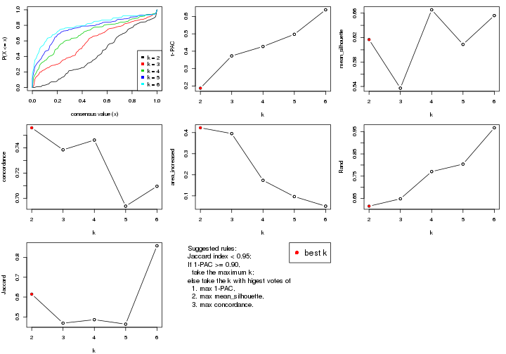

The numeric values for all these statistics can be obtained by `get_stats()`.

```r
get_stats(res)
```

```
#>   k 1-PAC mean_silhouette concordance area_increased  Rand Jaccard
#> 2 2 0.188           0.617       0.756         0.4227 0.615   0.615
#> 3 3 0.373           0.537       0.738         0.3952 0.648   0.469
#> 4 4 0.427           0.665       0.746         0.1736 0.770   0.486
#> 5 5 0.497           0.609       0.694         0.0963 0.804   0.464
#> 6 6 0.638           0.656       0.710         0.0510 0.967   0.858
```

`suggest_best_k()` suggests the best $k$ based on these statistics. The rules are as follows:

- All $k$ with Jaccard index larger than 0.95 are removed because increasing
  $k$ does not provide enough extra information. If all $k$ are removed, it is
  marked as no subgroup is detected.
- For all $k$ with 1-PAC score larger than 0.9, the maximal $k$ is taken as
  the best $k$, and other $k$ are marked as optional $k$.
- If it does not fit the second rule. The $k$ with the maximal vote of the
  highest 1-PAC score, highest mean silhouette, and highest concordance is
  taken as the best $k$.

```r
suggest_best_k(res)
```

```
#> [1] 2
```


Following shows the table of the partitions (You need to click the **show/hide
code output** link to see it). The membership matrix (columns with name `p*`)
is inferred by
[`clue::cl_consensus()`](https://www.rdocumentation.org/link/cl_consensus?package=clue)
function with the `SE` method. Basically the value in the membership matrix
represents the probability to belong to a certain group. The finall class
label for an item is determined with the group with highest probability it
belongs to.

In `get_classes()` function, the entropy is calculated from the membership
matrix and the silhouette score is calculated from the consensus matrix.


<script>
$( function() {
	$( '#tabs-MAD-kmeans-get-classes' ).tabs();
} );
</script>
<div id='tabs-MAD-kmeans-get-classes'>
<ul>
<li><a href='#tab-MAD-kmeans-get-classes-1'>k = 2</a></li>
<li><a href='#tab-MAD-kmeans-get-classes-2'>k = 3</a></li>
<li><a href='#tab-MAD-kmeans-get-classes-3'>k = 4</a></li>
<li><a href='#tab-MAD-kmeans-get-classes-4'>k = 5</a></li>
<li><a href='#tab-MAD-kmeans-get-classes-5'>k = 6</a></li>
</ul>

<div id='tab-MAD-kmeans-get-classes-1'>
<p><a id='tab-MAD-kmeans-get-classes-1-a' style='color:#0366d6' href='#'>show/hide code output</a></p>
<pre><code class="r">cbind(get_classes(res, k = 2), get_membership(res, k = 2))
</code></pre>

<pre><code>#&gt;           class entropy silhouette    p1    p2
#&gt; GSM614415     1  0.8267     0.8871 0.740 0.260
#&gt; GSM614416     1  0.8267     0.8871 0.740 0.260
#&gt; GSM614417     1  0.8267     0.8871 0.740 0.260
#&gt; GSM614418     1  0.8267     0.8871 0.740 0.260
#&gt; GSM614419     1  0.7219     0.8891 0.800 0.200
#&gt; GSM614420     1  0.7219     0.8891 0.800 0.200
#&gt; GSM614421     2  0.9881     0.4440 0.436 0.564
#&gt; GSM614422     2  0.9881     0.4440 0.436 0.564
#&gt; GSM614423     2  0.8555     0.5196 0.280 0.720
#&gt; GSM614424     2  0.9881     0.4440 0.436 0.564
#&gt; GSM614425     2  0.9881     0.4440 0.436 0.564
#&gt; GSM614426     2  0.9881     0.4440 0.436 0.564
#&gt; GSM614427     2  0.9896     0.4381 0.440 0.560
#&gt; GSM614428     2  0.9909     0.4363 0.444 0.556
#&gt; GSM614429     2  0.0376     0.7029 0.004 0.996
#&gt; GSM614430     2  0.0376     0.7029 0.004 0.996
#&gt; GSM614431     2  0.0376     0.7029 0.004 0.996
#&gt; GSM614432     2  0.0376     0.7029 0.004 0.996
#&gt; GSM614433     2  0.0376     0.7029 0.004 0.996
#&gt; GSM614434     2  0.0376     0.7029 0.004 0.996
#&gt; GSM614435     2  0.0672     0.7026 0.008 0.992
#&gt; GSM614436     2  0.5737     0.6493 0.136 0.864
#&gt; GSM614437     2  0.8555     0.5550 0.280 0.720
#&gt; GSM614438     2  0.9248     0.5276 0.340 0.660
#&gt; GSM614439     2  0.9248     0.5276 0.340 0.660
#&gt; GSM614440     2  0.9248     0.5276 0.340 0.660
#&gt; GSM614441     2  0.9248     0.5276 0.340 0.660
#&gt; GSM614442     2  0.9248     0.5276 0.340 0.660
#&gt; GSM614443     2  0.8861     0.5463 0.304 0.696
#&gt; GSM614444     2  0.9248     0.5276 0.340 0.660
#&gt; GSM614391     1  0.7219     0.8891 0.800 0.200
#&gt; GSM614392     1  0.7815     0.8938 0.768 0.232
#&gt; GSM614393     1  0.7883     0.8936 0.764 0.236
#&gt; GSM614394     1  0.7219     0.8891 0.800 0.200
#&gt; GSM614395     1  0.1633     0.6738 0.976 0.024
#&gt; GSM614396     1  0.7219     0.8891 0.800 0.200
#&gt; GSM614397     1  0.5178     0.7978 0.884 0.116
#&gt; GSM614398     1  0.5519     0.8133 0.872 0.128
#&gt; GSM614399     2  0.7602     0.5771 0.220 0.780
#&gt; GSM614400     2  0.7950     0.5506 0.240 0.760
#&gt; GSM614401     2  0.7950     0.5506 0.240 0.760
#&gt; GSM614402     2  0.7950     0.5506 0.240 0.760
#&gt; GSM614403     2  0.6887     0.6114 0.184 0.816
#&gt; GSM614404     2  0.7950     0.5506 0.240 0.760
#&gt; GSM614405     2  0.7745     0.5671 0.228 0.772
#&gt; GSM614406     2  0.9580     0.5353 0.380 0.620
#&gt; GSM614407     1  0.8608     0.8677 0.716 0.284
#&gt; GSM614408     1  0.8608     0.8677 0.716 0.284
#&gt; GSM614409     1  0.8555     0.8723 0.720 0.280
#&gt; GSM614410     1  0.8608     0.8677 0.716 0.284
#&gt; GSM614411     1  0.8608     0.8677 0.716 0.284
#&gt; GSM614412     1  0.8327     0.8860 0.736 0.264
#&gt; GSM614413     1  0.5842     0.8147 0.860 0.140
#&gt; GSM614414     1  0.5842     0.8147 0.860 0.140
#&gt; GSM614445     2  0.6887     0.6149 0.184 0.816
#&gt; GSM614446     2  0.6887     0.6149 0.184 0.816
#&gt; GSM614447     2  0.6887     0.6149 0.184 0.816
#&gt; GSM614448     2  0.9732     0.4953 0.404 0.596
#&gt; GSM614449     2  0.9661     0.5109 0.392 0.608
#&gt; GSM614450     2  0.8016     0.5846 0.244 0.756
#&gt; GSM614451     2  0.9993     0.4446 0.484 0.516
#&gt; GSM614452     2  0.9993     0.4446 0.484 0.516
#&gt; GSM614453     2  0.0376     0.7029 0.004 0.996
#&gt; GSM614454     2  0.0376     0.7029 0.004 0.996
#&gt; GSM614455     2  0.0376     0.7029 0.004 0.996
#&gt; GSM614456     2  0.0376     0.7029 0.004 0.996
#&gt; GSM614457     2  0.0376     0.7029 0.004 0.996
#&gt; GSM614458     2  0.0376     0.7029 0.004 0.996
#&gt; GSM614459     2  0.1414     0.6971 0.020 0.980
#&gt; GSM614460     2  0.0376     0.7029 0.004 0.996
#&gt; GSM614461     2  0.0000     0.7027 0.000 1.000
#&gt; GSM614462     2  0.0000     0.7027 0.000 1.000
#&gt; GSM614463     2  0.0000     0.7027 0.000 1.000
#&gt; GSM614464     2  0.0000     0.7027 0.000 1.000
#&gt; GSM614465     2  0.0000     0.7027 0.000 1.000
#&gt; GSM614466     2  0.0000     0.7027 0.000 1.000
#&gt; GSM614467     2  0.0672     0.7014 0.008 0.992
#&gt; GSM614468     2  0.0000     0.7027 0.000 1.000
#&gt; GSM614469     2  0.9754     0.1004 0.408 0.592
#&gt; GSM614470     2  0.9754     0.1004 0.408 0.592
#&gt; GSM614471     2  0.9754     0.1004 0.408 0.592
#&gt; GSM614472     2  0.9754     0.1004 0.408 0.592
#&gt; GSM614473     2  0.9754     0.1004 0.408 0.592
#&gt; GSM614474     2  0.9754     0.1004 0.408 0.592
#&gt; GSM614475     2  0.9754     0.1004 0.408 0.592
#&gt; GSM614476     2  0.9977    -0.0954 0.472 0.528
</code></pre>

<script>
$('#tab-MAD-kmeans-get-classes-1-a').parent().next().next().hide();
$('#tab-MAD-kmeans-get-classes-1-a').click(function(){
  $('#tab-MAD-kmeans-get-classes-1-a').parent().next().next().toggle();
  return(false);
});
</script>
</div>

<div id='tab-MAD-kmeans-get-classes-2'>
<p><a id='tab-MAD-kmeans-get-classes-2-a' style='color:#0366d6' href='#'>show/hide code output</a></p>
<pre><code class="r">cbind(get_classes(res, k = 3), get_membership(res, k = 3))
</code></pre>

<pre><code>#&gt;           class entropy silhouette    p1    p2    p3
#&gt; GSM614415     1  0.1636      0.710 0.964 0.020 0.016
#&gt; GSM614416     1  0.1636      0.710 0.964 0.020 0.016
#&gt; GSM614417     1  0.1636      0.710 0.964 0.020 0.016
#&gt; GSM614418     1  0.1636      0.710 0.964 0.020 0.016
#&gt; GSM614419     1  0.1774      0.708 0.960 0.016 0.024
#&gt; GSM614420     1  0.1774      0.708 0.960 0.016 0.024
#&gt; GSM614421     3  0.9724      0.427 0.224 0.364 0.412
#&gt; GSM614422     3  0.9724      0.427 0.224 0.364 0.412
#&gt; GSM614423     2  0.8746      0.273 0.184 0.588 0.228
#&gt; GSM614424     3  0.9724      0.427 0.224 0.364 0.412
#&gt; GSM614425     3  0.9724      0.427 0.224 0.364 0.412
#&gt; GSM614426     3  0.9724      0.427 0.224 0.364 0.412
#&gt; GSM614427     3  0.9724      0.427 0.224 0.364 0.412
#&gt; GSM614428     3  0.9724      0.427 0.224 0.364 0.412
#&gt; GSM614429     2  0.0592      0.705 0.000 0.988 0.012
#&gt; GSM614430     2  0.0592      0.705 0.000 0.988 0.012
#&gt; GSM614431     2  0.0592      0.705 0.000 0.988 0.012
#&gt; GSM614432     2  0.0592      0.705 0.000 0.988 0.012
#&gt; GSM614433     2  0.0000      0.707 0.000 1.000 0.000
#&gt; GSM614434     2  0.0592      0.705 0.000 0.988 0.012
#&gt; GSM614435     2  0.1289      0.694 0.000 0.968 0.032
#&gt; GSM614436     2  0.3941      0.480 0.000 0.844 0.156
#&gt; GSM614437     3  0.6686      0.592 0.016 0.372 0.612
#&gt; GSM614438     3  0.6667      0.597 0.016 0.368 0.616
#&gt; GSM614439     3  0.6667      0.597 0.016 0.368 0.616
#&gt; GSM614440     3  0.6667      0.597 0.016 0.368 0.616
#&gt; GSM614441     3  0.6667      0.597 0.016 0.368 0.616
#&gt; GSM614442     3  0.6667      0.597 0.016 0.368 0.616
#&gt; GSM614443     3  0.6686      0.592 0.016 0.372 0.612
#&gt; GSM614444     3  0.6667      0.597 0.016 0.368 0.616
#&gt; GSM614391     1  0.3528      0.687 0.892 0.016 0.092
#&gt; GSM614392     1  0.3528      0.687 0.892 0.016 0.092
#&gt; GSM614393     1  0.3528      0.687 0.892 0.016 0.092
#&gt; GSM614394     1  0.3528      0.687 0.892 0.016 0.092
#&gt; GSM614395     1  0.5650      0.459 0.688 0.000 0.312
#&gt; GSM614396     1  0.3528      0.687 0.892 0.016 0.092
#&gt; GSM614397     1  0.5012      0.592 0.788 0.008 0.204
#&gt; GSM614398     1  0.3965      0.663 0.860 0.008 0.132
#&gt; GSM614399     2  0.8374      0.437 0.240 0.616 0.144
#&gt; GSM614400     2  0.8379      0.421 0.268 0.604 0.128
#&gt; GSM614401     2  0.8379      0.421 0.268 0.604 0.128
#&gt; GSM614402     2  0.8430      0.423 0.260 0.604 0.136
#&gt; GSM614403     2  0.8017      0.463 0.140 0.652 0.208
#&gt; GSM614404     2  0.8379      0.421 0.268 0.604 0.128
#&gt; GSM614405     2  0.8473      0.437 0.208 0.616 0.176
#&gt; GSM614406     2  0.8566     -0.124 0.096 0.480 0.424
#&gt; GSM614407     1  0.5042      0.693 0.836 0.060 0.104
#&gt; GSM614408     1  0.5042      0.693 0.836 0.060 0.104
#&gt; GSM614409     1  0.5042      0.693 0.836 0.060 0.104
#&gt; GSM614410     1  0.5042      0.693 0.836 0.060 0.104
#&gt; GSM614411     1  0.5042      0.693 0.836 0.060 0.104
#&gt; GSM614412     1  0.4945      0.693 0.840 0.056 0.104
#&gt; GSM614413     1  0.5412      0.664 0.796 0.032 0.172
#&gt; GSM614414     1  0.5239      0.672 0.808 0.032 0.160
#&gt; GSM614445     2  0.6662      0.524 0.072 0.736 0.192
#&gt; GSM614446     2  0.6794      0.516 0.076 0.728 0.196
#&gt; GSM614447     2  0.6662      0.524 0.072 0.736 0.192
#&gt; GSM614448     2  0.8602     -0.139 0.100 0.492 0.408
#&gt; GSM614449     2  0.8602     -0.139 0.100 0.492 0.408
#&gt; GSM614450     2  0.7916      0.357 0.100 0.636 0.264
#&gt; GSM614451     3  0.6796      0.568 0.056 0.236 0.708
#&gt; GSM614452     3  0.6796      0.568 0.056 0.236 0.708
#&gt; GSM614453     2  0.1964      0.677 0.000 0.944 0.056
#&gt; GSM614454     2  0.1964      0.677 0.000 0.944 0.056
#&gt; GSM614455     2  0.1964      0.677 0.000 0.944 0.056
#&gt; GSM614456     2  0.2066      0.675 0.000 0.940 0.060
#&gt; GSM614457     2  0.2066      0.675 0.000 0.940 0.060
#&gt; GSM614458     2  0.2066      0.675 0.000 0.940 0.060
#&gt; GSM614459     2  0.2066      0.675 0.000 0.940 0.060
#&gt; GSM614460     2  0.2066      0.675 0.000 0.940 0.060
#&gt; GSM614461     2  0.1129      0.707 0.004 0.976 0.020
#&gt; GSM614462     2  0.1129      0.707 0.004 0.976 0.020
#&gt; GSM614463     2  0.1129      0.707 0.004 0.976 0.020
#&gt; GSM614464     2  0.1129      0.707 0.004 0.976 0.020
#&gt; GSM614465     2  0.1129      0.707 0.004 0.976 0.020
#&gt; GSM614466     2  0.1129      0.707 0.004 0.976 0.020
#&gt; GSM614467     2  0.1267      0.706 0.004 0.972 0.024
#&gt; GSM614468     2  0.1129      0.707 0.004 0.976 0.020
#&gt; GSM614469     1  0.8277      0.145 0.468 0.456 0.076
#&gt; GSM614470     1  0.8277      0.145 0.468 0.456 0.076
#&gt; GSM614471     1  0.8277      0.145 0.468 0.456 0.076
#&gt; GSM614472     1  0.8277      0.145 0.468 0.456 0.076
#&gt; GSM614473     1  0.8277      0.145 0.468 0.456 0.076
#&gt; GSM614474     1  0.8277      0.145 0.468 0.456 0.076
#&gt; GSM614475     1  0.8277      0.145 0.468 0.456 0.076
#&gt; GSM614476     1  0.8744      0.118 0.448 0.444 0.108
</code></pre>

<script>
$('#tab-MAD-kmeans-get-classes-2-a').parent().next().next().hide();
$('#tab-MAD-kmeans-get-classes-2-a').click(function(){
  $('#tab-MAD-kmeans-get-classes-2-a').parent().next().next().toggle();
  return(false);
});
</script>
</div>

<div id='tab-MAD-kmeans-get-classes-3'>
<p><a id='tab-MAD-kmeans-get-classes-3-a' style='color:#0366d6' href='#'>show/hide code output</a></p>
<pre><code class="r">cbind(get_classes(res, k = 4), get_membership(res, k = 4))
</code></pre>

<pre><code>#&gt;           class entropy silhouette    p1    p2    p3    p4
#&gt; GSM614415     1   0.264     0.8101 0.916 0.020 0.052 0.012
#&gt; GSM614416     1   0.264     0.8101 0.916 0.020 0.052 0.012
#&gt; GSM614417     1   0.264     0.8101 0.916 0.020 0.052 0.012
#&gt; GSM614418     1   0.264     0.8101 0.916 0.020 0.052 0.012
#&gt; GSM614419     1   0.285     0.8112 0.904 0.008 0.064 0.024
#&gt; GSM614420     1   0.285     0.8112 0.904 0.008 0.064 0.024
#&gt; GSM614421     3   0.525     0.8017 0.032 0.148 0.776 0.044
#&gt; GSM614422     3   0.525     0.8017 0.032 0.148 0.776 0.044
#&gt; GSM614423     3   0.546     0.7630 0.036 0.240 0.712 0.012
#&gt; GSM614424     3   0.525     0.8017 0.032 0.148 0.776 0.044
#&gt; GSM614425     3   0.525     0.8017 0.032 0.148 0.776 0.044
#&gt; GSM614426     3   0.525     0.8017 0.032 0.148 0.776 0.044
#&gt; GSM614427     3   0.525     0.8017 0.032 0.148 0.776 0.044
#&gt; GSM614428     3   0.534     0.7982 0.036 0.148 0.772 0.044
#&gt; GSM614429     2   0.152     0.6665 0.000 0.956 0.024 0.020
#&gt; GSM614430     2   0.152     0.6665 0.000 0.956 0.024 0.020
#&gt; GSM614431     2   0.152     0.6665 0.000 0.956 0.024 0.020
#&gt; GSM614432     2   0.152     0.6665 0.000 0.956 0.024 0.020
#&gt; GSM614433     2   0.162     0.6661 0.000 0.952 0.028 0.020
#&gt; GSM614434     2   0.152     0.6665 0.000 0.956 0.024 0.020
#&gt; GSM614435     2   0.163     0.6651 0.000 0.952 0.024 0.024
#&gt; GSM614436     2   0.304     0.6087 0.000 0.888 0.076 0.036
#&gt; GSM614437     4   0.590     0.9898 0.000 0.160 0.140 0.700
#&gt; GSM614438     4   0.608     0.9966 0.004 0.156 0.144 0.696
#&gt; GSM614439     4   0.608     0.9966 0.004 0.156 0.144 0.696
#&gt; GSM614440     4   0.608     0.9966 0.004 0.156 0.144 0.696
#&gt; GSM614441     4   0.608     0.9966 0.004 0.156 0.144 0.696
#&gt; GSM614442     4   0.608     0.9966 0.004 0.156 0.144 0.696
#&gt; GSM614443     4   0.590     0.9898 0.000 0.160 0.140 0.700
#&gt; GSM614444     4   0.608     0.9966 0.004 0.156 0.144 0.696
#&gt; GSM614391     1   0.456     0.7860 0.816 0.008 0.080 0.096
#&gt; GSM614392     1   0.456     0.7860 0.816 0.008 0.080 0.096
#&gt; GSM614393     1   0.456     0.7860 0.816 0.008 0.080 0.096
#&gt; GSM614394     1   0.462     0.7847 0.812 0.008 0.084 0.096
#&gt; GSM614395     1   0.657     0.5443 0.604 0.000 0.280 0.116
#&gt; GSM614396     1   0.462     0.7847 0.812 0.008 0.084 0.096
#&gt; GSM614397     1   0.593     0.6884 0.700 0.004 0.196 0.100
#&gt; GSM614398     1   0.496     0.7679 0.784 0.004 0.116 0.096
#&gt; GSM614399     2   0.846     0.3911 0.148 0.520 0.252 0.080
#&gt; GSM614400     2   0.856     0.4162 0.180 0.516 0.224 0.080
#&gt; GSM614401     2   0.856     0.4162 0.180 0.516 0.224 0.080
#&gt; GSM614402     2   0.851     0.3964 0.156 0.516 0.248 0.080
#&gt; GSM614403     3   0.770     0.2756 0.056 0.356 0.512 0.076
#&gt; GSM614404     2   0.856     0.4162 0.180 0.516 0.224 0.080
#&gt; GSM614405     2   0.847     0.0819 0.104 0.424 0.388 0.084
#&gt; GSM614406     3   0.543     0.7527 0.004 0.196 0.732 0.068
#&gt; GSM614407     1   0.613     0.7521 0.740 0.056 0.096 0.108
#&gt; GSM614408     1   0.613     0.7521 0.740 0.056 0.096 0.108
#&gt; GSM614409     1   0.619     0.7530 0.736 0.056 0.100 0.108
#&gt; GSM614410     1   0.613     0.7521 0.740 0.056 0.096 0.108
#&gt; GSM614411     1   0.619     0.7530 0.736 0.056 0.100 0.108
#&gt; GSM614412     1   0.620     0.7540 0.732 0.048 0.108 0.112
#&gt; GSM614413     1   0.631     0.7180 0.676 0.008 0.200 0.116
#&gt; GSM614414     1   0.628     0.7219 0.680 0.008 0.196 0.116
#&gt; GSM614445     3   0.547     0.6919 0.020 0.296 0.672 0.012
#&gt; GSM614446     3   0.545     0.6977 0.020 0.292 0.676 0.012
#&gt; GSM614447     3   0.547     0.6919 0.020 0.296 0.672 0.012
#&gt; GSM614448     3   0.446     0.7967 0.012 0.164 0.800 0.024
#&gt; GSM614449     3   0.454     0.7953 0.012 0.172 0.792 0.024
#&gt; GSM614450     3   0.512     0.7521 0.020 0.244 0.724 0.012
#&gt; GSM614451     3   0.560     0.4416 0.008 0.044 0.696 0.252
#&gt; GSM614452     3   0.560     0.4416 0.008 0.044 0.696 0.252
#&gt; GSM614453     2   0.274     0.6497 0.000 0.900 0.024 0.076
#&gt; GSM614454     2   0.281     0.6483 0.000 0.896 0.024 0.080
#&gt; GSM614455     2   0.281     0.6483 0.000 0.896 0.024 0.080
#&gt; GSM614456     2   0.281     0.6483 0.000 0.896 0.024 0.080
#&gt; GSM614457     2   0.281     0.6483 0.000 0.896 0.024 0.080
#&gt; GSM614458     2   0.281     0.6483 0.000 0.896 0.024 0.080
#&gt; GSM614459     2   0.281     0.6483 0.000 0.896 0.024 0.080
#&gt; GSM614460     2   0.281     0.6483 0.000 0.896 0.024 0.080
#&gt; GSM614461     2   0.327     0.6494 0.004 0.880 0.084 0.032
#&gt; GSM614462     2   0.327     0.6494 0.004 0.880 0.084 0.032
#&gt; GSM614463     2   0.327     0.6494 0.004 0.880 0.084 0.032
#&gt; GSM614464     2   0.327     0.6494 0.004 0.880 0.084 0.032
#&gt; GSM614465     2   0.327     0.6494 0.004 0.880 0.084 0.032
#&gt; GSM614466     2   0.327     0.6494 0.004 0.880 0.084 0.032
#&gt; GSM614467     2   0.327     0.6494 0.004 0.880 0.084 0.032
#&gt; GSM614468     2   0.327     0.6494 0.004 0.880 0.084 0.032
#&gt; GSM614469     2   0.838     0.2536 0.404 0.412 0.120 0.064
#&gt; GSM614470     2   0.838     0.2536 0.404 0.412 0.120 0.064
#&gt; GSM614471     2   0.838     0.2536 0.404 0.412 0.120 0.064
#&gt; GSM614472     2   0.838     0.2536 0.404 0.412 0.120 0.064
#&gt; GSM614473     2   0.838     0.2536 0.404 0.412 0.120 0.064
#&gt; GSM614474     2   0.838     0.2536 0.404 0.412 0.120 0.064
#&gt; GSM614475     2   0.838     0.2536 0.404 0.412 0.120 0.064
#&gt; GSM614476     2   0.873     0.2658 0.368 0.400 0.168 0.064
</code></pre>

<script>
$('#tab-MAD-kmeans-get-classes-3-a').parent().next().next().hide();
$('#tab-MAD-kmeans-get-classes-3-a').click(function(){
  $('#tab-MAD-kmeans-get-classes-3-a').parent().next().next().toggle();
  return(false);
});
</script>
</div>

<div id='tab-MAD-kmeans-get-classes-4'>
<p><a id='tab-MAD-kmeans-get-classes-4-a' style='color:#0366d6' href='#'>show/hide code output</a></p>
<pre><code class="r">cbind(get_classes(res, k = 5), get_membership(res, k = 5))
</code></pre>

<pre><code>#&gt;           class entropy silhouette    p1    p2    p3    p4    p5
#&gt; GSM614415     1   0.601     -0.107 0.560 0.000 0.028 0.064 0.348
#&gt; GSM614416     1   0.601     -0.107 0.560 0.000 0.028 0.064 0.348
#&gt; GSM614417     1   0.601     -0.107 0.560 0.000 0.028 0.064 0.348
#&gt; GSM614418     1   0.601     -0.107 0.560 0.000 0.028 0.064 0.348
#&gt; GSM614419     1   0.605     -0.149 0.548 0.000 0.028 0.064 0.360
#&gt; GSM614420     1   0.605     -0.149 0.548 0.000 0.028 0.064 0.360
#&gt; GSM614421     3   0.620      0.593 0.056 0.052 0.708 0.096 0.088
#&gt; GSM614422     3   0.620      0.593 0.056 0.052 0.708 0.096 0.088
#&gt; GSM614423     3   0.585      0.612 0.060 0.084 0.732 0.040 0.084
#&gt; GSM614424     3   0.620      0.593 0.056 0.052 0.708 0.096 0.088
#&gt; GSM614425     3   0.620      0.593 0.056 0.052 0.708 0.096 0.088
#&gt; GSM614426     3   0.620      0.593 0.056 0.052 0.708 0.096 0.088
#&gt; GSM614427     3   0.620      0.593 0.056 0.052 0.708 0.096 0.088
#&gt; GSM614428     3   0.620      0.593 0.056 0.052 0.708 0.096 0.088
#&gt; GSM614429     2   0.144      0.859 0.004 0.948 0.044 0.000 0.004
#&gt; GSM614430     2   0.144      0.859 0.004 0.948 0.044 0.000 0.004
#&gt; GSM614431     2   0.144      0.859 0.004 0.948 0.044 0.000 0.004
#&gt; GSM614432     2   0.144      0.859 0.004 0.948 0.044 0.000 0.004
#&gt; GSM614433     2   0.144      0.859 0.004 0.948 0.044 0.000 0.004
#&gt; GSM614434     2   0.144      0.859 0.004 0.948 0.044 0.000 0.004
#&gt; GSM614435     2   0.144      0.859 0.004 0.948 0.044 0.000 0.004
#&gt; GSM614436     2   0.202      0.844 0.008 0.924 0.060 0.004 0.004
#&gt; GSM614437     4   0.382      1.000 0.004 0.140 0.048 0.808 0.000
#&gt; GSM614438     4   0.382      1.000 0.004 0.140 0.048 0.808 0.000
#&gt; GSM614439     4   0.382      1.000 0.004 0.140 0.048 0.808 0.000
#&gt; GSM614440     4   0.382      1.000 0.004 0.140 0.048 0.808 0.000
#&gt; GSM614441     4   0.382      1.000 0.004 0.140 0.048 0.808 0.000
#&gt; GSM614442     4   0.382      1.000 0.004 0.140 0.048 0.808 0.000
#&gt; GSM614443     4   0.382      1.000 0.004 0.140 0.048 0.808 0.000
#&gt; GSM614444     4   0.382      1.000 0.004 0.140 0.048 0.808 0.000
#&gt; GSM614391     5   0.403      0.903 0.316 0.000 0.004 0.000 0.680
#&gt; GSM614392     5   0.395      0.884 0.332 0.000 0.000 0.000 0.668
#&gt; GSM614393     5   0.395      0.884 0.332 0.000 0.000 0.000 0.668
#&gt; GSM614394     5   0.403      0.903 0.316 0.000 0.004 0.000 0.680
#&gt; GSM614395     5   0.525      0.771 0.220 0.000 0.088 0.008 0.684
#&gt; GSM614396     5   0.403      0.903 0.316 0.000 0.004 0.000 0.680
#&gt; GSM614397     5   0.476      0.834 0.240 0.000 0.052 0.004 0.704
#&gt; GSM614398     5   0.418      0.872 0.268 0.000 0.020 0.000 0.712
#&gt; GSM614399     3   0.934      0.110 0.228 0.196 0.332 0.060 0.184
#&gt; GSM614400     3   0.934      0.110 0.228 0.196 0.332 0.060 0.184
#&gt; GSM614401     3   0.934      0.110 0.228 0.196 0.332 0.060 0.184
#&gt; GSM614402     3   0.934      0.110 0.228 0.196 0.332 0.060 0.184
#&gt; GSM614403     3   0.822      0.358 0.124 0.120 0.524 0.060 0.172
#&gt; GSM614404     3   0.934      0.110 0.228 0.196 0.332 0.060 0.184
#&gt; GSM614405     3   0.920      0.157 0.212 0.160 0.376 0.064 0.188
#&gt; GSM614406     3   0.635      0.543 0.024 0.068 0.680 0.084 0.144
#&gt; GSM614407     1   0.138      0.466 0.956 0.020 0.020 0.004 0.000
#&gt; GSM614408     1   0.138      0.466 0.956 0.020 0.020 0.004 0.000
#&gt; GSM614409     1   0.154      0.463 0.952 0.020 0.020 0.004 0.004
#&gt; GSM614410     1   0.138      0.466 0.956 0.020 0.020 0.004 0.000
#&gt; GSM614411     1   0.154      0.463 0.952 0.020 0.020 0.004 0.004
#&gt; GSM614412     1   0.144      0.460 0.956 0.016 0.020 0.004 0.004
#&gt; GSM614413     1   0.379      0.324 0.836 0.004 0.080 0.012 0.068
#&gt; GSM614414     1   0.361      0.337 0.848 0.004 0.068 0.012 0.068
#&gt; GSM614445     3   0.329      0.615 0.012 0.100 0.860 0.008 0.020
#&gt; GSM614446     3   0.329      0.615 0.012 0.100 0.860 0.008 0.020
#&gt; GSM614447     3   0.329      0.615 0.012 0.100 0.860 0.008 0.020
#&gt; GSM614448     3   0.274      0.612 0.008 0.064 0.896 0.024 0.008
#&gt; GSM614449     3   0.252      0.612 0.008 0.064 0.904 0.020 0.004
#&gt; GSM614450     3   0.274      0.620 0.012 0.084 0.888 0.004 0.012
#&gt; GSM614451     3   0.546      0.380 0.012 0.028 0.664 0.268 0.028
#&gt; GSM614452     3   0.546      0.380 0.012 0.028 0.664 0.268 0.028
#&gt; GSM614453     2   0.296      0.826 0.004 0.884 0.008 0.048 0.056
#&gt; GSM614454     2   0.317      0.820 0.004 0.872 0.008 0.060 0.056
#&gt; GSM614455     2   0.317      0.820 0.004 0.872 0.008 0.060 0.056
#&gt; GSM614456     2   0.317      0.820 0.004 0.872 0.008 0.060 0.056
#&gt; GSM614457     2   0.317      0.820 0.004 0.872 0.008 0.060 0.056
#&gt; GSM614458     2   0.317      0.820 0.004 0.872 0.008 0.060 0.056
#&gt; GSM614459     2   0.317      0.820 0.004 0.872 0.008 0.060 0.056
#&gt; GSM614460     2   0.317      0.820 0.004 0.872 0.008 0.060 0.056
#&gt; GSM614461     2   0.496      0.806 0.016 0.780 0.064 0.044 0.096
#&gt; GSM614462     2   0.496      0.806 0.016 0.780 0.064 0.044 0.096
#&gt; GSM614463     2   0.496      0.806 0.016 0.780 0.064 0.044 0.096
#&gt; GSM614464     2   0.496      0.806 0.016 0.780 0.064 0.044 0.096
#&gt; GSM614465     2   0.496      0.806 0.016 0.780 0.064 0.044 0.096
#&gt; GSM614466     2   0.496      0.806 0.016 0.780 0.064 0.044 0.096
#&gt; GSM614467     2   0.496      0.806 0.016 0.780 0.064 0.044 0.096
#&gt; GSM614468     2   0.496      0.806 0.016 0.780 0.064 0.044 0.096
#&gt; GSM614469     1   0.840      0.503 0.492 0.176 0.124 0.048 0.160
#&gt; GSM614470     1   0.840      0.503 0.492 0.176 0.124 0.048 0.160
#&gt; GSM614471     1   0.840      0.503 0.492 0.176 0.124 0.048 0.160
#&gt; GSM614472     1   0.840      0.503 0.492 0.176 0.124 0.048 0.160
#&gt; GSM614473     1   0.840      0.503 0.492 0.176 0.124 0.048 0.160
#&gt; GSM614474     1   0.840      0.503 0.492 0.176 0.124 0.048 0.160
#&gt; GSM614475     1   0.840      0.503 0.492 0.176 0.124 0.048 0.160
#&gt; GSM614476     1   0.859      0.471 0.468 0.172 0.140 0.048 0.172
</code></pre>

<script>
$('#tab-MAD-kmeans-get-classes-4-a').parent().next().next().hide();
$('#tab-MAD-kmeans-get-classes-4-a').click(function(){
  $('#tab-MAD-kmeans-get-classes-4-a').parent().next().next().toggle();
  return(false);
});
</script>
</div>

<div id='tab-MAD-kmeans-get-classes-5'>
<p><a id='tab-MAD-kmeans-get-classes-5-a' style='color:#0366d6' href='#'>show/hide code output</a></p>
<pre><code class="r">cbind(get_classes(res, k = 6), get_membership(res, k = 6))
</code></pre>

<pre><code>#&gt;           class entropy silhouette    p1    p2    p3    p4    p5    p6
#&gt; GSM614415     6   0.650     0.1845 0.216 0.000 0.004 0.020 0.356 0.404
#&gt; GSM614416     6   0.650     0.1845 0.216 0.000 0.004 0.020 0.356 0.404
#&gt; GSM614417     6   0.650     0.1845 0.216 0.000 0.004 0.020 0.356 0.404
#&gt; GSM614418     6   0.650     0.1845 0.216 0.000 0.004 0.020 0.356 0.404
#&gt; GSM614419     6   0.652     0.1745 0.220 0.000 0.004 0.020 0.360 0.396
#&gt; GSM614420     6   0.652     0.1745 0.220 0.000 0.004 0.020 0.360 0.396
#&gt; GSM614421     3   0.383     0.7993 0.016 0.012 0.836 0.052 0.032 0.052
#&gt; GSM614422     3   0.383     0.7993 0.016 0.012 0.836 0.052 0.032 0.052
#&gt; GSM614423     3   0.364     0.7715 0.028 0.028 0.844 0.004 0.032 0.064
#&gt; GSM614424     3   0.383     0.7993 0.016 0.012 0.836 0.052 0.032 0.052
#&gt; GSM614425     3   0.383     0.7993 0.016 0.012 0.836 0.052 0.032 0.052
#&gt; GSM614426     3   0.383     0.7993 0.016 0.012 0.836 0.052 0.032 0.052
#&gt; GSM614427     3   0.383     0.7993 0.016 0.012 0.836 0.052 0.032 0.052
#&gt; GSM614428     3   0.383     0.7993 0.016 0.012 0.836 0.052 0.032 0.052
#&gt; GSM614429     2   0.283     0.7590 0.012 0.884 0.044 0.040 0.000 0.020
#&gt; GSM614430     2   0.283     0.7590 0.012 0.884 0.044 0.040 0.000 0.020
#&gt; GSM614431     2   0.283     0.7590 0.012 0.884 0.044 0.040 0.000 0.020
#&gt; GSM614432     2   0.283     0.7590 0.012 0.884 0.044 0.040 0.000 0.020
#&gt; GSM614433     2   0.283     0.7590 0.012 0.884 0.044 0.040 0.000 0.020
#&gt; GSM614434     2   0.283     0.7590 0.012 0.884 0.044 0.040 0.000 0.020
#&gt; GSM614435     2   0.283     0.7590 0.012 0.884 0.044 0.040 0.000 0.020
#&gt; GSM614436     2   0.304     0.7547 0.012 0.872 0.048 0.044 0.000 0.024
#&gt; GSM614437     4   0.129     0.9919 0.004 0.020 0.016 0.956 0.000 0.004
#&gt; GSM614438     4   0.152     0.9916 0.000 0.020 0.016 0.948 0.008 0.008
#&gt; GSM614439     4   0.115     0.9932 0.000 0.020 0.016 0.960 0.000 0.004
#&gt; GSM614440     4   0.152     0.9916 0.000 0.020 0.016 0.948 0.008 0.008
#&gt; GSM614441     4   0.100     0.9932 0.000 0.020 0.016 0.964 0.000 0.000
#&gt; GSM614442     4   0.115     0.9928 0.000 0.020 0.016 0.960 0.000 0.004
#&gt; GSM614443     4   0.129     0.9919 0.004 0.020 0.016 0.956 0.000 0.004
#&gt; GSM614444     4   0.152     0.9916 0.000 0.020 0.016 0.948 0.008 0.008
#&gt; GSM614391     5   0.171     0.9512 0.000 0.000 0.000 0.000 0.908 0.092
#&gt; GSM614392     5   0.171     0.9512 0.000 0.000 0.000 0.000 0.908 0.092
#&gt; GSM614393     5   0.171     0.9512 0.000 0.000 0.000 0.000 0.908 0.092
#&gt; GSM614394     5   0.181     0.9527 0.000 0.000 0.004 0.000 0.908 0.088
#&gt; GSM614395     5   0.256     0.8564 0.024 0.000 0.064 0.008 0.892 0.012
#&gt; GSM614396     5   0.181     0.9527 0.000 0.000 0.004 0.000 0.908 0.088
#&gt; GSM614397     5   0.224     0.9086 0.016 0.000 0.036 0.000 0.908 0.040
#&gt; GSM614398     5   0.204     0.9405 0.008 0.000 0.016 0.000 0.912 0.064
#&gt; GSM614399     1   0.713     0.9452 0.504 0.148 0.144 0.000 0.012 0.192
#&gt; GSM614400     1   0.712     0.9470 0.504 0.148 0.140 0.000 0.012 0.196
#&gt; GSM614401     1   0.712     0.9470 0.504 0.148 0.140 0.000 0.012 0.196
#&gt; GSM614402     1   0.712     0.9470 0.504 0.148 0.140 0.000 0.012 0.196
#&gt; GSM614403     1   0.672     0.7513 0.508 0.116 0.268 0.000 0.004 0.104
#&gt; GSM614404     1   0.712     0.9470 0.504 0.148 0.140 0.000 0.012 0.196
#&gt; GSM614405     1   0.710     0.9222 0.508 0.132 0.164 0.000 0.012 0.184
#&gt; GSM614406     3   0.662    -0.1875 0.420 0.064 0.436 0.016 0.024 0.040
#&gt; GSM614407     6   0.271     0.5046 0.000 0.016 0.012 0.000 0.108 0.864
#&gt; GSM614408     6   0.271     0.5046 0.000 0.016 0.012 0.000 0.108 0.864
#&gt; GSM614409     6   0.271     0.5046 0.000 0.016 0.012 0.000 0.108 0.864
#&gt; GSM614410     6   0.271     0.5046 0.000 0.016 0.012 0.000 0.108 0.864
#&gt; GSM614411     6   0.271     0.5046 0.000 0.016 0.012 0.000 0.108 0.864
#&gt; GSM614412     6   0.290     0.4907 0.000 0.012 0.012 0.004 0.120 0.852
#&gt; GSM614413     6   0.423     0.4241 0.012 0.004 0.064 0.008 0.136 0.776
#&gt; GSM614414     6   0.423     0.4241 0.012 0.004 0.064 0.008 0.136 0.776
#&gt; GSM614445     3   0.367     0.6940 0.172 0.024 0.788 0.008 0.008 0.000
#&gt; GSM614446     3   0.367     0.6940 0.172 0.024 0.788 0.008 0.008 0.000
#&gt; GSM614447     3   0.367     0.6940 0.172 0.024 0.788 0.008 0.008 0.000
#&gt; GSM614448     3   0.263     0.7532 0.104 0.008 0.872 0.008 0.008 0.000
#&gt; GSM614449     3   0.252     0.7524 0.104 0.008 0.876 0.008 0.004 0.000
#&gt; GSM614450     3   0.310     0.7306 0.132 0.020 0.836 0.008 0.004 0.000
#&gt; GSM614451     3   0.438     0.6808 0.056 0.000 0.744 0.172 0.028 0.000
#&gt; GSM614452     3   0.438     0.6808 0.056 0.000 0.744 0.172 0.028 0.000
#&gt; GSM614453     2   0.517     0.7205 0.112 0.732 0.020 0.096 0.032 0.008
#&gt; GSM614454     2   0.521     0.7192 0.112 0.728 0.020 0.100 0.032 0.008
#&gt; GSM614455     2   0.521     0.7192 0.112 0.728 0.020 0.100 0.032 0.008
#&gt; GSM614456     2   0.521     0.7192 0.112 0.728 0.020 0.100 0.032 0.008
#&gt; GSM614457     2   0.521     0.7192 0.112 0.728 0.020 0.100 0.032 0.008
#&gt; GSM614458     2   0.521     0.7192 0.112 0.728 0.020 0.100 0.032 0.008
#&gt; GSM614459     2   0.521     0.7192 0.112 0.728 0.020 0.100 0.032 0.008
#&gt; GSM614460     2   0.521     0.7192 0.112 0.728 0.020 0.100 0.032 0.008
#&gt; GSM614461     2   0.506     0.6404 0.200 0.704 0.044 0.004 0.020 0.028
#&gt; GSM614462     2   0.506     0.6404 0.200 0.704 0.044 0.004 0.020 0.028
#&gt; GSM614463     2   0.506     0.6404 0.200 0.704 0.044 0.004 0.020 0.028
#&gt; GSM614464     2   0.506     0.6404 0.200 0.704 0.044 0.004 0.020 0.028
#&gt; GSM614465     2   0.506     0.6404 0.200 0.704 0.044 0.004 0.020 0.028
#&gt; GSM614466     2   0.506     0.6404 0.200 0.704 0.044 0.004 0.020 0.028
#&gt; GSM614467     2   0.506     0.6404 0.200 0.704 0.044 0.004 0.020 0.028
#&gt; GSM614468     2   0.506     0.6404 0.200 0.704 0.044 0.004 0.020 0.028
#&gt; GSM614469     6   0.704     0.1120 0.244 0.184 0.048 0.004 0.024 0.496
#&gt; GSM614470     6   0.704     0.1120 0.244 0.184 0.048 0.004 0.024 0.496
#&gt; GSM614471     6   0.704     0.1120 0.244 0.184 0.048 0.004 0.024 0.496
#&gt; GSM614472     6   0.704     0.1120 0.244 0.184 0.048 0.004 0.024 0.496
#&gt; GSM614473     6   0.704     0.1120 0.244 0.184 0.048 0.004 0.024 0.496
#&gt; GSM614474     6   0.704     0.1120 0.244 0.184 0.048 0.004 0.024 0.496
#&gt; GSM614475     6   0.704     0.1120 0.244 0.184 0.048 0.004 0.024 0.496
#&gt; GSM614476     6   0.720     0.0734 0.248 0.176 0.064 0.004 0.024 0.484
</code></pre>

<script>
$('#tab-MAD-kmeans-get-classes-5-a').parent().next().next().hide();
$('#tab-MAD-kmeans-get-classes-5-a').click(function(){
  $('#tab-MAD-kmeans-get-classes-5-a').parent().next().next().toggle();
  return(false);
});
</script>
</div>
</div>

Heatmaps for the consensus matrix. It visualizes the probability of two
samples to be in a same group.


<script>
$( function() {
	$( '#tabs-MAD-kmeans-consensus-heatmap' ).tabs();
} );
</script>
<div id='tabs-MAD-kmeans-consensus-heatmap'>
<ul>
<li><a href='#tab-MAD-kmeans-consensus-heatmap-1'>k = 2</a></li>
<li><a href='#tab-MAD-kmeans-consensus-heatmap-2'>k = 3</a></li>
<li><a href='#tab-MAD-kmeans-consensus-heatmap-3'>k = 4</a></li>
<li><a href='#tab-MAD-kmeans-consensus-heatmap-4'>k = 5</a></li>
<li><a href='#tab-MAD-kmeans-consensus-heatmap-5'>k = 6</a></li>
</ul>
<div id='tab-MAD-kmeans-consensus-heatmap-1'>
<pre><code class="r">consensus_heatmap(res, k = 2)
</code></pre>

<p></p>

</div>
<div id='tab-MAD-kmeans-consensus-heatmap-2'>
<pre><code class="r">consensus_heatmap(res, k = 3)
</code></pre>

<p></p>

</div>
<div id='tab-MAD-kmeans-consensus-heatmap-3'>
<pre><code class="r">consensus_heatmap(res, k = 4)
</code></pre>

<p></p>

</div>
<div id='tab-MAD-kmeans-consensus-heatmap-4'>
<pre><code class="r">consensus_heatmap(res, k = 5)
</code></pre>

<p></p>

</div>
<div id='tab-MAD-kmeans-consensus-heatmap-5'>
<pre><code class="r">consensus_heatmap(res, k = 6)
</code></pre>

<p></p>

</div>
</div>

Heatmaps for the membership of samples in all partitions to see how consistent they are:


<script>
$( function() {
	$( '#tabs-MAD-kmeans-membership-heatmap' ).tabs();
} );
</script>
<div id='tabs-MAD-kmeans-membership-heatmap'>
<ul>
<li><a href='#tab-MAD-kmeans-membership-heatmap-1'>k = 2</a></li>
<li><a href='#tab-MAD-kmeans-membership-heatmap-2'>k = 3</a></li>
<li><a href='#tab-MAD-kmeans-membership-heatmap-3'>k = 4</a></li>
<li><a href='#tab-MAD-kmeans-membership-heatmap-4'>k = 5</a></li>
<li><a href='#tab-MAD-kmeans-membership-heatmap-5'>k = 6</a></li>
</ul>
<div id='tab-MAD-kmeans-membership-heatmap-1'>
<pre><code class="r">membership_heatmap(res, k = 2)
</code></pre>

<p></p>

</div>
<div id='tab-MAD-kmeans-membership-heatmap-2'>
<pre><code class="r">membership_heatmap(res, k = 3)
</code></pre>

<p></p>

</div>
<div id='tab-MAD-kmeans-membership-heatmap-3'>
<pre><code class="r">membership_heatmap(res, k = 4)
</code></pre>

<p>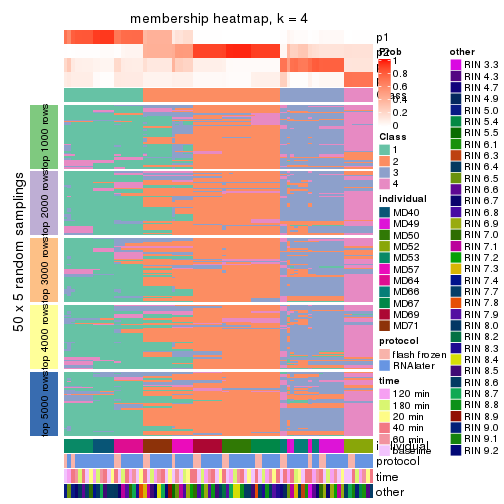</p>

</div>
<div id='tab-MAD-kmeans-membership-heatmap-4'>
<pre><code class="r">membership_heatmap(res, k = 5)
</code></pre>

<p></p>

</div>
<div id='tab-MAD-kmeans-membership-heatmap-5'>
<pre><code class="r">membership_heatmap(res, k = 6)
</code></pre>

<p></p>

</div>
</div>

As soon as we have had the classes for columns, we can look for signatures
which are significantly different between classes which can be candidate marks
for certain classes. Following are the heatmaps for signatures.


Signature heatmaps where rows are scaled:


<script>
$( function() {
	$( '#tabs-MAD-kmeans-get-signatures' ).tabs();
} );
</script>
<div id='tabs-MAD-kmeans-get-signatures'>
<ul>
<li><a href='#tab-MAD-kmeans-get-signatures-1'>k = 2</a></li>
<li><a href='#tab-MAD-kmeans-get-signatures-2'>k = 3</a></li>
<li><a href='#tab-MAD-kmeans-get-signatures-3'>k = 4</a></li>
<li><a href='#tab-MAD-kmeans-get-signatures-4'>k = 5</a></li>
<li><a href='#tab-MAD-kmeans-get-signatures-5'>k = 6</a></li>
</ul>
<div id='tab-MAD-kmeans-get-signatures-1'>
<pre><code class="r">get_signatures(res, k = 2)
</code></pre>

<p></p>

</div>
<div id='tab-MAD-kmeans-get-signatures-2'>
<pre><code class="r">get_signatures(res, k = 3)
</code></pre>

<p>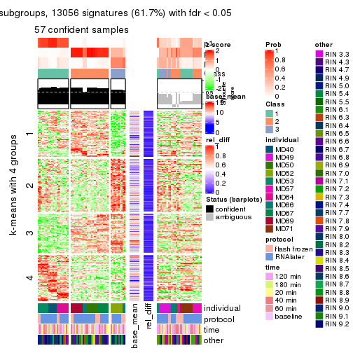</p>

</div>
<div id='tab-MAD-kmeans-get-signatures-3'>
<pre><code class="r">get_signatures(res, k = 4)
</code></pre>

<p></p>

</div>
<div id='tab-MAD-kmeans-get-signatures-4'>
<pre><code class="r">get_signatures(res, k = 5)
</code></pre>

<p></p>

</div>
<div id='tab-MAD-kmeans-get-signatures-5'>
<pre><code class="r">get_signatures(res, k = 6)
</code></pre>

<p></p>

</div>
</div>


Signature heatmaps where rows are not scaled:


<script>
$( function() {
	$( '#tabs-MAD-kmeans-get-signatures-no-scale' ).tabs();
} );
</script>
<div id='tabs-MAD-kmeans-get-signatures-no-scale'>
<ul>
<li><a href='#tab-MAD-kmeans-get-signatures-no-scale-1'>k = 2</a></li>
<li><a href='#tab-MAD-kmeans-get-signatures-no-scale-2'>k = 3</a></li>
<li><a href='#tab-MAD-kmeans-get-signatures-no-scale-3'>k = 4</a></li>
<li><a href='#tab-MAD-kmeans-get-signatures-no-scale-4'>k = 5</a></li>
<li><a href='#tab-MAD-kmeans-get-signatures-no-scale-5'>k = 6</a></li>
</ul>
<div id='tab-MAD-kmeans-get-signatures-no-scale-1'>
<pre><code class="r">get_signatures(res, k = 2, scale_rows = FALSE)
</code></pre>

<p></p>

</div>
<div id='tab-MAD-kmeans-get-signatures-no-scale-2'>
<pre><code class="r">get_signatures(res, k = 3, scale_rows = FALSE)
</code></pre>

<p></p>

</div>
<div id='tab-MAD-kmeans-get-signatures-no-scale-3'>
<pre><code class="r">get_signatures(res, k = 4, scale_rows = FALSE)
</code></pre>

<p></p>

</div>
<div id='tab-MAD-kmeans-get-signatures-no-scale-4'>
<pre><code class="r">get_signatures(res, k = 5, scale_rows = FALSE)
</code></pre>

<p></p>

</div>
<div id='tab-MAD-kmeans-get-signatures-no-scale-5'>
<pre><code class="r">get_signatures(res, k = 6, scale_rows = FALSE)
</code></pre>

<p></p>

</div>
</div>


Compare the overlap of signatures from different k:

```r
compare_signatures(res)
```


`get_signature()` returns a data frame invisibly. TO get the list of signatures, the function
call should be assigned to a variable explicitly. In following code, if `plot` argument is set
to `FALSE`, no heatmap is plotted while only the differential analysis is performed.

```r
# code only for demonstration
tb = get_signature(res, k = ..., plot = FALSE)
```

An example of the output of `tb` is:

```
#>   which_row         fdr    mean_1    mean_2 scaled_mean_1 scaled_mean_2 km
#> 1        38 0.042760348  8.373488  9.131774    -0.5533452     0.5164555  1
#> 2        40 0.018707592  7.106213  8.469186    -0.6173731     0.5762149  1
#> 3        55 0.019134737 10.221463 11.207825    -0.6159697     0.5749050  1
#> 4        59 0.006059896  5.921854  7.869574    -0.6899429     0.6439467  1
#> 5        60 0.018055526  8.928898 10.211722    -0.6204761     0.5791110  1
#> 6        98 0.009384629 15.714769 14.887706     0.6635654    -0.6193277  2
...
```

The columns in `tb` are:

1. `which_row`: row indices corresponding to the input matrix.
2. `fdr`: FDR for the differential test. 
3. `mean_x`: The mean value in group x.
4. `scaled_mean_x`: The mean value in group x after rows are scaled.
5. `km`: Row groups if k-means clustering is applied to rows.


UMAP plot which shows how samples are separated.


<script>
$( function() {
	$( '#tabs-MAD-kmeans-dimension-reduction' ).tabs();
} );
</script>
<div id='tabs-MAD-kmeans-dimension-reduction'>
<ul>
<li><a href='#tab-MAD-kmeans-dimension-reduction-1'>k = 2</a></li>
<li><a href='#tab-MAD-kmeans-dimension-reduction-2'>k = 3</a></li>
<li><a href='#tab-MAD-kmeans-dimension-reduction-3'>k = 4</a></li>
<li><a href='#tab-MAD-kmeans-dimension-reduction-4'>k = 5</a></li>
<li><a href='#tab-MAD-kmeans-dimension-reduction-5'>k = 6</a></li>
</ul>
<div id='tab-MAD-kmeans-dimension-reduction-1'>
<pre><code class="r">dimension_reduction(res, k = 2, method = &quot;UMAP&quot;)
</code></pre>

<p></p>

</div>
<div id='tab-MAD-kmeans-dimension-reduction-2'>
<pre><code class="r">dimension_reduction(res, k = 3, method = &quot;UMAP&quot;)
</code></pre>

<p></p>

</div>
<div id='tab-MAD-kmeans-dimension-reduction-3'>
<pre><code class="r">dimension_reduction(res, k = 4, method = &quot;UMAP&quot;)
</code></pre>

<p></p>

</div>
<div id='tab-MAD-kmeans-dimension-reduction-4'>
<pre><code class="r">dimension_reduction(res, k = 5, method = &quot;UMAP&quot;)
</code></pre>

<p></p>

</div>
<div id='tab-MAD-kmeans-dimension-reduction-5'>
<pre><code class="r">dimension_reduction(res, k = 6, method = &quot;UMAP&quot;)
</code></pre>

<p></p>

</div>
</div>


Following heatmap shows how subgroups are split when increasing `k`:

```r
collect_classes(res)
```


Test correlation between subgroups and known annotations. If the known
annotation is numeric, one-way ANOVA test is applied, and if the known
annotation is discrete, chi-squared contingency table test is applied.

```r
test_to_known_factors(res)
```

```
#>             n individual(p) protocol(p) time(p) other(p) k
#> MAD:kmeans 68      3.75e-11       0.985   0.999   0.6720 2
#> MAD:kmeans 57      6.39e-16       0.361   1.000   0.1408 3
#> MAD:kmeans 69      1.15e-29       0.942   1.000   0.0415 4
#> MAD:kmeans 62      3.07e-35       0.977   1.000   0.0177 5
#> MAD:kmeans 68      3.27e-49       0.857   1.000   0.0799 6
```


If matrix rows can be associated to genes, consider to use `functional_enrichment(res,
...)` to perform function enrichment for the signature genes. See [this vignette](http://bioconductor.org/packages/devel/bioc/vignettes/cola/inst/doc/functional_enrichment.html) for more detailed explanations.


 

---------------------------------------------------


### MAD:skmeans


The object with results only for a single top-value method and a single partition method 
can be extracted as:

```r
res = res_list["MAD", "skmeans"]
# you can also extract it by
# res = res_list["MAD:skmeans"]
```

A summary of `res` and all the functions that can be applied to it:

```r
res
```

```
#> A 'ConsensusPartition' object with k = 2, 3, 4, 5, 6.
#>   On a matrix with 21168 rows and 86 columns.
#>   Top rows (1000, 2000, 3000, 4000, 5000) are extracted by 'MAD' method.
#>   Subgroups are detected by 'skmeans' method.
#>   Performed in total 1250 partitions by row resampling.
#>   Best k for subgroups seems to be 2.
#> 
#> Following methods can be applied to this 'ConsensusPartition' object:
#>  [1] "cola_report"             "collect_classes"         "collect_plots"          
#>  [4] "collect_stats"           "colnames"                "compare_signatures"     
#>  [7] "consensus_heatmap"       "dimension_reduction"     "functional_enrichment"  
#> [10] "get_anno_col"            "get_anno"                "get_classes"            
#> [13] "get_consensus"           "get_matrix"              "get_membership"         
#> [16] "get_param"               "get_signatures"          "get_stats"              
#> [19] "is_best_k"               "is_stable_k"             "membership_heatmap"     
#> [22] "ncol"                    "nrow"                    "plot_ecdf"              
#> [25] "rownames"                "select_partition_number" "show"                   
#> [28] "suggest_best_k"          "test_to_known_factors"
```

`collect_plots()` function collects all the plots made from `res` for all `k` (number of partitions)
into one single page to provide an easy and fast comparison between different `k`.

```r
collect_plots(res)
```


The plots are:

- The first row: a plot of the ECDF (empirical cumulative distribution
  function) curves of the consensus matrix for each `k` and the heatmap of
  predicted classes for each `k`.
- The second row: heatmaps of the consensus matrix for each `k`.
- The third row: heatmaps of the membership matrix for each `k`.
- The fouth row: heatmaps of the signatures for each `k`.

All the plots in panels can be made by individual functions and they are
plotted later in this section.

`select_partition_number()` produces several plots showing different
statistics for choosing "optimized" `k`. There are following statistics:

- ECDF curves of the consensus matrix for each `k`;
- 1-PAC. [The PAC
  score](https://en.wikipedia.org/wiki/Consensus_clustering#Over-interpretation_potential_of_consensus_clustering)
  measures the proportion of the ambiguous subgrouping.
- Mean silhouette score.
- Concordance. The mean probability of fiting the consensus class ids in all
  partitions.
- Area increased. Denote $A_k$ as the area under the ECDF curve for current
  `k`, the area increased is defined as $A_k - A_{k-1}$.
- Rand index. The percent of pairs of samples that are both in a same cluster
  or both are not in a same cluster in the partition of k and k-1.
- Jaccard index. The ratio of pairs of samples are both in a same cluster in
  the partition of k and k-1 and the pairs of samples are both in a same
  cluster in the partition k or k-1.

The detailed explanations of these statistics can be found in [the _cola_
vignette](http://bioconductor.org/packages/devel/bioc/vignettes/cola/inst/doc/cola.html#toc_13).

Generally speaking, lower PAC score, higher mean silhouette score or higher
concordance corresponds to better partition. Rand index and Jaccard index
measure how similar the current partition is compared to partition with `k-1`.
If they are too similar, we won't accept `k` is better than `k-1`.

```r
select_partition_number(res)
```


The numeric values for all these statistics can be obtained by `get_stats()`.

```r
get_stats(res)
```

```
#>   k 1-PAC mean_silhouette concordance area_increased  Rand Jaccard
#> 2 2 0.706           0.885       0.940         0.4999 0.501   0.501
#> 3 3 0.744           0.788       0.905         0.3397 0.694   0.460
#> 4 4 0.759           0.790       0.870         0.1155 0.851   0.588
#> 5 5 0.744           0.829       0.871         0.0610 0.950   0.801
#> 6 6 0.792           0.790       0.829         0.0364 1.000   1.000
```

`suggest_best_k()` suggests the best $k$ based on these statistics. The rules are as follows:

- All $k$ with Jaccard index larger than 0.95 are removed because increasing
  $k$ does not provide enough extra information. If all $k$ are removed, it is
  marked as no subgroup is detected.
- For all $k$ with 1-PAC score larger than 0.9, the maximal $k$ is taken as
  the best $k$, and other $k$ are marked as optional $k$.
- If it does not fit the second rule. The $k$ with the maximal vote of the
  highest 1-PAC score, highest mean silhouette, and highest concordance is
  taken as the best $k$.

```r
suggest_best_k(res)
```

```
#> [1] 2
```


Following shows the table of the partitions (You need to click the **show/hide
code output** link to see it). The membership matrix (columns with name `p*`)
is inferred by
[`clue::cl_consensus()`](https://www.rdocumentation.org/link/cl_consensus?package=clue)
function with the `SE` method. Basically the value in the membership matrix
represents the probability to belong to a certain group. The finall class
label for an item is determined with the group with highest probability it
belongs to.

In `get_classes()` function, the entropy is calculated from the membership
matrix and the silhouette score is calculated from the consensus matrix.


<script>
$( function() {
	$( '#tabs-MAD-skmeans-get-classes' ).tabs();
} );
</script>
<div id='tabs-MAD-skmeans-get-classes'>
<ul>
<li><a href='#tab-MAD-skmeans-get-classes-1'>k = 2</a></li>
<li><a href='#tab-MAD-skmeans-get-classes-2'>k = 3</a></li>
<li><a href='#tab-MAD-skmeans-get-classes-3'>k = 4</a></li>
<li><a href='#tab-MAD-skmeans-get-classes-4'>k = 5</a></li>
<li><a href='#tab-MAD-skmeans-get-classes-5'>k = 6</a></li>
</ul>

<div id='tab-MAD-skmeans-get-classes-1'>
<p><a id='tab-MAD-skmeans-get-classes-1-a' style='color:#0366d6' href='#'>show/hide code output</a></p>
<pre><code class="r">cbind(get_classes(res, k = 2), get_membership(res, k = 2))
</code></pre>

<pre><code>#&gt;           class entropy silhouette    p1    p2
#&gt; GSM614415     1  0.0000      0.940 1.000 0.000
#&gt; GSM614416     1  0.0000      0.940 1.000 0.000
#&gt; GSM614417     1  0.0000      0.940 1.000 0.000
#&gt; GSM614418     1  0.0000      0.940 1.000 0.000
#&gt; GSM614419     1  0.0000      0.940 1.000 0.000
#&gt; GSM614420     1  0.0000      0.940 1.000 0.000
#&gt; GSM614421     2  0.9358      0.566 0.352 0.648
#&gt; GSM614422     1  0.4815      0.847 0.896 0.104
#&gt; GSM614423     2  0.9491      0.534 0.368 0.632
#&gt; GSM614424     2  0.9358      0.566 0.352 0.648
#&gt; GSM614425     2  0.9358      0.566 0.352 0.648
#&gt; GSM614426     2  0.9358      0.566 0.352 0.648
#&gt; GSM614427     2  0.9358      0.566 0.352 0.648
#&gt; GSM614428     2  0.9358      0.566 0.352 0.648
#&gt; GSM614429     2  0.0000      0.931 0.000 1.000
#&gt; GSM614430     2  0.0000      0.931 0.000 1.000
#&gt; GSM614431     2  0.0000      0.931 0.000 1.000
#&gt; GSM614432     2  0.0000      0.931 0.000 1.000
#&gt; GSM614433     2  0.0000      0.931 0.000 1.000
#&gt; GSM614434     2  0.0000      0.931 0.000 1.000
#&gt; GSM614435     2  0.0000      0.931 0.000 1.000
#&gt; GSM614436     2  0.0000      0.931 0.000 1.000
#&gt; GSM614437     2  0.0000      0.931 0.000 1.000
#&gt; GSM614438     2  0.2043      0.923 0.032 0.968
#&gt; GSM614439     2  0.2043      0.923 0.032 0.968
#&gt; GSM614440     2  0.2043      0.923 0.032 0.968
#&gt; GSM614441     2  0.2043      0.923 0.032 0.968
#&gt; GSM614442     2  0.2043      0.923 0.032 0.968
#&gt; GSM614443     2  0.0938      0.929 0.012 0.988
#&gt; GSM614444     2  0.2043      0.923 0.032 0.968
#&gt; GSM614391     1  0.0000      0.940 1.000 0.000
#&gt; GSM614392     1  0.0000      0.940 1.000 0.000
#&gt; GSM614393     1  0.0000      0.940 1.000 0.000
#&gt; GSM614394     1  0.0000      0.940 1.000 0.000
#&gt; GSM614395     1  0.0000      0.940 1.000 0.000
#&gt; GSM614396     1  0.0000      0.940 1.000 0.000
#&gt; GSM614397     1  0.0000      0.940 1.000 0.000
#&gt; GSM614398     1  0.0000      0.940 1.000 0.000
#&gt; GSM614399     1  0.7883      0.750 0.764 0.236
#&gt; GSM614400     1  0.7815      0.755 0.768 0.232
#&gt; GSM614401     1  0.7815      0.755 0.768 0.232
#&gt; GSM614402     1  0.7815      0.755 0.768 0.232
#&gt; GSM614403     1  0.7745      0.758 0.772 0.228
#&gt; GSM614404     1  0.7815      0.755 0.768 0.232
#&gt; GSM614405     1  0.7815      0.755 0.768 0.232
#&gt; GSM614406     2  0.3114      0.912 0.056 0.944
#&gt; GSM614407     1  0.0000      0.940 1.000 0.000
#&gt; GSM614408     1  0.0000      0.940 1.000 0.000
#&gt; GSM614409     1  0.0000      0.940 1.000 0.000
#&gt; GSM614410     1  0.0000      0.940 1.000 0.000
#&gt; GSM614411     1  0.0000      0.940 1.000 0.000
#&gt; GSM614412     1  0.0000      0.940 1.000 0.000
#&gt; GSM614413     1  0.0000      0.940 1.000 0.000
#&gt; GSM614414     1  0.0000      0.940 1.000 0.000
#&gt; GSM614445     2  0.2043      0.921 0.032 0.968
#&gt; GSM614446     2  0.2236      0.920 0.036 0.964
#&gt; GSM614447     2  0.2043      0.921 0.032 0.968
#&gt; GSM614448     2  0.3431      0.907 0.064 0.936
#&gt; GSM614449     2  0.3431      0.907 0.064 0.936
#&gt; GSM614450     2  0.3274      0.910 0.060 0.940
#&gt; GSM614451     2  0.2603      0.916 0.044 0.956
#&gt; GSM614452     2  0.2603      0.916 0.044 0.956
#&gt; GSM614453     2  0.0000      0.931 0.000 1.000
#&gt; GSM614454     2  0.0000      0.931 0.000 1.000
#&gt; GSM614455     2  0.0000      0.931 0.000 1.000
#&gt; GSM614456     2  0.0000      0.931 0.000 1.000
#&gt; GSM614457     2  0.0000      0.931 0.000 1.000
#&gt; GSM614458     2  0.0000      0.931 0.000 1.000
#&gt; GSM614459     2  0.0000      0.931 0.000 1.000
#&gt; GSM614460     2  0.0000      0.931 0.000 1.000
#&gt; GSM614461     2  0.0000      0.931 0.000 1.000
#&gt; GSM614462     2  0.0000      0.931 0.000 1.000
#&gt; GSM614463     2  0.0000      0.931 0.000 1.000
#&gt; GSM614464     2  0.0000      0.931 0.000 1.000
#&gt; GSM614465     2  0.0000      0.931 0.000 1.000
#&gt; GSM614466     2  0.0000      0.931 0.000 1.000
#&gt; GSM614467     2  0.0000      0.931 0.000 1.000
#&gt; GSM614468     2  0.0000      0.931 0.000 1.000
#&gt; GSM614469     1  0.2603      0.925 0.956 0.044
#&gt; GSM614470     1  0.2603      0.925 0.956 0.044
#&gt; GSM614471     1  0.2603      0.925 0.956 0.044
#&gt; GSM614472     1  0.2603      0.925 0.956 0.044
#&gt; GSM614473     1  0.2603      0.925 0.956 0.044
#&gt; GSM614474     1  0.2603      0.925 0.956 0.044
#&gt; GSM614475     1  0.2603      0.925 0.956 0.044
#&gt; GSM614476     1  0.1414      0.934 0.980 0.020
</code></pre>

<script>
$('#tab-MAD-skmeans-get-classes-1-a').parent().next().next().hide();
$('#tab-MAD-skmeans-get-classes-1-a').click(function(){
  $('#tab-MAD-skmeans-get-classes-1-a').parent().next().next().toggle();
  return(false);
});
</script>
</div>

<div id='tab-MAD-skmeans-get-classes-2'>
<p><a id='tab-MAD-skmeans-get-classes-2-a' style='color:#0366d6' href='#'>show/hide code output</a></p>
<pre><code class="r">cbind(get_classes(res, k = 3), get_membership(res, k = 3))
</code></pre>

<pre><code>#&gt;           class entropy silhouette    p1    p2    p3
#&gt; GSM614415     1  0.0000      0.975 1.000 0.000 0.000
#&gt; GSM614416     1  0.0000      0.975 1.000 0.000 0.000
#&gt; GSM614417     1  0.0000      0.975 1.000 0.000 0.000
#&gt; GSM614418     1  0.0000      0.975 1.000 0.000 0.000
#&gt; GSM614419     1  0.0000      0.975 1.000 0.000 0.000
#&gt; GSM614420     1  0.0000      0.975 1.000 0.000 0.000
#&gt; GSM614421     3  0.0000      0.834 0.000 0.000 1.000
#&gt; GSM614422     3  0.0000      0.834 0.000 0.000 1.000
#&gt; GSM614423     3  0.0424      0.830 0.008 0.000 0.992
#&gt; GSM614424     3  0.0000      0.834 0.000 0.000 1.000
#&gt; GSM614425     3  0.0000      0.834 0.000 0.000 1.000
#&gt; GSM614426     3  0.0000      0.834 0.000 0.000 1.000
#&gt; GSM614427     3  0.0000      0.834 0.000 0.000 1.000
#&gt; GSM614428     3  0.0000      0.834 0.000 0.000 1.000
#&gt; GSM614429     2  0.0000      0.852 0.000 1.000 0.000
#&gt; GSM614430     2  0.0000      0.852 0.000 1.000 0.000
#&gt; GSM614431     2  0.0000      0.852 0.000 1.000 0.000
#&gt; GSM614432     2  0.0000      0.852 0.000 1.000 0.000
#&gt; GSM614433     2  0.0000      0.852 0.000 1.000 0.000
#&gt; GSM614434     2  0.0000      0.852 0.000 1.000 0.000
#&gt; GSM614435     2  0.0000      0.852 0.000 1.000 0.000
#&gt; GSM614436     2  0.6062      0.143 0.000 0.616 0.384
#&gt; GSM614437     3  0.5465      0.643 0.000 0.288 0.712
#&gt; GSM614438     3  0.4605      0.743 0.000 0.204 0.796
#&gt; GSM614439     3  0.4605      0.743 0.000 0.204 0.796
#&gt; GSM614440     3  0.4605      0.743 0.000 0.204 0.796
#&gt; GSM614441     3  0.4605      0.743 0.000 0.204 0.796
#&gt; GSM614442     3  0.4605      0.743 0.000 0.204 0.796
#&gt; GSM614443     3  0.5397      0.654 0.000 0.280 0.720
#&gt; GSM614444     3  0.4605      0.743 0.000 0.204 0.796
#&gt; GSM614391     1  0.0000      0.975 1.000 0.000 0.000
#&gt; GSM614392     1  0.0000      0.975 1.000 0.000 0.000
#&gt; GSM614393     1  0.0000      0.975 1.000 0.000 0.000
#&gt; GSM614394     1  0.0000      0.975 1.000 0.000 0.000
#&gt; GSM614395     3  0.4654      0.680 0.208 0.000 0.792
#&gt; GSM614396     1  0.0000      0.975 1.000 0.000 0.000
#&gt; GSM614397     3  0.6252      0.199 0.444 0.000 0.556
#&gt; GSM614398     1  0.2356      0.909 0.928 0.000 0.072
#&gt; GSM614399     2  0.8825      0.488 0.288 0.560 0.152
#&gt; GSM614400     2  0.8921      0.397 0.348 0.516 0.136
#&gt; GSM614401     2  0.8935      0.389 0.352 0.512 0.136
#&gt; GSM614402     2  0.8971      0.414 0.336 0.520 0.144
#&gt; GSM614403     2  0.9383      0.227 0.172 0.444 0.384
#&gt; GSM614404     2  0.8955      0.402 0.344 0.516 0.140
#&gt; GSM614405     3  0.9773     -0.156 0.232 0.372 0.396
#&gt; GSM614406     3  0.0000      0.834 0.000 0.000 1.000
#&gt; GSM614407     1  0.0000      0.975 1.000 0.000 0.000
#&gt; GSM614408     1  0.0000      0.975 1.000 0.000 0.000
#&gt; GSM614409     1  0.0000      0.975 1.000 0.000 0.000
#&gt; GSM614410     1  0.0000      0.975 1.000 0.000 0.000
#&gt; GSM614411     1  0.0000      0.975 1.000 0.000 0.000
#&gt; GSM614412     1  0.0000      0.975 1.000 0.000 0.000
#&gt; GSM614413     1  0.4887      0.687 0.772 0.000 0.228
#&gt; GSM614414     1  0.2878      0.884 0.904 0.000 0.096
#&gt; GSM614445     2  0.5835      0.497 0.000 0.660 0.340
#&gt; GSM614446     3  0.6302     -0.105 0.000 0.480 0.520
#&gt; GSM614447     2  0.6079      0.410 0.000 0.612 0.388
#&gt; GSM614448     3  0.0000      0.834 0.000 0.000 1.000
#&gt; GSM614449     3  0.0000      0.834 0.000 0.000 1.000
#&gt; GSM614450     3  0.0424      0.830 0.000 0.008 0.992
#&gt; GSM614451     3  0.0000      0.834 0.000 0.000 1.000
#&gt; GSM614452     3  0.0000      0.834 0.000 0.000 1.000
#&gt; GSM614453     2  0.0000      0.852 0.000 1.000 0.000
#&gt; GSM614454     2  0.0000      0.852 0.000 1.000 0.000
#&gt; GSM614455     2  0.0000      0.852 0.000 1.000 0.000
#&gt; GSM614456     2  0.0000      0.852 0.000 1.000 0.000
#&gt; GSM614457     2  0.0000      0.852 0.000 1.000 0.000
#&gt; GSM614458     2  0.0000      0.852 0.000 1.000 0.000
#&gt; GSM614459     2  0.0000      0.852 0.000 1.000 0.000
#&gt; GSM614460     2  0.0000      0.852 0.000 1.000 0.000
#&gt; GSM614461     2  0.0000      0.852 0.000 1.000 0.000
#&gt; GSM614462     2  0.0000      0.852 0.000 1.000 0.000
#&gt; GSM614463     2  0.0000      0.852 0.000 1.000 0.000
#&gt; GSM614464     2  0.0000      0.852 0.000 1.000 0.000
#&gt; GSM614465     2  0.0000      0.852 0.000 1.000 0.000
#&gt; GSM614466     2  0.0000      0.852 0.000 1.000 0.000
#&gt; GSM614467     2  0.0000      0.852 0.000 1.000 0.000
#&gt; GSM614468     2  0.0000      0.852 0.000 1.000 0.000
#&gt; GSM614469     1  0.1031      0.964 0.976 0.024 0.000
#&gt; GSM614470     1  0.1031      0.964 0.976 0.024 0.000
#&gt; GSM614471     1  0.1031      0.964 0.976 0.024 0.000
#&gt; GSM614472     1  0.1031      0.964 0.976 0.024 0.000
#&gt; GSM614473     1  0.1031      0.964 0.976 0.024 0.000
#&gt; GSM614474     1  0.1031      0.964 0.976 0.024 0.000
#&gt; GSM614475     1  0.1031      0.964 0.976 0.024 0.000
#&gt; GSM614476     1  0.1411      0.952 0.964 0.000 0.036
</code></pre>

<script>
$('#tab-MAD-skmeans-get-classes-2-a').parent().next().next().hide();
$('#tab-MAD-skmeans-get-classes-2-a').click(function(){
  $('#tab-MAD-skmeans-get-classes-2-a').parent().next().next().toggle();
  return(false);
});
</script>
</div>

<div id='tab-MAD-skmeans-get-classes-3'>
<p><a id='tab-MAD-skmeans-get-classes-3-a' style='color:#0366d6' href='#'>show/hide code output</a></p>
<pre><code class="r">cbind(get_classes(res, k = 4), get_membership(res, k = 4))
</code></pre>

<pre><code>#&gt;           class entropy silhouette    p1    p2    p3    p4
#&gt; GSM614415     1  0.0000     0.9414 1.000 0.000 0.000 0.000
#&gt; GSM614416     1  0.0000     0.9414 1.000 0.000 0.000 0.000
#&gt; GSM614417     1  0.0000     0.9414 1.000 0.000 0.000 0.000
#&gt; GSM614418     1  0.0000     0.9414 1.000 0.000 0.000 0.000
#&gt; GSM614419     1  0.0188     0.9406 0.996 0.000 0.004 0.000
#&gt; GSM614420     1  0.0188     0.9406 0.996 0.000 0.004 0.000
#&gt; GSM614421     3  0.1637     0.7884 0.000 0.000 0.940 0.060
#&gt; GSM614422     3  0.1637     0.7884 0.000 0.000 0.940 0.060
#&gt; GSM614423     3  0.2281     0.7724 0.000 0.000 0.904 0.096
#&gt; GSM614424     3  0.1637     0.7884 0.000 0.000 0.940 0.060
#&gt; GSM614425     3  0.1637     0.7884 0.000 0.000 0.940 0.060
#&gt; GSM614426     3  0.1637     0.7884 0.000 0.000 0.940 0.060
#&gt; GSM614427     3  0.1118     0.7903 0.000 0.000 0.964 0.036
#&gt; GSM614428     3  0.1118     0.7903 0.000 0.000 0.964 0.036
#&gt; GSM614429     2  0.0592     0.9436 0.000 0.984 0.000 0.016
#&gt; GSM614430     2  0.0592     0.9436 0.000 0.984 0.000 0.016
#&gt; GSM614431     2  0.0592     0.9436 0.000 0.984 0.000 0.016
#&gt; GSM614432     2  0.0707     0.9429 0.000 0.980 0.000 0.020
#&gt; GSM614433     2  0.0817     0.9417 0.000 0.976 0.000 0.024
#&gt; GSM614434     2  0.0592     0.9436 0.000 0.984 0.000 0.016
#&gt; GSM614435     2  0.0188     0.9423 0.000 0.996 0.000 0.004
#&gt; GSM614436     2  0.2021     0.8912 0.000 0.936 0.024 0.040
#&gt; GSM614437     3  0.5998     0.6765 0.000 0.248 0.664 0.088
#&gt; GSM614438     3  0.5496     0.7300 0.000 0.188 0.724 0.088
#&gt; GSM614439     3  0.5496     0.7300 0.000 0.188 0.724 0.088
#&gt; GSM614440     3  0.5496     0.7300 0.000 0.188 0.724 0.088
#&gt; GSM614441     3  0.5496     0.7300 0.000 0.188 0.724 0.088
#&gt; GSM614442     3  0.5496     0.7300 0.000 0.188 0.724 0.088
#&gt; GSM614443     3  0.5880     0.6918 0.000 0.232 0.680 0.088
#&gt; GSM614444     3  0.5496     0.7300 0.000 0.188 0.724 0.088
#&gt; GSM614391     1  0.0000     0.9414 1.000 0.000 0.000 0.000
#&gt; GSM614392     1  0.0000     0.9414 1.000 0.000 0.000 0.000
#&gt; GSM614393     1  0.0000     0.9414 1.000 0.000 0.000 0.000
#&gt; GSM614394     1  0.0188     0.9406 0.996 0.000 0.004 0.000
#&gt; GSM614395     1  0.5731     0.2156 0.544 0.000 0.428 0.028
#&gt; GSM614396     1  0.0188     0.9406 0.996 0.000 0.004 0.000
#&gt; GSM614397     1  0.4574     0.6515 0.756 0.000 0.220 0.024
#&gt; GSM614398     1  0.1004     0.9219 0.972 0.000 0.024 0.004
#&gt; GSM614399     4  0.2174     0.6796 0.020 0.052 0.000 0.928
#&gt; GSM614400     4  0.2408     0.6924 0.036 0.044 0.000 0.920
#&gt; GSM614401     4  0.2408     0.6924 0.036 0.044 0.000 0.920
#&gt; GSM614402     4  0.2408     0.6924 0.036 0.044 0.000 0.920
#&gt; GSM614403     4  0.2966     0.6377 0.008 0.020 0.076 0.896
#&gt; GSM614404     4  0.2408     0.6924 0.036 0.044 0.000 0.920
#&gt; GSM614405     4  0.1953     0.6583 0.012 0.012 0.032 0.944
#&gt; GSM614406     3  0.4158     0.7347 0.000 0.008 0.768 0.224
#&gt; GSM614407     1  0.0188     0.9410 0.996 0.000 0.000 0.004
#&gt; GSM614408     1  0.0188     0.9410 0.996 0.000 0.000 0.004
#&gt; GSM614409     1  0.0188     0.9410 0.996 0.000 0.000 0.004
#&gt; GSM614410     1  0.0188     0.9410 0.996 0.000 0.000 0.004
#&gt; GSM614411     1  0.0188     0.9410 0.996 0.000 0.000 0.004
#&gt; GSM614412     1  0.0188     0.9410 0.996 0.000 0.000 0.004
#&gt; GSM614413     1  0.2676     0.8423 0.896 0.000 0.092 0.012
#&gt; GSM614414     1  0.1356     0.9132 0.960 0.000 0.032 0.008
#&gt; GSM614445     4  0.7090     0.0254 0.000 0.132 0.372 0.496
#&gt; GSM614446     3  0.6471     0.2297 0.000 0.072 0.512 0.416
#&gt; GSM614447     4  0.6921    -0.1039 0.000 0.108 0.424 0.468
#&gt; GSM614448     3  0.3649     0.6897 0.000 0.000 0.796 0.204
#&gt; GSM614449     3  0.3764     0.6786 0.000 0.000 0.784 0.216
#&gt; GSM614450     3  0.4624     0.5064 0.000 0.000 0.660 0.340
#&gt; GSM614451     3  0.0921     0.7857 0.000 0.000 0.972 0.028
#&gt; GSM614452     3  0.0707     0.7868 0.000 0.000 0.980 0.020
#&gt; GSM614453     2  0.0188     0.9423 0.000 0.996 0.000 0.004
#&gt; GSM614454     2  0.0188     0.9423 0.000 0.996 0.000 0.004
#&gt; GSM614455     2  0.0188     0.9423 0.000 0.996 0.000 0.004
#&gt; GSM614456     2  0.0188     0.9392 0.000 0.996 0.000 0.004
#&gt; GSM614457     2  0.0336     0.9373 0.000 0.992 0.000 0.008
#&gt; GSM614458     2  0.0188     0.9392 0.000 0.996 0.000 0.004
#&gt; GSM614459     2  0.0336     0.9373 0.000 0.992 0.000 0.008
#&gt; GSM614460     2  0.0336     0.9373 0.000 0.992 0.000 0.008
#&gt; GSM614461     2  0.2999     0.8967 0.000 0.864 0.004 0.132
#&gt; GSM614462     2  0.2999     0.8967 0.000 0.864 0.004 0.132
#&gt; GSM614463     2  0.2999     0.8967 0.000 0.864 0.004 0.132
#&gt; GSM614464     2  0.2999     0.8967 0.000 0.864 0.004 0.132
#&gt; GSM614465     2  0.2999     0.8967 0.000 0.864 0.004 0.132
#&gt; GSM614466     2  0.2999     0.8967 0.000 0.864 0.004 0.132
#&gt; GSM614467     2  0.2944     0.9007 0.000 0.868 0.004 0.128
#&gt; GSM614468     2  0.2999     0.8967 0.000 0.864 0.004 0.132
#&gt; GSM614469     4  0.5070     0.6317 0.372 0.008 0.000 0.620
#&gt; GSM614470     4  0.5070     0.6317 0.372 0.008 0.000 0.620
#&gt; GSM614471     4  0.5070     0.6317 0.372 0.008 0.000 0.620
#&gt; GSM614472     4  0.5070     0.6317 0.372 0.008 0.000 0.620
#&gt; GSM614473     4  0.5070     0.6317 0.372 0.008 0.000 0.620
#&gt; GSM614474     4  0.5070     0.6317 0.372 0.008 0.000 0.620
#&gt; GSM614475     4  0.5070     0.6317 0.372 0.008 0.000 0.620
#&gt; GSM614476     4  0.5481     0.6324 0.348 0.004 0.020 0.628
</code></pre>

<script>
$('#tab-MAD-skmeans-get-classes-3-a').parent().next().next().hide();
$('#tab-MAD-skmeans-get-classes-3-a').click(function(){
  $('#tab-MAD-skmeans-get-classes-3-a').parent().next().next().toggle();
  return(false);
});
</script>
</div>

<div id='tab-MAD-skmeans-get-classes-4'>
<p><a id='tab-MAD-skmeans-get-classes-4-a' style='color:#0366d6' href='#'>show/hide code output</a></p>
<pre><code class="r">cbind(get_classes(res, k = 5), get_membership(res, k = 5))
</code></pre>

<pre><code>#&gt;           class entropy silhouette    p1    p2    p3    p4    p5
#&gt; GSM614415     5  0.0963      0.907 0.036 0.000 0.000 0.000 0.964
#&gt; GSM614416     5  0.0963      0.907 0.036 0.000 0.000 0.000 0.964
#&gt; GSM614417     5  0.0963      0.907 0.036 0.000 0.000 0.000 0.964
#&gt; GSM614418     5  0.0963      0.907 0.036 0.000 0.000 0.000 0.964
#&gt; GSM614419     5  0.0880      0.908 0.032 0.000 0.000 0.000 0.968
#&gt; GSM614420     5  0.0794      0.908 0.028 0.000 0.000 0.000 0.972
#&gt; GSM614421     3  0.3086      0.805 0.000 0.000 0.816 0.180 0.004
#&gt; GSM614422     3  0.3086      0.805 0.000 0.000 0.816 0.180 0.004
#&gt; GSM614423     3  0.3693      0.788 0.044 0.000 0.824 0.124 0.008
#&gt; GSM614424     3  0.3086      0.805 0.000 0.000 0.816 0.180 0.004
#&gt; GSM614425     3  0.3086      0.805 0.000 0.000 0.816 0.180 0.004
#&gt; GSM614426     3  0.3086      0.805 0.000 0.000 0.816 0.180 0.004
#&gt; GSM614427     3  0.3123      0.803 0.000 0.000 0.812 0.184 0.004
#&gt; GSM614428     3  0.3123      0.803 0.000 0.000 0.812 0.184 0.004
#&gt; GSM614429     2  0.0162      0.885 0.000 0.996 0.000 0.004 0.000
#&gt; GSM614430     2  0.0162      0.885 0.000 0.996 0.000 0.004 0.000
#&gt; GSM614431     2  0.0162      0.885 0.000 0.996 0.000 0.004 0.000
#&gt; GSM614432     2  0.0162      0.885 0.000 0.996 0.000 0.004 0.000
#&gt; GSM614433     2  0.0000      0.884 0.000 1.000 0.000 0.000 0.000
#&gt; GSM614434     2  0.0162      0.885 0.000 0.996 0.000 0.004 0.000
#&gt; GSM614435     2  0.0290      0.884 0.000 0.992 0.000 0.008 0.000
#&gt; GSM614436     2  0.2127      0.834 0.000 0.892 0.000 0.108 0.000
#&gt; GSM614437     4  0.1357      0.925 0.000 0.048 0.004 0.948 0.000
#&gt; GSM614438     4  0.1106      0.948 0.000 0.024 0.012 0.964 0.000
#&gt; GSM614439     4  0.1106      0.948 0.000 0.024 0.012 0.964 0.000
#&gt; GSM614440     4  0.1106      0.948 0.000 0.024 0.012 0.964 0.000
#&gt; GSM614441     4  0.1106      0.948 0.000 0.024 0.012 0.964 0.000
#&gt; GSM614442     4  0.1106      0.948 0.000 0.024 0.012 0.964 0.000
#&gt; GSM614443     4  0.1205      0.934 0.000 0.040 0.004 0.956 0.000
#&gt; GSM614444     4  0.1106      0.948 0.000 0.024 0.012 0.964 0.000
#&gt; GSM614391     5  0.1442      0.903 0.012 0.000 0.032 0.004 0.952
#&gt; GSM614392     5  0.1173      0.906 0.012 0.000 0.020 0.004 0.964
#&gt; GSM614393     5  0.1074      0.907 0.012 0.000 0.016 0.004 0.968
#&gt; GSM614394     5  0.1682      0.899 0.012 0.000 0.044 0.004 0.940
#&gt; GSM614395     5  0.5420      0.577 0.004 0.000 0.112 0.220 0.664
#&gt; GSM614396     5  0.1605      0.900 0.012 0.000 0.040 0.004 0.944
#&gt; GSM614397     5  0.3234      0.837 0.004 0.000 0.092 0.048 0.856
#&gt; GSM614398     5  0.2349      0.875 0.012 0.000 0.084 0.004 0.900
#&gt; GSM614399     1  0.3827      0.756 0.812 0.020 0.144 0.024 0.000
#&gt; GSM614400     1  0.3732      0.757 0.816 0.016 0.144 0.024 0.000
#&gt; GSM614401     1  0.3732      0.757 0.816 0.016 0.144 0.024 0.000
#&gt; GSM614402     1  0.3827      0.756 0.812 0.020 0.144 0.024 0.000
#&gt; GSM614403     1  0.3989      0.726 0.784 0.012 0.180 0.024 0.000
#&gt; GSM614404     1  0.3827      0.756 0.812 0.020 0.144 0.024 0.000
#&gt; GSM614405     1  0.3887      0.747 0.804 0.004 0.152 0.036 0.004
#&gt; GSM614406     4  0.5083      0.561 0.140 0.000 0.160 0.700 0.000
#&gt; GSM614407     5  0.2699      0.876 0.100 0.000 0.008 0.012 0.880
#&gt; GSM614408     5  0.2805      0.872 0.108 0.000 0.008 0.012 0.872
#&gt; GSM614409     5  0.2589      0.880 0.092 0.000 0.008 0.012 0.888
#&gt; GSM614410     5  0.2699      0.876 0.100 0.000 0.008 0.012 0.880
#&gt; GSM614411     5  0.2645      0.879 0.096 0.000 0.008 0.012 0.884
#&gt; GSM614412     5  0.2414      0.884 0.080 0.000 0.008 0.012 0.900
#&gt; GSM614413     5  0.3871      0.851 0.040 0.000 0.112 0.024 0.824
#&gt; GSM614414     5  0.3426      0.877 0.052 0.000 0.084 0.012 0.852
#&gt; GSM614445     3  0.3190      0.699 0.140 0.012 0.840 0.008 0.000
#&gt; GSM614446     3  0.2911      0.711 0.136 0.004 0.852 0.008 0.000
#&gt; GSM614447     3  0.2911      0.706 0.136 0.008 0.852 0.004 0.000
#&gt; GSM614448     3  0.3862      0.758 0.104 0.000 0.808 0.088 0.000
#&gt; GSM614449     3  0.3670      0.754 0.112 0.000 0.820 0.068 0.000
#&gt; GSM614450     3  0.3165      0.737 0.116 0.000 0.848 0.036 0.000
#&gt; GSM614451     3  0.4268      0.456 0.000 0.000 0.556 0.444 0.000
#&gt; GSM614452     3  0.4201      0.535 0.000 0.000 0.592 0.408 0.000
#&gt; GSM614453     2  0.2424      0.849 0.000 0.868 0.000 0.132 0.000
#&gt; GSM614454     2  0.2471      0.847 0.000 0.864 0.000 0.136 0.000
#&gt; GSM614455     2  0.2471      0.847 0.000 0.864 0.000 0.136 0.000
#&gt; GSM614456     2  0.2516      0.846 0.000 0.860 0.000 0.140 0.000
#&gt; GSM614457     2  0.2516      0.846 0.000 0.860 0.000 0.140 0.000
#&gt; GSM614458     2  0.2516      0.846 0.000 0.860 0.000 0.140 0.000
#&gt; GSM614459     2  0.2516      0.846 0.000 0.860 0.000 0.140 0.000
#&gt; GSM614460     2  0.2516      0.846 0.000 0.860 0.000 0.140 0.000
#&gt; GSM614461     2  0.3485      0.850 0.060 0.852 0.072 0.016 0.000
#&gt; GSM614462     2  0.3485      0.850 0.060 0.852 0.072 0.016 0.000
#&gt; GSM614463     2  0.3485      0.850 0.060 0.852 0.072 0.016 0.000
#&gt; GSM614464     2  0.3485      0.850 0.060 0.852 0.072 0.016 0.000
#&gt; GSM614465     2  0.3485      0.850 0.060 0.852 0.072 0.016 0.000
#&gt; GSM614466     2  0.3485      0.850 0.060 0.852 0.072 0.016 0.000
#&gt; GSM614467     2  0.3485      0.850 0.060 0.852 0.072 0.016 0.000
#&gt; GSM614468     2  0.3485      0.850 0.060 0.852 0.072 0.016 0.000
#&gt; GSM614469     1  0.3203      0.795 0.820 0.000 0.012 0.000 0.168
#&gt; GSM614470     1  0.3203      0.795 0.820 0.000 0.012 0.000 0.168
#&gt; GSM614471     1  0.3203      0.795 0.820 0.000 0.012 0.000 0.168
#&gt; GSM614472     1  0.3203      0.795 0.820 0.000 0.012 0.000 0.168
#&gt; GSM614473     1  0.3203      0.795 0.820 0.000 0.012 0.000 0.168
#&gt; GSM614474     1  0.3203      0.795 0.820 0.000 0.012 0.000 0.168
#&gt; GSM614475     1  0.3203      0.795 0.820 0.000 0.012 0.000 0.168
#&gt; GSM614476     1  0.3799      0.787 0.812 0.000 0.032 0.012 0.144
</code></pre>

<script>
$('#tab-MAD-skmeans-get-classes-4-a').parent().next().next().hide();
$('#tab-MAD-skmeans-get-classes-4-a').click(function(){
  $('#tab-MAD-skmeans-get-classes-4-a').parent().next().next().toggle();
  return(false);
});
</script>
</div>

<div id='tab-MAD-skmeans-get-classes-5'>
<p><a id='tab-MAD-skmeans-get-classes-5-a' style='color:#0366d6' href='#'>show/hide code output</a></p>
<pre><code class="r">cbind(get_classes(res, k = 6), get_membership(res, k = 6))
</code></pre>

<pre><code>#&gt;           class entropy silhouette    p1    p2    p3    p4    p5 p6
#&gt; GSM614415     5  0.3045      0.801 0.060 0.000 0.000 0.000 0.840 NA
#&gt; GSM614416     5  0.3045      0.801 0.060 0.000 0.000 0.000 0.840 NA
#&gt; GSM614417     5  0.3045      0.801 0.060 0.000 0.000 0.000 0.840 NA
#&gt; GSM614418     5  0.3045      0.801 0.060 0.000 0.000 0.000 0.840 NA
#&gt; GSM614419     5  0.2860      0.804 0.048 0.000 0.000 0.000 0.852 NA
#&gt; GSM614420     5  0.2860      0.804 0.048 0.000 0.000 0.000 0.852 NA
#&gt; GSM614421     3  0.1477      0.865 0.004 0.000 0.940 0.048 0.008 NA
#&gt; GSM614422     3  0.1477      0.865 0.004 0.000 0.940 0.048 0.008 NA
#&gt; GSM614423     3  0.1592      0.860 0.020 0.000 0.940 0.032 0.008 NA
#&gt; GSM614424     3  0.1477      0.865 0.004 0.000 0.940 0.048 0.008 NA
#&gt; GSM614425     3  0.1477      0.865 0.004 0.000 0.940 0.048 0.008 NA
#&gt; GSM614426     3  0.1477      0.865 0.004 0.000 0.940 0.048 0.008 NA
#&gt; GSM614427     3  0.1477      0.865 0.004 0.000 0.940 0.048 0.008 NA
#&gt; GSM614428     3  0.1477      0.865 0.004 0.000 0.940 0.048 0.008 NA
#&gt; GSM614429     2  0.0665      0.838 0.000 0.980 0.004 0.008 0.000 NA
#&gt; GSM614430     2  0.0665      0.838 0.000 0.980 0.004 0.008 0.000 NA
#&gt; GSM614431     2  0.0551      0.838 0.000 0.984 0.004 0.004 0.000 NA
#&gt; GSM614432     2  0.0551      0.838 0.000 0.984 0.004 0.004 0.000 NA
#&gt; GSM614433     2  0.0551      0.838 0.000 0.984 0.004 0.004 0.000 NA
#&gt; GSM614434     2  0.0665      0.838 0.000 0.980 0.004 0.008 0.000 NA
#&gt; GSM614435     2  0.0767      0.838 0.000 0.976 0.004 0.012 0.000 NA
#&gt; GSM614436     2  0.2400      0.782 0.000 0.872 0.004 0.116 0.000 NA
#&gt; GSM614437     4  0.0603      0.935 0.000 0.016 0.004 0.980 0.000 NA
#&gt; GSM614438     4  0.0622      0.946 0.000 0.008 0.012 0.980 0.000 NA
#&gt; GSM614439     4  0.0622      0.946 0.000 0.008 0.012 0.980 0.000 NA
#&gt; GSM614440     4  0.0622      0.946 0.000 0.008 0.012 0.980 0.000 NA
#&gt; GSM614441     4  0.0622      0.946 0.000 0.008 0.012 0.980 0.000 NA
#&gt; GSM614442     4  0.0622      0.946 0.000 0.008 0.012 0.980 0.000 NA
#&gt; GSM614443     4  0.0622      0.943 0.000 0.012 0.008 0.980 0.000 NA
#&gt; GSM614444     4  0.0622      0.946 0.000 0.008 0.012 0.980 0.000 NA
#&gt; GSM614391     5  0.0146      0.800 0.004 0.000 0.000 0.000 0.996 NA
#&gt; GSM614392     5  0.0146      0.800 0.004 0.000 0.000 0.000 0.996 NA
#&gt; GSM614393     5  0.0146      0.800 0.004 0.000 0.000 0.000 0.996 NA
#&gt; GSM614394     5  0.0000      0.800 0.000 0.000 0.000 0.000 1.000 NA
#&gt; GSM614395     5  0.2434      0.725 0.000 0.000 0.036 0.064 0.892 NA
#&gt; GSM614396     5  0.0000      0.800 0.000 0.000 0.000 0.000 1.000 NA
#&gt; GSM614397     5  0.0405      0.796 0.000 0.000 0.008 0.004 0.988 NA
#&gt; GSM614398     5  0.0260      0.797 0.000 0.000 0.008 0.000 0.992 NA
#&gt; GSM614399     1  0.4906      0.705 0.544 0.004 0.044 0.004 0.000 NA
#&gt; GSM614400     1  0.4906      0.705 0.544 0.004 0.044 0.004 0.000 NA
#&gt; GSM614401     1  0.4906      0.705 0.544 0.004 0.044 0.004 0.000 NA
#&gt; GSM614402     1  0.4906      0.705 0.544 0.004 0.044 0.004 0.000 NA
#&gt; GSM614403     1  0.5219      0.680 0.512 0.004 0.068 0.004 0.000 NA
#&gt; GSM614404     1  0.4906      0.705 0.544 0.004 0.044 0.004 0.000 NA
#&gt; GSM614405     1  0.5082      0.702 0.544 0.004 0.044 0.012 0.000 NA
#&gt; GSM614406     4  0.5988      0.457 0.040 0.000 0.104 0.556 0.004 NA
#&gt; GSM614407     5  0.5631      0.699 0.128 0.000 0.000 0.008 0.520 NA
#&gt; GSM614408     5  0.5692      0.695 0.136 0.000 0.000 0.008 0.512 NA
#&gt; GSM614409     5  0.5631      0.699 0.128 0.000 0.000 0.008 0.520 NA
#&gt; GSM614410     5  0.5631      0.699 0.128 0.000 0.000 0.008 0.520 NA
#&gt; GSM614411     5  0.5631      0.699 0.128 0.000 0.000 0.008 0.520 NA
#&gt; GSM614412     5  0.5389      0.705 0.100 0.000 0.000 0.008 0.548 NA
#&gt; GSM614413     5  0.5546      0.711 0.072 0.000 0.020 0.008 0.568 NA
#&gt; GSM614414     5  0.5295      0.714 0.080 0.000 0.004 0.008 0.572 NA
#&gt; GSM614445     3  0.4030      0.747 0.024 0.008 0.728 0.004 0.000 NA
#&gt; GSM614446     3  0.3417      0.796 0.016 0.004 0.788 0.004 0.000 NA
#&gt; GSM614447     3  0.3872      0.768 0.016 0.008 0.748 0.008 0.000 NA
#&gt; GSM614448     3  0.2742      0.832 0.008 0.004 0.856 0.008 0.000 NA
#&gt; GSM614449     3  0.3157      0.827 0.016 0.004 0.832 0.012 0.000 NA
#&gt; GSM614450     3  0.3178      0.813 0.016 0.004 0.816 0.004 0.000 NA
#&gt; GSM614451     3  0.4265      0.624 0.000 0.000 0.660 0.300 0.000 NA
#&gt; GSM614452     3  0.3938      0.725 0.000 0.000 0.728 0.228 0.000 NA
#&gt; GSM614453     2  0.3481      0.791 0.000 0.804 0.000 0.124 0.000 NA
#&gt; GSM614454     2  0.3522      0.789 0.000 0.800 0.000 0.128 0.000 NA
#&gt; GSM614455     2  0.3563      0.787 0.000 0.796 0.000 0.132 0.000 NA
#&gt; GSM614456     2  0.3563      0.787 0.000 0.796 0.000 0.132 0.000 NA
#&gt; GSM614457     2  0.3563      0.787 0.000 0.796 0.000 0.132 0.000 NA
#&gt; GSM614458     2  0.3522      0.789 0.000 0.800 0.000 0.128 0.000 NA
#&gt; GSM614459     2  0.3602      0.784 0.000 0.792 0.000 0.136 0.000 NA
#&gt; GSM614460     2  0.3522      0.789 0.000 0.800 0.000 0.128 0.000 NA
#&gt; GSM614461     2  0.3788      0.786 0.024 0.772 0.012 0.004 0.000 NA
#&gt; GSM614462     2  0.3788      0.786 0.024 0.772 0.012 0.004 0.000 NA
#&gt; GSM614463     2  0.3788      0.786 0.024 0.772 0.012 0.004 0.000 NA
#&gt; GSM614464     2  0.3788      0.786 0.024 0.772 0.012 0.004 0.000 NA
#&gt; GSM614465     2  0.3788      0.786 0.024 0.772 0.012 0.004 0.000 NA
#&gt; GSM614466     2  0.3788      0.786 0.024 0.772 0.012 0.004 0.000 NA
#&gt; GSM614467     2  0.3788      0.786 0.024 0.772 0.012 0.004 0.000 NA
#&gt; GSM614468     2  0.3788      0.786 0.024 0.772 0.012 0.004 0.000 NA
#&gt; GSM614469     1  0.0937      0.753 0.960 0.000 0.000 0.000 0.040 NA
#&gt; GSM614470     1  0.0937      0.753 0.960 0.000 0.000 0.000 0.040 NA
#&gt; GSM614471     1  0.0937      0.753 0.960 0.000 0.000 0.000 0.040 NA
#&gt; GSM614472     1  0.0937      0.753 0.960 0.000 0.000 0.000 0.040 NA
#&gt; GSM614473     1  0.0937      0.753 0.960 0.000 0.000 0.000 0.040 NA
#&gt; GSM614474     1  0.0937      0.753 0.960 0.000 0.000 0.000 0.040 NA
#&gt; GSM614475     1  0.0937      0.753 0.960 0.000 0.000 0.000 0.040 NA
#&gt; GSM614476     1  0.1149      0.746 0.960 0.000 0.008 0.008 0.024 NA
</code></pre>

<script>
$('#tab-MAD-skmeans-get-classes-5-a').parent().next().next().hide();
$('#tab-MAD-skmeans-get-classes-5-a').click(function(){
  $('#tab-MAD-skmeans-get-classes-5-a').parent().next().next().toggle();
  return(false);
});
</script>
</div>
</div>

Heatmaps for the consensus matrix. It visualizes the probability of two
samples to be in a same group.


<script>
$( function() {
	$( '#tabs-MAD-skmeans-consensus-heatmap' ).tabs();
} );
</script>
<div id='tabs-MAD-skmeans-consensus-heatmap'>
<ul>
<li><a href='#tab-MAD-skmeans-consensus-heatmap-1'>k = 2</a></li>
<li><a href='#tab-MAD-skmeans-consensus-heatmap-2'>k = 3</a></li>
<li><a href='#tab-MAD-skmeans-consensus-heatmap-3'>k = 4</a></li>
<li><a href='#tab-MAD-skmeans-consensus-heatmap-4'>k = 5</a></li>
<li><a href='#tab-MAD-skmeans-consensus-heatmap-5'>k = 6</a></li>
</ul>
<div id='tab-MAD-skmeans-consensus-heatmap-1'>
<pre><code class="r">consensus_heatmap(res, k = 2)
</code></pre>

<p></p>

</div>
<div id='tab-MAD-skmeans-consensus-heatmap-2'>
<pre><code class="r">consensus_heatmap(res, k = 3)
</code></pre>

<p></p>

</div>
<div id='tab-MAD-skmeans-consensus-heatmap-3'>
<pre><code class="r">consensus_heatmap(res, k = 4)
</code></pre>

<p></p>

</div>
<div id='tab-MAD-skmeans-consensus-heatmap-4'>
<pre><code class="r">consensus_heatmap(res, k = 5)
</code></pre>

<p></p>

</div>
<div id='tab-MAD-skmeans-consensus-heatmap-5'>
<pre><code class="r">consensus_heatmap(res, k = 6)
</code></pre>

<p>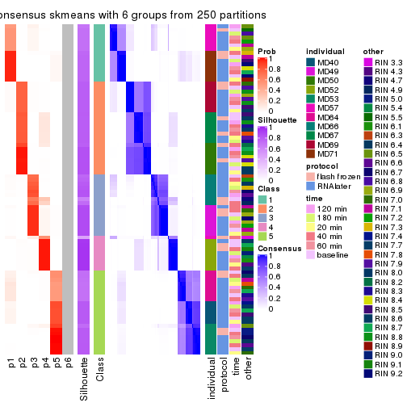</p>

</div>
</div>

Heatmaps for the membership of samples in all partitions to see how consistent they are:


<script>
$( function() {
	$( '#tabs-MAD-skmeans-membership-heatmap' ).tabs();
} );
</script>
<div id='tabs-MAD-skmeans-membership-heatmap'>
<ul>
<li><a href='#tab-MAD-skmeans-membership-heatmap-1'>k = 2</a></li>
<li><a href='#tab-MAD-skmeans-membership-heatmap-2'>k = 3</a></li>
<li><a href='#tab-MAD-skmeans-membership-heatmap-3'>k = 4</a></li>
<li><a href='#tab-MAD-skmeans-membership-heatmap-4'>k = 5</a></li>
<li><a href='#tab-MAD-skmeans-membership-heatmap-5'>k = 6</a></li>
</ul>
<div id='tab-MAD-skmeans-membership-heatmap-1'>
<pre><code class="r">membership_heatmap(res, k = 2)
</code></pre>

<p></p>

</div>
<div id='tab-MAD-skmeans-membership-heatmap-2'>
<pre><code class="r">membership_heatmap(res, k = 3)
</code></pre>

<p></p>

</div>
<div id='tab-MAD-skmeans-membership-heatmap-3'>
<pre><code class="r">membership_heatmap(res, k = 4)
</code></pre>

<p></p>

</div>
<div id='tab-MAD-skmeans-membership-heatmap-4'>
<pre><code class="r">membership_heatmap(res, k = 5)
</code></pre>

<p></p>

</div>
<div id='tab-MAD-skmeans-membership-heatmap-5'>
<pre><code class="r">membership_heatmap(res, k = 6)
</code></pre>

<p></p>

</div>
</div>

As soon as we have had the classes for columns, we can look for signatures
which are significantly different between classes which can be candidate marks
for certain classes. Following are the heatmaps for signatures.


Signature heatmaps where rows are scaled:


<script>
$( function() {
	$( '#tabs-MAD-skmeans-get-signatures' ).tabs();
} );
</script>
<div id='tabs-MAD-skmeans-get-signatures'>
<ul>
<li><a href='#tab-MAD-skmeans-get-signatures-1'>k = 2</a></li>
<li><a href='#tab-MAD-skmeans-get-signatures-2'>k = 3</a></li>
<li><a href='#tab-MAD-skmeans-get-signatures-3'>k = 4</a></li>
<li><a href='#tab-MAD-skmeans-get-signatures-4'>k = 5</a></li>
<li><a href='#tab-MAD-skmeans-get-signatures-5'>k = 6</a></li>
</ul>
<div id='tab-MAD-skmeans-get-signatures-1'>
<pre><code class="r">get_signatures(res, k = 2)
</code></pre>

<p></p>

</div>
<div id='tab-MAD-skmeans-get-signatures-2'>
<pre><code class="r">get_signatures(res, k = 3)
</code></pre>

<p></p>

</div>
<div id='tab-MAD-skmeans-get-signatures-3'>
<pre><code class="r">get_signatures(res, k = 4)
</code></pre>

<p></p>

</div>
<div id='tab-MAD-skmeans-get-signatures-4'>
<pre><code class="r">get_signatures(res, k = 5)
</code></pre>

<p></p>

</div>
<div id='tab-MAD-skmeans-get-signatures-5'>
<pre><code class="r">get_signatures(res, k = 6)
</code></pre>

<p></p>

</div>
</div>


Signature heatmaps where rows are not scaled:


<script>
$( function() {
	$( '#tabs-MAD-skmeans-get-signatures-no-scale' ).tabs();
} );
</script>
<div id='tabs-MAD-skmeans-get-signatures-no-scale'>
<ul>
<li><a href='#tab-MAD-skmeans-get-signatures-no-scale-1'>k = 2</a></li>
<li><a href='#tab-MAD-skmeans-get-signatures-no-scale-2'>k = 3</a></li>
<li><a href='#tab-MAD-skmeans-get-signatures-no-scale-3'>k = 4</a></li>
<li><a href='#tab-MAD-skmeans-get-signatures-no-scale-4'>k = 5</a></li>
<li><a href='#tab-MAD-skmeans-get-signatures-no-scale-5'>k = 6</a></li>
</ul>
<div id='tab-MAD-skmeans-get-signatures-no-scale-1'>
<pre><code class="r">get_signatures(res, k = 2, scale_rows = FALSE)
</code></pre>

<p></p>

</div>
<div id='tab-MAD-skmeans-get-signatures-no-scale-2'>
<pre><code class="r">get_signatures(res, k = 3, scale_rows = FALSE)
</code></pre>

<p></p>

</div>
<div id='tab-MAD-skmeans-get-signatures-no-scale-3'>
<pre><code class="r">get_signatures(res, k = 4, scale_rows = FALSE)
</code></pre>

<p></p>

</div>
<div id='tab-MAD-skmeans-get-signatures-no-scale-4'>
<pre><code class="r">get_signatures(res, k = 5, scale_rows = FALSE)
</code></pre>

<p></p>

</div>
<div id='tab-MAD-skmeans-get-signatures-no-scale-5'>
<pre><code class="r">get_signatures(res, k = 6, scale_rows = FALSE)
</code></pre>

<p></p>

</div>
</div>


Compare the overlap of signatures from different k:

```r
compare_signatures(res)
```


`get_signature()` returns a data frame invisibly. TO get the list of signatures, the function
call should be assigned to a variable explicitly. In following code, if `plot` argument is set
to `FALSE`, no heatmap is plotted while only the differential analysis is performed.

```r
# code only for demonstration
tb = get_signature(res, k = ..., plot = FALSE)
```

An example of the output of `tb` is:

```
#>   which_row         fdr    mean_1    mean_2 scaled_mean_1 scaled_mean_2 km
#> 1        38 0.042760348  8.373488  9.131774    -0.5533452     0.5164555  1
#> 2        40 0.018707592  7.106213  8.469186    -0.6173731     0.5762149  1
#> 3        55 0.019134737 10.221463 11.207825    -0.6159697     0.5749050  1
#> 4        59 0.006059896  5.921854  7.869574    -0.6899429     0.6439467  1
#> 5        60 0.018055526  8.928898 10.211722    -0.6204761     0.5791110  1
#> 6        98 0.009384629 15.714769 14.887706     0.6635654    -0.6193277  2
...
```

The columns in `tb` are:

1. `which_row`: row indices corresponding to the input matrix.
2. `fdr`: FDR for the differential test. 
3. `mean_x`: The mean value in group x.
4. `scaled_mean_x`: The mean value in group x after rows are scaled.
5. `km`: Row groups if k-means clustering is applied to rows.


UMAP plot which shows how samples are separated.


<script>
$( function() {
	$( '#tabs-MAD-skmeans-dimension-reduction' ).tabs();
} );
</script>
<div id='tabs-MAD-skmeans-dimension-reduction'>
<ul>
<li><a href='#tab-MAD-skmeans-dimension-reduction-1'>k = 2</a></li>
<li><a href='#tab-MAD-skmeans-dimension-reduction-2'>k = 3</a></li>
<li><a href='#tab-MAD-skmeans-dimension-reduction-3'>k = 4</a></li>
<li><a href='#tab-MAD-skmeans-dimension-reduction-4'>k = 5</a></li>
<li><a href='#tab-MAD-skmeans-dimension-reduction-5'>k = 6</a></li>
</ul>
<div id='tab-MAD-skmeans-dimension-reduction-1'>
<pre><code class="r">dimension_reduction(res, k = 2, method = &quot;UMAP&quot;)
</code></pre>

<p></p>

</div>
<div id='tab-MAD-skmeans-dimension-reduction-2'>
<pre><code class="r">dimension_reduction(res, k = 3, method = &quot;UMAP&quot;)
</code></pre>

<p></p>

</div>
<div id='tab-MAD-skmeans-dimension-reduction-3'>
<pre><code class="r">dimension_reduction(res, k = 4, method = &quot;UMAP&quot;)
</code></pre>

<p></p>

</div>
<div id='tab-MAD-skmeans-dimension-reduction-4'>
<pre><code class="r">dimension_reduction(res, k = 5, method = &quot;UMAP&quot;)
</code></pre>

<p></p>

</div>
<div id='tab-MAD-skmeans-dimension-reduction-5'>
<pre><code class="r">dimension_reduction(res, k = 6, method = &quot;UMAP&quot;)
</code></pre>

<p></p>

</div>
</div>


Following heatmap shows how subgroups are split when increasing `k`:

```r
collect_classes(res)
```


Test correlation between subgroups and known annotations. If the known
annotation is numeric, one-way ANOVA test is applied, and if the known
annotation is discrete, chi-squared contingency table test is applied.

```r
test_to_known_factors(res)
```

```
#>              n individual(p) protocol(p) time(p) other(p) k
#> MAD:skmeans 86      8.23e-13       0.492   0.975   0.7514 2
#> MAD:skmeans 74      1.38e-20       0.561   1.000   0.2053 3
#> MAD:skmeans 82      3.15e-34       0.766   1.000   0.0870 4
#> MAD:skmeans 85      1.15e-46       0.904   1.000   0.0206 5
#> MAD:skmeans 85      3.27e-49       0.977   1.000   0.0225 6
```


If matrix rows can be associated to genes, consider to use `functional_enrichment(res,
...)` to perform function enrichment for the signature genes. See [this vignette](http://bioconductor.org/packages/devel/bioc/vignettes/cola/inst/doc/functional_enrichment.html) for more detailed explanations.


 

---------------------------------------------------


### MAD:pam*


The object with results only for a single top-value method and a single partition method 
can be extracted as:

```r
res = res_list["MAD", "pam"]
# you can also extract it by
# res = res_list["MAD:pam"]
```

A summary of `res` and all the functions that can be applied to it:

```r
res
```

```
#> A 'ConsensusPartition' object with k = 2, 3, 4, 5, 6.
#>   On a matrix with 21168 rows and 86 columns.
#>   Top rows (1000, 2000, 3000, 4000, 5000) are extracted by 'MAD' method.
#>   Subgroups are detected by 'pam' method.
#>   Performed in total 1250 partitions by row resampling.
#>   Best k for subgroups seems to be 2.
#> 
#> Following methods can be applied to this 'ConsensusPartition' object:
#>  [1] "cola_report"             "collect_classes"         "collect_plots"          
#>  [4] "collect_stats"           "colnames"                "compare_signatures"     
#>  [7] "consensus_heatmap"       "dimension_reduction"     "functional_enrichment"  
#> [10] "get_anno_col"            "get_anno"                "get_classes"            
#> [13] "get_consensus"           "get_matrix"              "get_membership"         
#> [16] "get_param"               "get_signatures"          "get_stats"              
#> [19] "is_best_k"               "is_stable_k"             "membership_heatmap"     
#> [22] "ncol"                    "nrow"                    "plot_ecdf"              
#> [25] "rownames"                "select_partition_number" "show"                   
#> [28] "suggest_best_k"          "test_to_known_factors"
```

`collect_plots()` function collects all the plots made from `res` for all `k` (number of partitions)
into one single page to provide an easy and fast comparison between different `k`.

```r
collect_plots(res)
```


The plots are:

- The first row: a plot of the ECDF (empirical cumulative distribution
  function) curves of the consensus matrix for each `k` and the heatmap of
  predicted classes for each `k`.
- The second row: heatmaps of the consensus matrix for each `k`.
- The third row: heatmaps of the membership matrix for each `k`.
- The fouth row: heatmaps of the signatures for each `k`.

All the plots in panels can be made by individual functions and they are
plotted later in this section.

`select_partition_number()` produces several plots showing different
statistics for choosing "optimized" `k`. There are following statistics:

- ECDF curves of the consensus matrix for each `k`;
- 1-PAC. [The PAC
  score](https://en.wikipedia.org/wiki/Consensus_clustering#Over-interpretation_potential_of_consensus_clustering)
  measures the proportion of the ambiguous subgrouping.
- Mean silhouette score.
- Concordance. The mean probability of fiting the consensus class ids in all
  partitions.
- Area increased. Denote $A_k$ as the area under the ECDF curve for current
  `k`, the area increased is defined as $A_k - A_{k-1}$.
- Rand index. The percent of pairs of samples that are both in a same cluster
  or both are not in a same cluster in the partition of k and k-1.
- Jaccard index. The ratio of pairs of samples are both in a same cluster in
  the partition of k and k-1 and the pairs of samples are both in a same
  cluster in the partition k or k-1.

The detailed explanations of these statistics can be found in [the _cola_
vignette](http://bioconductor.org/packages/devel/bioc/vignettes/cola/inst/doc/cola.html#toc_13).

Generally speaking, lower PAC score, higher mean silhouette score or higher
concordance corresponds to better partition. Rand index and Jaccard index
measure how similar the current partition is compared to partition with `k-1`.
If they are too similar, we won't accept `k` is better than `k-1`.

```r
select_partition_number(res)
```


The numeric values for all these statistics can be obtained by `get_stats()`.

```r
get_stats(res)
```

```
#>   k 1-PAC mean_silhouette concordance area_increased  Rand Jaccard
#> 2 2 0.904           0.946       0.975         0.4881 0.512   0.512
#> 3 3 0.780           0.890       0.937         0.2669 0.880   0.765
#> 4 4 0.713           0.619       0.798         0.1312 0.878   0.702
#> 5 5 0.845           0.824       0.920         0.1004 0.862   0.594
#> 6 6 0.828           0.789       0.870         0.0456 0.962   0.839
```

`suggest_best_k()` suggests the best $k$ based on these statistics. The rules are as follows:

- All $k$ with Jaccard index larger than 0.95 are removed because increasing
  $k$ does not provide enough extra information. If all $k$ are removed, it is
  marked as no subgroup is detected.
- For all $k$ with 1-PAC score larger than 0.9, the maximal $k$ is taken as
  the best $k$, and other $k$ are marked as optional $k$.
- If it does not fit the second rule. The $k$ with the maximal vote of the
  highest 1-PAC score, highest mean silhouette, and highest concordance is
  taken as the best $k$.

```r
suggest_best_k(res)
```

```
#> [1] 2
```


Following shows the table of the partitions (You need to click the **show/hide
code output** link to see it). The membership matrix (columns with name `p*`)
is inferred by
[`clue::cl_consensus()`](https://www.rdocumentation.org/link/cl_consensus?package=clue)
function with the `SE` method. Basically the value in the membership matrix
represents the probability to belong to a certain group. The finall class
label for an item is determined with the group with highest probability it
belongs to.

In `get_classes()` function, the entropy is calculated from the membership
matrix and the silhouette score is calculated from the consensus matrix.


<script>
$( function() {
	$( '#tabs-MAD-pam-get-classes' ).tabs();
} );
</script>
<div id='tabs-MAD-pam-get-classes'>
<ul>
<li><a href='#tab-MAD-pam-get-classes-1'>k = 2</a></li>
<li><a href='#tab-MAD-pam-get-classes-2'>k = 3</a></li>
<li><a href='#tab-MAD-pam-get-classes-3'>k = 4</a></li>
<li><a href='#tab-MAD-pam-get-classes-4'>k = 5</a></li>
<li><a href='#tab-MAD-pam-get-classes-5'>k = 6</a></li>
</ul>

<div id='tab-MAD-pam-get-classes-1'>
<p><a id='tab-MAD-pam-get-classes-1-a' style='color:#0366d6' href='#'>show/hide code output</a></p>
<pre><code class="r">cbind(get_classes(res, k = 2), get_membership(res, k = 2))
</code></pre>

<pre><code>#&gt;           class entropy silhouette    p1    p2
#&gt; GSM614415     1  0.0000      0.967 1.000 0.000
#&gt; GSM614416     1  0.0000      0.967 1.000 0.000
#&gt; GSM614417     1  0.0000      0.967 1.000 0.000
#&gt; GSM614418     1  0.0000      0.967 1.000 0.000
#&gt; GSM614419     1  0.0000      0.967 1.000 0.000
#&gt; GSM614420     1  0.0000      0.967 1.000 0.000
#&gt; GSM614421     2  0.0376      0.976 0.004 0.996
#&gt; GSM614422     1  0.0376      0.964 0.996 0.004
#&gt; GSM614423     1  0.8443      0.652 0.728 0.272
#&gt; GSM614424     2  0.7376      0.747 0.208 0.792
#&gt; GSM614425     2  0.0376      0.976 0.004 0.996
#&gt; GSM614426     2  0.1633      0.961 0.024 0.976
#&gt; GSM614427     2  0.0000      0.978 0.000 1.000
#&gt; GSM614428     2  0.0000      0.978 0.000 1.000
#&gt; GSM614429     2  0.0000      0.978 0.000 1.000
#&gt; GSM614430     2  0.0000      0.978 0.000 1.000
#&gt; GSM614431     2  0.0000      0.978 0.000 1.000
#&gt; GSM614432     2  0.0000      0.978 0.000 1.000
#&gt; GSM614433     2  0.0000      0.978 0.000 1.000
#&gt; GSM614434     2  0.0000      0.978 0.000 1.000
#&gt; GSM614435     2  0.0000      0.978 0.000 1.000
#&gt; GSM614436     2  0.0000      0.978 0.000 1.000
#&gt; GSM614437     2  0.0000      0.978 0.000 1.000
#&gt; GSM614438     2  0.0000      0.978 0.000 1.000
#&gt; GSM614439     2  0.0000      0.978 0.000 1.000
#&gt; GSM614440     2  0.0000      0.978 0.000 1.000
#&gt; GSM614441     2  0.0000      0.978 0.000 1.000
#&gt; GSM614442     2  0.0000      0.978 0.000 1.000
#&gt; GSM614443     2  0.0000      0.978 0.000 1.000
#&gt; GSM614444     2  0.0000      0.978 0.000 1.000
#&gt; GSM614391     1  0.0000      0.967 1.000 0.000
#&gt; GSM614392     1  0.0000      0.967 1.000 0.000
#&gt; GSM614393     1  0.0000      0.967 1.000 0.000
#&gt; GSM614394     1  0.0000      0.967 1.000 0.000
#&gt; GSM614395     2  0.5059      0.878 0.112 0.888
#&gt; GSM614396     1  0.0000      0.967 1.000 0.000
#&gt; GSM614397     2  0.2043      0.956 0.032 0.968
#&gt; GSM614398     1  0.0000      0.967 1.000 0.000
#&gt; GSM614399     1  0.8386      0.659 0.732 0.268
#&gt; GSM614400     1  0.0000      0.967 1.000 0.000
#&gt; GSM614401     1  0.0000      0.967 1.000 0.000
#&gt; GSM614402     1  0.0938      0.958 0.988 0.012
#&gt; GSM614403     1  0.8955      0.576 0.688 0.312
#&gt; GSM614404     1  0.0000      0.967 1.000 0.000
#&gt; GSM614405     1  0.7745      0.708 0.772 0.228
#&gt; GSM614406     2  0.0000      0.978 0.000 1.000
#&gt; GSM614407     1  0.0000      0.967 1.000 0.000
#&gt; GSM614408     1  0.0000      0.967 1.000 0.000
#&gt; GSM614409     1  0.0000      0.967 1.000 0.000
#&gt; GSM614410     1  0.0000      0.967 1.000 0.000
#&gt; GSM614411     1  0.0000      0.967 1.000 0.000
#&gt; GSM614412     1  0.0376      0.964 0.996 0.004
#&gt; GSM614413     2  0.5519      0.859 0.128 0.872
#&gt; GSM614414     2  0.8016      0.687 0.244 0.756
#&gt; GSM614445     2  0.0000      0.978 0.000 1.000
#&gt; GSM614446     2  0.6887      0.785 0.184 0.816
#&gt; GSM614447     2  0.2236      0.951 0.036 0.964
#&gt; GSM614448     2  0.0376      0.976 0.004 0.996
#&gt; GSM614449     2  0.0000      0.978 0.000 1.000
#&gt; GSM614450     2  0.3114      0.934 0.056 0.944
#&gt; GSM614451     2  0.0000      0.978 0.000 1.000
#&gt; GSM614452     2  0.0000      0.978 0.000 1.000
#&gt; GSM614453     2  0.0000      0.978 0.000 1.000
#&gt; GSM614454     2  0.0000      0.978 0.000 1.000
#&gt; GSM614455     2  0.0000      0.978 0.000 1.000
#&gt; GSM614456     2  0.0000      0.978 0.000 1.000
#&gt; GSM614457     2  0.0000      0.978 0.000 1.000
#&gt; GSM614458     2  0.0000      0.978 0.000 1.000
#&gt; GSM614459     2  0.0000      0.978 0.000 1.000
#&gt; GSM614460     2  0.0000      0.978 0.000 1.000
#&gt; GSM614461     2  0.0000      0.978 0.000 1.000
#&gt; GSM614462     2  0.0000      0.978 0.000 1.000
#&gt; GSM614463     2  0.1633      0.961 0.024 0.976
#&gt; GSM614464     2  0.0000      0.978 0.000 1.000
#&gt; GSM614465     2  0.0000      0.978 0.000 1.000
#&gt; GSM614466     2  0.0000      0.978 0.000 1.000
#&gt; GSM614467     2  0.0000      0.978 0.000 1.000
#&gt; GSM614468     2  0.0000      0.978 0.000 1.000
#&gt; GSM614469     1  0.0000      0.967 1.000 0.000
#&gt; GSM614470     1  0.0000      0.967 1.000 0.000
#&gt; GSM614471     1  0.0000      0.967 1.000 0.000
#&gt; GSM614472     1  0.0000      0.967 1.000 0.000
#&gt; GSM614473     1  0.0000      0.967 1.000 0.000
#&gt; GSM614474     1  0.0000      0.967 1.000 0.000
#&gt; GSM614475     1  0.0000      0.967 1.000 0.000
#&gt; GSM614476     1  0.0000      0.967 1.000 0.000
</code></pre>

<script>
$('#tab-MAD-pam-get-classes-1-a').parent().next().next().hide();
$('#tab-MAD-pam-get-classes-1-a').click(function(){
  $('#tab-MAD-pam-get-classes-1-a').parent().next().next().toggle();
  return(false);
});
</script>
</div>

<div id='tab-MAD-pam-get-classes-2'>
<p><a id='tab-MAD-pam-get-classes-2-a' style='color:#0366d6' href='#'>show/hide code output</a></p>
<pre><code class="r">cbind(get_classes(res, k = 3), get_membership(res, k = 3))
</code></pre>

<pre><code>#&gt;           class entropy silhouette    p1    p2    p3
#&gt; GSM614415     1  0.0000      0.940 1.000 0.000 0.000
#&gt; GSM614416     1  0.0000      0.940 1.000 0.000 0.000
#&gt; GSM614417     1  0.0000      0.940 1.000 0.000 0.000
#&gt; GSM614418     1  0.0000      0.940 1.000 0.000 0.000
#&gt; GSM614419     1  0.0237      0.938 0.996 0.000 0.004
#&gt; GSM614420     1  0.0000      0.940 1.000 0.000 0.000
#&gt; GSM614421     2  0.3816      0.867 0.000 0.852 0.148
#&gt; GSM614422     1  0.5393      0.773 0.808 0.044 0.148
#&gt; GSM614423     1  0.7766      0.596 0.676 0.176 0.148
#&gt; GSM614424     2  0.7862      0.650 0.184 0.668 0.148
#&gt; GSM614425     2  0.3816      0.867 0.000 0.852 0.148
#&gt; GSM614426     2  0.4679      0.857 0.020 0.832 0.148
#&gt; GSM614427     2  0.3816      0.867 0.000 0.852 0.148
#&gt; GSM614428     2  0.3816      0.867 0.000 0.852 0.148
#&gt; GSM614429     2  0.0000      0.921 0.000 1.000 0.000
#&gt; GSM614430     2  0.0000      0.921 0.000 1.000 0.000
#&gt; GSM614431     2  0.0000      0.921 0.000 1.000 0.000
#&gt; GSM614432     2  0.0000      0.921 0.000 1.000 0.000
#&gt; GSM614433     2  0.0000      0.921 0.000 1.000 0.000
#&gt; GSM614434     2  0.0000      0.921 0.000 1.000 0.000
#&gt; GSM614435     2  0.0000      0.921 0.000 1.000 0.000
#&gt; GSM614436     2  0.0000      0.921 0.000 1.000 0.000
#&gt; GSM614437     3  0.3816      0.890 0.000 0.148 0.852
#&gt; GSM614438     3  0.2448      0.933 0.000 0.076 0.924
#&gt; GSM614439     3  0.2448      0.933 0.000 0.076 0.924
#&gt; GSM614440     3  0.0892      0.925 0.000 0.020 0.980
#&gt; GSM614441     3  0.1411      0.930 0.000 0.036 0.964
#&gt; GSM614442     3  0.3192      0.920 0.000 0.112 0.888
#&gt; GSM614443     3  0.3816      0.890 0.000 0.148 0.852
#&gt; GSM614444     3  0.3192      0.920 0.000 0.112 0.888
#&gt; GSM614391     1  0.0747      0.931 0.984 0.000 0.016
#&gt; GSM614392     1  0.0000      0.940 1.000 0.000 0.000
#&gt; GSM614393     1  0.0000      0.940 1.000 0.000 0.000
#&gt; GSM614394     1  0.0592      0.933 0.988 0.000 0.012
#&gt; GSM614395     3  0.0237      0.913 0.004 0.000 0.996
#&gt; GSM614396     1  0.3551      0.831 0.868 0.000 0.132
#&gt; GSM614397     2  0.5315      0.807 0.012 0.772 0.216
#&gt; GSM614398     1  0.3816      0.814 0.852 0.000 0.148
#&gt; GSM614399     1  0.5216      0.650 0.740 0.260 0.000
#&gt; GSM614400     1  0.0000      0.940 1.000 0.000 0.000
#&gt; GSM614401     1  0.0000      0.940 1.000 0.000 0.000
#&gt; GSM614402     1  0.0747      0.929 0.984 0.016 0.000
#&gt; GSM614403     1  0.8392      0.495 0.616 0.236 0.148
#&gt; GSM614404     1  0.0000      0.940 1.000 0.000 0.000
#&gt; GSM614405     1  0.6940      0.612 0.708 0.224 0.068
#&gt; GSM614406     2  0.2625      0.896 0.000 0.916 0.084
#&gt; GSM614407     1  0.0000      0.940 1.000 0.000 0.000
#&gt; GSM614408     1  0.0000      0.940 1.000 0.000 0.000
#&gt; GSM614409     1  0.0000      0.940 1.000 0.000 0.000
#&gt; GSM614410     1  0.0000      0.940 1.000 0.000 0.000
#&gt; GSM614411     1  0.0000      0.940 1.000 0.000 0.000
#&gt; GSM614412     1  0.1170      0.926 0.976 0.008 0.016
#&gt; GSM614413     2  0.5497      0.837 0.048 0.804 0.148
#&gt; GSM614414     2  0.7954      0.639 0.192 0.660 0.148
#&gt; GSM614445     2  0.3619      0.874 0.000 0.864 0.136
#&gt; GSM614446     2  0.5393      0.839 0.044 0.808 0.148
#&gt; GSM614447     2  0.4982      0.855 0.036 0.828 0.136
#&gt; GSM614448     2  0.3816      0.867 0.000 0.852 0.148
#&gt; GSM614449     2  0.3816      0.867 0.000 0.852 0.148
#&gt; GSM614450     2  0.4164      0.867 0.008 0.848 0.144
#&gt; GSM614451     3  0.0000      0.914 0.000 0.000 1.000
#&gt; GSM614452     3  0.0000      0.914 0.000 0.000 1.000
#&gt; GSM614453     2  0.0000      0.921 0.000 1.000 0.000
#&gt; GSM614454     2  0.0000      0.921 0.000 1.000 0.000
#&gt; GSM614455     2  0.0000      0.921 0.000 1.000 0.000
#&gt; GSM614456     2  0.0000      0.921 0.000 1.000 0.000
#&gt; GSM614457     2  0.0000      0.921 0.000 1.000 0.000
#&gt; GSM614458     2  0.0000      0.921 0.000 1.000 0.000
#&gt; GSM614459     2  0.0000      0.921 0.000 1.000 0.000
#&gt; GSM614460     2  0.0000      0.921 0.000 1.000 0.000
#&gt; GSM614461     2  0.0000      0.921 0.000 1.000 0.000
#&gt; GSM614462     2  0.0000      0.921 0.000 1.000 0.000
#&gt; GSM614463     2  0.0747      0.910 0.016 0.984 0.000
#&gt; GSM614464     2  0.0000      0.921 0.000 1.000 0.000
#&gt; GSM614465     2  0.0000      0.921 0.000 1.000 0.000
#&gt; GSM614466     2  0.0000      0.921 0.000 1.000 0.000
#&gt; GSM614467     2  0.0000      0.921 0.000 1.000 0.000
#&gt; GSM614468     2  0.0000      0.921 0.000 1.000 0.000
#&gt; GSM614469     1  0.0000      0.940 1.000 0.000 0.000
#&gt; GSM614470     1  0.0000      0.940 1.000 0.000 0.000
#&gt; GSM614471     1  0.0000      0.940 1.000 0.000 0.000
#&gt; GSM614472     1  0.0000      0.940 1.000 0.000 0.000
#&gt; GSM614473     1  0.0000      0.940 1.000 0.000 0.000
#&gt; GSM614474     1  0.0000      0.940 1.000 0.000 0.000
#&gt; GSM614475     1  0.0000      0.940 1.000 0.000 0.000
#&gt; GSM614476     1  0.0000      0.940 1.000 0.000 0.000
</code></pre>

<script>
$('#tab-MAD-pam-get-classes-2-a').parent().next().next().hide();
$('#tab-MAD-pam-get-classes-2-a').click(function(){
  $('#tab-MAD-pam-get-classes-2-a').parent().next().next().toggle();
  return(false);
});
</script>
</div>

<div id='tab-MAD-pam-get-classes-3'>
<p><a id='tab-MAD-pam-get-classes-3-a' style='color:#0366d6' href='#'>show/hide code output</a></p>
<pre><code class="r">cbind(get_classes(res, k = 4), get_membership(res, k = 4))
</code></pre>

<pre><code>#&gt;           class entropy silhouette    p1    p2    p3    p4
#&gt; GSM614415     1  0.0000      0.811 1.000 0.000 0.000 0.000
#&gt; GSM614416     1  0.0000      0.811 1.000 0.000 0.000 0.000
#&gt; GSM614417     1  0.0000      0.811 1.000 0.000 0.000 0.000
#&gt; GSM614418     1  0.0000      0.811 1.000 0.000 0.000 0.000
#&gt; GSM614419     1  0.0921      0.795 0.972 0.000 0.028 0.000
#&gt; GSM614420     1  0.0592      0.805 0.984 0.000 0.016 0.000
#&gt; GSM614421     2  0.4989      0.557 0.000 0.528 0.472 0.000
#&gt; GSM614422     3  0.0921      0.146 0.000 0.028 0.972 0.000
#&gt; GSM614423     3  0.1022      0.147 0.000 0.032 0.968 0.000
#&gt; GSM614424     3  0.4925     -0.454 0.000 0.428 0.572 0.000
#&gt; GSM614425     2  0.4989      0.557 0.000 0.528 0.472 0.000
#&gt; GSM614426     2  0.4998      0.539 0.000 0.512 0.488 0.000
#&gt; GSM614427     2  0.4989      0.557 0.000 0.528 0.472 0.000
#&gt; GSM614428     2  0.4989      0.557 0.000 0.528 0.472 0.000
#&gt; GSM614429     2  0.0000      0.862 0.000 1.000 0.000 0.000
#&gt; GSM614430     2  0.0000      0.862 0.000 1.000 0.000 0.000
#&gt; GSM614431     2  0.0000      0.862 0.000 1.000 0.000 0.000
#&gt; GSM614432     2  0.0000      0.862 0.000 1.000 0.000 0.000
#&gt; GSM614433     2  0.0336      0.857 0.008 0.992 0.000 0.000
#&gt; GSM614434     2  0.0000      0.862 0.000 1.000 0.000 0.000
#&gt; GSM614435     2  0.0000      0.862 0.000 1.000 0.000 0.000
#&gt; GSM614436     2  0.0000      0.862 0.000 1.000 0.000 0.000
#&gt; GSM614437     4  0.0000      0.886 0.000 0.000 0.000 1.000
#&gt; GSM614438     4  0.0000      0.886 0.000 0.000 0.000 1.000
#&gt; GSM614439     4  0.0000      0.886 0.000 0.000 0.000 1.000
#&gt; GSM614440     4  0.0000      0.886 0.000 0.000 0.000 1.000
#&gt; GSM614441     4  0.0000      0.886 0.000 0.000 0.000 1.000
#&gt; GSM614442     4  0.0000      0.886 0.000 0.000 0.000 1.000
#&gt; GSM614443     4  0.0000      0.886 0.000 0.000 0.000 1.000
#&gt; GSM614444     4  0.0000      0.886 0.000 0.000 0.000 1.000
#&gt; GSM614391     1  0.2081      0.777 0.916 0.000 0.084 0.000
#&gt; GSM614392     1  0.4585      0.080 0.668 0.000 0.332 0.000
#&gt; GSM614393     1  0.4331      0.240 0.712 0.000 0.288 0.000
#&gt; GSM614394     1  0.2081      0.781 0.916 0.000 0.084 0.000
#&gt; GSM614395     4  0.5040      0.650 0.008 0.000 0.364 0.628
#&gt; GSM614396     1  0.4543      0.461 0.676 0.000 0.324 0.000
#&gt; GSM614397     3  0.7669     -0.328 0.228 0.328 0.444 0.000
#&gt; GSM614398     3  0.4996     -0.267 0.484 0.000 0.516 0.000
#&gt; GSM614399     3  0.7464      0.245 0.296 0.208 0.496 0.000
#&gt; GSM614400     3  0.4989      0.489 0.472 0.000 0.528 0.000
#&gt; GSM614401     3  0.4989      0.489 0.472 0.000 0.528 0.000
#&gt; GSM614402     3  0.5396      0.474 0.464 0.012 0.524 0.000
#&gt; GSM614403     3  0.6078      0.150 0.152 0.164 0.684 0.000
#&gt; GSM614404     3  0.4989      0.489 0.472 0.000 0.528 0.000
#&gt; GSM614405     3  0.7564      0.155 0.328 0.208 0.464 0.000
#&gt; GSM614406     2  0.4284      0.745 0.000 0.764 0.224 0.012
#&gt; GSM614407     3  0.4992      0.482 0.476 0.000 0.524 0.000
#&gt; GSM614408     3  0.4992      0.483 0.476 0.000 0.524 0.000
#&gt; GSM614409     3  0.4989      0.482 0.472 0.000 0.528 0.000
#&gt; GSM614410     3  0.4989      0.489 0.472 0.000 0.528 0.000
#&gt; GSM614411     3  0.4989      0.489 0.472 0.000 0.528 0.000
#&gt; GSM614412     3  0.5378      0.332 0.448 0.012 0.540 0.000
#&gt; GSM614413     2  0.5220      0.598 0.008 0.568 0.424 0.000
#&gt; GSM614414     3  0.6042     -0.389 0.048 0.392 0.560 0.000
#&gt; GSM614445     2  0.2868      0.800 0.000 0.864 0.136 0.000
#&gt; GSM614446     2  0.4406      0.705 0.000 0.700 0.300 0.000
#&gt; GSM614447     2  0.4123      0.754 0.008 0.772 0.220 0.000
#&gt; GSM614448     2  0.4981      0.564 0.000 0.536 0.464 0.000
#&gt; GSM614449     2  0.4804      0.636 0.000 0.616 0.384 0.000
#&gt; GSM614450     2  0.4283      0.731 0.004 0.740 0.256 0.000
#&gt; GSM614451     4  0.4454      0.701 0.000 0.000 0.308 0.692
#&gt; GSM614452     4  0.4830      0.631 0.000 0.000 0.392 0.608
#&gt; GSM614453     2  0.0000      0.862 0.000 1.000 0.000 0.000
#&gt; GSM614454     2  0.0000      0.862 0.000 1.000 0.000 0.000
#&gt; GSM614455     2  0.0000      0.862 0.000 1.000 0.000 0.000
#&gt; GSM614456     2  0.0000      0.862 0.000 1.000 0.000 0.000
#&gt; GSM614457     2  0.0000      0.862 0.000 1.000 0.000 0.000
#&gt; GSM614458     2  0.0000      0.862 0.000 1.000 0.000 0.000
#&gt; GSM614459     2  0.0000      0.862 0.000 1.000 0.000 0.000
#&gt; GSM614460     2  0.0000      0.862 0.000 1.000 0.000 0.000
#&gt; GSM614461     2  0.0000      0.862 0.000 1.000 0.000 0.000
#&gt; GSM614462     2  0.0000      0.862 0.000 1.000 0.000 0.000
#&gt; GSM614463     2  0.0469      0.852 0.000 0.988 0.012 0.000
#&gt; GSM614464     2  0.0000      0.862 0.000 1.000 0.000 0.000
#&gt; GSM614465     2  0.0000      0.862 0.000 1.000 0.000 0.000
#&gt; GSM614466     2  0.0000      0.862 0.000 1.000 0.000 0.000
#&gt; GSM614467     2  0.0000      0.862 0.000 1.000 0.000 0.000
#&gt; GSM614468     2  0.0000      0.862 0.000 1.000 0.000 0.000
#&gt; GSM614469     3  0.4989      0.489 0.472 0.000 0.528 0.000
#&gt; GSM614470     3  0.4989      0.489 0.472 0.000 0.528 0.000
#&gt; GSM614471     3  0.4989      0.489 0.472 0.000 0.528 0.000
#&gt; GSM614472     3  0.4989      0.489 0.472 0.000 0.528 0.000
#&gt; GSM614473     3  0.4989      0.489 0.472 0.000 0.528 0.000
#&gt; GSM614474     3  0.4989      0.489 0.472 0.000 0.528 0.000
#&gt; GSM614475     3  0.4989      0.489 0.472 0.000 0.528 0.000
#&gt; GSM614476     3  0.4989      0.489 0.472 0.000 0.528 0.000
</code></pre>

<script>
$('#tab-MAD-pam-get-classes-3-a').parent().next().next().hide();
$('#tab-MAD-pam-get-classes-3-a').click(function(){
  $('#tab-MAD-pam-get-classes-3-a').parent().next().next().toggle();
  return(false);
});
</script>
</div>

<div id='tab-MAD-pam-get-classes-4'>
<p><a id='tab-MAD-pam-get-classes-4-a' style='color:#0366d6' href='#'>show/hide code output</a></p>
<pre><code class="r">cbind(get_classes(res, k = 5), get_membership(res, k = 5))
</code></pre>

<pre><code>#&gt;           class entropy silhouette    p1    p2    p3    p4    p5
#&gt; GSM614415     5  0.0290     0.8791 0.008 0.000 0.000 0.000 0.992
#&gt; GSM614416     5  0.0404     0.8823 0.012 0.000 0.000 0.000 0.988
#&gt; GSM614417     5  0.0404     0.8823 0.012 0.000 0.000 0.000 0.988
#&gt; GSM614418     5  0.0404     0.8823 0.012 0.000 0.000 0.000 0.988
#&gt; GSM614419     5  0.0404     0.8823 0.012 0.000 0.000 0.000 0.988
#&gt; GSM614420     5  0.0404     0.8823 0.012 0.000 0.000 0.000 0.988
#&gt; GSM614421     3  0.0880     0.8649 0.000 0.032 0.968 0.000 0.000
#&gt; GSM614422     3  0.1018     0.8574 0.016 0.016 0.968 0.000 0.000
#&gt; GSM614423     3  0.0880     0.8452 0.032 0.000 0.968 0.000 0.000
#&gt; GSM614424     3  0.0880     0.8649 0.000 0.032 0.968 0.000 0.000
#&gt; GSM614425     3  0.0880     0.8649 0.000 0.032 0.968 0.000 0.000
#&gt; GSM614426     3  0.0955     0.8636 0.004 0.028 0.968 0.000 0.000
#&gt; GSM614427     3  0.0880     0.8649 0.000 0.032 0.968 0.000 0.000
#&gt; GSM614428     3  0.0880     0.8649 0.000 0.032 0.968 0.000 0.000
#&gt; GSM614429     2  0.0000     0.9327 0.000 1.000 0.000 0.000 0.000
#&gt; GSM614430     2  0.0000     0.9327 0.000 1.000 0.000 0.000 0.000
#&gt; GSM614431     2  0.0000     0.9327 0.000 1.000 0.000 0.000 0.000
#&gt; GSM614432     2  0.0000     0.9327 0.000 1.000 0.000 0.000 0.000
#&gt; GSM614433     2  0.0000     0.9327 0.000 1.000 0.000 0.000 0.000
#&gt; GSM614434     2  0.0000     0.9327 0.000 1.000 0.000 0.000 0.000
#&gt; GSM614435     2  0.0000     0.9327 0.000 1.000 0.000 0.000 0.000
#&gt; GSM614436     2  0.0000     0.9327 0.000 1.000 0.000 0.000 0.000
#&gt; GSM614437     4  0.0000     1.0000 0.000 0.000 0.000 1.000 0.000
#&gt; GSM614438     4  0.0000     1.0000 0.000 0.000 0.000 1.000 0.000
#&gt; GSM614439     4  0.0000     1.0000 0.000 0.000 0.000 1.000 0.000
#&gt; GSM614440     4  0.0000     1.0000 0.000 0.000 0.000 1.000 0.000
#&gt; GSM614441     4  0.0000     1.0000 0.000 0.000 0.000 1.000 0.000
#&gt; GSM614442     4  0.0000     1.0000 0.000 0.000 0.000 1.000 0.000
#&gt; GSM614443     4  0.0000     1.0000 0.000 0.000 0.000 1.000 0.000
#&gt; GSM614444     4  0.0000     1.0000 0.000 0.000 0.000 1.000 0.000
#&gt; GSM614391     5  0.2806     0.8054 0.152 0.000 0.004 0.000 0.844
#&gt; GSM614392     1  0.4171     0.3047 0.604 0.000 0.000 0.000 0.396
#&gt; GSM614393     5  0.3999     0.4888 0.344 0.000 0.000 0.000 0.656
#&gt; GSM614394     5  0.2536     0.8252 0.128 0.000 0.004 0.000 0.868
#&gt; GSM614395     3  0.4206     0.6210 0.000 0.000 0.696 0.288 0.016
#&gt; GSM614396     5  0.4605     0.6798 0.076 0.000 0.192 0.000 0.732
#&gt; GSM614397     3  0.3639     0.7881 0.000 0.076 0.824 0.000 0.100
#&gt; GSM614398     3  0.3480     0.6247 0.000 0.000 0.752 0.000 0.248
#&gt; GSM614399     1  0.2891     0.7120 0.824 0.176 0.000 0.000 0.000
#&gt; GSM614400     1  0.0000     0.8903 1.000 0.000 0.000 0.000 0.000
#&gt; GSM614401     1  0.0000     0.8903 1.000 0.000 0.000 0.000 0.000
#&gt; GSM614402     1  0.0609     0.8795 0.980 0.020 0.000 0.000 0.000
#&gt; GSM614403     1  0.6012     0.1193 0.484 0.116 0.400 0.000 0.000
#&gt; GSM614404     1  0.0000     0.8903 1.000 0.000 0.000 0.000 0.000
#&gt; GSM614405     1  0.5295     0.5471 0.672 0.200 0.128 0.000 0.000
#&gt; GSM614406     2  0.4824    -0.0174 0.000 0.512 0.468 0.020 0.000
#&gt; GSM614407     1  0.1485     0.8734 0.948 0.000 0.032 0.000 0.020
#&gt; GSM614408     1  0.1668     0.8687 0.940 0.000 0.032 0.000 0.028
#&gt; GSM614409     1  0.2370     0.8438 0.904 0.000 0.040 0.000 0.056
#&gt; GSM614410     1  0.0880     0.8795 0.968 0.000 0.032 0.000 0.000
#&gt; GSM614411     1  0.1041     0.8788 0.964 0.000 0.032 0.000 0.004
#&gt; GSM614412     1  0.5571     0.5820 0.668 0.008 0.148 0.000 0.176
#&gt; GSM614413     3  0.2329     0.7803 0.000 0.124 0.876 0.000 0.000
#&gt; GSM614414     3  0.1251     0.8461 0.008 0.036 0.956 0.000 0.000
#&gt; GSM614445     2  0.2516     0.7926 0.000 0.860 0.140 0.000 0.000
#&gt; GSM614446     2  0.4464     0.3059 0.008 0.584 0.408 0.000 0.000
#&gt; GSM614447     2  0.4360     0.5639 0.024 0.692 0.284 0.000 0.000
#&gt; GSM614448     3  0.1544     0.8485 0.000 0.068 0.932 0.000 0.000
#&gt; GSM614449     3  0.3966     0.4858 0.000 0.336 0.664 0.000 0.000
#&gt; GSM614450     2  0.4182     0.4413 0.004 0.644 0.352 0.000 0.000
#&gt; GSM614451     3  0.4088     0.4938 0.000 0.000 0.632 0.368 0.000
#&gt; GSM614452     3  0.3534     0.6724 0.000 0.000 0.744 0.256 0.000
#&gt; GSM614453     2  0.0000     0.9327 0.000 1.000 0.000 0.000 0.000
#&gt; GSM614454     2  0.0000     0.9327 0.000 1.000 0.000 0.000 0.000
#&gt; GSM614455     2  0.0000     0.9327 0.000 1.000 0.000 0.000 0.000
#&gt; GSM614456     2  0.0000     0.9327 0.000 1.000 0.000 0.000 0.000
#&gt; GSM614457     2  0.0000     0.9327 0.000 1.000 0.000 0.000 0.000
#&gt; GSM614458     2  0.0000     0.9327 0.000 1.000 0.000 0.000 0.000
#&gt; GSM614459     2  0.0000     0.9327 0.000 1.000 0.000 0.000 0.000
#&gt; GSM614460     2  0.0000     0.9327 0.000 1.000 0.000 0.000 0.000
#&gt; GSM614461     2  0.0000     0.9327 0.000 1.000 0.000 0.000 0.000
#&gt; GSM614462     2  0.0000     0.9327 0.000 1.000 0.000 0.000 0.000
#&gt; GSM614463     2  0.0404     0.9219 0.012 0.988 0.000 0.000 0.000
#&gt; GSM614464     2  0.0000     0.9327 0.000 1.000 0.000 0.000 0.000
#&gt; GSM614465     2  0.0000     0.9327 0.000 1.000 0.000 0.000 0.000
#&gt; GSM614466     2  0.0000     0.9327 0.000 1.000 0.000 0.000 0.000
#&gt; GSM614467     2  0.0000     0.9327 0.000 1.000 0.000 0.000 0.000
#&gt; GSM614468     2  0.0000     0.9327 0.000 1.000 0.000 0.000 0.000
#&gt; GSM614469     1  0.0000     0.8903 1.000 0.000 0.000 0.000 0.000
#&gt; GSM614470     1  0.0000     0.8903 1.000 0.000 0.000 0.000 0.000
#&gt; GSM614471     1  0.0000     0.8903 1.000 0.000 0.000 0.000 0.000
#&gt; GSM614472     1  0.0000     0.8903 1.000 0.000 0.000 0.000 0.000
#&gt; GSM614473     1  0.0000     0.8903 1.000 0.000 0.000 0.000 0.000
#&gt; GSM614474     1  0.0000     0.8903 1.000 0.000 0.000 0.000 0.000
#&gt; GSM614475     1  0.0000     0.8903 1.000 0.000 0.000 0.000 0.000
#&gt; GSM614476     1  0.0000     0.8903 1.000 0.000 0.000 0.000 0.000
</code></pre>

<script>
$('#tab-MAD-pam-get-classes-4-a').parent().next().next().hide();
$('#tab-MAD-pam-get-classes-4-a').click(function(){
  $('#tab-MAD-pam-get-classes-4-a').parent().next().next().toggle();
  return(false);
});
</script>
</div>

<div id='tab-MAD-pam-get-classes-5'>
<p><a id='tab-MAD-pam-get-classes-5-a' style='color:#0366d6' href='#'>show/hide code output</a></p>
<pre><code class="r">cbind(get_classes(res, k = 6), get_membership(res, k = 6))
</code></pre>

<pre><code>#&gt;           class entropy silhouette    p1    p2    p3    p4    p5    p6
#&gt; GSM614415     5  0.0000      0.876 0.000 0.000 0.000 0.000 1.000 0.000
#&gt; GSM614416     5  0.0000      0.876 0.000 0.000 0.000 0.000 1.000 0.000
#&gt; GSM614417     5  0.0000      0.876 0.000 0.000 0.000 0.000 1.000 0.000
#&gt; GSM614418     5  0.0000      0.876 0.000 0.000 0.000 0.000 1.000 0.000
#&gt; GSM614419     5  0.0000      0.876 0.000 0.000 0.000 0.000 1.000 0.000
#&gt; GSM614420     5  0.0000      0.876 0.000 0.000 0.000 0.000 1.000 0.000
#&gt; GSM614421     3  0.0000      0.872 0.000 0.000 1.000 0.000 0.000 0.000
#&gt; GSM614422     3  0.0000      0.872 0.000 0.000 1.000 0.000 0.000 0.000
#&gt; GSM614423     3  0.0146      0.869 0.004 0.000 0.996 0.000 0.000 0.000
#&gt; GSM614424     3  0.0000      0.872 0.000 0.000 1.000 0.000 0.000 0.000
#&gt; GSM614425     3  0.0000      0.872 0.000 0.000 1.000 0.000 0.000 0.000
#&gt; GSM614426     3  0.0000      0.872 0.000 0.000 1.000 0.000 0.000 0.000
#&gt; GSM614427     3  0.0000      0.872 0.000 0.000 1.000 0.000 0.000 0.000
#&gt; GSM614428     3  0.0000      0.872 0.000 0.000 1.000 0.000 0.000 0.000
#&gt; GSM614429     2  0.0291      0.904 0.000 0.992 0.004 0.000 0.000 0.004
#&gt; GSM614430     2  0.0405      0.904 0.000 0.988 0.004 0.000 0.000 0.008
#&gt; GSM614431     2  0.0146      0.905 0.000 0.996 0.004 0.000 0.000 0.000
#&gt; GSM614432     2  0.0146      0.905 0.000 0.996 0.004 0.000 0.000 0.000
#&gt; GSM614433     2  0.0146      0.905 0.000 0.996 0.004 0.000 0.000 0.000
#&gt; GSM614434     2  0.0291      0.904 0.000 0.992 0.004 0.000 0.000 0.004
#&gt; GSM614435     2  0.0146      0.905 0.000 0.996 0.004 0.000 0.000 0.000
#&gt; GSM614436     2  0.0146      0.905 0.000 0.996 0.004 0.000 0.000 0.000
#&gt; GSM614437     4  0.0000      1.000 0.000 0.000 0.000 1.000 0.000 0.000
#&gt; GSM614438     4  0.0000      1.000 0.000 0.000 0.000 1.000 0.000 0.000
#&gt; GSM614439     4  0.0000      1.000 0.000 0.000 0.000 1.000 0.000 0.000
#&gt; GSM614440     4  0.0000      1.000 0.000 0.000 0.000 1.000 0.000 0.000
#&gt; GSM614441     4  0.0000      1.000 0.000 0.000 0.000 1.000 0.000 0.000
#&gt; GSM614442     4  0.0000      1.000 0.000 0.000 0.000 1.000 0.000 0.000
#&gt; GSM614443     4  0.0000      1.000 0.000 0.000 0.000 1.000 0.000 0.000
#&gt; GSM614444     4  0.0000      1.000 0.000 0.000 0.000 1.000 0.000 0.000
#&gt; GSM614391     5  0.4178      0.778 0.092 0.000 0.004 0.000 0.748 0.156
#&gt; GSM614392     1  0.5537     -0.123 0.476 0.000 0.000 0.000 0.388 0.136
#&gt; GSM614393     5  0.4871      0.673 0.212 0.000 0.000 0.000 0.656 0.132
#&gt; GSM614394     5  0.4002      0.789 0.096 0.000 0.004 0.000 0.768 0.132
#&gt; GSM614395     3  0.4493      0.722 0.000 0.000 0.720 0.144 0.004 0.132
#&gt; GSM614396     5  0.5719      0.570 0.032 0.000 0.236 0.000 0.600 0.132
#&gt; GSM614397     3  0.4273      0.740 0.000 0.036 0.768 0.000 0.064 0.132
#&gt; GSM614398     3  0.4845      0.531 0.000 0.000 0.660 0.000 0.208 0.132
#&gt; GSM614399     1  0.4442      0.644 0.712 0.120 0.000 0.000 0.000 0.168
#&gt; GSM614400     1  0.2416      0.750 0.844 0.000 0.000 0.000 0.000 0.156
#&gt; GSM614401     1  0.2416      0.750 0.844 0.000 0.000 0.000 0.000 0.156
#&gt; GSM614402     1  0.2737      0.745 0.832 0.004 0.004 0.000 0.000 0.160
#&gt; GSM614403     1  0.7132      0.269 0.416 0.116 0.296 0.000 0.000 0.172
#&gt; GSM614404     1  0.2454      0.749 0.840 0.000 0.000 0.000 0.000 0.160
#&gt; GSM614405     1  0.6084      0.535 0.612 0.116 0.116 0.000 0.000 0.156
#&gt; GSM614406     2  0.5978      0.345 0.000 0.536 0.284 0.024 0.000 0.156
#&gt; GSM614407     6  0.3782      0.793 0.360 0.000 0.000 0.000 0.004 0.636
#&gt; GSM614408     6  0.3782      0.793 0.360 0.000 0.000 0.000 0.004 0.636
#&gt; GSM614409     6  0.3905      0.794 0.356 0.000 0.004 0.000 0.004 0.636
#&gt; GSM614410     6  0.3659      0.792 0.364 0.000 0.000 0.000 0.000 0.636
#&gt; GSM614411     6  0.3659      0.792 0.364 0.000 0.000 0.000 0.000 0.636
#&gt; GSM614412     6  0.5104      0.754 0.260 0.000 0.044 0.000 0.048 0.648
#&gt; GSM614413     6  0.3874      0.439 0.000 0.008 0.356 0.000 0.000 0.636
#&gt; GSM614414     6  0.3659      0.431 0.000 0.000 0.364 0.000 0.000 0.636
#&gt; GSM614445     2  0.4687      0.668 0.000 0.684 0.136 0.000 0.000 0.180
#&gt; GSM614446     2  0.5708      0.284 0.004 0.488 0.360 0.000 0.000 0.148
#&gt; GSM614447     2  0.5887      0.482 0.024 0.564 0.248 0.000 0.000 0.164
#&gt; GSM614448     3  0.0458      0.862 0.000 0.016 0.984 0.000 0.000 0.000
#&gt; GSM614449     3  0.3161      0.634 0.000 0.216 0.776 0.000 0.000 0.008
#&gt; GSM614450     2  0.4266      0.474 0.004 0.620 0.356 0.000 0.000 0.020
#&gt; GSM614451     3  0.3619      0.582 0.000 0.004 0.680 0.316 0.000 0.000
#&gt; GSM614452     3  0.2597      0.770 0.000 0.000 0.824 0.176 0.000 0.000
#&gt; GSM614453     2  0.1349      0.903 0.000 0.940 0.004 0.000 0.000 0.056
#&gt; GSM614454     2  0.0603      0.905 0.000 0.980 0.004 0.000 0.000 0.016
#&gt; GSM614455     2  0.1285      0.903 0.000 0.944 0.004 0.000 0.000 0.052
#&gt; GSM614456     2  0.1010      0.905 0.000 0.960 0.004 0.000 0.000 0.036
#&gt; GSM614457     2  0.0865      0.904 0.000 0.964 0.000 0.000 0.000 0.036
#&gt; GSM614458     2  0.0405      0.904 0.000 0.988 0.004 0.000 0.000 0.008
#&gt; GSM614459     2  0.0363      0.905 0.000 0.988 0.000 0.000 0.000 0.012
#&gt; GSM614460     2  0.0405      0.904 0.000 0.988 0.004 0.000 0.000 0.008
#&gt; GSM614461     2  0.1387      0.898 0.000 0.932 0.000 0.000 0.000 0.068
#&gt; GSM614462     2  0.1387      0.898 0.000 0.932 0.000 0.000 0.000 0.068
#&gt; GSM614463     2  0.1913      0.887 0.012 0.908 0.000 0.000 0.000 0.080
#&gt; GSM614464     2  0.1387      0.898 0.000 0.932 0.000 0.000 0.000 0.068
#&gt; GSM614465     2  0.1387      0.898 0.000 0.932 0.000 0.000 0.000 0.068
#&gt; GSM614466     2  0.1387      0.898 0.000 0.932 0.000 0.000 0.000 0.068
#&gt; GSM614467     2  0.1387      0.898 0.000 0.932 0.000 0.000 0.000 0.068
#&gt; GSM614468     2  0.1387      0.898 0.000 0.932 0.000 0.000 0.000 0.068
#&gt; GSM614469     1  0.0000      0.777 1.000 0.000 0.000 0.000 0.000 0.000
#&gt; GSM614470     1  0.0000      0.777 1.000 0.000 0.000 0.000 0.000 0.000
#&gt; GSM614471     1  0.0000      0.777 1.000 0.000 0.000 0.000 0.000 0.000
#&gt; GSM614472     1  0.0000      0.777 1.000 0.000 0.000 0.000 0.000 0.000
#&gt; GSM614473     1  0.0000      0.777 1.000 0.000 0.000 0.000 0.000 0.000
#&gt; GSM614474     1  0.0000      0.777 1.000 0.000 0.000 0.000 0.000 0.000
#&gt; GSM614475     1  0.0000      0.777 1.000 0.000 0.000 0.000 0.000 0.000
#&gt; GSM614476     1  0.0000      0.777 1.000 0.000 0.000 0.000 0.000 0.000
</code></pre>

<script>
$('#tab-MAD-pam-get-classes-5-a').parent().next().next().hide();
$('#tab-MAD-pam-get-classes-5-a').click(function(){
  $('#tab-MAD-pam-get-classes-5-a').parent().next().next().toggle();
  return(false);
});
</script>
</div>
</div>

Heatmaps for the consensus matrix. It visualizes the probability of two
samples to be in a same group.


<script>
$( function() {
	$( '#tabs-MAD-pam-consensus-heatmap' ).tabs();
} );
</script>
<div id='tabs-MAD-pam-consensus-heatmap'>
<ul>
<li><a href='#tab-MAD-pam-consensus-heatmap-1'>k = 2</a></li>
<li><a href='#tab-MAD-pam-consensus-heatmap-2'>k = 3</a></li>
<li><a href='#tab-MAD-pam-consensus-heatmap-3'>k = 4</a></li>
<li><a href='#tab-MAD-pam-consensus-heatmap-4'>k = 5</a></li>
<li><a href='#tab-MAD-pam-consensus-heatmap-5'>k = 6</a></li>
</ul>
<div id='tab-MAD-pam-consensus-heatmap-1'>
<pre><code class="r">consensus_heatmap(res, k = 2)
</code></pre>

<p></p>

</div>
<div id='tab-MAD-pam-consensus-heatmap-2'>
<pre><code class="r">consensus_heatmap(res, k = 3)
</code></pre>

<p></p>

</div>
<div id='tab-MAD-pam-consensus-heatmap-3'>
<pre><code class="r">consensus_heatmap(res, k = 4)
</code></pre>

<p></p>

</div>
<div id='tab-MAD-pam-consensus-heatmap-4'>
<pre><code class="r">consensus_heatmap(res, k = 5)
</code></pre>

<p></p>

</div>
<div id='tab-MAD-pam-consensus-heatmap-5'>
<pre><code class="r">consensus_heatmap(res, k = 6)
</code></pre>

<p></p>

</div>
</div>

Heatmaps for the membership of samples in all partitions to see how consistent they are:


<script>
$( function() {
	$( '#tabs-MAD-pam-membership-heatmap' ).tabs();
} );
</script>
<div id='tabs-MAD-pam-membership-heatmap'>
<ul>
<li><a href='#tab-MAD-pam-membership-heatmap-1'>k = 2</a></li>
<li><a href='#tab-MAD-pam-membership-heatmap-2'>k = 3</a></li>
<li><a href='#tab-MAD-pam-membership-heatmap-3'>k = 4</a></li>
<li><a href='#tab-MAD-pam-membership-heatmap-4'>k = 5</a></li>
<li><a href='#tab-MAD-pam-membership-heatmap-5'>k = 6</a></li>
</ul>
<div id='tab-MAD-pam-membership-heatmap-1'>
<pre><code class="r">membership_heatmap(res, k = 2)
</code></pre>

<p>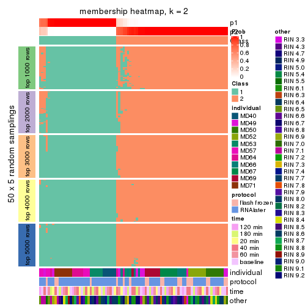</p>

</div>
<div id='tab-MAD-pam-membership-heatmap-2'>
<pre><code class="r">membership_heatmap(res, k = 3)
</code></pre>

<p></p>

</div>
<div id='tab-MAD-pam-membership-heatmap-3'>
<pre><code class="r">membership_heatmap(res, k = 4)
</code></pre>

<p></p>

</div>
<div id='tab-MAD-pam-membership-heatmap-4'>
<pre><code class="r">membership_heatmap(res, k = 5)
</code></pre>

<p></p>

</div>
<div id='tab-MAD-pam-membership-heatmap-5'>
<pre><code class="r">membership_heatmap(res, k = 6)
</code></pre>

<p></p>

</div>
</div>

As soon as we have had the classes for columns, we can look for signatures
which are significantly different between classes which can be candidate marks
for certain classes. Following are the heatmaps for signatures.


Signature heatmaps where rows are scaled:


<script>
$( function() {
	$( '#tabs-MAD-pam-get-signatures' ).tabs();
} );
</script>
<div id='tabs-MAD-pam-get-signatures'>
<ul>
<li><a href='#tab-MAD-pam-get-signatures-1'>k = 2</a></li>
<li><a href='#tab-MAD-pam-get-signatures-2'>k = 3</a></li>
<li><a href='#tab-MAD-pam-get-signatures-3'>k = 4</a></li>
<li><a href='#tab-MAD-pam-get-signatures-4'>k = 5</a></li>
<li><a href='#tab-MAD-pam-get-signatures-5'>k = 6</a></li>
</ul>
<div id='tab-MAD-pam-get-signatures-1'>
<pre><code class="r">get_signatures(res, k = 2)
</code></pre>

<p></p>

</div>
<div id='tab-MAD-pam-get-signatures-2'>
<pre><code class="r">get_signatures(res, k = 3)
</code></pre>

<p></p>

</div>
<div id='tab-MAD-pam-get-signatures-3'>
<pre><code class="r">get_signatures(res, k = 4)
</code></pre>

<p></p>

</div>
<div id='tab-MAD-pam-get-signatures-4'>
<pre><code class="r">get_signatures(res, k = 5)
</code></pre>

<p></p>

</div>
<div id='tab-MAD-pam-get-signatures-5'>
<pre><code class="r">get_signatures(res, k = 6)
</code></pre>

<p></p>

</div>
</div>


Signature heatmaps where rows are not scaled:


<script>
$( function() {
	$( '#tabs-MAD-pam-get-signatures-no-scale' ).tabs();
} );
</script>
<div id='tabs-MAD-pam-get-signatures-no-scale'>
<ul>
<li><a href='#tab-MAD-pam-get-signatures-no-scale-1'>k = 2</a></li>
<li><a href='#tab-MAD-pam-get-signatures-no-scale-2'>k = 3</a></li>
<li><a href='#tab-MAD-pam-get-signatures-no-scale-3'>k = 4</a></li>
<li><a href='#tab-MAD-pam-get-signatures-no-scale-4'>k = 5</a></li>
<li><a href='#tab-MAD-pam-get-signatures-no-scale-5'>k = 6</a></li>
</ul>
<div id='tab-MAD-pam-get-signatures-no-scale-1'>
<pre><code class="r">get_signatures(res, k = 2, scale_rows = FALSE)
</code></pre>

<p></p>

</div>
<div id='tab-MAD-pam-get-signatures-no-scale-2'>
<pre><code class="r">get_signatures(res, k = 3, scale_rows = FALSE)
</code></pre>

<p></p>

</div>
<div id='tab-MAD-pam-get-signatures-no-scale-3'>
<pre><code class="r">get_signatures(res, k = 4, scale_rows = FALSE)
</code></pre>

<p></p>

</div>
<div id='tab-MAD-pam-get-signatures-no-scale-4'>
<pre><code class="r">get_signatures(res, k = 5, scale_rows = FALSE)
</code></pre>

<p></p>

</div>
<div id='tab-MAD-pam-get-signatures-no-scale-5'>
<pre><code class="r">get_signatures(res, k = 6, scale_rows = FALSE)
</code></pre>

<p></p>

</div>
</div>


Compare the overlap of signatures from different k:

```r
compare_signatures(res)
```


`get_signature()` returns a data frame invisibly. TO get the list of signatures, the function
call should be assigned to a variable explicitly. In following code, if `plot` argument is set
to `FALSE`, no heatmap is plotted while only the differential analysis is performed.

```r
# code only for demonstration
tb = get_signature(res, k = ..., plot = FALSE)
```

An example of the output of `tb` is:

```
#>   which_row         fdr    mean_1    mean_2 scaled_mean_1 scaled_mean_2 km
#> 1        38 0.042760348  8.373488  9.131774    -0.5533452     0.5164555  1
#> 2        40 0.018707592  7.106213  8.469186    -0.6173731     0.5762149  1
#> 3        55 0.019134737 10.221463 11.207825    -0.6159697     0.5749050  1
#> 4        59 0.006059896  5.921854  7.869574    -0.6899429     0.6439467  1
#> 5        60 0.018055526  8.928898 10.211722    -0.6204761     0.5791110  1
#> 6        98 0.009384629 15.714769 14.887706     0.6635654    -0.6193277  2
...
```

The columns in `tb` are:

1. `which_row`: row indices corresponding to the input matrix.
2. `fdr`: FDR for the differential test. 
3. `mean_x`: The mean value in group x.
4. `scaled_mean_x`: The mean value in group x after rows are scaled.
5. `km`: Row groups if k-means clustering is applied to rows.


UMAP plot which shows how samples are separated.


<script>
$( function() {
	$( '#tabs-MAD-pam-dimension-reduction' ).tabs();
} );
</script>
<div id='tabs-MAD-pam-dimension-reduction'>
<ul>
<li><a href='#tab-MAD-pam-dimension-reduction-1'>k = 2</a></li>
<li><a href='#tab-MAD-pam-dimension-reduction-2'>k = 3</a></li>
<li><a href='#tab-MAD-pam-dimension-reduction-3'>k = 4</a></li>
<li><a href='#tab-MAD-pam-dimension-reduction-4'>k = 5</a></li>
<li><a href='#tab-MAD-pam-dimension-reduction-5'>k = 6</a></li>
</ul>
<div id='tab-MAD-pam-dimension-reduction-1'>
<pre><code class="r">dimension_reduction(res, k = 2, method = &quot;UMAP&quot;)
</code></pre>

<p></p>

</div>
<div id='tab-MAD-pam-dimension-reduction-2'>
<pre><code class="r">dimension_reduction(res, k = 3, method = &quot;UMAP&quot;)
</code></pre>

<p></p>

</div>
<div id='tab-MAD-pam-dimension-reduction-3'>
<pre><code class="r">dimension_reduction(res, k = 4, method = &quot;UMAP&quot;)
</code></pre>

<p></p>

</div>
<div id='tab-MAD-pam-dimension-reduction-4'>
<pre><code class="r">dimension_reduction(res, k = 5, method = &quot;UMAP&quot;)
</code></pre>

<p></p>

</div>
<div id='tab-MAD-pam-dimension-reduction-5'>
<pre><code class="r">dimension_reduction(res, k = 6, method = &quot;UMAP&quot;)
</code></pre>

<p></p>

</div>
</div>


Following heatmap shows how subgroups are split when increasing `k`:

```r
collect_classes(res)
```

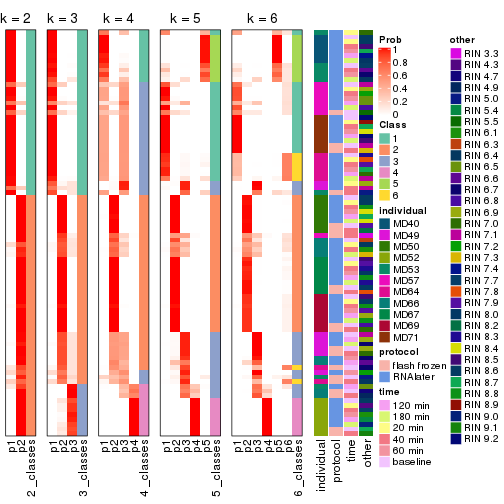


Test correlation between subgroups and known annotations. If the known
annotation is numeric, one-way ANOVA test is applied, and if the known
annotation is discrete, chi-squared contingency table test is applied.

```r
test_to_known_factors(res)
```

```
#>          n individual(p) protocol(p) time(p) other(p) k
#> MAD:pam 86      7.09e-10      0.0586   0.889   0.8787 2
#> MAD:pam 85      3.34e-17      0.1026   0.991   0.1653 3
#> MAD:pam 56      2.71e-12      0.1733   0.996   0.3924 4
#> MAD:pam 78      8.88e-36      0.0861   1.000   0.0444 5
#> MAD:pam 78      1.05e-48      0.1863   1.000   0.1000 6
```


If matrix rows can be associated to genes, consider to use `functional_enrichment(res,
...)` to perform function enrichment for the signature genes. See [this vignette](http://bioconductor.org/packages/devel/bioc/vignettes/cola/inst/doc/functional_enrichment.html) for more detailed explanations.


 

---------------------------------------------------


### MAD:mclust*


The object with results only for a single top-value method and a single partition method 
can be extracted as:

```r
res = res_list["MAD", "mclust"]
# you can also extract it by
# res = res_list["MAD:mclust"]
```

A summary of `res` and all the functions that can be applied to it:

```r
res
```

```
#> A 'ConsensusPartition' object with k = 2, 3, 4, 5, 6.
#>   On a matrix with 21168 rows and 86 columns.
#>   Top rows (1000, 2000, 3000, 4000, 5000) are extracted by 'MAD' method.
#>   Subgroups are detected by 'mclust' method.
#>   Performed in total 1250 partitions by row resampling.
#>   Best k for subgroups seems to be 4.
#> 
#> Following methods can be applied to this 'ConsensusPartition' object:
#>  [1] "cola_report"             "collect_classes"         "collect_plots"          
#>  [4] "collect_stats"           "colnames"                "compare_signatures"     
#>  [7] "consensus_heatmap"       "dimension_reduction"     "functional_enrichment"  
#> [10] "get_anno_col"            "get_anno"                "get_classes"            
#> [13] "get_consensus"           "get_matrix"              "get_membership"         
#> [16] "get_param"               "get_signatures"          "get_stats"              
#> [19] "is_best_k"               "is_stable_k"             "membership_heatmap"     
#> [22] "ncol"                    "nrow"                    "plot_ecdf"              
#> [25] "rownames"                "select_partition_number" "show"                   
#> [28] "suggest_best_k"          "test_to_known_factors"
```

`collect_plots()` function collects all the plots made from `res` for all `k` (number of partitions)
into one single page to provide an easy and fast comparison between different `k`.

```r
collect_plots(res)
```


The plots are:

- The first row: a plot of the ECDF (empirical cumulative distribution
  function) curves of the consensus matrix for each `k` and the heatmap of
  predicted classes for each `k`.
- The second row: heatmaps of the consensus matrix for each `k`.
- The third row: heatmaps of the membership matrix for each `k`.
- The fouth row: heatmaps of the signatures for each `k`.

All the plots in panels can be made by individual functions and they are
plotted later in this section.

`select_partition_number()` produces several plots showing different
statistics for choosing "optimized" `k`. There are following statistics:

- ECDF curves of the consensus matrix for each `k`;
- 1-PAC. [The PAC
  score](https://en.wikipedia.org/wiki/Consensus_clustering#Over-interpretation_potential_of_consensus_clustering)
  measures the proportion of the ambiguous subgrouping.
- Mean silhouette score.
- Concordance. The mean probability of fiting the consensus class ids in all
  partitions.
- Area increased. Denote $A_k$ as the area under the ECDF curve for current
  `k`, the area increased is defined as $A_k - A_{k-1}$.
- Rand index. The percent of pairs of samples that are both in a same cluster
  or both are not in a same cluster in the partition of k and k-1.
- Jaccard index. The ratio of pairs of samples are both in a same cluster in
  the partition of k and k-1 and the pairs of samples are both in a same
  cluster in the partition k or k-1.

The detailed explanations of these statistics can be found in [the _cola_
vignette](http://bioconductor.org/packages/devel/bioc/vignettes/cola/inst/doc/cola.html#toc_13).

Generally speaking, lower PAC score, higher mean silhouette score or higher
concordance corresponds to better partition. Rand index and Jaccard index
measure how similar the current partition is compared to partition with `k-1`.
If they are too similar, we won't accept `k` is better than `k-1`.

```r
select_partition_number(res)
```


The numeric values for all these statistics can be obtained by `get_stats()`.

```r
get_stats(res)
```

```
#>   k 1-PAC mean_silhouette concordance area_increased  Rand Jaccard
#> 2 2 0.698           0.805       0.902         0.4878 0.498   0.498
#> 3 3 0.636           0.830       0.871         0.3408 0.758   0.548
#> 4 4 0.945           0.927       0.953         0.1047 0.947   0.841
#> 5 5 0.833           0.858       0.902         0.0760 0.943   0.798
#> 6 6 0.798           0.575       0.750         0.0453 0.963   0.836
```

`suggest_best_k()` suggests the best $k$ based on these statistics. The rules are as follows:

- All $k$ with Jaccard index larger than 0.95 are removed because increasing
  $k$ does not provide enough extra information. If all $k$ are removed, it is
  marked as no subgroup is detected.
- For all $k$ with 1-PAC score larger than 0.9, the maximal $k$ is taken as
  the best $k$, and other $k$ are marked as optional $k$.
- If it does not fit the second rule. The $k$ with the maximal vote of the
  highest 1-PAC score, highest mean silhouette, and highest concordance is
  taken as the best $k$.

```r
suggest_best_k(res)
```

```
#> [1] 4
```


Following shows the table of the partitions (You need to click the **show/hide
code output** link to see it). The membership matrix (columns with name `p*`)
is inferred by
[`clue::cl_consensus()`](https://www.rdocumentation.org/link/cl_consensus?package=clue)
function with the `SE` method. Basically the value in the membership matrix
represents the probability to belong to a certain group. The finall class
label for an item is determined with the group with highest probability it
belongs to.

In `get_classes()` function, the entropy is calculated from the membership
matrix and the silhouette score is calculated from the consensus matrix.


<script>
$( function() {
	$( '#tabs-MAD-mclust-get-classes' ).tabs();
} );
</script>
<div id='tabs-MAD-mclust-get-classes'>
<ul>
<li><a href='#tab-MAD-mclust-get-classes-1'>k = 2</a></li>
<li><a href='#tab-MAD-mclust-get-classes-2'>k = 3</a></li>
<li><a href='#tab-MAD-mclust-get-classes-3'>k = 4</a></li>
<li><a href='#tab-MAD-mclust-get-classes-4'>k = 5</a></li>
<li><a href='#tab-MAD-mclust-get-classes-5'>k = 6</a></li>
</ul>

<div id='tab-MAD-mclust-get-classes-1'>
<p><a id='tab-MAD-mclust-get-classes-1-a' style='color:#0366d6' href='#'>show/hide code output</a></p>
<pre><code class="r">cbind(get_classes(res, k = 2), get_membership(res, k = 2))
</code></pre>

<pre><code>#&gt;           class entropy silhouette    p1    p2
#&gt; GSM614415     1  0.0000      0.948 1.000 0.000
#&gt; GSM614416     1  0.0000      0.948 1.000 0.000
#&gt; GSM614417     1  0.0000      0.948 1.000 0.000
#&gt; GSM614418     1  0.0000      0.948 1.000 0.000
#&gt; GSM614419     1  0.0000      0.948 1.000 0.000
#&gt; GSM614420     1  0.0000      0.948 1.000 0.000
#&gt; GSM614421     2  0.9635      0.504 0.388 0.612
#&gt; GSM614422     2  0.9710      0.477 0.400 0.600
#&gt; GSM614423     2  0.9635      0.504 0.388 0.612
#&gt; GSM614424     2  0.9635      0.504 0.388 0.612
#&gt; GSM614425     2  0.9635      0.504 0.388 0.612
#&gt; GSM614426     2  0.9635      0.504 0.388 0.612
#&gt; GSM614427     2  0.9635      0.504 0.388 0.612
#&gt; GSM614428     2  0.9661      0.495 0.392 0.608
#&gt; GSM614429     2  0.0938      0.834 0.012 0.988
#&gt; GSM614430     2  0.0938      0.834 0.012 0.988
#&gt; GSM614431     2  0.0938      0.834 0.012 0.988
#&gt; GSM614432     2  0.0938      0.834 0.012 0.988
#&gt; GSM614433     2  0.0938      0.834 0.012 0.988
#&gt; GSM614434     2  0.0938      0.834 0.012 0.988
#&gt; GSM614435     2  0.0938      0.834 0.012 0.988
#&gt; GSM614436     2  0.0938      0.834 0.012 0.988
#&gt; GSM614437     2  0.3114      0.817 0.056 0.944
#&gt; GSM614438     2  0.3114      0.817 0.056 0.944
#&gt; GSM614439     2  0.3114      0.817 0.056 0.944
#&gt; GSM614440     2  0.3114      0.817 0.056 0.944
#&gt; GSM614441     2  0.3114      0.817 0.056 0.944
#&gt; GSM614442     2  0.3114      0.817 0.056 0.944
#&gt; GSM614443     2  0.3114      0.817 0.056 0.944
#&gt; GSM614444     2  0.3114      0.817 0.056 0.944
#&gt; GSM614391     1  0.0000      0.948 1.000 0.000
#&gt; GSM614392     1  0.0000      0.948 1.000 0.000
#&gt; GSM614393     1  0.0000      0.948 1.000 0.000
#&gt; GSM614394     1  0.0000      0.948 1.000 0.000
#&gt; GSM614395     1  0.0000      0.948 1.000 0.000
#&gt; GSM614396     1  0.0000      0.948 1.000 0.000
#&gt; GSM614397     1  0.0000      0.948 1.000 0.000
#&gt; GSM614398     1  0.0000      0.948 1.000 0.000
#&gt; GSM614399     1  0.3584      0.913 0.932 0.068
#&gt; GSM614400     1  0.3274      0.919 0.940 0.060
#&gt; GSM614401     1  0.3274      0.919 0.940 0.060
#&gt; GSM614402     1  0.3879      0.904 0.924 0.076
#&gt; GSM614403     1  0.8713      0.536 0.708 0.292
#&gt; GSM614404     1  0.3274      0.919 0.940 0.060
#&gt; GSM614405     1  0.3431      0.916 0.936 0.064
#&gt; GSM614406     2  0.9323      0.560 0.348 0.652
#&gt; GSM614407     1  0.0000      0.948 1.000 0.000
#&gt; GSM614408     1  0.0000      0.948 1.000 0.000
#&gt; GSM614409     1  0.0000      0.948 1.000 0.000
#&gt; GSM614410     1  0.0000      0.948 1.000 0.000
#&gt; GSM614411     1  0.0000      0.948 1.000 0.000
#&gt; GSM614412     1  0.0000      0.948 1.000 0.000
#&gt; GSM614413     1  0.0000      0.948 1.000 0.000
#&gt; GSM614414     1  0.0000      0.948 1.000 0.000
#&gt; GSM614445     2  0.9608      0.511 0.384 0.616
#&gt; GSM614446     2  0.9608      0.511 0.384 0.616
#&gt; GSM614447     2  0.9608      0.511 0.384 0.616
#&gt; GSM614448     2  0.9608      0.511 0.384 0.616
#&gt; GSM614449     2  0.9608      0.511 0.384 0.616
#&gt; GSM614450     2  0.9608      0.511 0.384 0.616
#&gt; GSM614451     1  0.9580      0.347 0.620 0.380
#&gt; GSM614452     1  0.9393      0.420 0.644 0.356
#&gt; GSM614453     2  0.0672      0.833 0.008 0.992
#&gt; GSM614454     2  0.0672      0.833 0.008 0.992
#&gt; GSM614455     2  0.0672      0.833 0.008 0.992
#&gt; GSM614456     2  0.0672      0.833 0.008 0.992
#&gt; GSM614457     2  0.0672      0.833 0.008 0.992
#&gt; GSM614458     2  0.0672      0.833 0.008 0.992
#&gt; GSM614459     2  0.0672      0.833 0.008 0.992
#&gt; GSM614460     2  0.0672      0.833 0.008 0.992
#&gt; GSM614461     2  0.0938      0.834 0.012 0.988
#&gt; GSM614462     2  0.2423      0.825 0.040 0.960
#&gt; GSM614463     2  0.2236      0.827 0.036 0.964
#&gt; GSM614464     2  0.4161      0.795 0.084 0.916
#&gt; GSM614465     2  0.1414      0.832 0.020 0.980
#&gt; GSM614466     2  0.1184      0.833 0.016 0.984
#&gt; GSM614467     2  0.2423      0.825 0.040 0.960
#&gt; GSM614468     2  0.2043      0.829 0.032 0.968
#&gt; GSM614469     1  0.2043      0.939 0.968 0.032
#&gt; GSM614470     1  0.2043      0.939 0.968 0.032
#&gt; GSM614471     1  0.2043      0.939 0.968 0.032
#&gt; GSM614472     1  0.2043      0.939 0.968 0.032
#&gt; GSM614473     1  0.2043      0.939 0.968 0.032
#&gt; GSM614474     1  0.2043      0.939 0.968 0.032
#&gt; GSM614475     1  0.2043      0.939 0.968 0.032
#&gt; GSM614476     1  0.2043      0.939 0.968 0.032
</code></pre>

<script>
$('#tab-MAD-mclust-get-classes-1-a').parent().next().next().hide();
$('#tab-MAD-mclust-get-classes-1-a').click(function(){
  $('#tab-MAD-mclust-get-classes-1-a').parent().next().next().toggle();
  return(false);
});
</script>
</div>

<div id='tab-MAD-mclust-get-classes-2'>
<p><a id='tab-MAD-mclust-get-classes-2-a' style='color:#0366d6' href='#'>show/hide code output</a></p>
<pre><code class="r">cbind(get_classes(res, k = 3), get_membership(res, k = 3))
</code></pre>

<pre><code>#&gt;           class entropy silhouette    p1    p2    p3
#&gt; GSM614415     1  0.0000      0.914 1.000 0.000 0.000
#&gt; GSM614416     1  0.0237      0.915 0.996 0.004 0.000
#&gt; GSM614417     1  0.0237      0.915 0.996 0.004 0.000
#&gt; GSM614418     1  0.0237      0.915 0.996 0.004 0.000
#&gt; GSM614419     1  0.1129      0.905 0.976 0.004 0.020
#&gt; GSM614420     1  0.0661      0.910 0.988 0.004 0.008
#&gt; GSM614421     3  0.4139      0.866 0.016 0.124 0.860
#&gt; GSM614422     3  0.4485      0.866 0.020 0.136 0.844
#&gt; GSM614423     3  0.4136      0.864 0.020 0.116 0.864
#&gt; GSM614424     3  0.4345      0.865 0.016 0.136 0.848
#&gt; GSM614425     3  0.4277      0.866 0.016 0.132 0.852
#&gt; GSM614426     3  0.4209      0.866 0.016 0.128 0.856
#&gt; GSM614427     3  0.4139      0.866 0.016 0.124 0.860
#&gt; GSM614428     3  0.4139      0.866 0.016 0.124 0.860
#&gt; GSM614429     2  0.2165      0.876 0.000 0.936 0.064
#&gt; GSM614430     2  0.2165      0.876 0.000 0.936 0.064
#&gt; GSM614431     2  0.2165      0.876 0.000 0.936 0.064
#&gt; GSM614432     2  0.2261      0.876 0.000 0.932 0.068
#&gt; GSM614433     2  0.3043      0.869 0.008 0.908 0.084
#&gt; GSM614434     2  0.2165      0.876 0.000 0.936 0.064
#&gt; GSM614435     2  0.2066      0.877 0.000 0.940 0.060
#&gt; GSM614436     2  0.2356      0.877 0.000 0.928 0.072
#&gt; GSM614437     2  0.6585      0.736 0.044 0.712 0.244
#&gt; GSM614438     2  0.7233      0.709 0.064 0.672 0.264
#&gt; GSM614439     2  0.7233      0.709 0.064 0.672 0.264
#&gt; GSM614440     2  0.7233      0.709 0.064 0.672 0.264
#&gt; GSM614441     2  0.7233      0.709 0.064 0.672 0.264
#&gt; GSM614442     2  0.7233      0.709 0.064 0.672 0.264
#&gt; GSM614443     2  0.6685      0.733 0.048 0.708 0.244
#&gt; GSM614444     2  0.7233      0.709 0.064 0.672 0.264
#&gt; GSM614391     1  0.0237      0.915 0.996 0.004 0.000
#&gt; GSM614392     1  0.0237      0.915 0.996 0.004 0.000
#&gt; GSM614393     1  0.0000      0.914 1.000 0.000 0.000
#&gt; GSM614394     1  0.1129      0.905 0.976 0.004 0.020
#&gt; GSM614395     1  0.2400      0.874 0.932 0.004 0.064
#&gt; GSM614396     1  0.1267      0.903 0.972 0.004 0.024
#&gt; GSM614397     1  0.1989      0.887 0.948 0.004 0.048
#&gt; GSM614398     1  0.1267      0.903 0.972 0.004 0.024
#&gt; GSM614399     3  0.7263      0.412 0.372 0.036 0.592
#&gt; GSM614400     3  0.7128      0.480 0.344 0.036 0.620
#&gt; GSM614401     3  0.6908      0.553 0.308 0.036 0.656
#&gt; GSM614402     3  0.6895      0.700 0.212 0.072 0.716
#&gt; GSM614403     3  0.5471      0.847 0.060 0.128 0.812
#&gt; GSM614404     3  0.6935      0.546 0.312 0.036 0.652
#&gt; GSM614405     3  0.6543      0.506 0.344 0.016 0.640
#&gt; GSM614406     3  0.6046      0.835 0.080 0.136 0.784
#&gt; GSM614407     1  0.1315      0.914 0.972 0.008 0.020
#&gt; GSM614408     1  0.1315      0.914 0.972 0.008 0.020
#&gt; GSM614409     1  0.1315      0.914 0.972 0.008 0.020
#&gt; GSM614410     1  0.1315      0.914 0.972 0.008 0.020
#&gt; GSM614411     1  0.1315      0.914 0.972 0.008 0.020
#&gt; GSM614412     1  0.1315      0.914 0.972 0.008 0.020
#&gt; GSM614413     1  0.1751      0.914 0.960 0.012 0.028
#&gt; GSM614414     1  0.1999      0.913 0.952 0.012 0.036
#&gt; GSM614445     3  0.4663      0.855 0.016 0.156 0.828
#&gt; GSM614446     3  0.4663      0.855 0.016 0.156 0.828
#&gt; GSM614447     3  0.4723      0.852 0.016 0.160 0.824
#&gt; GSM614448     3  0.4539      0.860 0.016 0.148 0.836
#&gt; GSM614449     3  0.4602      0.858 0.016 0.152 0.832
#&gt; GSM614450     3  0.4602      0.858 0.016 0.152 0.832
#&gt; GSM614451     3  0.3769      0.859 0.016 0.104 0.880
#&gt; GSM614452     3  0.3769      0.859 0.016 0.104 0.880
#&gt; GSM614453     2  0.0237      0.875 0.004 0.996 0.000
#&gt; GSM614454     2  0.0237      0.875 0.004 0.996 0.000
#&gt; GSM614455     2  0.0237      0.875 0.004 0.996 0.000
#&gt; GSM614456     2  0.0237      0.875 0.004 0.996 0.000
#&gt; GSM614457     2  0.0237      0.875 0.004 0.996 0.000
#&gt; GSM614458     2  0.0237      0.876 0.000 0.996 0.004
#&gt; GSM614459     2  0.0237      0.875 0.004 0.996 0.000
#&gt; GSM614460     2  0.0237      0.875 0.004 0.996 0.000
#&gt; GSM614461     2  0.2448      0.873 0.000 0.924 0.076
#&gt; GSM614462     2  0.3850      0.869 0.028 0.884 0.088
#&gt; GSM614463     2  0.3973      0.868 0.032 0.880 0.088
#&gt; GSM614464     2  0.3722      0.870 0.024 0.888 0.088
#&gt; GSM614465     2  0.3850      0.869 0.028 0.884 0.088
#&gt; GSM614466     2  0.3502      0.872 0.020 0.896 0.084
#&gt; GSM614467     2  0.2711      0.867 0.000 0.912 0.088
#&gt; GSM614468     2  0.2711      0.867 0.000 0.912 0.088
#&gt; GSM614469     1  0.5235      0.803 0.812 0.036 0.152
#&gt; GSM614470     1  0.5235      0.803 0.812 0.036 0.152
#&gt; GSM614471     1  0.5295      0.799 0.808 0.036 0.156
#&gt; GSM614472     1  0.5295      0.799 0.808 0.036 0.156
#&gt; GSM614473     1  0.5235      0.803 0.812 0.036 0.152
#&gt; GSM614474     1  0.5295      0.799 0.808 0.036 0.156
#&gt; GSM614475     1  0.6295      0.676 0.728 0.036 0.236
#&gt; GSM614476     1  0.6762      0.570 0.676 0.036 0.288
</code></pre>

<script>
$('#tab-MAD-mclust-get-classes-2-a').parent().next().next().hide();
$('#tab-MAD-mclust-get-classes-2-a').click(function(){
  $('#tab-MAD-mclust-get-classes-2-a').parent().next().next().toggle();
  return(false);
});
</script>
</div>

<div id='tab-MAD-mclust-get-classes-3'>
<p><a id='tab-MAD-mclust-get-classes-3-a' style='color:#0366d6' href='#'>show/hide code output</a></p>
<pre><code class="r">cbind(get_classes(res, k = 4), get_membership(res, k = 4))
</code></pre>

<pre><code>#&gt;           class entropy silhouette    p1    p2    p3    p4
#&gt; GSM614415     1  0.0000      0.969 1.000 0.000 0.000 0.000
#&gt; GSM614416     1  0.0469      0.966 0.988 0.000 0.000 0.012
#&gt; GSM614417     1  0.0000      0.969 1.000 0.000 0.000 0.000
#&gt; GSM614418     1  0.0000      0.969 1.000 0.000 0.000 0.000
#&gt; GSM614419     1  0.0000      0.969 1.000 0.000 0.000 0.000
#&gt; GSM614420     1  0.0000      0.969 1.000 0.000 0.000 0.000
#&gt; GSM614421     3  0.0000      0.906 0.000 0.000 1.000 0.000
#&gt; GSM614422     3  0.0188      0.904 0.000 0.000 0.996 0.004
#&gt; GSM614423     3  0.0000      0.906 0.000 0.000 1.000 0.000
#&gt; GSM614424     3  0.0000      0.906 0.000 0.000 1.000 0.000
#&gt; GSM614425     3  0.0000      0.906 0.000 0.000 1.000 0.000
#&gt; GSM614426     3  0.0000      0.906 0.000 0.000 1.000 0.000
#&gt; GSM614427     3  0.0188      0.905 0.000 0.000 0.996 0.004
#&gt; GSM614428     3  0.0000      0.906 0.000 0.000 1.000 0.000
#&gt; GSM614429     2  0.1489      0.962 0.000 0.952 0.004 0.044
#&gt; GSM614430     2  0.1398      0.963 0.000 0.956 0.004 0.040
#&gt; GSM614431     2  0.0188      0.959 0.000 0.996 0.004 0.000
#&gt; GSM614432     2  0.0376      0.957 0.000 0.992 0.004 0.004
#&gt; GSM614433     2  0.1004      0.942 0.000 0.972 0.004 0.024
#&gt; GSM614434     2  0.0524      0.962 0.000 0.988 0.004 0.008
#&gt; GSM614435     2  0.1743      0.959 0.000 0.940 0.004 0.056
#&gt; GSM614436     2  0.1970      0.955 0.000 0.932 0.008 0.060
#&gt; GSM614437     4  0.0817      1.000 0.000 0.024 0.000 0.976
#&gt; GSM614438     4  0.0817      1.000 0.000 0.024 0.000 0.976
#&gt; GSM614439     4  0.0817      1.000 0.000 0.024 0.000 0.976
#&gt; GSM614440     4  0.0817      1.000 0.000 0.024 0.000 0.976
#&gt; GSM614441     4  0.0817      1.000 0.000 0.024 0.000 0.976
#&gt; GSM614442     4  0.0817      1.000 0.000 0.024 0.000 0.976
#&gt; GSM614443     4  0.0817      1.000 0.000 0.024 0.000 0.976
#&gt; GSM614444     4  0.0817      1.000 0.000 0.024 0.000 0.976
#&gt; GSM614391     1  0.0000      0.969 1.000 0.000 0.000 0.000
#&gt; GSM614392     1  0.0000      0.969 1.000 0.000 0.000 0.000
#&gt; GSM614393     1  0.0000      0.969 1.000 0.000 0.000 0.000
#&gt; GSM614394     1  0.0000      0.969 1.000 0.000 0.000 0.000
#&gt; GSM614395     1  0.0000      0.969 1.000 0.000 0.000 0.000
#&gt; GSM614396     1  0.0000      0.969 1.000 0.000 0.000 0.000
#&gt; GSM614397     1  0.0000      0.969 1.000 0.000 0.000 0.000
#&gt; GSM614398     1  0.0000      0.969 1.000 0.000 0.000 0.000
#&gt; GSM614399     3  0.7898      0.390 0.340 0.072 0.512 0.076
#&gt; GSM614400     3  0.6621      0.702 0.144 0.076 0.704 0.076
#&gt; GSM614401     3  0.5183      0.795 0.068 0.076 0.800 0.056
#&gt; GSM614402     3  0.3888      0.834 0.016 0.072 0.860 0.052
#&gt; GSM614403     3  0.1847      0.877 0.004 0.004 0.940 0.052
#&gt; GSM614404     3  0.5542      0.779 0.076 0.076 0.780 0.068
#&gt; GSM614405     3  0.5658      0.723 0.172 0.028 0.744 0.056
#&gt; GSM614406     3  0.5840      0.614 0.264 0.004 0.672 0.060
#&gt; GSM614407     1  0.0707      0.963 0.980 0.000 0.000 0.020
#&gt; GSM614408     1  0.0779      0.963 0.980 0.004 0.000 0.016
#&gt; GSM614409     1  0.0000      0.969 1.000 0.000 0.000 0.000
#&gt; GSM614410     1  0.0336      0.967 0.992 0.000 0.000 0.008
#&gt; GSM614411     1  0.0188      0.968 0.996 0.000 0.000 0.004
#&gt; GSM614412     1  0.0000      0.969 1.000 0.000 0.000 0.000
#&gt; GSM614413     1  0.0000      0.969 1.000 0.000 0.000 0.000
#&gt; GSM614414     1  0.0000      0.969 1.000 0.000 0.000 0.000
#&gt; GSM614445     3  0.0000      0.906 0.000 0.000 1.000 0.000
#&gt; GSM614446     3  0.0000      0.906 0.000 0.000 1.000 0.000
#&gt; GSM614447     3  0.0000      0.906 0.000 0.000 1.000 0.000
#&gt; GSM614448     3  0.0000      0.906 0.000 0.000 1.000 0.000
#&gt; GSM614449     3  0.0000      0.906 0.000 0.000 1.000 0.000
#&gt; GSM614450     3  0.0000      0.906 0.000 0.000 1.000 0.000
#&gt; GSM614451     3  0.0524      0.901 0.000 0.008 0.988 0.004
#&gt; GSM614452     3  0.0524      0.901 0.000 0.008 0.988 0.004
#&gt; GSM614453     2  0.1902      0.957 0.000 0.932 0.004 0.064
#&gt; GSM614454     2  0.1716      0.956 0.000 0.936 0.000 0.064
#&gt; GSM614455     2  0.1978      0.954 0.000 0.928 0.004 0.068
#&gt; GSM614456     2  0.1118      0.963 0.000 0.964 0.000 0.036
#&gt; GSM614457     2  0.1867      0.951 0.000 0.928 0.000 0.072
#&gt; GSM614458     2  0.1474      0.961 0.000 0.948 0.000 0.052
#&gt; GSM614459     2  0.1867      0.951 0.000 0.928 0.000 0.072
#&gt; GSM614460     2  0.1867      0.951 0.000 0.928 0.000 0.072
#&gt; GSM614461     2  0.0188      0.959 0.000 0.996 0.004 0.000
#&gt; GSM614462     2  0.0188      0.959 0.000 0.996 0.004 0.000
#&gt; GSM614463     2  0.0376      0.961 0.000 0.992 0.004 0.004
#&gt; GSM614464     2  0.0779      0.949 0.000 0.980 0.004 0.016
#&gt; GSM614465     2  0.0779      0.962 0.000 0.980 0.004 0.016
#&gt; GSM614466     2  0.0895      0.946 0.000 0.976 0.004 0.020
#&gt; GSM614467     2  0.1807      0.961 0.000 0.940 0.008 0.052
#&gt; GSM614468     2  0.0657      0.952 0.000 0.984 0.004 0.012
#&gt; GSM614469     1  0.3166      0.918 0.896 0.056 0.024 0.024
#&gt; GSM614470     1  0.3166      0.918 0.896 0.056 0.024 0.024
#&gt; GSM614471     1  0.3321      0.911 0.888 0.064 0.024 0.024
#&gt; GSM614472     1  0.3166      0.918 0.896 0.056 0.024 0.024
#&gt; GSM614473     1  0.3166      0.918 0.896 0.056 0.024 0.024
#&gt; GSM614474     1  0.3321      0.911 0.888 0.064 0.024 0.024
#&gt; GSM614475     1  0.3444      0.908 0.884 0.060 0.032 0.024
#&gt; GSM614476     1  0.2945      0.917 0.904 0.024 0.056 0.016
</code></pre>

<script>
$('#tab-MAD-mclust-get-classes-3-a').parent().next().next().hide();
$('#tab-MAD-mclust-get-classes-3-a').click(function(){
  $('#tab-MAD-mclust-get-classes-3-a').parent().next().next().toggle();
  return(false);
});
</script>
</div>

<div id='tab-MAD-mclust-get-classes-4'>
<p><a id='tab-MAD-mclust-get-classes-4-a' style='color:#0366d6' href='#'>show/hide code output</a></p>
<pre><code class="r">cbind(get_classes(res, k = 5), get_membership(res, k = 5))
</code></pre>

<pre><code>#&gt;           class entropy silhouette    p1    p2    p3    p4    p5
#&gt; GSM614415     5  0.1270      0.884 0.052 0.000 0.000 0.000 0.948
#&gt; GSM614416     5  0.2516      0.853 0.140 0.000 0.000 0.000 0.860
#&gt; GSM614417     5  0.1121      0.884 0.044 0.000 0.000 0.000 0.956
#&gt; GSM614418     5  0.1608      0.883 0.072 0.000 0.000 0.000 0.928
#&gt; GSM614419     5  0.0000      0.878 0.000 0.000 0.000 0.000 1.000
#&gt; GSM614420     5  0.0000      0.878 0.000 0.000 0.000 0.000 1.000
#&gt; GSM614421     3  0.0000      0.875 0.000 0.000 1.000 0.000 0.000
#&gt; GSM614422     3  0.0162      0.874 0.004 0.000 0.996 0.000 0.000
#&gt; GSM614423     3  0.0693      0.871 0.008 0.000 0.980 0.012 0.000
#&gt; GSM614424     3  0.0000      0.875 0.000 0.000 1.000 0.000 0.000
#&gt; GSM614425     3  0.0000      0.875 0.000 0.000 1.000 0.000 0.000
#&gt; GSM614426     3  0.0162      0.875 0.000 0.000 0.996 0.004 0.000
#&gt; GSM614427     3  0.0671      0.870 0.004 0.000 0.980 0.016 0.000
#&gt; GSM614428     3  0.0000      0.875 0.000 0.000 1.000 0.000 0.000
#&gt; GSM614429     2  0.0000      0.955 0.000 1.000 0.000 0.000 0.000
#&gt; GSM614430     2  0.0000      0.955 0.000 1.000 0.000 0.000 0.000
#&gt; GSM614431     2  0.0000      0.955 0.000 1.000 0.000 0.000 0.000
#&gt; GSM614432     2  0.0000      0.955 0.000 1.000 0.000 0.000 0.000
#&gt; GSM614433     2  0.0162      0.954 0.004 0.996 0.000 0.000 0.000
#&gt; GSM614434     2  0.0000      0.955 0.000 1.000 0.000 0.000 0.000
#&gt; GSM614435     2  0.0162      0.954 0.000 0.996 0.000 0.004 0.000
#&gt; GSM614436     2  0.0324      0.954 0.004 0.992 0.000 0.004 0.000
#&gt; GSM614437     4  0.0000      1.000 0.000 0.000 0.000 1.000 0.000
#&gt; GSM614438     4  0.0000      1.000 0.000 0.000 0.000 1.000 0.000
#&gt; GSM614439     4  0.0000      1.000 0.000 0.000 0.000 1.000 0.000
#&gt; GSM614440     4  0.0000      1.000 0.000 0.000 0.000 1.000 0.000
#&gt; GSM614441     4  0.0000      1.000 0.000 0.000 0.000 1.000 0.000
#&gt; GSM614442     4  0.0000      1.000 0.000 0.000 0.000 1.000 0.000
#&gt; GSM614443     4  0.0000      1.000 0.000 0.000 0.000 1.000 0.000
#&gt; GSM614444     4  0.0000      1.000 0.000 0.000 0.000 1.000 0.000
#&gt; GSM614391     5  0.1908      0.877 0.092 0.000 0.000 0.000 0.908
#&gt; GSM614392     5  0.1732      0.880 0.080 0.000 0.000 0.000 0.920
#&gt; GSM614393     5  0.0510      0.880 0.016 0.000 0.000 0.000 0.984
#&gt; GSM614394     5  0.0000      0.878 0.000 0.000 0.000 0.000 1.000
#&gt; GSM614395     5  0.0794      0.882 0.028 0.000 0.000 0.000 0.972
#&gt; GSM614396     5  0.0000      0.878 0.000 0.000 0.000 0.000 1.000
#&gt; GSM614397     5  0.0794      0.882 0.028 0.000 0.000 0.000 0.972
#&gt; GSM614398     5  0.0162      0.879 0.004 0.000 0.000 0.000 0.996
#&gt; GSM614399     1  0.5446     -0.162 0.484 0.004 0.472 0.008 0.032
#&gt; GSM614400     3  0.5226      0.342 0.404 0.004 0.560 0.008 0.024
#&gt; GSM614401     3  0.4876      0.552 0.320 0.004 0.648 0.008 0.020
#&gt; GSM614402     3  0.3983      0.702 0.220 0.004 0.760 0.008 0.008
#&gt; GSM614403     3  0.3844      0.736 0.180 0.000 0.788 0.028 0.004
#&gt; GSM614404     3  0.5041      0.461 0.364 0.004 0.604 0.008 0.020
#&gt; GSM614405     3  0.5004      0.549 0.312 0.004 0.648 0.008 0.028
#&gt; GSM614406     3  0.5354      0.572 0.276 0.000 0.656 0.036 0.032
#&gt; GSM614407     5  0.3612      0.762 0.268 0.000 0.000 0.000 0.732
#&gt; GSM614408     5  0.3612      0.762 0.268 0.000 0.000 0.000 0.732
#&gt; GSM614409     5  0.3561      0.773 0.260 0.000 0.000 0.000 0.740
#&gt; GSM614410     5  0.3561      0.772 0.260 0.000 0.000 0.000 0.740
#&gt; GSM614411     5  0.3586      0.774 0.264 0.000 0.000 0.000 0.736
#&gt; GSM614412     5  0.2773      0.841 0.164 0.000 0.000 0.000 0.836
#&gt; GSM614413     5  0.2471      0.847 0.136 0.000 0.000 0.000 0.864
#&gt; GSM614414     5  0.2329      0.853 0.124 0.000 0.000 0.000 0.876
#&gt; GSM614445     3  0.0566      0.872 0.004 0.012 0.984 0.000 0.000
#&gt; GSM614446     3  0.0566      0.872 0.004 0.012 0.984 0.000 0.000
#&gt; GSM614447     3  0.0566      0.872 0.004 0.012 0.984 0.000 0.000
#&gt; GSM614448     3  0.0290      0.873 0.000 0.008 0.992 0.000 0.000
#&gt; GSM614449     3  0.0290      0.873 0.000 0.008 0.992 0.000 0.000
#&gt; GSM614450     3  0.0290      0.873 0.000 0.008 0.992 0.000 0.000
#&gt; GSM614451     3  0.0162      0.875 0.000 0.000 0.996 0.004 0.000
#&gt; GSM614452     3  0.0162      0.875 0.000 0.000 0.996 0.004 0.000
#&gt; GSM614453     2  0.2771      0.909 0.128 0.860 0.000 0.012 0.000
#&gt; GSM614454     2  0.2771      0.909 0.128 0.860 0.000 0.012 0.000
#&gt; GSM614455     2  0.2771      0.909 0.128 0.860 0.000 0.012 0.000
#&gt; GSM614456     2  0.2723      0.911 0.124 0.864 0.000 0.012 0.000
#&gt; GSM614457     2  0.2771      0.909 0.128 0.860 0.000 0.012 0.000
#&gt; GSM614458     2  0.2249      0.923 0.096 0.896 0.000 0.008 0.000
#&gt; GSM614459     2  0.2771      0.909 0.128 0.860 0.000 0.012 0.000
#&gt; GSM614460     2  0.2771      0.909 0.128 0.860 0.000 0.012 0.000
#&gt; GSM614461     2  0.0162      0.954 0.004 0.996 0.000 0.000 0.000
#&gt; GSM614462     2  0.0609      0.946 0.020 0.980 0.000 0.000 0.000
#&gt; GSM614463     2  0.0609      0.946 0.020 0.980 0.000 0.000 0.000
#&gt; GSM614464     2  0.0404      0.950 0.012 0.988 0.000 0.000 0.000
#&gt; GSM614465     2  0.0000      0.955 0.000 1.000 0.000 0.000 0.000
#&gt; GSM614466     2  0.0000      0.955 0.000 1.000 0.000 0.000 0.000
#&gt; GSM614467     2  0.0000      0.955 0.000 1.000 0.000 0.000 0.000
#&gt; GSM614468     2  0.0000      0.955 0.000 1.000 0.000 0.000 0.000
#&gt; GSM614469     1  0.2377      0.874 0.872 0.000 0.000 0.000 0.128
#&gt; GSM614470     1  0.2377      0.874 0.872 0.000 0.000 0.000 0.128
#&gt; GSM614471     1  0.2377      0.874 0.872 0.000 0.000 0.000 0.128
#&gt; GSM614472     1  0.2377      0.874 0.872 0.000 0.000 0.000 0.128
#&gt; GSM614473     1  0.2377      0.874 0.872 0.000 0.000 0.000 0.128
#&gt; GSM614474     1  0.2377      0.874 0.872 0.000 0.000 0.000 0.128
#&gt; GSM614475     1  0.4049      0.827 0.792 0.000 0.084 0.000 0.124
#&gt; GSM614476     1  0.4588      0.795 0.748 0.000 0.116 0.000 0.136
</code></pre>

<script>
$('#tab-MAD-mclust-get-classes-4-a').parent().next().next().hide();
$('#tab-MAD-mclust-get-classes-4-a').click(function(){
  $('#tab-MAD-mclust-get-classes-4-a').parent().next().next().toggle();
  return(false);
});
</script>
</div>

<div id='tab-MAD-mclust-get-classes-5'>
<p><a id='tab-MAD-mclust-get-classes-5-a' style='color:#0366d6' href='#'>show/hide code output</a></p>
<pre><code class="r">cbind(get_classes(res, k = 6), get_membership(res, k = 6))
</code></pre>

<pre><code>#&gt;           class entropy silhouette    p1    p2    p3    p4    p5    p6
#&gt; GSM614415     5  0.3073     0.7199 0.204 0.000 0.000 0.000 0.788 0.008
#&gt; GSM614416     5  0.3323     0.7006 0.240 0.000 0.000 0.000 0.752 0.008
#&gt; GSM614417     5  0.3073     0.7197 0.204 0.000 0.000 0.000 0.788 0.008
#&gt; GSM614418     5  0.3103     0.7179 0.208 0.000 0.000 0.000 0.784 0.008
#&gt; GSM614419     5  0.2300     0.7084 0.000 0.000 0.000 0.000 0.856 0.144
#&gt; GSM614420     5  0.2260     0.7097 0.000 0.000 0.000 0.000 0.860 0.140
#&gt; GSM614421     3  0.0000     0.8154 0.000 0.000 1.000 0.000 0.000 0.000
#&gt; GSM614422     3  0.0000     0.8154 0.000 0.000 1.000 0.000 0.000 0.000
#&gt; GSM614423     3  0.0858     0.8087 0.004 0.000 0.968 0.000 0.000 0.028
#&gt; GSM614424     3  0.0000     0.8154 0.000 0.000 1.000 0.000 0.000 0.000
#&gt; GSM614425     3  0.0000     0.8154 0.000 0.000 1.000 0.000 0.000 0.000
#&gt; GSM614426     3  0.0000     0.8154 0.000 0.000 1.000 0.000 0.000 0.000
#&gt; GSM614427     3  0.0713     0.8072 0.000 0.000 0.972 0.000 0.000 0.028
#&gt; GSM614428     3  0.0146     0.8154 0.000 0.000 0.996 0.000 0.000 0.004
#&gt; GSM614429     2  0.3862    -0.7756 0.000 0.524 0.000 0.000 0.000 0.476
#&gt; GSM614430     2  0.3864    -0.7860 0.000 0.520 0.000 0.000 0.000 0.480
#&gt; GSM614431     2  0.3864    -0.7859 0.000 0.520 0.000 0.000 0.000 0.480
#&gt; GSM614432     2  0.3864    -0.7859 0.000 0.520 0.000 0.000 0.000 0.480
#&gt; GSM614433     6  0.3868     0.8186 0.000 0.492 0.000 0.000 0.000 0.508
#&gt; GSM614434     2  0.3862    -0.7794 0.000 0.524 0.000 0.000 0.000 0.476
#&gt; GSM614435     2  0.3833    -0.6890 0.000 0.556 0.000 0.000 0.000 0.444
#&gt; GSM614436     2  0.3999    -0.7532 0.004 0.500 0.000 0.000 0.000 0.496
#&gt; GSM614437     4  0.0000     1.0000 0.000 0.000 0.000 1.000 0.000 0.000
#&gt; GSM614438     4  0.0000     1.0000 0.000 0.000 0.000 1.000 0.000 0.000
#&gt; GSM614439     4  0.0000     1.0000 0.000 0.000 0.000 1.000 0.000 0.000
#&gt; GSM614440     4  0.0000     1.0000 0.000 0.000 0.000 1.000 0.000 0.000
#&gt; GSM614441     4  0.0000     1.0000 0.000 0.000 0.000 1.000 0.000 0.000
#&gt; GSM614442     4  0.0000     1.0000 0.000 0.000 0.000 1.000 0.000 0.000
#&gt; GSM614443     4  0.0000     1.0000 0.000 0.000 0.000 1.000 0.000 0.000
#&gt; GSM614444     4  0.0000     1.0000 0.000 0.000 0.000 1.000 0.000 0.000
#&gt; GSM614391     5  0.2994     0.7236 0.208 0.000 0.000 0.000 0.788 0.004
#&gt; GSM614392     5  0.2883     0.7192 0.212 0.000 0.000 0.000 0.788 0.000
#&gt; GSM614393     5  0.2106     0.7352 0.064 0.000 0.000 0.000 0.904 0.032
#&gt; GSM614394     5  0.2300     0.7084 0.000 0.000 0.000 0.000 0.856 0.144
#&gt; GSM614395     5  0.3539     0.7011 0.024 0.000 0.000 0.000 0.756 0.220
#&gt; GSM614396     5  0.2300     0.7084 0.000 0.000 0.000 0.000 0.856 0.144
#&gt; GSM614397     5  0.3614     0.7004 0.028 0.000 0.000 0.000 0.752 0.220
#&gt; GSM614398     5  0.2300     0.7084 0.000 0.000 0.000 0.000 0.856 0.144
#&gt; GSM614399     1  0.6199    -0.1332 0.408 0.008 0.388 0.000 0.004 0.192
#&gt; GSM614400     3  0.6107     0.0687 0.380 0.004 0.388 0.000 0.000 0.228
#&gt; GSM614401     3  0.6214     0.1563 0.348 0.004 0.416 0.000 0.004 0.228
#&gt; GSM614402     3  0.5768     0.3011 0.316 0.000 0.488 0.000 0.000 0.196
#&gt; GSM614403     3  0.4843     0.5532 0.192 0.000 0.664 0.000 0.000 0.144
#&gt; GSM614404     3  0.6226     0.1143 0.364 0.004 0.400 0.000 0.004 0.228
#&gt; GSM614405     3  0.5983     0.3097 0.316 0.000 0.504 0.000 0.016 0.164
#&gt; GSM614406     3  0.6056     0.3204 0.292 0.000 0.504 0.000 0.016 0.188
#&gt; GSM614407     5  0.5015     0.6176 0.352 0.000 0.000 0.000 0.564 0.084
#&gt; GSM614408     5  0.4881     0.6361 0.336 0.000 0.000 0.000 0.588 0.076
#&gt; GSM614409     5  0.4993     0.6259 0.344 0.000 0.000 0.000 0.572 0.084
#&gt; GSM614410     5  0.4972     0.6194 0.352 0.000 0.000 0.000 0.568 0.080
#&gt; GSM614411     5  0.4913     0.6368 0.332 0.000 0.000 0.000 0.588 0.080
#&gt; GSM614412     5  0.4904     0.6876 0.236 0.000 0.000 0.000 0.644 0.120
#&gt; GSM614413     5  0.4650     0.6739 0.104 0.000 0.000 0.000 0.676 0.220
#&gt; GSM614414     5  0.4650     0.6739 0.104 0.000 0.000 0.000 0.676 0.220
#&gt; GSM614445     3  0.0508     0.8143 0.004 0.000 0.984 0.000 0.000 0.012
#&gt; GSM614446     3  0.0508     0.8143 0.004 0.000 0.984 0.000 0.000 0.012
#&gt; GSM614447     3  0.0508     0.8143 0.004 0.000 0.984 0.000 0.000 0.012
#&gt; GSM614448     3  0.0260     0.8151 0.000 0.000 0.992 0.000 0.000 0.008
#&gt; GSM614449     3  0.0363     0.8148 0.000 0.000 0.988 0.000 0.000 0.012
#&gt; GSM614450     3  0.0363     0.8148 0.000 0.000 0.988 0.000 0.000 0.012
#&gt; GSM614451     3  0.0146     0.8148 0.000 0.000 0.996 0.004 0.000 0.000
#&gt; GSM614452     3  0.0146     0.8148 0.000 0.000 0.996 0.004 0.000 0.000
#&gt; GSM614453     2  0.0260     0.4652 0.000 0.992 0.000 0.000 0.000 0.008
#&gt; GSM614454     2  0.0363     0.4628 0.000 0.988 0.000 0.000 0.000 0.012
#&gt; GSM614455     2  0.0260     0.4652 0.000 0.992 0.000 0.000 0.000 0.008
#&gt; GSM614456     2  0.0000     0.4657 0.000 1.000 0.000 0.000 0.000 0.000
#&gt; GSM614457     2  0.0000     0.4657 0.000 1.000 0.000 0.000 0.000 0.000
#&gt; GSM614458     2  0.3531    -0.2806 0.000 0.672 0.000 0.000 0.000 0.328
#&gt; GSM614459     2  0.0000     0.4657 0.000 1.000 0.000 0.000 0.000 0.000
#&gt; GSM614460     2  0.0000     0.4657 0.000 1.000 0.000 0.000 0.000 0.000
#&gt; GSM614461     6  0.3838     0.8755 0.000 0.448 0.000 0.000 0.000 0.552
#&gt; GSM614462     6  0.3810     0.8439 0.000 0.428 0.000 0.000 0.000 0.572
#&gt; GSM614463     6  0.3774     0.7980 0.000 0.408 0.000 0.000 0.000 0.592
#&gt; GSM614464     6  0.3854     0.8719 0.000 0.464 0.000 0.000 0.000 0.536
#&gt; GSM614465     6  0.3838     0.8756 0.000 0.448 0.000 0.000 0.000 0.552
#&gt; GSM614466     6  0.3867     0.8499 0.000 0.488 0.000 0.000 0.000 0.512
#&gt; GSM614467     6  0.3869     0.7867 0.000 0.500 0.000 0.000 0.000 0.500
#&gt; GSM614468     6  0.3868     0.8208 0.000 0.496 0.000 0.000 0.000 0.504
#&gt; GSM614469     1  0.0000     0.8434 1.000 0.000 0.000 0.000 0.000 0.000
#&gt; GSM614470     1  0.0363     0.8329 0.988 0.000 0.000 0.000 0.012 0.000
#&gt; GSM614471     1  0.0000     0.8434 1.000 0.000 0.000 0.000 0.000 0.000
#&gt; GSM614472     1  0.0000     0.8434 1.000 0.000 0.000 0.000 0.000 0.000
#&gt; GSM614473     1  0.0146     0.8408 0.996 0.000 0.000 0.000 0.004 0.000
#&gt; GSM614474     1  0.0000     0.8434 1.000 0.000 0.000 0.000 0.000 0.000
#&gt; GSM614475     1  0.2393     0.7853 0.884 0.000 0.092 0.000 0.004 0.020
#&gt; GSM614476     1  0.4887     0.6202 0.700 0.000 0.192 0.000 0.036 0.072
</code></pre>

<script>
$('#tab-MAD-mclust-get-classes-5-a').parent().next().next().hide();
$('#tab-MAD-mclust-get-classes-5-a').click(function(){
  $('#tab-MAD-mclust-get-classes-5-a').parent().next().next().toggle();
  return(false);
});
</script>
</div>
</div>

Heatmaps for the consensus matrix. It visualizes the probability of two
samples to be in a same group.


<script>
$( function() {
	$( '#tabs-MAD-mclust-consensus-heatmap' ).tabs();
} );
</script>
<div id='tabs-MAD-mclust-consensus-heatmap'>
<ul>
<li><a href='#tab-MAD-mclust-consensus-heatmap-1'>k = 2</a></li>
<li><a href='#tab-MAD-mclust-consensus-heatmap-2'>k = 3</a></li>
<li><a href='#tab-MAD-mclust-consensus-heatmap-3'>k = 4</a></li>
<li><a href='#tab-MAD-mclust-consensus-heatmap-4'>k = 5</a></li>
<li><a href='#tab-MAD-mclust-consensus-heatmap-5'>k = 6</a></li>
</ul>
<div id='tab-MAD-mclust-consensus-heatmap-1'>
<pre><code class="r">consensus_heatmap(res, k = 2)
</code></pre>

<p></p>

</div>
<div id='tab-MAD-mclust-consensus-heatmap-2'>
<pre><code class="r">consensus_heatmap(res, k = 3)
</code></pre>

<p></p>

</div>
<div id='tab-MAD-mclust-consensus-heatmap-3'>
<pre><code class="r">consensus_heatmap(res, k = 4)
</code></pre>

<p></p>

</div>
<div id='tab-MAD-mclust-consensus-heatmap-4'>
<pre><code class="r">consensus_heatmap(res, k = 5)
</code></pre>

<p></p>

</div>
<div id='tab-MAD-mclust-consensus-heatmap-5'>
<pre><code class="r">consensus_heatmap(res, k = 6)
</code></pre>

<p></p>

</div>
</div>

Heatmaps for the membership of samples in all partitions to see how consistent they are:


<script>
$( function() {
	$( '#tabs-MAD-mclust-membership-heatmap' ).tabs();
} );
</script>
<div id='tabs-MAD-mclust-membership-heatmap'>
<ul>
<li><a href='#tab-MAD-mclust-membership-heatmap-1'>k = 2</a></li>
<li><a href='#tab-MAD-mclust-membership-heatmap-2'>k = 3</a></li>
<li><a href='#tab-MAD-mclust-membership-heatmap-3'>k = 4</a></li>
<li><a href='#tab-MAD-mclust-membership-heatmap-4'>k = 5</a></li>
<li><a href='#tab-MAD-mclust-membership-heatmap-5'>k = 6</a></li>
</ul>
<div id='tab-MAD-mclust-membership-heatmap-1'>
<pre><code class="r">membership_heatmap(res, k = 2)
</code></pre>

<p></p>

</div>
<div id='tab-MAD-mclust-membership-heatmap-2'>
<pre><code class="r">membership_heatmap(res, k = 3)
</code></pre>

<p></p>

</div>
<div id='tab-MAD-mclust-membership-heatmap-3'>
<pre><code class="r">membership_heatmap(res, k = 4)
</code></pre>

<p></p>

</div>
<div id='tab-MAD-mclust-membership-heatmap-4'>
<pre><code class="r">membership_heatmap(res, k = 5)
</code></pre>

<p></p>

</div>
<div id='tab-MAD-mclust-membership-heatmap-5'>
<pre><code class="r">membership_heatmap(res, k = 6)
</code></pre>

<p></p>

</div>
</div>

As soon as we have had the classes for columns, we can look for signatures
which are significantly different between classes which can be candidate marks
for certain classes. Following are the heatmaps for signatures.


Signature heatmaps where rows are scaled:


<script>
$( function() {
	$( '#tabs-MAD-mclust-get-signatures' ).tabs();
} );
</script>
<div id='tabs-MAD-mclust-get-signatures'>
<ul>
<li><a href='#tab-MAD-mclust-get-signatures-1'>k = 2</a></li>
<li><a href='#tab-MAD-mclust-get-signatures-2'>k = 3</a></li>
<li><a href='#tab-MAD-mclust-get-signatures-3'>k = 4</a></li>
<li><a href='#tab-MAD-mclust-get-signatures-4'>k = 5</a></li>
<li><a href='#tab-MAD-mclust-get-signatures-5'>k = 6</a></li>
</ul>
<div id='tab-MAD-mclust-get-signatures-1'>
<pre><code class="r">get_signatures(res, k = 2)
</code></pre>

<p></p>

</div>
<div id='tab-MAD-mclust-get-signatures-2'>
<pre><code class="r">get_signatures(res, k = 3)
</code></pre>

<p></p>

</div>
<div id='tab-MAD-mclust-get-signatures-3'>
<pre><code class="r">get_signatures(res, k = 4)
</code></pre>

<p></p>

</div>
<div id='tab-MAD-mclust-get-signatures-4'>
<pre><code class="r">get_signatures(res, k = 5)
</code></pre>

<p></p>

</div>
<div id='tab-MAD-mclust-get-signatures-5'>
<pre><code class="r">get_signatures(res, k = 6)
</code></pre>

<p></p>

</div>
</div>


Signature heatmaps where rows are not scaled:


<script>
$( function() {
	$( '#tabs-MAD-mclust-get-signatures-no-scale' ).tabs();
} );
</script>
<div id='tabs-MAD-mclust-get-signatures-no-scale'>
<ul>
<li><a href='#tab-MAD-mclust-get-signatures-no-scale-1'>k = 2</a></li>
<li><a href='#tab-MAD-mclust-get-signatures-no-scale-2'>k = 3</a></li>
<li><a href='#tab-MAD-mclust-get-signatures-no-scale-3'>k = 4</a></li>
<li><a href='#tab-MAD-mclust-get-signatures-no-scale-4'>k = 5</a></li>
<li><a href='#tab-MAD-mclust-get-signatures-no-scale-5'>k = 6</a></li>
</ul>
<div id='tab-MAD-mclust-get-signatures-no-scale-1'>
<pre><code class="r">get_signatures(res, k = 2, scale_rows = FALSE)
</code></pre>

<p></p>

</div>
<div id='tab-MAD-mclust-get-signatures-no-scale-2'>
<pre><code class="r">get_signatures(res, k = 3, scale_rows = FALSE)
</code></pre>

<p></p>

</div>
<div id='tab-MAD-mclust-get-signatures-no-scale-3'>
<pre><code class="r">get_signatures(res, k = 4, scale_rows = FALSE)
</code></pre>

<p></p>

</div>
<div id='tab-MAD-mclust-get-signatures-no-scale-4'>
<pre><code class="r">get_signatures(res, k = 5, scale_rows = FALSE)
</code></pre>

<p></p>

</div>
<div id='tab-MAD-mclust-get-signatures-no-scale-5'>
<pre><code class="r">get_signatures(res, k = 6, scale_rows = FALSE)
</code></pre>

<p></p>

</div>
</div>


Compare the overlap of signatures from different k:

```r
compare_signatures(res)
```


`get_signature()` returns a data frame invisibly. TO get the list of signatures, the function
call should be assigned to a variable explicitly. In following code, if `plot` argument is set
to `FALSE`, no heatmap is plotted while only the differential analysis is performed.

```r
# code only for demonstration
tb = get_signature(res, k = ..., plot = FALSE)
```

An example of the output of `tb` is:

```
#>   which_row         fdr    mean_1    mean_2 scaled_mean_1 scaled_mean_2 km
#> 1        38 0.042760348  8.373488  9.131774    -0.5533452     0.5164555  1
#> 2        40 0.018707592  7.106213  8.469186    -0.6173731     0.5762149  1
#> 3        55 0.019134737 10.221463 11.207825    -0.6159697     0.5749050  1
#> 4        59 0.006059896  5.921854  7.869574    -0.6899429     0.6439467  1
#> 5        60 0.018055526  8.928898 10.211722    -0.6204761     0.5791110  1
#> 6        98 0.009384629 15.714769 14.887706     0.6635654    -0.6193277  2
...
```

The columns in `tb` are:

1. `which_row`: row indices corresponding to the input matrix.
2. `fdr`: FDR for the differential test. 
3. `mean_x`: The mean value in group x.
4. `scaled_mean_x`: The mean value in group x after rows are scaled.
5. `km`: Row groups if k-means clustering is applied to rows.


UMAP plot which shows how samples are separated.


<script>
$( function() {
	$( '#tabs-MAD-mclust-dimension-reduction' ).tabs();
} );
</script>
<div id='tabs-MAD-mclust-dimension-reduction'>
<ul>
<li><a href='#tab-MAD-mclust-dimension-reduction-1'>k = 2</a></li>
<li><a href='#tab-MAD-mclust-dimension-reduction-2'>k = 3</a></li>
<li><a href='#tab-MAD-mclust-dimension-reduction-3'>k = 4</a></li>
<li><a href='#tab-MAD-mclust-dimension-reduction-4'>k = 5</a></li>
<li><a href='#tab-MAD-mclust-dimension-reduction-5'>k = 6</a></li>
</ul>
<div id='tab-MAD-mclust-dimension-reduction-1'>
<pre><code class="r">dimension_reduction(res, k = 2, method = &quot;UMAP&quot;)
</code></pre>

<p></p>

</div>
<div id='tab-MAD-mclust-dimension-reduction-2'>
<pre><code class="r">dimension_reduction(res, k = 3, method = &quot;UMAP&quot;)
</code></pre>

<p></p>

</div>
<div id='tab-MAD-mclust-dimension-reduction-3'>
<pre><code class="r">dimension_reduction(res, k = 4, method = &quot;UMAP&quot;)
</code></pre>

<p></p>

</div>
<div id='tab-MAD-mclust-dimension-reduction-4'>
<pre><code class="r">dimension_reduction(res, k = 5, method = &quot;UMAP&quot;)
</code></pre>

<p></p>

</div>
<div id='tab-MAD-mclust-dimension-reduction-5'>
<pre><code class="r">dimension_reduction(res, k = 6, method = &quot;UMAP&quot;)
</code></pre>

<p></p>

</div>
</div>


Following heatmap shows how subgroups are split when increasing `k`:

```r
collect_classes(res)
```


Test correlation between subgroups and known annotations. If the known
annotation is numeric, one-way ANOVA test is applied, and if the known
annotation is discrete, chi-squared contingency table test is applied.

```r
test_to_known_factors(res)
```

```
#>             n individual(p) protocol(p) time(p) other(p) k
#> MAD:mclust 82      1.00e-12       0.926   0.999   0.6938 2
#> MAD:mclust 84      2.12e-25       0.814   1.000   0.1294 3
#> MAD:mclust 85      1.64e-37       0.954   1.000   0.0156 4
#> MAD:mclust 83      1.14e-47       0.955   1.000   0.0147 5
#> MAD:mclust 64      5.53e-35       0.990   1.000   0.2076 6
```


If matrix rows can be associated to genes, consider to use `functional_enrichment(res,
...)` to perform function enrichment for the signature genes. See [this vignette](http://bioconductor.org/packages/devel/bioc/vignettes/cola/inst/doc/functional_enrichment.html) for more detailed explanations.


 

---------------------------------------------------


### MAD:NMF


The object with results only for a single top-value method and a single partition method 
can be extracted as:

```r
res = res_list["MAD", "NMF"]
# you can also extract it by
# res = res_list["MAD:NMF"]
```

A summary of `res` and all the functions that can be applied to it:

```r
res
```

```
#> A 'ConsensusPartition' object with k = 2, 3, 4, 5, 6.
#>   On a matrix with 21168 rows and 86 columns.
#>   Top rows (1000, 2000, 3000, 4000, 5000) are extracted by 'MAD' method.
#>   Subgroups are detected by 'NMF' method.
#>   Performed in total 1250 partitions by row resampling.
#>   Best k for subgroups seems to be 2.
#> 
#> Following methods can be applied to this 'ConsensusPartition' object:
#>  [1] "cola_report"             "collect_classes"         "collect_plots"          
#>  [4] "collect_stats"           "colnames"                "compare_signatures"     
#>  [7] "consensus_heatmap"       "dimension_reduction"     "functional_enrichment"  
#> [10] "get_anno_col"            "get_anno"                "get_classes"            
#> [13] "get_consensus"           "get_matrix"              "get_membership"         
#> [16] "get_param"               "get_signatures"          "get_stats"              
#> [19] "is_best_k"               "is_stable_k"             "membership_heatmap"     
#> [22] "ncol"                    "nrow"                    "plot_ecdf"              
#> [25] "rownames"                "select_partition_number" "show"                   
#> [28] "suggest_best_k"          "test_to_known_factors"
```

`collect_plots()` function collects all the plots made from `res` for all `k` (number of partitions)
into one single page to provide an easy and fast comparison between different `k`.

```r
collect_plots(res)
```

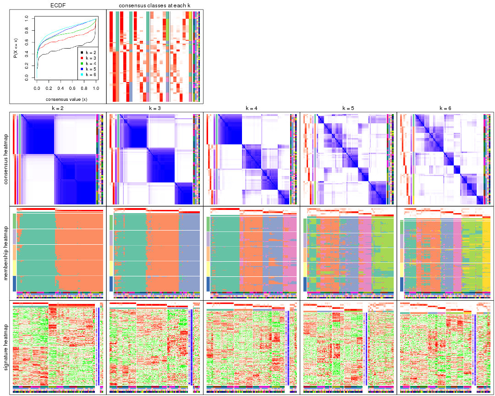

The plots are:

- The first row: a plot of the ECDF (empirical cumulative distribution
  function) curves of the consensus matrix for each `k` and the heatmap of
  predicted classes for each `k`.
- The second row: heatmaps of the consensus matrix for each `k`.
- The third row: heatmaps of the membership matrix for each `k`.
- The fouth row: heatmaps of the signatures for each `k`.

All the plots in panels can be made by individual functions and they are
plotted later in this section.

`select_partition_number()` produces several plots showing different
statistics for choosing "optimized" `k`. There are following statistics:

- ECDF curves of the consensus matrix for each `k`;
- 1-PAC. [The PAC
  score](https://en.wikipedia.org/wiki/Consensus_clustering#Over-interpretation_potential_of_consensus_clustering)
  measures the proportion of the ambiguous subgrouping.
- Mean silhouette score.
- Concordance. The mean probability of fiting the consensus class ids in all
  partitions.
- Area increased. Denote $A_k$ as the area under the ECDF curve for current
  `k`, the area increased is defined as $A_k - A_{k-1}$.
- Rand index. The percent of pairs of samples that are both in a same cluster
  or both are not in a same cluster in the partition of k and k-1.
- Jaccard index. The ratio of pairs of samples are both in a same cluster in
  the partition of k and k-1 and the pairs of samples are both in a same
  cluster in the partition k or k-1.

The detailed explanations of these statistics can be found in [the _cola_
vignette](http://bioconductor.org/packages/devel/bioc/vignettes/cola/inst/doc/cola.html#toc_13).

Generally speaking, lower PAC score, higher mean silhouette score or higher
concordance corresponds to better partition. Rand index and Jaccard index
measure how similar the current partition is compared to partition with `k-1`.
If they are too similar, we won't accept `k` is better than `k-1`.

```r
select_partition_number(res)
```

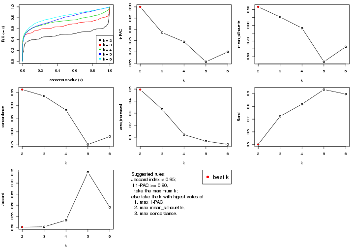

The numeric values for all these statistics can be obtained by `get_stats()`.

```r
get_stats(res)
```

```
#>   k 1-PAC mean_silhouette concordance area_increased  Rand Jaccard
#> 2 2 0.900           0.917       0.962         0.4961 0.501   0.501
#> 3 3 0.786           0.853       0.937         0.3323 0.722   0.502
#> 4 4 0.745           0.782       0.883         0.1214 0.818   0.532
#> 5 5 0.656           0.568       0.752         0.0674 0.933   0.749
#> 6 6 0.700           0.664       0.782         0.0401 0.897   0.590
```

`suggest_best_k()` suggests the best $k$ based on these statistics. The rules are as follows:

- All $k$ with Jaccard index larger than 0.95 are removed because increasing
  $k$ does not provide enough extra information. If all $k$ are removed, it is
  marked as no subgroup is detected.
- For all $k$ with 1-PAC score larger than 0.9, the maximal $k$ is taken as
  the best $k$, and other $k$ are marked as optional $k$.
- If it does not fit the second rule. The $k$ with the maximal vote of the
  highest 1-PAC score, highest mean silhouette, and highest concordance is
  taken as the best $k$.

```r
suggest_best_k(res)
```

```
#> [1] 2
```


Following shows the table of the partitions (You need to click the **show/hide
code output** link to see it). The membership matrix (columns with name `p*`)
is inferred by
[`clue::cl_consensus()`](https://www.rdocumentation.org/link/cl_consensus?package=clue)
function with the `SE` method. Basically the value in the membership matrix
represents the probability to belong to a certain group. The finall class
label for an item is determined with the group with highest probability it
belongs to.

In `get_classes()` function, the entropy is calculated from the membership
matrix and the silhouette score is calculated from the consensus matrix.


<script>
$( function() {
	$( '#tabs-MAD-NMF-get-classes' ).tabs();
} );
</script>
<div id='tabs-MAD-NMF-get-classes'>
<ul>
<li><a href='#tab-MAD-NMF-get-classes-1'>k = 2</a></li>
<li><a href='#tab-MAD-NMF-get-classes-2'>k = 3</a></li>
<li><a href='#tab-MAD-NMF-get-classes-3'>k = 4</a></li>
<li><a href='#tab-MAD-NMF-get-classes-4'>k = 5</a></li>
<li><a href='#tab-MAD-NMF-get-classes-5'>k = 6</a></li>
</ul>

<div id='tab-MAD-NMF-get-classes-1'>
<p><a id='tab-MAD-NMF-get-classes-1-a' style='color:#0366d6' href='#'>show/hide code output</a></p>
<pre><code class="r">cbind(get_classes(res, k = 2), get_membership(res, k = 2))
</code></pre>

<pre><code>#&gt;           class entropy silhouette    p1    p2
#&gt; GSM614415     1  0.0000      0.954 1.000 0.000
#&gt; GSM614416     1  0.0000      0.954 1.000 0.000
#&gt; GSM614417     1  0.0000      0.954 1.000 0.000
#&gt; GSM614418     1  0.0000      0.954 1.000 0.000
#&gt; GSM614419     1  0.0000      0.954 1.000 0.000
#&gt; GSM614420     1  0.0000      0.954 1.000 0.000
#&gt; GSM614421     2  0.6973      0.766 0.188 0.812
#&gt; GSM614422     1  0.0376      0.952 0.996 0.004
#&gt; GSM614423     1  0.9661      0.356 0.608 0.392
#&gt; GSM614424     2  0.6148      0.818 0.152 0.848
#&gt; GSM614425     1  0.9866      0.263 0.568 0.432
#&gt; GSM614426     1  0.7674      0.725 0.776 0.224
#&gt; GSM614427     2  0.1184      0.957 0.016 0.984
#&gt; GSM614428     2  0.1843      0.950 0.028 0.972
#&gt; GSM614429     2  0.0000      0.963 0.000 1.000
#&gt; GSM614430     2  0.0000      0.963 0.000 1.000
#&gt; GSM614431     2  0.1184      0.962 0.016 0.984
#&gt; GSM614432     2  0.1184      0.962 0.016 0.984
#&gt; GSM614433     2  0.1184      0.962 0.016 0.984
#&gt; GSM614434     2  0.1184      0.962 0.016 0.984
#&gt; GSM614435     2  0.0000      0.963 0.000 1.000
#&gt; GSM614436     2  0.0000      0.963 0.000 1.000
#&gt; GSM614437     2  0.0000      0.963 0.000 1.000
#&gt; GSM614438     2  0.0000      0.963 0.000 1.000
#&gt; GSM614439     2  0.0000      0.963 0.000 1.000
#&gt; GSM614440     2  0.0000      0.963 0.000 1.000
#&gt; GSM614441     2  0.0000      0.963 0.000 1.000
#&gt; GSM614442     2  0.0000      0.963 0.000 1.000
#&gt; GSM614443     2  0.0000      0.963 0.000 1.000
#&gt; GSM614444     2  0.0000      0.963 0.000 1.000
#&gt; GSM614391     1  0.0000      0.954 1.000 0.000
#&gt; GSM614392     1  0.0000      0.954 1.000 0.000
#&gt; GSM614393     1  0.0000      0.954 1.000 0.000
#&gt; GSM614394     1  0.0000      0.954 1.000 0.000
#&gt; GSM614395     1  0.1414      0.942 0.980 0.020
#&gt; GSM614396     1  0.0000      0.954 1.000 0.000
#&gt; GSM614397     1  0.1184      0.944 0.984 0.016
#&gt; GSM614398     1  0.0376      0.952 0.996 0.004
#&gt; GSM614399     2  0.3584      0.924 0.068 0.932
#&gt; GSM614400     1  0.3584      0.901 0.932 0.068
#&gt; GSM614401     1  0.0000      0.954 1.000 0.000
#&gt; GSM614402     1  0.7056      0.760 0.808 0.192
#&gt; GSM614403     2  0.9248      0.503 0.340 0.660
#&gt; GSM614404     1  0.7376      0.739 0.792 0.208
#&gt; GSM614405     2  0.9552      0.412 0.376 0.624
#&gt; GSM614406     2  0.0000      0.963 0.000 1.000
#&gt; GSM614407     1  0.0000      0.954 1.000 0.000
#&gt; GSM614408     1  0.0000      0.954 1.000 0.000
#&gt; GSM614409     1  0.0000      0.954 1.000 0.000
#&gt; GSM614410     1  0.0000      0.954 1.000 0.000
#&gt; GSM614411     1  0.0000      0.954 1.000 0.000
#&gt; GSM614412     1  0.0000      0.954 1.000 0.000
#&gt; GSM614413     1  0.0672      0.950 0.992 0.008
#&gt; GSM614414     1  0.0376      0.952 0.996 0.004
#&gt; GSM614445     2  0.4562      0.897 0.096 0.904
#&gt; GSM614446     2  0.2236      0.951 0.036 0.964
#&gt; GSM614447     2  0.2423      0.948 0.040 0.960
#&gt; GSM614448     2  0.1184      0.959 0.016 0.984
#&gt; GSM614449     2  0.0376      0.963 0.004 0.996
#&gt; GSM614450     2  0.3584      0.924 0.068 0.932
#&gt; GSM614451     2  0.0000      0.963 0.000 1.000
#&gt; GSM614452     2  0.0000      0.963 0.000 1.000
#&gt; GSM614453     2  0.1184      0.962 0.016 0.984
#&gt; GSM614454     2  0.1184      0.962 0.016 0.984
#&gt; GSM614455     2  0.1184      0.962 0.016 0.984
#&gt; GSM614456     2  0.0000      0.963 0.000 1.000
#&gt; GSM614457     2  0.0000      0.963 0.000 1.000
#&gt; GSM614458     2  0.0000      0.963 0.000 1.000
#&gt; GSM614459     2  0.0000      0.963 0.000 1.000
#&gt; GSM614460     2  0.0000      0.963 0.000 1.000
#&gt; GSM614461     2  0.1184      0.962 0.016 0.984
#&gt; GSM614462     2  0.1414      0.960 0.020 0.980
#&gt; GSM614463     2  0.1633      0.958 0.024 0.976
#&gt; GSM614464     2  0.1184      0.962 0.016 0.984
#&gt; GSM614465     2  0.1414      0.960 0.020 0.980
#&gt; GSM614466     2  0.1414      0.960 0.020 0.980
#&gt; GSM614467     2  0.0000      0.963 0.000 1.000
#&gt; GSM614468     2  0.1184      0.962 0.016 0.984
#&gt; GSM614469     1  0.0000      0.954 1.000 0.000
#&gt; GSM614470     1  0.0000      0.954 1.000 0.000
#&gt; GSM614471     1  0.0000      0.954 1.000 0.000
#&gt; GSM614472     1  0.0000      0.954 1.000 0.000
#&gt; GSM614473     1  0.0000      0.954 1.000 0.000
#&gt; GSM614474     1  0.0000      0.954 1.000 0.000
#&gt; GSM614475     1  0.0376      0.952 0.996 0.004
#&gt; GSM614476     1  0.2043      0.932 0.968 0.032
</code></pre>

<script>
$('#tab-MAD-NMF-get-classes-1-a').parent().next().next().hide();
$('#tab-MAD-NMF-get-classes-1-a').click(function(){
  $('#tab-MAD-NMF-get-classes-1-a').parent().next().next().toggle();
  return(false);
});
</script>
</div>

<div id='tab-MAD-NMF-get-classes-2'>
<p><a id='tab-MAD-NMF-get-classes-2-a' style='color:#0366d6' href='#'>show/hide code output</a></p>
<pre><code class="r">cbind(get_classes(res, k = 3), get_membership(res, k = 3))
</code></pre>

<pre><code>#&gt;           class entropy silhouette    p1    p2    p3
#&gt; GSM614415     1  0.0000     0.8905 1.000 0.000 0.000
#&gt; GSM614416     1  0.0000     0.8905 1.000 0.000 0.000
#&gt; GSM614417     1  0.0000     0.8905 1.000 0.000 0.000
#&gt; GSM614418     1  0.0000     0.8905 1.000 0.000 0.000
#&gt; GSM614419     1  0.0000     0.8905 1.000 0.000 0.000
#&gt; GSM614420     1  0.0000     0.8905 1.000 0.000 0.000
#&gt; GSM614421     3  0.1163     0.9427 0.028 0.000 0.972
#&gt; GSM614422     1  0.3412     0.7947 0.876 0.000 0.124
#&gt; GSM614423     1  0.6169     0.4664 0.636 0.360 0.004
#&gt; GSM614424     3  0.1031     0.9458 0.024 0.000 0.976
#&gt; GSM614425     3  0.3482     0.8522 0.128 0.000 0.872
#&gt; GSM614426     3  0.4346     0.7827 0.184 0.000 0.816
#&gt; GSM614427     3  0.0424     0.9541 0.008 0.000 0.992
#&gt; GSM614428     3  0.0237     0.9560 0.004 0.000 0.996
#&gt; GSM614429     2  0.0592     0.9440 0.000 0.988 0.012
#&gt; GSM614430     2  0.0592     0.9440 0.000 0.988 0.012
#&gt; GSM614431     2  0.0000     0.9468 0.000 1.000 0.000
#&gt; GSM614432     2  0.0000     0.9468 0.000 1.000 0.000
#&gt; GSM614433     2  0.0000     0.9468 0.000 1.000 0.000
#&gt; GSM614434     2  0.0237     0.9466 0.000 0.996 0.004
#&gt; GSM614435     2  0.2625     0.8836 0.000 0.916 0.084
#&gt; GSM614436     3  0.3482     0.8358 0.000 0.128 0.872
#&gt; GSM614437     3  0.1031     0.9411 0.000 0.024 0.976
#&gt; GSM614438     3  0.0000     0.9576 0.000 0.000 1.000
#&gt; GSM614439     3  0.0000     0.9576 0.000 0.000 1.000
#&gt; GSM614440     3  0.0000     0.9576 0.000 0.000 1.000
#&gt; GSM614441     3  0.0000     0.9576 0.000 0.000 1.000
#&gt; GSM614442     3  0.0000     0.9576 0.000 0.000 1.000
#&gt; GSM614443     3  0.0424     0.9530 0.000 0.008 0.992
#&gt; GSM614444     3  0.0000     0.9576 0.000 0.000 1.000
#&gt; GSM614391     1  0.0000     0.8905 1.000 0.000 0.000
#&gt; GSM614392     1  0.0000     0.8905 1.000 0.000 0.000
#&gt; GSM614393     1  0.0000     0.8905 1.000 0.000 0.000
#&gt; GSM614394     1  0.0000     0.8905 1.000 0.000 0.000
#&gt; GSM614395     1  0.6225     0.1845 0.568 0.000 0.432
#&gt; GSM614396     1  0.0000     0.8905 1.000 0.000 0.000
#&gt; GSM614397     1  0.2711     0.8281 0.912 0.000 0.088
#&gt; GSM614398     1  0.0747     0.8821 0.984 0.000 0.016
#&gt; GSM614399     2  0.0000     0.9468 0.000 1.000 0.000
#&gt; GSM614400     2  0.0000     0.9468 0.000 1.000 0.000
#&gt; GSM614401     2  0.3038     0.8481 0.104 0.896 0.000
#&gt; GSM614402     2  0.0424     0.9431 0.008 0.992 0.000
#&gt; GSM614403     2  0.5835     0.4212 0.340 0.660 0.000
#&gt; GSM614404     2  0.0237     0.9452 0.004 0.996 0.000
#&gt; GSM614405     1  0.6318     0.4793 0.636 0.356 0.008
#&gt; GSM614406     3  0.0000     0.9576 0.000 0.000 1.000
#&gt; GSM614407     1  0.0000     0.8905 1.000 0.000 0.000
#&gt; GSM614408     1  0.0000     0.8905 1.000 0.000 0.000
#&gt; GSM614409     1  0.0000     0.8905 1.000 0.000 0.000
#&gt; GSM614410     1  0.0000     0.8905 1.000 0.000 0.000
#&gt; GSM614411     1  0.0000     0.8905 1.000 0.000 0.000
#&gt; GSM614412     1  0.0000     0.8905 1.000 0.000 0.000
#&gt; GSM614413     1  0.1643     0.8643 0.956 0.000 0.044
#&gt; GSM614414     1  0.0424     0.8865 0.992 0.000 0.008
#&gt; GSM614445     2  0.0747     0.9380 0.016 0.984 0.000
#&gt; GSM614446     2  0.1877     0.9232 0.012 0.956 0.032
#&gt; GSM614447     2  0.0000     0.9468 0.000 1.000 0.000
#&gt; GSM614448     3  0.0000     0.9576 0.000 0.000 1.000
#&gt; GSM614449     3  0.0000     0.9576 0.000 0.000 1.000
#&gt; GSM614450     3  0.6565     0.6519 0.232 0.048 0.720
#&gt; GSM614451     3  0.0000     0.9576 0.000 0.000 1.000
#&gt; GSM614452     3  0.0000     0.9576 0.000 0.000 1.000
#&gt; GSM614453     2  0.0000     0.9468 0.000 1.000 0.000
#&gt; GSM614454     2  0.0237     0.9466 0.000 0.996 0.004
#&gt; GSM614455     2  0.0237     0.9466 0.000 0.996 0.004
#&gt; GSM614456     2  0.0892     0.9404 0.000 0.980 0.020
#&gt; GSM614457     2  0.0892     0.9398 0.000 0.980 0.020
#&gt; GSM614458     2  0.0592     0.9440 0.000 0.988 0.012
#&gt; GSM614459     2  0.4504     0.7548 0.000 0.804 0.196
#&gt; GSM614460     2  0.0892     0.9405 0.000 0.980 0.020
#&gt; GSM614461     2  0.0000     0.9468 0.000 1.000 0.000
#&gt; GSM614462     2  0.0000     0.9468 0.000 1.000 0.000
#&gt; GSM614463     2  0.0000     0.9468 0.000 1.000 0.000
#&gt; GSM614464     2  0.0237     0.9466 0.000 0.996 0.004
#&gt; GSM614465     2  0.0000     0.9468 0.000 1.000 0.000
#&gt; GSM614466     2  0.0000     0.9468 0.000 1.000 0.000
#&gt; GSM614467     2  0.4346     0.7720 0.000 0.816 0.184
#&gt; GSM614468     2  0.0237     0.9466 0.000 0.996 0.004
#&gt; GSM614469     1  0.4654     0.7308 0.792 0.208 0.000
#&gt; GSM614470     1  0.4002     0.7856 0.840 0.160 0.000
#&gt; GSM614471     2  0.6295    -0.0197 0.472 0.528 0.000
#&gt; GSM614472     1  0.6307     0.1193 0.512 0.488 0.000
#&gt; GSM614473     1  0.3267     0.8239 0.884 0.116 0.000
#&gt; GSM614474     1  0.3412     0.8189 0.876 0.124 0.000
#&gt; GSM614475     1  0.6305     0.1380 0.516 0.484 0.000
#&gt; GSM614476     1  0.0000     0.8905 1.000 0.000 0.000
</code></pre>

<script>
$('#tab-MAD-NMF-get-classes-2-a').parent().next().next().hide();
$('#tab-MAD-NMF-get-classes-2-a').click(function(){
  $('#tab-MAD-NMF-get-classes-2-a').parent().next().next().toggle();
  return(false);
});
</script>
</div>

<div id='tab-MAD-NMF-get-classes-3'>
<p><a id='tab-MAD-NMF-get-classes-3-a' style='color:#0366d6' href='#'>show/hide code output</a></p>
<pre><code class="r">cbind(get_classes(res, k = 4), get_membership(res, k = 4))
</code></pre>

<pre><code>#&gt;           class entropy silhouette    p1    p2    p3    p4
#&gt; GSM614415     1  0.0000    0.93927 1.000 0.000 0.000 0.000
#&gt; GSM614416     1  0.0000    0.93927 1.000 0.000 0.000 0.000
#&gt; GSM614417     1  0.0000    0.93927 1.000 0.000 0.000 0.000
#&gt; GSM614418     1  0.0000    0.93927 1.000 0.000 0.000 0.000
#&gt; GSM614419     1  0.0188    0.93830 0.996 0.000 0.004 0.000
#&gt; GSM614420     1  0.0188    0.93830 0.996 0.000 0.004 0.000
#&gt; GSM614421     3  0.2021    0.84430 0.000 0.056 0.932 0.012
#&gt; GSM614422     3  0.2124    0.84714 0.008 0.068 0.924 0.000
#&gt; GSM614423     3  0.3873    0.76862 0.000 0.228 0.772 0.000
#&gt; GSM614424     3  0.2197    0.84686 0.000 0.080 0.916 0.004
#&gt; GSM614425     3  0.1890    0.84545 0.000 0.056 0.936 0.008
#&gt; GSM614426     3  0.1824    0.84646 0.000 0.060 0.936 0.004
#&gt; GSM614427     3  0.1584    0.83426 0.000 0.036 0.952 0.012
#&gt; GSM614428     3  0.0927    0.81232 0.000 0.008 0.976 0.016
#&gt; GSM614429     2  0.2345    0.77909 0.000 0.900 0.000 0.100
#&gt; GSM614430     2  0.2334    0.79167 0.000 0.908 0.004 0.088
#&gt; GSM614431     2  0.1545    0.82538 0.000 0.952 0.008 0.040
#&gt; GSM614432     2  0.1411    0.83908 0.000 0.960 0.020 0.020
#&gt; GSM614433     2  0.1489    0.84289 0.000 0.952 0.044 0.004
#&gt; GSM614434     2  0.1398    0.82335 0.000 0.956 0.004 0.040
#&gt; GSM614435     4  0.5168   -0.02432 0.000 0.492 0.004 0.504
#&gt; GSM614436     4  0.3198    0.83025 0.000 0.040 0.080 0.880
#&gt; GSM614437     4  0.1059    0.82544 0.000 0.012 0.016 0.972
#&gt; GSM614438     4  0.2973    0.82101 0.000 0.000 0.144 0.856
#&gt; GSM614439     4  0.3074    0.81505 0.000 0.000 0.152 0.848
#&gt; GSM614440     4  0.2921    0.82337 0.000 0.000 0.140 0.860
#&gt; GSM614441     4  0.3074    0.81505 0.000 0.000 0.152 0.848
#&gt; GSM614442     4  0.2647    0.82877 0.000 0.000 0.120 0.880
#&gt; GSM614443     4  0.1209    0.83004 0.000 0.004 0.032 0.964
#&gt; GSM614444     4  0.2921    0.82337 0.000 0.000 0.140 0.860
#&gt; GSM614391     1  0.0000    0.93927 1.000 0.000 0.000 0.000
#&gt; GSM614392     1  0.0000    0.93927 1.000 0.000 0.000 0.000
#&gt; GSM614393     1  0.0000    0.93927 1.000 0.000 0.000 0.000
#&gt; GSM614394     1  0.0336    0.93683 0.992 0.000 0.008 0.000
#&gt; GSM614395     3  0.6138    0.44563 0.260 0.000 0.648 0.092
#&gt; GSM614396     1  0.0336    0.93683 0.992 0.000 0.008 0.000
#&gt; GSM614397     1  0.4917    0.52336 0.656 0.000 0.336 0.008
#&gt; GSM614398     1  0.1302    0.91613 0.956 0.000 0.044 0.000
#&gt; GSM614399     2  0.1629    0.83727 0.000 0.952 0.024 0.024
#&gt; GSM614400     2  0.1706    0.83899 0.016 0.948 0.036 0.000
#&gt; GSM614401     2  0.2670    0.81598 0.040 0.908 0.052 0.000
#&gt; GSM614402     2  0.2408    0.80078 0.000 0.896 0.104 0.000
#&gt; GSM614403     3  0.4431    0.68033 0.000 0.304 0.696 0.000
#&gt; GSM614404     2  0.1398    0.84165 0.004 0.956 0.040 0.000
#&gt; GSM614405     3  0.5677    0.58984 0.040 0.332 0.628 0.000
#&gt; GSM614406     3  0.2999    0.71115 0.000 0.004 0.864 0.132
#&gt; GSM614407     1  0.0000    0.93927 1.000 0.000 0.000 0.000
#&gt; GSM614408     1  0.0000    0.93927 1.000 0.000 0.000 0.000
#&gt; GSM614409     1  0.0000    0.93927 1.000 0.000 0.000 0.000
#&gt; GSM614410     1  0.0000    0.93927 1.000 0.000 0.000 0.000
#&gt; GSM614411     1  0.0000    0.93927 1.000 0.000 0.000 0.000
#&gt; GSM614412     1  0.0000    0.93927 1.000 0.000 0.000 0.000
#&gt; GSM614413     1  0.4889    0.47186 0.636 0.000 0.360 0.004
#&gt; GSM614414     1  0.1637    0.90478 0.940 0.000 0.060 0.000
#&gt; GSM614445     3  0.4382    0.69156 0.000 0.296 0.704 0.000
#&gt; GSM614446     3  0.3907    0.76528 0.000 0.232 0.768 0.000
#&gt; GSM614447     3  0.4072    0.74543 0.000 0.252 0.748 0.000
#&gt; GSM614448     3  0.1576    0.84384 0.000 0.048 0.948 0.004
#&gt; GSM614449     3  0.2714    0.83741 0.000 0.112 0.884 0.004
#&gt; GSM614450     3  0.3024    0.81948 0.000 0.148 0.852 0.000
#&gt; GSM614451     3  0.2149    0.74891 0.000 0.000 0.912 0.088
#&gt; GSM614452     3  0.1940    0.75902 0.000 0.000 0.924 0.076
#&gt; GSM614453     2  0.4134    0.57559 0.000 0.740 0.000 0.260
#&gt; GSM614454     2  0.4941    0.19959 0.000 0.564 0.000 0.436
#&gt; GSM614455     2  0.4941    0.20207 0.000 0.564 0.000 0.436
#&gt; GSM614456     4  0.3610    0.70259 0.000 0.200 0.000 0.800
#&gt; GSM614457     4  0.3266    0.73638 0.000 0.168 0.000 0.832
#&gt; GSM614458     2  0.4999    0.00719 0.000 0.508 0.000 0.492
#&gt; GSM614459     4  0.2216    0.78803 0.000 0.092 0.000 0.908
#&gt; GSM614460     4  0.3610    0.70471 0.000 0.200 0.000 0.800
#&gt; GSM614461     2  0.0895    0.84207 0.000 0.976 0.020 0.004
#&gt; GSM614462     2  0.1211    0.84241 0.000 0.960 0.040 0.000
#&gt; GSM614463     2  0.0921    0.84294 0.000 0.972 0.028 0.000
#&gt; GSM614464     2  0.1792    0.82873 0.000 0.932 0.068 0.000
#&gt; GSM614465     2  0.2281    0.80809 0.000 0.904 0.096 0.000
#&gt; GSM614466     2  0.1389    0.83971 0.000 0.952 0.048 0.000
#&gt; GSM614467     2  0.4790    0.21886 0.000 0.620 0.380 0.000
#&gt; GSM614468     2  0.2647    0.78166 0.000 0.880 0.120 0.000
#&gt; GSM614469     1  0.0779    0.93166 0.980 0.016 0.004 0.000
#&gt; GSM614470     1  0.0779    0.93166 0.980 0.016 0.004 0.000
#&gt; GSM614471     1  0.3892    0.75268 0.800 0.192 0.004 0.004
#&gt; GSM614472     1  0.2888    0.83688 0.872 0.124 0.004 0.000
#&gt; GSM614473     1  0.0469    0.93448 0.988 0.012 0.000 0.000
#&gt; GSM614474     1  0.0779    0.93125 0.980 0.016 0.004 0.000
#&gt; GSM614475     1  0.4428    0.62266 0.720 0.276 0.004 0.000
#&gt; GSM614476     1  0.2197    0.88541 0.916 0.004 0.080 0.000
</code></pre>

<script>
$('#tab-MAD-NMF-get-classes-3-a').parent().next().next().hide();
$('#tab-MAD-NMF-get-classes-3-a').click(function(){
  $('#tab-MAD-NMF-get-classes-3-a').parent().next().next().toggle();
  return(false);
});
</script>
</div>

<div id='tab-MAD-NMF-get-classes-4'>
<p><a id='tab-MAD-NMF-get-classes-4-a' style='color:#0366d6' href='#'>show/hide code output</a></p>
<pre><code class="r">cbind(get_classes(res, k = 5), get_membership(res, k = 5))
</code></pre>

<pre><code>#&gt;           class entropy silhouette    p1    p2    p3    p4    p5
#&gt; GSM614415     5  0.0609    0.76453 0.020 0.000 0.000 0.000 0.980
#&gt; GSM614416     5  0.0609    0.76453 0.020 0.000 0.000 0.000 0.980
#&gt; GSM614417     5  0.0510    0.76480 0.016 0.000 0.000 0.000 0.984
#&gt; GSM614418     5  0.0510    0.76480 0.016 0.000 0.000 0.000 0.984
#&gt; GSM614419     5  0.0609    0.76548 0.020 0.000 0.000 0.000 0.980
#&gt; GSM614420     5  0.0404    0.76547 0.012 0.000 0.000 0.000 0.988
#&gt; GSM614421     3  0.1059    0.74628 0.020 0.008 0.968 0.004 0.000
#&gt; GSM614422     3  0.1267    0.74530 0.024 0.012 0.960 0.004 0.000
#&gt; GSM614423     3  0.3527    0.70366 0.056 0.116 0.828 0.000 0.000
#&gt; GSM614424     3  0.1202    0.74998 0.004 0.032 0.960 0.004 0.000
#&gt; GSM614425     3  0.0854    0.74853 0.012 0.008 0.976 0.004 0.000
#&gt; GSM614426     3  0.0960    0.75109 0.016 0.008 0.972 0.004 0.000
#&gt; GSM614427     3  0.0740    0.74938 0.008 0.008 0.980 0.004 0.000
#&gt; GSM614428     3  0.1372    0.73722 0.024 0.004 0.956 0.016 0.000
#&gt; GSM614429     2  0.2793    0.61103 0.036 0.876 0.000 0.088 0.000
#&gt; GSM614430     2  0.3096    0.62122 0.084 0.868 0.008 0.040 0.000
#&gt; GSM614431     2  0.1725    0.65320 0.044 0.936 0.000 0.020 0.000
#&gt; GSM614432     2  0.1901    0.65469 0.056 0.928 0.004 0.012 0.000
#&gt; GSM614433     2  0.1818    0.68300 0.024 0.932 0.044 0.000 0.000
#&gt; GSM614434     2  0.2426    0.64013 0.064 0.900 0.000 0.036 0.000
#&gt; GSM614435     2  0.5755    0.30090 0.100 0.640 0.016 0.244 0.000
#&gt; GSM614436     4  0.6819    0.39996 0.080 0.348 0.068 0.504 0.000
#&gt; GSM614437     4  0.0671    0.78898 0.004 0.016 0.000 0.980 0.000
#&gt; GSM614438     4  0.1544    0.79099 0.000 0.000 0.068 0.932 0.000
#&gt; GSM614439     4  0.1478    0.79393 0.000 0.000 0.064 0.936 0.000
#&gt; GSM614440     4  0.1410    0.79566 0.000 0.000 0.060 0.940 0.000
#&gt; GSM614441     4  0.1478    0.79393 0.000 0.000 0.064 0.936 0.000
#&gt; GSM614442     4  0.1121    0.79791 0.000 0.000 0.044 0.956 0.000
#&gt; GSM614443     4  0.0566    0.78977 0.004 0.012 0.000 0.984 0.000
#&gt; GSM614444     4  0.1270    0.79757 0.000 0.000 0.052 0.948 0.000
#&gt; GSM614391     5  0.3304    0.68280 0.168 0.000 0.016 0.000 0.816
#&gt; GSM614392     5  0.2929    0.70117 0.152 0.000 0.008 0.000 0.840
#&gt; GSM614393     5  0.2674    0.70851 0.140 0.000 0.004 0.000 0.856
#&gt; GSM614394     5  0.3574    0.67248 0.168 0.000 0.028 0.000 0.804
#&gt; GSM614395     3  0.7213    0.22173 0.112 0.000 0.540 0.108 0.240
#&gt; GSM614396     5  0.3495    0.68071 0.160 0.000 0.028 0.000 0.812
#&gt; GSM614397     5  0.6914    0.00292 0.172 0.000 0.388 0.020 0.420
#&gt; GSM614398     5  0.5101    0.54608 0.184 0.000 0.108 0.004 0.704
#&gt; GSM614399     2  0.6506    0.45017 0.364 0.508 0.032 0.000 0.096
#&gt; GSM614400     2  0.7112    0.31422 0.364 0.412 0.024 0.000 0.200
#&gt; GSM614401     1  0.7360   -0.29429 0.376 0.336 0.028 0.000 0.260
#&gt; GSM614402     2  0.7033    0.41306 0.364 0.472 0.076 0.000 0.088
#&gt; GSM614403     3  0.7310    0.25730 0.360 0.236 0.376 0.000 0.028
#&gt; GSM614404     2  0.6698    0.42533 0.364 0.488 0.032 0.000 0.116
#&gt; GSM614405     1  0.7833   -0.39102 0.376 0.216 0.332 0.000 0.076
#&gt; GSM614406     3  0.5869    0.62155 0.164 0.000 0.632 0.196 0.008
#&gt; GSM614407     1  0.4517    0.38060 0.556 0.008 0.000 0.000 0.436
#&gt; GSM614408     5  0.4449   -0.29095 0.484 0.004 0.000 0.000 0.512
#&gt; GSM614409     1  0.4759    0.45477 0.600 0.012 0.008 0.000 0.380
#&gt; GSM614410     1  0.4528    0.36247 0.548 0.008 0.000 0.000 0.444
#&gt; GSM614411     1  0.5000    0.46732 0.604 0.016 0.016 0.000 0.364
#&gt; GSM614412     1  0.5419    0.47788 0.608 0.016 0.044 0.000 0.332
#&gt; GSM614413     1  0.6170    0.42681 0.620 0.016 0.220 0.004 0.140
#&gt; GSM614414     1  0.5916    0.46601 0.612 0.008 0.132 0.000 0.248
#&gt; GSM614445     3  0.6497    0.39794 0.312 0.212 0.476 0.000 0.000
#&gt; GSM614446     3  0.5796    0.56496 0.284 0.128 0.588 0.000 0.000
#&gt; GSM614447     3  0.6358    0.44300 0.328 0.180 0.492 0.000 0.000
#&gt; GSM614448     3  0.2616    0.74594 0.100 0.000 0.880 0.020 0.000
#&gt; GSM614449     3  0.3961    0.71469 0.160 0.044 0.792 0.004 0.000
#&gt; GSM614450     3  0.5030    0.64924 0.264 0.060 0.672 0.000 0.004
#&gt; GSM614451     3  0.3060    0.70078 0.024 0.000 0.848 0.128 0.000
#&gt; GSM614452     3  0.2915    0.70887 0.024 0.000 0.860 0.116 0.000
#&gt; GSM614453     2  0.3388    0.51293 0.008 0.792 0.000 0.200 0.000
#&gt; GSM614454     2  0.3999    0.27691 0.000 0.656 0.000 0.344 0.000
#&gt; GSM614455     2  0.4088    0.22876 0.000 0.632 0.000 0.368 0.000
#&gt; GSM614456     4  0.3932    0.57854 0.000 0.328 0.000 0.672 0.000
#&gt; GSM614457     4  0.3895    0.59464 0.000 0.320 0.000 0.680 0.000
#&gt; GSM614458     2  0.4331    0.08113 0.004 0.596 0.000 0.400 0.000
#&gt; GSM614459     4  0.3612    0.64930 0.000 0.268 0.000 0.732 0.000
#&gt; GSM614460     4  0.4126    0.50445 0.000 0.380 0.000 0.620 0.000
#&gt; GSM614461     2  0.2131    0.68298 0.056 0.920 0.016 0.008 0.000
#&gt; GSM614462     2  0.3835    0.67355 0.156 0.796 0.048 0.000 0.000
#&gt; GSM614463     2  0.3370    0.68022 0.148 0.824 0.028 0.000 0.000
#&gt; GSM614464     2  0.4627    0.63302 0.188 0.732 0.080 0.000 0.000
#&gt; GSM614465     2  0.4810    0.61906 0.204 0.712 0.084 0.000 0.000
#&gt; GSM614466     2  0.4152    0.65960 0.168 0.772 0.060 0.000 0.000
#&gt; GSM614467     2  0.5114    0.34980 0.052 0.608 0.340 0.000 0.000
#&gt; GSM614468     2  0.3339    0.67025 0.048 0.840 0.112 0.000 0.000
#&gt; GSM614469     5  0.1484    0.75302 0.048 0.008 0.000 0.000 0.944
#&gt; GSM614470     5  0.1894    0.73652 0.072 0.008 0.000 0.000 0.920
#&gt; GSM614471     5  0.3471    0.66054 0.072 0.092 0.000 0.000 0.836
#&gt; GSM614472     5  0.3323    0.66877 0.100 0.056 0.000 0.000 0.844
#&gt; GSM614473     5  0.1502    0.75230 0.056 0.004 0.000 0.000 0.940
#&gt; GSM614474     5  0.1710    0.75654 0.040 0.016 0.004 0.000 0.940
#&gt; GSM614475     5  0.5734    0.32520 0.072 0.308 0.016 0.000 0.604
#&gt; GSM614476     5  0.4353    0.65694 0.096 0.008 0.100 0.004 0.792
</code></pre>

<script>
$('#tab-MAD-NMF-get-classes-4-a').parent().next().next().hide();
$('#tab-MAD-NMF-get-classes-4-a').click(function(){
  $('#tab-MAD-NMF-get-classes-4-a').parent().next().next().toggle();
  return(false);
});
</script>
</div>

<div id='tab-MAD-NMF-get-classes-5'>
<p><a id='tab-MAD-NMF-get-classes-5-a' style='color:#0366d6' href='#'>show/hide code output</a></p>
<pre><code class="r">cbind(get_classes(res, k = 6), get_membership(res, k = 6))
</code></pre>

<pre><code>#&gt;           class entropy silhouette    p1    p2    p3    p4    p5    p6
#&gt; GSM614415     5  0.1738      0.696 0.016 0.000 0.000 0.004 0.928 0.052
#&gt; GSM614416     5  0.1826      0.696 0.020 0.000 0.000 0.004 0.924 0.052
#&gt; GSM614417     5  0.1644      0.696 0.012 0.000 0.000 0.004 0.932 0.052
#&gt; GSM614418     5  0.1644      0.696 0.012 0.000 0.000 0.004 0.932 0.052
#&gt; GSM614419     5  0.1909      0.698 0.024 0.000 0.000 0.004 0.920 0.052
#&gt; GSM614420     5  0.1826      0.698 0.020 0.000 0.000 0.004 0.924 0.052
#&gt; GSM614421     3  0.1138      0.777 0.012 0.000 0.960 0.000 0.004 0.024
#&gt; GSM614422     3  0.1332      0.763 0.012 0.000 0.952 0.000 0.008 0.028
#&gt; GSM614423     3  0.3452      0.712 0.068 0.032 0.848 0.000 0.016 0.036
#&gt; GSM614424     3  0.1528      0.763 0.048 0.000 0.936 0.000 0.000 0.016
#&gt; GSM614425     3  0.1148      0.776 0.016 0.000 0.960 0.000 0.004 0.020
#&gt; GSM614426     3  0.1148      0.776 0.016 0.000 0.960 0.000 0.004 0.020
#&gt; GSM614427     3  0.1148      0.776 0.016 0.000 0.960 0.004 0.000 0.020
#&gt; GSM614428     3  0.1871      0.768 0.016 0.000 0.928 0.024 0.000 0.032
#&gt; GSM614429     2  0.1363      0.749 0.004 0.952 0.028 0.012 0.000 0.004
#&gt; GSM614430     2  0.1659      0.748 0.008 0.940 0.028 0.004 0.000 0.020
#&gt; GSM614431     2  0.1930      0.744 0.028 0.924 0.036 0.000 0.000 0.012
#&gt; GSM614432     2  0.2384      0.738 0.040 0.896 0.056 0.000 0.000 0.008
#&gt; GSM614433     2  0.3325      0.705 0.096 0.820 0.084 0.000 0.000 0.000
#&gt; GSM614434     2  0.1820      0.745 0.016 0.928 0.044 0.000 0.000 0.012
#&gt; GSM614435     2  0.2893      0.731 0.000 0.872 0.028 0.056 0.000 0.044
#&gt; GSM614436     2  0.5391      0.586 0.000 0.668 0.080 0.184 0.000 0.068
#&gt; GSM614437     4  0.2243      0.880 0.000 0.112 0.000 0.880 0.004 0.004
#&gt; GSM614438     4  0.0508      0.952 0.000 0.004 0.012 0.984 0.000 0.000
#&gt; GSM614439     4  0.0508      0.952 0.000 0.004 0.012 0.984 0.000 0.000
#&gt; GSM614440     4  0.0622      0.954 0.000 0.012 0.008 0.980 0.000 0.000
#&gt; GSM614441     4  0.0508      0.952 0.000 0.004 0.012 0.984 0.000 0.000
#&gt; GSM614442     4  0.0692      0.949 0.000 0.020 0.004 0.976 0.000 0.000
#&gt; GSM614443     4  0.2149      0.888 0.000 0.104 0.000 0.888 0.004 0.004
#&gt; GSM614444     4  0.0725      0.954 0.000 0.012 0.012 0.976 0.000 0.000
#&gt; GSM614391     5  0.6295      0.579 0.176 0.000 0.072 0.000 0.568 0.184
#&gt; GSM614392     5  0.6046      0.592 0.176 0.000 0.056 0.000 0.592 0.176
#&gt; GSM614393     5  0.5824      0.600 0.172 0.000 0.044 0.000 0.612 0.172
#&gt; GSM614394     5  0.6587      0.567 0.176 0.000 0.100 0.000 0.540 0.184
#&gt; GSM614395     3  0.8644     -0.134 0.200 0.000 0.316 0.120 0.228 0.136
#&gt; GSM614396     5  0.6624      0.563 0.176 0.000 0.104 0.000 0.536 0.184
#&gt; GSM614397     5  0.8218      0.310 0.192 0.000 0.260 0.040 0.324 0.184
#&gt; GSM614398     5  0.7277      0.474 0.176 0.000 0.188 0.000 0.436 0.200
#&gt; GSM614399     1  0.4846      0.672 0.724 0.168 0.020 0.008 0.076 0.004
#&gt; GSM614400     1  0.4507      0.689 0.736 0.116 0.004 0.008 0.136 0.000
#&gt; GSM614401     1  0.4398      0.674 0.736 0.076 0.008 0.004 0.176 0.000
#&gt; GSM614402     1  0.4440      0.700 0.756 0.144 0.028 0.004 0.068 0.000
#&gt; GSM614403     1  0.3648      0.691 0.788 0.028 0.168 0.000 0.016 0.000
#&gt; GSM614404     1  0.4496      0.696 0.744 0.128 0.008 0.008 0.112 0.000
#&gt; GSM614405     1  0.4783      0.688 0.760 0.044 0.128 0.008 0.036 0.024
#&gt; GSM614406     1  0.6509      0.142 0.376 0.000 0.232 0.372 0.008 0.012
#&gt; GSM614407     6  0.2234      0.930 0.000 0.004 0.000 0.000 0.124 0.872
#&gt; GSM614408     6  0.2624      0.909 0.004 0.004 0.000 0.000 0.148 0.844
#&gt; GSM614409     6  0.2153      0.943 0.004 0.004 0.008 0.000 0.084 0.900
#&gt; GSM614410     6  0.2191      0.933 0.000 0.004 0.000 0.000 0.120 0.876
#&gt; GSM614411     6  0.2062      0.943 0.000 0.004 0.008 0.000 0.088 0.900
#&gt; GSM614412     6  0.1829      0.936 0.000 0.004 0.012 0.000 0.064 0.920
#&gt; GSM614413     6  0.1946      0.870 0.000 0.012 0.072 0.004 0.000 0.912
#&gt; GSM614414     6  0.2036      0.910 0.000 0.008 0.048 0.000 0.028 0.916
#&gt; GSM614445     1  0.4456      0.610 0.672 0.044 0.276 0.000 0.000 0.008
#&gt; GSM614446     1  0.4585      0.517 0.624 0.028 0.336 0.004 0.000 0.008
#&gt; GSM614447     1  0.4283      0.609 0.680 0.032 0.280 0.000 0.000 0.008
#&gt; GSM614448     3  0.5022      0.498 0.232 0.004 0.664 0.088 0.000 0.012
#&gt; GSM614449     3  0.4830      0.316 0.324 0.004 0.620 0.040 0.000 0.012
#&gt; GSM614450     1  0.4932      0.254 0.516 0.004 0.436 0.036 0.000 0.008
#&gt; GSM614451     3  0.4570      0.615 0.056 0.000 0.696 0.232 0.000 0.016
#&gt; GSM614452     3  0.4469      0.634 0.060 0.000 0.716 0.208 0.000 0.016
#&gt; GSM614453     2  0.1523      0.746 0.008 0.940 0.000 0.044 0.000 0.008
#&gt; GSM614454     2  0.2101      0.739 0.008 0.908 0.000 0.072 0.004 0.008
#&gt; GSM614455     2  0.1781      0.744 0.008 0.924 0.000 0.060 0.000 0.008
#&gt; GSM614456     2  0.3323      0.604 0.000 0.752 0.000 0.240 0.000 0.008
#&gt; GSM614457     2  0.3468      0.570 0.000 0.728 0.000 0.264 0.000 0.008
#&gt; GSM614458     2  0.2001      0.731 0.004 0.900 0.000 0.092 0.000 0.004
#&gt; GSM614459     2  0.3934      0.363 0.000 0.616 0.000 0.376 0.000 0.008
#&gt; GSM614460     2  0.3161      0.624 0.000 0.776 0.000 0.216 0.000 0.008
#&gt; GSM614461     2  0.3431      0.632 0.228 0.756 0.016 0.000 0.000 0.000
#&gt; GSM614462     2  0.4105      0.475 0.348 0.632 0.020 0.000 0.000 0.000
#&gt; GSM614463     2  0.3852      0.520 0.324 0.664 0.012 0.000 0.000 0.000
#&gt; GSM614464     2  0.4666      0.358 0.388 0.564 0.048 0.000 0.000 0.000
#&gt; GSM614465     2  0.4756      0.300 0.408 0.540 0.052 0.000 0.000 0.000
#&gt; GSM614466     2  0.4206      0.456 0.356 0.620 0.024 0.000 0.000 0.000
#&gt; GSM614467     2  0.5700      0.328 0.132 0.532 0.324 0.000 0.000 0.012
#&gt; GSM614468     2  0.3822      0.671 0.128 0.776 0.096 0.000 0.000 0.000
#&gt; GSM614469     5  0.2572      0.684 0.064 0.008 0.016 0.000 0.892 0.020
#&gt; GSM614470     5  0.3178      0.671 0.104 0.008 0.016 0.000 0.848 0.024
#&gt; GSM614471     5  0.4284      0.648 0.112 0.064 0.016 0.000 0.784 0.024
#&gt; GSM614472     5  0.3552      0.651 0.128 0.020 0.016 0.000 0.820 0.016
#&gt; GSM614473     5  0.2661      0.682 0.096 0.000 0.016 0.000 0.872 0.016
#&gt; GSM614474     5  0.3478      0.680 0.080 0.024 0.020 0.000 0.844 0.032
#&gt; GSM614475     5  0.7688      0.210 0.120 0.352 0.124 0.000 0.364 0.040
#&gt; GSM614476     5  0.6682      0.533 0.108 0.036 0.224 0.008 0.576 0.048
</code></pre>

<script>
$('#tab-MAD-NMF-get-classes-5-a').parent().next().next().hide();
$('#tab-MAD-NMF-get-classes-5-a').click(function(){
  $('#tab-MAD-NMF-get-classes-5-a').parent().next().next().toggle();
  return(false);
});
</script>
</div>
</div>

Heatmaps for the consensus matrix. It visualizes the probability of two
samples to be in a same group.


<script>
$( function() {
	$( '#tabs-MAD-NMF-consensus-heatmap' ).tabs();
} );
</script>
<div id='tabs-MAD-NMF-consensus-heatmap'>
<ul>
<li><a href='#tab-MAD-NMF-consensus-heatmap-1'>k = 2</a></li>
<li><a href='#tab-MAD-NMF-consensus-heatmap-2'>k = 3</a></li>
<li><a href='#tab-MAD-NMF-consensus-heatmap-3'>k = 4</a></li>
<li><a href='#tab-MAD-NMF-consensus-heatmap-4'>k = 5</a></li>
<li><a href='#tab-MAD-NMF-consensus-heatmap-5'>k = 6</a></li>
</ul>
<div id='tab-MAD-NMF-consensus-heatmap-1'>
<pre><code class="r">consensus_heatmap(res, k = 2)
</code></pre>

<p></p>

</div>
<div id='tab-MAD-NMF-consensus-heatmap-2'>
<pre><code class="r">consensus_heatmap(res, k = 3)
</code></pre>

<p></p>

</div>
<div id='tab-MAD-NMF-consensus-heatmap-3'>
<pre><code class="r">consensus_heatmap(res, k = 4)
</code></pre>

<p></p>

</div>
<div id='tab-MAD-NMF-consensus-heatmap-4'>
<pre><code class="r">consensus_heatmap(res, k = 5)
</code></pre>

<p></p>

</div>
<div id='tab-MAD-NMF-consensus-heatmap-5'>
<pre><code class="r">consensus_heatmap(res, k = 6)
</code></pre>

<p></p>

</div>
</div>

Heatmaps for the membership of samples in all partitions to see how consistent they are:


<script>
$( function() {
	$( '#tabs-MAD-NMF-membership-heatmap' ).tabs();
} );
</script>
<div id='tabs-MAD-NMF-membership-heatmap'>
<ul>
<li><a href='#tab-MAD-NMF-membership-heatmap-1'>k = 2</a></li>
<li><a href='#tab-MAD-NMF-membership-heatmap-2'>k = 3</a></li>
<li><a href='#tab-MAD-NMF-membership-heatmap-3'>k = 4</a></li>
<li><a href='#tab-MAD-NMF-membership-heatmap-4'>k = 5</a></li>
<li><a href='#tab-MAD-NMF-membership-heatmap-5'>k = 6</a></li>
</ul>
<div id='tab-MAD-NMF-membership-heatmap-1'>
<pre><code class="r">membership_heatmap(res, k = 2)
</code></pre>

<p></p>

</div>
<div id='tab-MAD-NMF-membership-heatmap-2'>
<pre><code class="r">membership_heatmap(res, k = 3)
</code></pre>

<p>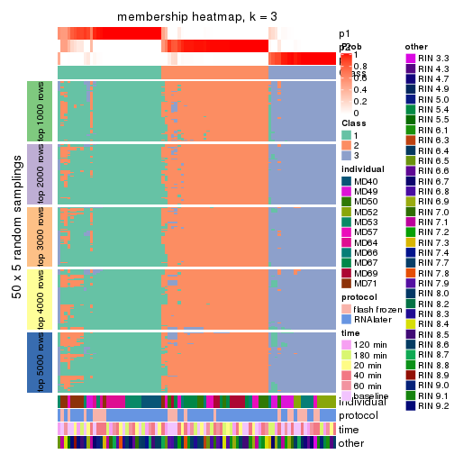</p>

</div>
<div id='tab-MAD-NMF-membership-heatmap-3'>
<pre><code class="r">membership_heatmap(res, k = 4)
</code></pre>

<p></p>

</div>
<div id='tab-MAD-NMF-membership-heatmap-4'>
<pre><code class="r">membership_heatmap(res, k = 5)
</code></pre>

<p></p>

</div>
<div id='tab-MAD-NMF-membership-heatmap-5'>
<pre><code class="r">membership_heatmap(res, k = 6)
</code></pre>

<p></p>

</div>
</div>

As soon as we have had the classes for columns, we can look for signatures
which are significantly different between classes which can be candidate marks
for certain classes. Following are the heatmaps for signatures.


Signature heatmaps where rows are scaled:


<script>
$( function() {
	$( '#tabs-MAD-NMF-get-signatures' ).tabs();
} );
</script>
<div id='tabs-MAD-NMF-get-signatures'>
<ul>
<li><a href='#tab-MAD-NMF-get-signatures-1'>k = 2</a></li>
<li><a href='#tab-MAD-NMF-get-signatures-2'>k = 3</a></li>
<li><a href='#tab-MAD-NMF-get-signatures-3'>k = 4</a></li>
<li><a href='#tab-MAD-NMF-get-signatures-4'>k = 5</a></li>
<li><a href='#tab-MAD-NMF-get-signatures-5'>k = 6</a></li>
</ul>
<div id='tab-MAD-NMF-get-signatures-1'>
<pre><code class="r">get_signatures(res, k = 2)
</code></pre>

<p></p>

</div>
<div id='tab-MAD-NMF-get-signatures-2'>
<pre><code class="r">get_signatures(res, k = 3)
</code></pre>

<p></p>

</div>
<div id='tab-MAD-NMF-get-signatures-3'>
<pre><code class="r">get_signatures(res, k = 4)
</code></pre>

<p></p>

</div>
<div id='tab-MAD-NMF-get-signatures-4'>
<pre><code class="r">get_signatures(res, k = 5)
</code></pre>

<p></p>

</div>
<div id='tab-MAD-NMF-get-signatures-5'>
<pre><code class="r">get_signatures(res, k = 6)
</code></pre>

<p></p>

</div>
</div>


Signature heatmaps where rows are not scaled:


<script>
$( function() {
	$( '#tabs-MAD-NMF-get-signatures-no-scale' ).tabs();
} );
</script>
<div id='tabs-MAD-NMF-get-signatures-no-scale'>
<ul>
<li><a href='#tab-MAD-NMF-get-signatures-no-scale-1'>k = 2</a></li>
<li><a href='#tab-MAD-NMF-get-signatures-no-scale-2'>k = 3</a></li>
<li><a href='#tab-MAD-NMF-get-signatures-no-scale-3'>k = 4</a></li>
<li><a href='#tab-MAD-NMF-get-signatures-no-scale-4'>k = 5</a></li>
<li><a href='#tab-MAD-NMF-get-signatures-no-scale-5'>k = 6</a></li>
</ul>
<div id='tab-MAD-NMF-get-signatures-no-scale-1'>
<pre><code class="r">get_signatures(res, k = 2, scale_rows = FALSE)
</code></pre>

<p></p>

</div>
<div id='tab-MAD-NMF-get-signatures-no-scale-2'>
<pre><code class="r">get_signatures(res, k = 3, scale_rows = FALSE)
</code></pre>

<p></p>

</div>
<div id='tab-MAD-NMF-get-signatures-no-scale-3'>
<pre><code class="r">get_signatures(res, k = 4, scale_rows = FALSE)
</code></pre>

<p></p>

</div>
<div id='tab-MAD-NMF-get-signatures-no-scale-4'>
<pre><code class="r">get_signatures(res, k = 5, scale_rows = FALSE)
</code></pre>

<p></p>

</div>
<div id='tab-MAD-NMF-get-signatures-no-scale-5'>
<pre><code class="r">get_signatures(res, k = 6, scale_rows = FALSE)
</code></pre>

<p></p>

</div>
</div>


Compare the overlap of signatures from different k:

```r
compare_signatures(res)
```


`get_signature()` returns a data frame invisibly. TO get the list of signatures, the function
call should be assigned to a variable explicitly. In following code, if `plot` argument is set
to `FALSE`, no heatmap is plotted while only the differential analysis is performed.

```r
# code only for demonstration
tb = get_signature(res, k = ..., plot = FALSE)
```

An example of the output of `tb` is:

```
#>   which_row         fdr    mean_1    mean_2 scaled_mean_1 scaled_mean_2 km
#> 1        38 0.042760348  8.373488  9.131774    -0.5533452     0.5164555  1
#> 2        40 0.018707592  7.106213  8.469186    -0.6173731     0.5762149  1
#> 3        55 0.019134737 10.221463 11.207825    -0.6159697     0.5749050  1
#> 4        59 0.006059896  5.921854  7.869574    -0.6899429     0.6439467  1
#> 5        60 0.018055526  8.928898 10.211722    -0.6204761     0.5791110  1
#> 6        98 0.009384629 15.714769 14.887706     0.6635654    -0.6193277  2
...
```

The columns in `tb` are:

1. `which_row`: row indices corresponding to the input matrix.
2. `fdr`: FDR for the differential test. 
3. `mean_x`: The mean value in group x.
4. `scaled_mean_x`: The mean value in group x after rows are scaled.
5. `km`: Row groups if k-means clustering is applied to rows.


UMAP plot which shows how samples are separated.


<script>
$( function() {
	$( '#tabs-MAD-NMF-dimension-reduction' ).tabs();
} );
</script>
<div id='tabs-MAD-NMF-dimension-reduction'>
<ul>
<li><a href='#tab-MAD-NMF-dimension-reduction-1'>k = 2</a></li>
<li><a href='#tab-MAD-NMF-dimension-reduction-2'>k = 3</a></li>
<li><a href='#tab-MAD-NMF-dimension-reduction-3'>k = 4</a></li>
<li><a href='#tab-MAD-NMF-dimension-reduction-4'>k = 5</a></li>
<li><a href='#tab-MAD-NMF-dimension-reduction-5'>k = 6</a></li>
</ul>
<div id='tab-MAD-NMF-dimension-reduction-1'>
<pre><code class="r">dimension_reduction(res, k = 2, method = &quot;UMAP&quot;)
</code></pre>

<p></p>

</div>
<div id='tab-MAD-NMF-dimension-reduction-2'>
<pre><code class="r">dimension_reduction(res, k = 3, method = &quot;UMAP&quot;)
</code></pre>

<p></p>

</div>
<div id='tab-MAD-NMF-dimension-reduction-3'>
<pre><code class="r">dimension_reduction(res, k = 4, method = &quot;UMAP&quot;)
</code></pre>

<p></p>

</div>
<div id='tab-MAD-NMF-dimension-reduction-4'>
<pre><code class="r">dimension_reduction(res, k = 5, method = &quot;UMAP&quot;)
</code></pre>

<p></p>

</div>
<div id='tab-MAD-NMF-dimension-reduction-5'>
<pre><code class="r">dimension_reduction(res, k = 6, method = &quot;UMAP&quot;)
</code></pre>

<p></p>

</div>
</div>


Following heatmap shows how subgroups are split when increasing `k`:

```r
collect_classes(res)
```


Test correlation between subgroups and known annotations. If the known
annotation is numeric, one-way ANOVA test is applied, and if the known
annotation is discrete, chi-squared contingency table test is applied.

```r
test_to_known_factors(res)
```

```
#>          n individual(p) protocol(p) time(p) other(p) k
#> MAD:NMF 83      3.41e-11       0.359   0.870    0.847 2
#> MAD:NMF 79      4.52e-18       0.145   0.991    0.362 3
#> MAD:NMF 79      7.27e-28       0.088   1.000    0.300 4
#> MAD:NMF 60      3.63e-23       0.138   1.000    0.214 5
#> MAD:NMF 72      2.92e-45       0.317   1.000    0.107 6
```


If matrix rows can be associated to genes, consider to use `functional_enrichment(res,
...)` to perform function enrichment for the signature genes. See [this vignette](http://bioconductor.org/packages/devel/bioc/vignettes/cola/inst/doc/functional_enrichment.html) for more detailed explanations.


 

---------------------------------------------------


### ATC:hclust


The object with results only for a single top-value method and a single partition method 
can be extracted as:

```r
res = res_list["ATC", "hclust"]
# you can also extract it by
# res = res_list["ATC:hclust"]
```

A summary of `res` and all the functions that can be applied to it:

```r
res
```

```
#> A 'ConsensusPartition' object with k = 2, 3, 4, 5, 6.
#>   On a matrix with 21168 rows and 86 columns.
#>   Top rows (1000, 2000, 3000, 4000, 5000) are extracted by 'ATC' method.
#>   Subgroups are detected by 'hclust' method.
#>   Performed in total 1250 partitions by row resampling.
#>   Best k for subgroups seems to be 5.
#> 
#> Following methods can be applied to this 'ConsensusPartition' object:
#>  [1] "cola_report"             "collect_classes"         "collect_plots"          
#>  [4] "collect_stats"           "colnames"                "compare_signatures"     
#>  [7] "consensus_heatmap"       "dimension_reduction"     "functional_enrichment"  
#> [10] "get_anno_col"            "get_anno"                "get_classes"            
#> [13] "get_consensus"           "get_matrix"              "get_membership"         
#> [16] "get_param"               "get_signatures"          "get_stats"              
#> [19] "is_best_k"               "is_stable_k"             "membership_heatmap"     
#> [22] "ncol"                    "nrow"                    "plot_ecdf"              
#> [25] "rownames"                "select_partition_number" "show"                   
#> [28] "suggest_best_k"          "test_to_known_factors"
```

`collect_plots()` function collects all the plots made from `res` for all `k` (number of partitions)
into one single page to provide an easy and fast comparison between different `k`.

```r
collect_plots(res)
```


The plots are:

- The first row: a plot of the ECDF (empirical cumulative distribution
  function) curves of the consensus matrix for each `k` and the heatmap of
  predicted classes for each `k`.
- The second row: heatmaps of the consensus matrix for each `k`.
- The third row: heatmaps of the membership matrix for each `k`.
- The fouth row: heatmaps of the signatures for each `k`.

All the plots in panels can be made by individual functions and they are
plotted later in this section.

`select_partition_number()` produces several plots showing different
statistics for choosing "optimized" `k`. There are following statistics:

- ECDF curves of the consensus matrix for each `k`;
- 1-PAC. [The PAC
  score](https://en.wikipedia.org/wiki/Consensus_clustering#Over-interpretation_potential_of_consensus_clustering)
  measures the proportion of the ambiguous subgrouping.
- Mean silhouette score.
- Concordance. The mean probability of fiting the consensus class ids in all
  partitions.
- Area increased. Denote $A_k$ as the area under the ECDF curve for current
  `k`, the area increased is defined as $A_k - A_{k-1}$.
- Rand index. The percent of pairs of samples that are both in a same cluster
  or both are not in a same cluster in the partition of k and k-1.
- Jaccard index. The ratio of pairs of samples are both in a same cluster in
  the partition of k and k-1 and the pairs of samples are both in a same
  cluster in the partition k or k-1.

The detailed explanations of these statistics can be found in [the _cola_
vignette](http://bioconductor.org/packages/devel/bioc/vignettes/cola/inst/doc/cola.html#toc_13).

Generally speaking, lower PAC score, higher mean silhouette score or higher
concordance corresponds to better partition. Rand index and Jaccard index
measure how similar the current partition is compared to partition with `k-1`.
If they are too similar, we won't accept `k` is better than `k-1`.

```r
select_partition_number(res)
```


The numeric values for all these statistics can be obtained by `get_stats()`.

```r
get_stats(res)
```

```
#>   k 1-PAC mean_silhouette concordance area_increased  Rand Jaccard
#> 2 2 0.667           0.775       0.918         0.3361 0.665   0.665
#> 3 3 0.378           0.559       0.769         0.4704 0.788   0.697
#> 4 4 0.631           0.661       0.848         0.3137 0.690   0.483
#> 5 5 0.762           0.775       0.878         0.0830 0.914   0.768
#> 6 6 0.829           0.692       0.869         0.0335 0.975   0.916
```

`suggest_best_k()` suggests the best $k$ based on these statistics. The rules are as follows:

- All $k$ with Jaccard index larger than 0.95 are removed because increasing
  $k$ does not provide enough extra information. If all $k$ are removed, it is
  marked as no subgroup is detected.
- For all $k$ with 1-PAC score larger than 0.9, the maximal $k$ is taken as
  the best $k$, and other $k$ are marked as optional $k$.
- If it does not fit the second rule. The $k$ with the maximal vote of the
  highest 1-PAC score, highest mean silhouette, and highest concordance is
  taken as the best $k$.

```r
suggest_best_k(res)
```

```
#> [1] 5
```


Following shows the table of the partitions (You need to click the **show/hide
code output** link to see it). The membership matrix (columns with name `p*`)
is inferred by
[`clue::cl_consensus()`](https://www.rdocumentation.org/link/cl_consensus?package=clue)
function with the `SE` method. Basically the value in the membership matrix
represents the probability to belong to a certain group. The finall class
label for an item is determined with the group with highest probability it
belongs to.

In `get_classes()` function, the entropy is calculated from the membership
matrix and the silhouette score is calculated from the consensus matrix.


<script>
$( function() {
	$( '#tabs-ATC-hclust-get-classes' ).tabs();
} );
</script>
<div id='tabs-ATC-hclust-get-classes'>
<ul>
<li><a href='#tab-ATC-hclust-get-classes-1'>k = 2</a></li>
<li><a href='#tab-ATC-hclust-get-classes-2'>k = 3</a></li>
<li><a href='#tab-ATC-hclust-get-classes-3'>k = 4</a></li>
<li><a href='#tab-ATC-hclust-get-classes-4'>k = 5</a></li>
<li><a href='#tab-ATC-hclust-get-classes-5'>k = 6</a></li>
</ul>

<div id='tab-ATC-hclust-get-classes-1'>
<p><a id='tab-ATC-hclust-get-classes-1-a' style='color:#0366d6' href='#'>show/hide code output</a></p>
<pre><code class="r">cbind(get_classes(res, k = 2), get_membership(res, k = 2))
</code></pre>

<pre><code>#&gt;           class entropy silhouette    p1    p2
#&gt; GSM614415     2   0.000      0.924 0.000 1.000
#&gt; GSM614416     2   0.000      0.924 0.000 1.000
#&gt; GSM614417     2   0.000      0.924 0.000 1.000
#&gt; GSM614418     2   0.000      0.924 0.000 1.000
#&gt; GSM614419     2   0.000      0.924 0.000 1.000
#&gt; GSM614420     2   0.000      0.924 0.000 1.000
#&gt; GSM614421     2   0.997     -0.079 0.468 0.532
#&gt; GSM614422     2   0.997     -0.079 0.468 0.532
#&gt; GSM614423     2   0.552      0.782 0.128 0.872
#&gt; GSM614424     2   0.997     -0.079 0.468 0.532
#&gt; GSM614425     2   0.997     -0.079 0.468 0.532
#&gt; GSM614426     2   0.997     -0.079 0.468 0.532
#&gt; GSM614427     1   0.991      0.325 0.556 0.444
#&gt; GSM614428     1   0.946      0.489 0.636 0.364
#&gt; GSM614429     2   0.000      0.924 0.000 1.000
#&gt; GSM614430     2   0.000      0.924 0.000 1.000
#&gt; GSM614431     2   0.000      0.924 0.000 1.000
#&gt; GSM614432     2   0.000      0.924 0.000 1.000
#&gt; GSM614433     2   0.000      0.924 0.000 1.000
#&gt; GSM614434     2   0.000      0.924 0.000 1.000
#&gt; GSM614435     2   0.000      0.924 0.000 1.000
#&gt; GSM614436     2   0.662      0.727 0.172 0.828
#&gt; GSM614437     1   0.998      0.221 0.524 0.476
#&gt; GSM614438     1   0.000      0.796 1.000 0.000
#&gt; GSM614439     1   0.000      0.796 1.000 0.000
#&gt; GSM614440     1   0.000      0.796 1.000 0.000
#&gt; GSM614441     1   0.000      0.796 1.000 0.000
#&gt; GSM614442     1   0.000      0.796 1.000 0.000
#&gt; GSM614443     1   0.998      0.221 0.524 0.476
#&gt; GSM614444     1   0.000      0.796 1.000 0.000
#&gt; GSM614391     2   0.000      0.924 0.000 1.000
#&gt; GSM614392     2   0.000      0.924 0.000 1.000
#&gt; GSM614393     2   0.000      0.924 0.000 1.000
#&gt; GSM614394     2   0.000      0.924 0.000 1.000
#&gt; GSM614395     1   0.000      0.796 1.000 0.000
#&gt; GSM614396     2   0.000      0.924 0.000 1.000
#&gt; GSM614397     1   0.000      0.796 1.000 0.000
#&gt; GSM614398     1   0.000      0.796 1.000 0.000
#&gt; GSM614399     2   0.000      0.924 0.000 1.000
#&gt; GSM614400     2   0.000      0.924 0.000 1.000
#&gt; GSM614401     2   0.000      0.924 0.000 1.000
#&gt; GSM614402     2   0.000      0.924 0.000 1.000
#&gt; GSM614403     2   0.767      0.643 0.224 0.776
#&gt; GSM614404     2   0.000      0.924 0.000 1.000
#&gt; GSM614405     2   0.943      0.319 0.360 0.640
#&gt; GSM614406     1   0.999      0.222 0.520 0.480
#&gt; GSM614407     2   0.000      0.924 0.000 1.000
#&gt; GSM614408     2   0.000      0.924 0.000 1.000
#&gt; GSM614409     2   0.000      0.924 0.000 1.000
#&gt; GSM614410     2   0.000      0.924 0.000 1.000
#&gt; GSM614411     2   0.000      0.924 0.000 1.000
#&gt; GSM614412     2   0.000      0.924 0.000 1.000
#&gt; GSM614413     1   0.975      0.417 0.592 0.408
#&gt; GSM614414     1   0.975      0.417 0.592 0.408
#&gt; GSM614445     2   0.000      0.924 0.000 1.000
#&gt; GSM614446     2   0.000      0.924 0.000 1.000
#&gt; GSM614447     2   0.000      0.924 0.000 1.000
#&gt; GSM614448     2   0.745      0.661 0.212 0.788
#&gt; GSM614449     2   0.738      0.668 0.208 0.792
#&gt; GSM614450     2   0.738      0.668 0.208 0.792
#&gt; GSM614451     1   0.000      0.796 1.000 0.000
#&gt; GSM614452     1   0.000      0.796 1.000 0.000
#&gt; GSM614453     2   0.000      0.924 0.000 1.000
#&gt; GSM614454     2   0.000      0.924 0.000 1.000
#&gt; GSM614455     2   0.000      0.924 0.000 1.000
#&gt; GSM614456     2   0.000      0.924 0.000 1.000
#&gt; GSM614457     2   0.000      0.924 0.000 1.000
#&gt; GSM614458     2   0.000      0.924 0.000 1.000
#&gt; GSM614459     2   0.000      0.924 0.000 1.000
#&gt; GSM614460     2   0.000      0.924 0.000 1.000
#&gt; GSM614461     2   0.000      0.924 0.000 1.000
#&gt; GSM614462     2   0.000      0.924 0.000 1.000
#&gt; GSM614463     2   0.000      0.924 0.000 1.000
#&gt; GSM614464     2   0.000      0.924 0.000 1.000
#&gt; GSM614465     2   0.000      0.924 0.000 1.000
#&gt; GSM614466     2   0.000      0.924 0.000 1.000
#&gt; GSM614467     2   0.000      0.924 0.000 1.000
#&gt; GSM614468     2   0.000      0.924 0.000 1.000
#&gt; GSM614469     2   0.000      0.924 0.000 1.000
#&gt; GSM614470     2   0.000      0.924 0.000 1.000
#&gt; GSM614471     2   0.000      0.924 0.000 1.000
#&gt; GSM614472     2   0.000      0.924 0.000 1.000
#&gt; GSM614473     2   0.000      0.924 0.000 1.000
#&gt; GSM614474     2   0.000      0.924 0.000 1.000
#&gt; GSM614475     2   0.000      0.924 0.000 1.000
#&gt; GSM614476     2   0.662      0.727 0.172 0.828
</code></pre>

<script>
$('#tab-ATC-hclust-get-classes-1-a').parent().next().next().hide();
$('#tab-ATC-hclust-get-classes-1-a').click(function(){
  $('#tab-ATC-hclust-get-classes-1-a').parent().next().next().toggle();
  return(false);
});
</script>
</div>

<div id='tab-ATC-hclust-get-classes-2'>
<p><a id='tab-ATC-hclust-get-classes-2-a' style='color:#0366d6' href='#'>show/hide code output</a></p>
<pre><code class="r">cbind(get_classes(res, k = 3), get_membership(res, k = 3))
</code></pre>

<pre><code>#&gt;           class entropy silhouette    p1    p2    p3
#&gt; GSM614415     2  0.6180     0.4792 0.000 0.584 0.416
#&gt; GSM614416     2  0.6180     0.4792 0.000 0.584 0.416
#&gt; GSM614417     2  0.6180     0.4792 0.000 0.584 0.416
#&gt; GSM614418     2  0.6180     0.4792 0.000 0.584 0.416
#&gt; GSM614419     2  0.6260     0.4332 0.000 0.552 0.448
#&gt; GSM614420     2  0.6260     0.4332 0.000 0.552 0.448
#&gt; GSM614421     3  0.9640     0.5557 0.252 0.280 0.468
#&gt; GSM614422     3  0.9640     0.5557 0.252 0.280 0.468
#&gt; GSM614423     2  0.6260     0.2854 0.000 0.552 0.448
#&gt; GSM614424     3  0.9640     0.5557 0.252 0.280 0.468
#&gt; GSM614425     3  0.9640     0.5557 0.252 0.280 0.468
#&gt; GSM614426     3  0.9640     0.5557 0.252 0.280 0.468
#&gt; GSM614427     3  0.9379     0.5144 0.288 0.208 0.504
#&gt; GSM614428     3  0.9601     0.4388 0.364 0.204 0.432
#&gt; GSM614429     2  0.0000     0.7826 0.000 1.000 0.000
#&gt; GSM614430     2  0.0000     0.7826 0.000 1.000 0.000
#&gt; GSM614431     2  0.0000     0.7826 0.000 1.000 0.000
#&gt; GSM614432     2  0.0000     0.7826 0.000 1.000 0.000
#&gt; GSM614433     2  0.0000     0.7826 0.000 1.000 0.000
#&gt; GSM614434     2  0.0000     0.7826 0.000 1.000 0.000
#&gt; GSM614435     2  0.0000     0.7826 0.000 1.000 0.000
#&gt; GSM614436     2  0.6299     0.1809 0.000 0.524 0.476
#&gt; GSM614437     3  0.4062     0.3525 0.000 0.164 0.836
#&gt; GSM614438     3  0.6274    -0.2681 0.456 0.000 0.544
#&gt; GSM614439     3  0.6274    -0.2681 0.456 0.000 0.544
#&gt; GSM614440     3  0.6274    -0.2681 0.456 0.000 0.544
#&gt; GSM614441     3  0.6274    -0.2681 0.456 0.000 0.544
#&gt; GSM614442     3  0.6274    -0.2681 0.456 0.000 0.544
#&gt; GSM614443     3  0.4062     0.3525 0.000 0.164 0.836
#&gt; GSM614444     3  0.6274    -0.2681 0.456 0.000 0.544
#&gt; GSM614391     2  0.6267     0.4265 0.000 0.548 0.452
#&gt; GSM614392     2  0.6267     0.4265 0.000 0.548 0.452
#&gt; GSM614393     2  0.6267     0.4265 0.000 0.548 0.452
#&gt; GSM614394     2  0.6267     0.4265 0.000 0.548 0.452
#&gt; GSM614395     1  0.0237     0.9891 0.996 0.000 0.004
#&gt; GSM614396     2  0.6267     0.4265 0.000 0.548 0.452
#&gt; GSM614397     1  0.0237     0.9891 0.996 0.000 0.004
#&gt; GSM614398     1  0.0237     0.9891 0.996 0.000 0.004
#&gt; GSM614399     2  0.0000     0.7826 0.000 1.000 0.000
#&gt; GSM614400     2  0.0000     0.7826 0.000 1.000 0.000
#&gt; GSM614401     2  0.0000     0.7826 0.000 1.000 0.000
#&gt; GSM614402     2  0.0000     0.7826 0.000 1.000 0.000
#&gt; GSM614403     3  0.7286    -0.0232 0.028 0.464 0.508
#&gt; GSM614404     2  0.0000     0.7826 0.000 1.000 0.000
#&gt; GSM614405     3  0.6211     0.4921 0.036 0.228 0.736
#&gt; GSM614406     3  0.8950     0.5296 0.216 0.216 0.568
#&gt; GSM614407     2  0.6045     0.5254 0.000 0.620 0.380
#&gt; GSM614408     2  0.6045     0.5254 0.000 0.620 0.380
#&gt; GSM614409     2  0.6045     0.5254 0.000 0.620 0.380
#&gt; GSM614410     2  0.6045     0.5254 0.000 0.620 0.380
#&gt; GSM614411     2  0.6045     0.5254 0.000 0.620 0.380
#&gt; GSM614412     2  0.6140     0.4975 0.000 0.596 0.404
#&gt; GSM614413     3  0.9531     0.4824 0.324 0.208 0.468
#&gt; GSM614414     3  0.9531     0.4824 0.324 0.208 0.468
#&gt; GSM614445     2  0.4555     0.6739 0.000 0.800 0.200
#&gt; GSM614446     2  0.4555     0.6739 0.000 0.800 0.200
#&gt; GSM614447     2  0.4555     0.6739 0.000 0.800 0.200
#&gt; GSM614448     3  0.7263     0.1309 0.032 0.400 0.568
#&gt; GSM614449     3  0.7366     0.0273 0.032 0.444 0.524
#&gt; GSM614450     3  0.7366     0.0273 0.032 0.444 0.524
#&gt; GSM614451     1  0.0892     0.9835 0.980 0.000 0.020
#&gt; GSM614452     1  0.0892     0.9835 0.980 0.000 0.020
#&gt; GSM614453     2  0.0000     0.7826 0.000 1.000 0.000
#&gt; GSM614454     2  0.0000     0.7826 0.000 1.000 0.000
#&gt; GSM614455     2  0.0000     0.7826 0.000 1.000 0.000
#&gt; GSM614456     2  0.0000     0.7826 0.000 1.000 0.000
#&gt; GSM614457     2  0.0000     0.7826 0.000 1.000 0.000
#&gt; GSM614458     2  0.0000     0.7826 0.000 1.000 0.000
#&gt; GSM614459     2  0.0000     0.7826 0.000 1.000 0.000
#&gt; GSM614460     2  0.0000     0.7826 0.000 1.000 0.000
#&gt; GSM614461     2  0.0000     0.7826 0.000 1.000 0.000
#&gt; GSM614462     2  0.0000     0.7826 0.000 1.000 0.000
#&gt; GSM614463     2  0.0000     0.7826 0.000 1.000 0.000
#&gt; GSM614464     2  0.0000     0.7826 0.000 1.000 0.000
#&gt; GSM614465     2  0.0000     0.7826 0.000 1.000 0.000
#&gt; GSM614466     2  0.0000     0.7826 0.000 1.000 0.000
#&gt; GSM614467     2  0.3551     0.7181 0.000 0.868 0.132
#&gt; GSM614468     2  0.3551     0.7181 0.000 0.868 0.132
#&gt; GSM614469     2  0.0000     0.7826 0.000 1.000 0.000
#&gt; GSM614470     2  0.0000     0.7826 0.000 1.000 0.000
#&gt; GSM614471     2  0.0000     0.7826 0.000 1.000 0.000
#&gt; GSM614472     2  0.0000     0.7826 0.000 1.000 0.000
#&gt; GSM614473     2  0.0000     0.7826 0.000 1.000 0.000
#&gt; GSM614474     2  0.0000     0.7826 0.000 1.000 0.000
#&gt; GSM614475     2  0.0000     0.7826 0.000 1.000 0.000
#&gt; GSM614476     2  0.6062     0.3657 0.000 0.616 0.384
</code></pre>

<script>
$('#tab-ATC-hclust-get-classes-2-a').parent().next().next().hide();
$('#tab-ATC-hclust-get-classes-2-a').click(function(){
  $('#tab-ATC-hclust-get-classes-2-a').parent().next().next().toggle();
  return(false);
});
</script>
</div>

<div id='tab-ATC-hclust-get-classes-3'>
<p><a id='tab-ATC-hclust-get-classes-3-a' style='color:#0366d6' href='#'>show/hide code output</a></p>
<pre><code class="r">cbind(get_classes(res, k = 4), get_membership(res, k = 4))
</code></pre>

<pre><code>#&gt;           class entropy silhouette    p1    p2    p3    p4
#&gt; GSM614415     1  0.1118     0.6896 0.964 0.036 0.000 0.000
#&gt; GSM614416     1  0.1118     0.6896 0.964 0.036 0.000 0.000
#&gt; GSM614417     1  0.1118     0.6896 0.964 0.036 0.000 0.000
#&gt; GSM614418     1  0.1118     0.6896 0.964 0.036 0.000 0.000
#&gt; GSM614419     1  0.0188     0.6876 0.996 0.004 0.000 0.000
#&gt; GSM614420     1  0.0188     0.6876 0.996 0.004 0.000 0.000
#&gt; GSM614421     1  0.7894     0.3733 0.496 0.016 0.200 0.288
#&gt; GSM614422     1  0.7894     0.3733 0.496 0.016 0.200 0.288
#&gt; GSM614423     1  0.6858     0.3966 0.588 0.284 0.004 0.124
#&gt; GSM614424     1  0.7894     0.3733 0.496 0.016 0.200 0.288
#&gt; GSM614425     1  0.7894     0.3733 0.496 0.016 0.200 0.288
#&gt; GSM614426     1  0.7894     0.3733 0.496 0.016 0.200 0.288
#&gt; GSM614427     1  0.7717     0.2175 0.424 0.000 0.232 0.344
#&gt; GSM614428     4  0.7810    -0.1591 0.364 0.000 0.252 0.384
#&gt; GSM614429     2  0.0000     0.9092 0.000 1.000 0.000 0.000
#&gt; GSM614430     2  0.0000     0.9092 0.000 1.000 0.000 0.000
#&gt; GSM614431     2  0.0000     0.9092 0.000 1.000 0.000 0.000
#&gt; GSM614432     2  0.0000     0.9092 0.000 1.000 0.000 0.000
#&gt; GSM614433     2  0.0000     0.9092 0.000 1.000 0.000 0.000
#&gt; GSM614434     2  0.0000     0.9092 0.000 1.000 0.000 0.000
#&gt; GSM614435     2  0.0000     0.9092 0.000 1.000 0.000 0.000
#&gt; GSM614436     2  0.7465     0.2097 0.288 0.520 0.004 0.188
#&gt; GSM614437     4  0.7274     0.2623 0.296 0.160 0.004 0.540
#&gt; GSM614438     4  0.0592     0.6575 0.000 0.000 0.016 0.984
#&gt; GSM614439     4  0.0592     0.6575 0.000 0.000 0.016 0.984
#&gt; GSM614440     4  0.0592     0.6575 0.000 0.000 0.016 0.984
#&gt; GSM614441     4  0.0592     0.6575 0.000 0.000 0.016 0.984
#&gt; GSM614442     4  0.0592     0.6575 0.000 0.000 0.016 0.984
#&gt; GSM614443     4  0.7274     0.2623 0.296 0.160 0.004 0.540
#&gt; GSM614444     4  0.0592     0.6575 0.000 0.000 0.016 0.984
#&gt; GSM614391     1  0.0000     0.6863 1.000 0.000 0.000 0.000
#&gt; GSM614392     1  0.0000     0.6863 1.000 0.000 0.000 0.000
#&gt; GSM614393     1  0.0000     0.6863 1.000 0.000 0.000 0.000
#&gt; GSM614394     1  0.0000     0.6863 1.000 0.000 0.000 0.000
#&gt; GSM614395     3  0.1474     0.8296 0.000 0.000 0.948 0.052
#&gt; GSM614396     1  0.0000     0.6863 1.000 0.000 0.000 0.000
#&gt; GSM614397     3  0.0469     0.8263 0.000 0.000 0.988 0.012
#&gt; GSM614398     3  0.0469     0.8263 0.000 0.000 0.988 0.012
#&gt; GSM614399     2  0.0000     0.9092 0.000 1.000 0.000 0.000
#&gt; GSM614400     2  0.0000     0.9092 0.000 1.000 0.000 0.000
#&gt; GSM614401     2  0.0000     0.9092 0.000 1.000 0.000 0.000
#&gt; GSM614402     2  0.0000     0.9092 0.000 1.000 0.000 0.000
#&gt; GSM614403     2  0.8092     0.0387 0.292 0.460 0.016 0.232
#&gt; GSM614404     2  0.0000     0.9092 0.000 1.000 0.000 0.000
#&gt; GSM614405     1  0.6164     0.3959 0.596 0.020 0.028 0.356
#&gt; GSM614406     1  0.7258     0.1855 0.448 0.008 0.112 0.432
#&gt; GSM614407     1  0.2530     0.6617 0.888 0.112 0.000 0.000
#&gt; GSM614408     1  0.2530     0.6617 0.888 0.112 0.000 0.000
#&gt; GSM614409     1  0.2530     0.6617 0.888 0.112 0.000 0.000
#&gt; GSM614410     1  0.2530     0.6617 0.888 0.112 0.000 0.000
#&gt; GSM614411     1  0.2530     0.6617 0.888 0.112 0.000 0.000
#&gt; GSM614412     1  0.2149     0.6711 0.912 0.088 0.000 0.000
#&gt; GSM614413     1  0.7836     0.1439 0.400 0.000 0.272 0.328
#&gt; GSM614414     1  0.7836     0.1439 0.400 0.000 0.272 0.328
#&gt; GSM614445     2  0.4998     0.0152 0.488 0.512 0.000 0.000
#&gt; GSM614446     2  0.4998     0.0152 0.488 0.512 0.000 0.000
#&gt; GSM614447     2  0.4998     0.0152 0.488 0.512 0.000 0.000
#&gt; GSM614448     1  0.6732     0.4919 0.652 0.112 0.020 0.216
#&gt; GSM614449     1  0.7195     0.4497 0.612 0.156 0.020 0.212
#&gt; GSM614450     1  0.7195     0.4497 0.612 0.156 0.020 0.212
#&gt; GSM614451     3  0.4564     0.7220 0.000 0.000 0.672 0.328
#&gt; GSM614452     3  0.4564     0.7220 0.000 0.000 0.672 0.328
#&gt; GSM614453     2  0.0000     0.9092 0.000 1.000 0.000 0.000
#&gt; GSM614454     2  0.0000     0.9092 0.000 1.000 0.000 0.000
#&gt; GSM614455     2  0.0000     0.9092 0.000 1.000 0.000 0.000
#&gt; GSM614456     2  0.0000     0.9092 0.000 1.000 0.000 0.000
#&gt; GSM614457     2  0.0000     0.9092 0.000 1.000 0.000 0.000
#&gt; GSM614458     2  0.0000     0.9092 0.000 1.000 0.000 0.000
#&gt; GSM614459     2  0.0000     0.9092 0.000 1.000 0.000 0.000
#&gt; GSM614460     2  0.0000     0.9092 0.000 1.000 0.000 0.000
#&gt; GSM614461     2  0.0000     0.9092 0.000 1.000 0.000 0.000
#&gt; GSM614462     2  0.0000     0.9092 0.000 1.000 0.000 0.000
#&gt; GSM614463     2  0.0000     0.9092 0.000 1.000 0.000 0.000
#&gt; GSM614464     2  0.0000     0.9092 0.000 1.000 0.000 0.000
#&gt; GSM614465     2  0.0000     0.9092 0.000 1.000 0.000 0.000
#&gt; GSM614466     2  0.0000     0.9092 0.000 1.000 0.000 0.000
#&gt; GSM614467     2  0.2814     0.7846 0.132 0.868 0.000 0.000
#&gt; GSM614468     2  0.2814     0.7846 0.132 0.868 0.000 0.000
#&gt; GSM614469     2  0.0000     0.9092 0.000 1.000 0.000 0.000
#&gt; GSM614470     2  0.0000     0.9092 0.000 1.000 0.000 0.000
#&gt; GSM614471     2  0.0000     0.9092 0.000 1.000 0.000 0.000
#&gt; GSM614472     2  0.0000     0.9092 0.000 1.000 0.000 0.000
#&gt; GSM614473     2  0.0000     0.9092 0.000 1.000 0.000 0.000
#&gt; GSM614474     2  0.0000     0.9092 0.000 1.000 0.000 0.000
#&gt; GSM614475     2  0.0000     0.9092 0.000 1.000 0.000 0.000
#&gt; GSM614476     2  0.6861     0.4213 0.200 0.616 0.004 0.180
</code></pre>

<script>
$('#tab-ATC-hclust-get-classes-3-a').parent().next().next().hide();
$('#tab-ATC-hclust-get-classes-3-a').click(function(){
  $('#tab-ATC-hclust-get-classes-3-a').parent().next().next().toggle();
  return(false);
});
</script>
</div>

<div id='tab-ATC-hclust-get-classes-4'>
<p><a id='tab-ATC-hclust-get-classes-4-a' style='color:#0366d6' href='#'>show/hide code output</a></p>
<pre><code class="r">cbind(get_classes(res, k = 5), get_membership(res, k = 5))
</code></pre>

<pre><code>#&gt;           class entropy silhouette    p1    p2    p3    p4    p5
#&gt; GSM614415     5  0.0880     0.9306 0.000 0.032 0.000 0.000 0.968
#&gt; GSM614416     5  0.0880     0.9306 0.000 0.032 0.000 0.000 0.968
#&gt; GSM614417     5  0.0880     0.9306 0.000 0.032 0.000 0.000 0.968
#&gt; GSM614418     5  0.0880     0.9306 0.000 0.032 0.000 0.000 0.968
#&gt; GSM614419     5  0.0000     0.9229 0.000 0.000 0.000 0.000 1.000
#&gt; GSM614420     5  0.0000     0.9229 0.000 0.000 0.000 0.000 1.000
#&gt; GSM614421     3  0.5332     0.6946 0.184 0.008 0.720 0.032 0.056
#&gt; GSM614422     3  0.5332     0.6946 0.184 0.008 0.720 0.032 0.056
#&gt; GSM614423     3  0.5778     0.4194 0.000 0.272 0.596 0.000 0.132
#&gt; GSM614424     3  0.5332     0.6946 0.184 0.008 0.720 0.032 0.056
#&gt; GSM614425     3  0.5332     0.6946 0.184 0.008 0.720 0.032 0.056
#&gt; GSM614426     3  0.5332     0.6946 0.184 0.008 0.720 0.032 0.056
#&gt; GSM614427     3  0.4010     0.6556 0.208 0.000 0.760 0.032 0.000
#&gt; GSM614428     3  0.5211     0.5732 0.232 0.000 0.668 0.100 0.000
#&gt; GSM614429     2  0.0162     0.9235 0.000 0.996 0.000 0.000 0.004
#&gt; GSM614430     2  0.0162     0.9235 0.000 0.996 0.000 0.000 0.004
#&gt; GSM614431     2  0.0162     0.9235 0.000 0.996 0.000 0.000 0.004
#&gt; GSM614432     2  0.0162     0.9235 0.000 0.996 0.000 0.000 0.004
#&gt; GSM614433     2  0.0162     0.9235 0.000 0.996 0.000 0.000 0.004
#&gt; GSM614434     2  0.0162     0.9235 0.000 0.996 0.000 0.000 0.004
#&gt; GSM614435     2  0.0162     0.9235 0.000 0.996 0.000 0.000 0.004
#&gt; GSM614436     2  0.4449     0.1131 0.000 0.512 0.484 0.000 0.004
#&gt; GSM614437     4  0.6410     0.3172 0.000 0.152 0.376 0.468 0.004
#&gt; GSM614438     4  0.0000     0.7668 0.000 0.000 0.000 1.000 0.000
#&gt; GSM614439     4  0.0000     0.7668 0.000 0.000 0.000 1.000 0.000
#&gt; GSM614440     4  0.0000     0.7668 0.000 0.000 0.000 1.000 0.000
#&gt; GSM614441     4  0.0000     0.7668 0.000 0.000 0.000 1.000 0.000
#&gt; GSM614442     4  0.0000     0.7668 0.000 0.000 0.000 1.000 0.000
#&gt; GSM614443     4  0.6410     0.3172 0.000 0.152 0.376 0.468 0.004
#&gt; GSM614444     4  0.0000     0.7668 0.000 0.000 0.000 1.000 0.000
#&gt; GSM614391     5  0.0162     0.9222 0.000 0.000 0.004 0.000 0.996
#&gt; GSM614392     5  0.0162     0.9222 0.000 0.000 0.004 0.000 0.996
#&gt; GSM614393     5  0.0162     0.9222 0.000 0.000 0.004 0.000 0.996
#&gt; GSM614394     5  0.0162     0.9222 0.000 0.000 0.004 0.000 0.996
#&gt; GSM614395     1  0.1341     0.8075 0.944 0.000 0.000 0.056 0.000
#&gt; GSM614396     5  0.0162     0.9222 0.000 0.000 0.004 0.000 0.996
#&gt; GSM614397     1  0.0000     0.8043 1.000 0.000 0.000 0.000 0.000
#&gt; GSM614398     1  0.0000     0.8043 1.000 0.000 0.000 0.000 0.000
#&gt; GSM614399     2  0.0000     0.9253 0.000 1.000 0.000 0.000 0.000
#&gt; GSM614400     2  0.0000     0.9253 0.000 1.000 0.000 0.000 0.000
#&gt; GSM614401     2  0.0000     0.9253 0.000 1.000 0.000 0.000 0.000
#&gt; GSM614402     2  0.0000     0.9253 0.000 1.000 0.000 0.000 0.000
#&gt; GSM614403     3  0.4434    -0.0169 0.000 0.460 0.536 0.000 0.004
#&gt; GSM614404     2  0.0000     0.9253 0.000 1.000 0.000 0.000 0.000
#&gt; GSM614405     3  0.0566     0.6190 0.000 0.012 0.984 0.000 0.004
#&gt; GSM614406     3  0.3590     0.6178 0.080 0.000 0.828 0.092 0.000
#&gt; GSM614407     5  0.2127     0.8900 0.000 0.108 0.000 0.000 0.892
#&gt; GSM614408     5  0.2127     0.8900 0.000 0.108 0.000 0.000 0.892
#&gt; GSM614409     5  0.2127     0.8900 0.000 0.108 0.000 0.000 0.892
#&gt; GSM614410     5  0.2127     0.8900 0.000 0.108 0.000 0.000 0.892
#&gt; GSM614411     5  0.2127     0.8900 0.000 0.108 0.000 0.000 0.892
#&gt; GSM614412     5  0.2077     0.8995 0.000 0.084 0.008 0.000 0.908
#&gt; GSM614413     3  0.4566     0.6132 0.268 0.000 0.700 0.016 0.016
#&gt; GSM614414     3  0.4566     0.6132 0.268 0.000 0.700 0.016 0.016
#&gt; GSM614445     2  0.6235     0.0758 0.000 0.500 0.344 0.000 0.156
#&gt; GSM614446     2  0.6235     0.0758 0.000 0.500 0.344 0.000 0.156
#&gt; GSM614447     2  0.6235     0.0758 0.000 0.500 0.344 0.000 0.156
#&gt; GSM614448     3  0.3862     0.5815 0.000 0.104 0.808 0.000 0.088
#&gt; GSM614449     3  0.4364     0.5467 0.000 0.148 0.764 0.000 0.088
#&gt; GSM614450     3  0.4364     0.5467 0.000 0.148 0.764 0.000 0.088
#&gt; GSM614451     1  0.3966     0.6751 0.664 0.000 0.000 0.336 0.000
#&gt; GSM614452     1  0.3966     0.6751 0.664 0.000 0.000 0.336 0.000
#&gt; GSM614453     2  0.0000     0.9253 0.000 1.000 0.000 0.000 0.000
#&gt; GSM614454     2  0.0000     0.9253 0.000 1.000 0.000 0.000 0.000
#&gt; GSM614455     2  0.0000     0.9253 0.000 1.000 0.000 0.000 0.000
#&gt; GSM614456     2  0.0000     0.9253 0.000 1.000 0.000 0.000 0.000
#&gt; GSM614457     2  0.0000     0.9253 0.000 1.000 0.000 0.000 0.000
#&gt; GSM614458     2  0.0162     0.9235 0.000 0.996 0.000 0.000 0.004
#&gt; GSM614459     2  0.0000     0.9253 0.000 1.000 0.000 0.000 0.000
#&gt; GSM614460     2  0.0000     0.9253 0.000 1.000 0.000 0.000 0.000
#&gt; GSM614461     2  0.0000     0.9253 0.000 1.000 0.000 0.000 0.000
#&gt; GSM614462     2  0.0000     0.9253 0.000 1.000 0.000 0.000 0.000
#&gt; GSM614463     2  0.0000     0.9253 0.000 1.000 0.000 0.000 0.000
#&gt; GSM614464     2  0.0000     0.9253 0.000 1.000 0.000 0.000 0.000
#&gt; GSM614465     2  0.0000     0.9253 0.000 1.000 0.000 0.000 0.000
#&gt; GSM614466     2  0.0000     0.9253 0.000 1.000 0.000 0.000 0.000
#&gt; GSM614467     2  0.3055     0.8032 0.000 0.864 0.064 0.000 0.072
#&gt; GSM614468     2  0.3055     0.8032 0.000 0.864 0.064 0.000 0.072
#&gt; GSM614469     2  0.0000     0.9253 0.000 1.000 0.000 0.000 0.000
#&gt; GSM614470     2  0.0000     0.9253 0.000 1.000 0.000 0.000 0.000
#&gt; GSM614471     2  0.0000     0.9253 0.000 1.000 0.000 0.000 0.000
#&gt; GSM614472     2  0.0000     0.9253 0.000 1.000 0.000 0.000 0.000
#&gt; GSM614473     2  0.0000     0.9253 0.000 1.000 0.000 0.000 0.000
#&gt; GSM614474     2  0.0000     0.9253 0.000 1.000 0.000 0.000 0.000
#&gt; GSM614475     2  0.0000     0.9253 0.000 1.000 0.000 0.000 0.000
#&gt; GSM614476     2  0.5052     0.4152 0.000 0.612 0.340 0.000 0.048
</code></pre>

<script>
$('#tab-ATC-hclust-get-classes-4-a').parent().next().next().hide();
$('#tab-ATC-hclust-get-classes-4-a').click(function(){
  $('#tab-ATC-hclust-get-classes-4-a').parent().next().next().toggle();
  return(false);
});
</script>
</div>

<div id='tab-ATC-hclust-get-classes-5'>
<p><a id='tab-ATC-hclust-get-classes-5-a' style='color:#0366d6' href='#'>show/hide code output</a></p>
<pre><code class="r">cbind(get_classes(res, k = 6), get_membership(res, k = 6))
</code></pre>

<pre><code>#&gt;           class entropy silhouette    p1    p2    p3    p4    p5    p6
#&gt; GSM614415     5  0.0790     0.8924 0.000 0.032 0.000 0.000 0.968 0.000
#&gt; GSM614416     5  0.0790     0.8924 0.000 0.032 0.000 0.000 0.968 0.000
#&gt; GSM614417     5  0.0790     0.8924 0.000 0.032 0.000 0.000 0.968 0.000
#&gt; GSM614418     5  0.0790     0.8924 0.000 0.032 0.000 0.000 0.968 0.000
#&gt; GSM614419     5  0.0000     0.8772 0.000 0.000 0.000 0.000 1.000 0.000
#&gt; GSM614420     5  0.0000     0.8772 0.000 0.000 0.000 0.000 1.000 0.000
#&gt; GSM614421     3  0.0000     0.7433 0.000 0.000 1.000 0.000 0.000 0.000
#&gt; GSM614422     3  0.0000     0.7433 0.000 0.000 1.000 0.000 0.000 0.000
#&gt; GSM614423     3  0.5563     0.0948 0.060 0.244 0.624 0.000 0.072 0.000
#&gt; GSM614424     3  0.0000     0.7433 0.000 0.000 1.000 0.000 0.000 0.000
#&gt; GSM614425     3  0.0000     0.7433 0.000 0.000 1.000 0.000 0.000 0.000
#&gt; GSM614426     3  0.0000     0.7433 0.000 0.000 1.000 0.000 0.000 0.000
#&gt; GSM614427     3  0.2618     0.7141 0.116 0.000 0.860 0.000 0.000 0.024
#&gt; GSM614428     3  0.4347     0.6578 0.120 0.000 0.768 0.064 0.000 0.048
#&gt; GSM614429     2  0.0405     0.8609 0.008 0.988 0.000 0.000 0.004 0.000
#&gt; GSM614430     2  0.0405     0.8609 0.008 0.988 0.000 0.000 0.004 0.000
#&gt; GSM614431     2  0.0405     0.8609 0.008 0.988 0.000 0.000 0.004 0.000
#&gt; GSM614432     2  0.0405     0.8609 0.008 0.988 0.000 0.000 0.004 0.000
#&gt; GSM614433     2  0.0405     0.8609 0.008 0.988 0.000 0.000 0.004 0.000
#&gt; GSM614434     2  0.0405     0.8609 0.008 0.988 0.000 0.000 0.004 0.000
#&gt; GSM614435     2  0.0405     0.8609 0.008 0.988 0.000 0.000 0.004 0.000
#&gt; GSM614436     1  0.5799     0.0000 0.448 0.368 0.184 0.000 0.000 0.000
#&gt; GSM614437     4  0.5514     0.3761 0.424 0.008 0.100 0.468 0.000 0.000
#&gt; GSM614438     4  0.0000     0.7941 0.000 0.000 0.000 1.000 0.000 0.000
#&gt; GSM614439     4  0.0000     0.7941 0.000 0.000 0.000 1.000 0.000 0.000
#&gt; GSM614440     4  0.0000     0.7941 0.000 0.000 0.000 1.000 0.000 0.000
#&gt; GSM614441     4  0.0000     0.7941 0.000 0.000 0.000 1.000 0.000 0.000
#&gt; GSM614442     4  0.0000     0.7941 0.000 0.000 0.000 1.000 0.000 0.000
#&gt; GSM614443     4  0.5514     0.3761 0.424 0.008 0.100 0.468 0.000 0.000
#&gt; GSM614444     4  0.0000     0.7941 0.000 0.000 0.000 1.000 0.000 0.000
#&gt; GSM614391     5  0.2260     0.8390 0.140 0.000 0.000 0.000 0.860 0.000
#&gt; GSM614392     5  0.2260     0.8390 0.140 0.000 0.000 0.000 0.860 0.000
#&gt; GSM614393     5  0.2260     0.8390 0.140 0.000 0.000 0.000 0.860 0.000
#&gt; GSM614394     5  0.2260     0.8390 0.140 0.000 0.000 0.000 0.860 0.000
#&gt; GSM614395     6  0.1285     0.7282 0.004 0.000 0.000 0.052 0.000 0.944
#&gt; GSM614396     5  0.2260     0.8390 0.140 0.000 0.000 0.000 0.860 0.000
#&gt; GSM614397     6  0.0260     0.7308 0.000 0.000 0.008 0.000 0.000 0.992
#&gt; GSM614398     6  0.0260     0.7308 0.000 0.000 0.008 0.000 0.000 0.992
#&gt; GSM614399     2  0.0000     0.8694 0.000 1.000 0.000 0.000 0.000 0.000
#&gt; GSM614400     2  0.0000     0.8694 0.000 1.000 0.000 0.000 0.000 0.000
#&gt; GSM614401     2  0.0000     0.8694 0.000 1.000 0.000 0.000 0.000 0.000
#&gt; GSM614402     2  0.0000     0.8694 0.000 1.000 0.000 0.000 0.000 0.000
#&gt; GSM614403     2  0.5829    -0.7891 0.360 0.448 0.192 0.000 0.000 0.000
#&gt; GSM614404     2  0.0000     0.8694 0.000 1.000 0.000 0.000 0.000 0.000
#&gt; GSM614405     3  0.3797     0.5608 0.420 0.000 0.580 0.000 0.000 0.000
#&gt; GSM614406     3  0.5107     0.6233 0.296 0.000 0.620 0.060 0.000 0.024
#&gt; GSM614407     5  0.1910     0.8615 0.000 0.108 0.000 0.000 0.892 0.000
#&gt; GSM614408     5  0.1910     0.8615 0.000 0.108 0.000 0.000 0.892 0.000
#&gt; GSM614409     5  0.1910     0.8615 0.000 0.108 0.000 0.000 0.892 0.000
#&gt; GSM614410     5  0.1910     0.8615 0.000 0.108 0.000 0.000 0.892 0.000
#&gt; GSM614411     5  0.1910     0.8615 0.000 0.108 0.000 0.000 0.892 0.000
#&gt; GSM614412     5  0.1866     0.8706 0.000 0.084 0.008 0.000 0.908 0.000
#&gt; GSM614413     3  0.4023     0.6810 0.124 0.000 0.780 0.000 0.016 0.080
#&gt; GSM614414     3  0.4023     0.6810 0.124 0.000 0.780 0.000 0.016 0.080
#&gt; GSM614445     2  0.6821    -0.4569 0.172 0.424 0.332 0.000 0.072 0.000
#&gt; GSM614446     2  0.6821    -0.4569 0.172 0.424 0.332 0.000 0.072 0.000
#&gt; GSM614447     2  0.6821    -0.4569 0.172 0.424 0.332 0.000 0.072 0.000
#&gt; GSM614448     3  0.4524     0.4535 0.336 0.048 0.616 0.000 0.000 0.000
#&gt; GSM614449     3  0.5054     0.3437 0.336 0.092 0.572 0.000 0.000 0.000
#&gt; GSM614450     3  0.5054     0.3437 0.336 0.092 0.572 0.000 0.000 0.000
#&gt; GSM614451     6  0.5982     0.5093 0.240 0.000 0.000 0.332 0.000 0.428
#&gt; GSM614452     6  0.5982     0.5093 0.240 0.000 0.000 0.332 0.000 0.428
#&gt; GSM614453     2  0.0000     0.8694 0.000 1.000 0.000 0.000 0.000 0.000
#&gt; GSM614454     2  0.0000     0.8694 0.000 1.000 0.000 0.000 0.000 0.000
#&gt; GSM614455     2  0.0000     0.8694 0.000 1.000 0.000 0.000 0.000 0.000
#&gt; GSM614456     2  0.0000     0.8694 0.000 1.000 0.000 0.000 0.000 0.000
#&gt; GSM614457     2  0.0000     0.8694 0.000 1.000 0.000 0.000 0.000 0.000
#&gt; GSM614458     2  0.0146     0.8662 0.000 0.996 0.000 0.000 0.004 0.000
#&gt; GSM614459     2  0.0000     0.8694 0.000 1.000 0.000 0.000 0.000 0.000
#&gt; GSM614460     2  0.0000     0.8694 0.000 1.000 0.000 0.000 0.000 0.000
#&gt; GSM614461     2  0.0000     0.8694 0.000 1.000 0.000 0.000 0.000 0.000
#&gt; GSM614462     2  0.0000     0.8694 0.000 1.000 0.000 0.000 0.000 0.000
#&gt; GSM614463     2  0.0000     0.8694 0.000 1.000 0.000 0.000 0.000 0.000
#&gt; GSM614464     2  0.0000     0.8694 0.000 1.000 0.000 0.000 0.000 0.000
#&gt; GSM614465     2  0.0000     0.8694 0.000 1.000 0.000 0.000 0.000 0.000
#&gt; GSM614466     2  0.0000     0.8694 0.000 1.000 0.000 0.000 0.000 0.000
#&gt; GSM614467     2  0.3508     0.6019 0.064 0.832 0.032 0.000 0.072 0.000
#&gt; GSM614468     2  0.3508     0.6019 0.064 0.832 0.032 0.000 0.072 0.000
#&gt; GSM614469     2  0.0000     0.8694 0.000 1.000 0.000 0.000 0.000 0.000
#&gt; GSM614470     2  0.0000     0.8694 0.000 1.000 0.000 0.000 0.000 0.000
#&gt; GSM614471     2  0.0000     0.8694 0.000 1.000 0.000 0.000 0.000 0.000
#&gt; GSM614472     2  0.0000     0.8694 0.000 1.000 0.000 0.000 0.000 0.000
#&gt; GSM614473     2  0.0000     0.8694 0.000 1.000 0.000 0.000 0.000 0.000
#&gt; GSM614474     2  0.0000     0.8694 0.000 1.000 0.000 0.000 0.000 0.000
#&gt; GSM614475     2  0.0000     0.8694 0.000 1.000 0.000 0.000 0.000 0.000
#&gt; GSM614476     2  0.5993    -0.4171 0.236 0.580 0.136 0.000 0.048 0.000
</code></pre>

<script>
$('#tab-ATC-hclust-get-classes-5-a').parent().next().next().hide();
$('#tab-ATC-hclust-get-classes-5-a').click(function(){
  $('#tab-ATC-hclust-get-classes-5-a').parent().next().next().toggle();
  return(false);
});
</script>
</div>
</div>

Heatmaps for the consensus matrix. It visualizes the probability of two
samples to be in a same group.


<script>
$( function() {
	$( '#tabs-ATC-hclust-consensus-heatmap' ).tabs();
} );
</script>
<div id='tabs-ATC-hclust-consensus-heatmap'>
<ul>
<li><a href='#tab-ATC-hclust-consensus-heatmap-1'>k = 2</a></li>
<li><a href='#tab-ATC-hclust-consensus-heatmap-2'>k = 3</a></li>
<li><a href='#tab-ATC-hclust-consensus-heatmap-3'>k = 4</a></li>
<li><a href='#tab-ATC-hclust-consensus-heatmap-4'>k = 5</a></li>
<li><a href='#tab-ATC-hclust-consensus-heatmap-5'>k = 6</a></li>
</ul>
<div id='tab-ATC-hclust-consensus-heatmap-1'>
<pre><code class="r">consensus_heatmap(res, k = 2)
</code></pre>

<p></p>

</div>
<div id='tab-ATC-hclust-consensus-heatmap-2'>
<pre><code class="r">consensus_heatmap(res, k = 3)
</code></pre>

<p></p>

</div>
<div id='tab-ATC-hclust-consensus-heatmap-3'>
<pre><code class="r">consensus_heatmap(res, k = 4)
</code></pre>

<p></p>

</div>
<div id='tab-ATC-hclust-consensus-heatmap-4'>
<pre><code class="r">consensus_heatmap(res, k = 5)
</code></pre>

<p></p>

</div>
<div id='tab-ATC-hclust-consensus-heatmap-5'>
<pre><code class="r">consensus_heatmap(res, k = 6)
</code></pre>

<p></p>

</div>
</div>

Heatmaps for the membership of samples in all partitions to see how consistent they are:


<script>
$( function() {
	$( '#tabs-ATC-hclust-membership-heatmap' ).tabs();
} );
</script>
<div id='tabs-ATC-hclust-membership-heatmap'>
<ul>
<li><a href='#tab-ATC-hclust-membership-heatmap-1'>k = 2</a></li>
<li><a href='#tab-ATC-hclust-membership-heatmap-2'>k = 3</a></li>
<li><a href='#tab-ATC-hclust-membership-heatmap-3'>k = 4</a></li>
<li><a href='#tab-ATC-hclust-membership-heatmap-4'>k = 5</a></li>
<li><a href='#tab-ATC-hclust-membership-heatmap-5'>k = 6</a></li>
</ul>
<div id='tab-ATC-hclust-membership-heatmap-1'>
<pre><code class="r">membership_heatmap(res, k = 2)
</code></pre>

<p></p>

</div>
<div id='tab-ATC-hclust-membership-heatmap-2'>
<pre><code class="r">membership_heatmap(res, k = 3)
</code></pre>

<p></p>

</div>
<div id='tab-ATC-hclust-membership-heatmap-3'>
<pre><code class="r">membership_heatmap(res, k = 4)
</code></pre>

<p></p>

</div>
<div id='tab-ATC-hclust-membership-heatmap-4'>
<pre><code class="r">membership_heatmap(res, k = 5)
</code></pre>

<p></p>

</div>
<div id='tab-ATC-hclust-membership-heatmap-5'>
<pre><code class="r">membership_heatmap(res, k = 6)
</code></pre>

<p></p>

</div>
</div>

As soon as we have had the classes for columns, we can look for signatures
which are significantly different between classes which can be candidate marks
for certain classes. Following are the heatmaps for signatures.


Signature heatmaps where rows are scaled:


<script>
$( function() {
	$( '#tabs-ATC-hclust-get-signatures' ).tabs();
} );
</script>
<div id='tabs-ATC-hclust-get-signatures'>
<ul>
<li><a href='#tab-ATC-hclust-get-signatures-1'>k = 2</a></li>
<li><a href='#tab-ATC-hclust-get-signatures-2'>k = 3</a></li>
<li><a href='#tab-ATC-hclust-get-signatures-3'>k = 4</a></li>
<li><a href='#tab-ATC-hclust-get-signatures-4'>k = 5</a></li>
<li><a href='#tab-ATC-hclust-get-signatures-5'>k = 6</a></li>
</ul>
<div id='tab-ATC-hclust-get-signatures-1'>
<pre><code class="r">get_signatures(res, k = 2)
</code></pre>

<p></p>

</div>
<div id='tab-ATC-hclust-get-signatures-2'>
<pre><code class="r">get_signatures(res, k = 3)
</code></pre>

<p></p>

</div>
<div id='tab-ATC-hclust-get-signatures-3'>
<pre><code class="r">get_signatures(res, k = 4)
</code></pre>

<p></p>

</div>
<div id='tab-ATC-hclust-get-signatures-4'>
<pre><code class="r">get_signatures(res, k = 5)
</code></pre>

<p></p>

</div>
<div id='tab-ATC-hclust-get-signatures-5'>
<pre><code class="r">get_signatures(res, k = 6)
</code></pre>

<p></p>

</div>
</div>


Signature heatmaps where rows are not scaled:


<script>
$( function() {
	$( '#tabs-ATC-hclust-get-signatures-no-scale' ).tabs();
} );
</script>
<div id='tabs-ATC-hclust-get-signatures-no-scale'>
<ul>
<li><a href='#tab-ATC-hclust-get-signatures-no-scale-1'>k = 2</a></li>
<li><a href='#tab-ATC-hclust-get-signatures-no-scale-2'>k = 3</a></li>
<li><a href='#tab-ATC-hclust-get-signatures-no-scale-3'>k = 4</a></li>
<li><a href='#tab-ATC-hclust-get-signatures-no-scale-4'>k = 5</a></li>
<li><a href='#tab-ATC-hclust-get-signatures-no-scale-5'>k = 6</a></li>
</ul>
<div id='tab-ATC-hclust-get-signatures-no-scale-1'>
<pre><code class="r">get_signatures(res, k = 2, scale_rows = FALSE)
</code></pre>

<p></p>

</div>
<div id='tab-ATC-hclust-get-signatures-no-scale-2'>
<pre><code class="r">get_signatures(res, k = 3, scale_rows = FALSE)
</code></pre>

<p></p>

</div>
<div id='tab-ATC-hclust-get-signatures-no-scale-3'>
<pre><code class="r">get_signatures(res, k = 4, scale_rows = FALSE)
</code></pre>

<p></p>

</div>
<div id='tab-ATC-hclust-get-signatures-no-scale-4'>
<pre><code class="r">get_signatures(res, k = 5, scale_rows = FALSE)
</code></pre>

<p></p>

</div>
<div id='tab-ATC-hclust-get-signatures-no-scale-5'>
<pre><code class="r">get_signatures(res, k = 6, scale_rows = FALSE)
</code></pre>

<p></p>

</div>
</div>


Compare the overlap of signatures from different k:

```r
compare_signatures(res)
```


`get_signature()` returns a data frame invisibly. TO get the list of signatures, the function
call should be assigned to a variable explicitly. In following code, if `plot` argument is set
to `FALSE`, no heatmap is plotted while only the differential analysis is performed.

```r
# code only for demonstration
tb = get_signature(res, k = ..., plot = FALSE)
```

An example of the output of `tb` is:

```
#>   which_row         fdr    mean_1    mean_2 scaled_mean_1 scaled_mean_2 km
#> 1        38 0.042760348  8.373488  9.131774    -0.5533452     0.5164555  1
#> 2        40 0.018707592  7.106213  8.469186    -0.6173731     0.5762149  1
#> 3        55 0.019134737 10.221463 11.207825    -0.6159697     0.5749050  1
#> 4        59 0.006059896  5.921854  7.869574    -0.6899429     0.6439467  1
#> 5        60 0.018055526  8.928898 10.211722    -0.6204761     0.5791110  1
#> 6        98 0.009384629 15.714769 14.887706     0.6635654    -0.6193277  2
...
```

The columns in `tb` are:

1. `which_row`: row indices corresponding to the input matrix.
2. `fdr`: FDR for the differential test. 
3. `mean_x`: The mean value in group x.
4. `scaled_mean_x`: The mean value in group x after rows are scaled.
5. `km`: Row groups if k-means clustering is applied to rows.


UMAP plot which shows how samples are separated.


<script>
$( function() {
	$( '#tabs-ATC-hclust-dimension-reduction' ).tabs();
} );
</script>
<div id='tabs-ATC-hclust-dimension-reduction'>
<ul>
<li><a href='#tab-ATC-hclust-dimension-reduction-1'>k = 2</a></li>
<li><a href='#tab-ATC-hclust-dimension-reduction-2'>k = 3</a></li>
<li><a href='#tab-ATC-hclust-dimension-reduction-3'>k = 4</a></li>
<li><a href='#tab-ATC-hclust-dimension-reduction-4'>k = 5</a></li>
<li><a href='#tab-ATC-hclust-dimension-reduction-5'>k = 6</a></li>
</ul>
<div id='tab-ATC-hclust-dimension-reduction-1'>
<pre><code class="r">dimension_reduction(res, k = 2, method = &quot;UMAP&quot;)
</code></pre>

<p></p>

</div>
<div id='tab-ATC-hclust-dimension-reduction-2'>
<pre><code class="r">dimension_reduction(res, k = 3, method = &quot;UMAP&quot;)
</code></pre>

<p></p>

</div>
<div id='tab-ATC-hclust-dimension-reduction-3'>
<pre><code class="r">dimension_reduction(res, k = 4, method = &quot;UMAP&quot;)
</code></pre>

<p></p>

</div>
<div id='tab-ATC-hclust-dimension-reduction-4'>
<pre><code class="r">dimension_reduction(res, k = 5, method = &quot;UMAP&quot;)
</code></pre>

<p></p>

</div>
<div id='tab-ATC-hclust-dimension-reduction-5'>
<pre><code class="r">dimension_reduction(res, k = 6, method = &quot;UMAP&quot;)
</code></pre>

<p></p>

</div>
</div>


Following heatmap shows how subgroups are split when increasing `k`:

```r
collect_classes(res)
```


Test correlation between subgroups and known annotations. If the known
annotation is numeric, one-way ANOVA test is applied, and if the known
annotation is discrete, chi-squared contingency table test is applied.

```r
test_to_known_factors(res)
```

```
#>             n individual(p) protocol(p) time(p) other(p) k
#> ATC:hclust 73      1.10e-06    0.029778   0.908 1.96e-03 2
#> ATC:hclust 55      6.76e-12    0.002925   0.959 1.53e-03 3
#> ATC:hclust 63      1.49e-20    0.000652   0.967 4.97e-04 4
#> ATC:hclust 77      1.26e-26    0.000909   0.996 2.80e-05 5
#> ATC:hclust 74      1.12e-28    0.000281   0.991 5.64e-05 6
```


If matrix rows can be associated to genes, consider to use `functional_enrichment(res,
...)` to perform function enrichment for the signature genes. See [this vignette](http://bioconductor.org/packages/devel/bioc/vignettes/cola/inst/doc/functional_enrichment.html) for more detailed explanations.


 

---------------------------------------------------


### ATC:kmeans**


The object with results only for a single top-value method and a single partition method 
can be extracted as:

```r
res = res_list["ATC", "kmeans"]
# you can also extract it by
# res = res_list["ATC:kmeans"]
```

A summary of `res` and all the functions that can be applied to it:

```r
res
```

```
#> A 'ConsensusPartition' object with k = 2, 3, 4, 5, 6.
#>   On a matrix with 21168 rows and 86 columns.
#>   Top rows (1000, 2000, 3000, 4000, 5000) are extracted by 'ATC' method.
#>   Subgroups are detected by 'kmeans' method.
#>   Performed in total 1250 partitions by row resampling.
#>   Best k for subgroups seems to be 2.
#> 
#> Following methods can be applied to this 'ConsensusPartition' object:
#>  [1] "cola_report"             "collect_classes"         "collect_plots"          
#>  [4] "collect_stats"           "colnames"                "compare_signatures"     
#>  [7] "consensus_heatmap"       "dimension_reduction"     "functional_enrichment"  
#> [10] "get_anno_col"            "get_anno"                "get_classes"            
#> [13] "get_consensus"           "get_matrix"              "get_membership"         
#> [16] "get_param"               "get_signatures"          "get_stats"              
#> [19] "is_best_k"               "is_stable_k"             "membership_heatmap"     
#> [22] "ncol"                    "nrow"                    "plot_ecdf"              
#> [25] "rownames"                "select_partition_number" "show"                   
#> [28] "suggest_best_k"          "test_to_known_factors"
```

`collect_plots()` function collects all the plots made from `res` for all `k` (number of partitions)
into one single page to provide an easy and fast comparison between different `k`.

```r
collect_plots(res)
```


The plots are:

- The first row: a plot of the ECDF (empirical cumulative distribution
  function) curves of the consensus matrix for each `k` and the heatmap of
  predicted classes for each `k`.
- The second row: heatmaps of the consensus matrix for each `k`.
- The third row: heatmaps of the membership matrix for each `k`.
- The fouth row: heatmaps of the signatures for each `k`.

All the plots in panels can be made by individual functions and they are
plotted later in this section.

`select_partition_number()` produces several plots showing different
statistics for choosing "optimized" `k`. There are following statistics:

- ECDF curves of the consensus matrix for each `k`;
- 1-PAC. [The PAC
  score](https://en.wikipedia.org/wiki/Consensus_clustering#Over-interpretation_potential_of_consensus_clustering)
  measures the proportion of the ambiguous subgrouping.
- Mean silhouette score.
- Concordance. The mean probability of fiting the consensus class ids in all
  partitions.
- Area increased. Denote $A_k$ as the area under the ECDF curve for current
  `k`, the area increased is defined as $A_k - A_{k-1}$.
- Rand index. The percent of pairs of samples that are both in a same cluster
  or both are not in a same cluster in the partition of k and k-1.
- Jaccard index. The ratio of pairs of samples are both in a same cluster in
  the partition of k and k-1 and the pairs of samples are both in a same
  cluster in the partition k or k-1.

The detailed explanations of these statistics can be found in [the _cola_
vignette](http://bioconductor.org/packages/devel/bioc/vignettes/cola/inst/doc/cola.html#toc_13).

Generally speaking, lower PAC score, higher mean silhouette score or higher
concordance corresponds to better partition. Rand index and Jaccard index
measure how similar the current partition is compared to partition with `k-1`.
If they are too similar, we won't accept `k` is better than `k-1`.

```r
select_partition_number(res)
```


The numeric values for all these statistics can be obtained by `get_stats()`.

```r
get_stats(res)
```

```
#>   k 1-PAC mean_silhouette concordance area_increased  Rand Jaccard
#> 2 2 1.000           0.993       0.993         0.4596 0.540   0.540
#> 3 3 0.595           0.628       0.829         0.3084 0.810   0.663
#> 4 4 0.567           0.509       0.726         0.1519 0.856   0.666
#> 5 5 0.589           0.386       0.639         0.0903 0.869   0.655
#> 6 6 0.631           0.467       0.675         0.0574 0.801   0.436
```

`suggest_best_k()` suggests the best $k$ based on these statistics. The rules are as follows:

- All $k$ with Jaccard index larger than 0.95 are removed because increasing
  $k$ does not provide enough extra information. If all $k$ are removed, it is
  marked as no subgroup is detected.
- For all $k$ with 1-PAC score larger than 0.9, the maximal $k$ is taken as
  the best $k$, and other $k$ are marked as optional $k$.
- If it does not fit the second rule. The $k$ with the maximal vote of the
  highest 1-PAC score, highest mean silhouette, and highest concordance is
  taken as the best $k$.

```r
suggest_best_k(res)
```

```
#> [1] 2
```


Following shows the table of the partitions (You need to click the **show/hide
code output** link to see it). The membership matrix (columns with name `p*`)
is inferred by
[`clue::cl_consensus()`](https://www.rdocumentation.org/link/cl_consensus?package=clue)
function with the `SE` method. Basically the value in the membership matrix
represents the probability to belong to a certain group. The finall class
label for an item is determined with the group with highest probability it
belongs to.

In `get_classes()` function, the entropy is calculated from the membership
matrix and the silhouette score is calculated from the consensus matrix.


<script>
$( function() {
	$( '#tabs-ATC-kmeans-get-classes' ).tabs();
} );
</script>
<div id='tabs-ATC-kmeans-get-classes'>
<ul>
<li><a href='#tab-ATC-kmeans-get-classes-1'>k = 2</a></li>
<li><a href='#tab-ATC-kmeans-get-classes-2'>k = 3</a></li>
<li><a href='#tab-ATC-kmeans-get-classes-3'>k = 4</a></li>
<li><a href='#tab-ATC-kmeans-get-classes-4'>k = 5</a></li>
<li><a href='#tab-ATC-kmeans-get-classes-5'>k = 6</a></li>
</ul>

<div id='tab-ATC-kmeans-get-classes-1'>
<p><a id='tab-ATC-kmeans-get-classes-1-a' style='color:#0366d6' href='#'>show/hide code output</a></p>
<pre><code class="r">cbind(get_classes(res, k = 2), get_membership(res, k = 2))
</code></pre>

<pre><code>#&gt;           class entropy silhouette    p1    p2
#&gt; GSM614415     2  0.1184      0.989 0.016 0.984
#&gt; GSM614416     2  0.1184      0.989 0.016 0.984
#&gt; GSM614417     2  0.1184      0.989 0.016 0.984
#&gt; GSM614418     2  0.1184      0.989 0.016 0.984
#&gt; GSM614419     1  0.0000      0.989 1.000 0.000
#&gt; GSM614420     1  0.0000      0.989 1.000 0.000
#&gt; GSM614421     1  0.1184      0.995 0.984 0.016
#&gt; GSM614422     1  0.1184      0.995 0.984 0.016
#&gt; GSM614423     2  0.0000      0.996 0.000 1.000
#&gt; GSM614424     1  0.1184      0.995 0.984 0.016
#&gt; GSM614425     1  0.1184      0.995 0.984 0.016
#&gt; GSM614426     1  0.1184      0.995 0.984 0.016
#&gt; GSM614427     1  0.1184      0.995 0.984 0.016
#&gt; GSM614428     1  0.1184      0.995 0.984 0.016
#&gt; GSM614429     2  0.0000      0.996 0.000 1.000
#&gt; GSM614430     2  0.0000      0.996 0.000 1.000
#&gt; GSM614431     2  0.0000      0.996 0.000 1.000
#&gt; GSM614432     2  0.0000      0.996 0.000 1.000
#&gt; GSM614433     2  0.0000      0.996 0.000 1.000
#&gt; GSM614434     2  0.0000      0.996 0.000 1.000
#&gt; GSM614435     2  0.0000      0.996 0.000 1.000
#&gt; GSM614436     2  0.0000      0.996 0.000 1.000
#&gt; GSM614437     2  0.0000      0.996 0.000 1.000
#&gt; GSM614438     1  0.1184      0.995 0.984 0.016
#&gt; GSM614439     1  0.1184      0.995 0.984 0.016
#&gt; GSM614440     1  0.1184      0.995 0.984 0.016
#&gt; GSM614441     1  0.1184      0.995 0.984 0.016
#&gt; GSM614442     1  0.1184      0.995 0.984 0.016
#&gt; GSM614443     1  0.1184      0.995 0.984 0.016
#&gt; GSM614444     1  0.1184      0.995 0.984 0.016
#&gt; GSM614391     1  0.0000      0.989 1.000 0.000
#&gt; GSM614392     2  0.1184      0.989 0.016 0.984
#&gt; GSM614393     2  0.1184      0.989 0.016 0.984
#&gt; GSM614394     1  0.0000      0.989 1.000 0.000
#&gt; GSM614395     1  0.0000      0.989 1.000 0.000
#&gt; GSM614396     1  0.0000      0.989 1.000 0.000
#&gt; GSM614397     1  0.0000      0.989 1.000 0.000
#&gt; GSM614398     1  0.0000      0.989 1.000 0.000
#&gt; GSM614399     2  0.0000      0.996 0.000 1.000
#&gt; GSM614400     2  0.0000      0.996 0.000 1.000
#&gt; GSM614401     2  0.0000      0.996 0.000 1.000
#&gt; GSM614402     2  0.0000      0.996 0.000 1.000
#&gt; GSM614403     2  0.0000      0.996 0.000 1.000
#&gt; GSM614404     2  0.0000      0.996 0.000 1.000
#&gt; GSM614405     1  0.1184      0.995 0.984 0.016
#&gt; GSM614406     1  0.1184      0.995 0.984 0.016
#&gt; GSM614407     2  0.1184      0.989 0.016 0.984
#&gt; GSM614408     2  0.1184      0.989 0.016 0.984
#&gt; GSM614409     2  0.1184      0.989 0.016 0.984
#&gt; GSM614410     2  0.1184      0.989 0.016 0.984
#&gt; GSM614411     2  0.1184      0.989 0.016 0.984
#&gt; GSM614412     2  0.1184      0.989 0.016 0.984
#&gt; GSM614413     1  0.0000      0.989 1.000 0.000
#&gt; GSM614414     1  0.0000      0.989 1.000 0.000
#&gt; GSM614445     2  0.0000      0.996 0.000 1.000
#&gt; GSM614446     2  0.0000      0.996 0.000 1.000
#&gt; GSM614447     2  0.0000      0.996 0.000 1.000
#&gt; GSM614448     1  0.1184      0.995 0.984 0.016
#&gt; GSM614449     1  0.1184      0.995 0.984 0.016
#&gt; GSM614450     2  0.0000      0.996 0.000 1.000
#&gt; GSM614451     1  0.1184      0.995 0.984 0.016
#&gt; GSM614452     1  0.1184      0.995 0.984 0.016
#&gt; GSM614453     2  0.0000      0.996 0.000 1.000
#&gt; GSM614454     2  0.0000      0.996 0.000 1.000
#&gt; GSM614455     2  0.0000      0.996 0.000 1.000
#&gt; GSM614456     2  0.0000      0.996 0.000 1.000
#&gt; GSM614457     2  0.0000      0.996 0.000 1.000
#&gt; GSM614458     2  0.0000      0.996 0.000 1.000
#&gt; GSM614459     2  0.0000      0.996 0.000 1.000
#&gt; GSM614460     2  0.0000      0.996 0.000 1.000
#&gt; GSM614461     2  0.0000      0.996 0.000 1.000
#&gt; GSM614462     2  0.0000      0.996 0.000 1.000
#&gt; GSM614463     2  0.0000      0.996 0.000 1.000
#&gt; GSM614464     2  0.0000      0.996 0.000 1.000
#&gt; GSM614465     2  0.0000      0.996 0.000 1.000
#&gt; GSM614466     2  0.0000      0.996 0.000 1.000
#&gt; GSM614467     2  0.0000      0.996 0.000 1.000
#&gt; GSM614468     2  0.0000      0.996 0.000 1.000
#&gt; GSM614469     2  0.0672      0.993 0.008 0.992
#&gt; GSM614470     2  0.0672      0.993 0.008 0.992
#&gt; GSM614471     2  0.0672      0.993 0.008 0.992
#&gt; GSM614472     2  0.0672      0.993 0.008 0.992
#&gt; GSM614473     2  0.0672      0.993 0.008 0.992
#&gt; GSM614474     2  0.0672      0.993 0.008 0.992
#&gt; GSM614475     2  0.0672      0.993 0.008 0.992
#&gt; GSM614476     2  0.0376      0.994 0.004 0.996
</code></pre>

<script>
$('#tab-ATC-kmeans-get-classes-1-a').parent().next().next().hide();
$('#tab-ATC-kmeans-get-classes-1-a').click(function(){
  $('#tab-ATC-kmeans-get-classes-1-a').parent().next().next().toggle();
  return(false);
});
</script>
</div>

<div id='tab-ATC-kmeans-get-classes-2'>
<p><a id='tab-ATC-kmeans-get-classes-2-a' style='color:#0366d6' href='#'>show/hide code output</a></p>
<pre><code class="r">cbind(get_classes(res, k = 3), get_membership(res, k = 3))
</code></pre>

<pre><code>#&gt;           class entropy silhouette    p1    p2    p3
#&gt; GSM614415     1  0.5926     0.3755 0.644 0.356 0.000
#&gt; GSM614416     1  0.5988     0.3551 0.632 0.368 0.000
#&gt; GSM614417     1  0.5988     0.3551 0.632 0.368 0.000
#&gt; GSM614418     1  0.5988     0.3551 0.632 0.368 0.000
#&gt; GSM614419     1  0.0237     0.5251 0.996 0.000 0.004
#&gt; GSM614420     1  0.0237     0.5251 0.996 0.000 0.004
#&gt; GSM614421     3  0.6307     0.5275 0.488 0.000 0.512
#&gt; GSM614422     3  0.6305     0.5350 0.484 0.000 0.516
#&gt; GSM614423     2  0.6291     0.1783 0.468 0.532 0.000
#&gt; GSM614424     3  0.6305     0.5350 0.484 0.000 0.516
#&gt; GSM614425     3  0.6305     0.5350 0.484 0.000 0.516
#&gt; GSM614426     3  0.6305     0.5350 0.484 0.000 0.516
#&gt; GSM614427     3  0.6305     0.5350 0.484 0.000 0.516
#&gt; GSM614428     3  0.5058     0.6900 0.244 0.000 0.756
#&gt; GSM614429     2  0.0000     0.8883 0.000 1.000 0.000
#&gt; GSM614430     2  0.0000     0.8883 0.000 1.000 0.000
#&gt; GSM614431     2  0.0000     0.8883 0.000 1.000 0.000
#&gt; GSM614432     2  0.0000     0.8883 0.000 1.000 0.000
#&gt; GSM614433     2  0.0000     0.8883 0.000 1.000 0.000
#&gt; GSM614434     2  0.0000     0.8883 0.000 1.000 0.000
#&gt; GSM614435     2  0.0000     0.8883 0.000 1.000 0.000
#&gt; GSM614436     2  0.3573     0.7663 0.120 0.876 0.004
#&gt; GSM614437     2  0.3816     0.7448 0.000 0.852 0.148
#&gt; GSM614438     3  0.0000     0.6938 0.000 0.000 1.000
#&gt; GSM614439     3  0.0000     0.6938 0.000 0.000 1.000
#&gt; GSM614440     3  0.0000     0.6938 0.000 0.000 1.000
#&gt; GSM614441     3  0.0000     0.6938 0.000 0.000 1.000
#&gt; GSM614442     3  0.0000     0.6938 0.000 0.000 1.000
#&gt; GSM614443     3  0.5237     0.6323 0.120 0.056 0.824
#&gt; GSM614444     3  0.0000     0.6938 0.000 0.000 1.000
#&gt; GSM614391     1  0.0000     0.5250 1.000 0.000 0.000
#&gt; GSM614392     1  0.0237     0.5281 0.996 0.004 0.000
#&gt; GSM614393     1  0.0237     0.5281 0.996 0.004 0.000
#&gt; GSM614394     1  0.1964     0.4590 0.944 0.000 0.056
#&gt; GSM614395     3  0.5431     0.6768 0.284 0.000 0.716
#&gt; GSM614396     1  0.1964     0.4590 0.944 0.000 0.056
#&gt; GSM614397     3  0.6252     0.5502 0.444 0.000 0.556
#&gt; GSM614398     3  0.6260     0.5455 0.448 0.000 0.552
#&gt; GSM614399     2  0.1411     0.8794 0.036 0.964 0.000
#&gt; GSM614400     2  0.1411     0.8794 0.036 0.964 0.000
#&gt; GSM614401     2  0.1411     0.8794 0.036 0.964 0.000
#&gt; GSM614402     2  0.1411     0.8794 0.036 0.964 0.000
#&gt; GSM614403     2  0.5956     0.5003 0.324 0.672 0.004
#&gt; GSM614404     2  0.1411     0.8794 0.036 0.964 0.000
#&gt; GSM614405     1  0.7152    -0.4199 0.532 0.024 0.444
#&gt; GSM614406     3  0.3267     0.7125 0.116 0.000 0.884
#&gt; GSM614407     2  0.6309     0.0467 0.496 0.504 0.000
#&gt; GSM614408     2  0.6309     0.0467 0.496 0.504 0.000
#&gt; GSM614409     1  0.6045     0.3264 0.620 0.380 0.000
#&gt; GSM614410     2  0.6309     0.0467 0.496 0.504 0.000
#&gt; GSM614411     1  0.6280     0.0654 0.540 0.460 0.000
#&gt; GSM614412     1  0.1289     0.5304 0.968 0.032 0.000
#&gt; GSM614413     1  0.6274    -0.4888 0.544 0.000 0.456
#&gt; GSM614414     1  0.6260    -0.4724 0.552 0.000 0.448
#&gt; GSM614445     2  0.1411     0.8794 0.036 0.964 0.000
#&gt; GSM614446     2  0.2625     0.8532 0.084 0.916 0.000
#&gt; GSM614447     2  0.1411     0.8794 0.036 0.964 0.000
#&gt; GSM614448     3  0.6225     0.5870 0.432 0.000 0.568
#&gt; GSM614449     1  0.8644    -0.2987 0.496 0.104 0.400
#&gt; GSM614450     2  0.5845     0.5329 0.308 0.688 0.004
#&gt; GSM614451     3  0.2625     0.7117 0.084 0.000 0.916
#&gt; GSM614452     3  0.2625     0.7117 0.084 0.000 0.916
#&gt; GSM614453     2  0.0000     0.8883 0.000 1.000 0.000
#&gt; GSM614454     2  0.0000     0.8883 0.000 1.000 0.000
#&gt; GSM614455     2  0.0000     0.8883 0.000 1.000 0.000
#&gt; GSM614456     2  0.0000     0.8883 0.000 1.000 0.000
#&gt; GSM614457     2  0.0000     0.8883 0.000 1.000 0.000
#&gt; GSM614458     2  0.0000     0.8883 0.000 1.000 0.000
#&gt; GSM614459     2  0.0000     0.8883 0.000 1.000 0.000
#&gt; GSM614460     2  0.0000     0.8883 0.000 1.000 0.000
#&gt; GSM614461     2  0.0000     0.8883 0.000 1.000 0.000
#&gt; GSM614462     2  0.0000     0.8883 0.000 1.000 0.000
#&gt; GSM614463     2  0.0000     0.8883 0.000 1.000 0.000
#&gt; GSM614464     2  0.0000     0.8883 0.000 1.000 0.000
#&gt; GSM614465     2  0.0000     0.8883 0.000 1.000 0.000
#&gt; GSM614466     2  0.0000     0.8883 0.000 1.000 0.000
#&gt; GSM614467     2  0.0000     0.8883 0.000 1.000 0.000
#&gt; GSM614468     2  0.0000     0.8883 0.000 1.000 0.000
#&gt; GSM614469     2  0.3267     0.8312 0.116 0.884 0.000
#&gt; GSM614470     2  0.3267     0.8312 0.116 0.884 0.000
#&gt; GSM614471     2  0.3267     0.8312 0.116 0.884 0.000
#&gt; GSM614472     2  0.3267     0.8312 0.116 0.884 0.000
#&gt; GSM614473     2  0.3267     0.8312 0.116 0.884 0.000
#&gt; GSM614474     2  0.3267     0.8312 0.116 0.884 0.000
#&gt; GSM614475     2  0.3267     0.8312 0.116 0.884 0.000
#&gt; GSM614476     2  0.5968     0.4760 0.364 0.636 0.000
</code></pre>

<script>
$('#tab-ATC-kmeans-get-classes-2-a').parent().next().next().hide();
$('#tab-ATC-kmeans-get-classes-2-a').click(function(){
  $('#tab-ATC-kmeans-get-classes-2-a').parent().next().next().toggle();
  return(false);
});
</script>
</div>

<div id='tab-ATC-kmeans-get-classes-3'>
<p><a id='tab-ATC-kmeans-get-classes-3-a' style='color:#0366d6' href='#'>show/hide code output</a></p>
<pre><code class="r">cbind(get_classes(res, k = 4), get_membership(res, k = 4))
</code></pre>

<pre><code>#&gt;           class entropy silhouette    p1    p2    p3    p4
#&gt; GSM614415     1  0.6387     0.5681 0.492 0.064 0.444 0.000
#&gt; GSM614416     1  0.6387     0.5681 0.492 0.064 0.444 0.000
#&gt; GSM614417     1  0.6387     0.5681 0.492 0.064 0.444 0.000
#&gt; GSM614418     1  0.6387     0.5681 0.492 0.064 0.444 0.000
#&gt; GSM614419     3  0.4040    -0.0356 0.248 0.000 0.752 0.000
#&gt; GSM614420     3  0.4040    -0.0356 0.248 0.000 0.752 0.000
#&gt; GSM614421     3  0.7806     0.3369 0.284 0.000 0.420 0.296
#&gt; GSM614422     3  0.7806     0.3369 0.284 0.000 0.420 0.296
#&gt; GSM614423     1  0.7031     0.1406 0.536 0.324 0.140 0.000
#&gt; GSM614424     3  0.7806     0.3369 0.284 0.000 0.420 0.296
#&gt; GSM614425     3  0.7806     0.3369 0.284 0.000 0.420 0.296
#&gt; GSM614426     3  0.7806     0.3369 0.284 0.000 0.420 0.296
#&gt; GSM614427     3  0.7806     0.3369 0.284 0.000 0.420 0.296
#&gt; GSM614428     4  0.7644     0.1676 0.260 0.000 0.272 0.468
#&gt; GSM614429     2  0.0000     0.8085 0.000 1.000 0.000 0.000
#&gt; GSM614430     2  0.0000     0.8085 0.000 1.000 0.000 0.000
#&gt; GSM614431     2  0.0000     0.8085 0.000 1.000 0.000 0.000
#&gt; GSM614432     2  0.0000     0.8085 0.000 1.000 0.000 0.000
#&gt; GSM614433     2  0.0000     0.8085 0.000 1.000 0.000 0.000
#&gt; GSM614434     2  0.0000     0.8085 0.000 1.000 0.000 0.000
#&gt; GSM614435     2  0.1004     0.8018 0.024 0.972 0.004 0.000
#&gt; GSM614436     2  0.6003     0.5513 0.156 0.724 0.100 0.020
#&gt; GSM614437     2  0.6610     0.4354 0.100 0.604 0.004 0.292
#&gt; GSM614438     4  0.0000     0.7268 0.000 0.000 0.000 1.000
#&gt; GSM614439     4  0.0000     0.7268 0.000 0.000 0.000 1.000
#&gt; GSM614440     4  0.0000     0.7268 0.000 0.000 0.000 1.000
#&gt; GSM614441     4  0.0000     0.7268 0.000 0.000 0.000 1.000
#&gt; GSM614442     4  0.0000     0.7268 0.000 0.000 0.000 1.000
#&gt; GSM614443     4  0.6575     0.4527 0.140 0.052 0.104 0.704
#&gt; GSM614444     4  0.0000     0.7268 0.000 0.000 0.000 1.000
#&gt; GSM614391     3  0.3219     0.0253 0.164 0.000 0.836 0.000
#&gt; GSM614392     3  0.4585    -0.2986 0.332 0.000 0.668 0.000
#&gt; GSM614393     3  0.4585    -0.2986 0.332 0.000 0.668 0.000
#&gt; GSM614394     3  0.0469     0.2896 0.000 0.000 0.988 0.012
#&gt; GSM614395     4  0.7475     0.1928 0.176 0.000 0.404 0.420
#&gt; GSM614396     3  0.0592     0.2946 0.000 0.000 0.984 0.016
#&gt; GSM614397     3  0.7103    -0.0306 0.160 0.000 0.544 0.296
#&gt; GSM614398     3  0.7086    -0.0211 0.160 0.000 0.548 0.292
#&gt; GSM614399     2  0.3726     0.7274 0.212 0.788 0.000 0.000
#&gt; GSM614400     2  0.3726     0.7274 0.212 0.788 0.000 0.000
#&gt; GSM614401     2  0.3726     0.7274 0.212 0.788 0.000 0.000
#&gt; GSM614402     2  0.3688     0.7276 0.208 0.792 0.000 0.000
#&gt; GSM614403     2  0.7746     0.0917 0.416 0.424 0.144 0.016
#&gt; GSM614404     2  0.3726     0.7274 0.212 0.788 0.000 0.000
#&gt; GSM614405     1  0.8497    -0.4703 0.424 0.036 0.328 0.212
#&gt; GSM614406     4  0.7146     0.3284 0.212 0.000 0.228 0.560
#&gt; GSM614407     1  0.6928     0.6132 0.556 0.136 0.308 0.000
#&gt; GSM614408     1  0.6928     0.6132 0.556 0.136 0.308 0.000
#&gt; GSM614409     1  0.6599     0.6134 0.564 0.096 0.340 0.000
#&gt; GSM614410     1  0.6928     0.6132 0.556 0.136 0.308 0.000
#&gt; GSM614411     1  0.6634     0.6152 0.564 0.100 0.336 0.000
#&gt; GSM614412     1  0.5378     0.4316 0.540 0.012 0.448 0.000
#&gt; GSM614413     3  0.7540     0.3601 0.304 0.000 0.480 0.216
#&gt; GSM614414     3  0.7517     0.3622 0.304 0.000 0.484 0.212
#&gt; GSM614445     2  0.3172     0.7542 0.160 0.840 0.000 0.000
#&gt; GSM614446     2  0.5389     0.5723 0.308 0.660 0.032 0.000
#&gt; GSM614447     2  0.3444     0.7479 0.184 0.816 0.000 0.000
#&gt; GSM614448     3  0.7883     0.2918 0.316 0.000 0.384 0.300
#&gt; GSM614449     1  0.9283    -0.4042 0.404 0.108 0.288 0.200
#&gt; GSM614450     2  0.7889     0.1543 0.372 0.460 0.144 0.024
#&gt; GSM614451     4  0.5637     0.5929 0.168 0.000 0.112 0.720
#&gt; GSM614452     4  0.5637     0.5929 0.168 0.000 0.112 0.720
#&gt; GSM614453     2  0.1743     0.7952 0.056 0.940 0.004 0.000
#&gt; GSM614454     2  0.1743     0.7952 0.056 0.940 0.004 0.000
#&gt; GSM614455     2  0.1743     0.7952 0.056 0.940 0.004 0.000
#&gt; GSM614456     2  0.1743     0.7952 0.056 0.940 0.004 0.000
#&gt; GSM614457     2  0.1743     0.7952 0.056 0.940 0.004 0.000
#&gt; GSM614458     2  0.1743     0.7952 0.056 0.940 0.004 0.000
#&gt; GSM614459     2  0.1743     0.7952 0.056 0.940 0.004 0.000
#&gt; GSM614460     2  0.1743     0.7952 0.056 0.940 0.004 0.000
#&gt; GSM614461     2  0.0707     0.8093 0.020 0.980 0.000 0.000
#&gt; GSM614462     2  0.0707     0.8093 0.020 0.980 0.000 0.000
#&gt; GSM614463     2  0.0707     0.8093 0.020 0.980 0.000 0.000
#&gt; GSM614464     2  0.0707     0.8093 0.020 0.980 0.000 0.000
#&gt; GSM614465     2  0.0707     0.8093 0.020 0.980 0.000 0.000
#&gt; GSM614466     2  0.0707     0.8093 0.020 0.980 0.000 0.000
#&gt; GSM614467     2  0.1302     0.8020 0.044 0.956 0.000 0.000
#&gt; GSM614468     2  0.0707     0.8093 0.020 0.980 0.000 0.000
#&gt; GSM614469     2  0.5730     0.5218 0.344 0.616 0.040 0.000
#&gt; GSM614470     2  0.5730     0.5218 0.344 0.616 0.040 0.000
#&gt; GSM614471     2  0.5730     0.5218 0.344 0.616 0.040 0.000
#&gt; GSM614472     2  0.5730     0.5218 0.344 0.616 0.040 0.000
#&gt; GSM614473     2  0.5730     0.5218 0.344 0.616 0.040 0.000
#&gt; GSM614474     2  0.5713     0.5282 0.340 0.620 0.040 0.000
#&gt; GSM614475     2  0.5713     0.5282 0.340 0.620 0.040 0.000
#&gt; GSM614476     1  0.7384     0.0497 0.476 0.352 0.172 0.000
</code></pre>

<script>
$('#tab-ATC-kmeans-get-classes-3-a').parent().next().next().hide();
$('#tab-ATC-kmeans-get-classes-3-a').click(function(){
  $('#tab-ATC-kmeans-get-classes-3-a').parent().next().next().toggle();
  return(false);
});
</script>
</div>

<div id='tab-ATC-kmeans-get-classes-4'>
<p><a id='tab-ATC-kmeans-get-classes-4-a' style='color:#0366d6' href='#'>show/hide code output</a></p>
<pre><code class="r">cbind(get_classes(res, k = 5), get_membership(res, k = 5))
</code></pre>

<pre><code>#&gt;           class entropy silhouette    p1    p2    p3    p4    p5
#&gt; GSM614415     1  0.0932    0.71900 0.972 0.004 0.000 0.004 0.020
#&gt; GSM614416     1  0.1173    0.72177 0.964 0.012 0.000 0.004 0.020
#&gt; GSM614417     1  0.1173    0.72177 0.964 0.012 0.000 0.004 0.020
#&gt; GSM614418     1  0.1173    0.72177 0.964 0.012 0.000 0.004 0.020
#&gt; GSM614419     1  0.4861    0.52319 0.732 0.000 0.072 0.012 0.184
#&gt; GSM614420     1  0.4861    0.52319 0.732 0.000 0.072 0.012 0.184
#&gt; GSM614421     3  0.4610    0.23863 0.016 0.000 0.596 0.000 0.388
#&gt; GSM614422     3  0.4610    0.23863 0.016 0.000 0.596 0.000 0.388
#&gt; GSM614423     3  0.7779   -0.14028 0.088 0.148 0.408 0.352 0.004
#&gt; GSM614424     3  0.4610    0.23863 0.016 0.000 0.596 0.000 0.388
#&gt; GSM614425     3  0.4610    0.23863 0.016 0.000 0.596 0.000 0.388
#&gt; GSM614426     3  0.4610    0.23863 0.016 0.000 0.596 0.000 0.388
#&gt; GSM614427     3  0.4610    0.23863 0.016 0.000 0.596 0.000 0.388
#&gt; GSM614428     5  0.4798    0.05236 0.000 0.000 0.396 0.024 0.580
#&gt; GSM614429     2  0.0404    0.66192 0.000 0.988 0.000 0.012 0.000
#&gt; GSM614430     2  0.0404    0.66192 0.000 0.988 0.000 0.012 0.000
#&gt; GSM614431     2  0.0290    0.66451 0.000 0.992 0.000 0.008 0.000
#&gt; GSM614432     2  0.0290    0.66451 0.000 0.992 0.000 0.008 0.000
#&gt; GSM614433     2  0.0162    0.66366 0.000 0.996 0.000 0.004 0.000
#&gt; GSM614434     2  0.0404    0.66192 0.000 0.988 0.000 0.012 0.000
#&gt; GSM614435     2  0.1124    0.65344 0.000 0.960 0.000 0.036 0.004
#&gt; GSM614436     2  0.5531    0.27814 0.000 0.664 0.164 0.168 0.004
#&gt; GSM614437     2  0.7275   -0.19159 0.000 0.400 0.192 0.372 0.036
#&gt; GSM614438     3  0.5686   -0.01855 0.000 0.000 0.552 0.356 0.092
#&gt; GSM614439     3  0.5686   -0.01855 0.000 0.000 0.552 0.356 0.092
#&gt; GSM614440     3  0.5686   -0.01855 0.000 0.000 0.552 0.356 0.092
#&gt; GSM614441     3  0.5686   -0.01855 0.000 0.000 0.552 0.356 0.092
#&gt; GSM614442     3  0.5686   -0.01855 0.000 0.000 0.552 0.356 0.092
#&gt; GSM614443     4  0.6319   -0.20995 0.000 0.048 0.428 0.472 0.052
#&gt; GSM614444     3  0.5686   -0.01855 0.000 0.000 0.552 0.356 0.092
#&gt; GSM614391     1  0.5304    0.27370 0.548 0.000 0.036 0.008 0.408
#&gt; GSM614392     1  0.4796    0.49889 0.664 0.000 0.028 0.008 0.300
#&gt; GSM614393     1  0.4796    0.49889 0.664 0.000 0.028 0.008 0.300
#&gt; GSM614394     5  0.5353    0.16775 0.368 0.000 0.052 0.004 0.576
#&gt; GSM614395     5  0.3848    0.45001 0.000 0.000 0.172 0.040 0.788
#&gt; GSM614396     5  0.5353    0.16775 0.368 0.000 0.052 0.004 0.576
#&gt; GSM614397     5  0.2504    0.50217 0.064 0.000 0.040 0.000 0.896
#&gt; GSM614398     5  0.2504    0.50217 0.064 0.000 0.040 0.000 0.896
#&gt; GSM614399     2  0.6016    0.45720 0.140 0.548 0.000 0.312 0.000
#&gt; GSM614400     2  0.6016    0.45720 0.140 0.548 0.000 0.312 0.000
#&gt; GSM614401     2  0.6016    0.45720 0.140 0.548 0.000 0.312 0.000
#&gt; GSM614402     2  0.6068    0.43808 0.140 0.532 0.000 0.328 0.000
#&gt; GSM614403     3  0.6950   -0.06598 0.040 0.128 0.452 0.380 0.000
#&gt; GSM614404     2  0.6016    0.45720 0.140 0.548 0.000 0.312 0.000
#&gt; GSM614405     3  0.7320    0.22217 0.020 0.040 0.504 0.308 0.128
#&gt; GSM614406     3  0.5009   -0.08357 0.000 0.000 0.540 0.032 0.428
#&gt; GSM614407     1  0.4775    0.64166 0.756 0.048 0.004 0.168 0.024
#&gt; GSM614408     1  0.4775    0.64166 0.756 0.048 0.004 0.168 0.024
#&gt; GSM614409     1  0.4483    0.65759 0.776 0.028 0.008 0.164 0.024
#&gt; GSM614410     1  0.4775    0.64166 0.756 0.048 0.004 0.168 0.024
#&gt; GSM614411     1  0.4775    0.64166 0.756 0.048 0.004 0.168 0.024
#&gt; GSM614412     1  0.6127    0.58516 0.660 0.000 0.144 0.144 0.052
#&gt; GSM614413     3  0.6068    0.10952 0.056 0.000 0.468 0.028 0.448
#&gt; GSM614414     3  0.6068    0.10952 0.056 0.000 0.468 0.028 0.448
#&gt; GSM614445     2  0.4756    0.53808 0.044 0.668 0.000 0.288 0.000
#&gt; GSM614446     2  0.7515   -0.00774 0.060 0.416 0.180 0.344 0.000
#&gt; GSM614447     2  0.5506    0.40545 0.048 0.572 0.012 0.368 0.000
#&gt; GSM614448     3  0.6062    0.25068 0.012 0.000 0.600 0.132 0.256
#&gt; GSM614449     3  0.7459    0.16615 0.024 0.080 0.508 0.308 0.080
#&gt; GSM614450     3  0.7519   -0.03481 0.036 0.168 0.452 0.328 0.016
#&gt; GSM614451     5  0.6273    0.22139 0.000 0.000 0.416 0.148 0.436
#&gt; GSM614452     5  0.6273    0.22139 0.000 0.000 0.416 0.148 0.436
#&gt; GSM614453     2  0.2824    0.63203 0.000 0.872 0.000 0.096 0.032
#&gt; GSM614454     2  0.2769    0.63096 0.000 0.876 0.000 0.092 0.032
#&gt; GSM614455     2  0.2824    0.63203 0.000 0.872 0.000 0.096 0.032
#&gt; GSM614456     2  0.2769    0.63096 0.000 0.876 0.000 0.092 0.032
#&gt; GSM614457     2  0.2769    0.63096 0.000 0.876 0.000 0.092 0.032
#&gt; GSM614458     2  0.2712    0.63192 0.000 0.880 0.000 0.088 0.032
#&gt; GSM614459     2  0.2769    0.63096 0.000 0.876 0.000 0.092 0.032
#&gt; GSM614460     2  0.2769    0.63096 0.000 0.876 0.000 0.092 0.032
#&gt; GSM614461     2  0.2672    0.66082 0.004 0.872 0.000 0.116 0.008
#&gt; GSM614462     2  0.2672    0.66082 0.004 0.872 0.000 0.116 0.008
#&gt; GSM614463     2  0.2672    0.66082 0.004 0.872 0.000 0.116 0.008
#&gt; GSM614464     2  0.2621    0.66105 0.004 0.876 0.000 0.112 0.008
#&gt; GSM614465     2  0.2672    0.66082 0.004 0.872 0.000 0.116 0.008
#&gt; GSM614466     2  0.2672    0.66082 0.004 0.872 0.000 0.116 0.008
#&gt; GSM614467     2  0.3675    0.57971 0.004 0.772 0.000 0.216 0.008
#&gt; GSM614468     2  0.2722    0.65435 0.004 0.868 0.000 0.120 0.008
#&gt; GSM614469     2  0.6683    0.31104 0.308 0.432 0.000 0.260 0.000
#&gt; GSM614470     2  0.6683    0.31104 0.308 0.432 0.000 0.260 0.000
#&gt; GSM614471     2  0.6683    0.31104 0.308 0.432 0.000 0.260 0.000
#&gt; GSM614472     2  0.6683    0.31104 0.308 0.432 0.000 0.260 0.000
#&gt; GSM614473     2  0.6683    0.31104 0.308 0.432 0.000 0.260 0.000
#&gt; GSM614474     2  0.6683    0.31104 0.308 0.432 0.000 0.260 0.000
#&gt; GSM614475     2  0.6674    0.31581 0.304 0.436 0.000 0.260 0.000
#&gt; GSM614476     4  0.8600   -0.07479 0.224 0.212 0.216 0.344 0.004
</code></pre>

<script>
$('#tab-ATC-kmeans-get-classes-4-a').parent().next().next().hide();
$('#tab-ATC-kmeans-get-classes-4-a').click(function(){
  $('#tab-ATC-kmeans-get-classes-4-a').parent().next().next().toggle();
  return(false);
});
</script>
</div>

<div id='tab-ATC-kmeans-get-classes-5'>
<p><a id='tab-ATC-kmeans-get-classes-5-a' style='color:#0366d6' href='#'>show/hide code output</a></p>
<pre><code class="r">cbind(get_classes(res, k = 6), get_membership(res, k = 6))
</code></pre>

<pre><code>#&gt;           class entropy silhouette    p1    p2    p3    p4    p5    p6
#&gt; GSM614415     6  0.4197     0.3259 0.052 0.000 0.000 0.020 0.176 0.752
#&gt; GSM614416     6  0.4197     0.3259 0.052 0.000 0.000 0.020 0.176 0.752
#&gt; GSM614417     6  0.4197     0.3259 0.052 0.000 0.000 0.020 0.176 0.752
#&gt; GSM614418     6  0.4197     0.3259 0.052 0.000 0.000 0.020 0.176 0.752
#&gt; GSM614419     6  0.7011    -0.3032 0.064 0.000 0.136 0.020 0.352 0.428
#&gt; GSM614420     6  0.7011    -0.3032 0.064 0.000 0.136 0.020 0.352 0.428
#&gt; GSM614421     3  0.0146     0.8146 0.000 0.000 0.996 0.000 0.000 0.004
#&gt; GSM614422     3  0.0146     0.8146 0.000 0.000 0.996 0.000 0.000 0.004
#&gt; GSM614423     1  0.5992     0.2781 0.456 0.052 0.424 0.000 0.004 0.064
#&gt; GSM614424     3  0.0603     0.8070 0.016 0.000 0.980 0.000 0.000 0.004
#&gt; GSM614425     3  0.0146     0.8146 0.000 0.000 0.996 0.000 0.000 0.004
#&gt; GSM614426     3  0.0146     0.8146 0.000 0.000 0.996 0.000 0.000 0.004
#&gt; GSM614427     3  0.0146     0.8146 0.000 0.000 0.996 0.000 0.000 0.004
#&gt; GSM614428     3  0.4532     0.5917 0.100 0.000 0.748 0.032 0.120 0.000
#&gt; GSM614429     2  0.0653     0.7205 0.004 0.980 0.000 0.004 0.012 0.000
#&gt; GSM614430     2  0.0653     0.7205 0.004 0.980 0.000 0.004 0.012 0.000
#&gt; GSM614431     2  0.0508     0.7215 0.012 0.984 0.000 0.004 0.000 0.000
#&gt; GSM614432     2  0.0508     0.7215 0.012 0.984 0.000 0.004 0.000 0.000
#&gt; GSM614433     2  0.0653     0.7215 0.012 0.980 0.000 0.004 0.004 0.000
#&gt; GSM614434     2  0.0436     0.7215 0.004 0.988 0.000 0.004 0.004 0.000
#&gt; GSM614435     2  0.1562     0.7133 0.032 0.940 0.000 0.004 0.024 0.000
#&gt; GSM614436     2  0.5488     0.3177 0.220 0.644 0.096 0.004 0.036 0.000
#&gt; GSM614437     4  0.7156     0.1993 0.228 0.248 0.020 0.448 0.056 0.000
#&gt; GSM614438     4  0.1556     0.7559 0.000 0.000 0.080 0.920 0.000 0.000
#&gt; GSM614439     4  0.1556     0.7559 0.000 0.000 0.080 0.920 0.000 0.000
#&gt; GSM614440     4  0.1556     0.7559 0.000 0.000 0.080 0.920 0.000 0.000
#&gt; GSM614441     4  0.1556     0.7559 0.000 0.000 0.080 0.920 0.000 0.000
#&gt; GSM614442     4  0.1556     0.7559 0.000 0.000 0.080 0.920 0.000 0.000
#&gt; GSM614443     4  0.5276     0.5716 0.160 0.020 0.072 0.704 0.044 0.000
#&gt; GSM614444     4  0.1556     0.7559 0.000 0.000 0.080 0.920 0.000 0.000
#&gt; GSM614391     5  0.4923     0.5801 0.004 0.000 0.108 0.000 0.652 0.236
#&gt; GSM614392     5  0.4864     0.4543 0.008 0.000 0.040 0.004 0.584 0.364
#&gt; GSM614393     5  0.4864     0.4543 0.008 0.000 0.040 0.004 0.584 0.364
#&gt; GSM614394     5  0.4712     0.6451 0.008 0.000 0.212 0.000 0.688 0.092
#&gt; GSM614395     5  0.6833     0.3283 0.132 0.000 0.208 0.152 0.508 0.000
#&gt; GSM614396     5  0.4712     0.6451 0.008 0.000 0.212 0.000 0.688 0.092
#&gt; GSM614397     5  0.5553     0.4747 0.104 0.000 0.268 0.028 0.600 0.000
#&gt; GSM614398     5  0.5553     0.4747 0.104 0.000 0.268 0.028 0.600 0.000
#&gt; GSM614399     1  0.6724     0.0347 0.396 0.368 0.000 0.000 0.056 0.180
#&gt; GSM614400     2  0.6727    -0.1330 0.380 0.384 0.000 0.000 0.056 0.180
#&gt; GSM614401     2  0.6727    -0.1330 0.380 0.384 0.000 0.000 0.056 0.180
#&gt; GSM614402     1  0.6676     0.1182 0.432 0.336 0.000 0.000 0.056 0.176
#&gt; GSM614403     1  0.5389     0.2722 0.516 0.032 0.412 0.000 0.008 0.032
#&gt; GSM614404     2  0.6727    -0.1330 0.380 0.384 0.000 0.000 0.056 0.180
#&gt; GSM614405     1  0.5014     0.0846 0.484 0.008 0.468 0.000 0.012 0.028
#&gt; GSM614406     3  0.4265     0.6784 0.072 0.000 0.780 0.092 0.056 0.000
#&gt; GSM614407     6  0.1096     0.4630 0.020 0.008 0.004 0.004 0.000 0.964
#&gt; GSM614408     6  0.1096     0.4630 0.020 0.008 0.004 0.004 0.000 0.964
#&gt; GSM614409     6  0.1096     0.4536 0.020 0.000 0.004 0.004 0.008 0.964
#&gt; GSM614410     6  0.1096     0.4630 0.020 0.008 0.004 0.004 0.000 0.964
#&gt; GSM614411     6  0.0982     0.4605 0.020 0.004 0.004 0.004 0.000 0.968
#&gt; GSM614412     6  0.4233     0.2701 0.080 0.000 0.108 0.004 0.028 0.780
#&gt; GSM614413     3  0.4248     0.6799 0.064 0.000 0.788 0.004 0.056 0.088
#&gt; GSM614414     3  0.4248     0.6799 0.064 0.000 0.788 0.004 0.056 0.088
#&gt; GSM614445     2  0.5613    -0.0686 0.448 0.468 0.012 0.000 0.028 0.044
#&gt; GSM614446     1  0.6289     0.4738 0.528 0.256 0.180 0.000 0.004 0.032
#&gt; GSM614447     1  0.5426     0.2366 0.556 0.364 0.036 0.000 0.008 0.036
#&gt; GSM614448     3  0.3370     0.5706 0.212 0.000 0.772 0.000 0.012 0.004
#&gt; GSM614449     3  0.5299    -0.1922 0.432 0.032 0.504 0.000 0.012 0.020
#&gt; GSM614450     1  0.5671     0.2486 0.476 0.060 0.432 0.000 0.012 0.020
#&gt; GSM614451     4  0.7126     0.1682 0.128 0.000 0.344 0.384 0.144 0.000
#&gt; GSM614452     4  0.7126     0.1682 0.128 0.000 0.344 0.384 0.144 0.000
#&gt; GSM614453     2  0.3909     0.6780 0.116 0.796 0.000 0.028 0.060 0.000
#&gt; GSM614454     2  0.3966     0.6775 0.116 0.792 0.000 0.028 0.064 0.000
#&gt; GSM614455     2  0.3909     0.6780 0.116 0.796 0.000 0.028 0.060 0.000
#&gt; GSM614456     2  0.3966     0.6775 0.116 0.792 0.000 0.028 0.064 0.000
#&gt; GSM614457     2  0.4118     0.6727 0.120 0.780 0.000 0.028 0.072 0.000
#&gt; GSM614458     2  0.4159     0.6713 0.124 0.776 0.000 0.028 0.072 0.000
#&gt; GSM614459     2  0.4118     0.6727 0.120 0.780 0.000 0.028 0.072 0.000
#&gt; GSM614460     2  0.3966     0.6775 0.116 0.792 0.000 0.028 0.064 0.000
#&gt; GSM614461     2  0.2983     0.6742 0.136 0.832 0.000 0.000 0.032 0.000
#&gt; GSM614462     2  0.2983     0.6742 0.136 0.832 0.000 0.000 0.032 0.000
#&gt; GSM614463     2  0.2983     0.6742 0.136 0.832 0.000 0.000 0.032 0.000
#&gt; GSM614464     2  0.2750     0.6797 0.136 0.844 0.000 0.000 0.020 0.000
#&gt; GSM614465     2  0.2983     0.6742 0.136 0.832 0.000 0.000 0.032 0.000
#&gt; GSM614466     2  0.2983     0.6742 0.136 0.832 0.000 0.000 0.032 0.000
#&gt; GSM614467     2  0.4157     0.5171 0.276 0.688 0.000 0.004 0.032 0.000
#&gt; GSM614468     2  0.3590     0.6363 0.188 0.776 0.000 0.004 0.032 0.000
#&gt; GSM614469     6  0.7115     0.2697 0.184 0.316 0.000 0.008 0.076 0.416
#&gt; GSM614470     6  0.7115     0.2697 0.184 0.316 0.000 0.008 0.076 0.416
#&gt; GSM614471     6  0.7115     0.2697 0.184 0.316 0.000 0.008 0.076 0.416
#&gt; GSM614472     6  0.7115     0.2697 0.184 0.316 0.000 0.008 0.076 0.416
#&gt; GSM614473     6  0.7115     0.2697 0.184 0.316 0.000 0.008 0.076 0.416
#&gt; GSM614474     6  0.7158     0.2668 0.188 0.308 0.000 0.008 0.080 0.416
#&gt; GSM614475     6  0.7158     0.2668 0.188 0.308 0.000 0.008 0.080 0.416
#&gt; GSM614476     1  0.8244     0.1677 0.372 0.156 0.160 0.008 0.044 0.260
</code></pre>

<script>
$('#tab-ATC-kmeans-get-classes-5-a').parent().next().next().hide();
$('#tab-ATC-kmeans-get-classes-5-a').click(function(){
  $('#tab-ATC-kmeans-get-classes-5-a').parent().next().next().toggle();
  return(false);
});
</script>
</div>
</div>

Heatmaps for the consensus matrix. It visualizes the probability of two
samples to be in a same group.


<script>
$( function() {
	$( '#tabs-ATC-kmeans-consensus-heatmap' ).tabs();
} );
</script>
<div id='tabs-ATC-kmeans-consensus-heatmap'>
<ul>
<li><a href='#tab-ATC-kmeans-consensus-heatmap-1'>k = 2</a></li>
<li><a href='#tab-ATC-kmeans-consensus-heatmap-2'>k = 3</a></li>
<li><a href='#tab-ATC-kmeans-consensus-heatmap-3'>k = 4</a></li>
<li><a href='#tab-ATC-kmeans-consensus-heatmap-4'>k = 5</a></li>
<li><a href='#tab-ATC-kmeans-consensus-heatmap-5'>k = 6</a></li>
</ul>
<div id='tab-ATC-kmeans-consensus-heatmap-1'>
<pre><code class="r">consensus_heatmap(res, k = 2)
</code></pre>

<p></p>

</div>
<div id='tab-ATC-kmeans-consensus-heatmap-2'>
<pre><code class="r">consensus_heatmap(res, k = 3)
</code></pre>

<p></p>

</div>
<div id='tab-ATC-kmeans-consensus-heatmap-3'>
<pre><code class="r">consensus_heatmap(res, k = 4)
</code></pre>

<p></p>

</div>
<div id='tab-ATC-kmeans-consensus-heatmap-4'>
<pre><code class="r">consensus_heatmap(res, k = 5)
</code></pre>

<p></p>

</div>
<div id='tab-ATC-kmeans-consensus-heatmap-5'>
<pre><code class="r">consensus_heatmap(res, k = 6)
</code></pre>

<p></p>

</div>
</div>

Heatmaps for the membership of samples in all partitions to see how consistent they are:


<script>
$( function() {
	$( '#tabs-ATC-kmeans-membership-heatmap' ).tabs();
} );
</script>
<div id='tabs-ATC-kmeans-membership-heatmap'>
<ul>
<li><a href='#tab-ATC-kmeans-membership-heatmap-1'>k = 2</a></li>
<li><a href='#tab-ATC-kmeans-membership-heatmap-2'>k = 3</a></li>
<li><a href='#tab-ATC-kmeans-membership-heatmap-3'>k = 4</a></li>
<li><a href='#tab-ATC-kmeans-membership-heatmap-4'>k = 5</a></li>
<li><a href='#tab-ATC-kmeans-membership-heatmap-5'>k = 6</a></li>
</ul>
<div id='tab-ATC-kmeans-membership-heatmap-1'>
<pre><code class="r">membership_heatmap(res, k = 2)
</code></pre>

<p></p>

</div>
<div id='tab-ATC-kmeans-membership-heatmap-2'>
<pre><code class="r">membership_heatmap(res, k = 3)
</code></pre>

<p></p>

</div>
<div id='tab-ATC-kmeans-membership-heatmap-3'>
<pre><code class="r">membership_heatmap(res, k = 4)
</code></pre>

<p></p>

</div>
<div id='tab-ATC-kmeans-membership-heatmap-4'>
<pre><code class="r">membership_heatmap(res, k = 5)
</code></pre>

<p>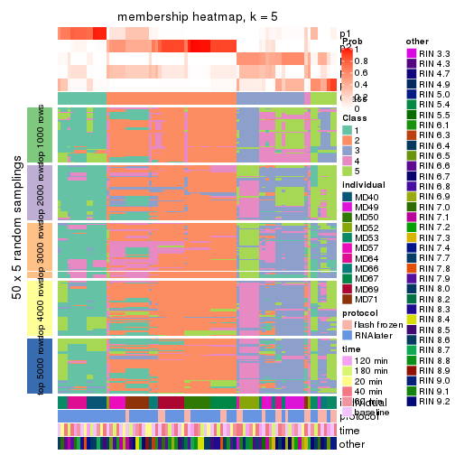</p>

</div>
<div id='tab-ATC-kmeans-membership-heatmap-5'>
<pre><code class="r">membership_heatmap(res, k = 6)
</code></pre>

<p></p>

</div>
</div>

As soon as we have had the classes for columns, we can look for signatures
which are significantly different between classes which can be candidate marks
for certain classes. Following are the heatmaps for signatures.


Signature heatmaps where rows are scaled:


<script>
$( function() {
	$( '#tabs-ATC-kmeans-get-signatures' ).tabs();
} );
</script>
<div id='tabs-ATC-kmeans-get-signatures'>
<ul>
<li><a href='#tab-ATC-kmeans-get-signatures-1'>k = 2</a></li>
<li><a href='#tab-ATC-kmeans-get-signatures-2'>k = 3</a></li>
<li><a href='#tab-ATC-kmeans-get-signatures-3'>k = 4</a></li>
<li><a href='#tab-ATC-kmeans-get-signatures-4'>k = 5</a></li>
<li><a href='#tab-ATC-kmeans-get-signatures-5'>k = 6</a></li>
</ul>
<div id='tab-ATC-kmeans-get-signatures-1'>
<pre><code class="r">get_signatures(res, k = 2)
</code></pre>

<p></p>

</div>
<div id='tab-ATC-kmeans-get-signatures-2'>
<pre><code class="r">get_signatures(res, k = 3)
</code></pre>

<p></p>

</div>
<div id='tab-ATC-kmeans-get-signatures-3'>
<pre><code class="r">get_signatures(res, k = 4)
</code></pre>

<p></p>

</div>
<div id='tab-ATC-kmeans-get-signatures-4'>
<pre><code class="r">get_signatures(res, k = 5)
</code></pre>

<p></p>

</div>
<div id='tab-ATC-kmeans-get-signatures-5'>
<pre><code class="r">get_signatures(res, k = 6)
</code></pre>

<p></p>

</div>
</div>


Signature heatmaps where rows are not scaled:


<script>
$( function() {
	$( '#tabs-ATC-kmeans-get-signatures-no-scale' ).tabs();
} );
</script>
<div id='tabs-ATC-kmeans-get-signatures-no-scale'>
<ul>
<li><a href='#tab-ATC-kmeans-get-signatures-no-scale-1'>k = 2</a></li>
<li><a href='#tab-ATC-kmeans-get-signatures-no-scale-2'>k = 3</a></li>
<li><a href='#tab-ATC-kmeans-get-signatures-no-scale-3'>k = 4</a></li>
<li><a href='#tab-ATC-kmeans-get-signatures-no-scale-4'>k = 5</a></li>
<li><a href='#tab-ATC-kmeans-get-signatures-no-scale-5'>k = 6</a></li>
</ul>
<div id='tab-ATC-kmeans-get-signatures-no-scale-1'>
<pre><code class="r">get_signatures(res, k = 2, scale_rows = FALSE)
</code></pre>

<p></p>

</div>
<div id='tab-ATC-kmeans-get-signatures-no-scale-2'>
<pre><code class="r">get_signatures(res, k = 3, scale_rows = FALSE)
</code></pre>

<p></p>

</div>
<div id='tab-ATC-kmeans-get-signatures-no-scale-3'>
<pre><code class="r">get_signatures(res, k = 4, scale_rows = FALSE)
</code></pre>

<p></p>

</div>
<div id='tab-ATC-kmeans-get-signatures-no-scale-4'>
<pre><code class="r">get_signatures(res, k = 5, scale_rows = FALSE)
</code></pre>

<p></p>

</div>
<div id='tab-ATC-kmeans-get-signatures-no-scale-5'>
<pre><code class="r">get_signatures(res, k = 6, scale_rows = FALSE)
</code></pre>

<p></p>

</div>
</div>


Compare the overlap of signatures from different k:

```r
compare_signatures(res)
```

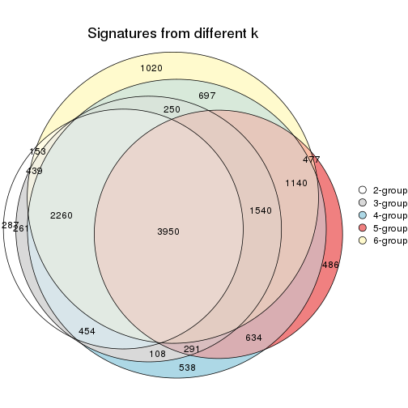

`get_signature()` returns a data frame invisibly. TO get the list of signatures, the function
call should be assigned to a variable explicitly. In following code, if `plot` argument is set
to `FALSE`, no heatmap is plotted while only the differential analysis is performed.

```r
# code only for demonstration
tb = get_signature(res, k = ..., plot = FALSE)
```

An example of the output of `tb` is:

```
#>   which_row         fdr    mean_1    mean_2 scaled_mean_1 scaled_mean_2 km
#> 1        38 0.042760348  8.373488  9.131774    -0.5533452     0.5164555  1
#> 2        40 0.018707592  7.106213  8.469186    -0.6173731     0.5762149  1
#> 3        55 0.019134737 10.221463 11.207825    -0.6159697     0.5749050  1
#> 4        59 0.006059896  5.921854  7.869574    -0.6899429     0.6439467  1
#> 5        60 0.018055526  8.928898 10.211722    -0.6204761     0.5791110  1
#> 6        98 0.009384629 15.714769 14.887706     0.6635654    -0.6193277  2
...
```

The columns in `tb` are:

1. `which_row`: row indices corresponding to the input matrix.
2. `fdr`: FDR for the differential test. 
3. `mean_x`: The mean value in group x.
4. `scaled_mean_x`: The mean value in group x after rows are scaled.
5. `km`: Row groups if k-means clustering is applied to rows.


UMAP plot which shows how samples are separated.


<script>
$( function() {
	$( '#tabs-ATC-kmeans-dimension-reduction' ).tabs();
} );
</script>
<div id='tabs-ATC-kmeans-dimension-reduction'>
<ul>
<li><a href='#tab-ATC-kmeans-dimension-reduction-1'>k = 2</a></li>
<li><a href='#tab-ATC-kmeans-dimension-reduction-2'>k = 3</a></li>
<li><a href='#tab-ATC-kmeans-dimension-reduction-3'>k = 4</a></li>
<li><a href='#tab-ATC-kmeans-dimension-reduction-4'>k = 5</a></li>
<li><a href='#tab-ATC-kmeans-dimension-reduction-5'>k = 6</a></li>
</ul>
<div id='tab-ATC-kmeans-dimension-reduction-1'>
<pre><code class="r">dimension_reduction(res, k = 2, method = &quot;UMAP&quot;)
</code></pre>

<p></p>

</div>
<div id='tab-ATC-kmeans-dimension-reduction-2'>
<pre><code class="r">dimension_reduction(res, k = 3, method = &quot;UMAP&quot;)
</code></pre>

<p></p>

</div>
<div id='tab-ATC-kmeans-dimension-reduction-3'>
<pre><code class="r">dimension_reduction(res, k = 4, method = &quot;UMAP&quot;)
</code></pre>

<p></p>

</div>
<div id='tab-ATC-kmeans-dimension-reduction-4'>
<pre><code class="r">dimension_reduction(res, k = 5, method = &quot;UMAP&quot;)
</code></pre>

<p></p>

</div>
<div id='tab-ATC-kmeans-dimension-reduction-5'>
<pre><code class="r">dimension_reduction(res, k = 6, method = &quot;UMAP&quot;)
</code></pre>

<p></p>

</div>
</div>


Following heatmap shows how subgroups are split when increasing `k`:

```r
collect_classes(res)
```


Test correlation between subgroups and known annotations. If the known
annotation is numeric, one-way ANOVA test is applied, and if the known
annotation is discrete, chi-squared contingency table test is applied.

```r
test_to_known_factors(res)
```

```
#>             n individual(p) protocol(p) time(p) other(p) k
#> ATC:kmeans 86      3.56e-06     0.01542   0.845   0.0109 2
#> ATC:kmeans 69      2.03e-12     0.02503   0.959   0.0777 3
#> ATC:kmeans 56      1.54e-14     0.13126   0.981   0.1328 4
#> ATC:kmeans 38      2.38e-11     0.00294   0.971   0.0140 5
#> ATC:kmeans 44      6.73e-17     0.34496   0.997   0.0447 6
```


If matrix rows can be associated to genes, consider to use `functional_enrichment(res,
...)` to perform function enrichment for the signature genes. See [this vignette](http://bioconductor.org/packages/devel/bioc/vignettes/cola/inst/doc/functional_enrichment.html) for more detailed explanations.


 

---------------------------------------------------


### ATC:skmeans**


The object with results only for a single top-value method and a single partition method 
can be extracted as:

```r
res = res_list["ATC", "skmeans"]
# you can also extract it by
# res = res_list["ATC:skmeans"]
```

A summary of `res` and all the functions that can be applied to it:

```r
res
```

```
#> A 'ConsensusPartition' object with k = 2, 3, 4, 5, 6.
#>   On a matrix with 21168 rows and 86 columns.
#>   Top rows (1000, 2000, 3000, 4000, 5000) are extracted by 'ATC' method.
#>   Subgroups are detected by 'skmeans' method.
#>   Performed in total 1250 partitions by row resampling.
#>   Best k for subgroups seems to be 3.
#> 
#> Following methods can be applied to this 'ConsensusPartition' object:
#>  [1] "cola_report"             "collect_classes"         "collect_plots"          
#>  [4] "collect_stats"           "colnames"                "compare_signatures"     
#>  [7] "consensus_heatmap"       "dimension_reduction"     "functional_enrichment"  
#> [10] "get_anno_col"            "get_anno"                "get_classes"            
#> [13] "get_consensus"           "get_matrix"              "get_membership"         
#> [16] "get_param"               "get_signatures"          "get_stats"              
#> [19] "is_best_k"               "is_stable_k"             "membership_heatmap"     
#> [22] "ncol"                    "nrow"                    "plot_ecdf"              
#> [25] "rownames"                "select_partition_number" "show"                   
#> [28] "suggest_best_k"          "test_to_known_factors"
```

`collect_plots()` function collects all the plots made from `res` for all `k` (number of partitions)
into one single page to provide an easy and fast comparison between different `k`.

```r
collect_plots(res)
```


The plots are:

- The first row: a plot of the ECDF (empirical cumulative distribution
  function) curves of the consensus matrix for each `k` and the heatmap of
  predicted classes for each `k`.
- The second row: heatmaps of the consensus matrix for each `k`.
- The third row: heatmaps of the membership matrix for each `k`.
- The fouth row: heatmaps of the signatures for each `k`.

All the plots in panels can be made by individual functions and they are
plotted later in this section.

`select_partition_number()` produces several plots showing different
statistics for choosing "optimized" `k`. There are following statistics:

- ECDF curves of the consensus matrix for each `k`;
- 1-PAC. [The PAC
  score](https://en.wikipedia.org/wiki/Consensus_clustering#Over-interpretation_potential_of_consensus_clustering)
  measures the proportion of the ambiguous subgrouping.
- Mean silhouette score.
- Concordance. The mean probability of fiting the consensus class ids in all
  partitions.
- Area increased. Denote $A_k$ as the area under the ECDF curve for current
  `k`, the area increased is defined as $A_k - A_{k-1}$.
- Rand index. The percent of pairs of samples that are both in a same cluster
  or both are not in a same cluster in the partition of k and k-1.
- Jaccard index. The ratio of pairs of samples are both in a same cluster in
  the partition of k and k-1 and the pairs of samples are both in a same
  cluster in the partition k or k-1.

The detailed explanations of these statistics can be found in [the _cola_
vignette](http://bioconductor.org/packages/devel/bioc/vignettes/cola/inst/doc/cola.html#toc_13).

Generally speaking, lower PAC score, higher mean silhouette score or higher
concordance corresponds to better partition. Rand index and Jaccard index
measure how similar the current partition is compared to partition with `k-1`.
If they are too similar, we won't accept `k` is better than `k-1`.

```r
select_partition_number(res)
```


The numeric values for all these statistics can be obtained by `get_stats()`.

```r
get_stats(res)
```

```
#>   k 1-PAC mean_silhouette concordance area_increased  Rand Jaccard
#> 2 2 1.000           0.978       0.991         0.4961 0.504   0.504
#> 3 3 0.963           0.957       0.979         0.2976 0.808   0.635
#> 4 4 0.722           0.701       0.847         0.1159 0.909   0.757
#> 5 5 0.728           0.726       0.810         0.0787 0.889   0.647
#> 6 6 0.714           0.706       0.807         0.0490 0.964   0.834
```

`suggest_best_k()` suggests the best $k$ based on these statistics. The rules are as follows:

- All $k$ with Jaccard index larger than 0.95 are removed because increasing
  $k$ does not provide enough extra information. If all $k$ are removed, it is
  marked as no subgroup is detected.
- For all $k$ with 1-PAC score larger than 0.9, the maximal $k$ is taken as
  the best $k$, and other $k$ are marked as optional $k$.
- If it does not fit the second rule. The $k$ with the maximal vote of the
  highest 1-PAC score, highest mean silhouette, and highest concordance is
  taken as the best $k$.

```r
suggest_best_k(res)
```

```
#> [1] 3
#> attr(,"optional")
#> [1] 2
```

There is also optional best $k$ = 2 that is worth to check.

Following shows the table of the partitions (You need to click the **show/hide
code output** link to see it). The membership matrix (columns with name `p*`)
is inferred by
[`clue::cl_consensus()`](https://www.rdocumentation.org/link/cl_consensus?package=clue)
function with the `SE` method. Basically the value in the membership matrix
represents the probability to belong to a certain group. The finall class
label for an item is determined with the group with highest probability it
belongs to.

In `get_classes()` function, the entropy is calculated from the membership
matrix and the silhouette score is calculated from the consensus matrix.


<script>
$( function() {
	$( '#tabs-ATC-skmeans-get-classes' ).tabs();
} );
</script>
<div id='tabs-ATC-skmeans-get-classes'>
<ul>
<li><a href='#tab-ATC-skmeans-get-classes-1'>k = 2</a></li>
<li><a href='#tab-ATC-skmeans-get-classes-2'>k = 3</a></li>
<li><a href='#tab-ATC-skmeans-get-classes-3'>k = 4</a></li>
<li><a href='#tab-ATC-skmeans-get-classes-4'>k = 5</a></li>
<li><a href='#tab-ATC-skmeans-get-classes-5'>k = 6</a></li>
</ul>

<div id='tab-ATC-skmeans-get-classes-1'>
<p><a id='tab-ATC-skmeans-get-classes-1-a' style='color:#0366d6' href='#'>show/hide code output</a></p>
<pre><code class="r">cbind(get_classes(res, k = 2), get_membership(res, k = 2))
</code></pre>

<pre><code>#&gt;           class entropy silhouette    p1    p2
#&gt; GSM614415     2  0.0000      0.993 0.000 1.000
#&gt; GSM614416     2  0.0000      0.993 0.000 1.000
#&gt; GSM614417     2  0.0000      0.993 0.000 1.000
#&gt; GSM614418     2  0.0000      0.993 0.000 1.000
#&gt; GSM614419     1  0.0000      0.987 1.000 0.000
#&gt; GSM614420     1  0.0000      0.987 1.000 0.000
#&gt; GSM614421     1  0.0000      0.987 1.000 0.000
#&gt; GSM614422     1  0.0000      0.987 1.000 0.000
#&gt; GSM614423     2  0.9358      0.450 0.352 0.648
#&gt; GSM614424     1  0.0000      0.987 1.000 0.000
#&gt; GSM614425     1  0.0000      0.987 1.000 0.000
#&gt; GSM614426     1  0.0000      0.987 1.000 0.000
#&gt; GSM614427     1  0.0000      0.987 1.000 0.000
#&gt; GSM614428     1  0.0000      0.987 1.000 0.000
#&gt; GSM614429     2  0.0000      0.993 0.000 1.000
#&gt; GSM614430     2  0.0000      0.993 0.000 1.000
#&gt; GSM614431     2  0.0000      0.993 0.000 1.000
#&gt; GSM614432     2  0.0000      0.993 0.000 1.000
#&gt; GSM614433     2  0.0000      0.993 0.000 1.000
#&gt; GSM614434     2  0.0000      0.993 0.000 1.000
#&gt; GSM614435     2  0.0000      0.993 0.000 1.000
#&gt; GSM614436     1  0.8081      0.674 0.752 0.248
#&gt; GSM614437     2  0.0000      0.993 0.000 1.000
#&gt; GSM614438     1  0.0000      0.987 1.000 0.000
#&gt; GSM614439     1  0.0000      0.987 1.000 0.000
#&gt; GSM614440     1  0.0000      0.987 1.000 0.000
#&gt; GSM614441     1  0.0000      0.987 1.000 0.000
#&gt; GSM614442     1  0.0000      0.987 1.000 0.000
#&gt; GSM614443     1  0.0000      0.987 1.000 0.000
#&gt; GSM614444     1  0.0000      0.987 1.000 0.000
#&gt; GSM614391     1  0.0000      0.987 1.000 0.000
#&gt; GSM614392     1  0.0376      0.984 0.996 0.004
#&gt; GSM614393     1  0.4431      0.896 0.908 0.092
#&gt; GSM614394     1  0.0000      0.987 1.000 0.000
#&gt; GSM614395     1  0.0000      0.987 1.000 0.000
#&gt; GSM614396     1  0.0000      0.987 1.000 0.000
#&gt; GSM614397     1  0.0000      0.987 1.000 0.000
#&gt; GSM614398     1  0.0000      0.987 1.000 0.000
#&gt; GSM614399     2  0.0000      0.993 0.000 1.000
#&gt; GSM614400     2  0.0000      0.993 0.000 1.000
#&gt; GSM614401     2  0.0000      0.993 0.000 1.000
#&gt; GSM614402     2  0.0000      0.993 0.000 1.000
#&gt; GSM614403     1  0.0000      0.987 1.000 0.000
#&gt; GSM614404     2  0.0000      0.993 0.000 1.000
#&gt; GSM614405     1  0.0000      0.987 1.000 0.000
#&gt; GSM614406     1  0.0000      0.987 1.000 0.000
#&gt; GSM614407     2  0.0000      0.993 0.000 1.000
#&gt; GSM614408     2  0.0000      0.993 0.000 1.000
#&gt; GSM614409     2  0.0000      0.993 0.000 1.000
#&gt; GSM614410     2  0.0000      0.993 0.000 1.000
#&gt; GSM614411     2  0.0000      0.993 0.000 1.000
#&gt; GSM614412     1  0.0000      0.987 1.000 0.000
#&gt; GSM614413     1  0.0000      0.987 1.000 0.000
#&gt; GSM614414     1  0.0000      0.987 1.000 0.000
#&gt; GSM614445     2  0.0000      0.993 0.000 1.000
#&gt; GSM614446     2  0.0000      0.993 0.000 1.000
#&gt; GSM614447     2  0.0000      0.993 0.000 1.000
#&gt; GSM614448     1  0.0000      0.987 1.000 0.000
#&gt; GSM614449     1  0.0000      0.987 1.000 0.000
#&gt; GSM614450     1  0.0000      0.987 1.000 0.000
#&gt; GSM614451     1  0.0000      0.987 1.000 0.000
#&gt; GSM614452     1  0.0000      0.987 1.000 0.000
#&gt; GSM614453     2  0.0000      0.993 0.000 1.000
#&gt; GSM614454     2  0.0000      0.993 0.000 1.000
#&gt; GSM614455     2  0.0000      0.993 0.000 1.000
#&gt; GSM614456     2  0.0000      0.993 0.000 1.000
#&gt; GSM614457     2  0.0000      0.993 0.000 1.000
#&gt; GSM614458     2  0.0000      0.993 0.000 1.000
#&gt; GSM614459     2  0.0000      0.993 0.000 1.000
#&gt; GSM614460     2  0.0000      0.993 0.000 1.000
#&gt; GSM614461     2  0.0000      0.993 0.000 1.000
#&gt; GSM614462     2  0.0000      0.993 0.000 1.000
#&gt; GSM614463     2  0.0000      0.993 0.000 1.000
#&gt; GSM614464     2  0.0000      0.993 0.000 1.000
#&gt; GSM614465     2  0.0000      0.993 0.000 1.000
#&gt; GSM614466     2  0.0000      0.993 0.000 1.000
#&gt; GSM614467     2  0.0000      0.993 0.000 1.000
#&gt; GSM614468     2  0.0000      0.993 0.000 1.000
#&gt; GSM614469     2  0.0000      0.993 0.000 1.000
#&gt; GSM614470     2  0.0000      0.993 0.000 1.000
#&gt; GSM614471     2  0.0000      0.993 0.000 1.000
#&gt; GSM614472     2  0.0000      0.993 0.000 1.000
#&gt; GSM614473     2  0.0000      0.993 0.000 1.000
#&gt; GSM614474     2  0.0000      0.993 0.000 1.000
#&gt; GSM614475     2  0.0000      0.993 0.000 1.000
#&gt; GSM614476     1  0.4939      0.879 0.892 0.108
</code></pre>

<script>
$('#tab-ATC-skmeans-get-classes-1-a').parent().next().next().hide();
$('#tab-ATC-skmeans-get-classes-1-a').click(function(){
  $('#tab-ATC-skmeans-get-classes-1-a').parent().next().next().toggle();
  return(false);
});
</script>
</div>

<div id='tab-ATC-skmeans-get-classes-2'>
<p><a id='tab-ATC-skmeans-get-classes-2-a' style='color:#0366d6' href='#'>show/hide code output</a></p>
<pre><code class="r">cbind(get_classes(res, k = 3), get_membership(res, k = 3))
</code></pre>

<pre><code>#&gt;           class entropy silhouette    p1    p2    p3
#&gt; GSM614415     1   0.000      0.961 1.000 0.000 0.000
#&gt; GSM614416     1   0.000      0.961 1.000 0.000 0.000
#&gt; GSM614417     1   0.000      0.961 1.000 0.000 0.000
#&gt; GSM614418     1   0.000      0.961 1.000 0.000 0.000
#&gt; GSM614419     1   0.263      0.900 0.916 0.000 0.084
#&gt; GSM614420     1   0.254      0.904 0.920 0.000 0.080
#&gt; GSM614421     3   0.000      0.968 0.000 0.000 1.000
#&gt; GSM614422     3   0.000      0.968 0.000 0.000 1.000
#&gt; GSM614423     1   0.000      0.961 1.000 0.000 0.000
#&gt; GSM614424     3   0.000      0.968 0.000 0.000 1.000
#&gt; GSM614425     3   0.000      0.968 0.000 0.000 1.000
#&gt; GSM614426     3   0.000      0.968 0.000 0.000 1.000
#&gt; GSM614427     3   0.000      0.968 0.000 0.000 1.000
#&gt; GSM614428     3   0.000      0.968 0.000 0.000 1.000
#&gt; GSM614429     2   0.000      0.989 0.000 1.000 0.000
#&gt; GSM614430     2   0.000      0.989 0.000 1.000 0.000
#&gt; GSM614431     2   0.000      0.989 0.000 1.000 0.000
#&gt; GSM614432     2   0.000      0.989 0.000 1.000 0.000
#&gt; GSM614433     2   0.000      0.989 0.000 1.000 0.000
#&gt; GSM614434     2   0.000      0.989 0.000 1.000 0.000
#&gt; GSM614435     2   0.000      0.989 0.000 1.000 0.000
#&gt; GSM614436     3   0.186      0.918 0.000 0.052 0.948
#&gt; GSM614437     2   0.304      0.880 0.000 0.896 0.104
#&gt; GSM614438     3   0.000      0.968 0.000 0.000 1.000
#&gt; GSM614439     3   0.000      0.968 0.000 0.000 1.000
#&gt; GSM614440     3   0.000      0.968 0.000 0.000 1.000
#&gt; GSM614441     3   0.000      0.968 0.000 0.000 1.000
#&gt; GSM614442     3   0.000      0.968 0.000 0.000 1.000
#&gt; GSM614443     3   0.000      0.968 0.000 0.000 1.000
#&gt; GSM614444     3   0.000      0.968 0.000 0.000 1.000
#&gt; GSM614391     1   0.000      0.961 1.000 0.000 0.000
#&gt; GSM614392     1   0.000      0.961 1.000 0.000 0.000
#&gt; GSM614393     1   0.000      0.961 1.000 0.000 0.000
#&gt; GSM614394     1   0.493      0.721 0.768 0.000 0.232
#&gt; GSM614395     3   0.000      0.968 0.000 0.000 1.000
#&gt; GSM614396     1   0.493      0.721 0.768 0.000 0.232
#&gt; GSM614397     3   0.296      0.884 0.100 0.000 0.900
#&gt; GSM614398     3   0.296      0.884 0.100 0.000 0.900
#&gt; GSM614399     2   0.000      0.989 0.000 1.000 0.000
#&gt; GSM614400     2   0.000      0.989 0.000 1.000 0.000
#&gt; GSM614401     2   0.000      0.989 0.000 1.000 0.000
#&gt; GSM614402     2   0.000      0.989 0.000 1.000 0.000
#&gt; GSM614403     3   0.000      0.968 0.000 0.000 1.000
#&gt; GSM614404     2   0.000      0.989 0.000 1.000 0.000
#&gt; GSM614405     3   0.000      0.968 0.000 0.000 1.000
#&gt; GSM614406     3   0.000      0.968 0.000 0.000 1.000
#&gt; GSM614407     1   0.000      0.961 1.000 0.000 0.000
#&gt; GSM614408     1   0.000      0.961 1.000 0.000 0.000
#&gt; GSM614409     1   0.000      0.961 1.000 0.000 0.000
#&gt; GSM614410     1   0.000      0.961 1.000 0.000 0.000
#&gt; GSM614411     1   0.000      0.961 1.000 0.000 0.000
#&gt; GSM614412     1   0.000      0.961 1.000 0.000 0.000
#&gt; GSM614413     3   0.296      0.884 0.100 0.000 0.900
#&gt; GSM614414     3   0.304      0.880 0.104 0.000 0.896
#&gt; GSM614445     2   0.000      0.989 0.000 1.000 0.000
#&gt; GSM614446     2   0.000      0.989 0.000 1.000 0.000
#&gt; GSM614447     2   0.000      0.989 0.000 1.000 0.000
#&gt; GSM614448     3   0.000      0.968 0.000 0.000 1.000
#&gt; GSM614449     3   0.000      0.968 0.000 0.000 1.000
#&gt; GSM614450     3   0.000      0.968 0.000 0.000 1.000
#&gt; GSM614451     3   0.000      0.968 0.000 0.000 1.000
#&gt; GSM614452     3   0.000      0.968 0.000 0.000 1.000
#&gt; GSM614453     2   0.000      0.989 0.000 1.000 0.000
#&gt; GSM614454     2   0.000      0.989 0.000 1.000 0.000
#&gt; GSM614455     2   0.000      0.989 0.000 1.000 0.000
#&gt; GSM614456     2   0.000      0.989 0.000 1.000 0.000
#&gt; GSM614457     2   0.000      0.989 0.000 1.000 0.000
#&gt; GSM614458     2   0.000      0.989 0.000 1.000 0.000
#&gt; GSM614459     2   0.000      0.989 0.000 1.000 0.000
#&gt; GSM614460     2   0.000      0.989 0.000 1.000 0.000
#&gt; GSM614461     2   0.000      0.989 0.000 1.000 0.000
#&gt; GSM614462     2   0.000      0.989 0.000 1.000 0.000
#&gt; GSM614463     2   0.000      0.989 0.000 1.000 0.000
#&gt; GSM614464     2   0.000      0.989 0.000 1.000 0.000
#&gt; GSM614465     2   0.000      0.989 0.000 1.000 0.000
#&gt; GSM614466     2   0.000      0.989 0.000 1.000 0.000
#&gt; GSM614467     2   0.000      0.989 0.000 1.000 0.000
#&gt; GSM614468     2   0.000      0.989 0.000 1.000 0.000
#&gt; GSM614469     2   0.153      0.963 0.040 0.960 0.000
#&gt; GSM614470     2   0.153      0.963 0.040 0.960 0.000
#&gt; GSM614471     2   0.153      0.963 0.040 0.960 0.000
#&gt; GSM614472     2   0.153      0.963 0.040 0.960 0.000
#&gt; GSM614473     2   0.153      0.963 0.040 0.960 0.000
#&gt; GSM614474     2   0.153      0.963 0.040 0.960 0.000
#&gt; GSM614475     2   0.153      0.963 0.040 0.960 0.000
#&gt; GSM614476     3   0.721      0.547 0.060 0.272 0.668
</code></pre>

<script>
$('#tab-ATC-skmeans-get-classes-2-a').parent().next().next().hide();
$('#tab-ATC-skmeans-get-classes-2-a').click(function(){
  $('#tab-ATC-skmeans-get-classes-2-a').parent().next().next().toggle();
  return(false);
});
</script>
</div>

<div id='tab-ATC-skmeans-get-classes-3'>
<p><a id='tab-ATC-skmeans-get-classes-3-a' style='color:#0366d6' href='#'>show/hide code output</a></p>
<pre><code class="r">cbind(get_classes(res, k = 4), get_membership(res, k = 4))
</code></pre>

<pre><code>#&gt;           class entropy silhouette    p1    p2    p3    p4
#&gt; GSM614415     1  0.0000     0.8376 1.000 0.000 0.000 0.000
#&gt; GSM614416     1  0.0000     0.8376 1.000 0.000 0.000 0.000
#&gt; GSM614417     1  0.0000     0.8376 1.000 0.000 0.000 0.000
#&gt; GSM614418     1  0.0000     0.8376 1.000 0.000 0.000 0.000
#&gt; GSM614419     1  0.5088     0.4831 0.572 0.000 0.424 0.004
#&gt; GSM614420     1  0.5088     0.4831 0.572 0.000 0.424 0.004
#&gt; GSM614421     3  0.1022     0.7024 0.000 0.000 0.968 0.032
#&gt; GSM614422     3  0.1022     0.7024 0.000 0.000 0.968 0.032
#&gt; GSM614423     3  0.6243     0.0661 0.392 0.000 0.548 0.060
#&gt; GSM614424     3  0.1022     0.7024 0.000 0.000 0.968 0.032
#&gt; GSM614425     3  0.1022     0.7024 0.000 0.000 0.968 0.032
#&gt; GSM614426     3  0.1022     0.7024 0.000 0.000 0.968 0.032
#&gt; GSM614427     3  0.1022     0.7024 0.000 0.000 0.968 0.032
#&gt; GSM614428     3  0.1022     0.7024 0.000 0.000 0.968 0.032
#&gt; GSM614429     2  0.0592     0.8812 0.000 0.984 0.000 0.016
#&gt; GSM614430     2  0.0592     0.8812 0.000 0.984 0.000 0.016
#&gt; GSM614431     2  0.0592     0.8812 0.000 0.984 0.000 0.016
#&gt; GSM614432     2  0.0592     0.8812 0.000 0.984 0.000 0.016
#&gt; GSM614433     2  0.0592     0.8812 0.000 0.984 0.000 0.016
#&gt; GSM614434     2  0.0592     0.8812 0.000 0.984 0.000 0.016
#&gt; GSM614435     2  0.0592     0.8812 0.000 0.984 0.000 0.016
#&gt; GSM614436     4  0.3591     0.6639 0.000 0.168 0.008 0.824
#&gt; GSM614437     4  0.3024     0.6838 0.000 0.148 0.000 0.852
#&gt; GSM614438     4  0.2973     0.8251 0.000 0.000 0.144 0.856
#&gt; GSM614439     4  0.2973     0.8251 0.000 0.000 0.144 0.856
#&gt; GSM614440     4  0.2973     0.8251 0.000 0.000 0.144 0.856
#&gt; GSM614441     4  0.2973     0.8251 0.000 0.000 0.144 0.856
#&gt; GSM614442     4  0.2973     0.8251 0.000 0.000 0.144 0.856
#&gt; GSM614443     4  0.2760     0.8163 0.000 0.000 0.128 0.872
#&gt; GSM614444     4  0.2973     0.8251 0.000 0.000 0.144 0.856
#&gt; GSM614391     1  0.5060     0.5035 0.584 0.000 0.412 0.004
#&gt; GSM614392     1  0.3583     0.7590 0.816 0.000 0.180 0.004
#&gt; GSM614393     1  0.3448     0.7670 0.828 0.000 0.168 0.004
#&gt; GSM614394     3  0.5050    -0.1207 0.408 0.000 0.588 0.004
#&gt; GSM614395     3  0.0592     0.6983 0.000 0.000 0.984 0.016
#&gt; GSM614396     3  0.5028    -0.0945 0.400 0.000 0.596 0.004
#&gt; GSM614397     3  0.0592     0.6861 0.016 0.000 0.984 0.000
#&gt; GSM614398     3  0.0592     0.6861 0.016 0.000 0.984 0.000
#&gt; GSM614399     2  0.5010     0.7801 0.108 0.772 0.000 0.120
#&gt; GSM614400     2  0.5010     0.7801 0.108 0.772 0.000 0.120
#&gt; GSM614401     2  0.5010     0.7801 0.108 0.772 0.000 0.120
#&gt; GSM614402     2  0.5010     0.7801 0.108 0.772 0.000 0.120
#&gt; GSM614403     3  0.4877     0.3659 0.000 0.000 0.592 0.408
#&gt; GSM614404     2  0.5010     0.7801 0.108 0.772 0.000 0.120
#&gt; GSM614405     3  0.4941     0.2944 0.000 0.000 0.564 0.436
#&gt; GSM614406     3  0.4941     0.2790 0.000 0.000 0.564 0.436
#&gt; GSM614407     1  0.0817     0.8298 0.976 0.000 0.000 0.024
#&gt; GSM614408     1  0.0817     0.8298 0.976 0.000 0.000 0.024
#&gt; GSM614409     1  0.0188     0.8366 0.996 0.000 0.000 0.004
#&gt; GSM614410     1  0.0817     0.8298 0.976 0.000 0.000 0.024
#&gt; GSM614411     1  0.0817     0.8298 0.976 0.000 0.000 0.024
#&gt; GSM614412     1  0.3726     0.7334 0.788 0.000 0.212 0.000
#&gt; GSM614413     3  0.0524     0.6918 0.008 0.000 0.988 0.004
#&gt; GSM614414     3  0.0895     0.6866 0.020 0.000 0.976 0.004
#&gt; GSM614445     2  0.1211     0.8693 0.000 0.960 0.000 0.040
#&gt; GSM614446     2  0.2214     0.8548 0.000 0.928 0.028 0.044
#&gt; GSM614447     2  0.1302     0.8684 0.000 0.956 0.000 0.044
#&gt; GSM614448     3  0.4898     0.3282 0.000 0.000 0.584 0.416
#&gt; GSM614449     3  0.4925     0.3220 0.000 0.000 0.572 0.428
#&gt; GSM614450     3  0.4933     0.3134 0.000 0.000 0.568 0.432
#&gt; GSM614451     3  0.4790     0.3904 0.000 0.000 0.620 0.380
#&gt; GSM614452     3  0.4790     0.3904 0.000 0.000 0.620 0.380
#&gt; GSM614453     2  0.0592     0.8812 0.000 0.984 0.000 0.016
#&gt; GSM614454     2  0.0592     0.8812 0.000 0.984 0.000 0.016
#&gt; GSM614455     2  0.0592     0.8812 0.000 0.984 0.000 0.016
#&gt; GSM614456     2  0.0592     0.8812 0.000 0.984 0.000 0.016
#&gt; GSM614457     2  0.0592     0.8812 0.000 0.984 0.000 0.016
#&gt; GSM614458     2  0.0592     0.8812 0.000 0.984 0.000 0.016
#&gt; GSM614459     2  0.0592     0.8812 0.000 0.984 0.000 0.016
#&gt; GSM614460     2  0.0592     0.8812 0.000 0.984 0.000 0.016
#&gt; GSM614461     2  0.0000     0.8810 0.000 1.000 0.000 0.000
#&gt; GSM614462     2  0.0000     0.8810 0.000 1.000 0.000 0.000
#&gt; GSM614463     2  0.0000     0.8810 0.000 1.000 0.000 0.000
#&gt; GSM614464     2  0.0000     0.8810 0.000 1.000 0.000 0.000
#&gt; GSM614465     2  0.0000     0.8810 0.000 1.000 0.000 0.000
#&gt; GSM614466     2  0.0000     0.8810 0.000 1.000 0.000 0.000
#&gt; GSM614467     2  0.0188     0.8813 0.000 0.996 0.000 0.004
#&gt; GSM614468     2  0.0188     0.8813 0.000 0.996 0.000 0.004
#&gt; GSM614469     2  0.6566     0.6065 0.288 0.600 0.000 0.112
#&gt; GSM614470     2  0.6566     0.6065 0.288 0.600 0.000 0.112
#&gt; GSM614471     2  0.6566     0.6065 0.288 0.600 0.000 0.112
#&gt; GSM614472     2  0.6566     0.6065 0.288 0.600 0.000 0.112
#&gt; GSM614473     2  0.6566     0.6065 0.288 0.600 0.000 0.112
#&gt; GSM614474     2  0.6566     0.6065 0.288 0.600 0.000 0.112
#&gt; GSM614475     2  0.6566     0.6065 0.288 0.600 0.000 0.112
#&gt; GSM614476     4  0.8486     0.0346 0.244 0.028 0.328 0.400
</code></pre>

<script>
$('#tab-ATC-skmeans-get-classes-3-a').parent().next().next().hide();
$('#tab-ATC-skmeans-get-classes-3-a').click(function(){
  $('#tab-ATC-skmeans-get-classes-3-a').parent().next().next().toggle();
  return(false);
});
</script>
</div>

<div id='tab-ATC-skmeans-get-classes-4'>
<p><a id='tab-ATC-skmeans-get-classes-4-a' style='color:#0366d6' href='#'>show/hide code output</a></p>
<pre><code class="r">cbind(get_classes(res, k = 5), get_membership(res, k = 5))
</code></pre>

<pre><code>#&gt;           class entropy silhouette    p1    p2    p3    p4    p5
#&gt; GSM614415     5  0.1792     0.7380 0.084 0.000 0.000 0.000 0.916
#&gt; GSM614416     5  0.1792     0.7380 0.084 0.000 0.000 0.000 0.916
#&gt; GSM614417     5  0.1792     0.7380 0.084 0.000 0.000 0.000 0.916
#&gt; GSM614418     5  0.1792     0.7380 0.084 0.000 0.000 0.000 0.916
#&gt; GSM614419     5  0.4573     0.6018 0.044 0.000 0.256 0.000 0.700
#&gt; GSM614420     5  0.4547     0.6070 0.044 0.000 0.252 0.000 0.704
#&gt; GSM614421     3  0.0609     0.7596 0.000 0.000 0.980 0.020 0.000
#&gt; GSM614422     3  0.0609     0.7596 0.000 0.000 0.980 0.020 0.000
#&gt; GSM614423     3  0.5941     0.3237 0.096 0.000 0.600 0.016 0.288
#&gt; GSM614424     3  0.0703     0.7588 0.000 0.000 0.976 0.024 0.000
#&gt; GSM614425     3  0.0609     0.7596 0.000 0.000 0.980 0.020 0.000
#&gt; GSM614426     3  0.0609     0.7596 0.000 0.000 0.980 0.020 0.000
#&gt; GSM614427     3  0.0609     0.7596 0.000 0.000 0.980 0.020 0.000
#&gt; GSM614428     3  0.0609     0.7596 0.000 0.000 0.980 0.020 0.000
#&gt; GSM614429     2  0.0162     0.8957 0.000 0.996 0.000 0.004 0.000
#&gt; GSM614430     2  0.0162     0.8957 0.000 0.996 0.000 0.004 0.000
#&gt; GSM614431     2  0.0000     0.8957 0.000 1.000 0.000 0.000 0.000
#&gt; GSM614432     2  0.0000     0.8957 0.000 1.000 0.000 0.000 0.000
#&gt; GSM614433     2  0.0000     0.8957 0.000 1.000 0.000 0.000 0.000
#&gt; GSM614434     2  0.0000     0.8957 0.000 1.000 0.000 0.000 0.000
#&gt; GSM614435     2  0.0579     0.8930 0.008 0.984 0.000 0.008 0.000
#&gt; GSM614436     4  0.3086     0.7383 0.004 0.180 0.000 0.816 0.000
#&gt; GSM614437     4  0.1892     0.8545 0.000 0.080 0.000 0.916 0.004
#&gt; GSM614438     4  0.1544     0.9413 0.000 0.000 0.068 0.932 0.000
#&gt; GSM614439     4  0.1544     0.9413 0.000 0.000 0.068 0.932 0.000
#&gt; GSM614440     4  0.1544     0.9413 0.000 0.000 0.068 0.932 0.000
#&gt; GSM614441     4  0.1544     0.9413 0.000 0.000 0.068 0.932 0.000
#&gt; GSM614442     4  0.1544     0.9413 0.000 0.000 0.068 0.932 0.000
#&gt; GSM614443     4  0.1628     0.9307 0.000 0.008 0.056 0.936 0.000
#&gt; GSM614444     4  0.1544     0.9413 0.000 0.000 0.068 0.932 0.000
#&gt; GSM614391     5  0.4547     0.6067 0.044 0.000 0.252 0.000 0.704
#&gt; GSM614392     5  0.2983     0.7152 0.040 0.000 0.096 0.000 0.864
#&gt; GSM614393     5  0.2983     0.7152 0.040 0.000 0.096 0.000 0.864
#&gt; GSM614394     5  0.5232     0.2467 0.044 0.000 0.456 0.000 0.500
#&gt; GSM614395     3  0.2554     0.7196 0.020 0.000 0.896 0.008 0.076
#&gt; GSM614396     5  0.5238     0.2015 0.044 0.000 0.472 0.000 0.484
#&gt; GSM614397     3  0.2824     0.6836 0.020 0.000 0.864 0.000 0.116
#&gt; GSM614398     3  0.2824     0.6836 0.020 0.000 0.864 0.000 0.116
#&gt; GSM614399     1  0.5550     0.7419 0.600 0.336 0.000 0.032 0.032
#&gt; GSM614400     1  0.5550     0.7419 0.600 0.336 0.000 0.032 0.032
#&gt; GSM614401     1  0.5550     0.7419 0.600 0.336 0.000 0.032 0.032
#&gt; GSM614402     1  0.5300     0.7236 0.632 0.312 0.000 0.032 0.024
#&gt; GSM614403     3  0.6450     0.4444 0.296 0.000 0.492 0.212 0.000
#&gt; GSM614404     1  0.5550     0.7419 0.600 0.336 0.000 0.032 0.032
#&gt; GSM614405     3  0.5721     0.2926 0.084 0.000 0.492 0.424 0.000
#&gt; GSM614406     3  0.4256     0.3385 0.000 0.000 0.564 0.436 0.000
#&gt; GSM614407     5  0.3491     0.6544 0.228 0.000 0.000 0.004 0.768
#&gt; GSM614408     5  0.3491     0.6544 0.228 0.000 0.000 0.004 0.768
#&gt; GSM614409     5  0.2890     0.7067 0.160 0.000 0.000 0.004 0.836
#&gt; GSM614410     5  0.3491     0.6544 0.228 0.000 0.000 0.004 0.768
#&gt; GSM614411     5  0.3491     0.6544 0.228 0.000 0.000 0.004 0.768
#&gt; GSM614412     5  0.2972     0.7193 0.024 0.000 0.108 0.004 0.864
#&gt; GSM614413     3  0.2720     0.6980 0.020 0.000 0.880 0.004 0.096
#&gt; GSM614414     3  0.2720     0.6980 0.020 0.000 0.880 0.004 0.096
#&gt; GSM614445     2  0.5240     0.3015 0.360 0.584 0.000 0.056 0.000
#&gt; GSM614446     2  0.6801     0.0773 0.412 0.448 0.084 0.056 0.000
#&gt; GSM614447     2  0.5961     0.1951 0.408 0.512 0.024 0.056 0.000
#&gt; GSM614448     3  0.5972     0.4686 0.140 0.000 0.560 0.300 0.000
#&gt; GSM614449     3  0.6458     0.4395 0.240 0.000 0.500 0.260 0.000
#&gt; GSM614450     3  0.6649     0.3730 0.284 0.000 0.448 0.268 0.000
#&gt; GSM614451     3  0.3561     0.6042 0.000 0.000 0.740 0.260 0.000
#&gt; GSM614452     3  0.3508     0.6117 0.000 0.000 0.748 0.252 0.000
#&gt; GSM614453     2  0.0740     0.8934 0.008 0.980 0.000 0.008 0.004
#&gt; GSM614454     2  0.0740     0.8934 0.008 0.980 0.000 0.008 0.004
#&gt; GSM614455     2  0.0740     0.8934 0.008 0.980 0.000 0.008 0.004
#&gt; GSM614456     2  0.0740     0.8934 0.008 0.980 0.000 0.008 0.004
#&gt; GSM614457     2  0.0740     0.8934 0.008 0.980 0.000 0.008 0.004
#&gt; GSM614458     2  0.0740     0.8934 0.008 0.980 0.000 0.008 0.004
#&gt; GSM614459     2  0.0740     0.8934 0.008 0.980 0.000 0.008 0.004
#&gt; GSM614460     2  0.0740     0.8934 0.008 0.980 0.000 0.008 0.004
#&gt; GSM614461     2  0.1357     0.8703 0.048 0.948 0.000 0.004 0.000
#&gt; GSM614462     2  0.1357     0.8703 0.048 0.948 0.000 0.004 0.000
#&gt; GSM614463     2  0.1357     0.8703 0.048 0.948 0.000 0.004 0.000
#&gt; GSM614464     2  0.1041     0.8812 0.032 0.964 0.000 0.004 0.000
#&gt; GSM614465     2  0.1357     0.8703 0.048 0.948 0.000 0.004 0.000
#&gt; GSM614466     2  0.1357     0.8703 0.048 0.948 0.000 0.004 0.000
#&gt; GSM614467     2  0.1205     0.8794 0.040 0.956 0.000 0.004 0.000
#&gt; GSM614468     2  0.1357     0.8771 0.048 0.948 0.000 0.004 0.000
#&gt; GSM614469     1  0.5594     0.8325 0.608 0.284 0.000 0.000 0.108
#&gt; GSM614470     1  0.5594     0.8325 0.608 0.284 0.000 0.000 0.108
#&gt; GSM614471     1  0.5594     0.8325 0.608 0.284 0.000 0.000 0.108
#&gt; GSM614472     1  0.5594     0.8325 0.608 0.284 0.000 0.000 0.108
#&gt; GSM614473     1  0.5594     0.8325 0.608 0.284 0.000 0.000 0.108
#&gt; GSM614474     1  0.5575     0.8308 0.612 0.280 0.000 0.000 0.108
#&gt; GSM614475     1  0.5515     0.8230 0.624 0.268 0.000 0.000 0.108
#&gt; GSM614476     1  0.7168     0.4015 0.596 0.048 0.208 0.044 0.104
</code></pre>

<script>
$('#tab-ATC-skmeans-get-classes-4-a').parent().next().next().hide();
$('#tab-ATC-skmeans-get-classes-4-a').click(function(){
  $('#tab-ATC-skmeans-get-classes-4-a').parent().next().next().toggle();
  return(false);
});
</script>
</div>

<div id='tab-ATC-skmeans-get-classes-5'>
<p><a id='tab-ATC-skmeans-get-classes-5-a' style='color:#0366d6' href='#'>show/hide code output</a></p>
<pre><code class="r">cbind(get_classes(res, k = 6), get_membership(res, k = 6))
</code></pre>

<pre><code>#&gt;           class entropy silhouette    p1    p2    p3    p4    p5    p6
#&gt; GSM614415     5  0.5312      0.673 0.208 0.000 0.000 0.024 0.648 0.120
#&gt; GSM614416     5  0.5312      0.673 0.208 0.000 0.000 0.024 0.648 0.120
#&gt; GSM614417     5  0.5312      0.673 0.208 0.000 0.000 0.024 0.648 0.120
#&gt; GSM614418     5  0.5312      0.673 0.208 0.000 0.000 0.024 0.648 0.120
#&gt; GSM614419     5  0.2579      0.592 0.004 0.000 0.088 0.000 0.876 0.032
#&gt; GSM614420     5  0.2579      0.592 0.004 0.000 0.088 0.000 0.876 0.032
#&gt; GSM614421     3  0.0260      0.727 0.000 0.000 0.992 0.000 0.000 0.008
#&gt; GSM614422     3  0.0260      0.727 0.000 0.000 0.992 0.000 0.000 0.008
#&gt; GSM614423     3  0.6204      0.349 0.088 0.000 0.636 0.024 0.140 0.112
#&gt; GSM614424     3  0.0260      0.727 0.000 0.000 0.992 0.000 0.000 0.008
#&gt; GSM614425     3  0.0260      0.727 0.000 0.000 0.992 0.000 0.000 0.008
#&gt; GSM614426     3  0.0260      0.727 0.000 0.000 0.992 0.000 0.000 0.008
#&gt; GSM614427     3  0.0260      0.727 0.000 0.000 0.992 0.000 0.000 0.008
#&gt; GSM614428     3  0.0260      0.726 0.000 0.000 0.992 0.008 0.000 0.000
#&gt; GSM614429     2  0.0146      0.931 0.000 0.996 0.000 0.000 0.000 0.004
#&gt; GSM614430     2  0.0000      0.931 0.000 1.000 0.000 0.000 0.000 0.000
#&gt; GSM614431     2  0.0260      0.931 0.000 0.992 0.000 0.000 0.000 0.008
#&gt; GSM614432     2  0.0260      0.931 0.000 0.992 0.000 0.000 0.000 0.008
#&gt; GSM614433     2  0.0260      0.931 0.000 0.992 0.000 0.000 0.000 0.008
#&gt; GSM614434     2  0.0146      0.931 0.000 0.996 0.000 0.000 0.000 0.004
#&gt; GSM614435     2  0.0146      0.931 0.000 0.996 0.000 0.000 0.000 0.004
#&gt; GSM614436     4  0.3599      0.669 0.004 0.212 0.016 0.764 0.000 0.004
#&gt; GSM614437     4  0.1152      0.888 0.000 0.044 0.000 0.952 0.000 0.004
#&gt; GSM614438     4  0.1075      0.949 0.000 0.000 0.048 0.952 0.000 0.000
#&gt; GSM614439     4  0.1075      0.949 0.000 0.000 0.048 0.952 0.000 0.000
#&gt; GSM614440     4  0.1075      0.949 0.000 0.000 0.048 0.952 0.000 0.000
#&gt; GSM614441     4  0.1075      0.949 0.000 0.000 0.048 0.952 0.000 0.000
#&gt; GSM614442     4  0.1075      0.949 0.000 0.000 0.048 0.952 0.000 0.000
#&gt; GSM614443     4  0.0937      0.943 0.000 0.000 0.040 0.960 0.000 0.000
#&gt; GSM614444     4  0.1075      0.949 0.000 0.000 0.048 0.952 0.000 0.000
#&gt; GSM614391     5  0.1556      0.578 0.000 0.000 0.080 0.000 0.920 0.000
#&gt; GSM614392     5  0.0551      0.626 0.004 0.000 0.008 0.000 0.984 0.004
#&gt; GSM614393     5  0.0551      0.626 0.004 0.000 0.008 0.000 0.984 0.004
#&gt; GSM614394     5  0.3288      0.264 0.000 0.000 0.276 0.000 0.724 0.000
#&gt; GSM614395     3  0.3349      0.651 0.000 0.000 0.748 0.008 0.244 0.000
#&gt; GSM614396     5  0.3371      0.225 0.000 0.000 0.292 0.000 0.708 0.000
#&gt; GSM614397     3  0.3758      0.597 0.000 0.000 0.668 0.008 0.324 0.000
#&gt; GSM614398     3  0.3668      0.594 0.000 0.000 0.668 0.004 0.328 0.000
#&gt; GSM614399     1  0.5778      0.555 0.516 0.184 0.000 0.000 0.004 0.296
#&gt; GSM614400     1  0.5778      0.555 0.516 0.184 0.000 0.000 0.004 0.296
#&gt; GSM614401     1  0.5778      0.555 0.516 0.184 0.000 0.000 0.004 0.296
#&gt; GSM614402     1  0.5729      0.544 0.516 0.168 0.000 0.000 0.004 0.312
#&gt; GSM614403     6  0.4670      0.558 0.012 0.000 0.264 0.040 0.008 0.676
#&gt; GSM614404     1  0.5778      0.555 0.516 0.184 0.000 0.000 0.004 0.296
#&gt; GSM614405     3  0.6192      0.208 0.012 0.000 0.484 0.300 0.004 0.200
#&gt; GSM614406     3  0.3727      0.389 0.000 0.000 0.612 0.388 0.000 0.000
#&gt; GSM614407     5  0.6633      0.545 0.372 0.000 0.000 0.040 0.384 0.204
#&gt; GSM614408     5  0.6633      0.545 0.372 0.000 0.000 0.040 0.384 0.204
#&gt; GSM614409     5  0.6590      0.585 0.324 0.000 0.000 0.040 0.432 0.204
#&gt; GSM614410     5  0.6633      0.545 0.372 0.000 0.000 0.040 0.384 0.204
#&gt; GSM614411     5  0.6633      0.545 0.372 0.000 0.000 0.040 0.384 0.204
#&gt; GSM614412     5  0.5680      0.643 0.104 0.000 0.012 0.040 0.648 0.196
#&gt; GSM614413     3  0.4425      0.634 0.000 0.000 0.704 0.012 0.232 0.052
#&gt; GSM614414     3  0.4450      0.632 0.000 0.000 0.700 0.012 0.236 0.052
#&gt; GSM614445     6  0.4757      0.393 0.084 0.280 0.000 0.000 0.000 0.636
#&gt; GSM614446     6  0.4440      0.603 0.028 0.132 0.088 0.000 0.000 0.752
#&gt; GSM614447     6  0.4077      0.530 0.044 0.212 0.008 0.000 0.000 0.736
#&gt; GSM614448     3  0.5292     -0.107 0.000 0.000 0.520 0.108 0.000 0.372
#&gt; GSM614449     6  0.5110      0.235 0.000 0.000 0.440 0.080 0.000 0.480
#&gt; GSM614450     6  0.4652      0.514 0.000 0.000 0.312 0.064 0.000 0.624
#&gt; GSM614451     3  0.2260      0.668 0.000 0.000 0.860 0.140 0.000 0.000
#&gt; GSM614452     3  0.2219      0.669 0.000 0.000 0.864 0.136 0.000 0.000
#&gt; GSM614453     2  0.1223      0.925 0.012 0.960 0.000 0.008 0.004 0.016
#&gt; GSM614454     2  0.1223      0.925 0.012 0.960 0.000 0.008 0.004 0.016
#&gt; GSM614455     2  0.1223      0.925 0.012 0.960 0.000 0.008 0.004 0.016
#&gt; GSM614456     2  0.1223      0.925 0.012 0.960 0.000 0.008 0.004 0.016
#&gt; GSM614457     2  0.1223      0.925 0.012 0.960 0.000 0.008 0.004 0.016
#&gt; GSM614458     2  0.1223      0.925 0.012 0.960 0.000 0.008 0.004 0.016
#&gt; GSM614459     2  0.1223      0.925 0.012 0.960 0.000 0.008 0.004 0.016
#&gt; GSM614460     2  0.1223      0.925 0.012 0.960 0.000 0.008 0.004 0.016
#&gt; GSM614461     2  0.2542      0.885 0.044 0.876 0.000 0.000 0.000 0.080
#&gt; GSM614462     2  0.2542      0.885 0.044 0.876 0.000 0.000 0.000 0.080
#&gt; GSM614463     2  0.2542      0.885 0.044 0.876 0.000 0.000 0.000 0.080
#&gt; GSM614464     2  0.2331      0.892 0.032 0.888 0.000 0.000 0.000 0.080
#&gt; GSM614465     2  0.2542      0.885 0.044 0.876 0.000 0.000 0.000 0.080
#&gt; GSM614466     2  0.2542      0.885 0.044 0.876 0.000 0.000 0.000 0.080
#&gt; GSM614467     2  0.2457      0.890 0.036 0.880 0.000 0.000 0.000 0.084
#&gt; GSM614468     2  0.2660      0.883 0.048 0.868 0.000 0.000 0.000 0.084
#&gt; GSM614469     1  0.1958      0.768 0.896 0.100 0.000 0.000 0.004 0.000
#&gt; GSM614470     1  0.1958      0.768 0.896 0.100 0.000 0.000 0.004 0.000
#&gt; GSM614471     1  0.1958      0.768 0.896 0.100 0.000 0.000 0.004 0.000
#&gt; GSM614472     1  0.1958      0.768 0.896 0.100 0.000 0.000 0.004 0.000
#&gt; GSM614473     1  0.1958      0.768 0.896 0.100 0.000 0.000 0.004 0.000
#&gt; GSM614474     1  0.1958      0.768 0.896 0.100 0.000 0.000 0.004 0.000
#&gt; GSM614475     1  0.1858      0.763 0.904 0.092 0.000 0.000 0.004 0.000
#&gt; GSM614476     1  0.3797      0.598 0.820 0.016 0.112 0.028 0.012 0.012
</code></pre>

<script>
$('#tab-ATC-skmeans-get-classes-5-a').parent().next().next().hide();
$('#tab-ATC-skmeans-get-classes-5-a').click(function(){
  $('#tab-ATC-skmeans-get-classes-5-a').parent().next().next().toggle();
  return(false);
});
</script>
</div>
</div>

Heatmaps for the consensus matrix. It visualizes the probability of two
samples to be in a same group.


<script>
$( function() {
	$( '#tabs-ATC-skmeans-consensus-heatmap' ).tabs();
} );
</script>
<div id='tabs-ATC-skmeans-consensus-heatmap'>
<ul>
<li><a href='#tab-ATC-skmeans-consensus-heatmap-1'>k = 2</a></li>
<li><a href='#tab-ATC-skmeans-consensus-heatmap-2'>k = 3</a></li>
<li><a href='#tab-ATC-skmeans-consensus-heatmap-3'>k = 4</a></li>
<li><a href='#tab-ATC-skmeans-consensus-heatmap-4'>k = 5</a></li>
<li><a href='#tab-ATC-skmeans-consensus-heatmap-5'>k = 6</a></li>
</ul>
<div id='tab-ATC-skmeans-consensus-heatmap-1'>
<pre><code class="r">consensus_heatmap(res, k = 2)
</code></pre>

<p></p>

</div>
<div id='tab-ATC-skmeans-consensus-heatmap-2'>
<pre><code class="r">consensus_heatmap(res, k = 3)
</code></pre>

<p></p>

</div>
<div id='tab-ATC-skmeans-consensus-heatmap-3'>
<pre><code class="r">consensus_heatmap(res, k = 4)
</code></pre>

<p></p>

</div>
<div id='tab-ATC-skmeans-consensus-heatmap-4'>
<pre><code class="r">consensus_heatmap(res, k = 5)
</code></pre>

<p></p>

</div>
<div id='tab-ATC-skmeans-consensus-heatmap-5'>
<pre><code class="r">consensus_heatmap(res, k = 6)
</code></pre>

<p></p>

</div>
</div>

Heatmaps for the membership of samples in all partitions to see how consistent they are:


<script>
$( function() {
	$( '#tabs-ATC-skmeans-membership-heatmap' ).tabs();
} );
</script>
<div id='tabs-ATC-skmeans-membership-heatmap'>
<ul>
<li><a href='#tab-ATC-skmeans-membership-heatmap-1'>k = 2</a></li>
<li><a href='#tab-ATC-skmeans-membership-heatmap-2'>k = 3</a></li>
<li><a href='#tab-ATC-skmeans-membership-heatmap-3'>k = 4</a></li>
<li><a href='#tab-ATC-skmeans-membership-heatmap-4'>k = 5</a></li>
<li><a href='#tab-ATC-skmeans-membership-heatmap-5'>k = 6</a></li>
</ul>
<div id='tab-ATC-skmeans-membership-heatmap-1'>
<pre><code class="r">membership_heatmap(res, k = 2)
</code></pre>

<p></p>

</div>
<div id='tab-ATC-skmeans-membership-heatmap-2'>
<pre><code class="r">membership_heatmap(res, k = 3)
</code></pre>

<p></p>

</div>
<div id='tab-ATC-skmeans-membership-heatmap-3'>
<pre><code class="r">membership_heatmap(res, k = 4)
</code></pre>

<p></p>

</div>
<div id='tab-ATC-skmeans-membership-heatmap-4'>
<pre><code class="r">membership_heatmap(res, k = 5)
</code></pre>

<p>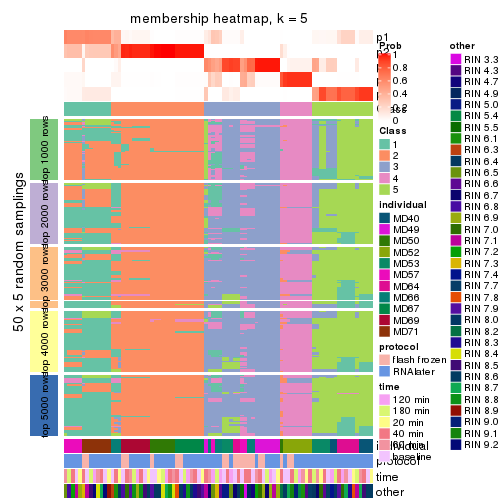</p>

</div>
<div id='tab-ATC-skmeans-membership-heatmap-5'>
<pre><code class="r">membership_heatmap(res, k = 6)
</code></pre>

<p></p>

</div>
</div>

As soon as we have had the classes for columns, we can look for signatures
which are significantly different between classes which can be candidate marks
for certain classes. Following are the heatmaps for signatures.


Signature heatmaps where rows are scaled:


<script>
$( function() {
	$( '#tabs-ATC-skmeans-get-signatures' ).tabs();
} );
</script>
<div id='tabs-ATC-skmeans-get-signatures'>
<ul>
<li><a href='#tab-ATC-skmeans-get-signatures-1'>k = 2</a></li>
<li><a href='#tab-ATC-skmeans-get-signatures-2'>k = 3</a></li>
<li><a href='#tab-ATC-skmeans-get-signatures-3'>k = 4</a></li>
<li><a href='#tab-ATC-skmeans-get-signatures-4'>k = 5</a></li>
<li><a href='#tab-ATC-skmeans-get-signatures-5'>k = 6</a></li>
</ul>
<div id='tab-ATC-skmeans-get-signatures-1'>
<pre><code class="r">get_signatures(res, k = 2)
</code></pre>

<p></p>

</div>
<div id='tab-ATC-skmeans-get-signatures-2'>
<pre><code class="r">get_signatures(res, k = 3)
</code></pre>

<p></p>

</div>
<div id='tab-ATC-skmeans-get-signatures-3'>
<pre><code class="r">get_signatures(res, k = 4)
</code></pre>

<p></p>

</div>
<div id='tab-ATC-skmeans-get-signatures-4'>
<pre><code class="r">get_signatures(res, k = 5)
</code></pre>

<p></p>

</div>
<div id='tab-ATC-skmeans-get-signatures-5'>
<pre><code class="r">get_signatures(res, k = 6)
</code></pre>

<p></p>

</div>
</div>


Signature heatmaps where rows are not scaled:


<script>
$( function() {
	$( '#tabs-ATC-skmeans-get-signatures-no-scale' ).tabs();
} );
</script>
<div id='tabs-ATC-skmeans-get-signatures-no-scale'>
<ul>
<li><a href='#tab-ATC-skmeans-get-signatures-no-scale-1'>k = 2</a></li>
<li><a href='#tab-ATC-skmeans-get-signatures-no-scale-2'>k = 3</a></li>
<li><a href='#tab-ATC-skmeans-get-signatures-no-scale-3'>k = 4</a></li>
<li><a href='#tab-ATC-skmeans-get-signatures-no-scale-4'>k = 5</a></li>
<li><a href='#tab-ATC-skmeans-get-signatures-no-scale-5'>k = 6</a></li>
</ul>
<div id='tab-ATC-skmeans-get-signatures-no-scale-1'>
<pre><code class="r">get_signatures(res, k = 2, scale_rows = FALSE)
</code></pre>

<p></p>

</div>
<div id='tab-ATC-skmeans-get-signatures-no-scale-2'>
<pre><code class="r">get_signatures(res, k = 3, scale_rows = FALSE)
</code></pre>

<p></p>

</div>
<div id='tab-ATC-skmeans-get-signatures-no-scale-3'>
<pre><code class="r">get_signatures(res, k = 4, scale_rows = FALSE)
</code></pre>

<p></p>

</div>
<div id='tab-ATC-skmeans-get-signatures-no-scale-4'>
<pre><code class="r">get_signatures(res, k = 5, scale_rows = FALSE)
</code></pre>

<p></p>

</div>
<div id='tab-ATC-skmeans-get-signatures-no-scale-5'>
<pre><code class="r">get_signatures(res, k = 6, scale_rows = FALSE)
</code></pre>

<p></p>

</div>
</div>


Compare the overlap of signatures from different k:

```r
compare_signatures(res)
```


`get_signature()` returns a data frame invisibly. TO get the list of signatures, the function
call should be assigned to a variable explicitly. In following code, if `plot` argument is set
to `FALSE`, no heatmap is plotted while only the differential analysis is performed.

```r
# code only for demonstration
tb = get_signature(res, k = ..., plot = FALSE)
```

An example of the output of `tb` is:

```
#>   which_row         fdr    mean_1    mean_2 scaled_mean_1 scaled_mean_2 km
#> 1        38 0.042760348  8.373488  9.131774    -0.5533452     0.5164555  1
#> 2        40 0.018707592  7.106213  8.469186    -0.6173731     0.5762149  1
#> 3        55 0.019134737 10.221463 11.207825    -0.6159697     0.5749050  1
#> 4        59 0.006059896  5.921854  7.869574    -0.6899429     0.6439467  1
#> 5        60 0.018055526  8.928898 10.211722    -0.6204761     0.5791110  1
#> 6        98 0.009384629 15.714769 14.887706     0.6635654    -0.6193277  2
...
```

The columns in `tb` are:

1. `which_row`: row indices corresponding to the input matrix.
2. `fdr`: FDR for the differential test. 
3. `mean_x`: The mean value in group x.
4. `scaled_mean_x`: The mean value in group x after rows are scaled.
5. `km`: Row groups if k-means clustering is applied to rows.


UMAP plot which shows how samples are separated.


<script>
$( function() {
	$( '#tabs-ATC-skmeans-dimension-reduction' ).tabs();
} );
</script>
<div id='tabs-ATC-skmeans-dimension-reduction'>
<ul>
<li><a href='#tab-ATC-skmeans-dimension-reduction-1'>k = 2</a></li>
<li><a href='#tab-ATC-skmeans-dimension-reduction-2'>k = 3</a></li>
<li><a href='#tab-ATC-skmeans-dimension-reduction-3'>k = 4</a></li>
<li><a href='#tab-ATC-skmeans-dimension-reduction-4'>k = 5</a></li>
<li><a href='#tab-ATC-skmeans-dimension-reduction-5'>k = 6</a></li>
</ul>
<div id='tab-ATC-skmeans-dimension-reduction-1'>
<pre><code class="r">dimension_reduction(res, k = 2, method = &quot;UMAP&quot;)
</code></pre>

<p></p>

</div>
<div id='tab-ATC-skmeans-dimension-reduction-2'>
<pre><code class="r">dimension_reduction(res, k = 3, method = &quot;UMAP&quot;)
</code></pre>

<p>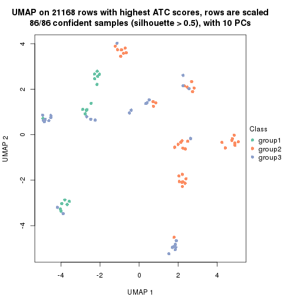</p>

</div>
<div id='tab-ATC-skmeans-dimension-reduction-3'>
<pre><code class="r">dimension_reduction(res, k = 4, method = &quot;UMAP&quot;)
</code></pre>

<p></p>

</div>
<div id='tab-ATC-skmeans-dimension-reduction-4'>
<pre><code class="r">dimension_reduction(res, k = 5, method = &quot;UMAP&quot;)
</code></pre>

<p></p>

</div>
<div id='tab-ATC-skmeans-dimension-reduction-5'>
<pre><code class="r">dimension_reduction(res, k = 6, method = &quot;UMAP&quot;)
</code></pre>

<p></p>

</div>
</div>


Following heatmap shows how subgroups are split when increasing `k`:

```r
collect_classes(res)
```


Test correlation between subgroups and known annotations. If the known
annotation is numeric, one-way ANOVA test is applied, and if the known
annotation is discrete, chi-squared contingency table test is applied.

```r
test_to_known_factors(res)
```

```
#>              n individual(p) protocol(p) time(p) other(p) k
#> ATC:skmeans 85      1.43e-06    0.013416   0.686  0.00765 2
#> ATC:skmeans 86      9.93e-14    0.000205   0.945  0.26856 3
#> ATC:skmeans 72      5.45e-22    0.011462   1.000  0.04118 4
#> ATC:skmeans 73      1.56e-32    0.003642   1.000  0.01719 5
#> ATC:skmeans 78      1.35e-36    0.007309   1.000  0.02286 6
```


If matrix rows can be associated to genes, consider to use `functional_enrichment(res,
...)` to perform function enrichment for the signature genes. See [this vignette](http://bioconductor.org/packages/devel/bioc/vignettes/cola/inst/doc/functional_enrichment.html) for more detailed explanations.


 

---------------------------------------------------


### ATC:pam*


The object with results only for a single top-value method and a single partition method 
can be extracted as:

```r
res = res_list["ATC", "pam"]
# you can also extract it by
# res = res_list["ATC:pam"]
```

A summary of `res` and all the functions that can be applied to it:

```r
res
```

```
#> A 'ConsensusPartition' object with k = 2, 3, 4, 5, 6.
#>   On a matrix with 21168 rows and 86 columns.
#>   Top rows (1000, 2000, 3000, 4000, 5000) are extracted by 'ATC' method.
#>   Subgroups are detected by 'pam' method.
#>   Performed in total 1250 partitions by row resampling.
#>   Best k for subgroups seems to be 4.
#> 
#> Following methods can be applied to this 'ConsensusPartition' object:
#>  [1] "cola_report"             "collect_classes"         "collect_plots"          
#>  [4] "collect_stats"           "colnames"                "compare_signatures"     
#>  [7] "consensus_heatmap"       "dimension_reduction"     "functional_enrichment"  
#> [10] "get_anno_col"            "get_anno"                "get_classes"            
#> [13] "get_consensus"           "get_matrix"              "get_membership"         
#> [16] "get_param"               "get_signatures"          "get_stats"              
#> [19] "is_best_k"               "is_stable_k"             "membership_heatmap"     
#> [22] "ncol"                    "nrow"                    "plot_ecdf"              
#> [25] "rownames"                "select_partition_number" "show"                   
#> [28] "suggest_best_k"          "test_to_known_factors"
```

`collect_plots()` function collects all the plots made from `res` for all `k` (number of partitions)
into one single page to provide an easy and fast comparison between different `k`.

```r
collect_plots(res)
```


The plots are:

- The first row: a plot of the ECDF (empirical cumulative distribution
  function) curves of the consensus matrix for each `k` and the heatmap of
  predicted classes for each `k`.
- The second row: heatmaps of the consensus matrix for each `k`.
- The third row: heatmaps of the membership matrix for each `k`.
- The fouth row: heatmaps of the signatures for each `k`.

All the plots in panels can be made by individual functions and they are
plotted later in this section.

`select_partition_number()` produces several plots showing different
statistics for choosing "optimized" `k`. There are following statistics:

- ECDF curves of the consensus matrix for each `k`;
- 1-PAC. [The PAC
  score](https://en.wikipedia.org/wiki/Consensus_clustering#Over-interpretation_potential_of_consensus_clustering)
  measures the proportion of the ambiguous subgrouping.
- Mean silhouette score.
- Concordance. The mean probability of fiting the consensus class ids in all
  partitions.
- Area increased. Denote $A_k$ as the area under the ECDF curve for current
  `k`, the area increased is defined as $A_k - A_{k-1}$.
- Rand index. The percent of pairs of samples that are both in a same cluster
  or both are not in a same cluster in the partition of k and k-1.
- Jaccard index. The ratio of pairs of samples are both in a same cluster in
  the partition of k and k-1 and the pairs of samples are both in a same
  cluster in the partition k or k-1.

The detailed explanations of these statistics can be found in [the _cola_
vignette](http://bioconductor.org/packages/devel/bioc/vignettes/cola/inst/doc/cola.html#toc_13).

Generally speaking, lower PAC score, higher mean silhouette score or higher
concordance corresponds to better partition. Rand index and Jaccard index
measure how similar the current partition is compared to partition with `k-1`.
If they are too similar, we won't accept `k` is better than `k-1`.

```r
select_partition_number(res)
```


The numeric values for all these statistics can be obtained by `get_stats()`.

```r
get_stats(res)
```

```
#>   k 1-PAC mean_silhouette concordance area_increased  Rand Jaccard
#> 2 2 0.927           0.936       0.973         0.4751 0.521   0.521
#> 3 3 0.702           0.790       0.886         0.1950 0.904   0.821
#> 4 4 0.916           0.871       0.952         0.1853 0.830   0.647
#> 5 5 0.831           0.793       0.906         0.1292 0.841   0.567
#> 6 6 0.871           0.844       0.934         0.0276 0.960   0.838
```

`suggest_best_k()` suggests the best $k$ based on these statistics. The rules are as follows:

- All $k$ with Jaccard index larger than 0.95 are removed because increasing
  $k$ does not provide enough extra information. If all $k$ are removed, it is
  marked as no subgroup is detected.
- For all $k$ with 1-PAC score larger than 0.9, the maximal $k$ is taken as
  the best $k$, and other $k$ are marked as optional $k$.
- If it does not fit the second rule. The $k$ with the maximal vote of the
  highest 1-PAC score, highest mean silhouette, and highest concordance is
  taken as the best $k$.

```r
suggest_best_k(res)
```

```
#> [1] 4
#> attr(,"optional")
#> [1] 2
```

There is also optional best $k$ = 2 that is worth to check.

Following shows the table of the partitions (You need to click the **show/hide
code output** link to see it). The membership matrix (columns with name `p*`)
is inferred by
[`clue::cl_consensus()`](https://www.rdocumentation.org/link/cl_consensus?package=clue)
function with the `SE` method. Basically the value in the membership matrix
represents the probability to belong to a certain group. The finall class
label for an item is determined with the group with highest probability it
belongs to.

In `get_classes()` function, the entropy is calculated from the membership
matrix and the silhouette score is calculated from the consensus matrix.


<script>
$( function() {
	$( '#tabs-ATC-pam-get-classes' ).tabs();
} );
</script>
<div id='tabs-ATC-pam-get-classes'>
<ul>
<li><a href='#tab-ATC-pam-get-classes-1'>k = 2</a></li>
<li><a href='#tab-ATC-pam-get-classes-2'>k = 3</a></li>
<li><a href='#tab-ATC-pam-get-classes-3'>k = 4</a></li>
<li><a href='#tab-ATC-pam-get-classes-4'>k = 5</a></li>
<li><a href='#tab-ATC-pam-get-classes-5'>k = 6</a></li>
</ul>

<div id='tab-ATC-pam-get-classes-1'>
<p><a id='tab-ATC-pam-get-classes-1-a' style='color:#0366d6' href='#'>show/hide code output</a></p>
<pre><code class="r">cbind(get_classes(res, k = 2), get_membership(res, k = 2))
</code></pre>

<pre><code>#&gt;           class entropy silhouette    p1    p2
#&gt; GSM614415     2  0.0000      0.982 0.000 1.000
#&gt; GSM614416     2  0.0000      0.982 0.000 1.000
#&gt; GSM614417     2  0.0000      0.982 0.000 1.000
#&gt; GSM614418     2  0.0000      0.982 0.000 1.000
#&gt; GSM614419     1  0.0000      0.954 1.000 0.000
#&gt; GSM614420     1  0.0000      0.954 1.000 0.000
#&gt; GSM614421     1  0.0000      0.954 1.000 0.000
#&gt; GSM614422     1  0.0000      0.954 1.000 0.000
#&gt; GSM614423     1  0.9393      0.475 0.644 0.356
#&gt; GSM614424     1  0.0000      0.954 1.000 0.000
#&gt; GSM614425     1  0.0000      0.954 1.000 0.000
#&gt; GSM614426     1  0.0000      0.954 1.000 0.000
#&gt; GSM614427     1  0.0000      0.954 1.000 0.000
#&gt; GSM614428     1  0.0000      0.954 1.000 0.000
#&gt; GSM614429     2  0.0000      0.982 0.000 1.000
#&gt; GSM614430     2  0.0000      0.982 0.000 1.000
#&gt; GSM614431     2  0.0000      0.982 0.000 1.000
#&gt; GSM614432     2  0.0000      0.982 0.000 1.000
#&gt; GSM614433     2  0.0000      0.982 0.000 1.000
#&gt; GSM614434     2  0.0000      0.982 0.000 1.000
#&gt; GSM614435     2  0.0000      0.982 0.000 1.000
#&gt; GSM614436     2  0.0938      0.971 0.012 0.988
#&gt; GSM614437     2  0.0000      0.982 0.000 1.000
#&gt; GSM614438     1  0.0672      0.948 0.992 0.008
#&gt; GSM614439     1  0.0000      0.954 1.000 0.000
#&gt; GSM614440     1  0.0000      0.954 1.000 0.000
#&gt; GSM614441     1  0.0000      0.954 1.000 0.000
#&gt; GSM614442     1  0.6438      0.786 0.836 0.164
#&gt; GSM614443     2  0.7139      0.751 0.196 0.804
#&gt; GSM614444     1  0.0000      0.954 1.000 0.000
#&gt; GSM614391     1  0.0000      0.954 1.000 0.000
#&gt; GSM614392     1  0.3879      0.889 0.924 0.076
#&gt; GSM614393     1  0.9323      0.494 0.652 0.348
#&gt; GSM614394     1  0.0000      0.954 1.000 0.000
#&gt; GSM614395     1  0.0000      0.954 1.000 0.000
#&gt; GSM614396     1  0.0000      0.954 1.000 0.000
#&gt; GSM614397     1  0.0000      0.954 1.000 0.000
#&gt; GSM614398     1  0.0000      0.954 1.000 0.000
#&gt; GSM614399     2  0.0000      0.982 0.000 1.000
#&gt; GSM614400     2  0.0000      0.982 0.000 1.000
#&gt; GSM614401     2  0.0000      0.982 0.000 1.000
#&gt; GSM614402     2  0.0000      0.982 0.000 1.000
#&gt; GSM614403     2  0.5737      0.836 0.136 0.864
#&gt; GSM614404     2  0.0000      0.982 0.000 1.000
#&gt; GSM614405     1  0.0000      0.954 1.000 0.000
#&gt; GSM614406     1  0.0000      0.954 1.000 0.000
#&gt; GSM614407     2  0.0000      0.982 0.000 1.000
#&gt; GSM614408     2  0.0000      0.982 0.000 1.000
#&gt; GSM614409     2  0.0000      0.982 0.000 1.000
#&gt; GSM614410     2  0.0000      0.982 0.000 1.000
#&gt; GSM614411     2  0.0000      0.982 0.000 1.000
#&gt; GSM614412     1  0.0376      0.951 0.996 0.004
#&gt; GSM614413     1  0.0000      0.954 1.000 0.000
#&gt; GSM614414     1  0.0000      0.954 1.000 0.000
#&gt; GSM614445     2  0.0000      0.982 0.000 1.000
#&gt; GSM614446     2  0.0000      0.982 0.000 1.000
#&gt; GSM614447     2  0.0000      0.982 0.000 1.000
#&gt; GSM614448     1  0.0000      0.954 1.000 0.000
#&gt; GSM614449     1  0.9977      0.104 0.528 0.472
#&gt; GSM614450     2  0.8327      0.638 0.264 0.736
#&gt; GSM614451     1  0.0000      0.954 1.000 0.000
#&gt; GSM614452     1  0.0000      0.954 1.000 0.000
#&gt; GSM614453     2  0.0000      0.982 0.000 1.000
#&gt; GSM614454     2  0.0000      0.982 0.000 1.000
#&gt; GSM614455     2  0.0000      0.982 0.000 1.000
#&gt; GSM614456     2  0.0000      0.982 0.000 1.000
#&gt; GSM614457     2  0.0000      0.982 0.000 1.000
#&gt; GSM614458     2  0.0000      0.982 0.000 1.000
#&gt; GSM614459     2  0.0000      0.982 0.000 1.000
#&gt; GSM614460     2  0.0000      0.982 0.000 1.000
#&gt; GSM614461     2  0.0000      0.982 0.000 1.000
#&gt; GSM614462     2  0.0000      0.982 0.000 1.000
#&gt; GSM614463     2  0.0000      0.982 0.000 1.000
#&gt; GSM614464     2  0.0000      0.982 0.000 1.000
#&gt; GSM614465     2  0.0000      0.982 0.000 1.000
#&gt; GSM614466     2  0.0000      0.982 0.000 1.000
#&gt; GSM614467     2  0.0000      0.982 0.000 1.000
#&gt; GSM614468     2  0.0000      0.982 0.000 1.000
#&gt; GSM614469     2  0.0000      0.982 0.000 1.000
#&gt; GSM614470     2  0.0000      0.982 0.000 1.000
#&gt; GSM614471     2  0.0000      0.982 0.000 1.000
#&gt; GSM614472     2  0.0000      0.982 0.000 1.000
#&gt; GSM614473     2  0.0000      0.982 0.000 1.000
#&gt; GSM614474     2  0.0000      0.982 0.000 1.000
#&gt; GSM614475     2  0.0000      0.982 0.000 1.000
#&gt; GSM614476     2  0.8144      0.661 0.252 0.748
</code></pre>

<script>
$('#tab-ATC-pam-get-classes-1-a').parent().next().next().hide();
$('#tab-ATC-pam-get-classes-1-a').click(function(){
  $('#tab-ATC-pam-get-classes-1-a').parent().next().next().toggle();
  return(false);
});
</script>
</div>

<div id='tab-ATC-pam-get-classes-2'>
<p><a id='tab-ATC-pam-get-classes-2-a' style='color:#0366d6' href='#'>show/hide code output</a></p>
<pre><code class="r">cbind(get_classes(res, k = 3), get_membership(res, k = 3))
</code></pre>

<pre><code>#&gt;           class entropy silhouette    p1    p2    p3
#&gt; GSM614415     2  0.5098     0.7379 0.248 0.752 0.000
#&gt; GSM614416     2  0.5098     0.7379 0.248 0.752 0.000
#&gt; GSM614417     2  0.5098     0.7379 0.248 0.752 0.000
#&gt; GSM614418     2  0.5098     0.7379 0.248 0.752 0.000
#&gt; GSM614419     1  0.0000     0.7190 1.000 0.000 0.000
#&gt; GSM614420     1  0.0000     0.7190 1.000 0.000 0.000
#&gt; GSM614421     1  0.5285     0.8202 0.752 0.004 0.244
#&gt; GSM614422     1  0.5285     0.8202 0.752 0.004 0.244
#&gt; GSM614423     1  0.6518     0.6049 0.752 0.168 0.080
#&gt; GSM614424     1  0.5285     0.8202 0.752 0.004 0.244
#&gt; GSM614425     1  0.5285     0.8202 0.752 0.004 0.244
#&gt; GSM614426     1  0.5285     0.8202 0.752 0.004 0.244
#&gt; GSM614427     1  0.5285     0.8202 0.752 0.004 0.244
#&gt; GSM614428     1  0.5098     0.8177 0.752 0.000 0.248
#&gt; GSM614429     2  0.0000     0.9187 0.000 1.000 0.000
#&gt; GSM614430     2  0.0000     0.9187 0.000 1.000 0.000
#&gt; GSM614431     2  0.0000     0.9187 0.000 1.000 0.000
#&gt; GSM614432     2  0.0000     0.9187 0.000 1.000 0.000
#&gt; GSM614433     2  0.0000     0.9187 0.000 1.000 0.000
#&gt; GSM614434     2  0.0000     0.9187 0.000 1.000 0.000
#&gt; GSM614435     2  0.0000     0.9187 0.000 1.000 0.000
#&gt; GSM614436     2  0.1411     0.8918 0.036 0.964 0.000
#&gt; GSM614437     2  0.5859     0.4742 0.000 0.656 0.344
#&gt; GSM614438     3  0.0000     0.7694 0.000 0.000 1.000
#&gt; GSM614439     3  0.0000     0.7694 0.000 0.000 1.000
#&gt; GSM614440     3  0.0000     0.7694 0.000 0.000 1.000
#&gt; GSM614441     3  0.0000     0.7694 0.000 0.000 1.000
#&gt; GSM614442     3  0.0000     0.7694 0.000 0.000 1.000
#&gt; GSM614443     3  0.5058     0.4963 0.000 0.244 0.756
#&gt; GSM614444     3  0.0000     0.7694 0.000 0.000 1.000
#&gt; GSM614391     1  0.0000     0.7190 1.000 0.000 0.000
#&gt; GSM614392     1  0.0000     0.7190 1.000 0.000 0.000
#&gt; GSM614393     1  0.0000     0.7190 1.000 0.000 0.000
#&gt; GSM614394     1  0.0237     0.7212 0.996 0.000 0.004
#&gt; GSM614395     3  0.6307    -0.2749 0.488 0.000 0.512
#&gt; GSM614396     1  0.2711     0.7607 0.912 0.000 0.088
#&gt; GSM614397     1  0.5058     0.8202 0.756 0.000 0.244
#&gt; GSM614398     1  0.5058     0.8202 0.756 0.000 0.244
#&gt; GSM614399     2  0.0000     0.9187 0.000 1.000 0.000
#&gt; GSM614400     2  0.0000     0.9187 0.000 1.000 0.000
#&gt; GSM614401     2  0.0000     0.9187 0.000 1.000 0.000
#&gt; GSM614402     2  0.0000     0.9187 0.000 1.000 0.000
#&gt; GSM614403     2  0.6187     0.6120 0.248 0.724 0.028
#&gt; GSM614404     2  0.0000     0.9187 0.000 1.000 0.000
#&gt; GSM614405     1  0.5285     0.8202 0.752 0.004 0.244
#&gt; GSM614406     1  0.6045     0.5915 0.620 0.000 0.380
#&gt; GSM614407     2  0.4974     0.7485 0.236 0.764 0.000
#&gt; GSM614408     2  0.5098     0.7379 0.248 0.752 0.000
#&gt; GSM614409     2  0.5098     0.7379 0.248 0.752 0.000
#&gt; GSM614410     2  0.5098     0.7379 0.248 0.752 0.000
#&gt; GSM614411     2  0.5058     0.7417 0.244 0.756 0.000
#&gt; GSM614412     1  0.0000     0.7190 1.000 0.000 0.000
#&gt; GSM614413     1  0.5058     0.8202 0.756 0.000 0.244
#&gt; GSM614414     1  0.5058     0.8202 0.756 0.000 0.244
#&gt; GSM614445     2  0.0000     0.9187 0.000 1.000 0.000
#&gt; GSM614446     2  0.0000     0.9187 0.000 1.000 0.000
#&gt; GSM614447     2  0.0000     0.9187 0.000 1.000 0.000
#&gt; GSM614448     1  0.5365     0.8128 0.744 0.004 0.252
#&gt; GSM614449     2  0.9441     0.0578 0.316 0.484 0.200
#&gt; GSM614450     2  0.5551     0.6792 0.212 0.768 0.020
#&gt; GSM614451     3  0.5785     0.3110 0.332 0.000 0.668
#&gt; GSM614452     3  0.5859     0.2778 0.344 0.000 0.656
#&gt; GSM614453     2  0.0000     0.9187 0.000 1.000 0.000
#&gt; GSM614454     2  0.0000     0.9187 0.000 1.000 0.000
#&gt; GSM614455     2  0.0000     0.9187 0.000 1.000 0.000
#&gt; GSM614456     2  0.0000     0.9187 0.000 1.000 0.000
#&gt; GSM614457     2  0.0000     0.9187 0.000 1.000 0.000
#&gt; GSM614458     2  0.0000     0.9187 0.000 1.000 0.000
#&gt; GSM614459     2  0.0000     0.9187 0.000 1.000 0.000
#&gt; GSM614460     2  0.0000     0.9187 0.000 1.000 0.000
#&gt; GSM614461     2  0.0000     0.9187 0.000 1.000 0.000
#&gt; GSM614462     2  0.0000     0.9187 0.000 1.000 0.000
#&gt; GSM614463     2  0.0000     0.9187 0.000 1.000 0.000
#&gt; GSM614464     2  0.0000     0.9187 0.000 1.000 0.000
#&gt; GSM614465     2  0.0000     0.9187 0.000 1.000 0.000
#&gt; GSM614466     2  0.0000     0.9187 0.000 1.000 0.000
#&gt; GSM614467     2  0.0000     0.9187 0.000 1.000 0.000
#&gt; GSM614468     2  0.0000     0.9187 0.000 1.000 0.000
#&gt; GSM614469     2  0.0000     0.9187 0.000 1.000 0.000
#&gt; GSM614470     2  0.0000     0.9187 0.000 1.000 0.000
#&gt; GSM614471     2  0.0000     0.9187 0.000 1.000 0.000
#&gt; GSM614472     2  0.0000     0.9187 0.000 1.000 0.000
#&gt; GSM614473     2  0.0000     0.9187 0.000 1.000 0.000
#&gt; GSM614474     2  0.0000     0.9187 0.000 1.000 0.000
#&gt; GSM614475     2  0.0000     0.9187 0.000 1.000 0.000
#&gt; GSM614476     2  0.7232     0.6104 0.172 0.712 0.116
</code></pre>

<script>
$('#tab-ATC-pam-get-classes-2-a').parent().next().next().hide();
$('#tab-ATC-pam-get-classes-2-a').click(function(){
  $('#tab-ATC-pam-get-classes-2-a').parent().next().next().toggle();
  return(false);
});
</script>
</div>

<div id='tab-ATC-pam-get-classes-3'>
<p><a id='tab-ATC-pam-get-classes-3-a' style='color:#0366d6' href='#'>show/hide code output</a></p>
<pre><code class="r">cbind(get_classes(res, k = 4), get_membership(res, k = 4))
</code></pre>

<pre><code>#&gt;           class entropy silhouette    p1    p2    p3    p4
#&gt; GSM614415     1  0.0000     0.9731 1.000 0.000 0.000 0.000
#&gt; GSM614416     1  0.0000     0.9731 1.000 0.000 0.000 0.000
#&gt; GSM614417     1  0.0000     0.9731 1.000 0.000 0.000 0.000
#&gt; GSM614418     1  0.0000     0.9731 1.000 0.000 0.000 0.000
#&gt; GSM614419     1  0.0469     0.9636 0.988 0.000 0.012 0.000
#&gt; GSM614420     1  0.0469     0.9636 0.988 0.000 0.012 0.000
#&gt; GSM614421     3  0.0000     0.8996 0.000 0.000 1.000 0.000
#&gt; GSM614422     3  0.0000     0.8996 0.000 0.000 1.000 0.000
#&gt; GSM614423     3  0.0336     0.8921 0.000 0.008 0.992 0.000
#&gt; GSM614424     3  0.0000     0.8996 0.000 0.000 1.000 0.000
#&gt; GSM614425     3  0.0000     0.8996 0.000 0.000 1.000 0.000
#&gt; GSM614426     3  0.0000     0.8996 0.000 0.000 1.000 0.000
#&gt; GSM614427     3  0.0000     0.8996 0.000 0.000 1.000 0.000
#&gt; GSM614428     3  0.0000     0.8996 0.000 0.000 1.000 0.000
#&gt; GSM614429     2  0.0000     0.9573 0.000 1.000 0.000 0.000
#&gt; GSM614430     2  0.0000     0.9573 0.000 1.000 0.000 0.000
#&gt; GSM614431     2  0.0000     0.9573 0.000 1.000 0.000 0.000
#&gt; GSM614432     2  0.0000     0.9573 0.000 1.000 0.000 0.000
#&gt; GSM614433     2  0.0000     0.9573 0.000 1.000 0.000 0.000
#&gt; GSM614434     2  0.0000     0.9573 0.000 1.000 0.000 0.000
#&gt; GSM614435     2  0.0000     0.9573 0.000 1.000 0.000 0.000
#&gt; GSM614436     2  0.0469     0.9484 0.000 0.988 0.012 0.000
#&gt; GSM614437     2  0.4933     0.2651 0.000 0.568 0.000 0.432
#&gt; GSM614438     4  0.0000     0.8783 0.000 0.000 0.000 1.000
#&gt; GSM614439     4  0.0000     0.8783 0.000 0.000 0.000 1.000
#&gt; GSM614440     4  0.0000     0.8783 0.000 0.000 0.000 1.000
#&gt; GSM614441     4  0.0000     0.8783 0.000 0.000 0.000 1.000
#&gt; GSM614442     4  0.0000     0.8783 0.000 0.000 0.000 1.000
#&gt; GSM614443     4  0.0000     0.8783 0.000 0.000 0.000 1.000
#&gt; GSM614444     4  0.0000     0.8783 0.000 0.000 0.000 1.000
#&gt; GSM614391     1  0.0469     0.9636 0.988 0.000 0.012 0.000
#&gt; GSM614392     1  0.0000     0.9731 1.000 0.000 0.000 0.000
#&gt; GSM614393     1  0.0000     0.9731 1.000 0.000 0.000 0.000
#&gt; GSM614394     3  0.2589     0.7915 0.116 0.000 0.884 0.000
#&gt; GSM614395     3  0.4406     0.4690 0.000 0.000 0.700 0.300
#&gt; GSM614396     3  0.1022     0.8750 0.032 0.000 0.968 0.000
#&gt; GSM614397     3  0.0000     0.8996 0.000 0.000 1.000 0.000
#&gt; GSM614398     3  0.0000     0.8996 0.000 0.000 1.000 0.000
#&gt; GSM614399     2  0.0000     0.9573 0.000 1.000 0.000 0.000
#&gt; GSM614400     2  0.0469     0.9519 0.012 0.988 0.000 0.000
#&gt; GSM614401     2  0.0469     0.9519 0.012 0.988 0.000 0.000
#&gt; GSM614402     2  0.0000     0.9573 0.000 1.000 0.000 0.000
#&gt; GSM614403     2  0.4999     0.0466 0.000 0.508 0.492 0.000
#&gt; GSM614404     2  0.0469     0.9519 0.012 0.988 0.000 0.000
#&gt; GSM614405     3  0.0000     0.8996 0.000 0.000 1.000 0.000
#&gt; GSM614406     3  0.2921     0.7523 0.000 0.000 0.860 0.140
#&gt; GSM614407     1  0.3486     0.6792 0.812 0.188 0.000 0.000
#&gt; GSM614408     1  0.0000     0.9731 1.000 0.000 0.000 0.000
#&gt; GSM614409     1  0.0000     0.9731 1.000 0.000 0.000 0.000
#&gt; GSM614410     1  0.0000     0.9731 1.000 0.000 0.000 0.000
#&gt; GSM614411     1  0.0000     0.9731 1.000 0.000 0.000 0.000
#&gt; GSM614412     3  0.4790     0.4000 0.380 0.000 0.620 0.000
#&gt; GSM614413     3  0.0000     0.8996 0.000 0.000 1.000 0.000
#&gt; GSM614414     3  0.0000     0.8996 0.000 0.000 1.000 0.000
#&gt; GSM614445     2  0.0000     0.9573 0.000 1.000 0.000 0.000
#&gt; GSM614446     2  0.0000     0.9573 0.000 1.000 0.000 0.000
#&gt; GSM614447     2  0.0000     0.9573 0.000 1.000 0.000 0.000
#&gt; GSM614448     3  0.0000     0.8996 0.000 0.000 1.000 0.000
#&gt; GSM614449     3  0.4855     0.2651 0.000 0.400 0.600 0.000
#&gt; GSM614450     2  0.4643     0.4800 0.000 0.656 0.344 0.000
#&gt; GSM614451     4  0.4888     0.3327 0.000 0.000 0.412 0.588
#&gt; GSM614452     4  0.4933     0.2798 0.000 0.000 0.432 0.568
#&gt; GSM614453     2  0.0000     0.9573 0.000 1.000 0.000 0.000
#&gt; GSM614454     2  0.0000     0.9573 0.000 1.000 0.000 0.000
#&gt; GSM614455     2  0.0000     0.9573 0.000 1.000 0.000 0.000
#&gt; GSM614456     2  0.0000     0.9573 0.000 1.000 0.000 0.000
#&gt; GSM614457     2  0.0000     0.9573 0.000 1.000 0.000 0.000
#&gt; GSM614458     2  0.0000     0.9573 0.000 1.000 0.000 0.000
#&gt; GSM614459     2  0.0000     0.9573 0.000 1.000 0.000 0.000
#&gt; GSM614460     2  0.0000     0.9573 0.000 1.000 0.000 0.000
#&gt; GSM614461     2  0.0000     0.9573 0.000 1.000 0.000 0.000
#&gt; GSM614462     2  0.0000     0.9573 0.000 1.000 0.000 0.000
#&gt; GSM614463     2  0.0000     0.9573 0.000 1.000 0.000 0.000
#&gt; GSM614464     2  0.0000     0.9573 0.000 1.000 0.000 0.000
#&gt; GSM614465     2  0.0000     0.9573 0.000 1.000 0.000 0.000
#&gt; GSM614466     2  0.0000     0.9573 0.000 1.000 0.000 0.000
#&gt; GSM614467     2  0.0000     0.9573 0.000 1.000 0.000 0.000
#&gt; GSM614468     2  0.0000     0.9573 0.000 1.000 0.000 0.000
#&gt; GSM614469     2  0.0469     0.9519 0.012 0.988 0.000 0.000
#&gt; GSM614470     2  0.0469     0.9519 0.012 0.988 0.000 0.000
#&gt; GSM614471     2  0.0469     0.9519 0.012 0.988 0.000 0.000
#&gt; GSM614472     2  0.0469     0.9519 0.012 0.988 0.000 0.000
#&gt; GSM614473     2  0.0469     0.9519 0.012 0.988 0.000 0.000
#&gt; GSM614474     2  0.0469     0.9519 0.012 0.988 0.000 0.000
#&gt; GSM614475     2  0.0469     0.9519 0.012 0.988 0.000 0.000
#&gt; GSM614476     2  0.4546     0.6427 0.012 0.732 0.256 0.000
</code></pre>

<script>
$('#tab-ATC-pam-get-classes-3-a').parent().next().next().hide();
$('#tab-ATC-pam-get-classes-3-a').click(function(){
  $('#tab-ATC-pam-get-classes-3-a').parent().next().next().toggle();
  return(false);
});
</script>
</div>

<div id='tab-ATC-pam-get-classes-4'>
<p><a id='tab-ATC-pam-get-classes-4-a' style='color:#0366d6' href='#'>show/hide code output</a></p>
<pre><code class="r">cbind(get_classes(res, k = 5), get_membership(res, k = 5))
</code></pre>

<pre><code>#&gt;           class entropy silhouette    p1    p2    p3    p4    p5
#&gt; GSM614415     1  0.3816     0.6949 0.696 0.000 0.000 0.000 0.304
#&gt; GSM614416     1  0.3816     0.6949 0.696 0.000 0.000 0.000 0.304
#&gt; GSM614417     1  0.3816     0.6949 0.696 0.000 0.000 0.000 0.304
#&gt; GSM614418     1  0.3816     0.6949 0.696 0.000 0.000 0.000 0.304
#&gt; GSM614419     5  0.0912     0.7670 0.012 0.000 0.016 0.000 0.972
#&gt; GSM614420     5  0.0404     0.7702 0.012 0.000 0.000 0.000 0.988
#&gt; GSM614421     3  0.0000     0.8673 0.000 0.000 1.000 0.000 0.000
#&gt; GSM614422     3  0.0000     0.8673 0.000 0.000 1.000 0.000 0.000
#&gt; GSM614423     3  0.1908     0.7710 0.000 0.092 0.908 0.000 0.000
#&gt; GSM614424     3  0.0000     0.8673 0.000 0.000 1.000 0.000 0.000
#&gt; GSM614425     3  0.0000     0.8673 0.000 0.000 1.000 0.000 0.000
#&gt; GSM614426     3  0.0000     0.8673 0.000 0.000 1.000 0.000 0.000
#&gt; GSM614427     3  0.0000     0.8673 0.000 0.000 1.000 0.000 0.000
#&gt; GSM614428     3  0.0162     0.8646 0.000 0.000 0.996 0.000 0.004
#&gt; GSM614429     2  0.0000     0.9364 0.000 1.000 0.000 0.000 0.000
#&gt; GSM614430     2  0.0000     0.9364 0.000 1.000 0.000 0.000 0.000
#&gt; GSM614431     2  0.0000     0.9364 0.000 1.000 0.000 0.000 0.000
#&gt; GSM614432     2  0.0000     0.9364 0.000 1.000 0.000 0.000 0.000
#&gt; GSM614433     2  0.0000     0.9364 0.000 1.000 0.000 0.000 0.000
#&gt; GSM614434     2  0.0000     0.9364 0.000 1.000 0.000 0.000 0.000
#&gt; GSM614435     2  0.0000     0.9364 0.000 1.000 0.000 0.000 0.000
#&gt; GSM614436     2  0.0000     0.9364 0.000 1.000 0.000 0.000 0.000
#&gt; GSM614437     2  0.4201     0.3169 0.000 0.592 0.000 0.408 0.000
#&gt; GSM614438     4  0.0000     0.8495 0.000 0.000 0.000 1.000 0.000
#&gt; GSM614439     4  0.0000     0.8495 0.000 0.000 0.000 1.000 0.000
#&gt; GSM614440     4  0.0000     0.8495 0.000 0.000 0.000 1.000 0.000
#&gt; GSM614441     4  0.0000     0.8495 0.000 0.000 0.000 1.000 0.000
#&gt; GSM614442     4  0.0000     0.8495 0.000 0.000 0.000 1.000 0.000
#&gt; GSM614443     4  0.2074     0.7333 0.000 0.104 0.000 0.896 0.000
#&gt; GSM614444     4  0.0000     0.8495 0.000 0.000 0.000 1.000 0.000
#&gt; GSM614391     5  0.0566     0.7714 0.012 0.000 0.004 0.000 0.984
#&gt; GSM614392     5  0.0404     0.7702 0.012 0.000 0.000 0.000 0.988
#&gt; GSM614393     5  0.0404     0.7702 0.012 0.000 0.000 0.000 0.988
#&gt; GSM614394     5  0.3816     0.7050 0.000 0.000 0.304 0.000 0.696
#&gt; GSM614395     5  0.5240     0.6189 0.000 0.000 0.120 0.204 0.676
#&gt; GSM614396     5  0.3876     0.6934 0.000 0.000 0.316 0.000 0.684
#&gt; GSM614397     5  0.3816     0.7029 0.000 0.000 0.304 0.000 0.696
#&gt; GSM614398     5  0.3816     0.7029 0.000 0.000 0.304 0.000 0.696
#&gt; GSM614399     2  0.0000     0.9364 0.000 1.000 0.000 0.000 0.000
#&gt; GSM614400     1  0.3274     0.6196 0.780 0.220 0.000 0.000 0.000
#&gt; GSM614401     2  0.4074     0.4705 0.364 0.636 0.000 0.000 0.000
#&gt; GSM614402     2  0.0000     0.9364 0.000 1.000 0.000 0.000 0.000
#&gt; GSM614403     2  0.4302    -0.0261 0.000 0.520 0.480 0.000 0.000
#&gt; GSM614404     2  0.3508     0.6737 0.252 0.748 0.000 0.000 0.000
#&gt; GSM614405     3  0.0000     0.8673 0.000 0.000 1.000 0.000 0.000
#&gt; GSM614406     3  0.1732     0.7990 0.000 0.000 0.920 0.080 0.000
#&gt; GSM614407     1  0.0404     0.8450 0.988 0.012 0.000 0.000 0.000
#&gt; GSM614408     1  0.0000     0.8406 1.000 0.000 0.000 0.000 0.000
#&gt; GSM614409     1  0.4067     0.6928 0.692 0.008 0.000 0.000 0.300
#&gt; GSM614410     1  0.0000     0.8406 1.000 0.000 0.000 0.000 0.000
#&gt; GSM614411     1  0.2813     0.7764 0.832 0.000 0.000 0.000 0.168
#&gt; GSM614412     3  0.6494     0.1416 0.256 0.000 0.492 0.000 0.252
#&gt; GSM614413     3  0.0000     0.8673 0.000 0.000 1.000 0.000 0.000
#&gt; GSM614414     3  0.0000     0.8673 0.000 0.000 1.000 0.000 0.000
#&gt; GSM614445     2  0.0000     0.9364 0.000 1.000 0.000 0.000 0.000
#&gt; GSM614446     2  0.0000     0.9364 0.000 1.000 0.000 0.000 0.000
#&gt; GSM614447     2  0.0000     0.9364 0.000 1.000 0.000 0.000 0.000
#&gt; GSM614448     3  0.0000     0.8673 0.000 0.000 1.000 0.000 0.000
#&gt; GSM614449     3  0.2852     0.6525 0.000 0.172 0.828 0.000 0.000
#&gt; GSM614450     3  0.4300     0.0956 0.000 0.476 0.524 0.000 0.000
#&gt; GSM614451     4  0.4505     0.4130 0.000 0.000 0.384 0.604 0.012
#&gt; GSM614452     4  0.4565     0.3582 0.000 0.000 0.408 0.580 0.012
#&gt; GSM614453     2  0.2852     0.7770 0.172 0.828 0.000 0.000 0.000
#&gt; GSM614454     2  0.0000     0.9364 0.000 1.000 0.000 0.000 0.000
#&gt; GSM614455     2  0.0000     0.9364 0.000 1.000 0.000 0.000 0.000
#&gt; GSM614456     2  0.0000     0.9364 0.000 1.000 0.000 0.000 0.000
#&gt; GSM614457     2  0.0000     0.9364 0.000 1.000 0.000 0.000 0.000
#&gt; GSM614458     2  0.0000     0.9364 0.000 1.000 0.000 0.000 0.000
#&gt; GSM614459     2  0.0000     0.9364 0.000 1.000 0.000 0.000 0.000
#&gt; GSM614460     2  0.0000     0.9364 0.000 1.000 0.000 0.000 0.000
#&gt; GSM614461     2  0.0000     0.9364 0.000 1.000 0.000 0.000 0.000
#&gt; GSM614462     2  0.0000     0.9364 0.000 1.000 0.000 0.000 0.000
#&gt; GSM614463     2  0.2891     0.7723 0.176 0.824 0.000 0.000 0.000
#&gt; GSM614464     2  0.0000     0.9364 0.000 1.000 0.000 0.000 0.000
#&gt; GSM614465     2  0.0000     0.9364 0.000 1.000 0.000 0.000 0.000
#&gt; GSM614466     2  0.0000     0.9364 0.000 1.000 0.000 0.000 0.000
#&gt; GSM614467     2  0.0000     0.9364 0.000 1.000 0.000 0.000 0.000
#&gt; GSM614468     2  0.0000     0.9364 0.000 1.000 0.000 0.000 0.000
#&gt; GSM614469     1  0.0703     0.8478 0.976 0.024 0.000 0.000 0.000
#&gt; GSM614470     1  0.0703     0.8478 0.976 0.024 0.000 0.000 0.000
#&gt; GSM614471     1  0.0703     0.8478 0.976 0.024 0.000 0.000 0.000
#&gt; GSM614472     1  0.0703     0.8478 0.976 0.024 0.000 0.000 0.000
#&gt; GSM614473     1  0.0703     0.8478 0.976 0.024 0.000 0.000 0.000
#&gt; GSM614474     1  0.0703     0.8478 0.976 0.024 0.000 0.000 0.000
#&gt; GSM614475     1  0.0703     0.8478 0.976 0.024 0.000 0.000 0.000
#&gt; GSM614476     1  0.3565     0.6974 0.800 0.176 0.024 0.000 0.000
</code></pre>

<script>
$('#tab-ATC-pam-get-classes-4-a').parent().next().next().hide();
$('#tab-ATC-pam-get-classes-4-a').click(function(){
  $('#tab-ATC-pam-get-classes-4-a').parent().next().next().toggle();
  return(false);
});
</script>
</div>

<div id='tab-ATC-pam-get-classes-5'>
<p><a id='tab-ATC-pam-get-classes-5-a' style='color:#0366d6' href='#'>show/hide code output</a></p>
<pre><code class="r">cbind(get_classes(res, k = 6), get_membership(res, k = 6))
</code></pre>

<pre><code>#&gt;           class entropy silhouette    p1    p2    p3    p4    p5    p6
#&gt; GSM614415     6  0.0000    0.93239 0.000 0.000 0.000 0.000 0.000 1.000
#&gt; GSM614416     6  0.0000    0.93239 0.000 0.000 0.000 0.000 0.000 1.000
#&gt; GSM614417     6  0.0000    0.93239 0.000 0.000 0.000 0.000 0.000 1.000
#&gt; GSM614418     6  0.0000    0.93239 0.000 0.000 0.000 0.000 0.000 1.000
#&gt; GSM614419     6  0.0146    0.93050 0.000 0.000 0.000 0.000 0.004 0.996
#&gt; GSM614420     6  0.0146    0.93050 0.000 0.000 0.000 0.000 0.004 0.996
#&gt; GSM614421     3  0.0000    0.90839 0.000 0.000 1.000 0.000 0.000 0.000
#&gt; GSM614422     3  0.0000    0.90839 0.000 0.000 1.000 0.000 0.000 0.000
#&gt; GSM614423     3  0.0000    0.90839 0.000 0.000 1.000 0.000 0.000 0.000
#&gt; GSM614424     3  0.0000    0.90839 0.000 0.000 1.000 0.000 0.000 0.000
#&gt; GSM614425     3  0.0000    0.90839 0.000 0.000 1.000 0.000 0.000 0.000
#&gt; GSM614426     3  0.0000    0.90839 0.000 0.000 1.000 0.000 0.000 0.000
#&gt; GSM614427     3  0.0000    0.90839 0.000 0.000 1.000 0.000 0.000 0.000
#&gt; GSM614428     3  0.0790    0.88589 0.000 0.000 0.968 0.000 0.032 0.000
#&gt; GSM614429     2  0.0000    0.95649 0.000 1.000 0.000 0.000 0.000 0.000
#&gt; GSM614430     2  0.0000    0.95649 0.000 1.000 0.000 0.000 0.000 0.000
#&gt; GSM614431     2  0.0000    0.95649 0.000 1.000 0.000 0.000 0.000 0.000
#&gt; GSM614432     2  0.0000    0.95649 0.000 1.000 0.000 0.000 0.000 0.000
#&gt; GSM614433     2  0.0000    0.95649 0.000 1.000 0.000 0.000 0.000 0.000
#&gt; GSM614434     2  0.0000    0.95649 0.000 1.000 0.000 0.000 0.000 0.000
#&gt; GSM614435     2  0.0000    0.95649 0.000 1.000 0.000 0.000 0.000 0.000
#&gt; GSM614436     2  0.0000    0.95649 0.000 1.000 0.000 0.000 0.000 0.000
#&gt; GSM614437     2  0.3774    0.32050 0.000 0.592 0.000 0.408 0.000 0.000
#&gt; GSM614438     4  0.0000    0.84205 0.000 0.000 0.000 1.000 0.000 0.000
#&gt; GSM614439     4  0.0000    0.84205 0.000 0.000 0.000 1.000 0.000 0.000
#&gt; GSM614440     4  0.0000    0.84205 0.000 0.000 0.000 1.000 0.000 0.000
#&gt; GSM614441     4  0.0000    0.84205 0.000 0.000 0.000 1.000 0.000 0.000
#&gt; GSM614442     4  0.0000    0.84205 0.000 0.000 0.000 1.000 0.000 0.000
#&gt; GSM614443     4  0.1327    0.77029 0.000 0.064 0.000 0.936 0.000 0.000
#&gt; GSM614444     4  0.0000    0.84205 0.000 0.000 0.000 1.000 0.000 0.000
#&gt; GSM614391     5  0.1765    0.89617 0.000 0.000 0.000 0.000 0.904 0.096
#&gt; GSM614392     5  0.1863    0.89148 0.000 0.000 0.000 0.000 0.896 0.104
#&gt; GSM614393     5  0.2006    0.89740 0.016 0.000 0.000 0.000 0.904 0.080
#&gt; GSM614394     5  0.1765    0.88021 0.000 0.000 0.096 0.000 0.904 0.000
#&gt; GSM614395     5  0.1863    0.82735 0.000 0.000 0.000 0.104 0.896 0.000
#&gt; GSM614396     5  0.1765    0.88021 0.000 0.000 0.096 0.000 0.904 0.000
#&gt; GSM614397     5  0.0000    0.90290 0.000 0.000 0.000 0.000 1.000 0.000
#&gt; GSM614398     5  0.0000    0.90290 0.000 0.000 0.000 0.000 1.000 0.000
#&gt; GSM614399     2  0.0000    0.95649 0.000 1.000 0.000 0.000 0.000 0.000
#&gt; GSM614400     1  0.3151    0.60028 0.748 0.252 0.000 0.000 0.000 0.000
#&gt; GSM614401     2  0.3446    0.56026 0.308 0.692 0.000 0.000 0.000 0.000
#&gt; GSM614402     2  0.0000    0.95649 0.000 1.000 0.000 0.000 0.000 0.000
#&gt; GSM614403     3  0.3737    0.39196 0.000 0.392 0.608 0.000 0.000 0.000
#&gt; GSM614404     2  0.2883    0.72813 0.212 0.788 0.000 0.000 0.000 0.000
#&gt; GSM614405     3  0.0000    0.90839 0.000 0.000 1.000 0.000 0.000 0.000
#&gt; GSM614406     3  0.2135    0.78009 0.000 0.000 0.872 0.128 0.000 0.000
#&gt; GSM614407     1  0.0146    0.84607 0.996 0.000 0.000 0.000 0.000 0.004
#&gt; GSM614408     1  0.2631    0.71237 0.820 0.000 0.000 0.000 0.000 0.180
#&gt; GSM614409     1  0.3866    0.00335 0.516 0.000 0.000 0.000 0.000 0.484
#&gt; GSM614410     1  0.0146    0.84607 0.996 0.000 0.000 0.000 0.000 0.004
#&gt; GSM614411     1  0.2527    0.70390 0.832 0.000 0.000 0.000 0.000 0.168
#&gt; GSM614412     6  0.5020    0.56983 0.128 0.000 0.244 0.000 0.000 0.628
#&gt; GSM614413     3  0.0000    0.90839 0.000 0.000 1.000 0.000 0.000 0.000
#&gt; GSM614414     3  0.0000    0.90839 0.000 0.000 1.000 0.000 0.000 0.000
#&gt; GSM614445     2  0.0000    0.95649 0.000 1.000 0.000 0.000 0.000 0.000
#&gt; GSM614446     2  0.0000    0.95649 0.000 1.000 0.000 0.000 0.000 0.000
#&gt; GSM614447     2  0.0000    0.95649 0.000 1.000 0.000 0.000 0.000 0.000
#&gt; GSM614448     3  0.0000    0.90839 0.000 0.000 1.000 0.000 0.000 0.000
#&gt; GSM614449     3  0.2219    0.75616 0.000 0.136 0.864 0.000 0.000 0.000
#&gt; GSM614450     3  0.2969    0.63863 0.000 0.224 0.776 0.000 0.000 0.000
#&gt; GSM614451     4  0.5205    0.33356 0.000 0.000 0.384 0.520 0.096 0.000
#&gt; GSM614452     4  0.5238    0.27267 0.000 0.000 0.408 0.496 0.096 0.000
#&gt; GSM614453     2  0.2454    0.79613 0.160 0.840 0.000 0.000 0.000 0.000
#&gt; GSM614454     2  0.0000    0.95649 0.000 1.000 0.000 0.000 0.000 0.000
#&gt; GSM614455     2  0.0000    0.95649 0.000 1.000 0.000 0.000 0.000 0.000
#&gt; GSM614456     2  0.0000    0.95649 0.000 1.000 0.000 0.000 0.000 0.000
#&gt; GSM614457     2  0.0000    0.95649 0.000 1.000 0.000 0.000 0.000 0.000
#&gt; GSM614458     2  0.0000    0.95649 0.000 1.000 0.000 0.000 0.000 0.000
#&gt; GSM614459     2  0.0000    0.95649 0.000 1.000 0.000 0.000 0.000 0.000
#&gt; GSM614460     2  0.0000    0.95649 0.000 1.000 0.000 0.000 0.000 0.000
#&gt; GSM614461     2  0.0000    0.95649 0.000 1.000 0.000 0.000 0.000 0.000
#&gt; GSM614462     2  0.0000    0.95649 0.000 1.000 0.000 0.000 0.000 0.000
#&gt; GSM614463     2  0.2491    0.79127 0.164 0.836 0.000 0.000 0.000 0.000
#&gt; GSM614464     2  0.0000    0.95649 0.000 1.000 0.000 0.000 0.000 0.000
#&gt; GSM614465     2  0.0000    0.95649 0.000 1.000 0.000 0.000 0.000 0.000
#&gt; GSM614466     2  0.0000    0.95649 0.000 1.000 0.000 0.000 0.000 0.000
#&gt; GSM614467     2  0.0000    0.95649 0.000 1.000 0.000 0.000 0.000 0.000
#&gt; GSM614468     2  0.0000    0.95649 0.000 1.000 0.000 0.000 0.000 0.000
#&gt; GSM614469     1  0.0790    0.86888 0.968 0.032 0.000 0.000 0.000 0.000
#&gt; GSM614470     1  0.0790    0.86888 0.968 0.032 0.000 0.000 0.000 0.000
#&gt; GSM614471     1  0.0790    0.86888 0.968 0.032 0.000 0.000 0.000 0.000
#&gt; GSM614472     1  0.0790    0.86888 0.968 0.032 0.000 0.000 0.000 0.000
#&gt; GSM614473     1  0.0790    0.86888 0.968 0.032 0.000 0.000 0.000 0.000
#&gt; GSM614474     1  0.0790    0.86888 0.968 0.032 0.000 0.000 0.000 0.000
#&gt; GSM614475     1  0.0790    0.86888 0.968 0.032 0.000 0.000 0.000 0.000
#&gt; GSM614476     1  0.3319    0.68877 0.800 0.164 0.036 0.000 0.000 0.000
</code></pre>

<script>
$('#tab-ATC-pam-get-classes-5-a').parent().next().next().hide();
$('#tab-ATC-pam-get-classes-5-a').click(function(){
  $('#tab-ATC-pam-get-classes-5-a').parent().next().next().toggle();
  return(false);
});
</script>
</div>
</div>

Heatmaps for the consensus matrix. It visualizes the probability of two
samples to be in a same group.


<script>
$( function() {
	$( '#tabs-ATC-pam-consensus-heatmap' ).tabs();
} );
</script>
<div id='tabs-ATC-pam-consensus-heatmap'>
<ul>
<li><a href='#tab-ATC-pam-consensus-heatmap-1'>k = 2</a></li>
<li><a href='#tab-ATC-pam-consensus-heatmap-2'>k = 3</a></li>
<li><a href='#tab-ATC-pam-consensus-heatmap-3'>k = 4</a></li>
<li><a href='#tab-ATC-pam-consensus-heatmap-4'>k = 5</a></li>
<li><a href='#tab-ATC-pam-consensus-heatmap-5'>k = 6</a></li>
</ul>
<div id='tab-ATC-pam-consensus-heatmap-1'>
<pre><code class="r">consensus_heatmap(res, k = 2)
</code></pre>

<p></p>

</div>
<div id='tab-ATC-pam-consensus-heatmap-2'>
<pre><code class="r">consensus_heatmap(res, k = 3)
</code></pre>

<p></p>

</div>
<div id='tab-ATC-pam-consensus-heatmap-3'>
<pre><code class="r">consensus_heatmap(res, k = 4)
</code></pre>

<p></p>

</div>
<div id='tab-ATC-pam-consensus-heatmap-4'>
<pre><code class="r">consensus_heatmap(res, k = 5)
</code></pre>

<p></p>

</div>
<div id='tab-ATC-pam-consensus-heatmap-5'>
<pre><code class="r">consensus_heatmap(res, k = 6)
</code></pre>

<p></p>

</div>
</div>

Heatmaps for the membership of samples in all partitions to see how consistent they are:


<script>
$( function() {
	$( '#tabs-ATC-pam-membership-heatmap' ).tabs();
} );
</script>
<div id='tabs-ATC-pam-membership-heatmap'>
<ul>
<li><a href='#tab-ATC-pam-membership-heatmap-1'>k = 2</a></li>
<li><a href='#tab-ATC-pam-membership-heatmap-2'>k = 3</a></li>
<li><a href='#tab-ATC-pam-membership-heatmap-3'>k = 4</a></li>
<li><a href='#tab-ATC-pam-membership-heatmap-4'>k = 5</a></li>
<li><a href='#tab-ATC-pam-membership-heatmap-5'>k = 6</a></li>
</ul>
<div id='tab-ATC-pam-membership-heatmap-1'>
<pre><code class="r">membership_heatmap(res, k = 2)
</code></pre>

<p></p>

</div>
<div id='tab-ATC-pam-membership-heatmap-2'>
<pre><code class="r">membership_heatmap(res, k = 3)
</code></pre>

<p></p>

</div>
<div id='tab-ATC-pam-membership-heatmap-3'>
<pre><code class="r">membership_heatmap(res, k = 4)
</code></pre>

<p></p>

</div>
<div id='tab-ATC-pam-membership-heatmap-4'>
<pre><code class="r">membership_heatmap(res, k = 5)
</code></pre>

<p></p>

</div>
<div id='tab-ATC-pam-membership-heatmap-5'>
<pre><code class="r">membership_heatmap(res, k = 6)
</code></pre>

<p></p>

</div>
</div>

As soon as we have had the classes for columns, we can look for signatures
which are significantly different between classes which can be candidate marks
for certain classes. Following are the heatmaps for signatures.


Signature heatmaps where rows are scaled:


<script>
$( function() {
	$( '#tabs-ATC-pam-get-signatures' ).tabs();
} );
</script>
<div id='tabs-ATC-pam-get-signatures'>
<ul>
<li><a href='#tab-ATC-pam-get-signatures-1'>k = 2</a></li>
<li><a href='#tab-ATC-pam-get-signatures-2'>k = 3</a></li>
<li><a href='#tab-ATC-pam-get-signatures-3'>k = 4</a></li>
<li><a href='#tab-ATC-pam-get-signatures-4'>k = 5</a></li>
<li><a href='#tab-ATC-pam-get-signatures-5'>k = 6</a></li>
</ul>
<div id='tab-ATC-pam-get-signatures-1'>
<pre><code class="r">get_signatures(res, k = 2)
</code></pre>

<p></p>

</div>
<div id='tab-ATC-pam-get-signatures-2'>
<pre><code class="r">get_signatures(res, k = 3)
</code></pre>

<p></p>

</div>
<div id='tab-ATC-pam-get-signatures-3'>
<pre><code class="r">get_signatures(res, k = 4)
</code></pre>

<p></p>

</div>
<div id='tab-ATC-pam-get-signatures-4'>
<pre><code class="r">get_signatures(res, k = 5)
</code></pre>

<p></p>

</div>
<div id='tab-ATC-pam-get-signatures-5'>
<pre><code class="r">get_signatures(res, k = 6)
</code></pre>

<p></p>

</div>
</div>


Signature heatmaps where rows are not scaled:


<script>
$( function() {
	$( '#tabs-ATC-pam-get-signatures-no-scale' ).tabs();
} );
</script>
<div id='tabs-ATC-pam-get-signatures-no-scale'>
<ul>
<li><a href='#tab-ATC-pam-get-signatures-no-scale-1'>k = 2</a></li>
<li><a href='#tab-ATC-pam-get-signatures-no-scale-2'>k = 3</a></li>
<li><a href='#tab-ATC-pam-get-signatures-no-scale-3'>k = 4</a></li>
<li><a href='#tab-ATC-pam-get-signatures-no-scale-4'>k = 5</a></li>
<li><a href='#tab-ATC-pam-get-signatures-no-scale-5'>k = 6</a></li>
</ul>
<div id='tab-ATC-pam-get-signatures-no-scale-1'>
<pre><code class="r">get_signatures(res, k = 2, scale_rows = FALSE)
</code></pre>

<p></p>

</div>
<div id='tab-ATC-pam-get-signatures-no-scale-2'>
<pre><code class="r">get_signatures(res, k = 3, scale_rows = FALSE)
</code></pre>

<p></p>

</div>
<div id='tab-ATC-pam-get-signatures-no-scale-3'>
<pre><code class="r">get_signatures(res, k = 4, scale_rows = FALSE)
</code></pre>

<p></p>

</div>
<div id='tab-ATC-pam-get-signatures-no-scale-4'>
<pre><code class="r">get_signatures(res, k = 5, scale_rows = FALSE)
</code></pre>

<p></p>

</div>
<div id='tab-ATC-pam-get-signatures-no-scale-5'>
<pre><code class="r">get_signatures(res, k = 6, scale_rows = FALSE)
</code></pre>

<p></p>

</div>
</div>


Compare the overlap of signatures from different k:

```r
compare_signatures(res)
```


`get_signature()` returns a data frame invisibly. TO get the list of signatures, the function
call should be assigned to a variable explicitly. In following code, if `plot` argument is set
to `FALSE`, no heatmap is plotted while only the differential analysis is performed.

```r
# code only for demonstration
tb = get_signature(res, k = ..., plot = FALSE)
```

An example of the output of `tb` is:

```
#>   which_row         fdr    mean_1    mean_2 scaled_mean_1 scaled_mean_2 km
#> 1        38 0.042760348  8.373488  9.131774    -0.5533452     0.5164555  1
#> 2        40 0.018707592  7.106213  8.469186    -0.6173731     0.5762149  1
#> 3        55 0.019134737 10.221463 11.207825    -0.6159697     0.5749050  1
#> 4        59 0.006059896  5.921854  7.869574    -0.6899429     0.6439467  1
#> 5        60 0.018055526  8.928898 10.211722    -0.6204761     0.5791110  1
#> 6        98 0.009384629 15.714769 14.887706     0.6635654    -0.6193277  2
...
```

The columns in `tb` are:

1. `which_row`: row indices corresponding to the input matrix.
2. `fdr`: FDR for the differential test. 
3. `mean_x`: The mean value in group x.
4. `scaled_mean_x`: The mean value in group x after rows are scaled.
5. `km`: Row groups if k-means clustering is applied to rows.


UMAP plot which shows how samples are separated.


<script>
$( function() {
	$( '#tabs-ATC-pam-dimension-reduction' ).tabs();
} );
</script>
<div id='tabs-ATC-pam-dimension-reduction'>
<ul>
<li><a href='#tab-ATC-pam-dimension-reduction-1'>k = 2</a></li>
<li><a href='#tab-ATC-pam-dimension-reduction-2'>k = 3</a></li>
<li><a href='#tab-ATC-pam-dimension-reduction-3'>k = 4</a></li>
<li><a href='#tab-ATC-pam-dimension-reduction-4'>k = 5</a></li>
<li><a href='#tab-ATC-pam-dimension-reduction-5'>k = 6</a></li>
</ul>
<div id='tab-ATC-pam-dimension-reduction-1'>
<pre><code class="r">dimension_reduction(res, k = 2, method = &quot;UMAP&quot;)
</code></pre>

<p></p>

</div>
<div id='tab-ATC-pam-dimension-reduction-2'>
<pre><code class="r">dimension_reduction(res, k = 3, method = &quot;UMAP&quot;)
</code></pre>

<p></p>

</div>
<div id='tab-ATC-pam-dimension-reduction-3'>
<pre><code class="r">dimension_reduction(res, k = 4, method = &quot;UMAP&quot;)
</code></pre>

<p></p>

</div>
<div id='tab-ATC-pam-dimension-reduction-4'>
<pre><code class="r">dimension_reduction(res, k = 5, method = &quot;UMAP&quot;)
</code></pre>

<p></p>

</div>
<div id='tab-ATC-pam-dimension-reduction-5'>
<pre><code class="r">dimension_reduction(res, k = 6, method = &quot;UMAP&quot;)
</code></pre>

<p></p>

</div>
</div>


Following heatmap shows how subgroups are split when increasing `k`:

```r
collect_classes(res)
```


Test correlation between subgroups and known annotations. If the known
annotation is numeric, one-way ANOVA test is applied, and if the known
annotation is discrete, chi-squared contingency table test is applied.

```r
test_to_known_factors(res)
```

```
#>          n individual(p) protocol(p) time(p) other(p) k
#> ATC:pam 83      4.67e-07      0.0805   0.968 6.07e-03 2
#> ATC:pam 80      1.51e-18      0.1707   0.979 4.03e-05 3
#> ATC:pam 78      9.14e-25      0.0182   0.999 5.53e-03 4
#> ATC:pam 79      4.45e-34      0.2967   1.000 6.15e-03 5
#> ATC:pam 81      4.36e-46      0.3645   1.000 2.09e-02 6
```


If matrix rows can be associated to genes, consider to use `functional_enrichment(res,
...)` to perform function enrichment for the signature genes. See [this vignette](http://bioconductor.org/packages/devel/bioc/vignettes/cola/inst/doc/functional_enrichment.html) for more detailed explanations.


 

---------------------------------------------------


### ATC:mclust


The object with results only for a single top-value method and a single partition method 
can be extracted as:

```r
res = res_list["ATC", "mclust"]
# you can also extract it by
# res = res_list["ATC:mclust"]
```

A summary of `res` and all the functions that can be applied to it:

```r
res
```

```
#> A 'ConsensusPartition' object with k = 2, 3, 4, 5, 6.
#>   On a matrix with 21168 rows and 86 columns.
#>   Top rows (1000, 2000, 3000, 4000, 5000) are extracted by 'ATC' method.
#>   Subgroups are detected by 'mclust' method.
#>   Performed in total 1250 partitions by row resampling.
#>   Best k for subgroups seems to be 5.
#> 
#> Following methods can be applied to this 'ConsensusPartition' object:
#>  [1] "cola_report"             "collect_classes"         "collect_plots"          
#>  [4] "collect_stats"           "colnames"                "compare_signatures"     
#>  [7] "consensus_heatmap"       "dimension_reduction"     "functional_enrichment"  
#> [10] "get_anno_col"            "get_anno"                "get_classes"            
#> [13] "get_consensus"           "get_matrix"              "get_membership"         
#> [16] "get_param"               "get_signatures"          "get_stats"              
#> [19] "is_best_k"               "is_stable_k"             "membership_heatmap"     
#> [22] "ncol"                    "nrow"                    "plot_ecdf"              
#> [25] "rownames"                "select_partition_number" "show"                   
#> [28] "suggest_best_k"          "test_to_known_factors"
```

`collect_plots()` function collects all the plots made from `res` for all `k` (number of partitions)
into one single page to provide an easy and fast comparison between different `k`.

```r
collect_plots(res)
```


The plots are:

- The first row: a plot of the ECDF (empirical cumulative distribution
  function) curves of the consensus matrix for each `k` and the heatmap of
  predicted classes for each `k`.
- The second row: heatmaps of the consensus matrix for each `k`.
- The third row: heatmaps of the membership matrix for each `k`.
- The fouth row: heatmaps of the signatures for each `k`.

All the plots in panels can be made by individual functions and they are
plotted later in this section.

`select_partition_number()` produces several plots showing different
statistics for choosing "optimized" `k`. There are following statistics:

- ECDF curves of the consensus matrix for each `k`;
- 1-PAC. [The PAC
  score](https://en.wikipedia.org/wiki/Consensus_clustering#Over-interpretation_potential_of_consensus_clustering)
  measures the proportion of the ambiguous subgrouping.
- Mean silhouette score.
- Concordance. The mean probability of fiting the consensus class ids in all
  partitions.
- Area increased. Denote $A_k$ as the area under the ECDF curve for current
  `k`, the area increased is defined as $A_k - A_{k-1}$.
- Rand index. The percent of pairs of samples that are both in a same cluster
  or both are not in a same cluster in the partition of k and k-1.
- Jaccard index. The ratio of pairs of samples are both in a same cluster in
  the partition of k and k-1 and the pairs of samples are both in a same
  cluster in the partition k or k-1.

The detailed explanations of these statistics can be found in [the _cola_
vignette](http://bioconductor.org/packages/devel/bioc/vignettes/cola/inst/doc/cola.html#toc_13).

Generally speaking, lower PAC score, higher mean silhouette score or higher
concordance corresponds to better partition. Rand index and Jaccard index
measure how similar the current partition is compared to partition with `k-1`.
If they are too similar, we won't accept `k` is better than `k-1`.

```r
select_partition_number(res)
```


The numeric values for all these statistics can be obtained by `get_stats()`.

```r
get_stats(res)
```

```
#>   k 1-PAC mean_silhouette concordance area_increased  Rand Jaccard
#> 2 2 0.276           0.752       0.812          0.446 0.497   0.497
#> 3 3 0.421           0.697       0.824          0.282 0.854   0.726
#> 4 4 0.516           0.746       0.756          0.222 0.819   0.595
#> 5 5 0.750           0.769       0.872          0.114 0.923   0.735
#> 6 6 0.752           0.690       0.804          0.039 0.966   0.853
```

`suggest_best_k()` suggests the best $k$ based on these statistics. The rules are as follows:

- All $k$ with Jaccard index larger than 0.95 are removed because increasing
  $k$ does not provide enough extra information. If all $k$ are removed, it is
  marked as no subgroup is detected.
- For all $k$ with 1-PAC score larger than 0.9, the maximal $k$ is taken as
  the best $k$, and other $k$ are marked as optional $k$.
- If it does not fit the second rule. The $k$ with the maximal vote of the
  highest 1-PAC score, highest mean silhouette, and highest concordance is
  taken as the best $k$.

```r
suggest_best_k(res)
```

```
#> [1] 5
```


Following shows the table of the partitions (You need to click the **show/hide
code output** link to see it). The membership matrix (columns with name `p*`)
is inferred by
[`clue::cl_consensus()`](https://www.rdocumentation.org/link/cl_consensus?package=clue)
function with the `SE` method. Basically the value in the membership matrix
represents the probability to belong to a certain group. The finall class
label for an item is determined with the group with highest probability it
belongs to.

In `get_classes()` function, the entropy is calculated from the membership
matrix and the silhouette score is calculated from the consensus matrix.


<script>
$( function() {
	$( '#tabs-ATC-mclust-get-classes' ).tabs();
} );
</script>
<div id='tabs-ATC-mclust-get-classes'>
<ul>
<li><a href='#tab-ATC-mclust-get-classes-1'>k = 2</a></li>
<li><a href='#tab-ATC-mclust-get-classes-2'>k = 3</a></li>
<li><a href='#tab-ATC-mclust-get-classes-3'>k = 4</a></li>
<li><a href='#tab-ATC-mclust-get-classes-4'>k = 5</a></li>
<li><a href='#tab-ATC-mclust-get-classes-5'>k = 6</a></li>
</ul>

<div id='tab-ATC-mclust-get-classes-1'>
<p><a id='tab-ATC-mclust-get-classes-1-a' style='color:#0366d6' href='#'>show/hide code output</a></p>
<pre><code class="r">cbind(get_classes(res, k = 2), get_membership(res, k = 2))
</code></pre>

<pre><code>#&gt;           class entropy silhouette    p1    p2
#&gt; GSM614415     1  0.4022      0.818 0.920 0.080
#&gt; GSM614416     1  0.4022      0.818 0.920 0.080
#&gt; GSM614417     1  0.4022      0.818 0.920 0.080
#&gt; GSM614418     1  0.4022      0.818 0.920 0.080
#&gt; GSM614419     1  0.4022      0.818 0.920 0.080
#&gt; GSM614420     1  0.4022      0.818 0.920 0.080
#&gt; GSM614421     1  0.9522      0.350 0.628 0.372
#&gt; GSM614422     1  0.9522      0.350 0.628 0.372
#&gt; GSM614423     1  0.9427      0.366 0.640 0.360
#&gt; GSM614424     1  0.9552      0.338 0.624 0.376
#&gt; GSM614425     1  0.9491      0.354 0.632 0.368
#&gt; GSM614426     1  0.9686      0.271 0.604 0.396
#&gt; GSM614427     1  0.9580      0.332 0.620 0.380
#&gt; GSM614428     1  0.9661      0.300 0.608 0.392
#&gt; GSM614429     2  0.8386      0.850 0.268 0.732
#&gt; GSM614430     2  0.8386      0.850 0.268 0.732
#&gt; GSM614431     2  0.9087      0.827 0.324 0.676
#&gt; GSM614432     2  0.9129      0.823 0.328 0.672
#&gt; GSM614433     2  0.8909      0.838 0.308 0.692
#&gt; GSM614434     2  0.8955      0.835 0.312 0.688
#&gt; GSM614435     2  0.8955      0.836 0.312 0.688
#&gt; GSM614436     2  0.9460      0.806 0.364 0.636
#&gt; GSM614437     2  0.1633      0.695 0.024 0.976
#&gt; GSM614438     2  0.1633      0.695 0.024 0.976
#&gt; GSM614439     2  0.1633      0.695 0.024 0.976
#&gt; GSM614440     2  0.1633      0.695 0.024 0.976
#&gt; GSM614441     2  0.1633      0.695 0.024 0.976
#&gt; GSM614442     2  0.1633      0.695 0.024 0.976
#&gt; GSM614443     2  0.1633      0.695 0.024 0.976
#&gt; GSM614444     2  0.1633      0.695 0.024 0.976
#&gt; GSM614391     1  0.4298      0.814 0.912 0.088
#&gt; GSM614392     1  0.4298      0.814 0.912 0.088
#&gt; GSM614393     1  0.4298      0.814 0.912 0.088
#&gt; GSM614394     1  0.4298      0.814 0.912 0.088
#&gt; GSM614395     1  0.4298      0.814 0.912 0.088
#&gt; GSM614396     1  0.4298      0.814 0.912 0.088
#&gt; GSM614397     1  0.4298      0.814 0.912 0.088
#&gt; GSM614398     1  0.4298      0.814 0.912 0.088
#&gt; GSM614399     1  0.1633      0.832 0.976 0.024
#&gt; GSM614400     1  0.1633      0.832 0.976 0.024
#&gt; GSM614401     1  0.1633      0.832 0.976 0.024
#&gt; GSM614402     1  0.2603      0.821 0.956 0.044
#&gt; GSM614403     1  0.5629      0.704 0.868 0.132
#&gt; GSM614404     1  0.1633      0.832 0.976 0.024
#&gt; GSM614405     1  0.6531      0.696 0.832 0.168
#&gt; GSM614406     2  0.7453      0.801 0.212 0.788
#&gt; GSM614407     1  0.0672      0.836 0.992 0.008
#&gt; GSM614408     1  0.0376      0.836 0.996 0.004
#&gt; GSM614409     1  0.0000      0.836 1.000 0.000
#&gt; GSM614410     1  0.0376      0.836 0.996 0.004
#&gt; GSM614411     1  0.0000      0.836 1.000 0.000
#&gt; GSM614412     1  0.0000      0.836 1.000 0.000
#&gt; GSM614413     1  0.4161      0.794 0.916 0.084
#&gt; GSM614414     1  0.0938      0.834 0.988 0.012
#&gt; GSM614445     2  0.9954      0.530 0.460 0.540
#&gt; GSM614446     2  0.9460      0.779 0.364 0.636
#&gt; GSM614447     2  0.9286      0.803 0.344 0.656
#&gt; GSM614448     2  0.8016      0.797 0.244 0.756
#&gt; GSM614449     2  0.8813      0.838 0.300 0.700
#&gt; GSM614450     1  0.9323      0.230 0.652 0.348
#&gt; GSM614451     2  0.6712      0.789 0.176 0.824
#&gt; GSM614452     2  0.6712      0.789 0.176 0.824
#&gt; GSM614453     2  0.8443      0.850 0.272 0.728
#&gt; GSM614454     2  0.8386      0.850 0.268 0.732
#&gt; GSM614455     2  0.8386      0.850 0.268 0.732
#&gt; GSM614456     2  0.8386      0.850 0.268 0.732
#&gt; GSM614457     2  0.8386      0.850 0.268 0.732
#&gt; GSM614458     2  0.8386      0.850 0.268 0.732
#&gt; GSM614459     2  0.8386      0.850 0.268 0.732
#&gt; GSM614460     2  0.8386      0.850 0.268 0.732
#&gt; GSM614461     2  0.9209      0.815 0.336 0.664
#&gt; GSM614462     2  0.9248      0.811 0.340 0.660
#&gt; GSM614463     2  0.9427      0.786 0.360 0.640
#&gt; GSM614464     2  0.9087      0.819 0.324 0.676
#&gt; GSM614465     2  0.8661      0.845 0.288 0.712
#&gt; GSM614466     2  0.9087      0.827 0.324 0.676
#&gt; GSM614467     2  0.9983      0.588 0.476 0.524
#&gt; GSM614468     2  0.8763      0.843 0.296 0.704
#&gt; GSM614469     1  0.1633      0.832 0.976 0.024
#&gt; GSM614470     1  0.1414      0.833 0.980 0.020
#&gt; GSM614471     1  0.1633      0.832 0.976 0.024
#&gt; GSM614472     1  0.1633      0.832 0.976 0.024
#&gt; GSM614473     1  0.1633      0.832 0.976 0.024
#&gt; GSM614474     1  0.1633      0.832 0.976 0.024
#&gt; GSM614475     1  0.1633      0.832 0.976 0.024
#&gt; GSM614476     1  0.0000      0.836 1.000 0.000
</code></pre>

<script>
$('#tab-ATC-mclust-get-classes-1-a').parent().next().next().hide();
$('#tab-ATC-mclust-get-classes-1-a').click(function(){
  $('#tab-ATC-mclust-get-classes-1-a').parent().next().next().toggle();
  return(false);
});
</script>
</div>

<div id='tab-ATC-mclust-get-classes-2'>
<p><a id='tab-ATC-mclust-get-classes-2-a' style='color:#0366d6' href='#'>show/hide code output</a></p>
<pre><code class="r">cbind(get_classes(res, k = 3), get_membership(res, k = 3))
</code></pre>

<pre><code>#&gt;           class entropy silhouette    p1    p2    p3
#&gt; GSM614415     1  0.0592     0.7340 0.988 0.000 0.012
#&gt; GSM614416     1  0.0592     0.7340 0.988 0.000 0.012
#&gt; GSM614417     1  0.0592     0.7340 0.988 0.000 0.012
#&gt; GSM614418     1  0.0592     0.7340 0.988 0.000 0.012
#&gt; GSM614419     1  0.0592     0.7340 0.988 0.000 0.012
#&gt; GSM614420     1  0.0592     0.7340 0.988 0.000 0.012
#&gt; GSM614421     1  0.8937     0.5819 0.540 0.308 0.152
#&gt; GSM614422     1  0.8937     0.5819 0.540 0.308 0.152
#&gt; GSM614423     1  0.8790     0.5769 0.540 0.328 0.132
#&gt; GSM614424     1  0.8957     0.5774 0.536 0.312 0.152
#&gt; GSM614425     1  0.8937     0.5819 0.540 0.308 0.152
#&gt; GSM614426     1  0.9002     0.5747 0.532 0.312 0.156
#&gt; GSM614427     1  0.9046     0.5728 0.528 0.312 0.160
#&gt; GSM614428     1  0.9092     0.5727 0.532 0.296 0.172
#&gt; GSM614429     2  0.0000     0.8856 0.000 1.000 0.000
#&gt; GSM614430     2  0.0000     0.8856 0.000 1.000 0.000
#&gt; GSM614431     2  0.0000     0.8856 0.000 1.000 0.000
#&gt; GSM614432     2  0.0000     0.8856 0.000 1.000 0.000
#&gt; GSM614433     2  0.0424     0.8821 0.000 0.992 0.008
#&gt; GSM614434     2  0.0000     0.8856 0.000 1.000 0.000
#&gt; GSM614435     2  0.0000     0.8856 0.000 1.000 0.000
#&gt; GSM614436     2  0.6295     0.6078 0.164 0.764 0.072
#&gt; GSM614437     3  0.3918     0.7440 0.004 0.140 0.856
#&gt; GSM614438     3  0.3267     0.7656 0.000 0.116 0.884
#&gt; GSM614439     3  0.3267     0.7656 0.000 0.116 0.884
#&gt; GSM614440     3  0.3267     0.7656 0.000 0.116 0.884
#&gt; GSM614441     3  0.3267     0.7656 0.000 0.116 0.884
#&gt; GSM614442     3  0.3267     0.7656 0.000 0.116 0.884
#&gt; GSM614443     3  0.3500     0.7640 0.004 0.116 0.880
#&gt; GSM614444     3  0.3267     0.7656 0.000 0.116 0.884
#&gt; GSM614391     1  0.0592     0.7340 0.988 0.000 0.012
#&gt; GSM614392     1  0.0592     0.7340 0.988 0.000 0.012
#&gt; GSM614393     1  0.0592     0.7340 0.988 0.000 0.012
#&gt; GSM614394     1  0.0237     0.7337 0.996 0.000 0.004
#&gt; GSM614395     1  0.4002     0.6323 0.840 0.000 0.160
#&gt; GSM614396     1  0.0424     0.7326 0.992 0.000 0.008
#&gt; GSM614397     1  0.4002     0.6323 0.840 0.000 0.160
#&gt; GSM614398     1  0.3686     0.6511 0.860 0.000 0.140
#&gt; GSM614399     1  0.7298     0.7228 0.700 0.200 0.100
#&gt; GSM614400     1  0.6424     0.7414 0.752 0.180 0.068
#&gt; GSM614401     1  0.7323     0.7233 0.700 0.196 0.104
#&gt; GSM614402     1  0.7923     0.6991 0.652 0.228 0.120
#&gt; GSM614403     1  0.8784     0.5935 0.548 0.316 0.136
#&gt; GSM614404     1  0.7368     0.7211 0.696 0.200 0.104
#&gt; GSM614405     1  0.8872     0.6011 0.552 0.296 0.152
#&gt; GSM614406     3  0.9857    -0.0560 0.308 0.276 0.416
#&gt; GSM614407     1  0.2356     0.7653 0.928 0.072 0.000
#&gt; GSM614408     1  0.2356     0.7653 0.928 0.072 0.000
#&gt; GSM614409     1  0.2356     0.7653 0.928 0.072 0.000
#&gt; GSM614410     1  0.2356     0.7653 0.928 0.072 0.000
#&gt; GSM614411     1  0.2356     0.7653 0.928 0.072 0.000
#&gt; GSM614412     1  0.2711     0.7677 0.912 0.088 0.000
#&gt; GSM614413     1  0.3445     0.7690 0.896 0.088 0.016
#&gt; GSM614414     1  0.3112     0.7692 0.900 0.096 0.004
#&gt; GSM614445     2  0.8690    -0.3963 0.440 0.456 0.104
#&gt; GSM614446     1  0.8586     0.5205 0.520 0.376 0.104
#&gt; GSM614447     2  0.8425    -0.0805 0.348 0.552 0.100
#&gt; GSM614448     1  0.9111     0.5562 0.532 0.292 0.176
#&gt; GSM614449     1  0.8890     0.5603 0.532 0.328 0.140
#&gt; GSM614450     1  0.8841     0.5541 0.528 0.340 0.132
#&gt; GSM614451     3  0.9531     0.0472 0.344 0.200 0.456
#&gt; GSM614452     3  0.9541     0.0333 0.348 0.200 0.452
#&gt; GSM614453     2  0.1170     0.8776 0.008 0.976 0.016
#&gt; GSM614454     2  0.1170     0.8776 0.008 0.976 0.016
#&gt; GSM614455     2  0.1170     0.8776 0.008 0.976 0.016
#&gt; GSM614456     2  0.1170     0.8776 0.008 0.976 0.016
#&gt; GSM614457     2  0.1832     0.8554 0.008 0.956 0.036
#&gt; GSM614458     2  0.0424     0.8850 0.008 0.992 0.000
#&gt; GSM614459     2  0.1832     0.8554 0.008 0.956 0.036
#&gt; GSM614460     2  0.1170     0.8776 0.008 0.976 0.016
#&gt; GSM614461     2  0.0475     0.8853 0.004 0.992 0.004
#&gt; GSM614462     2  0.0661     0.8838 0.008 0.988 0.004
#&gt; GSM614463     2  0.0661     0.8838 0.008 0.988 0.004
#&gt; GSM614464     2  0.0661     0.8839 0.008 0.988 0.004
#&gt; GSM614465     2  0.0661     0.8833 0.008 0.988 0.004
#&gt; GSM614466     2  0.0592     0.8822 0.000 0.988 0.012
#&gt; GSM614467     2  0.3921     0.7472 0.112 0.872 0.016
#&gt; GSM614468     2  0.5538     0.6767 0.116 0.812 0.072
#&gt; GSM614469     1  0.5514     0.7515 0.800 0.156 0.044
#&gt; GSM614470     1  0.5454     0.7534 0.804 0.152 0.044
#&gt; GSM614471     1  0.5514     0.7515 0.800 0.156 0.044
#&gt; GSM614472     1  0.5454     0.7534 0.804 0.152 0.044
#&gt; GSM614473     1  0.5514     0.7515 0.800 0.156 0.044
#&gt; GSM614474     1  0.5514     0.7515 0.800 0.156 0.044
#&gt; GSM614475     1  0.5514     0.7515 0.800 0.156 0.044
#&gt; GSM614476     1  0.4558     0.7667 0.856 0.100 0.044
</code></pre>

<script>
$('#tab-ATC-mclust-get-classes-2-a').parent().next().next().hide();
$('#tab-ATC-mclust-get-classes-2-a').click(function(){
  $('#tab-ATC-mclust-get-classes-2-a').parent().next().next().toggle();
  return(false);
});
</script>
</div>

<div id='tab-ATC-mclust-get-classes-3'>
<p><a id='tab-ATC-mclust-get-classes-3-a' style='color:#0366d6' href='#'>show/hide code output</a></p>
<pre><code class="r">cbind(get_classes(res, k = 4), get_membership(res, k = 4))
</code></pre>

<pre><code>#&gt;           class entropy silhouette    p1    p2    p3    p4
#&gt; GSM614415     1  0.0817     0.7398 0.976 0.000 0.024 0.000
#&gt; GSM614416     1  0.0707     0.7404 0.980 0.000 0.020 0.000
#&gt; GSM614417     1  0.0707     0.7404 0.980 0.000 0.020 0.000
#&gt; GSM614418     1  0.0707     0.7404 0.980 0.000 0.020 0.000
#&gt; GSM614419     1  0.1022     0.7376 0.968 0.000 0.032 0.000
#&gt; GSM614420     1  0.1022     0.7376 0.968 0.000 0.032 0.000
#&gt; GSM614421     3  0.1716     0.8230 0.000 0.064 0.936 0.000
#&gt; GSM614422     3  0.1716     0.8234 0.000 0.064 0.936 0.000
#&gt; GSM614423     3  0.1867     0.8223 0.000 0.072 0.928 0.000
#&gt; GSM614424     3  0.1792     0.8232 0.000 0.068 0.932 0.000
#&gt; GSM614425     3  0.1557     0.8207 0.000 0.056 0.944 0.000
#&gt; GSM614426     3  0.1637     0.8221 0.000 0.060 0.940 0.000
#&gt; GSM614427     3  0.1716     0.8235 0.000 0.064 0.936 0.000
#&gt; GSM614428     3  0.1637     0.8227 0.000 0.060 0.940 0.000
#&gt; GSM614429     2  0.4037     0.8411 0.000 0.832 0.112 0.056
#&gt; GSM614430     2  0.3384     0.8509 0.000 0.860 0.116 0.024
#&gt; GSM614431     2  0.2593     0.8482 0.000 0.892 0.104 0.004
#&gt; GSM614432     2  0.2589     0.8519 0.000 0.884 0.116 0.000
#&gt; GSM614433     2  0.2589     0.8519 0.000 0.884 0.116 0.000
#&gt; GSM614434     2  0.2773     0.8525 0.000 0.880 0.116 0.004
#&gt; GSM614435     2  0.4401     0.8322 0.000 0.812 0.112 0.076
#&gt; GSM614436     2  0.8898     0.1374 0.152 0.408 0.352 0.088
#&gt; GSM614437     4  0.1557     1.0000 0.000 0.056 0.000 0.944
#&gt; GSM614438     4  0.1557     1.0000 0.000 0.056 0.000 0.944
#&gt; GSM614439     4  0.1557     1.0000 0.000 0.056 0.000 0.944
#&gt; GSM614440     4  0.1557     1.0000 0.000 0.056 0.000 0.944
#&gt; GSM614441     4  0.1557     1.0000 0.000 0.056 0.000 0.944
#&gt; GSM614442     4  0.1557     1.0000 0.000 0.056 0.000 0.944
#&gt; GSM614443     4  0.1557     1.0000 0.000 0.056 0.000 0.944
#&gt; GSM614444     4  0.1557     1.0000 0.000 0.056 0.000 0.944
#&gt; GSM614391     1  0.1022     0.7376 0.968 0.000 0.032 0.000
#&gt; GSM614392     1  0.0817     0.7398 0.976 0.000 0.024 0.000
#&gt; GSM614393     1  0.0921     0.7388 0.972 0.000 0.028 0.000
#&gt; GSM614394     1  0.1118     0.7358 0.964 0.000 0.036 0.000
#&gt; GSM614395     1  0.2345     0.7105 0.900 0.000 0.100 0.000
#&gt; GSM614396     1  0.1474     0.7319 0.948 0.000 0.052 0.000
#&gt; GSM614397     1  0.2345     0.7105 0.900 0.000 0.100 0.000
#&gt; GSM614398     1  0.2345     0.7105 0.900 0.000 0.100 0.000
#&gt; GSM614399     1  0.8322     0.5941 0.492 0.300 0.156 0.052
#&gt; GSM614400     1  0.8226     0.6206 0.512 0.284 0.152 0.052
#&gt; GSM614401     1  0.8878     0.4295 0.408 0.244 0.292 0.056
#&gt; GSM614402     3  0.8600    -0.0346 0.312 0.200 0.440 0.048
#&gt; GSM614403     3  0.5979     0.6668 0.156 0.064 0.736 0.044
#&gt; GSM614404     1  0.8483     0.5637 0.488 0.260 0.200 0.052
#&gt; GSM614405     3  0.8126     0.3191 0.336 0.136 0.484 0.044
#&gt; GSM614406     3  0.6822     0.6128 0.248 0.140 0.608 0.004
#&gt; GSM614407     1  0.7100     0.7245 0.620 0.240 0.112 0.028
#&gt; GSM614408     1  0.6396     0.7402 0.696 0.168 0.112 0.024
#&gt; GSM614409     1  0.5653     0.7459 0.756 0.092 0.128 0.024
#&gt; GSM614410     1  0.7100     0.7245 0.620 0.240 0.112 0.028
#&gt; GSM614411     1  0.6373     0.7417 0.700 0.156 0.120 0.024
#&gt; GSM614412     1  0.5685     0.6870 0.712 0.036 0.228 0.024
#&gt; GSM614413     1  0.5870     0.6628 0.688 0.036 0.252 0.024
#&gt; GSM614414     1  0.5870     0.6628 0.688 0.036 0.252 0.024
#&gt; GSM614445     3  0.3903     0.7710 0.008 0.156 0.824 0.012
#&gt; GSM614446     3  0.3508     0.7893 0.004 0.136 0.848 0.012
#&gt; GSM614447     3  0.3672     0.7900 0.012 0.128 0.848 0.012
#&gt; GSM614448     3  0.3547     0.7775 0.000 0.144 0.840 0.016
#&gt; GSM614449     3  0.3662     0.7759 0.004 0.148 0.836 0.012
#&gt; GSM614450     3  0.3805     0.7765 0.008 0.148 0.832 0.012
#&gt; GSM614451     3  0.6070     0.6788 0.188 0.076 0.712 0.024
#&gt; GSM614452     3  0.6031     0.6842 0.184 0.076 0.716 0.024
#&gt; GSM614453     2  0.2402     0.8067 0.000 0.912 0.012 0.076
#&gt; GSM614454     2  0.2522     0.8107 0.000 0.908 0.016 0.076
#&gt; GSM614455     2  0.2522     0.8107 0.000 0.908 0.016 0.076
#&gt; GSM614456     2  0.2775     0.8114 0.000 0.896 0.020 0.084
#&gt; GSM614457     2  0.2882     0.8142 0.000 0.892 0.024 0.084
#&gt; GSM614458     2  0.3037     0.8290 0.000 0.888 0.036 0.076
#&gt; GSM614459     2  0.2882     0.8142 0.000 0.892 0.024 0.084
#&gt; GSM614460     2  0.2775     0.8114 0.000 0.896 0.020 0.084
#&gt; GSM614461     2  0.2589     0.8519 0.000 0.884 0.116 0.000
#&gt; GSM614462     2  0.2589     0.8519 0.000 0.884 0.116 0.000
#&gt; GSM614463     2  0.2888     0.8460 0.004 0.872 0.124 0.000
#&gt; GSM614464     2  0.2773     0.8512 0.004 0.880 0.116 0.000
#&gt; GSM614465     2  0.3224     0.8519 0.000 0.864 0.120 0.016
#&gt; GSM614466     2  0.2773     0.8502 0.000 0.880 0.116 0.004
#&gt; GSM614467     2  0.8152     0.3275 0.096 0.492 0.340 0.072
#&gt; GSM614468     2  0.6827     0.2775 0.068 0.548 0.368 0.016
#&gt; GSM614469     1  0.7603     0.6959 0.576 0.276 0.092 0.056
#&gt; GSM614470     1  0.7603     0.6959 0.576 0.276 0.092 0.056
#&gt; GSM614471     1  0.7603     0.6959 0.576 0.276 0.092 0.056
#&gt; GSM614472     1  0.7603     0.6959 0.576 0.276 0.092 0.056
#&gt; GSM614473     1  0.7603     0.6959 0.576 0.276 0.092 0.056
#&gt; GSM614474     1  0.7559     0.6984 0.584 0.268 0.092 0.056
#&gt; GSM614475     1  0.7603     0.6940 0.576 0.276 0.092 0.056
#&gt; GSM614476     1  0.8133     0.6349 0.552 0.184 0.208 0.056
</code></pre>

<script>
$('#tab-ATC-mclust-get-classes-3-a').parent().next().next().hide();
$('#tab-ATC-mclust-get-classes-3-a').click(function(){
  $('#tab-ATC-mclust-get-classes-3-a').parent().next().next().toggle();
  return(false);
});
</script>
</div>

<div id='tab-ATC-mclust-get-classes-4'>
<p><a id='tab-ATC-mclust-get-classes-4-a' style='color:#0366d6' href='#'>show/hide code output</a></p>
<pre><code class="r">cbind(get_classes(res, k = 5), get_membership(res, k = 5))
</code></pre>

<pre><code>#&gt;           class entropy silhouette    p1    p2    p3    p4    p5
#&gt; GSM614415     5  0.1662      0.814 0.056 0.004 0.004 0.000 0.936
#&gt; GSM614416     5  0.1731      0.813 0.060 0.004 0.004 0.000 0.932
#&gt; GSM614417     5  0.1731      0.813 0.060 0.004 0.004 0.000 0.932
#&gt; GSM614418     5  0.1731      0.813 0.060 0.004 0.004 0.000 0.932
#&gt; GSM614419     5  0.1568      0.824 0.036 0.000 0.020 0.000 0.944
#&gt; GSM614420     5  0.1485      0.823 0.032 0.000 0.020 0.000 0.948
#&gt; GSM614421     3  0.1893      0.830 0.048 0.024 0.928 0.000 0.000
#&gt; GSM614422     3  0.1893      0.830 0.048 0.024 0.928 0.000 0.000
#&gt; GSM614423     3  0.1471      0.834 0.020 0.024 0.952 0.000 0.004
#&gt; GSM614424     3  0.1661      0.833 0.036 0.024 0.940 0.000 0.000
#&gt; GSM614425     3  0.1893      0.830 0.048 0.024 0.928 0.000 0.000
#&gt; GSM614426     3  0.1893      0.830 0.048 0.024 0.928 0.000 0.000
#&gt; GSM614427     3  0.1243      0.833 0.008 0.028 0.960 0.000 0.004
#&gt; GSM614428     3  0.1026      0.832 0.004 0.024 0.968 0.000 0.004
#&gt; GSM614429     2  0.0000      0.924 0.000 1.000 0.000 0.000 0.000
#&gt; GSM614430     2  0.0000      0.924 0.000 1.000 0.000 0.000 0.000
#&gt; GSM614431     2  0.0703      0.918 0.024 0.976 0.000 0.000 0.000
#&gt; GSM614432     2  0.0162      0.924 0.004 0.996 0.000 0.000 0.000
#&gt; GSM614433     2  0.0794      0.919 0.000 0.972 0.028 0.000 0.000
#&gt; GSM614434     2  0.0000      0.924 0.000 1.000 0.000 0.000 0.000
#&gt; GSM614435     2  0.1282      0.912 0.000 0.952 0.044 0.004 0.000
#&gt; GSM614436     2  0.4100      0.707 0.004 0.760 0.212 0.004 0.020
#&gt; GSM614437     4  0.0162      0.995 0.000 0.004 0.000 0.996 0.000
#&gt; GSM614438     4  0.0000      0.999 0.000 0.000 0.000 1.000 0.000
#&gt; GSM614439     4  0.0000      0.999 0.000 0.000 0.000 1.000 0.000
#&gt; GSM614440     4  0.0000      0.999 0.000 0.000 0.000 1.000 0.000
#&gt; GSM614441     4  0.0000      0.999 0.000 0.000 0.000 1.000 0.000
#&gt; GSM614442     4  0.0000      0.999 0.000 0.000 0.000 1.000 0.000
#&gt; GSM614443     4  0.0000      0.999 0.000 0.000 0.000 1.000 0.000
#&gt; GSM614444     4  0.0000      0.999 0.000 0.000 0.000 1.000 0.000
#&gt; GSM614391     5  0.1012      0.813 0.012 0.000 0.020 0.000 0.968
#&gt; GSM614392     5  0.1728      0.823 0.036 0.004 0.020 0.000 0.940
#&gt; GSM614393     5  0.1646      0.824 0.032 0.004 0.020 0.000 0.944
#&gt; GSM614394     5  0.1399      0.823 0.028 0.000 0.020 0.000 0.952
#&gt; GSM614395     5  0.1484      0.801 0.008 0.000 0.048 0.000 0.944
#&gt; GSM614396     5  0.1725      0.823 0.044 0.000 0.020 0.000 0.936
#&gt; GSM614397     5  0.1251      0.806 0.008 0.000 0.036 0.000 0.956
#&gt; GSM614398     5  0.1251      0.806 0.008 0.000 0.036 0.000 0.956
#&gt; GSM614399     1  0.5466      0.558 0.628 0.072 0.292 0.000 0.008
#&gt; GSM614400     1  0.5424      0.593 0.652 0.072 0.264 0.000 0.012
#&gt; GSM614401     1  0.6037      0.205 0.472 0.040 0.448 0.000 0.040
#&gt; GSM614402     3  0.6028     -0.139 0.432 0.040 0.488 0.000 0.040
#&gt; GSM614403     3  0.2857      0.802 0.064 0.028 0.888 0.000 0.020
#&gt; GSM614404     1  0.5732      0.561 0.620 0.072 0.288 0.000 0.020
#&gt; GSM614405     3  0.3348      0.787 0.068 0.036 0.864 0.000 0.032
#&gt; GSM614406     3  0.2644      0.818 0.008 0.036 0.896 0.000 0.060
#&gt; GSM614407     1  0.4347      0.227 0.636 0.004 0.004 0.000 0.356
#&gt; GSM614408     5  0.4594      0.237 0.484 0.004 0.004 0.000 0.508
#&gt; GSM614409     5  0.4670      0.348 0.440 0.004 0.008 0.000 0.548
#&gt; GSM614410     1  0.4478      0.212 0.628 0.008 0.004 0.000 0.360
#&gt; GSM614411     5  0.4583      0.291 0.464 0.004 0.004 0.000 0.528
#&gt; GSM614412     5  0.5691      0.503 0.296 0.000 0.112 0.000 0.592
#&gt; GSM614413     5  0.6142      0.477 0.184 0.004 0.232 0.000 0.580
#&gt; GSM614414     5  0.6123      0.506 0.224 0.004 0.188 0.000 0.584
#&gt; GSM614445     3  0.4235      0.562 0.000 0.336 0.656 0.000 0.008
#&gt; GSM614446     3  0.4397      0.665 0.024 0.264 0.708 0.000 0.004
#&gt; GSM614447     3  0.5449      0.543 0.068 0.328 0.600 0.000 0.004
#&gt; GSM614448     3  0.2646      0.802 0.004 0.124 0.868 0.000 0.004
#&gt; GSM614449     3  0.2536      0.800 0.000 0.128 0.868 0.000 0.004
#&gt; GSM614450     3  0.2646      0.802 0.004 0.124 0.868 0.000 0.004
#&gt; GSM614451     3  0.2948      0.783 0.004 0.008 0.884 0.040 0.064
#&gt; GSM614452     3  0.2948      0.783 0.004 0.008 0.884 0.040 0.064
#&gt; GSM614453     2  0.2604      0.897 0.108 0.880 0.004 0.004 0.004
#&gt; GSM614454     2  0.2445      0.897 0.108 0.884 0.000 0.004 0.004
#&gt; GSM614455     2  0.2445      0.897 0.108 0.884 0.000 0.004 0.004
#&gt; GSM614456     2  0.2445      0.897 0.108 0.884 0.000 0.004 0.004
#&gt; GSM614457     2  0.2445      0.897 0.108 0.884 0.000 0.004 0.004
#&gt; GSM614458     2  0.2747      0.908 0.060 0.888 0.048 0.004 0.000
#&gt; GSM614459     2  0.2445      0.897 0.108 0.884 0.000 0.004 0.004
#&gt; GSM614460     2  0.2445      0.897 0.108 0.884 0.000 0.004 0.004
#&gt; GSM614461     2  0.0162      0.924 0.004 0.996 0.000 0.000 0.000
#&gt; GSM614462     2  0.0162      0.924 0.004 0.996 0.000 0.000 0.000
#&gt; GSM614463     2  0.0798      0.923 0.008 0.976 0.016 0.000 0.000
#&gt; GSM614464     2  0.0404      0.924 0.012 0.988 0.000 0.000 0.000
#&gt; GSM614465     2  0.1357      0.912 0.004 0.948 0.048 0.000 0.000
#&gt; GSM614466     2  0.0566      0.924 0.004 0.984 0.012 0.000 0.000
#&gt; GSM614467     2  0.3409      0.783 0.024 0.816 0.160 0.000 0.000
#&gt; GSM614468     2  0.3651      0.783 0.032 0.812 0.152 0.000 0.004
#&gt; GSM614469     1  0.0324      0.757 0.992 0.004 0.004 0.000 0.000
#&gt; GSM614470     1  0.0324      0.757 0.992 0.004 0.004 0.000 0.000
#&gt; GSM614471     1  0.0671      0.759 0.980 0.004 0.016 0.000 0.000
#&gt; GSM614472     1  0.0324      0.757 0.992 0.004 0.004 0.000 0.000
#&gt; GSM614473     1  0.0324      0.757 0.992 0.004 0.004 0.000 0.000
#&gt; GSM614474     1  0.1059      0.758 0.968 0.008 0.020 0.000 0.004
#&gt; GSM614475     1  0.1569      0.756 0.944 0.008 0.044 0.000 0.004
#&gt; GSM614476     1  0.5162      0.577 0.692 0.048 0.236 0.000 0.024
</code></pre>

<script>
$('#tab-ATC-mclust-get-classes-4-a').parent().next().next().hide();
$('#tab-ATC-mclust-get-classes-4-a').click(function(){
  $('#tab-ATC-mclust-get-classes-4-a').parent().next().next().toggle();
  return(false);
});
</script>
</div>

<div id='tab-ATC-mclust-get-classes-5'>
<p><a id='tab-ATC-mclust-get-classes-5-a' style='color:#0366d6' href='#'>show/hide code output</a></p>
<pre><code class="r">cbind(get_classes(res, k = 6), get_membership(res, k = 6))
</code></pre>

<pre><code>#&gt;           class entropy silhouette    p1    p2    p3    p4    p5 p6
#&gt; GSM614415     5  0.1334     0.8015 0.020 0.000 0.000 0.000 0.948 NA
#&gt; GSM614416     5  0.1408     0.8014 0.020 0.000 0.000 0.000 0.944 NA
#&gt; GSM614417     5  0.1408     0.7997 0.020 0.000 0.000 0.000 0.944 NA
#&gt; GSM614418     5  0.1408     0.7997 0.020 0.000 0.000 0.000 0.944 NA
#&gt; GSM614419     5  0.0748     0.8135 0.004 0.000 0.004 0.000 0.976 NA
#&gt; GSM614420     5  0.0551     0.8127 0.004 0.000 0.004 0.000 0.984 NA
#&gt; GSM614421     3  0.1053     0.7891 0.000 0.012 0.964 0.000 0.004 NA
#&gt; GSM614422     3  0.1053     0.7891 0.000 0.012 0.964 0.000 0.004 NA
#&gt; GSM614423     3  0.1837     0.7909 0.004 0.012 0.932 0.000 0.020 NA
#&gt; GSM614424     3  0.0767     0.7915 0.000 0.012 0.976 0.000 0.004 NA
#&gt; GSM614425     3  0.1053     0.7891 0.000 0.012 0.964 0.000 0.004 NA
#&gt; GSM614426     3  0.1218     0.7901 0.000 0.012 0.956 0.000 0.004 NA
#&gt; GSM614427     3  0.1180     0.7951 0.000 0.016 0.960 0.000 0.012 NA
#&gt; GSM614428     3  0.1180     0.7933 0.000 0.016 0.960 0.000 0.012 NA
#&gt; GSM614429     2  0.0291     0.8331 0.000 0.992 0.004 0.000 0.000 NA
#&gt; GSM614430     2  0.0291     0.8331 0.000 0.992 0.004 0.000 0.000 NA
#&gt; GSM614431     2  0.1616     0.8320 0.012 0.940 0.020 0.000 0.000 NA
#&gt; GSM614432     2  0.1088     0.8299 0.000 0.960 0.016 0.000 0.000 NA
#&gt; GSM614433     2  0.0603     0.8315 0.000 0.980 0.016 0.000 0.000 NA
#&gt; GSM614434     2  0.0508     0.8333 0.000 0.984 0.012 0.000 0.000 NA
#&gt; GSM614435     2  0.2471     0.8171 0.004 0.888 0.056 0.000 0.000 NA
#&gt; GSM614436     2  0.4715     0.6210 0.012 0.692 0.212 0.000 0.000 NA
#&gt; GSM614437     4  0.1267     0.9559 0.000 0.000 0.000 0.940 0.000 NA
#&gt; GSM614438     4  0.0146     0.9838 0.000 0.000 0.000 0.996 0.000 NA
#&gt; GSM614439     4  0.0000     0.9850 0.000 0.000 0.000 1.000 0.000 NA
#&gt; GSM614440     4  0.0000     0.9850 0.000 0.000 0.000 1.000 0.000 NA
#&gt; GSM614441     4  0.0000     0.9850 0.000 0.000 0.000 1.000 0.000 NA
#&gt; GSM614442     4  0.0000     0.9850 0.000 0.000 0.000 1.000 0.000 NA
#&gt; GSM614443     4  0.1267     0.9559 0.000 0.000 0.000 0.940 0.000 NA
#&gt; GSM614444     4  0.0000     0.9850 0.000 0.000 0.000 1.000 0.000 NA
#&gt; GSM614391     5  0.1152     0.8121 0.000 0.000 0.004 0.000 0.952 NA
#&gt; GSM614392     5  0.1152     0.8121 0.000 0.000 0.004 0.000 0.952 NA
#&gt; GSM614393     5  0.0748     0.8152 0.004 0.000 0.004 0.000 0.976 NA
#&gt; GSM614394     5  0.1265     0.8117 0.000 0.000 0.008 0.000 0.948 NA
#&gt; GSM614395     5  0.3543     0.7264 0.000 0.000 0.032 0.000 0.768 NA
#&gt; GSM614396     5  0.1633     0.8099 0.000 0.000 0.024 0.000 0.932 NA
#&gt; GSM614397     5  0.3418     0.7354 0.000 0.000 0.032 0.000 0.784 NA
#&gt; GSM614398     5  0.3319     0.7516 0.000 0.000 0.036 0.000 0.800 NA
#&gt; GSM614399     1  0.7139     0.1519 0.452 0.100 0.232 0.000 0.004 NA
#&gt; GSM614400     1  0.7055     0.1872 0.472 0.100 0.220 0.000 0.004 NA
#&gt; GSM614401     3  0.7234     0.1523 0.340 0.060 0.376 0.000 0.016 NA
#&gt; GSM614402     3  0.6798     0.4100 0.280 0.048 0.496 0.000 0.020 NA
#&gt; GSM614403     3  0.4595     0.7326 0.124 0.012 0.740 0.000 0.008 NA
#&gt; GSM614404     1  0.7088     0.1699 0.464 0.100 0.228 0.000 0.004 NA
#&gt; GSM614405     3  0.4701     0.7401 0.108 0.020 0.748 0.000 0.016 NA
#&gt; GSM614406     3  0.4048     0.7649 0.072 0.016 0.800 0.000 0.016 NA
#&gt; GSM614407     1  0.5817     0.2742 0.500 0.000 0.012 0.000 0.348 NA
#&gt; GSM614408     1  0.5902     0.1934 0.456 0.000 0.012 0.000 0.388 NA
#&gt; GSM614409     1  0.5876     0.1999 0.460 0.000 0.012 0.000 0.388 NA
#&gt; GSM614410     1  0.5809     0.2808 0.504 0.000 0.012 0.000 0.344 NA
#&gt; GSM614411     1  0.5902     0.1934 0.456 0.000 0.012 0.000 0.388 NA
#&gt; GSM614412     5  0.7091     0.0366 0.296 0.000 0.164 0.000 0.424 NA
#&gt; GSM614413     5  0.7132     0.1250 0.236 0.000 0.252 0.000 0.416 NA
#&gt; GSM614414     5  0.7222     0.1209 0.244 0.000 0.224 0.000 0.416 NA
#&gt; GSM614445     3  0.5385     0.5289 0.016 0.296 0.608 0.000 0.012 NA
#&gt; GSM614446     3  0.5434     0.6197 0.032 0.244 0.644 0.000 0.012 NA
#&gt; GSM614447     3  0.6156     0.5486 0.072 0.280 0.568 0.000 0.012 NA
#&gt; GSM614448     3  0.4184     0.7752 0.072 0.048 0.800 0.000 0.012 NA
#&gt; GSM614449     3  0.4305     0.7732 0.072 0.056 0.792 0.000 0.012 NA
#&gt; GSM614450     3  0.4361     0.7730 0.076 0.060 0.788 0.000 0.012 NA
#&gt; GSM614451     3  0.4743     0.7084 0.060 0.004 0.700 0.000 0.020 NA
#&gt; GSM614452     3  0.4738     0.7097 0.060 0.004 0.692 0.000 0.016 NA
#&gt; GSM614453     2  0.3922     0.7446 0.016 0.664 0.000 0.000 0.000 NA
#&gt; GSM614454     2  0.3953     0.7408 0.016 0.656 0.000 0.000 0.000 NA
#&gt; GSM614455     2  0.3953     0.7408 0.016 0.656 0.000 0.000 0.000 NA
#&gt; GSM614456     2  0.4176     0.6964 0.016 0.580 0.000 0.000 0.000 NA
#&gt; GSM614457     2  0.4176     0.6964 0.016 0.580 0.000 0.000 0.000 NA
#&gt; GSM614458     2  0.3837     0.7913 0.008 0.768 0.044 0.000 0.000 NA
#&gt; GSM614459     2  0.4176     0.6964 0.016 0.580 0.000 0.000 0.000 NA
#&gt; GSM614460     2  0.4176     0.6964 0.016 0.580 0.000 0.000 0.000 NA
#&gt; GSM614461     2  0.0914     0.8308 0.000 0.968 0.016 0.000 0.000 NA
#&gt; GSM614462     2  0.1528     0.8263 0.012 0.944 0.016 0.000 0.000 NA
#&gt; GSM614463     2  0.1630     0.8250 0.020 0.940 0.016 0.000 0.000 NA
#&gt; GSM614464     2  0.2432     0.8035 0.020 0.892 0.016 0.000 0.000 NA
#&gt; GSM614465     2  0.3343     0.7561 0.004 0.812 0.144 0.000 0.000 NA
#&gt; GSM614466     2  0.1616     0.8247 0.000 0.932 0.020 0.000 0.000 NA
#&gt; GSM614467     2  0.2437     0.8007 0.004 0.888 0.072 0.000 0.000 NA
#&gt; GSM614468     2  0.3730     0.7508 0.052 0.812 0.104 0.000 0.000 NA
#&gt; GSM614469     1  0.0146     0.6758 0.996 0.000 0.000 0.000 0.000 NA
#&gt; GSM614470     1  0.0146     0.6758 0.996 0.000 0.000 0.000 0.000 NA
#&gt; GSM614471     1  0.0146     0.6758 0.996 0.000 0.000 0.000 0.000 NA
#&gt; GSM614472     1  0.0146     0.6758 0.996 0.000 0.000 0.000 0.000 NA
#&gt; GSM614473     1  0.0146     0.6758 0.996 0.000 0.000 0.000 0.000 NA
#&gt; GSM614474     1  0.0291     0.6744 0.992 0.004 0.004 0.000 0.000 NA
#&gt; GSM614475     1  0.1116     0.6649 0.960 0.028 0.008 0.000 0.000 NA
#&gt; GSM614476     1  0.3505     0.5568 0.808 0.008 0.136 0.000 0.000 NA
</code></pre>

<script>
$('#tab-ATC-mclust-get-classes-5-a').parent().next().next().hide();
$('#tab-ATC-mclust-get-classes-5-a').click(function(){
  $('#tab-ATC-mclust-get-classes-5-a').parent().next().next().toggle();
  return(false);
});
</script>
</div>
</div>

Heatmaps for the consensus matrix. It visualizes the probability of two
samples to be in a same group.


<script>
$( function() {
	$( '#tabs-ATC-mclust-consensus-heatmap' ).tabs();
} );
</script>
<div id='tabs-ATC-mclust-consensus-heatmap'>
<ul>
<li><a href='#tab-ATC-mclust-consensus-heatmap-1'>k = 2</a></li>
<li><a href='#tab-ATC-mclust-consensus-heatmap-2'>k = 3</a></li>
<li><a href='#tab-ATC-mclust-consensus-heatmap-3'>k = 4</a></li>
<li><a href='#tab-ATC-mclust-consensus-heatmap-4'>k = 5</a></li>
<li><a href='#tab-ATC-mclust-consensus-heatmap-5'>k = 6</a></li>
</ul>
<div id='tab-ATC-mclust-consensus-heatmap-1'>
<pre><code class="r">consensus_heatmap(res, k = 2)
</code></pre>

<p></p>

</div>
<div id='tab-ATC-mclust-consensus-heatmap-2'>
<pre><code class="r">consensus_heatmap(res, k = 3)
</code></pre>

<p></p>

</div>
<div id='tab-ATC-mclust-consensus-heatmap-3'>
<pre><code class="r">consensus_heatmap(res, k = 4)
</code></pre>

<p></p>

</div>
<div id='tab-ATC-mclust-consensus-heatmap-4'>
<pre><code class="r">consensus_heatmap(res, k = 5)
</code></pre>

<p></p>

</div>
<div id='tab-ATC-mclust-consensus-heatmap-5'>
<pre><code class="r">consensus_heatmap(res, k = 6)
</code></pre>

<p></p>

</div>
</div>

Heatmaps for the membership of samples in all partitions to see how consistent they are:


<script>
$( function() {
	$( '#tabs-ATC-mclust-membership-heatmap' ).tabs();
} );
</script>
<div id='tabs-ATC-mclust-membership-heatmap'>
<ul>
<li><a href='#tab-ATC-mclust-membership-heatmap-1'>k = 2</a></li>
<li><a href='#tab-ATC-mclust-membership-heatmap-2'>k = 3</a></li>
<li><a href='#tab-ATC-mclust-membership-heatmap-3'>k = 4</a></li>
<li><a href='#tab-ATC-mclust-membership-heatmap-4'>k = 5</a></li>
<li><a href='#tab-ATC-mclust-membership-heatmap-5'>k = 6</a></li>
</ul>
<div id='tab-ATC-mclust-membership-heatmap-1'>
<pre><code class="r">membership_heatmap(res, k = 2)
</code></pre>

<p></p>

</div>
<div id='tab-ATC-mclust-membership-heatmap-2'>
<pre><code class="r">membership_heatmap(res, k = 3)
</code></pre>

<p></p>

</div>
<div id='tab-ATC-mclust-membership-heatmap-3'>
<pre><code class="r">membership_heatmap(res, k = 4)
</code></pre>

<p></p>

</div>
<div id='tab-ATC-mclust-membership-heatmap-4'>
<pre><code class="r">membership_heatmap(res, k = 5)
</code></pre>

<p></p>

</div>
<div id='tab-ATC-mclust-membership-heatmap-5'>
<pre><code class="r">membership_heatmap(res, k = 6)
</code></pre>

<p></p>

</div>
</div>

As soon as we have had the classes for columns, we can look for signatures
which are significantly different between classes which can be candidate marks
for certain classes. Following are the heatmaps for signatures.


Signature heatmaps where rows are scaled:


<script>
$( function() {
	$( '#tabs-ATC-mclust-get-signatures' ).tabs();
} );
</script>
<div id='tabs-ATC-mclust-get-signatures'>
<ul>
<li><a href='#tab-ATC-mclust-get-signatures-1'>k = 2</a></li>
<li><a href='#tab-ATC-mclust-get-signatures-2'>k = 3</a></li>
<li><a href='#tab-ATC-mclust-get-signatures-3'>k = 4</a></li>
<li><a href='#tab-ATC-mclust-get-signatures-4'>k = 5</a></li>
<li><a href='#tab-ATC-mclust-get-signatures-5'>k = 6</a></li>
</ul>
<div id='tab-ATC-mclust-get-signatures-1'>
<pre><code class="r">get_signatures(res, k = 2)
</code></pre>

<p></p>

</div>
<div id='tab-ATC-mclust-get-signatures-2'>
<pre><code class="r">get_signatures(res, k = 3)
</code></pre>

<p></p>

</div>
<div id='tab-ATC-mclust-get-signatures-3'>
<pre><code class="r">get_signatures(res, k = 4)
</code></pre>

<p></p>

</div>
<div id='tab-ATC-mclust-get-signatures-4'>
<pre><code class="r">get_signatures(res, k = 5)
</code></pre>

<p></p>

</div>
<div id='tab-ATC-mclust-get-signatures-5'>
<pre><code class="r">get_signatures(res, k = 6)
</code></pre>

<p></p>

</div>
</div>


Signature heatmaps where rows are not scaled:


<script>
$( function() {
	$( '#tabs-ATC-mclust-get-signatures-no-scale' ).tabs();
} );
</script>
<div id='tabs-ATC-mclust-get-signatures-no-scale'>
<ul>
<li><a href='#tab-ATC-mclust-get-signatures-no-scale-1'>k = 2</a></li>
<li><a href='#tab-ATC-mclust-get-signatures-no-scale-2'>k = 3</a></li>
<li><a href='#tab-ATC-mclust-get-signatures-no-scale-3'>k = 4</a></li>
<li><a href='#tab-ATC-mclust-get-signatures-no-scale-4'>k = 5</a></li>
<li><a href='#tab-ATC-mclust-get-signatures-no-scale-5'>k = 6</a></li>
</ul>
<div id='tab-ATC-mclust-get-signatures-no-scale-1'>
<pre><code class="r">get_signatures(res, k = 2, scale_rows = FALSE)
</code></pre>

<p></p>

</div>
<div id='tab-ATC-mclust-get-signatures-no-scale-2'>
<pre><code class="r">get_signatures(res, k = 3, scale_rows = FALSE)
</code></pre>

<p></p>

</div>
<div id='tab-ATC-mclust-get-signatures-no-scale-3'>
<pre><code class="r">get_signatures(res, k = 4, scale_rows = FALSE)
</code></pre>

<p></p>

</div>
<div id='tab-ATC-mclust-get-signatures-no-scale-4'>
<pre><code class="r">get_signatures(res, k = 5, scale_rows = FALSE)
</code></pre>

<p></p>

</div>
<div id='tab-ATC-mclust-get-signatures-no-scale-5'>
<pre><code class="r">get_signatures(res, k = 6, scale_rows = FALSE)
</code></pre>

<p></p>

</div>
</div>


Compare the overlap of signatures from different k:

```r
compare_signatures(res)
```


`get_signature()` returns a data frame invisibly. TO get the list of signatures, the function
call should be assigned to a variable explicitly. In following code, if `plot` argument is set
to `FALSE`, no heatmap is plotted while only the differential analysis is performed.

```r
# code only for demonstration
tb = get_signature(res, k = ..., plot = FALSE)
```

An example of the output of `tb` is:

```
#>   which_row         fdr    mean_1    mean_2 scaled_mean_1 scaled_mean_2 km
#> 1        38 0.042760348  8.373488  9.131774    -0.5533452     0.5164555  1
#> 2        40 0.018707592  7.106213  8.469186    -0.6173731     0.5762149  1
#> 3        55 0.019134737 10.221463 11.207825    -0.6159697     0.5749050  1
#> 4        59 0.006059896  5.921854  7.869574    -0.6899429     0.6439467  1
#> 5        60 0.018055526  8.928898 10.211722    -0.6204761     0.5791110  1
#> 6        98 0.009384629 15.714769 14.887706     0.6635654    -0.6193277  2
...
```

The columns in `tb` are:

1. `which_row`: row indices corresponding to the input matrix.
2. `fdr`: FDR for the differential test. 
3. `mean_x`: The mean value in group x.
4. `scaled_mean_x`: The mean value in group x after rows are scaled.
5. `km`: Row groups if k-means clustering is applied to rows.


UMAP plot which shows how samples are separated.


<script>
$( function() {
	$( '#tabs-ATC-mclust-dimension-reduction' ).tabs();
} );
</script>
<div id='tabs-ATC-mclust-dimension-reduction'>
<ul>
<li><a href='#tab-ATC-mclust-dimension-reduction-1'>k = 2</a></li>
<li><a href='#tab-ATC-mclust-dimension-reduction-2'>k = 3</a></li>
<li><a href='#tab-ATC-mclust-dimension-reduction-3'>k = 4</a></li>
<li><a href='#tab-ATC-mclust-dimension-reduction-4'>k = 5</a></li>
<li><a href='#tab-ATC-mclust-dimension-reduction-5'>k = 6</a></li>
</ul>
<div id='tab-ATC-mclust-dimension-reduction-1'>
<pre><code class="r">dimension_reduction(res, k = 2, method = &quot;UMAP&quot;)
</code></pre>

<p></p>

</div>
<div id='tab-ATC-mclust-dimension-reduction-2'>
<pre><code class="r">dimension_reduction(res, k = 3, method = &quot;UMAP&quot;)
</code></pre>

<p></p>

</div>
<div id='tab-ATC-mclust-dimension-reduction-3'>
<pre><code class="r">dimension_reduction(res, k = 4, method = &quot;UMAP&quot;)
</code></pre>

<p></p>

</div>
<div id='tab-ATC-mclust-dimension-reduction-4'>
<pre><code class="r">dimension_reduction(res, k = 5, method = &quot;UMAP&quot;)
</code></pre>

<p></p>

</div>
<div id='tab-ATC-mclust-dimension-reduction-5'>
<pre><code class="r">dimension_reduction(res, k = 6, method = &quot;UMAP&quot;)
</code></pre>

<p></p>

</div>
</div>


Following heatmap shows how subgroups are split when increasing `k`:

```r
collect_classes(res)
```


Test correlation between subgroups and known annotations. If the known
annotation is numeric, one-way ANOVA test is applied, and if the known
annotation is discrete, chi-squared contingency table test is applied.

```r
test_to_known_factors(res)
```

```
#>             n individual(p) protocol(p) time(p) other(p) k
#> ATC:mclust 77      3.13e-12       0.536   0.991  0.46354 2
#> ATC:mclust 81      3.08e-24       0.774   1.000  0.00234 3
#> ATC:mclust 80      4.85e-33       0.729   1.000  0.03001 4
#> ATC:mclust 78      1.21e-40       0.903   1.000  0.04818 5
#> ATC:mclust 73      7.75e-42       0.861   1.000  0.05138 6
```


If matrix rows can be associated to genes, consider to use `functional_enrichment(res,
...)` to perform function enrichment for the signature genes. See [this vignette](http://bioconductor.org/packages/devel/bioc/vignettes/cola/inst/doc/functional_enrichment.html) for more detailed explanations.


 

---------------------------------------------------


### ATC:NMF**


The object with results only for a single top-value method and a single partition method 
can be extracted as:

```r
res = res_list["ATC", "NMF"]
# you can also extract it by
# res = res_list["ATC:NMF"]
```

A summary of `res` and all the functions that can be applied to it:

```r
res
```

```
#> A 'ConsensusPartition' object with k = 2, 3, 4, 5, 6.
#>   On a matrix with 21168 rows and 86 columns.
#>   Top rows (1000, 2000, 3000, 4000, 5000) are extracted by 'ATC' method.
#>   Subgroups are detected by 'NMF' method.
#>   Performed in total 1250 partitions by row resampling.
#>   Best k for subgroups seems to be 2.
#> 
#> Following methods can be applied to this 'ConsensusPartition' object:
#>  [1] "cola_report"             "collect_classes"         "collect_plots"          
#>  [4] "collect_stats"           "colnames"                "compare_signatures"     
#>  [7] "consensus_heatmap"       "dimension_reduction"     "functional_enrichment"  
#> [10] "get_anno_col"            "get_anno"                "get_classes"            
#> [13] "get_consensus"           "get_matrix"              "get_membership"         
#> [16] "get_param"               "get_signatures"          "get_stats"              
#> [19] "is_best_k"               "is_stable_k"             "membership_heatmap"     
#> [22] "ncol"                    "nrow"                    "plot_ecdf"              
#> [25] "rownames"                "select_partition_number" "show"                   
#> [28] "suggest_best_k"          "test_to_known_factors"
```

`collect_plots()` function collects all the plots made from `res` for all `k` (number of partitions)
into one single page to provide an easy and fast comparison between different `k`.

```r
collect_plots(res)
```


The plots are:

- The first row: a plot of the ECDF (empirical cumulative distribution
  function) curves of the consensus matrix for each `k` and the heatmap of
  predicted classes for each `k`.
- The second row: heatmaps of the consensus matrix for each `k`.
- The third row: heatmaps of the membership matrix for each `k`.
- The fouth row: heatmaps of the signatures for each `k`.

All the plots in panels can be made by individual functions and they are
plotted later in this section.

`select_partition_number()` produces several plots showing different
statistics for choosing "optimized" `k`. There are following statistics:

- ECDF curves of the consensus matrix for each `k`;
- 1-PAC. [The PAC
  score](https://en.wikipedia.org/wiki/Consensus_clustering#Over-interpretation_potential_of_consensus_clustering)
  measures the proportion of the ambiguous subgrouping.
- Mean silhouette score.
- Concordance. The mean probability of fiting the consensus class ids in all
  partitions.
- Area increased. Denote $A_k$ as the area under the ECDF curve for current
  `k`, the area increased is defined as $A_k - A_{k-1}$.
- Rand index. The percent of pairs of samples that are both in a same cluster
  or both are not in a same cluster in the partition of k and k-1.
- Jaccard index. The ratio of pairs of samples are both in a same cluster in
  the partition of k and k-1 and the pairs of samples are both in a same
  cluster in the partition k or k-1.

The detailed explanations of these statistics can be found in [the _cola_
vignette](http://bioconductor.org/packages/devel/bioc/vignettes/cola/inst/doc/cola.html#toc_13).

Generally speaking, lower PAC score, higher mean silhouette score or higher
concordance corresponds to better partition. Rand index and Jaccard index
measure how similar the current partition is compared to partition with `k-1`.
If they are too similar, we won't accept `k` is better than `k-1`.

```r
select_partition_number(res)
```


The numeric values for all these statistics can be obtained by `get_stats()`.

```r
get_stats(res)
```

```
#>   k 1-PAC mean_silhouette concordance area_increased  Rand Jaccard
#> 2 2 0.999           0.962       0.984         0.4681 0.534   0.534
#> 3 3 0.723           0.814       0.915         0.3622 0.735   0.541
#> 4 4 0.766           0.804       0.912         0.1146 0.873   0.673
#> 5 5 0.610           0.498       0.713         0.0676 0.880   0.650
#> 6 6 0.704           0.650       0.771         0.0367 0.907   0.703
```

`suggest_best_k()` suggests the best $k$ based on these statistics. The rules are as follows:

- All $k$ with Jaccard index larger than 0.95 are removed because increasing
  $k$ does not provide enough extra information. If all $k$ are removed, it is
  marked as no subgroup is detected.
- For all $k$ with 1-PAC score larger than 0.9, the maximal $k$ is taken as
  the best $k$, and other $k$ are marked as optional $k$.
- If it does not fit the second rule. The $k$ with the maximal vote of the
  highest 1-PAC score, highest mean silhouette, and highest concordance is
  taken as the best $k$.

```r
suggest_best_k(res)
```

```
#> [1] 2
```


Following shows the table of the partitions (You need to click the **show/hide
code output** link to see it). The membership matrix (columns with name `p*`)
is inferred by
[`clue::cl_consensus()`](https://www.rdocumentation.org/link/cl_consensus?package=clue)
function with the `SE` method. Basically the value in the membership matrix
represents the probability to belong to a certain group. The finall class
label for an item is determined with the group with highest probability it
belongs to.

In `get_classes()` function, the entropy is calculated from the membership
matrix and the silhouette score is calculated from the consensus matrix.


<script>
$( function() {
	$( '#tabs-ATC-NMF-get-classes' ).tabs();
} );
</script>
<div id='tabs-ATC-NMF-get-classes'>
<ul>
<li><a href='#tab-ATC-NMF-get-classes-1'>k = 2</a></li>
<li><a href='#tab-ATC-NMF-get-classes-2'>k = 3</a></li>
<li><a href='#tab-ATC-NMF-get-classes-3'>k = 4</a></li>
<li><a href='#tab-ATC-NMF-get-classes-4'>k = 5</a></li>
<li><a href='#tab-ATC-NMF-get-classes-5'>k = 6</a></li>
</ul>

<div id='tab-ATC-NMF-get-classes-1'>
<p><a id='tab-ATC-NMF-get-classes-1-a' style='color:#0366d6' href='#'>show/hide code output</a></p>
<pre><code class="r">cbind(get_classes(res, k = 2), get_membership(res, k = 2))
</code></pre>

<pre><code>#&gt;           class entropy silhouette    p1    p2
#&gt; GSM614415     2  0.0000      0.984 0.000 1.000
#&gt; GSM614416     2  0.0000      0.984 0.000 1.000
#&gt; GSM614417     2  0.0000      0.984 0.000 1.000
#&gt; GSM614418     2  0.0000      0.984 0.000 1.000
#&gt; GSM614419     1  0.0000      0.981 1.000 0.000
#&gt; GSM614420     1  0.0000      0.981 1.000 0.000
#&gt; GSM614421     1  0.0000      0.981 1.000 0.000
#&gt; GSM614422     1  0.0000      0.981 1.000 0.000
#&gt; GSM614423     2  0.0000      0.984 0.000 1.000
#&gt; GSM614424     1  0.0000      0.981 1.000 0.000
#&gt; GSM614425     1  0.0000      0.981 1.000 0.000
#&gt; GSM614426     1  0.0000      0.981 1.000 0.000
#&gt; GSM614427     1  0.0000      0.981 1.000 0.000
#&gt; GSM614428     1  0.0000      0.981 1.000 0.000
#&gt; GSM614429     2  0.0000      0.984 0.000 1.000
#&gt; GSM614430     2  0.0000      0.984 0.000 1.000
#&gt; GSM614431     2  0.0000      0.984 0.000 1.000
#&gt; GSM614432     2  0.0000      0.984 0.000 1.000
#&gt; GSM614433     2  0.0000      0.984 0.000 1.000
#&gt; GSM614434     2  0.0000      0.984 0.000 1.000
#&gt; GSM614435     2  0.0000      0.984 0.000 1.000
#&gt; GSM614436     2  0.6048      0.828 0.148 0.852
#&gt; GSM614437     2  0.0376      0.981 0.004 0.996
#&gt; GSM614438     1  0.0000      0.981 1.000 0.000
#&gt; GSM614439     1  0.0000      0.981 1.000 0.000
#&gt; GSM614440     1  0.0000      0.981 1.000 0.000
#&gt; GSM614441     1  0.0000      0.981 1.000 0.000
#&gt; GSM614442     1  0.0000      0.981 1.000 0.000
#&gt; GSM614443     1  0.3274      0.926 0.940 0.060
#&gt; GSM614444     1  0.0000      0.981 1.000 0.000
#&gt; GSM614391     1  0.0000      0.981 1.000 0.000
#&gt; GSM614392     1  0.9732      0.309 0.596 0.404
#&gt; GSM614393     2  0.3431      0.925 0.064 0.936
#&gt; GSM614394     1  0.0000      0.981 1.000 0.000
#&gt; GSM614395     1  0.0000      0.981 1.000 0.000
#&gt; GSM614396     1  0.0000      0.981 1.000 0.000
#&gt; GSM614397     1  0.0000      0.981 1.000 0.000
#&gt; GSM614398     1  0.0000      0.981 1.000 0.000
#&gt; GSM614399     2  0.0000      0.984 0.000 1.000
#&gt; GSM614400     2  0.0000      0.984 0.000 1.000
#&gt; GSM614401     2  0.0000      0.984 0.000 1.000
#&gt; GSM614402     2  0.0000      0.984 0.000 1.000
#&gt; GSM614403     2  0.4562      0.891 0.096 0.904
#&gt; GSM614404     2  0.0000      0.984 0.000 1.000
#&gt; GSM614405     1  0.0672      0.975 0.992 0.008
#&gt; GSM614406     1  0.0000      0.981 1.000 0.000
#&gt; GSM614407     2  0.0000      0.984 0.000 1.000
#&gt; GSM614408     2  0.0000      0.984 0.000 1.000
#&gt; GSM614409     2  0.0000      0.984 0.000 1.000
#&gt; GSM614410     2  0.0000      0.984 0.000 1.000
#&gt; GSM614411     2  0.0000      0.984 0.000 1.000
#&gt; GSM614412     2  0.8813      0.582 0.300 0.700
#&gt; GSM614413     1  0.0000      0.981 1.000 0.000
#&gt; GSM614414     1  0.0000      0.981 1.000 0.000
#&gt; GSM614445     2  0.0000      0.984 0.000 1.000
#&gt; GSM614446     2  0.0000      0.984 0.000 1.000
#&gt; GSM614447     2  0.0000      0.984 0.000 1.000
#&gt; GSM614448     1  0.0000      0.981 1.000 0.000
#&gt; GSM614449     1  0.3733      0.913 0.928 0.072
#&gt; GSM614450     2  0.7453      0.738 0.212 0.788
#&gt; GSM614451     1  0.0000      0.981 1.000 0.000
#&gt; GSM614452     1  0.0000      0.981 1.000 0.000
#&gt; GSM614453     2  0.0000      0.984 0.000 1.000
#&gt; GSM614454     2  0.0000      0.984 0.000 1.000
#&gt; GSM614455     2  0.0000      0.984 0.000 1.000
#&gt; GSM614456     2  0.0000      0.984 0.000 1.000
#&gt; GSM614457     2  0.0000      0.984 0.000 1.000
#&gt; GSM614458     2  0.0000      0.984 0.000 1.000
#&gt; GSM614459     2  0.0000      0.984 0.000 1.000
#&gt; GSM614460     2  0.0000      0.984 0.000 1.000
#&gt; GSM614461     2  0.0000      0.984 0.000 1.000
#&gt; GSM614462     2  0.0000      0.984 0.000 1.000
#&gt; GSM614463     2  0.0000      0.984 0.000 1.000
#&gt; GSM614464     2  0.0000      0.984 0.000 1.000
#&gt; GSM614465     2  0.0000      0.984 0.000 1.000
#&gt; GSM614466     2  0.0000      0.984 0.000 1.000
#&gt; GSM614467     2  0.0000      0.984 0.000 1.000
#&gt; GSM614468     2  0.0000      0.984 0.000 1.000
#&gt; GSM614469     2  0.0000      0.984 0.000 1.000
#&gt; GSM614470     2  0.0000      0.984 0.000 1.000
#&gt; GSM614471     2  0.0000      0.984 0.000 1.000
#&gt; GSM614472     2  0.0000      0.984 0.000 1.000
#&gt; GSM614473     2  0.0000      0.984 0.000 1.000
#&gt; GSM614474     2  0.0000      0.984 0.000 1.000
#&gt; GSM614475     2  0.0000      0.984 0.000 1.000
#&gt; GSM614476     2  0.1633      0.963 0.024 0.976
</code></pre>

<script>
$('#tab-ATC-NMF-get-classes-1-a').parent().next().next().hide();
$('#tab-ATC-NMF-get-classes-1-a').click(function(){
  $('#tab-ATC-NMF-get-classes-1-a').parent().next().next().toggle();
  return(false);
});
</script>
</div>

<div id='tab-ATC-NMF-get-classes-2'>
<p><a id='tab-ATC-NMF-get-classes-2-a' style='color:#0366d6' href='#'>show/hide code output</a></p>
<pre><code class="r">cbind(get_classes(res, k = 3), get_membership(res, k = 3))
</code></pre>

<pre><code>#&gt;           class entropy silhouette    p1    p2    p3
#&gt; GSM614415     1  0.0237      0.868 0.996 0.004 0.000
#&gt; GSM614416     1  0.1031      0.865 0.976 0.024 0.000
#&gt; GSM614417     1  0.1163      0.864 0.972 0.028 0.000
#&gt; GSM614418     1  0.1163      0.864 0.972 0.028 0.000
#&gt; GSM614419     1  0.0747      0.863 0.984 0.000 0.016
#&gt; GSM614420     1  0.0592      0.864 0.988 0.000 0.012
#&gt; GSM614421     3  0.6302      0.112 0.480 0.000 0.520
#&gt; GSM614422     3  0.6302      0.115 0.480 0.000 0.520
#&gt; GSM614423     1  0.5968      0.387 0.636 0.364 0.000
#&gt; GSM614424     3  0.4654      0.666 0.208 0.000 0.792
#&gt; GSM614425     3  0.6204      0.281 0.424 0.000 0.576
#&gt; GSM614426     3  0.3879      0.724 0.152 0.000 0.848
#&gt; GSM614427     3  0.1289      0.806 0.032 0.000 0.968
#&gt; GSM614428     3  0.1411      0.804 0.036 0.000 0.964
#&gt; GSM614429     2  0.0237      0.953 0.000 0.996 0.004
#&gt; GSM614430     2  0.0237      0.953 0.000 0.996 0.004
#&gt; GSM614431     2  0.0237      0.955 0.004 0.996 0.000
#&gt; GSM614432     2  0.0237      0.955 0.004 0.996 0.000
#&gt; GSM614433     2  0.0000      0.954 0.000 1.000 0.000
#&gt; GSM614434     2  0.0000      0.954 0.000 1.000 0.000
#&gt; GSM614435     2  0.0747      0.947 0.000 0.984 0.016
#&gt; GSM614436     3  0.6062      0.379 0.000 0.384 0.616
#&gt; GSM614437     3  0.6280      0.160 0.000 0.460 0.540
#&gt; GSM614438     3  0.1031      0.810 0.000 0.024 0.976
#&gt; GSM614439     3  0.0592      0.814 0.000 0.012 0.988
#&gt; GSM614440     3  0.0424      0.814 0.000 0.008 0.992
#&gt; GSM614441     3  0.0592      0.814 0.000 0.012 0.988
#&gt; GSM614442     3  0.1411      0.804 0.000 0.036 0.964
#&gt; GSM614443     3  0.4346      0.679 0.000 0.184 0.816
#&gt; GSM614444     3  0.0592      0.814 0.000 0.012 0.988
#&gt; GSM614391     1  0.0592      0.864 0.988 0.000 0.012
#&gt; GSM614392     1  0.0237      0.868 0.996 0.004 0.000
#&gt; GSM614393     1  0.0237      0.868 0.996 0.004 0.000
#&gt; GSM614394     1  0.1529      0.850 0.960 0.000 0.040
#&gt; GSM614395     3  0.5835      0.469 0.340 0.000 0.660
#&gt; GSM614396     1  0.1753      0.844 0.952 0.000 0.048
#&gt; GSM614397     1  0.5905      0.395 0.648 0.000 0.352
#&gt; GSM614398     1  0.4974      0.637 0.764 0.000 0.236
#&gt; GSM614399     2  0.0747      0.953 0.016 0.984 0.000
#&gt; GSM614400     2  0.1163      0.949 0.028 0.972 0.000
#&gt; GSM614401     2  0.1860      0.937 0.052 0.948 0.000
#&gt; GSM614402     2  0.1289      0.948 0.032 0.968 0.000
#&gt; GSM614403     2  0.4277      0.834 0.016 0.852 0.132
#&gt; GSM614404     2  0.1031      0.951 0.024 0.976 0.000
#&gt; GSM614405     3  0.0661      0.815 0.004 0.008 0.988
#&gt; GSM614406     3  0.0237      0.814 0.004 0.000 0.996
#&gt; GSM614407     1  0.4121      0.731 0.832 0.168 0.000
#&gt; GSM614408     1  0.3038      0.804 0.896 0.104 0.000
#&gt; GSM614409     1  0.0592      0.868 0.988 0.012 0.000
#&gt; GSM614410     1  0.3551      0.774 0.868 0.132 0.000
#&gt; GSM614411     1  0.1964      0.845 0.944 0.056 0.000
#&gt; GSM614412     1  0.0475      0.868 0.992 0.004 0.004
#&gt; GSM614413     1  0.5178      0.604 0.744 0.000 0.256
#&gt; GSM614414     1  0.4235      0.720 0.824 0.000 0.176
#&gt; GSM614445     2  0.0892      0.952 0.020 0.980 0.000
#&gt; GSM614446     2  0.0747      0.953 0.016 0.984 0.000
#&gt; GSM614447     2  0.0892      0.952 0.020 0.980 0.000
#&gt; GSM614448     3  0.0237      0.814 0.004 0.000 0.996
#&gt; GSM614449     3  0.2682      0.779 0.004 0.076 0.920
#&gt; GSM614450     2  0.5465      0.563 0.000 0.712 0.288
#&gt; GSM614451     3  0.0424      0.813 0.008 0.000 0.992
#&gt; GSM614452     3  0.0424      0.813 0.008 0.000 0.992
#&gt; GSM614453     2  0.0000      0.954 0.000 1.000 0.000
#&gt; GSM614454     2  0.0237      0.953 0.000 0.996 0.004
#&gt; GSM614455     2  0.0237      0.953 0.000 0.996 0.004
#&gt; GSM614456     2  0.0237      0.953 0.000 0.996 0.004
#&gt; GSM614457     2  0.0592      0.950 0.000 0.988 0.012
#&gt; GSM614458     2  0.0747      0.948 0.000 0.984 0.016
#&gt; GSM614459     2  0.0747      0.947 0.000 0.984 0.016
#&gt; GSM614460     2  0.0237      0.953 0.000 0.996 0.004
#&gt; GSM614461     2  0.0424      0.954 0.008 0.992 0.000
#&gt; GSM614462     2  0.0424      0.954 0.008 0.992 0.000
#&gt; GSM614463     2  0.0747      0.953 0.016 0.984 0.000
#&gt; GSM614464     2  0.0000      0.954 0.000 1.000 0.000
#&gt; GSM614465     2  0.0424      0.954 0.008 0.992 0.000
#&gt; GSM614466     2  0.0424      0.954 0.008 0.992 0.000
#&gt; GSM614467     2  0.0747      0.948 0.000 0.984 0.016
#&gt; GSM614468     2  0.0000      0.954 0.000 1.000 0.000
#&gt; GSM614469     2  0.3192      0.892 0.112 0.888 0.000
#&gt; GSM614470     2  0.3879      0.851 0.152 0.848 0.000
#&gt; GSM614471     2  0.3038      0.899 0.104 0.896 0.000
#&gt; GSM614472     2  0.3267      0.889 0.116 0.884 0.000
#&gt; GSM614473     2  0.3686      0.864 0.140 0.860 0.000
#&gt; GSM614474     2  0.3816      0.855 0.148 0.852 0.000
#&gt; GSM614475     2  0.3192      0.893 0.112 0.888 0.000
#&gt; GSM614476     2  0.3572      0.911 0.060 0.900 0.040
</code></pre>

<script>
$('#tab-ATC-NMF-get-classes-2-a').parent().next().next().hide();
$('#tab-ATC-NMF-get-classes-2-a').click(function(){
  $('#tab-ATC-NMF-get-classes-2-a').parent().next().next().toggle();
  return(false);
});
</script>
</div>

<div id='tab-ATC-NMF-get-classes-3'>
<p><a id='tab-ATC-NMF-get-classes-3-a' style='color:#0366d6' href='#'>show/hide code output</a></p>
<pre><code class="r">cbind(get_classes(res, k = 4), get_membership(res, k = 4))
</code></pre>

<pre><code>#&gt;           class entropy silhouette    p1    p2    p3    p4
#&gt; GSM614415     1  0.0000     0.9488 1.000 0.000 0.000 0.000
#&gt; GSM614416     1  0.0000     0.9488 1.000 0.000 0.000 0.000
#&gt; GSM614417     1  0.0000     0.9488 1.000 0.000 0.000 0.000
#&gt; GSM614418     1  0.0000     0.9488 1.000 0.000 0.000 0.000
#&gt; GSM614419     1  0.0000     0.9488 1.000 0.000 0.000 0.000
#&gt; GSM614420     1  0.0000     0.9488 1.000 0.000 0.000 0.000
#&gt; GSM614421     3  0.0707     0.9134 0.000 0.020 0.980 0.000
#&gt; GSM614422     3  0.0592     0.9146 0.000 0.016 0.984 0.000
#&gt; GSM614423     2  0.3123     0.7577 0.000 0.844 0.156 0.000
#&gt; GSM614424     3  0.1389     0.8944 0.000 0.048 0.952 0.000
#&gt; GSM614425     3  0.0707     0.9134 0.000 0.020 0.980 0.000
#&gt; GSM614426     3  0.0469     0.9154 0.000 0.012 0.988 0.000
#&gt; GSM614427     3  0.0188     0.9151 0.000 0.004 0.996 0.000
#&gt; GSM614428     3  0.0336     0.9143 0.000 0.000 0.992 0.008
#&gt; GSM614429     2  0.0336     0.8849 0.000 0.992 0.000 0.008
#&gt; GSM614430     2  0.0000     0.8877 0.000 1.000 0.000 0.000
#&gt; GSM614431     2  0.0000     0.8877 0.000 1.000 0.000 0.000
#&gt; GSM614432     2  0.0000     0.8877 0.000 1.000 0.000 0.000
#&gt; GSM614433     2  0.0000     0.8877 0.000 1.000 0.000 0.000
#&gt; GSM614434     2  0.0000     0.8877 0.000 1.000 0.000 0.000
#&gt; GSM614435     2  0.2345     0.8237 0.000 0.900 0.000 0.100
#&gt; GSM614436     4  0.5750     0.2849 0.000 0.440 0.028 0.532
#&gt; GSM614437     4  0.0336     0.7738 0.000 0.008 0.000 0.992
#&gt; GSM614438     4  0.1118     0.7725 0.000 0.000 0.036 0.964
#&gt; GSM614439     4  0.1637     0.7642 0.000 0.000 0.060 0.940
#&gt; GSM614440     4  0.2216     0.7345 0.000 0.000 0.092 0.908
#&gt; GSM614441     4  0.1557     0.7663 0.000 0.000 0.056 0.944
#&gt; GSM614442     4  0.0817     0.7739 0.000 0.000 0.024 0.976
#&gt; GSM614443     4  0.0000     0.7732 0.000 0.000 0.000 1.000
#&gt; GSM614444     4  0.1637     0.7642 0.000 0.000 0.060 0.940
#&gt; GSM614391     1  0.0000     0.9488 1.000 0.000 0.000 0.000
#&gt; GSM614392     1  0.0000     0.9488 1.000 0.000 0.000 0.000
#&gt; GSM614393     1  0.0000     0.9488 1.000 0.000 0.000 0.000
#&gt; GSM614394     1  0.2011     0.8906 0.920 0.000 0.080 0.000
#&gt; GSM614395     3  0.0707     0.9112 0.000 0.000 0.980 0.020
#&gt; GSM614396     1  0.2704     0.8480 0.876 0.000 0.124 0.000
#&gt; GSM614397     3  0.5488     0.0848 0.452 0.000 0.532 0.016
#&gt; GSM614398     1  0.5329     0.2437 0.568 0.000 0.420 0.012
#&gt; GSM614399     2  0.0188     0.8865 0.000 0.996 0.000 0.004
#&gt; GSM614400     2  0.0188     0.8865 0.000 0.996 0.000 0.004
#&gt; GSM614401     2  0.0000     0.8877 0.000 1.000 0.000 0.000
#&gt; GSM614402     2  0.0188     0.8868 0.000 0.996 0.004 0.000
#&gt; GSM614403     2  0.3257     0.7581 0.000 0.844 0.152 0.004
#&gt; GSM614404     2  0.0000     0.8877 0.000 1.000 0.000 0.000
#&gt; GSM614405     3  0.1182     0.9146 0.000 0.016 0.968 0.016
#&gt; GSM614406     3  0.1302     0.9042 0.000 0.000 0.956 0.044
#&gt; GSM614407     1  0.0000     0.9488 1.000 0.000 0.000 0.000
#&gt; GSM614408     1  0.0000     0.9488 1.000 0.000 0.000 0.000
#&gt; GSM614409     1  0.0188     0.9467 0.996 0.000 0.004 0.000
#&gt; GSM614410     1  0.0000     0.9488 1.000 0.000 0.000 0.000
#&gt; GSM614411     1  0.0376     0.9436 0.992 0.004 0.004 0.000
#&gt; GSM614412     1  0.3123     0.8147 0.844 0.000 0.156 0.000
#&gt; GSM614413     3  0.0336     0.9130 0.008 0.000 0.992 0.000
#&gt; GSM614414     3  0.1792     0.8743 0.068 0.000 0.932 0.000
#&gt; GSM614445     2  0.0592     0.8832 0.000 0.984 0.016 0.000
#&gt; GSM614446     2  0.0707     0.8813 0.000 0.980 0.020 0.000
#&gt; GSM614447     2  0.0707     0.8813 0.000 0.980 0.020 0.000
#&gt; GSM614448     3  0.2843     0.8743 0.000 0.020 0.892 0.088
#&gt; GSM614449     3  0.5160     0.6977 0.000 0.180 0.748 0.072
#&gt; GSM614450     2  0.6592     0.3656 0.000 0.600 0.284 0.116
#&gt; GSM614451     3  0.1867     0.8881 0.000 0.000 0.928 0.072
#&gt; GSM614452     3  0.1792     0.8906 0.000 0.000 0.932 0.068
#&gt; GSM614453     2  0.3486     0.7218 0.000 0.812 0.000 0.188
#&gt; GSM614454     2  0.4866     0.2275 0.000 0.596 0.000 0.404
#&gt; GSM614455     2  0.4406     0.5189 0.000 0.700 0.000 0.300
#&gt; GSM614456     4  0.4898     0.3736 0.000 0.416 0.000 0.584
#&gt; GSM614457     4  0.3907     0.6837 0.000 0.232 0.000 0.768
#&gt; GSM614458     2  0.4040     0.6258 0.000 0.752 0.000 0.248
#&gt; GSM614459     4  0.3649     0.7104 0.000 0.204 0.000 0.796
#&gt; GSM614460     4  0.4907     0.3633 0.000 0.420 0.000 0.580
#&gt; GSM614461     2  0.0000     0.8877 0.000 1.000 0.000 0.000
#&gt; GSM614462     2  0.0000     0.8877 0.000 1.000 0.000 0.000
#&gt; GSM614463     2  0.0000     0.8877 0.000 1.000 0.000 0.000
#&gt; GSM614464     2  0.0000     0.8877 0.000 1.000 0.000 0.000
#&gt; GSM614465     2  0.0188     0.8868 0.000 0.996 0.004 0.000
#&gt; GSM614466     2  0.0000     0.8877 0.000 1.000 0.000 0.000
#&gt; GSM614467     2  0.0469     0.8846 0.000 0.988 0.012 0.000
#&gt; GSM614468     2  0.0707     0.8813 0.000 0.980 0.020 0.000
#&gt; GSM614469     2  0.3428     0.7821 0.144 0.844 0.000 0.012
#&gt; GSM614470     2  0.4456     0.6136 0.280 0.716 0.000 0.004
#&gt; GSM614471     2  0.2101     0.8568 0.060 0.928 0.000 0.012
#&gt; GSM614472     2  0.2805     0.8252 0.100 0.888 0.000 0.012
#&gt; GSM614473     2  0.4933     0.3385 0.432 0.568 0.000 0.000
#&gt; GSM614474     2  0.2216     0.8393 0.092 0.908 0.000 0.000
#&gt; GSM614475     2  0.2053     0.8513 0.072 0.924 0.000 0.004
#&gt; GSM614476     2  0.3674     0.8220 0.084 0.868 0.028 0.020
</code></pre>

<script>
$('#tab-ATC-NMF-get-classes-3-a').parent().next().next().hide();
$('#tab-ATC-NMF-get-classes-3-a').click(function(){
  $('#tab-ATC-NMF-get-classes-3-a').parent().next().next().toggle();
  return(false);
});
</script>
</div>

<div id='tab-ATC-NMF-get-classes-4'>
<p><a id='tab-ATC-NMF-get-classes-4-a' style='color:#0366d6' href='#'>show/hide code output</a></p>
<pre><code class="r">cbind(get_classes(res, k = 5), get_membership(res, k = 5))
</code></pre>

<pre><code>#&gt;           class entropy silhouette    p1    p2    p3    p4    p5
#&gt; GSM614415     5  0.0798     0.6533 0.016 0.000 0.008 0.000 0.976
#&gt; GSM614416     5  0.0404     0.6557 0.012 0.000 0.000 0.000 0.988
#&gt; GSM614417     5  0.1121     0.6562 0.044 0.000 0.000 0.000 0.956
#&gt; GSM614418     5  0.1043     0.6567 0.040 0.000 0.000 0.000 0.960
#&gt; GSM614419     5  0.2149     0.6377 0.048 0.000 0.036 0.000 0.916
#&gt; GSM614420     5  0.1568     0.6485 0.036 0.000 0.020 0.000 0.944
#&gt; GSM614421     3  0.4193     0.2570 0.304 0.012 0.684 0.000 0.000
#&gt; GSM614422     3  0.4444     0.2315 0.364 0.012 0.624 0.000 0.000
#&gt; GSM614423     2  0.6009     0.3105 0.240 0.580 0.180 0.000 0.000
#&gt; GSM614424     3  0.5261     0.0762 0.424 0.048 0.528 0.000 0.000
#&gt; GSM614425     3  0.4940     0.1691 0.392 0.032 0.576 0.000 0.000
#&gt; GSM614426     3  0.4900     0.0817 0.464 0.024 0.512 0.000 0.000
#&gt; GSM614427     3  0.4825     0.1878 0.408 0.024 0.568 0.000 0.000
#&gt; GSM614428     3  0.4645     0.1905 0.424 0.004 0.564 0.008 0.000
#&gt; GSM614429     2  0.0404     0.7912 0.012 0.988 0.000 0.000 0.000
#&gt; GSM614430     2  0.0290     0.7912 0.008 0.992 0.000 0.000 0.000
#&gt; GSM614431     2  0.0162     0.7912 0.004 0.996 0.000 0.000 0.000
#&gt; GSM614432     2  0.0290     0.7913 0.008 0.992 0.000 0.000 0.000
#&gt; GSM614433     2  0.0794     0.7886 0.028 0.972 0.000 0.000 0.000
#&gt; GSM614434     2  0.0404     0.7912 0.012 0.988 0.000 0.000 0.000
#&gt; GSM614435     2  0.1836     0.7823 0.032 0.932 0.000 0.036 0.000
#&gt; GSM614436     2  0.3814     0.7178 0.064 0.816 0.004 0.116 0.000
#&gt; GSM614437     4  0.0609     0.7620 0.000 0.020 0.000 0.980 0.000
#&gt; GSM614438     4  0.1740     0.7854 0.056 0.000 0.012 0.932 0.000
#&gt; GSM614439     4  0.2331     0.7780 0.080 0.000 0.020 0.900 0.000
#&gt; GSM614440     4  0.2482     0.7706 0.084 0.000 0.024 0.892 0.000
#&gt; GSM614441     4  0.2270     0.7796 0.076 0.000 0.020 0.904 0.000
#&gt; GSM614442     4  0.1251     0.7835 0.036 0.000 0.008 0.956 0.000
#&gt; GSM614443     4  0.0290     0.7680 0.000 0.008 0.000 0.992 0.000
#&gt; GSM614444     4  0.2331     0.7784 0.080 0.000 0.020 0.900 0.000
#&gt; GSM614391     5  0.4304     0.2229 0.000 0.000 0.484 0.000 0.516
#&gt; GSM614392     5  0.4235     0.3197 0.000 0.000 0.424 0.000 0.576
#&gt; GSM614393     5  0.4150     0.3664 0.000 0.000 0.388 0.000 0.612
#&gt; GSM614394     3  0.4306    -0.2705 0.000 0.000 0.508 0.000 0.492
#&gt; GSM614395     3  0.1443     0.2869 0.044 0.000 0.948 0.004 0.004
#&gt; GSM614396     3  0.4300    -0.2437 0.000 0.000 0.524 0.000 0.476
#&gt; GSM614397     3  0.2929     0.2737 0.000 0.000 0.820 0.000 0.180
#&gt; GSM614398     3  0.3452     0.2065 0.000 0.000 0.756 0.000 0.244
#&gt; GSM614399     2  0.4995     0.5702 0.264 0.668 0.000 0.000 0.068
#&gt; GSM614400     2  0.5726     0.5120 0.248 0.612 0.000 0.000 0.140
#&gt; GSM614401     2  0.6191     0.3943 0.292 0.536 0.000 0.000 0.172
#&gt; GSM614402     2  0.5507     0.4645 0.316 0.596 0.000 0.000 0.088
#&gt; GSM614403     1  0.5311     0.5414 0.700 0.212 0.064 0.004 0.020
#&gt; GSM614404     2  0.4509     0.6154 0.236 0.716 0.000 0.000 0.048
#&gt; GSM614405     1  0.5261     0.1820 0.572 0.044 0.380 0.004 0.000
#&gt; GSM614406     3  0.5985     0.0917 0.408 0.000 0.480 0.112 0.000
#&gt; GSM614407     5  0.4088     0.5987 0.304 0.000 0.008 0.000 0.688
#&gt; GSM614408     5  0.4003     0.6061 0.288 0.000 0.008 0.000 0.704
#&gt; GSM614409     5  0.5554     0.5693 0.328 0.004 0.076 0.000 0.592
#&gt; GSM614410     5  0.4346     0.5987 0.304 0.004 0.012 0.000 0.680
#&gt; GSM614411     5  0.5619     0.5653 0.332 0.004 0.080 0.000 0.584
#&gt; GSM614412     5  0.7033     0.3701 0.352 0.012 0.244 0.000 0.392
#&gt; GSM614413     3  0.5314     0.1579 0.420 0.000 0.528 0.000 0.052
#&gt; GSM614414     3  0.6199     0.0898 0.392 0.000 0.468 0.000 0.140
#&gt; GSM614445     2  0.4270     0.5315 0.320 0.668 0.000 0.000 0.012
#&gt; GSM614446     2  0.4909     0.1302 0.472 0.508 0.008 0.000 0.012
#&gt; GSM614447     2  0.4663     0.4244 0.376 0.604 0.000 0.000 0.020
#&gt; GSM614448     1  0.5200     0.2997 0.628 0.000 0.304 0.068 0.000
#&gt; GSM614449     1  0.5319     0.5484 0.704 0.072 0.196 0.028 0.000
#&gt; GSM614450     1  0.5820     0.5787 0.684 0.188 0.088 0.032 0.008
#&gt; GSM614451     3  0.5861     0.1117 0.400 0.000 0.500 0.100 0.000
#&gt; GSM614452     3  0.5785     0.1181 0.404 0.000 0.504 0.092 0.000
#&gt; GSM614453     2  0.2074     0.7621 0.000 0.896 0.000 0.104 0.000
#&gt; GSM614454     2  0.3274     0.6685 0.000 0.780 0.000 0.220 0.000
#&gt; GSM614455     2  0.2929     0.7086 0.000 0.820 0.000 0.180 0.000
#&gt; GSM614456     2  0.3796     0.5545 0.000 0.700 0.000 0.300 0.000
#&gt; GSM614457     4  0.4304    -0.0662 0.000 0.484 0.000 0.516 0.000
#&gt; GSM614458     2  0.2377     0.7521 0.000 0.872 0.000 0.128 0.000
#&gt; GSM614459     4  0.4192     0.2130 0.000 0.404 0.000 0.596 0.000
#&gt; GSM614460     2  0.3876     0.5274 0.000 0.684 0.000 0.316 0.000
#&gt; GSM614461     2  0.0000     0.7910 0.000 1.000 0.000 0.000 0.000
#&gt; GSM614462     2  0.0609     0.7894 0.020 0.980 0.000 0.000 0.000
#&gt; GSM614463     2  0.0510     0.7902 0.016 0.984 0.000 0.000 0.000
#&gt; GSM614464     2  0.0794     0.7886 0.028 0.972 0.000 0.000 0.000
#&gt; GSM614465     2  0.1341     0.7821 0.056 0.944 0.000 0.000 0.000
#&gt; GSM614466     2  0.0963     0.7871 0.036 0.964 0.000 0.000 0.000
#&gt; GSM614467     2  0.0880     0.7905 0.032 0.968 0.000 0.000 0.000
#&gt; GSM614468     2  0.0963     0.7902 0.036 0.964 0.000 0.000 0.000
#&gt; GSM614469     2  0.4640     0.3608 0.016 0.584 0.000 0.000 0.400
#&gt; GSM614470     5  0.4738    -0.0738 0.016 0.464 0.000 0.000 0.520
#&gt; GSM614471     2  0.3727     0.6757 0.016 0.768 0.000 0.000 0.216
#&gt; GSM614472     2  0.4697     0.3807 0.020 0.592 0.000 0.000 0.388
#&gt; GSM614473     5  0.4436     0.1509 0.008 0.396 0.000 0.000 0.596
#&gt; GSM614474     2  0.3154     0.7426 0.012 0.836 0.004 0.000 0.148
#&gt; GSM614475     2  0.2409     0.7775 0.000 0.912 0.016 0.028 0.044
#&gt; GSM614476     2  0.4894     0.7075 0.020 0.784 0.104 0.044 0.048
</code></pre>

<script>
$('#tab-ATC-NMF-get-classes-4-a').parent().next().next().hide();
$('#tab-ATC-NMF-get-classes-4-a').click(function(){
  $('#tab-ATC-NMF-get-classes-4-a').parent().next().next().toggle();
  return(false);
});
</script>
</div>

<div id='tab-ATC-NMF-get-classes-5'>
<p><a id='tab-ATC-NMF-get-classes-5-a' style='color:#0366d6' href='#'>show/hide code output</a></p>
<pre><code class="r">cbind(get_classes(res, k = 6), get_membership(res, k = 6))
</code></pre>

<pre><code>#&gt;           class entropy silhouette    p1    p2    p3    p4    p5    p6
#&gt; GSM614415     1  0.0858     0.7420 0.968 0.004 0.000 0.000 0.000 0.028
#&gt; GSM614416     1  0.1010     0.7438 0.960 0.004 0.000 0.000 0.000 0.036
#&gt; GSM614417     1  0.1793     0.7433 0.928 0.004 0.000 0.000 0.032 0.036
#&gt; GSM614418     1  0.1370     0.7460 0.948 0.004 0.000 0.000 0.012 0.036
#&gt; GSM614419     1  0.1429     0.7179 0.940 0.000 0.000 0.004 0.052 0.004
#&gt; GSM614420     1  0.1225     0.7282 0.952 0.000 0.000 0.000 0.036 0.012
#&gt; GSM614421     3  0.3663     0.5677 0.000 0.004 0.776 0.000 0.180 0.040
#&gt; GSM614422     3  0.2560     0.6739 0.000 0.000 0.872 0.000 0.092 0.036
#&gt; GSM614423     2  0.7017     0.0999 0.008 0.448 0.296 0.000 0.172 0.076
#&gt; GSM614424     3  0.2685     0.7030 0.000 0.052 0.884 0.000 0.040 0.024
#&gt; GSM614425     3  0.2593     0.6956 0.000 0.012 0.884 0.000 0.068 0.036
#&gt; GSM614426     3  0.1887     0.7190 0.000 0.012 0.924 0.000 0.048 0.016
#&gt; GSM614427     3  0.1768     0.7066 0.000 0.004 0.932 0.004 0.040 0.020
#&gt; GSM614428     3  0.1275     0.7079 0.000 0.000 0.956 0.016 0.016 0.012
#&gt; GSM614429     2  0.0551     0.7550 0.000 0.984 0.008 0.000 0.004 0.004
#&gt; GSM614430     2  0.0405     0.7552 0.000 0.988 0.008 0.000 0.000 0.004
#&gt; GSM614431     2  0.0363     0.7552 0.000 0.988 0.012 0.000 0.000 0.000
#&gt; GSM614432     2  0.0458     0.7548 0.000 0.984 0.016 0.000 0.000 0.000
#&gt; GSM614433     2  0.0891     0.7545 0.000 0.968 0.024 0.000 0.008 0.000
#&gt; GSM614434     2  0.0653     0.7555 0.000 0.980 0.012 0.000 0.004 0.004
#&gt; GSM614435     2  0.2619     0.7418 0.004 0.896 0.008 0.044 0.012 0.036
#&gt; GSM614436     2  0.3445     0.7252 0.000 0.840 0.040 0.088 0.008 0.024
#&gt; GSM614437     4  0.1406     0.8967 0.004 0.020 0.000 0.952 0.016 0.008
#&gt; GSM614438     4  0.1219     0.9472 0.000 0.000 0.048 0.948 0.004 0.000
#&gt; GSM614439     4  0.1738     0.9441 0.000 0.000 0.052 0.928 0.016 0.004
#&gt; GSM614440     4  0.1946     0.9294 0.000 0.000 0.072 0.912 0.012 0.004
#&gt; GSM614441     4  0.1398     0.9474 0.000 0.000 0.052 0.940 0.008 0.000
#&gt; GSM614442     4  0.0922     0.9370 0.000 0.004 0.024 0.968 0.004 0.000
#&gt; GSM614443     4  0.1406     0.8967 0.004 0.020 0.000 0.952 0.016 0.008
#&gt; GSM614444     4  0.1707     0.9441 0.000 0.000 0.056 0.928 0.012 0.004
#&gt; GSM614391     5  0.4684     0.7489 0.380 0.000 0.016 0.000 0.580 0.024
#&gt; GSM614392     5  0.4554     0.7285 0.400 0.000 0.008 0.000 0.568 0.024
#&gt; GSM614393     5  0.4377     0.6773 0.436 0.000 0.000 0.000 0.540 0.024
#&gt; GSM614394     5  0.4886     0.7643 0.348 0.000 0.032 0.000 0.596 0.024
#&gt; GSM614395     5  0.5351     0.3044 0.044 0.000 0.428 0.004 0.500 0.024
#&gt; GSM614396     5  0.5160     0.7676 0.324 0.000 0.056 0.000 0.596 0.024
#&gt; GSM614397     5  0.5649     0.6434 0.120 0.000 0.272 0.000 0.584 0.024
#&gt; GSM614398     5  0.5762     0.6820 0.152 0.000 0.240 0.000 0.584 0.024
#&gt; GSM614399     2  0.6038     0.4009 0.008 0.532 0.004 0.008 0.152 0.296
#&gt; GSM614400     2  0.6559     0.4679 0.092 0.552 0.004 0.000 0.208 0.144
#&gt; GSM614401     2  0.6666     0.4191 0.084 0.524 0.008 0.000 0.260 0.124
#&gt; GSM614402     2  0.6471     0.4293 0.052 0.540 0.024 0.000 0.288 0.096
#&gt; GSM614403     3  0.7316     0.4452 0.028 0.096 0.440 0.008 0.336 0.092
#&gt; GSM614404     2  0.5435     0.5411 0.020 0.644 0.008 0.000 0.220 0.108
#&gt; GSM614405     6  0.6574    -0.1767 0.000 0.032 0.380 0.004 0.184 0.400
#&gt; GSM614406     3  0.4641     0.6310 0.000 0.000 0.740 0.144 0.052 0.064
#&gt; GSM614407     6  0.2473     0.8333 0.136 0.000 0.000 0.000 0.008 0.856
#&gt; GSM614408     6  0.2841     0.8083 0.164 0.000 0.000 0.000 0.012 0.824
#&gt; GSM614409     6  0.1970     0.8505 0.092 0.000 0.000 0.000 0.008 0.900
#&gt; GSM614410     6  0.2346     0.8398 0.124 0.000 0.000 0.000 0.008 0.868
#&gt; GSM614411     6  0.1858     0.8500 0.092 0.004 0.000 0.000 0.000 0.904
#&gt; GSM614412     6  0.1845     0.8482 0.072 0.000 0.004 0.000 0.008 0.916
#&gt; GSM614413     6  0.2507     0.7825 0.004 0.000 0.072 0.000 0.040 0.884
#&gt; GSM614414     6  0.2147     0.8072 0.012 0.000 0.044 0.000 0.032 0.912
#&gt; GSM614445     2  0.5912     0.4248 0.008 0.556 0.064 0.000 0.320 0.052
#&gt; GSM614446     2  0.7468    -0.0170 0.036 0.364 0.188 0.000 0.352 0.060
#&gt; GSM614447     2  0.7139     0.2341 0.056 0.444 0.088 0.000 0.348 0.064
#&gt; GSM614448     3  0.5665     0.5756 0.016 0.000 0.580 0.060 0.316 0.028
#&gt; GSM614449     3  0.6128     0.5394 0.024 0.040 0.532 0.016 0.356 0.032
#&gt; GSM614450     3  0.6863     0.4946 0.036 0.080 0.472 0.016 0.360 0.036
#&gt; GSM614451     3  0.3173     0.6774 0.000 0.000 0.848 0.092 0.036 0.024
#&gt; GSM614452     3  0.2999     0.6824 0.000 0.000 0.860 0.084 0.032 0.024
#&gt; GSM614453     2  0.2220     0.7393 0.004 0.908 0.000 0.060 0.012 0.016
#&gt; GSM614454     2  0.3283     0.7078 0.004 0.824 0.000 0.140 0.012 0.020
#&gt; GSM614455     2  0.2900     0.7225 0.004 0.856 0.000 0.112 0.012 0.016
#&gt; GSM614456     2  0.3422     0.6928 0.004 0.804 0.000 0.164 0.012 0.016
#&gt; GSM614457     2  0.4434     0.4752 0.004 0.616 0.000 0.356 0.012 0.012
#&gt; GSM614458     2  0.2518     0.7350 0.004 0.880 0.000 0.096 0.012 0.008
#&gt; GSM614459     2  0.4691     0.2803 0.004 0.524 0.000 0.444 0.012 0.016
#&gt; GSM614460     2  0.3592     0.6787 0.004 0.784 0.000 0.184 0.012 0.016
#&gt; GSM614461     2  0.0405     0.7554 0.000 0.988 0.008 0.000 0.000 0.004
#&gt; GSM614462     2  0.0603     0.7542 0.000 0.980 0.016 0.000 0.000 0.004
#&gt; GSM614463     2  0.0603     0.7556 0.000 0.980 0.004 0.000 0.000 0.016
#&gt; GSM614464     2  0.0862     0.7545 0.000 0.972 0.016 0.000 0.004 0.008
#&gt; GSM614465     2  0.2172     0.7362 0.000 0.912 0.020 0.000 0.044 0.024
#&gt; GSM614466     2  0.0748     0.7544 0.000 0.976 0.016 0.000 0.004 0.004
#&gt; GSM614467     2  0.0909     0.7558 0.000 0.968 0.020 0.000 0.000 0.012
#&gt; GSM614468     2  0.1003     0.7562 0.000 0.964 0.020 0.000 0.000 0.016
#&gt; GSM614469     2  0.3989     0.0462 0.468 0.528 0.000 0.000 0.000 0.004
#&gt; GSM614470     1  0.4275     0.3037 0.592 0.388 0.000 0.000 0.004 0.016
#&gt; GSM614471     2  0.3559     0.5789 0.240 0.744 0.000 0.000 0.004 0.012
#&gt; GSM614472     2  0.4128    -0.0533 0.492 0.500 0.000 0.000 0.004 0.004
#&gt; GSM614473     1  0.3684     0.4510 0.664 0.332 0.000 0.000 0.000 0.004
#&gt; GSM614474     2  0.3230     0.6219 0.212 0.776 0.000 0.000 0.000 0.012
#&gt; GSM614475     2  0.2613     0.7370 0.008 0.892 0.000 0.028 0.056 0.016
#&gt; GSM614476     2  0.4532     0.6953 0.020 0.796 0.052 0.044 0.068 0.020
</code></pre>

<script>
$('#tab-ATC-NMF-get-classes-5-a').parent().next().next().hide();
$('#tab-ATC-NMF-get-classes-5-a').click(function(){
  $('#tab-ATC-NMF-get-classes-5-a').parent().next().next().toggle();
  return(false);
});
</script>
</div>
</div>

Heatmaps for the consensus matrix. It visualizes the probability of two
samples to be in a same group.


<script>
$( function() {
	$( '#tabs-ATC-NMF-consensus-heatmap' ).tabs();
} );
</script>
<div id='tabs-ATC-NMF-consensus-heatmap'>
<ul>
<li><a href='#tab-ATC-NMF-consensus-heatmap-1'>k = 2</a></li>
<li><a href='#tab-ATC-NMF-consensus-heatmap-2'>k = 3</a></li>
<li><a href='#tab-ATC-NMF-consensus-heatmap-3'>k = 4</a></li>
<li><a href='#tab-ATC-NMF-consensus-heatmap-4'>k = 5</a></li>
<li><a href='#tab-ATC-NMF-consensus-heatmap-5'>k = 6</a></li>
</ul>
<div id='tab-ATC-NMF-consensus-heatmap-1'>
<pre><code class="r">consensus_heatmap(res, k = 2)
</code></pre>

<p></p>

</div>
<div id='tab-ATC-NMF-consensus-heatmap-2'>
<pre><code class="r">consensus_heatmap(res, k = 3)
</code></pre>

<p></p>

</div>
<div id='tab-ATC-NMF-consensus-heatmap-3'>
<pre><code class="r">consensus_heatmap(res, k = 4)
</code></pre>

<p></p>

</div>
<div id='tab-ATC-NMF-consensus-heatmap-4'>
<pre><code class="r">consensus_heatmap(res, k = 5)
</code></pre>

<p></p>

</div>
<div id='tab-ATC-NMF-consensus-heatmap-5'>
<pre><code class="r">consensus_heatmap(res, k = 6)
</code></pre>

<p></p>

</div>
</div>

Heatmaps for the membership of samples in all partitions to see how consistent they are:


<script>
$( function() {
	$( '#tabs-ATC-NMF-membership-heatmap' ).tabs();
} );
</script>
<div id='tabs-ATC-NMF-membership-heatmap'>
<ul>
<li><a href='#tab-ATC-NMF-membership-heatmap-1'>k = 2</a></li>
<li><a href='#tab-ATC-NMF-membership-heatmap-2'>k = 3</a></li>
<li><a href='#tab-ATC-NMF-membership-heatmap-3'>k = 4</a></li>
<li><a href='#tab-ATC-NMF-membership-heatmap-4'>k = 5</a></li>
<li><a href='#tab-ATC-NMF-membership-heatmap-5'>k = 6</a></li>
</ul>
<div id='tab-ATC-NMF-membership-heatmap-1'>
<pre><code class="r">membership_heatmap(res, k = 2)
</code></pre>

<p></p>

</div>
<div id='tab-ATC-NMF-membership-heatmap-2'>
<pre><code class="r">membership_heatmap(res, k = 3)
</code></pre>

<p></p>

</div>
<div id='tab-ATC-NMF-membership-heatmap-3'>
<pre><code class="r">membership_heatmap(res, k = 4)
</code></pre>

<p></p>

</div>
<div id='tab-ATC-NMF-membership-heatmap-4'>
<pre><code class="r">membership_heatmap(res, k = 5)
</code></pre>

<p></p>

</div>
<div id='tab-ATC-NMF-membership-heatmap-5'>
<pre><code class="r">membership_heatmap(res, k = 6)
</code></pre>

<p></p>

</div>
</div>

As soon as we have had the classes for columns, we can look for signatures
which are significantly different between classes which can be candidate marks
for certain classes. Following are the heatmaps for signatures.


Signature heatmaps where rows are scaled:


<script>
$( function() {
	$( '#tabs-ATC-NMF-get-signatures' ).tabs();
} );
</script>
<div id='tabs-ATC-NMF-get-signatures'>
<ul>
<li><a href='#tab-ATC-NMF-get-signatures-1'>k = 2</a></li>
<li><a href='#tab-ATC-NMF-get-signatures-2'>k = 3</a></li>
<li><a href='#tab-ATC-NMF-get-signatures-3'>k = 4</a></li>
<li><a href='#tab-ATC-NMF-get-signatures-4'>k = 5</a></li>
<li><a href='#tab-ATC-NMF-get-signatures-5'>k = 6</a></li>
</ul>
<div id='tab-ATC-NMF-get-signatures-1'>
<pre><code class="r">get_signatures(res, k = 2)
</code></pre>

<p></p>

</div>
<div id='tab-ATC-NMF-get-signatures-2'>
<pre><code class="r">get_signatures(res, k = 3)
</code></pre>

<p></p>

</div>
<div id='tab-ATC-NMF-get-signatures-3'>
<pre><code class="r">get_signatures(res, k = 4)
</code></pre>

<p></p>

</div>
<div id='tab-ATC-NMF-get-signatures-4'>
<pre><code class="r">get_signatures(res, k = 5)
</code></pre>

<p></p>

</div>
<div id='tab-ATC-NMF-get-signatures-5'>
<pre><code class="r">get_signatures(res, k = 6)
</code></pre>

<p></p>

</div>
</div>


Signature heatmaps where rows are not scaled:


<script>
$( function() {
	$( '#tabs-ATC-NMF-get-signatures-no-scale' ).tabs();
} );
</script>
<div id='tabs-ATC-NMF-get-signatures-no-scale'>
<ul>
<li><a href='#tab-ATC-NMF-get-signatures-no-scale-1'>k = 2</a></li>
<li><a href='#tab-ATC-NMF-get-signatures-no-scale-2'>k = 3</a></li>
<li><a href='#tab-ATC-NMF-get-signatures-no-scale-3'>k = 4</a></li>
<li><a href='#tab-ATC-NMF-get-signatures-no-scale-4'>k = 5</a></li>
<li><a href='#tab-ATC-NMF-get-signatures-no-scale-5'>k = 6</a></li>
</ul>
<div id='tab-ATC-NMF-get-signatures-no-scale-1'>
<pre><code class="r">get_signatures(res, k = 2, scale_rows = FALSE)
</code></pre>

<p></p>

</div>
<div id='tab-ATC-NMF-get-signatures-no-scale-2'>
<pre><code class="r">get_signatures(res, k = 3, scale_rows = FALSE)
</code></pre>

<p></p>

</div>
<div id='tab-ATC-NMF-get-signatures-no-scale-3'>
<pre><code class="r">get_signatures(res, k = 4, scale_rows = FALSE)
</code></pre>

<p></p>

</div>
<div id='tab-ATC-NMF-get-signatures-no-scale-4'>
<pre><code class="r">get_signatures(res, k = 5, scale_rows = FALSE)
</code></pre>

<p></p>

</div>
<div id='tab-ATC-NMF-get-signatures-no-scale-5'>
<pre><code class="r">get_signatures(res, k = 6, scale_rows = FALSE)
</code></pre>

<p></p>

</div>
</div>


Compare the overlap of signatures from different k:

```r
compare_signatures(res)
```


`get_signature()` returns a data frame invisibly. TO get the list of signatures, the function
call should be assigned to a variable explicitly. In following code, if `plot` argument is set
to `FALSE`, no heatmap is plotted while only the differential analysis is performed.

```r
# code only for demonstration
tb = get_signature(res, k = ..., plot = FALSE)
```

An example of the output of `tb` is:

```
#>   which_row         fdr    mean_1    mean_2 scaled_mean_1 scaled_mean_2 km
#> 1        38 0.042760348  8.373488  9.131774    -0.5533452     0.5164555  1
#> 2        40 0.018707592  7.106213  8.469186    -0.6173731     0.5762149  1
#> 3        55 0.019134737 10.221463 11.207825    -0.6159697     0.5749050  1
#> 4        59 0.006059896  5.921854  7.869574    -0.6899429     0.6439467  1
#> 5        60 0.018055526  8.928898 10.211722    -0.6204761     0.5791110  1
#> 6        98 0.009384629 15.714769 14.887706     0.6635654    -0.6193277  2
...
```

The columns in `tb` are:

1. `which_row`: row indices corresponding to the input matrix.
2. `fdr`: FDR for the differential test. 
3. `mean_x`: The mean value in group x.
4. `scaled_mean_x`: The mean value in group x after rows are scaled.
5. `km`: Row groups if k-means clustering is applied to rows.


UMAP plot which shows how samples are separated.


<script>
$( function() {
	$( '#tabs-ATC-NMF-dimension-reduction' ).tabs();
} );
</script>
<div id='tabs-ATC-NMF-dimension-reduction'>
<ul>
<li><a href='#tab-ATC-NMF-dimension-reduction-1'>k = 2</a></li>
<li><a href='#tab-ATC-NMF-dimension-reduction-2'>k = 3</a></li>
<li><a href='#tab-ATC-NMF-dimension-reduction-3'>k = 4</a></li>
<li><a href='#tab-ATC-NMF-dimension-reduction-4'>k = 5</a></li>
<li><a href='#tab-ATC-NMF-dimension-reduction-5'>k = 6</a></li>
</ul>
<div id='tab-ATC-NMF-dimension-reduction-1'>
<pre><code class="r">dimension_reduction(res, k = 2, method = &quot;UMAP&quot;)
</code></pre>

<p></p>

</div>
<div id='tab-ATC-NMF-dimension-reduction-2'>
<pre><code class="r">dimension_reduction(res, k = 3, method = &quot;UMAP&quot;)
</code></pre>

<p></p>

</div>
<div id='tab-ATC-NMF-dimension-reduction-3'>
<pre><code class="r">dimension_reduction(res, k = 4, method = &quot;UMAP&quot;)
</code></pre>

<p></p>

</div>
<div id='tab-ATC-NMF-dimension-reduction-4'>
<pre><code class="r">dimension_reduction(res, k = 5, method = &quot;UMAP&quot;)
</code></pre>

<p></p>

</div>
<div id='tab-ATC-NMF-dimension-reduction-5'>
<pre><code class="r">dimension_reduction(res, k = 6, method = &quot;UMAP&quot;)
</code></pre>

<p></p>

</div>
</div>


Following heatmap shows how subgroups are split when increasing `k`:

```r
collect_classes(res)
```

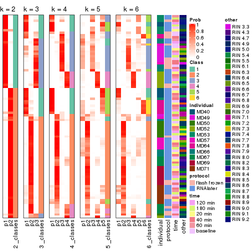


Test correlation between subgroups and known annotations. If the known
annotation is numeric, one-way ANOVA test is applied, and if the known
annotation is discrete, chi-squared contingency table test is applied.

```r
test_to_known_factors(res)
```

```
#>          n individual(p) protocol(p) time(p) other(p) k
#> ATC:NMF 85      1.53e-06     0.01748   0.896   0.0121 2
#> ATC:NMF 78      9.42e-19     0.02908   0.999   0.2106 3
#> ATC:NMF 78      1.21e-21     0.00252   0.994   0.1799 4
#> ATC:NMF 52      2.36e-16     0.25909   0.686   0.0334 5
#> ATC:NMF 68      5.46e-44     0.60509   1.000   0.0963 6
```


If matrix rows can be associated to genes, consider to use `functional_enrichment(res,
...)` to perform function enrichment for the signature genes. See [this vignette](http://bioconductor.org/packages/devel/bioc/vignettes/cola/inst/doc/functional_enrichment.html) for more detailed explanations.


 

## Session info


```r
sessionInfo()
```

```
#> R version 3.6.0 (2019-04-26)
#> Platform: x86_64-pc-linux-gnu (64-bit)
#> Running under: CentOS Linux 7 (Core)
#> 
#> Matrix products: default
#> BLAS:   /usr/lib64/libblas.so.3.4.2
#> LAPACK: /usr/lib64/liblapack.so.3.4.2
#> 
#> locale:
#>  [1] LC_CTYPE=en_GB.UTF-8       LC_NUMERIC=C               LC_TIME=en_GB.UTF-8       
#>  [4] LC_COLLATE=en_GB.UTF-8     LC_MONETARY=en_GB.UTF-8    LC_MESSAGES=en_GB.UTF-8   
#>  [7] LC_PAPER=en_GB.UTF-8       LC_NAME=C                  LC_ADDRESS=C              
#> [10] LC_TELEPHONE=C             LC_MEASUREMENT=en_GB.UTF-8 LC_IDENTIFICATION=C       
#> 
#> attached base packages:
#> [1] grid      stats     graphics  grDevices utils     datasets  methods   base     
#> 
#> other attached packages:
#> [1] genefilter_1.66.0    ComplexHeatmap_2.3.1 markdown_1.1         knitr_1.26          
#> [5] GetoptLong_0.1.7     cola_1.3.2          
#> 
#> loaded via a namespace (and not attached):
#>  [1] circlize_0.4.8       shape_1.4.4          xfun_0.11            slam_0.1-46         
#>  [5] lattice_0.20-38      splines_3.6.0        colorspace_1.4-1     vctrs_0.2.0         
#>  [9] stats4_3.6.0         blob_1.2.0           XML_3.98-1.20        survival_2.44-1.1   
#> [13] rlang_0.4.2          pillar_1.4.2         DBI_1.0.0            BiocGenerics_0.30.0 
#> [17] bit64_0.9-7          RColorBrewer_1.1-2   matrixStats_0.55.0   stringr_1.4.0       
#> [21] GlobalOptions_0.1.1  evaluate_0.14        memoise_1.1.0        Biobase_2.44.0      
#> [25] IRanges_2.18.3       parallel_3.6.0       AnnotationDbi_1.46.1 highr_0.8           
#> [29] Rcpp_1.0.3           xtable_1.8-4         backports_1.1.5      S4Vectors_0.22.1    
#> [33] annotate_1.62.0      skmeans_0.2-11       bit_1.1-14           microbenchmark_1.4-7
#> [37] brew_1.0-6           impute_1.58.0        rjson_0.2.20         png_0.1-7           
#> [41] digest_0.6.23        stringi_1.4.3        polyclip_1.10-0      clue_0.3-57         
#> [45] tools_3.6.0          bitops_1.0-6         magrittr_1.5         eulerr_6.0.0        
#> [49] RCurl_1.95-4.12      RSQLite_2.1.4        tibble_2.1.3         cluster_2.1.0       
#> [53] crayon_1.3.4         pkgconfig_2.0.3      zeallot_0.1.0        Matrix_1.2-17       
#> [57] xml2_1.2.2           httr_1.4.1           R6_2.4.1             mclust_5.4.5        
#> [61] compiler_3.6.0
```


